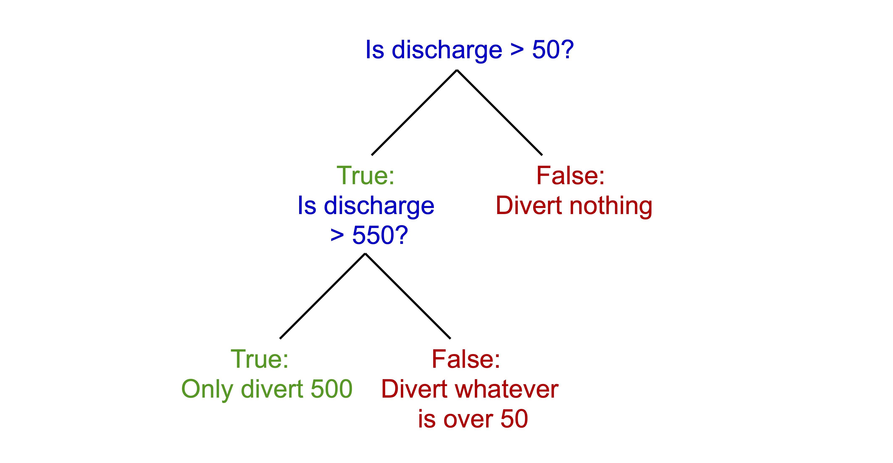

# Module 1: Modelling in Excel {-}

<h2>Environmental Flows to an Estuary</h2>

### Objectives {-}

Become familiar with basic spreadsheet commands in Excel by conducting an environmental flow analysis and building a simple impact model.

### What are environmental flows? {-}

Lakes, rivers and estuaries are adapted to receive water based on the natural hydrological condition, but often water is required upstream for other purposes. An environmental flow is water that is provided to the environment to maintain its health and natural diversity

<center>
<div style="left: 0; width: 100%; height: 0; position: relative; padding-bottom: 56.25%;">
<iframe 
style="border: 0; top: 0; left: 0; width: 100%; height: 100%; position: absolute;" 
src="https://www.youtube.com/embed/BLeA1l0IH3w" 
allowfullscreen scrolling="no" 
allow="encrypted-media; accelerometer; gyroscope; picture-in-picture">
</iframe>
</div>
</center>

### Case study {-}

<center>

{width=750px}

</center>

### Module resources {-}

Download the Excel spreadsheet for this module by clicking the download button in the tool bar <i class="fa fa-download" aria-hidden="true"></i>. 

To annotate this page please join the 'Dynamics Class 2020' [here](https://hypothes.is/groups/eixGdkrM/dynamics-class-2020).

### Exercises {-}

You are given a time-series of daily river flow and need to assess how different diversion scenarios impact the freshwater flow delivery to a down stream estuary.

1) For this flow time-series, calculate the **volume of daily flow** within the following bands
0-40; 40-80; 80-120; 120-200; 200-400; 400-1000; >1000

```{block2, hint1, type='rmdtip2'}
Use a nested `IF()` statement in adjacent columns to partition flows
<center>
{width=100%}
</center>
```

<center>
<video width="100%" height="100%" controls>
  <source src="images/02-module1/video1.mp4" type="video/mp4">
</video>
</center>


2) For this flow time-series, calculate the **number of days** of daily flow within the above bands and work out **annual average number of days**

```{block2, hint2, type='rmdtip2'}
Use `COUNT()` to get the number of entries in the column
```

3) Calculate the **annual amount of flow** in total and in each band

You may do the annual averaging manually or the pivot table method. For the pivot table method: Insert a new column B, Label it Year.
Type the year number into the first cell, make sure it is formatted as a number.

<center>
<video width="100%" height="80%" controls>
  <source src="images/02-module1/video2.mp4" type="video/mp4">
</video>
</center>

Click two times on the little square in the corner of the box.  This will fill down the page.
Repeat this at each year change and you will have the year only information which you can then use to summarise data.  As the original date has day numbers and decimal time each one is unique so you end up with a record for each day.  This way you get a record for each year.

```{block2, hint1_3, type='rmdtip2'}
Use `YEAR()` to speed this step up
```

Highlight all the data.  It must have headings for each column or it won’t work.
Go to “Insert” then “Pivot Table”. Click OK as you want the default settings.
Then you just fiddle until you get what you want. The following is an example:

<center>
<video width="90%" height="90%" controls>
  <source src="images/02-module1/video3.mp4" type="video/mp4">
</video>
</center>

4) **Sort the years** from highest to lowest total annual flow:
    a. Add a new column next to the flows indexing the years sequentially (i.e. 1, 2, 3...)
    b. Add a new column next to the indices calculating the probability of meeting the annual flow: $P(Yri) =  \frac{i}{\text{number of years}+1}$

<center>
  <video width="100%" height="100%" controls>
    <source src="images/02-module1/video4.mp4" type="video/mp4">
  </video>
</center>
|            c. Scatter plot the flow vs probability curve


```{block2, hint1_4, type='rmdtip2'}
Sum each year
```

5) Assess the amount of water available for **flow diversion for two scenarios** by adding a new time-series column for each option:
    a. Water below 50 ML/day and above 550 ML/day is NOT diverted
    b. Water below 150 ML/day and above 1000 ML/day is NOT diverted

```{block2, hint1_5, type='rmdtip2'}
Construct a nested `IF()` that solves the following:
<center>
{width=100%}
</center>
```

6) Add two new columns for each of the above to work out **cumulative amount** (running total) of diverted water
    a. $\text{Cumulated Volume} = \text{Previous Cumulated Volume}+\text{Today's Diverted Discharge}$
7) Create a scatter plot of historical salinity (as EC) collected from the site marked in the map (+) vs daily discharge from the drain (see sheet: Estuary – Salinity).
8) Fit a trendline to the data and display equation and R^2^ – this is a statistical model.
9) In a new time-series column in the previous sheet, use the statistical model from above to predict a salinity time-series for the above station in the estuary under the two diversion scenarios compared to the base case.

### Submission {-}

:::: {.redbox2}
**Submit properly formatted graphs and tables of the following sections of the lab:**

- Q2: Table of the number of days daily flow within the above bands and annual average
number of days
- Q3: Table of the annual amount of flow in total and in each band
- Q4: Table of annual flow by year with index and probability. Scatter plot of the flow vs
probability curve
- Q6: Table of the cumulative amount of diverted water
- Q7 & 8: Scatterplot of the EC vs. daily discharge from the drain, with trendline (hint: exponential), equation and
R2 value
- Q9: Plot of the salinity timeseries of the two diversion scenarios compared to the base case
- In less than 100 words, discuss which is the most appropriate scenario choice for
management of the estuary

These are in a word doc or PDF format. No screenshots of figures from Excel/Excel
spreadsheets to be uploaded

**General professional formatting guidelines:**

- All figures are to have adequate captions explaining them
- For graphs, figure captions go below the plot
- For tables, the caption goes above the table
- Make sure figures and their text size is readable

**Excel hints:**

- When there is a caption for a plot, you remove the title
- Remove the plot border and gridlines
- Make sure both axes have visible lines and tick marks
- Units need to be noted properly with the axis label - 'Temperature (°C)'
- Round numbers to be reasonable
::::


