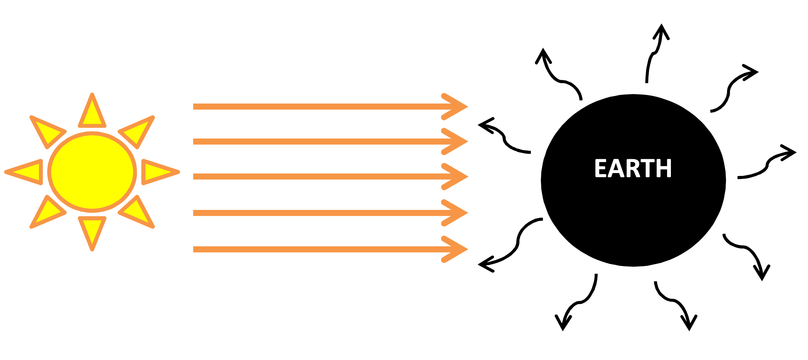

# Module 3: Climate Modeling {-}

## Energy Balance Models {-}

### Objectives {-}

- To construct a simple energy balance climate model for the earth in Excel
- To understand the role of greenhouse gases, and incorporate them into an energy balance climate model 

### Case Study 1: A “Zero-Dimensional” Energy Balance Model {-}

Here, we assume that the Earth is a sphere with uniform surface and no differences with latitude and longitude (i.e. everything receives the same amount of solar energy). We also assume that there is a balance, or equilibrium, between incoming short wavelength solar radiation absorbed by the ground and outgoing long wavelength radiation emitted by the ground.
To simplify the model further, we assume the Earth emits outgoing (longwave) radiation like a “blackbody”, i.e. it is a perfectly efficient radiator - it gives off the maximum amount of radiation that an object of its temperature can emit. 

<center>

{width=650px}

</center>

#### Outgoing Radiation {-}

The rate of the outgoing radiant energy (Joules per second = Watts) from a blackbody is given by the Stefan-Boltzmann equation:

<center>
\begin{equation}
E = \sigma T^{4}
(\#eq:module3-1)
\end{equation}
</center>

|         $\sigma$: Stefan-Boltzmann constant (5.67x10^-8^)
|         $T$: Temperature (in degrees Kelvin)
<br> 
However, for the Earth, this is being emitted over the full surface area of the Earth:

<center>
\begin{equation}
E_{\text{out}} = \sigma 4\pi r^{2} T^{4}
(\#eq:module3-2)
\end{equation}
</center>

|         $r$: Radius of the Earth (in m)

#### Incoming Radiation {-}

The energy absorbed by the earth is given by the amount of incoming solar radiation which is not reflected due to albedo. However, we have to take into account that solar energy is striking the Earth as a parallel beam of circular cross-section. So this incoming beam of radiation hits only a single “disc” of the Earth’s surface at any one time. This area has a surface area $\pi r^{2}$. 

<center>
\begin{equation}
E_{\text{abs}} = S\pi r^{2} (1-a)
(\#eq:module3-3)
\end{equation}
</center>

|         $S$:  Incoming solar radiation: the “solar constant” (1367 W/m^2^) 

#### Exercises {-}

1) Using the concept of an energy balance (i.e. energy in = energy out), rearrange the equations to find the Earth’s temperature, $T$. 

2) In Excel, construct a simple spreadsheet and fill in the blank cells to calculate the mean temperature of the Earth using the equation from Q1., assuming an albedo of 0.33 (including in °C and °F): 

<center>
```{r module3-1, echo=FALSE, message=FALSE, warning=FALSE}
library(knitr)
library(kableExtra)
library(hablar)
library(dplyr)
#options(knitr.kable.NA = '')
module3_1 <- read.csv("tables/module3/module3-1.csv", check.names=FALSE) %>% 
  convert(chr(Value, Units))
kable(module3_1, format = "html", escape = F, align = "c") %>%
  kable_styling(full_width = F, position = "center") %>%
  column_spec(1, width_min = "12em") %>%
  column_spec(2, width_min = "15em") %>%
  column_spec(3, width_min = "12em") %>%
  row_spec(1:6, background = 'white') %>%
  scroll_box(width = "725px",
             fixed_thead = FALSE) 
```
</center>

<br>

```{block2, hint4, type='rmdtip'}
Remember: $K = °C + 273.2$ and $°F = 1.8°C + 32$ 
```

|          a) The current mean temperature of the Earth is 288K (15°C). Does this simple model over or under
|              predict the Earth’s temperature? What important factor is missing from this model?

<br>
3) Test the sensitivity of this model to the choice of albedo. Using values from 0.3 to 0.7, calculate and plot T (°C)

<center>
```{r module3-2, echo=FALSE, message=FALSE, warning=FALSE}
library(knitr)
library(kableExtra)
library(hablar)
library(dplyr)
#options(knitr.kable.NA = '')
module3_2 <- read.csv("tables/module3/module3-2.csv", check.names=FALSE) %>%
  convert(chr("Stefan-Boltzmann constant"))
kable(module3_2, format = "html", escape = F, align = "c") %>%
  kable_styling(full_width = F, position = "center") %>%
  column_spec(1, width_min = "5em") %>%
  column_spec(2, width_min = "5em") %>%
  column_spec(3, width_min = "5em") %>%
  column_spec(4, width_min = "5em") %>%
  column_spec(5, width_min = "5em") %>%
  row_spec(1:5, background = 'white') %>%
  scroll_box(width = "725px",
             fixed_thead = FALSE) 
```
</center>

### Case Study 2: A “quick fix” {-}

To try to reduce the error in the model estimates of Earth’s temperature, we can “parameterise” the model using observed or experimentally derived relationships between outgoing radiation and temperature. One such example is:

<center>
\begin{equation}
E_{\text{out}} = x + yT
(\#eq:module3-4)
\end{equation}
</center>

|         $x = 204$ W/m^2^  
|         $y = 2.17$ W/m^2^/°C

This gets inputted into the energy balance equation (energy in = energy out) to give:

<center>
\begin{equation}
\pi r^{2} S (1-a) = 4\pi r^{2}(X+yT)
(\#eq:module3-4)
\end{equation}
</center>

#### Exercises {-}

1) Solve the above equation for $T$ (note, this time, $T$ is in CELSIUS!)

2) Set up a spreadsheet to estimate T for a range of albedo values. Different amounts of glacial ice cover on the Earth could produce albedos from 0.3 for minimal ice to 0.7 for a complete ice cover (this might seem unrealistic, but geologists have recently found evidence to suggest that the Earth was completely ice-covered during Neoproterozoic time 700 million years ago – a “snowball Earth”!)

<center>
```{r module3-3, echo=FALSE, message=FALSE, warning=FALSE}
library(knitr)
library(kableExtra)
library(hablar)
library(dplyr)
#options(knitr.kable.NA = '')
module3_3 <- read.csv("tables/module3/module3-3.csv", check.names=FALSE) %>%
  convert(chr(Albedo, x, y))
kable(module3_3, format = "html", escape = F, align = "c") %>%
  kable_styling(full_width = F, position = "center") %>%
  column_spec(1, width_min = "5em") %>%
  column_spec(2, width_min = "5em") %>%
  column_spec(3, width_min = "5em") %>%
  column_spec(4, width_min = "5em") %>%
  row_spec(1:5, background = 'white') %>%
  scroll_box(width = "350px",
             fixed_thead = FALSE) 
```
</center>

|          a) Are your results reasonably close for the present-day Earth mean temperature? What is the 
|              sensitivity of this model to small changes in albedo?

|          b) Expanding a bit from your model (you might need to consider smaller steps in albedo), at what 
|              value of albedo do you think thissimplified Earth would experience strong positive feedback 
|              involving ice cover, albedo, and mean temperature, and therefore move rapidly toward “snowball 
|              Earth” with albedo = 0.7? Could it ever be deglaciated?

### Case Study 3: Incorporating Greenhouse Gases {-}

This model is a modification of the one described by @harte1988. He showed that it is appropriate, based on the physics of radiation (as water is the major absolver of terrestrial radiation), to divide the Earth’s atmosphere into a lower layer (from the surface to 1.8km altitude, containing 20% of the air and 50% of the water vapour) and an upper layer (containing 80% of the air and 50% of the water vapour).

This time we require three energy-balance equations:

1. For the Earth-atmosphere system as a whole;
2. For the upper layer of the atmosphere;
3. For the lower layer of the atmosphere.

In this model, all energy terms are expressed as long-term average fluxes, all temperatures are absolute. We assume that emissivity =1 except at the surface, and (most importantly) that each of the three systems is in equilibrium.

<center>
```{r module3-4, echo=FALSE, message=FALSE, warning=FALSE}
library(knitr)
library(kableExtra)
library(hablar)
library(dplyr)
#options(knitr.kable.NA = '')
module3_4 <- read.csv("tables/module3/module3-4.csv", check.names=FALSE) 
kable(module3_4, format = "html", escape = F, align = "c") %>%
  kable_styling(full_width = F, position = "center") %>%
  column_spec(1, width_min = "5em") %>%
  column_spec(2, width_min = "15em") %>%
  column_spec(3, width_min = "13em") %>%
  row_spec(1:12, background = 'white') %>%
  scroll_box(width = "725px", height = "325px",
             fixed_thead = FALSE) 
```
</center>

### Submission {-}
:::: {.redbox}

**Submit properly formatted graphs and tables of the following sections of the lab:**

1. Clear photograph or page scan of your **hand drawn conceptual model** of the *Harte 1-D Energy Balance Model*, including key explaining the terms.
2. Clear photograph or page scan of your **handwritten workings** of the *Harte Model calculations*, with a clear answer of $T$s, the Earth’s temperature.
3. **Summary plots** from Exercise 1, 2 & 3 assessing albedo and temperature of the three models, with a brief explanation of less than 150 words of which model you prefer.

The submission is to be all together in a word doc or PDF format. No screenshots of figures from Excel/Excel spreadsheets to be uploaded.

**General professional formatting guidelines:**

- All figures are to have adequate captions explaining them
- For graphs, figure captions go below the plot
- For tables, the caption goes above the table
- Make sure figures and their text size is readable

**Excel hints:**

- When there is a caption for a plot, you remove the title
- Remove the plot border and gridlines
- Make sure both axes have visible lines and tick marks
- Units need to be noted properly with the axis label - 'Temperature (°C)'
- Round numbers to be reasonable
::::