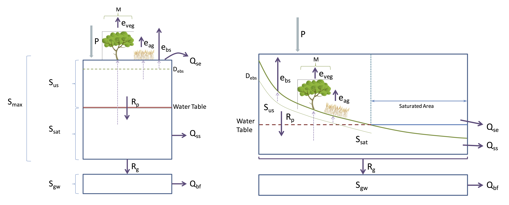
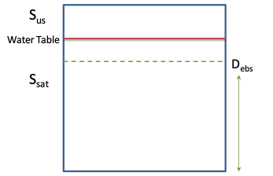
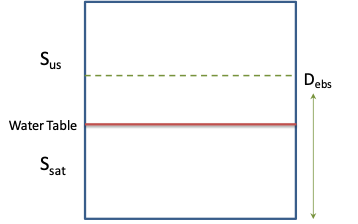

# Module 5: Catchment Water Balance {#M5_1 -}

### Objectives {#M5_2 -}

To understand a simple multi-store catchment water balance model and implement within Excel or R. Using the supplied parameters and input data, run the model and plot the variability in key hydrological pathways.

### The Water Balance Approach {#M5_3 -}

A water balance equation can be used to describe the flow of water in and out of a “system”. A system can be one of several hydrological domains depending on the context, such as a column of soil or a catchment basin. In the context of catchment, we assume the catchment area has a known ‘average’ depth, and the amount of soil is the catchment area multiplied by the depth. We treat this soil volume as our catchment ‘bucket’, and then estimate the inputs (rainfall) and outputs (evapotranspiration, runoff and baseflow).

Based on our understanding of soil physics, flow processes and transpiration, we can further partition water within the bucket into different sub-compartments. In this exercise we assume the catchment bucket can include a saturated and unsaturated layer, and even an optional deeper groundwater system.

The water balance assumes an initial amount of water and then we sequentially estimate the fluxes of water as outlined below in the conceptual diagram.

<center>
```{r module5-2, echo=FALSE, fig.cap="Conceptual model schematic of the 0D ‘bucket’ by Yasmina Elshafei and Matthew Hipsey, adapted from Farmer et al. (2003)", out.width = '90%'}

```
</center>

### Module resources {#M5_22 -}

Download the Excel spreadsheet and R files for this module by clicking the download button in the tool bar <i class="fa fa-download" aria-hidden="true"></i>.

```{block2, hintm5-1, type='rmdnote2'}
You can use either Excel or R for this module.
```


### Water Balance Model {#M5_4 -}

Open the spreadsheet or RStudio project. Make sure that there are three sections in each: Inputs, Equations and Plotting. Draw your own version of the diagram above, label all of the variables and note the storage, evaporation and flows.

#### Date {#M5_5 -}

Have a quick look at the date.

In Excel, the date takes the first four columns of the Equations sheet.

In RStudio, there is a section in the Inputs script called `#DATE`. Run the section line by line and you
will learn how to make dates. Then delete the comments at the end of the section.

#### Climate {#M5_6 -}

As boundary conditions, we have a precipitation dataset, and a function (Equation \@ref(eq:module5-28)) to simulate potential evaporation (Figure \@ref(fig:module5-fig1)).

In Excel, the precipitation is in a column and has a value for every date. The potential evaporation is given by a sin wave function that makes potential evaporation increase in summer and decrease in winter. Copy this formula down the page.

In RStudio, the rainfall is given by a text file ’Precipitation.txt’. You will have to download this text file, tell RStudio the location where you have saved the data, and then load the data into your project. Finally, in the equations, you can convert the precipitation dataset into a matrix.
The parameters for the potential evaporation function are in Inputs, and the equation is in the Equations script. Look for the `#CLIMATE FORCING` sections.

<center>
```{r module5-fig1, fig.cap="Potential evaporation sin wave function over time.", echo=FALSE, message=FALSE, warning=FALSE, out.width='100%',out.height='100%'}
library(ggplot2)
library(lubridate)
library(plotly)
library(dplyr)
evap <- read.csv("plots/module5/evap.csv")
evap$Date <- as.Date(evap$Date)
plot <- ggplot(data=evap, aes(x=Date, y=Evaporation)) +
  geom_line(colour= "#3182bd", size = 1.2) + xlab("Time (years)") + ylab("Potential evaporation (m day<sup>-1</sup>)") + 
              theme_bw() 
ggplotly(plot) %>%
  config(displaylogo = FALSE) 


```
</center>

#### Storage {#M5_7 -}

Start to write in the equations for storage, using the equations given in the [Equations](#M5_12) section of this module. Note that there are two variables that have a prime ($\prime$) sign. These variables only exist theoretically in the model, so that we can use them for our IF statements.


```{block2, hint6_1, type='rmdtip2'}
You may have to convert between storage volumes (m^3^) and heights (m) by multiplying or dividing by area (m^2^).
```

In Excel, there is an initial condition in a box given for you at time step 0. Your equations will start at time step 1. Your whole set of equations will not be finished until you have also completed the evaporation and flows, but you have to start somewhere.

In RStudio, the initial condition is given in the `Inputs` section with the square brackets and the `[1]` (time step 1) and the loop starts at time step 2. For the equations, use the sequence that is given. The code reads from top to bottom so it is important that if a variable is referred to in an equation, it must already have been calculated in a previous line of code. Pay careful attention to the indices for $t$ and $t-1$.

```{block2, hint6_4, type='rmdtip2'}
In Excel, the timestep advances as you go down the page. The notation $t$ could refer to any timestep, with $t-1$ simply being the timestep before $t$, and $t+1$  being the timestep after $t$.

If an equation is written entirely in terms of $t+1$ (e.g. $X^{t+1}= Y^{t+1}+Z^{t+1}$), it can be simplified to be written just in terms of $t$ (e.g. $X^{t}= Y^{t}+Z^{t}$). This is because $t$ is arbitrary and we're just referring to the same timestep for the entire equation. 

<center>
{width=60%}
</center>

```


#### Evapotranspiration {#M5_8 -}

Type in the evapotranspiration equations. Use the previous time step storage values to calculate these.

#### Flows {#M5_9 -}

Type in the flow equations.

#### Plots {#M5_10 -}

When you have finished filling in all the columns, see the [Submission](#M5_21) section for what plots to create and submit.

### Notation {#M5_11 -}

<head>
<meta name="viewport" content="width=device-width, initial-scale=1">
<style>
/* Style the buttons inside the tab */
.tab button {
  background-color: #2481AA;
  float: left;
  width: 25%;
  height: 50%;
  border: none;
  outline: none;
  cursor: pointer;
  padding: 14px 16px;
  transition: 0.3s;
  font-size: 17px;
  color: #FFFFFF;
  font-weight: bold;
}
</style>
</head>
<body>

<div class="tab">
  <button class="tablinks" onclick="opentab(event, 'Forcing/Limiting Variables')"id="defaultOpen">Forcing/Limiting Variables</button>
  <button class="tablinks" onclick="opentab(event, 'Storage Variables')">Storage <br> Variables</button>
  <button class="tablinks" onclick="opentab(event, 'ET Variables/Fluxes')">ET <br> Variables/Fluxes</button>
  <button class="tablinks" onclick="opentab(event, 'Flow Variables/Fluxes')">Flow Variables/Fluxes</button>
</div>

<div id="Forcing/Limiting Variables" class="tabcontent">
  <p>
$P$ = precipitation (m/d)

$e_p$ = potential evaporation (m/d)

$A_c$ = catchment area (m^2^)
  </p>
</div>

<div id="Storage Variables" class="tabcontent">
  <p>
$S_{(t)}$ = total volume of water stored in catchment at time $t$ (m^3^)

$S_{max}$ = maximum storage capacity of bucket/ catchment (m^3^)

$S_{fc}$ = threshold storage i.e. storage at field capacity (m^3^)

$S_{us}$ = water storage in unsaturated zone (m^3^)

$S_{sat}$ = water storage in saturated zone (m^3^)

$S_{gw}$ = water storage in deep store (m^3^)

$f_c$ = threshold storage parameter i.e. 0 < $f_c$ < 1 (dimensionless)

$\theta_{fc}$ = field capacity (dimensionless)

$\theta_{pwp}$ = permanent wilting point (dimensionless)

$\varphi$ = porosity (dimensionless)

$D$ = soil depth from bottom (m)

$D_{ebs}$ = effective depth of influence from the bottom of the saturated zone for bare soil evaporation (m)

$D_{eag}$ = effective depth of influence from the bottom of the saturated zone for agricultural crop evaporation (m)

$S_{us(fc)}$ = current unsaturated zone field capacity (m^3^)
  </p> 
</div>

<div id="ET Variables/Fluxes" class="tabcontent">
  <p>
$e_t$ = total evapotranspiration at time $t$ (m/d)

$e_v$ = transpiration (m/d)

$e_{v(sat)}$, $e_{v(us)}$ = transpiration of deep rooted vegetation from saturated and unsaturated zone, respectively (m/d)

$e_{bs}$ = bare soil evaporation (m/d)

$e_{bs(sat)}$ , $e_{bs(us)}$ = bare soil evaporation from saturated and unsaturated zone, respectively (m/d)

$e_{ag}$ = agricultural crop evapotranspiration (m/d)

$LAI$ = leaf area index (dimensionless)

$M$ = % of catchment covered by deep rooted vegetation (dimensionless)

$C$ = % of catchment covered by shallow rooted agricultural crops (dimensionless)

$k_v$ = vegetation transpiration efficiency (dimensionless)

$K_s$ = saturated hydraulic conductivity (dimensionless)

$\alpha_{ebs}$ = bare soil evaporation scaling factor (dimensionless)

$\alpha_{eag}$ = agriculture evaporation scaling factor (dimensionless)
  </p>
</div>

<div id="Flow Variables/Fluxes" class="tabcontent">
  <p>
$Q_t$ = total runoff at time $t$ (m/d)

$Q_{se}$ = saturation excess surface runoff (m/d)

$Q_{ss}$ = subsurface runoff (m/d)

$Q_{bf}$ = base flow (m/d)

$R_p$ = daily percolation $S_{us} \rightarrow S_{sat}$ (m/d)

$R_g$ = daily recharge $S_{sat} \rightarrow S_{gw}$ (m/d)

$\alpha$, $\beta$ = recession coefficients for subsurface flow from saturated zone

$\alpha_{bf}$, $\beta_{bf}$ = recession coefficients for subsurface flow from groundwater store
  </p>
</div>

<script>
function opentab(evt, tabName) {
  var i, tabcontent, tablinks;
  tabcontent = document.getElementsByClassName("tabcontent");
  for (i = 0; i < tabcontent.length; i++) {
    tabcontent[i].style.display = "none";
  }
  tablinks = document.getElementsByClassName("tablinks");
  for (i = 0; i < tablinks.length; i++) {
    tablinks[i].className = tablinks[i].className.replace(" active", "");
  }
  document.getElementById(tabName).style.display = "block";
  evt.currentTarget.className += " active";
}
document.getElementById("defaultOpen").click();
</script>

</body>


### Equations {#M5_12 -}

#### Maximum Storage Capacity of the Bucket/Catchment  {#M5_13 -}
*Already completed in INPUTS*

<center>
\begin{equation}
S_{max}=D\left(\varphi-\ \theta_{pwp}\right) A_c
(\#eq:module5-1)
\end{equation}
</center>

The theoretical maximum storage capacity of the catchment is calculated by taking the difference between the porosity of the catchment soil (i.e. a measure of the total pore space in the soil, and hence, its ability to store water) and the permanent wilting point of the soil (the point at which volumetric water content is too low to be extracted from the soil by plants) and multiplying it by the volume of the catchment (i.e. surface area multiplied by the depth of the catchment). Note that $S_{max}$ is the sum of $S_{us}$ and $S_{sat}$, and does not include $S_{gw}$.

Note that ‘plant available water’ is the water content difference between field capacity and permanent wilting point of the soil at any given depth.

#### Threshold Storage {#M5_14 -}
*Already completed in INPUTS*

<center>
\begin{equation}
f_c=\ \left(\frac{\theta_{fc}-\ \theta_{pwp}}{\varphi-\ \theta_{pwp}}\right)
(\#eq:module5-2)
\end{equation}
</center>

Field capacity is the point at which all pore space small enough to retain water against the pull of gravity are filled (Brady and Weil, 1999). It is essentially the remaining water content of the soil after the removal of water by the downward forces of gravity over a daily time period. Field capacity therefore assumes that the water removed from the soil profile is only removed by gravity, not through plant suction or evaporation. The above formula calculates the threshold storage parameter as the proportion of ‘plant available water’ over storage capacity of the soil at any given depth.

<center>
\begin{equation}
S_{fc}=\ S_{max} f_c
(\#eq:module5-3)
\end{equation}
</center>

The volumetric water storage at field capacity is therefore the theoretical maximum storage capacity of the catchment multiplied (or limited by) the threshold storage parameter (which is ≤ 1).

#### Water Balance {#M5_15 -}

<center>
\begin{equation}
S_{tot}^{t+1}= S_{tot}^{t}+(P^{t+1}- e_{tot}^{t+1})A_{c} - Q_{tot}^{t+1}
(\#eq:module5-4)
\end{equation}
</center>

Water storage at any given time step, $t$, is calculated using the previous time step’s water storage as a starting point ($t$). Inflows and outflows of water from the system/ bucket are then incorporated to obtain the next consecutive value of $S$. Precipitation recorded in the previous time step (inflow) is added to the initial storage value, whilst total evapotranspiration and total runoff in the previous time step (outflows) are both subtracted. Total water storage is made up of water stored in the saturated and unsaturated zones. Note that the initial value of $S_{tot}$ may be empirically determined or assumed to be a certain value. The initial value of $S_{sat}$ is taken to be $D$ less the depth from the surface to the water table, which can be measured.

<center>
\begin{equation}
S_{us}^{t+1}=\ S_{tot}^{t+1^\prime}-\ S_{sat}^{t+1}
(\#eq:module5-5)
\end{equation}
\begin{equation}
S_{us(fc)}^{t+1}=\ f_c\left(S_{max}-\ S_{sat}^t\right)
(\#eq:module5-6)
\end{equation}
</center>

Threshold storage in the unsaturated zone is simply the maximum potential storage capacity in the unsaturated zone multiplied (limited) by the threshold storage parameter.

<center>
\begin{equation}
S_{us}^{t+1^\prime}=\ S_{us}^t+\ P^{t+1} A_{c} 
(\#eq:module5-7)
\end{equation}
\begin{equation}
R_p^{t+1}=\ S_{us}^{{t+1}^\prime}-\ S_{us(fc)}^{t+1}  ,   \text{if}\ \ \ S_{us}^{{t+1}^\prime}>\ S_{us(fc)}^{t+1}
(\#eq:module5-8)
\end{equation}
</center>

```{block2, hint6_2, type='rmdtip2'}
Equation \@ref(eq:module5-8) is an IF Statement.
```

The daily recharge rate from the unsaturated zone to the saturated zone is calculated as water storage in the unsaturated zone in the present time step, in addition to precipitation that has occurred in the current time step, less the threshold storage of the unsaturated zone (i.e. water which does not drain due to the downward forces of gravity alone). Recharge of this nature only occurs in the event that the combination of precipitation in the current time step and water storage in the unsaturated zone in the present time step is greater than the threshold field capacity of the unsaturated zone.

<center>
\begin{equation}
S_{sat}^{t+1}=\ S_{sat}^t+\ R_p^{t+1}-\ R_g^{t+1}-\ Q_{ss}^{t+1}-\ e_{v}^{t+1}A_{c}
(\#eq:module5-9)
\end{equation}
</center>

Note the use of “$t+1$” on the Right Hand Side for $R$, $Q$ and $e$ will be on the same row since they are computed based on yesterday’s $S$.

The balance of volumetric water storage in the saturated zone is therefore calculated as the previous period’s storage plus any recharge from the unsaturated zone, less outflows including recharge to groundwater, subsurface runoff, and total evapotranspiration (bare soil, deep rooted vegetation and agricultural crop) from the saturated zone.

Optional Deep Ground Water Store:

<center>
\begin{equation}
R_g^{t+1}=\ K_s{S}_{sat}^t
(\#eq:module5-10)
\end{equation}
</center>

Daily recharge to groundwater is calculated as the saturated hydraulic conductivity multiplied by the present water storage in the saturated zone. 

<center>
\begin{equation}
S_{gw}^{t+1}=\ S_{gw}^t+\ R_g^{t+1}-\ Q_{bf}^{t+1}\ 
(\#eq:module5-11)
\end{equation}
</center>

The balance of volumetric groundwater storage is calculated as the previous period’s storage plus recharge from the saturated zone less base flow out of the catchment.

<center>
\begin{equation}
Q_{bf}^{t+1}= \alpha_{bf} (\frac{S_{gw}^t}{S_{gw\ max}})^{\beta_{bf}}
(\#eq:module5-27)
\end{equation}
</center>

Base flow is treated for our purposes as a nonlinear function using groundwater storage.

#### Transpiration {#M5_16 -}

<center>
\begin{equation}
e_{tot}^t=\ e_v^t+\ e_{bs}^t+\ e_{ag}^t
(\#eq:module5-12)
\end{equation}
</center>

Total evapotranspiration (ET) of the system is the sum of ET from deep rooted native vegetation, bare soil and agricultural crops in the catchment.

Native vegetation ET is calculated as follows. 

Simple form:

<center>
\begin{equation}
e_v^{t+1}= M (\frac{S_{tot}^t}{S_{max}})^\varepsilon k_v e_p^{t+1}
(\#eq:module5-13)
\end{equation}
</center>

<!-- More complex form attempts to scale based on water availability in the unsaturated zone and the height of the water table: -->

<!-- <center> -->
<!-- \begin{equation} -->
<!-- e_v = \left\{\begin{matrix} Mk_{v}e_{p},\phantom{-}\phantom{-}\phantom{-} S_{sat}>\varphi D_{ebs}S_{us}^\prime>S_{us(fc)}   -->
<!-- \\ Mk_v\frac{S_{us}^\prime}{S_{fc}}e_p,  \phantom{-}\phantom{-}\phantom{-}\phantom{-}\phantom{-}\phantom{-}\phantom{-} S_{us}^\prime\ <\ S_{us(fc)} -->
<!-- \end{matrix}\right. -->
<!-- (\#eq:module5-14) -->
<!-- \end{equation} -->
<!-- </center> -->

<!-- If water storage in the unsaturated zone combined with precipitation during the period is greater than the field capacity storage threshold of the unsaturated zone and water storage in the saturated zone is greater than the water storage capacity in the bare soil zone of influence, then the % vegetation cover within the catchment is multiplied by the transpiration efficiency of the vegetation (a function of LAI), the result of which is then multiplied by the potential ET.  -->

<!-- To the extent that water storage in the unsaturated zone combined with precipitation during the period is less than field capacity storage in the unsaturated zone, the preceding equation is further multiplied by the proportion of water stored in the unsaturated zone (plus precipitation in the period) over the field capacity threshold of the catchment (i.e. a fraction that will always be <1). -->

<!-- <center> -->
<!-- \begin{equation} -->
<!-- e_{v(sat)}=\ \frac{S_{sat}}{S_t}e_v -->
<!-- (\#eq:module5-15) -->
<!-- \end{equation} -->
<!-- </center> -->

<!-- In cases where the first condition in equation (12) is satisfied, equation (13) may be applied to calculate the proportion of ET emanating from the saturated zone. ET drawn from the saturated zone by deep rooted vegetation is calculated as the proportion of water storage in the saturated zone over the total catchment water storage, multiplied by total deep rooted vegetation ET from equation (12). This function could also be made non-linear if desired. -->

<!-- The conditional rules applying to equations (12), (15), (16), (18) and (19) are expressed diagrammatically below, where $D_{ebs}$ is interchangeable with $D_{eag}$ for the purposes of the illustration. -->

<!-- <center> -->
<!-- ```{r module5-3, echo=FALSE, fig.cap="If  $S_{sat} > \\varphi D_{ebs}$.", out.width = '30%'} -->
<!--  -->
<!-- ``` -->
<!-- </center> -->
<!-- <center> -->
<!-- ```{r module5-4, echo=FALSE, fig.cap="If  $S_{sat} < \\varphi D_{ebs}$.", out.width = '30%'} -->
<!--  -->
<!-- ``` -->
<!-- </center> -->

<!-- <br> -->

<!-- <center> -->
<!-- \begin{equation} -->
<!-- e_{v(us)}=\ e_v-\ e_{v(sat)} -->
<!-- (\#eq:module5-16) -->
<!-- \end{equation} -->
<!-- </center> -->

#### Agricultural/Shallow Root Crop Evapotranspiration {#M5_17 -}

For evapotranspiration by agricultural crops, we make the assumption that they can draw water from the unsaturated zone only, thus:

<!-- <center> -->
<!-- \begin{equation} -->
<!-- e_{ag} = \left\{\begin{matrix} C\alpha_{eag}\left[\frac{S_{us}}{S_{max}-\ S_{sat}}\right]e_p,\ \ &S_{sat}<\varphi D_{eag} -->
<!-- \\C\alpha_{eag}\left[\frac{S_{us}+\ \left(S_{sat}-\ \varphi D_{eag}\right)}{S_{sat}-\ \varphi D_{eag}}\right]e_p,\ \ &S_{sat}\geq\varphi D_{eag} -->
<!-- \end{matrix}\right. -->
<!-- (\#eq:module5-17) -->
<!-- \end{equation} -->
<!-- </center> -->

<!-- In the first case, the water table is below the maximum depth of influence of agricultural crops, and total $e_{ag}$ is thus assumed to come from the unsaturated zone. Whereas in the second case, the water table is above the maximum depth of influence, meaning that $e_{ag}$ will be drawn partially from both the saturated and unsaturated zones.  -->

<!-- In the first case therefore, $e_{ag}$ is calculated as the % of agricultural crop cover in the catchment, multiplied by the agricultural scaling factor (effectively an efficiency parameter), multiplied by the fraction of water stored in the unsaturated zone over the maximum potential water storage within that zone (a limiting variable), multiplied by the potential ET. -->

<!-- In the second case, the fraction is amended to be the sum of the water stored in both the saturated and unsaturated zones within the depth of influence over the proportion that falls below the water table.  -->

<!-- <center> -->
<!-- \begin{equation} -->
<!-- e_{ag}^{t+1}=\ \left[\frac{S_{sat}-\ \varphi D_{eag}}{S_{us}+\ (S_{sat}-\ \varphi D_{eag})}\right]e_{ag},\ \ if\ S_{sat}\geq\varphi D_{eag} -->
<!-- (\#eq:module5-18) -->
<!-- \end{equation} -->
<!-- </center> -->

<!-- The amount of ET that is drawn from the saturated zone is calculated as total ET due to agricultural crops multiplied by the proportion of water stored in the saturated zone within the depth of influence of agricultural crops. -->

<center>
\begin{equation}
e_{ag}^{t+1}=C \alpha_{eag}[\frac{S_{us}^t}{S_{max}-S_{sat}^t}]e_{p}^{t+1}
(\#eq:module5-19)
\end{equation}
</center>

#### Bare Soil Evaporation {#M5_18 -}

<center>
\begin{equation}
e_{bs}^{t+1} = \left\{\begin{matrix} (1-M-C)\alpha_{ebs}\left[\frac{S_{us}^t}{S_{max}-\ S_{sat}^t}\right]e_p^{t+1},\ \ &S_{sat}^t<\varphi D_{ebs} A_c
\\ (1-M-C)\alpha_{ebs}\left[\frac{S_{us}^{t}+\ \left(S_{us}^{t}-\ \varphi D_{ebs}\right)}{S_{sat}^t-\ \varphi D_{ebs}}\right]e_p^{t+1},\ \ &S_{sat}^t\geq\varphi D_{ebs} A_c
\end{matrix}\right.
(\#eq:module5-20)
\end{equation}
</center>

```{block2, hint6_3, type='rmdtip2'}
This is an IF statement. In Excel split this equation up into the ‘TRUE’ and ‘FALSE’ columns.
```

<!-- The bare soil evaporation equations are identical to the agricultural crop ET equations in spirit. -->

<!-- <center> -->
<!-- \begin{equation} -->
<!-- e_{bs(sat)}=\ \left[\frac{S_{sat}-\ \varphi D_{ebs}}{S_{us}+\ (S_{sat}-\ \varphi D_{ebs})}\right]e_{bs},\ \ if\ S_{sat}\geq\varphi D_{ebs} -->
<!-- (\#eq:module5-21) -->
<!-- \end{equation} -->
<!-- \begin{equation} -->
<!-- e_{bs(us)}=\ e_{bs}-\ e_{bs(sat)} -->
<!-- (\#eq:module5-22) -->
<!-- \end{equation} -->
<!-- </center> -->

#### Calculating Daily $e_p$ {#M5_19 -}

Daily potential evaporation will be calculated using a sine wave, as follows:

<center>
\begin{equation}
e_{p(\text{daily})}=\ \frac{e_{p(\text{annual})}}{365}\left[1+A\ \textbf{sin}\left\{B\left(m-1\right)+d\right\}+C\right]\ 
(\#eq:module5-23)
\end{equation}
</center>

Where, $A_{sin}$ is the height of the sine wave (i.e. maximum less minimum value), $B$ is the frequency of the sine wave, $C$ is the minimum $e_{p(\text{daily})}$ (i.e. in mid-winter), $d$ is the day of the month, and $m$ is the month number.

#### Flows {#M5_20 -}

<center>
\begin{equation}
Q_{tot}^t = Q_{se}^t + Q_{ie}^t + Q_{ss}^t
(\#eq:module5-29)
\end{equation}
</center>

Total runoff of the system is the sum of saturation excess, infiltration excess, subsurface
runoff, and (optional) base flow.

<center>
\begin{equation}
Q_{se}^t = \left\{\begin{matrix} {S}_{tot}^{t \prime}-\ S_{max}^t,\ \ &{S}_{tot}^{t \prime}>S_{max}
\\ 0,\ \ &{S}_{tot}^{t \prime}\le S_{max}
\end{matrix}\right.
(\#eq:module5-24)
\end{equation}
</center>

Saturation excess is simply taken as being zero to the extent that water storage in the bucket/ catchment is less than maximum storage capacity. In the event that total water storage exceeds maximum capacity however, any excess is taken to be surface runoff.

<center>
\begin{equation}
Q_{ie}^t = \left\{\begin{matrix} (P^t-I_{max})A_C,\ \ &{P^t}> I_{max}
\\ 0,\ \ &{P^t}\le I_{max}
\end{matrix}\right.
(\#eq:module5-25)
\end{equation}
</center>

Hortonian runoff (infiltration excess):

<center>
\begin{equation}
Q_{ss}^{t+1} = \left\{\begin{matrix} 0,\ \ &S_{sat}^{t}\le S_{usfc}^{t+1}
\\ \alpha_{s}\left(\frac{S_{sat}^t}{S_{max}}\right)^{\beta s,}\ \ &S_{usfc}^{t+1} <\ S_{sat}^t
\end{matrix}\right.
(\#eq:module5-26)
\end{equation}
</center>

<!-- Where $S_{fc}$ is $S_{max}fc$.  -->

Subsurface runoff is taken to be zero in cases where the total water storage is less than field capacity threshold (i.e. thus will not drain due solely to the forces of gravity). In the event that total storage in the bucket/ catchment is greater than threshold storage and less than maximum storage capacity, subsurface runoff is taken as a nonlinear function using the excess above threshold storage and the assigned recession coefficients.

#### Water Table Depth {#M5_23 -}

The water table depth is calculated with the following equation:

<center>
\begin{equation}
WT^{t}= \frac{S_{sat}^{t}}{A_{c}\varphi}
(\#eq:module5-28)
\end{equation}
</center>


## Submission {#M5_21 -}
:::: {.redbox2}

**Submit properly formatted graphs and tables of the following sections of the lab:**

1) Clear photograph or page scan of your hand drawn conceptual model of the Water Balance Model
2) Plot of total water storage over time
3) Plot of $Q_{ie}$ (infiltration excess runoff) and precipitation (on a secondary axis) over time
4) Plot of $Q_{ss}$ (subsurface runoff) and precipitation (on a secondary axis) over time
5) Plot of $e_{Tot}$ (total evaporation) over time

**In less than 100 words write an answer to:**

6) What is the general trend of rainfall over the long term?
7) What is the general trend of storage over the long term? Why does the storage vary over the short term?

These are in a word doc or PDF format. No screenshots of figures from Excel/Excel spreadsheets to be uploaded

**General professional formatting guidelines:**

- All figures are to have adequate captions explaining them
- For graphs, figure captions go below the plot
- For tables, the caption goes above the table
- Make sure figures and their text size is readable

**Excel hints:**

- When there is a caption for a plot, you remove the title
- Remove the plot border and gridlines
- Make sure both axes have visible lines and tick marks
- Units need to be noted properly with the axis label - 'Temperature (°C)'
- Round numbers to be reasonable
::::