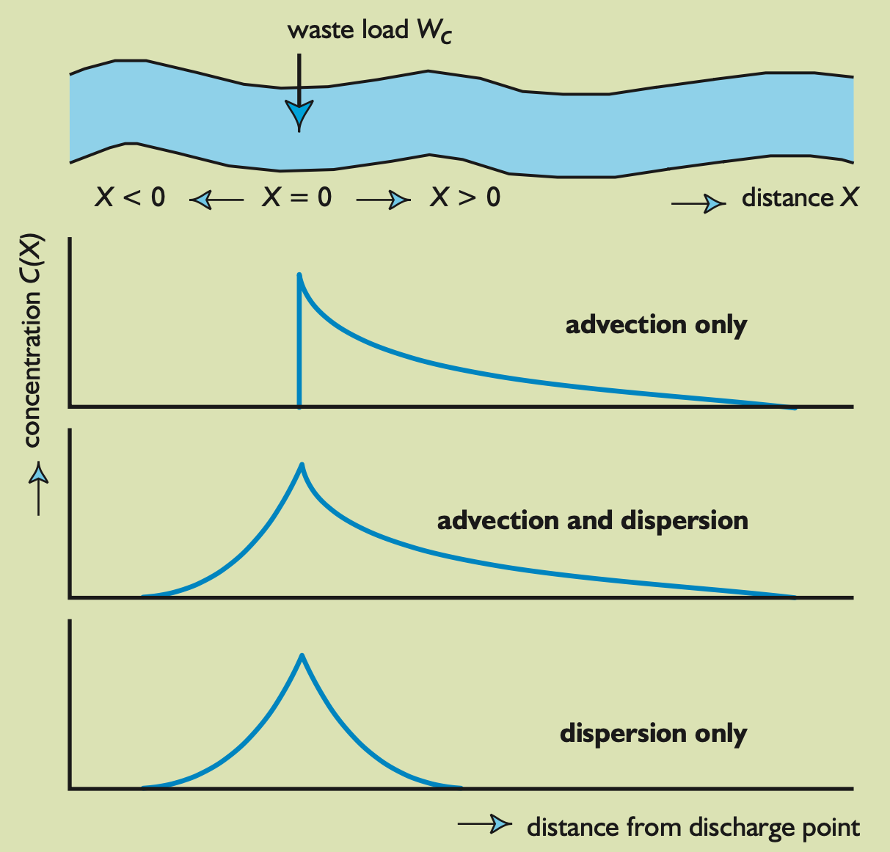
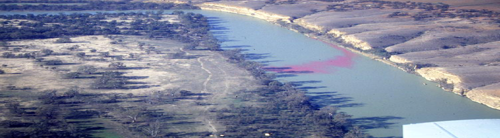

# Module 7: Advection-Dispersion {#M7_1 -}

### Objectives {#M7_2 -}

To setup an advection-dispersion-reaction equation for a river system to demonstrate the combination of **temporal and spatial** finite differencing, in one dimension.


### Advection-Dispersion Reaction {#M7_3 -}

The advection-dispersion reaction equation for a species $C$, is defined as:

<center>
\begin{equation}
\frac{\delta C}{\delta t} = D_{d}\frac{\delta^{2} C}{\delta x^{2}} - u \frac{\delta C}{\delta x} + S + R
(\#eq:module7-1)
\end{equation}
</center>

Where the left hand side (LHS) is the “unsteady” term ($C$ change in time), the first term on the right hand side (RHS) is the dispersion/mixing term, the second term on the RHS is the advection/movement term and $S$ is a source term and $R$ is a reaction term. We use a partial deriviative (“curly $\delta$”) since $C$ is now varying in both space and time.

In this exercise we numerically solve the 1-dimensional, advective-dispersive transport of oxygen in a river. To solve this equation numerically, we must “discretise” the partial derivatives using finite difference methods, here done according to the FTCS scheme (refer to lecture!):

<center>
\begin{equation}
\frac{C^{t+1}_{x}-C^{t}_{x}}{\Delta t}=D_{d} \frac{C_{x+1}^{t}-2C_{x}^{t}+C_{x-1}^{t}}{\Delta x^{2}}-u_{x}^{t} \frac{C_{x+1}^{t}-C_{x-1}^{t}}{2\Delta x}+R_{x}+S_{x}
(\#eq:module7-2)
\end{equation}
</center>

Where the $t$ subscript is referring to timestep, and the $x$ subscript refers to the space increment/position. For the case of oxygen we assume that $R$ is accounting for oxygen input from the atmosphere and consumption by bacteria (called the Biochemical Oxygen Demand, BOD), then:

<center>
\begin{equation}
R_x=k_a\left(C_a-C_x^t\right)-k_{BOD}C_x^t
(\#eq:module7-3)
\end{equation}
</center>

Where the first term is atmospheric exchange ($k_a$ is the rate of re-aeration and $C_a$ is the saturation value of oxygen) and the second term is the bacterial consumption (described by $k_{BOD}$ which is in units of day^-1^). We can solve for the forward timestep at any position along the river by computing:

<center>
\begin{equation}
\small{C_{x}^{t+1}=\color{#898989}{C_{x}^{t}}+ \left [ \color{#3A88FE}{D_d \frac{C_{x+1}^{t}-2C_{x}^{t}+C_{x-1}^{t}}{\Delta x^{2}}}-\color{#FF2600}{u_{x}^{t} \frac{C_{x+1}^{t}-C_{x-1}^{t}}{2\Delta x}} + \color{#77BB41}{k_{a}(C_{a}-C_{x}^{t})}-\color{#B18CFE}{k_{BOD}C_{x}^t}  \right ]\Delta t+\color{#D58400}{S_{x}}}
(\#eq:module7-4)
\end{equation}
</center>

```{block2, hint08_5, type='rmdnote2'}
Previous $C$ concentration: $\color{#898989}{C_{x}^{t}}$ 
  
Diffusion: $\color{#3A88FE}{D_d \frac{C_{x+1}^{t}-2C_{x}^{t}+C_{x-1}^{t}}{\Delta x^{2}}}$
  
Advection: $\color{#FF2600}{u_{x}^{t} \frac{C_{x+1}^{t}-C_{x-1}^{t}}{2\Delta x}}$
  
Atmospherical exchange: $\color{#77BB41}{k_{a}(C_{a}-C_{x}^{t})}$
  
Biological O~2~ demand: $\color{#B18CFE}{k_{BOD}C_{x}^{t}}$
  
O~2~ source/sink: $\color{#D58400}{S_{x}}$

```

To solve this the user specifies the initial oxygen concentration ($C_0$), river velocity ($u$) as a function of distance, grid length ($L$), grid spacing ($\Delta x$), simulation period ($T$), time step ($\Delta t$). The calculation should then compute the change in oxygen as a function of distance and time.

<center>
<video width="100%" height="100%" controls>
  <source src="images/08-module7/video1.mp4" type="video/mp4">
</video>
</center>


Extra sources or sinks of oxygen can by added into the domain based on the $S$ term. We will first set up the model to have no $S$ inputs along the side of the river, but in the last task we add a low oxygen discharge somewhere along the river (ie. a pipe outflow).


### Module Resources {#M7_4 -}

Download the Excel spreadsheet and R files for this module by clicking the download button in the tool bar <i class="fa fa-download" aria-hidden="true"></i>.

```{block2, hint08_1, type='rmdnote2'}
You can use either Excel or R for this module.
```

### Exercises {#M7_5 -}

#### Setting up the Model {#M7_7 -}

1) Draw the schematic of the conceptual model by hand, showing the spatial discretisation, boundaries, sources, reactions, and a little animal swimming in the river.
2) Start with the provided spreadsheet or R script, and implement the above expression. Set up the spreadsheet to assume a river of length ($L$) ~5 km. You will need to select an $x$ increment ($\Delta x$).

```{block2, hint08_2, type='rmdtip2'}
In Excel, time is going down the rows and distance (space) is going along the columns.
```

3) Set the initial condition ($C_0$) row to be 10 mg O~2~/L – i.e. the whole river starts at 10 mg/L in each cell.
4) Once you see the formula is working in the first time-step, then copy the formula along the length of the river. You will need to set a downstream boundary condition (at the the position where $x = L$, the last column). For this we will set a “zero-derivative” condition $– \frac{\delta C}{\delta x} = 0$. Therefore $C_n = C_{n-1}$, where $n$ is the last cell of the river length.
5) Copy the first time row down for all the time-steps (simulate several days in total).
6) Plot the oxygen concentration as a function of distance for several times during the simulation.

#### Modelling a Wastewater Plume {#M7_8 -}

7) Implement at $x \approx 1500\text{m}$ a wastewater plume entering the river – do this by reducing the $C$ at the relevant $x$ cell by 3 mg/L (or less if the $C$ is already below 3). This is done by adding the extra “$S$” term of -3 to the appropriate $x$-cell formula, and copying the formula down through time. Plot and note how the oxygen recovers downstream of the low oxygen inflow plume.

```{block2, hint08_3, type='rmdtip2'}
Use an IF statement. O~2~ concentration cannot be negative, so set a minimum concentration of 0 mg/L
```

<center>
```{r module7-2, echo=FALSE, fig.cap="Advection and dispersion of O~2~ in a river of length $x$. Note, in this figure $W_c$ refers to our wastewater plume (click [here](https://hydrologie.org/BIB/Publ_UNESCO/SR_999_E_2005.pdf) for image source).", out.width = '60%'}

```
</center>

#### Modelling an O~2~ Drop {#M7_9 -}

8) Change the upstream boundary concentration at $x = 0$, to include a sudden drop in oxygen for a period of 0.5 hour. Plot how this signal propagates through the river domain during and after the period where the upstream condition drops – can you see the low oxygen pulse moving through the river? How does this concentration profile vary if the diffusivity is different?

#### Modelling your own Scenario  {#M7_10 -}

9) Create your own environmental scenario using this model, make a brief description of it, calculate a result and if necessary, express the result with a figure. 

```{block2, hint08_4, type='rmdtip2'}
If you see fluctuating negative and positive concentrations, you might have numerical instability. Adjust your $\Delta t$ or $\Delta x$.

```

<center>
```{r module7-1, echo=FALSE, fig.cap="A plume of coloured dye dispersing through a river.", out.width = '100%'}

```
</center>


### Submission {#M7_6 -}
:::: {.redbox2}

**Submit properly formatted graphs and tables of the following sections of the lab:**

1) Clear photograph or page scan of your **hand drawn conceptual model** of the river with all the oxygen transport processes labelled.
2) A plot of oxygen concentration at several times **plotted for all distance of the river**. 
3) A plot of oxygen concentration at several points of the river **plotted for all time**.
4) A plot of the oxygen concentration with the upstream boundary drop at several points of the river **plotted for all time**.
5) A plot of the oxygen concentration with the wastewater plume at several times **plotted for all distance of the river**.
6) A plot of your own individual environmental scenario.
    - Don’t plot too many lines – only several are necessary and use your judgement to select how many show the results well whilst the plot still clear and easy to understand.
    - Make sure your axes are well labelled and clear to read. If abbreviating oxygen, include a subscript in O~2~.

These are in a word doc or PDF format. No screenshots of figures from Excel/Excel spreadsheets to be uploaded

**General professional formatting guidelines:**

- All figures are to have adequate captions explaining them
- For graphs, figure captions go below the plot
- For tables, the caption goes above the table
- Make sure figures and their text size is readable

**Excel hints:**

- When there is a caption for a plot, you remove the title
- Remove the plot border and gridlines
- Make sure both axes have visible lines and tick marks
- Units need to be noted properly with the axis label - 'Temperature (°C)'
- Round numbers to be reasonable
::::
