--- 
title: "Environmental Dynamics Workbook"
author: "Matt Hipsey, Dan Paraska, Alanna Kursar, Giles Knight"
date: "Last updated: 2023-08-25"
site: bookdown::bookdown_site
documentclass: book
bibliography:  ["references/references.bib"]
biblio-style: apalike
link-citations: yes
description: "The online Environmental Dynamics Workbook"
---
# (PART)  Overview {-} 

# Introduction {#intro -}


Welcome to the Environmental Dynamics Workbook! This workbook supplements the practical component of the Environmental Dynamics unit and is designed to develop your ability to model environmental systems. 

Each practical class has a corresponding module that will be added to the workbook as the semester progresses. If you are at all unfamiliar with using Excel or R, please visit the [Getting Started](#GettingStarted) section of this workbook before commencing the first module. 

Please contact your Unit Coordinator or tutor for queries relating to this workbook, or refer to the Unit Outline on LMS for matters relating to the unit's structure. 

#### Contents {-}

1) [Introduction](#intro)
2) [Getting Started](#GettingStarted)
3) [Style Guide](#StyleGuide)
4) [Module 1 - Modelling in Excel](#M1_1)
5) [Module 2 - Biogeochemistry](#M2_1)
6) [Module 3 - Climate Modeling](#M3_1)
7) [Module 4 - Oceanic Acidification](#M4_1)
8) [Module 5a - Catchment Water Balance](#M5A_1)
9) [Module 5b - Land Use and Nutrient Management]({#M5B_1)
10) [Module 6 - River Pollution](#M6_1)
11) [Module 7 - Lake Ecosystem Dynamics](#M7_1)
12) [Final Project](#FinalProject)
13) [Learning the Tidyverse](#tidyverse)
<!-- 14) [Learning the Tidyverse2](#tidyverse2) -->
15) [Modelling Quokkas in R](#quokkas)   
16) [References](#references)

<!--chapter:end:index.Rmd-->

# Getting Started {#GettingStarted -}

<h2>Tools You'll Need</h2>

### Excel {-} 

Excel is available on all computer laboratory PC's and can be freely downloaded to personal devices [here](http://portal.office.com). You should already feel confident using Excel from your previous units, however if you need further guidance please visit UWA's resources:

- [Getting started with Excel](https://www.linkedin.com/learning/excel-essential-training-office-365-microsoft-365)
- [Using formulas and functions in Excel](https://www.linkedin.com/learning/excel-advanced-formulas-and-functions)

### R {-}

To get started with R, first download the base R system onto your computer. By itself, this provides a rudimentary console for interacting with the R programming language. For a more user-friendly experience, download the R Studio integrated development environment (IDE). 

- R can be downloaded [here](https://cran.csiro.au)
- R Studio can be downloaded [here](https://www.rstudio.com/products/rstudio/download/#download)

#### Terminology {-}

**File types** 

In this unit you will largely be dealing with two kinds of 'R files': 

- R script files (e.g. `Equations.R`) and,
- R project files (e.g. `Module2Biogeochem.Rproj`) 

R scripts are the raw instructions that tell the R programming language what to do. Meanwhile, an R Project file simply creates an independent workplace environment for you to interact with and manage your scripts. It's wise to create a new R Project file whenever you start working on a new project. 

**Functions and packages**

Just like Excel, you can interact with your data using a variety of *functions* in R. Functions are the tools you use to get the job done. For example, the `plot()` function can be used to create graphs. R is an open source programming language, meaning anyone can create their own functions and bundle them up in a collection known as a *package*. 

**Comments**

All programming languages allow the user to write comments on their code to assist in readability and structure. In R, a comment is defined as a line beginning with a `#`. Any characters written after the `#` are ignored by R and not executed. It's good practice to get into the habit of commenting your R code as it will likely save you (or someone else!) a lot of time later down the track. 


```r
# This is a comment!
library(tidyverse) # You can load packages with the library() function

# Inspect your data with the head() function
head(iris)

# Create a graph using the ggplot() function
ggplot(data = iris, mapping = aes(x = Petal.Length, y = Petal.Width, colour = Species)) +
  geom_point() +
  theme_light()
```


\BeginKnitrBlock{rmdtip2}<div class="rmdtip2">To comment multiple lines of code at once in R Studio, press`Command + Shift + C`on MacOS or`Control + Shift + C`on Windows</div>\EndKnitrBlock{rmdtip2}


**Further R resources**

If you want to learn more about R and the tidyverse packages, we recommend reading the following (free) textbooks:

- [R for Data Science](https://r4ds.had.co.nz)
- [ggplot2: elegant graphics for data analysis](https://ggplot2-book.org)

### Unzipping files {-}

Many of the module resources found in this workbook are downloaded as 'zipped' (i.e. compressed) files. 'Unzipping' (i.e. extracting) these files is simple. 

On MacOS, simply double click the 'zipped' file:
<center>
<video width="100%" height="100%" controls>
  <source src="images/gettingstarted/video1.mp4" type="video/mp4">
</video>
</center>
<br>

On Windows, click 'Extract All' and follow the prompt:

<center>
<video width="100%" height="100%" controls>
  <source src="images/gettingstarted/video2.mp4" type="video/mp4">
</video>
</center>
<br>

<!--chapter:end:gettingstarted.Rmd-->

# Style Guide {#StyleGuide .unnumbered}

## Text {.unnumbered}

### Units {.unnumbered}

Leave a space between a numeral and a unit. For example, 100 m^3^, not 100m^3^. For inverse units use a slash or a negative power, but be consistent throughout your text. For example 100 L/d or 100 L d^-1^. Pay attention to capital letters: there is a billion-fold difference between mL and ML (millilitres and megalitres). Do not leave a space between a numeral and %. For example, 100%, not 100 %.

Capital M as a unit is known as molar. It is an abbreviation of mol L^-1^. mM is the same as mmol L^-1^, or 1 $\times$ 10^-3^ M.

### Chemicals {.unnumbered}

Elements, compounds and molecules do not start with capital letters. An abbreviation or a chemical symbol has capital letters. Multiple elements in a compound have a subscript and charged molecules have a superscript. For example, carbonate, CO~3~^2-^.

### Fonts {.unnumbered}

Pick an appropriate Seriff or Sans-Seriff font with a size of **12pt**. Commonly used fonts include Arial, Helvetica, Times New Roman and Garamond.

<center>{width="50%"}</center>

Do not use stylised fonts - you know the ones!

<center>{width="35%"}</center>

### Paragraphs {.unnumbered}

Format your paragraphs with the following:

-   **Line spacing:** 1.5pt
-   **Section headings:** 14pt font size and in bold
-   **Margins:** 2cm margins on all sides i.e. top, bottom, left, and right margins

<center>{width="80%"}</center>

Use consistent approach when capatalising your headers/titles:

-   Capitalise at least the first and last word
-   Don't capitalise conjunctions, prepositions, and articles (e.g. the, an, a)

<center>{width="75%"}</center>

## Figures {.unnumbered}

### Positioning {.unnumbered}

Put the figure after it is referred to in the text for the first time, so that the figure is below. Refer to every figure and make sure the figure caption is updated to the right number.

### 3D {.unnumbered}

Do not use 3D plots to visualise your data! They easily misrepresent data and, more often than not, look visually jarring. They can be appropriate for certain types of scatterplots or surface plots when there is a third dimension to the data.

### Colour {.unnumbered}

Rarely are the defaults the best choice for your figure.

When selecting a colour palette:

-   Consider the saturation and brightness of your colours

-   Be considerate of colour blindness and of how colours are commonly interpreted, i.e. if you were mapping surface temperatures you would not use red to colour the cold areas and blue for the hot

-   Use black font and black lines for the axes

-   Do not put a border around the figure

### Captions {.unnumbered}

Captions are positioned below a figure and above a table. They contain a useful description to assist the interpretation of the figure or table. Do not include a title as your caption renders this redundant!

### Timeseries axis {.unnumbered}

If you have a date axis, arrange the dates so that they can be read.

{width="80%"}

Do not let them all crash into each other.

If you have a timespan of many years, do not include days and months in the date tick label. For example, between 1950 and 2000, it does not matter to the reader that a point occurred on 1 January.

{width="80%"}

### Multipanel plots {.unnumbered}

### Unnecessary regressions {.unnumbered}

Do not include a trendline for a series of data that you have calculated yourself. If y = 2x, and you calculate y over a series of x values, a linear regression of this calculation will give you a formula of 2x, with an r^2^ of 1. This regression is not helpful.

{width="80%"}

### Good graphs {.unnumbered}

Include axis labels, with units. Use a legend if you have more than one data series. Spread your tick marks out nicely. Use black lines for the axes and black font for the text.

{width="80%"}

{width="80%"}

### Bad graphs {.unnumbered}

The following graphs leave a lot to be desired! They misrepresent data, lack critical details, and are visually jarring. Take a look at each and read the marker's feedback to get an idea of how your graphs will be assessed.

**Figure 1:**

<center>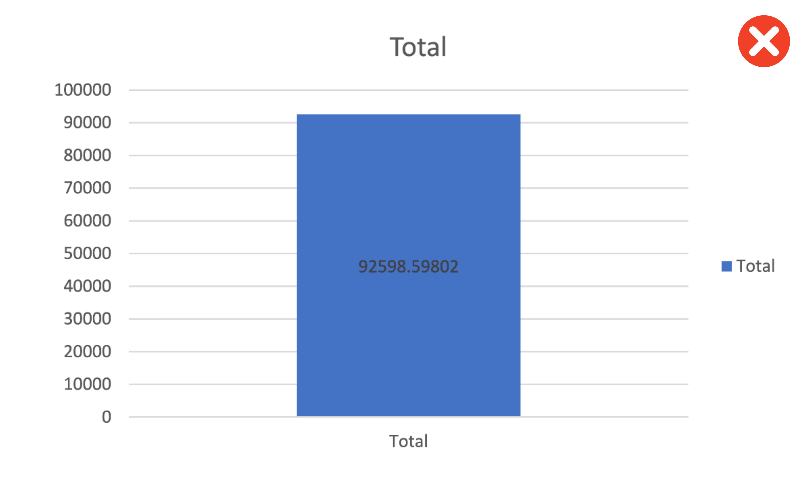{width="80%"}</center>

Feedback:

-   This is a graph of one number on a completely arbitrary scale
-   We've been told it's the total 3 times but not what it's a total of!
-   5 decimal places! With the scale of this y-axis decimal places are serving no useful purpose here
-   There's no units or y-axis label and a title has been used instead of a figure caption

**Figure 2:**

<center>{width="80%"}</center>

Feedback:

-   A 3D visualisation is being used for 2D data
-   No axis labels or units
-   Missing a legend for the two lines plotted

**Figure 3:**

<center>{width="80%"}</center>

Feedback:

-   A pie chart of what?
-   Missing units and a legend
-   Pie charts are a poor choice of visualisation for comparing numbers. The human eye is much less able to distinguish differences of scale for data represented as sectors of a circle compared to rectangles on a bar chart

### Superfluous images {.unnumbered}

Unless specified, your assessments are not picture books! Do not use figures to arbitrarily lengthen your report and add visual clutter. Justify the purpose of each figure you include. When used well, figures should support your writing and illustrate key points to the reader.

<center>{width="80%"}</center>

## Tables {.unnumbered}

All tables must be styled as per the following:

-   **Table font size:** All table information is to be in 10pt font
-   **Line spacing:** Within a table, line spacing is to single line spacing
-   **Decimals:** Within a table column a common decimal place format is to be used
-   **Heading separator:** A single solid line is to be used to separate column headings from numbers
-   **Caption location:** The table caption must be placed above the table
-   **Caption label font:** The caption label is to be in 12pt font
-   **Caption label line spacing:** The caption label line spacing is to be single line spacing
-   **Sub-groups:** Identification of subgroups with a line is optional
-   **Pooled group:** Identification of a pooled group with a dashed line is optional

<center>

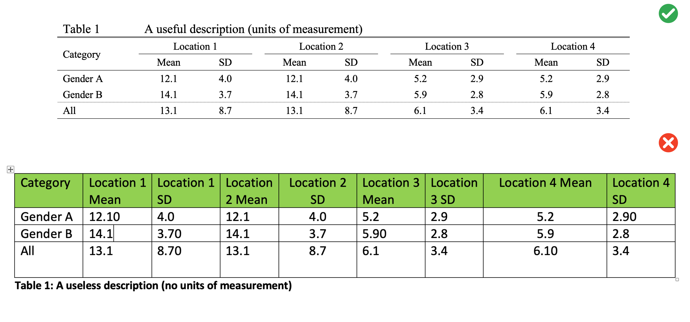

</center>

## Referencing {.unnumbered}

When completing academic work it is essential that you refer to the sources of information within your text, and professionally adhere to referencing standards. Marks will be deducted for inadequate, or poor quality referencing. Complete details of these works should be arranged alphabetically in a reference list at the end of any document or report you submit.

You are permitted to use Harvard or APA reference style. The choice is up to you as long as it is used consistently throughout the document.

1)  When referring to a specific page or pages of a reference:

> Labaree (2006, p. 17) disputed the evidence.

> The findings are suppored in the literature (Labaree, 2006, p.17-18).

2)  When referring to more than one work by the same author(s):

> Fink and Brayman (2004, 2006) expressed similar doubts.

3)  When referring to more than one work in the same year:

> Research in this field has progressed rapidly (Hargreave,s 2005a) (Hargreaves 2005b).

4)  When there are two authors:

> There is mounting evidence of these trends (Tilbury & Wortman, 2003).

> The study built on earlier work by Tilbury and Wortman (2003).

5)  When there are three or more authors:

> New research as revealed substantial differences (Leithwood et al., 1999).

6)  When referring to a publication that has no specific author, but which was written by an organization:

> Global concern is increasing (UNESCO, 1992).

7)  When citing 3 or more works that support the same argument:

> There is a strong concensus in the literature (Andrews, 2015; Brown & Baldwin, 2012; Carter et al., 2016).

## Submissions {.unnumbered}

When uploading your assessments, only submit your work in PDF format - not Word's *.docx*. In Word, you can export your documents to PDF via *File -\> Save As... -\> File Format -\> PDF -\> Save*.

<center>{width="80%"}</center>

<!--chapter:end:styleguide.Rmd-->

# (PART)  Weekly Modules {-} 

# Module 1: Modelling in Excel {#M1_1 -}

<h2>Environmental Flows to an Estuary</h2>

### Objectives {#M1_2 -}

Use scenario assessment to identify the impacts of water diversion on a coastal lake system.
Become familiar with basic spreadsheet commands in Excel by conducting an environmental flow analysis and building a simple impact model.

### What are environmental flows? {#M1_3 -}

Lakes, rivers and estuaries are adapted to receive water based on the natural hydrological condition, but often water is required upstream for other purposes. An environmental flow is water that is provided to the environment to maintain its health and natural diversity

> In simple terms: Provision of water to satisfy environmental requirements for ‘healthy’ (natural) function.

<center>
<div style="left: 0; width: 100%; height: 0; position: relative; padding-bottom: 56.25%;">
<iframe 
style="border: 0; top: 0; left: 0; width: 100%; height: 100%; position: absolute;" 
src="https://www.youtube.com/embed/BLeA1l0IH3w" 
allowfullscreen scrolling="no" 
allow="encrypted-media; accelerometer; gyroscope; picture-in-picture">
</iframe>
</div>
</center>

<br>

> Environmental flows are a form of river/wetland restoration. They are sometimes referred to as "e-flows".

In the Murray-Darling Basin ([MDB](https://www.mdba.gov.au/importance-murray-darling-basin)), a water market was established that allows for irrigation entitlements to be "traded"; e-water must be bought from the "water holder" (in this case that is the Commonwealth Environmental Water Holder, [CEWH](http://www.environment.gov.au/water/cewo)).

### Flow diversion case study: Robe Lakes {#M1_4 -}

What happens if we divert freshwater away from a coastal lake system? How much flow diversion is "acceptable"? 

In this exercise we use a real data-set from the Robe Lakes system in South Australia to explore this question.

<center>
<div class="figure">

```{=html}
<div id="htmlwidget-20dfa11c8557e8e87504" style="width:100%;height:350px;" class="leaflet html-widget"></div>
<script type="application/json" data-for="htmlwidget-20dfa11c8557e8e87504">{"x":{"options":{"crs":{"crsClass":"L.CRS.EPSG3857","code":null,"proj4def":null,"projectedBounds":null,"options":{}}},"setView":[[-37.1700550160659,139.781482414934],15,[]],"calls":[{"method":"addProviderTiles","args":["Esri.WorldImagery",null,null,{"errorTileUrl":"","noWrap":false,"detectRetina":false}]}]},"evals":[],"jsHooks":[]}</script>
```

<p class="caption">(\#fig:map7-1)Explore the case study area with this interactive map.</p>
</div>
</center>

We can  plan for e-water requirements to a highly valued system using scenario modelling, and the concept of a "flow-response model" (or flow-response relationship). In this case we look at an example in South Australia where an assessment for water diversion is being undertaken, and we seek to look at what impact this might have on the salinity of a coastal lake. In other words, if we change the flow regime, what will the response be. In this case, salinity is an environmental indicator of ecological requirements.

Specifically in this example, we assess the impact of diverting water from "Drain L", thereby reducing water to the Robe Lakes. Before we assess our diversion scenario, we must first analyse the historical flow data, to understand the historical flow regime.

<center>
{width=750px}
</center>

### Module resources {#M1_5 -}

Download the Excel spreadsheet for this module by clicking the download button in the tool bar <i class="fa fa-download" aria-hidden="true"></i>. 

### Exercises {#M1_6 -}

You are given a time-series of daily river flow (through the Drain) and need to assess how different diversion scenarios impact the freshwater flow delivery to a down stream estuary.

The steps below allow us to:

- "Bin" (aka categorise) the daily flow into different categories (using an IF statement)
- Summarise the daily flows into annual totals (using a PIVOT table)
- Describe the historical flow variance in terms of an exceedance probability plot
- Create to alternate "diversion scenarios". These are "what-if" type scenarios where we explore what would have occurred if the diversion policy was in place.
- Build a simple empirical (statistical) model linking drain flow rate and estuary response - we measure response in terms of salinity.
- Use the empirical model to show what the salinity in the estuarine lakes would have looked like if the flow diversion policy was in place.

Now that we have an overview, lets get started! Follow closely the below steps from 1 to 9.

1) Categorise the flow into different categories. For this flow time-series, calculate the **volume of daily flow** within the following bands
0-40; 40-80; 80-120; 120-200; 200-400; 400-1000; >1000

\BeginKnitrBlock{rmdtip2}<div class="rmdtip2">Use a nested `IF()` statement in adjacent columns to partition flows
<center>
{width=100%}
</center></div>\EndKnitrBlock{rmdtip2}


```{=html}
<video width="100%" controls>
<source src="images/module1/video1.mp4" type="video/mp4"/>
</video>
```

2) For this flow time-series, calculate the **number of days** of daily flow within the above bands and then work out **annual average number of days**. The latter is simply computed by dividing the total number of days by the number of years in the data-set.

\BeginKnitrBlock{rmdtip2}<div class="rmdtip2">Use `COUNT()` to get the number of entries in the column</div>\EndKnitrBlock{rmdtip2}

3) Calculate the **annual amount of flow** in total and in each flow band.

You may do the annual averaging manually (slow) or the pivot table method (fast). For the pivot table method: Insert a new column B, Label it Year.
Type the year number into the first cell, make sure it is formatted as a number.


```{=html}
<video width="100%" controls>
<source src="images/module1/video2.mp4" type="video/mp4"/>
</video>
```

Click two times on the little square in the corner of the box.  This will fill down the page.
Repeat this at each year change and you will have the year only information which you can then use to summarise data.  As the original date has day numbers and decimal time each one is unique so you end up with a record for each day.  This way you get a record for each year.

\BeginKnitrBlock{rmdtip2}<div class="rmdtip2">Use `YEAR()` to speed this step up</div>\EndKnitrBlock{rmdtip2}

Highlight all the data.  It must have headings for each column or it won’t work.
Go to “Insert” then “Pivot Table”. Click OK as you want the default settings.
Then you just fiddle until you get what you want. The following is an example:


```{=html}
<video width="100%" controls>
<source src="images/module1/video3.mp4" type="video/mp4"/>
</video>
```

4) **Sort the years** from highest to lowest total annual flow:
    a. Add a new column next to the flows indexing the years sequentially (i.e. 1, 2, 3...)
    b. Add a new column next to the indices calculating the probability of meeting the annual flow: $P(Yri) =  \frac{i}{\text{number of years}+1}$


```{=html}
<video width="100%" controls>
<source src="images/module1/video4.mp4" type="video/mp4"/>
</video>
```
   c. Create a scatter plot of the flow (y-axis) vs probability (x-axis) to create an "exceedance" curve


\BeginKnitrBlock{rmdtip2}<div class="rmdtip2">Sum each year</div>\EndKnitrBlock{rmdtip2}

### Flow diversion scenarios {#M1_7 .unnumbered}

5) Assess the amount of water available for **flow diversion for two scenarios** by adding a new time-series column for each option:
    a. Water below 50 ML/day and above 550 ML/day is NOT diverted
    b. Water below 150 ML/day and above 1000 ML/day is NOT diverted

\BeginKnitrBlock{rmdtip2}<div class="rmdtip2">Construct a nested `IF()` that solves the following:
<center>
{width=100%}
</center></div>\EndKnitrBlock{rmdtip2}

6) Add two new columns for each of the above to work out **cumulative amount** (running total) of diverted water
    a. $\small{\text{Cumulated Volume} = \text{Yesterday's Total Diverted Discharge}+\text{Today's Diverted Discharge}}$
    
### Assessing impacts on lake salinity {#M1_8 .unnumbered}

You've now calculated the cumulative amount of water diverted under the two flow diversion scenarios. Next, let's calculate how much water will remain in the Robe Lakes and the impact that this will have on salinity.

7) Calculate the daily flow into the Robe Lakes for both diversion scenarios 

\BeginKnitrBlock{rmdtip2}<div class="rmdtip2">Subtract the volume of today's diverted water from today's inflow</div>\EndKnitrBlock{rmdtip2}

Look at sheet *Estuary – Salinity*. This records data collected at the site marked on the map with a **+**. You will use this data to build a simple statistical model that predicts the salinity from the drain's daily discharge.

8) Start by creating a scatter plot of the historical salinity (as EC) and daily discharge in the *Estuary – Salinity* sheet.
9) Fit a trendline to the data and display equation and R^2^ – this is a statistical model. Look x/y axis, is your model predicting for salinity? 
10) In a new time-series column in the previous sheet, use the statistical model from above to predict a salinity time-series for the Robe Lakes under the two diversion scenarios compared to the base case.

### Submission {#M1_9 -}

In this exercise, we have explored the complexities of allocating water to the environment in a contested situation (i.e., where there are competing "customers" for the water resource).  In particular, we can summarise **environmental flows**:

-   appreciate that there is a potential conflict between e-flow vs irrigation allocation
-   e-flow allocation is a river restoration and maintenance tool
-   the array of benefits from e-water need to quantified and maybe site specific
-   there is a need for identifying "Sustainable Diversion Limits" based on assessment of historical flow requirements.

:::: {.redbox2}
**Submit properly formatted graphs and tables of the following sections of the lab:**

- Q2: Table of the number of days daily flow within the above bands and annual average
number of days
- Q3: Table of the annual amount of flow in total and in each band
- Q4: Table of annual flow by year with index and probability. Scatter plot of the flow vs
probability curve
- Q6: Table of the total cumulative amount of diverted water (i.e. the last value) for both diversion scenarios
- Q7 & 8: Scatterplot of the EC vs. daily discharge from the drain, with trendline (hint: exponential), equation and
R^2^ value
- Q9: Plot of the **annual average** salinity timeseries of the two diversion scenarios compared to the base case
- In less than 100 words, discuss which is the most appropriate scenario choice for
management of the estuary

These are to be uploaded as per the formatting specified in the [Style Guide](#StyleGuide). Marks will be deducted for incorrect formatting.
<!--
These are in a word doc or PDF format. No screenshots of figures from Excel/Excel
spreadsheets to be uploaded

**General professional formatting guidelines:**

- All figures are to have adequate captions explaining them
- For graphs, figure captions go below the plot
- For tables, the caption goes above the table
- Make sure figures and their text size is readable

**Excel hints:**

- When there is a caption for a plot, you remove the title
- Remove the plot border and gridlines
- Make sure both axes have visible lines and tick marks
- Units need to be noted properly with the axis label - 'Temperature (°C)'
- Round numbers to be reasonable
-->
::::


\BeginKnitrBlock{rmdnote2}<div class="rmdnote2">Professional presentation of your results is important. Explore the [short tutorial](#tidyverse) in the Supporting Material section to improve your data viz skills with R's tidyverse package.</div>\EndKnitrBlock{rmdnote2}

<!--chapter:end:module1.Rmd-->

# Module 2: Biogeochemistry {#M2_1 -}

<h2>Bacterially Mediated Organic Matter Oxidation Rates</h2>

### Objectives {#M2_2 -}
Become familiar with basic spread sheet commands in Excel by building a simple biogeochemical model from chemical and mathematical equations. Become familiar with the program R Studio and compare it to Excel.

### Before you start {#M2_before_start -}

- Listen to lecture on ordinary differential equations (ODEs)
- Be familiar with the exponential growth of Quokkas example in Excel
- Review slides on sediment

### Modelling concepts {#M2_3 -}
This model has variables of concentration and rate, no spatial dimensions, and it has a dimension of time. Last week’s model had variables of volume and concentration (salinity), and was also resolved in time. In coming weeks the models will be resolved in zero, one, two or three dimensions of space, and only some will be resolved in time.

Remember that a chemical reaction can be described using a simple differential equation. For the concetration of OM, we can write it as:
<center>
<br>
\begin{equation}
\frac{dOM}{dt} = -R_{OM} =  -k_{OM}OM
(\#eq:module2-1a)
\end{equation}
</center>
<br>
Here, $k_{OM}$ is the rate of the organic matter decay reaction, in units of $/year$, and $OM$ is a concentration of organic matter in units of $mM$.

In this activity going down the rows of the Excel spread sheet means going forward in time, as the differential equations divide the time axis into hundreds of tiny little chunks (i.e., each row is a day in this weeks setup). The concentration at any point in time may depend on concentration at the previous point in time. We use the notation concentration @ ^t^ depends on concentration @ ^t-1^. We write this by "discretizing" the equation, as:
<br>
\begin{equation}
OM^{t} = OM^{t-1} -  (k_{OM} OM^{t-1})\Delta t
(\#eq:module2-1b)
\end{equation}
</center>
<br>
This states that the current concentration is equal to the previous days concentration, subtract any reaction that occured over the past day.

### Organic matter oxidation {#M2_4 -}
Organic matter (dead algae, leaves etc.) is oxidised by different bacteria that use a range of oxidants. The bacteria simultaneously consume organic matter and an oxidant, in a similar way to how humans consume carbohydrate and oxygen. Scientists have observed that there is a general sequence of oxidants used, based on the energy available for each process. When all of the oxidants are consumed, methanogenesis takes place, where bacteria use the organic matter alone without any oxidant. This is similar to the lactic acid metabolic system that the human body uses when oxygen is in short supply, such as when you go for a run. Remember that methane is a reduced byproduct, not an oxidant. Other reduced by-products include N~2~ gas, Mn^2+^ and Fe^2+^ metal ions, and the S^2-^ anion.

We can construct a model to determine the rates at which the oxidation takes place, and use the rates to determine other processes such as oxygen consumption, denitrification or phosphate adsorption.

The rate is dependent on the concentration of the organic matter, $\color{#E36C0A}{OM}$, and a rate constant, $\color{#00B0F0}{k_{OM}}$. The rate is not dependent on the concentration of the oxidant, until the oxidant concentration becomes very low: this process is included as a <span style="color: #76923C;">limitation</span> term (With more O~2~ you do not become super; with less O~2~ you get sleepy). A <span style="color: #76923C;">Monod</span> equation is used to limit the rate.

<center>
<br>
\begin{equation}
R_{O_{2}} = \color{#00B0F0}{k_{OM}}\color{#E36C0A}{OM}\color{#76923C}{\frac{O_{2}}{O_{2}+K_{O_{2}}}}
(\#eq:module2-1)
\end{equation}
</center>
<br>

<div class="figure">

```{=html}
<div id="htmlwidget-af4225322a768212c8b0" style="width:100%;height:480px;" class="plotly html-widget"></div>
<script type="application/json" data-for="htmlwidget-af4225322a768212c8b0">{"x":{"visdat":{"52b07a675cbd":["function () ","plotlyVisDat"]},"cur_data":"52b07a675cbd","attrs":{"52b07a675cbd":{"alpha_stroke":1,"sizes":[10,100],"spans":[1,20],"name":"Monod","y":[0,0.5,0.666666666666667,0.75,0.8,0.833333333333333,0.857142857142857,0.875,0.888888888888889,0.9,0.909090909090909,0,0.333333333333333,0.5,0.6,0.666666666666667,0.714285714285714,0.75,0.777777777777778,0.8,0.818181818181818,0.833333333333333,0,0.25,0.4,0.5,0.571428571428571,0.625,0.666666666666667,0.7,0.727272727272727,0.75,0.769230769230769,0,0.2,0.333333333333333,0.428571428571429,0.5,0.555555555555556,0.6,0.636363636363636,0.666666666666667,0.692307692307692,0.714285714285714,0,0.166666666666667,0.285714285714286,0.375,0.444444444444444,0.5,0.545454545454545,0.583333333333333,0.615384615384615,0.642857142857143,0.666666666666667,0,0.142857142857143,0.25,0.333333333333333,0.4,0.454545454545455,0.5,0.538461538461538,0.571428571428571,0.6,0.625,0,0.125,0.222222222222222,0.3,0.363636363636364,0.416666666666667,0.461538461538462,0.5,0.533333333333333,0.5625,0.588235294117647,0,0.111111111111111,0.2,0.272727272727273,0.333333333333333,0.384615384615385,0.428571428571429,0.466666666666667,0.5,0.529411764705882,0.555555555555556,0,0.1,0.181818181818182,0.25,0.307692307692308,0.357142857142857,0.4,0.4375,0.470588235294118,0.5,0.526315789473684,0,0.0909090909090909,0.166666666666667,0.230769230769231,0.285714285714286,0.333333333333333,0.375,0.411764705882353,0.444444444444444,0.473684210526316,0.5,0,0.0833333333333333,0.153846153846154,0.214285714285714,0.266666666666667,0.3125,0.352941176470588,0.388888888888889,0.421052631578947,0.45,0.476190476190476,0,0.0769230769230769,0.142857142857143,0.2,0.25,0.294117647058824,0.333333333333333,0.368421052631579,0.4,0.428571428571429,0.454545454545455,0,0.0714285714285714,0.133333333333333,0.1875,0.235294117647059,0.277777777777778,0.315789473684211,0.35,0.380952380952381,0.409090909090909,0.434782608695652,0,0.0666666666666667,0.125,0.176470588235294,0.222222222222222,0.263157894736842,0.3,0.333333333333333,0.363636363636364,0.391304347826087,0.416666666666667,0,0.0625,0.117647058823529,0.166666666666667,0.210526315789474,0.25,0.285714285714286,0.318181818181818,0.347826086956522,0.375,0.4,0,0.0588235294117647,0.111111111111111,0.157894736842105,0.2,0.238095238095238,0.272727272727273,0.304347826086957,0.333333333333333,0.36,0.384615384615385,0,0.0555555555555556,0.105263157894737,0.15,0.19047619047619,0.227272727272727,0.260869565217391,0.291666666666667,0.32,0.346153846153846,0.37037037037037,0,0.0526315789473684,0.1,0.142857142857143,0.181818181818182,0.217391304347826,0.25,0.28,0.307692307692308,0.333333333333333,0.357142857142857,0,0.05,0.0952380952380952,0.136363636363636,0.173913043478261,0.208333333333333,0.24,0.269230769230769,0.296296296296296,0.321428571428571,0.344827586206897,0,0.0476190476190476,0.0909090909090909,0.130434782608696,0.166666666666667,0.2,0.230769230769231,0.259259259259259,0.285714285714286,0.310344827586207,0.333333333333333],"x":[0,5,10,15,20,25,30,35,40,45,50,0,5,10,15,20,25,30,35,40,45,50,0,5,10,15,20,25,30,35,40,45,50,0,5,10,15,20,25,30,35,40,45,50,0,5,10,15,20,25,30,35,40,45,50,0,5,10,15,20,25,30,35,40,45,50,0,5,10,15,20,25,30,35,40,45,50,0,5,10,15,20,25,30,35,40,45,50,0,5,10,15,20,25,30,35,40,45,50,0,5,10,15,20,25,30,35,40,45,50,0,5,10,15,20,25,30,35,40,45,50,0,5,10,15,20,25,30,35,40,45,50,0,5,10,15,20,25,30,35,40,45,50,0,5,10,15,20,25,30,35,40,45,50,0,5,10,15,20,25,30,35,40,45,50,0,5,10,15,20,25,30,35,40,45,50,0,5,10,15,20,25,30,35,40,45,50,0,5,10,15,20,25,30,35,40,45,50,0,5,10,15,20,25,30,35,40,45,50,0,5,10,15,20,25,30,35,40,45,50],"frame":[5,5,5,5,5,5,5,5,5,5,5,10,10,10,10,10,10,10,10,10,10,10,15,15,15,15,15,15,15,15,15,15,15,20,20,20,20,20,20,20,20,20,20,20,25,25,25,25,25,25,25,25,25,25,25,30,30,30,30,30,30,30,30,30,30,30,35,35,35,35,35,35,35,35,35,35,35,40,40,40,40,40,40,40,40,40,40,40,45,45,45,45,45,45,45,45,45,45,45,50,50,50,50,50,50,50,50,50,50,50,55,55,55,55,55,55,55,55,55,55,55,60,60,60,60,60,60,60,60,60,60,60,65,65,65,65,65,65,65,65,65,65,65,70,70,70,70,70,70,70,70,70,70,70,75,75,75,75,75,75,75,75,75,75,75,80,80,80,80,80,80,80,80,80,80,80,85,85,85,85,85,85,85,85,85,85,85,90,90,90,90,90,90,90,90,90,90,90,95,95,95,95,95,95,95,95,95,95,95,100,100,100,100,100,100,100,100,100,100,100],"line":{"color":"rgb(118, 146, 60)"},"hovertemplate":"%{y:.1f}<extra><\/extra>","type":"scatter","mode":"lines","inherit":true}},"layout":{"margin":{"b":40,"l":60,"t":25,"r":10},"xaxis":{"domain":[0,1],"automargin":true,"title":"O<sub>2<\/sub> Concentration","range":[-2.5,52.5]},"yaxis":{"domain":[0,1],"automargin":true,"title":"O<sub>2<\/sub>/(O<sub>2<\/sub>+K<sub>O<sub>2<\/sub><\/sub>)","range":[-0.0454545454545455,0.954545454545454]},"hovermode":"closest","showlegend":false,"sliders":[{"steps":[{"method":"animate","args":[["5"],{"transition":{"duration":750,"easing":"linear"},"frame":{"duration":750,"redraw":false},"mode":"immediate"}],"label":"5","value":"5"},{"method":"animate","args":[["10"],{"transition":{"duration":750,"easing":"linear"},"frame":{"duration":750,"redraw":false},"mode":"immediate"}],"label":"10","value":"10"},{"method":"animate","args":[["15"],{"transition":{"duration":750,"easing":"linear"},"frame":{"duration":750,"redraw":false},"mode":"immediate"}],"label":"15","value":"15"},{"method":"animate","args":[["20"],{"transition":{"duration":750,"easing":"linear"},"frame":{"duration":750,"redraw":false},"mode":"immediate"}],"label":"20","value":"20"},{"method":"animate","args":[["25"],{"transition":{"duration":750,"easing":"linear"},"frame":{"duration":750,"redraw":false},"mode":"immediate"}],"label":"25","value":"25"},{"method":"animate","args":[["30"],{"transition":{"duration":750,"easing":"linear"},"frame":{"duration":750,"redraw":false},"mode":"immediate"}],"label":"30","value":"30"},{"method":"animate","args":[["35"],{"transition":{"duration":750,"easing":"linear"},"frame":{"duration":750,"redraw":false},"mode":"immediate"}],"label":"35","value":"35"},{"method":"animate","args":[["40"],{"transition":{"duration":750,"easing":"linear"},"frame":{"duration":750,"redraw":false},"mode":"immediate"}],"label":"40","value":"40"},{"method":"animate","args":[["45"],{"transition":{"duration":750,"easing":"linear"},"frame":{"duration":750,"redraw":false},"mode":"immediate"}],"label":"45","value":"45"},{"method":"animate","args":[["50"],{"transition":{"duration":750,"easing":"linear"},"frame":{"duration":750,"redraw":false},"mode":"immediate"}],"label":"50","value":"50"},{"method":"animate","args":[["55"],{"transition":{"duration":750,"easing":"linear"},"frame":{"duration":750,"redraw":false},"mode":"immediate"}],"label":"55","value":"55"},{"method":"animate","args":[["60"],{"transition":{"duration":750,"easing":"linear"},"frame":{"duration":750,"redraw":false},"mode":"immediate"}],"label":"60","value":"60"},{"method":"animate","args":[["65"],{"transition":{"duration":750,"easing":"linear"},"frame":{"duration":750,"redraw":false},"mode":"immediate"}],"label":"65","value":"65"},{"method":"animate","args":[["70"],{"transition":{"duration":750,"easing":"linear"},"frame":{"duration":750,"redraw":false},"mode":"immediate"}],"label":"70","value":"70"},{"method":"animate","args":[["75"],{"transition":{"duration":750,"easing":"linear"},"frame":{"duration":750,"redraw":false},"mode":"immediate"}],"label":"75","value":"75"},{"method":"animate","args":[["80"],{"transition":{"duration":750,"easing":"linear"},"frame":{"duration":750,"redraw":false},"mode":"immediate"}],"label":"80","value":"80"},{"method":"animate","args":[["85"],{"transition":{"duration":750,"easing":"linear"},"frame":{"duration":750,"redraw":false},"mode":"immediate"}],"label":"85","value":"85"},{"method":"animate","args":[["90"],{"transition":{"duration":750,"easing":"linear"},"frame":{"duration":750,"redraw":false},"mode":"immediate"}],"label":"90","value":"90"},{"method":"animate","args":[["95"],{"transition":{"duration":750,"easing":"linear"},"frame":{"duration":750,"redraw":false},"mode":"immediate"}],"label":"95","value":"95"},{"method":"animate","args":[["100"],{"transition":{"duration":750,"easing":"linear"},"frame":{"duration":750,"redraw":false},"mode":"immediate"}],"label":"100","value":"100"}],"visible":true,"pad":{"t":40},"currentvalue":{"prefix":"K<sub>O<sub>2<\/sub><\/sub>: "}}],"updatemenus":[{"type":"buttons","direction":"right","showactive":false,"y":0,"x":0,"yanchor":"top","xanchor":"right","pad":{"t":60,"r":5},"buttons":[{"label":"Play","method":"animate","args":[null,{"fromcurrent":true,"mode":"immediate","transition":{"duration":750,"easing":"linear"},"frame":{"duration":750,"redraw":false}}]}]}]},"source":"A","config":{"modeBarButtonsToAdd":["hoverclosest","hovercompare"],"showSendToCloud":false,"displayModeBar":false,"displaylogo":false},"data":[{"name":"Monod","y":[0,0.5,0.666666666666667,0.75,0.8,0.833333333333333,0.857142857142857,0.875,0.888888888888889,0.9,0.909090909090909],"x":[0,5,10,15,20,25,30,35,40,45,50],"frame":"5","line":{"color":"rgb(118, 146, 60)"},"hovertemplate":["%{y:.1f}<extra><\/extra>","%{y:.1f}<extra><\/extra>","%{y:.1f}<extra><\/extra>","%{y:.1f}<extra><\/extra>","%{y:.1f}<extra><\/extra>","%{y:.1f}<extra><\/extra>","%{y:.1f}<extra><\/extra>","%{y:.1f}<extra><\/extra>","%{y:.1f}<extra><\/extra>","%{y:.1f}<extra><\/extra>","%{y:.1f}<extra><\/extra>"],"type":"scatter","mode":"lines","marker":{"color":"rgba(31,119,180,1)","line":{"color":"rgba(31,119,180,1)"}},"error_y":{"color":"rgba(31,119,180,1)"},"error_x":{"color":"rgba(31,119,180,1)"},"xaxis":"x","yaxis":"y","visible":true}],"highlight":{"on":"plotly_click","persistent":false,"dynamic":false,"selectize":false,"opacityDim":0.2,"selected":{"opacity":1},"debounce":0},"frames":[{"name":"5","data":[{"name":"Monod","y":[0,0.5,0.666666666666667,0.75,0.8,0.833333333333333,0.857142857142857,0.875,0.888888888888889,0.9,0.909090909090909],"x":[0,5,10,15,20,25,30,35,40,45,50],"frame":"5","line":{"color":"rgb(118, 146, 60)"},"hovertemplate":["%{y:.1f}<extra><\/extra>","%{y:.1f}<extra><\/extra>","%{y:.1f}<extra><\/extra>","%{y:.1f}<extra><\/extra>","%{y:.1f}<extra><\/extra>","%{y:.1f}<extra><\/extra>","%{y:.1f}<extra><\/extra>","%{y:.1f}<extra><\/extra>","%{y:.1f}<extra><\/extra>","%{y:.1f}<extra><\/extra>","%{y:.1f}<extra><\/extra>"],"type":"scatter","mode":"lines","marker":{"color":"rgba(31,119,180,1)","line":{"color":"rgba(31,119,180,1)"}},"error_y":{"color":"rgba(31,119,180,1)"},"error_x":{"color":"rgba(31,119,180,1)"},"xaxis":"x","yaxis":"y","visible":true}],"traces":[0]},{"name":"10","data":[{"name":"Monod","y":[0,0.333333333333333,0.5,0.6,0.666666666666667,0.714285714285714,0.75,0.777777777777778,0.8,0.818181818181818,0.833333333333333],"x":[0,5,10,15,20,25,30,35,40,45,50],"frame":"10","line":{"color":"rgb(118, 146, 60)"},"hovertemplate":["%{y:.1f}<extra><\/extra>","%{y:.1f}<extra><\/extra>","%{y:.1f}<extra><\/extra>","%{y:.1f}<extra><\/extra>","%{y:.1f}<extra><\/extra>","%{y:.1f}<extra><\/extra>","%{y:.1f}<extra><\/extra>","%{y:.1f}<extra><\/extra>","%{y:.1f}<extra><\/extra>","%{y:.1f}<extra><\/extra>","%{y:.1f}<extra><\/extra>"],"type":"scatter","mode":"lines","marker":{"color":"rgba(31,119,180,1)","line":{"color":"rgba(31,119,180,1)"}},"error_y":{"color":"rgba(31,119,180,1)"},"error_x":{"color":"rgba(31,119,180,1)"},"xaxis":"x","yaxis":"y","visible":true}],"traces":[0]},{"name":"15","data":[{"name":"Monod","y":[0,0.25,0.4,0.5,0.571428571428571,0.625,0.666666666666667,0.7,0.727272727272727,0.75,0.769230769230769],"x":[0,5,10,15,20,25,30,35,40,45,50],"frame":"15","line":{"color":"rgb(118, 146, 60)"},"hovertemplate":["%{y:.1f}<extra><\/extra>","%{y:.1f}<extra><\/extra>","%{y:.1f}<extra><\/extra>","%{y:.1f}<extra><\/extra>","%{y:.1f}<extra><\/extra>","%{y:.1f}<extra><\/extra>","%{y:.1f}<extra><\/extra>","%{y:.1f}<extra><\/extra>","%{y:.1f}<extra><\/extra>","%{y:.1f}<extra><\/extra>","%{y:.1f}<extra><\/extra>"],"type":"scatter","mode":"lines","marker":{"color":"rgba(31,119,180,1)","line":{"color":"rgba(31,119,180,1)"}},"error_y":{"color":"rgba(31,119,180,1)"},"error_x":{"color":"rgba(31,119,180,1)"},"xaxis":"x","yaxis":"y","visible":true}],"traces":[0]},{"name":"20","data":[{"name":"Monod","y":[0,0.2,0.333333333333333,0.428571428571429,0.5,0.555555555555556,0.6,0.636363636363636,0.666666666666667,0.692307692307692,0.714285714285714],"x":[0,5,10,15,20,25,30,35,40,45,50],"frame":"20","line":{"color":"rgb(118, 146, 60)"},"hovertemplate":["%{y:.1f}<extra><\/extra>","%{y:.1f}<extra><\/extra>","%{y:.1f}<extra><\/extra>","%{y:.1f}<extra><\/extra>","%{y:.1f}<extra><\/extra>","%{y:.1f}<extra><\/extra>","%{y:.1f}<extra><\/extra>","%{y:.1f}<extra><\/extra>","%{y:.1f}<extra><\/extra>","%{y:.1f}<extra><\/extra>","%{y:.1f}<extra><\/extra>"],"type":"scatter","mode":"lines","marker":{"color":"rgba(31,119,180,1)","line":{"color":"rgba(31,119,180,1)"}},"error_y":{"color":"rgba(31,119,180,1)"},"error_x":{"color":"rgba(31,119,180,1)"},"xaxis":"x","yaxis":"y","visible":true}],"traces":[0]},{"name":"25","data":[{"name":"Monod","y":[0,0.166666666666667,0.285714285714286,0.375,0.444444444444444,0.5,0.545454545454545,0.583333333333333,0.615384615384615,0.642857142857143,0.666666666666667],"x":[0,5,10,15,20,25,30,35,40,45,50],"frame":"25","line":{"color":"rgb(118, 146, 60)"},"hovertemplate":["%{y:.1f}<extra><\/extra>","%{y:.1f}<extra><\/extra>","%{y:.1f}<extra><\/extra>","%{y:.1f}<extra><\/extra>","%{y:.1f}<extra><\/extra>","%{y:.1f}<extra><\/extra>","%{y:.1f}<extra><\/extra>","%{y:.1f}<extra><\/extra>","%{y:.1f}<extra><\/extra>","%{y:.1f}<extra><\/extra>","%{y:.1f}<extra><\/extra>"],"type":"scatter","mode":"lines","marker":{"color":"rgba(31,119,180,1)","line":{"color":"rgba(31,119,180,1)"}},"error_y":{"color":"rgba(31,119,180,1)"},"error_x":{"color":"rgba(31,119,180,1)"},"xaxis":"x","yaxis":"y","visible":true}],"traces":[0]},{"name":"30","data":[{"name":"Monod","y":[0,0.142857142857143,0.25,0.333333333333333,0.4,0.454545454545455,0.5,0.538461538461538,0.571428571428571,0.6,0.625],"x":[0,5,10,15,20,25,30,35,40,45,50],"frame":"30","line":{"color":"rgb(118, 146, 60)"},"hovertemplate":["%{y:.1f}<extra><\/extra>","%{y:.1f}<extra><\/extra>","%{y:.1f}<extra><\/extra>","%{y:.1f}<extra><\/extra>","%{y:.1f}<extra><\/extra>","%{y:.1f}<extra><\/extra>","%{y:.1f}<extra><\/extra>","%{y:.1f}<extra><\/extra>","%{y:.1f}<extra><\/extra>","%{y:.1f}<extra><\/extra>","%{y:.1f}<extra><\/extra>"],"type":"scatter","mode":"lines","marker":{"color":"rgba(31,119,180,1)","line":{"color":"rgba(31,119,180,1)"}},"error_y":{"color":"rgba(31,119,180,1)"},"error_x":{"color":"rgba(31,119,180,1)"},"xaxis":"x","yaxis":"y","visible":true}],"traces":[0]},{"name":"35","data":[{"name":"Monod","y":[0,0.125,0.222222222222222,0.3,0.363636363636364,0.416666666666667,0.461538461538462,0.5,0.533333333333333,0.5625,0.588235294117647],"x":[0,5,10,15,20,25,30,35,40,45,50],"frame":"35","line":{"color":"rgb(118, 146, 60)"},"hovertemplate":["%{y:.1f}<extra><\/extra>","%{y:.1f}<extra><\/extra>","%{y:.1f}<extra><\/extra>","%{y:.1f}<extra><\/extra>","%{y:.1f}<extra><\/extra>","%{y:.1f}<extra><\/extra>","%{y:.1f}<extra><\/extra>","%{y:.1f}<extra><\/extra>","%{y:.1f}<extra><\/extra>","%{y:.1f}<extra><\/extra>","%{y:.1f}<extra><\/extra>"],"type":"scatter","mode":"lines","marker":{"color":"rgba(31,119,180,1)","line":{"color":"rgba(31,119,180,1)"}},"error_y":{"color":"rgba(31,119,180,1)"},"error_x":{"color":"rgba(31,119,180,1)"},"xaxis":"x","yaxis":"y","visible":true}],"traces":[0]},{"name":"40","data":[{"name":"Monod","y":[0,0.111111111111111,0.2,0.272727272727273,0.333333333333333,0.384615384615385,0.428571428571429,0.466666666666667,0.5,0.529411764705882,0.555555555555556],"x":[0,5,10,15,20,25,30,35,40,45,50],"frame":"40","line":{"color":"rgb(118, 146, 60)"},"hovertemplate":["%{y:.1f}<extra><\/extra>","%{y:.1f}<extra><\/extra>","%{y:.1f}<extra><\/extra>","%{y:.1f}<extra><\/extra>","%{y:.1f}<extra><\/extra>","%{y:.1f}<extra><\/extra>","%{y:.1f}<extra><\/extra>","%{y:.1f}<extra><\/extra>","%{y:.1f}<extra><\/extra>","%{y:.1f}<extra><\/extra>","%{y:.1f}<extra><\/extra>"],"type":"scatter","mode":"lines","marker":{"color":"rgba(31,119,180,1)","line":{"color":"rgba(31,119,180,1)"}},"error_y":{"color":"rgba(31,119,180,1)"},"error_x":{"color":"rgba(31,119,180,1)"},"xaxis":"x","yaxis":"y","visible":true}],"traces":[0]},{"name":"45","data":[{"name":"Monod","y":[0,0.1,0.181818181818182,0.25,0.307692307692308,0.357142857142857,0.4,0.4375,0.470588235294118,0.5,0.526315789473684],"x":[0,5,10,15,20,25,30,35,40,45,50],"frame":"45","line":{"color":"rgb(118, 146, 60)"},"hovertemplate":["%{y:.1f}<extra><\/extra>","%{y:.1f}<extra><\/extra>","%{y:.1f}<extra><\/extra>","%{y:.1f}<extra><\/extra>","%{y:.1f}<extra><\/extra>","%{y:.1f}<extra><\/extra>","%{y:.1f}<extra><\/extra>","%{y:.1f}<extra><\/extra>","%{y:.1f}<extra><\/extra>","%{y:.1f}<extra><\/extra>","%{y:.1f}<extra><\/extra>"],"type":"scatter","mode":"lines","marker":{"color":"rgba(31,119,180,1)","line":{"color":"rgba(31,119,180,1)"}},"error_y":{"color":"rgba(31,119,180,1)"},"error_x":{"color":"rgba(31,119,180,1)"},"xaxis":"x","yaxis":"y","visible":true}],"traces":[0]},{"name":"50","data":[{"name":"Monod","y":[0,0.0909090909090909,0.166666666666667,0.230769230769231,0.285714285714286,0.333333333333333,0.375,0.411764705882353,0.444444444444444,0.473684210526316,0.5],"x":[0,5,10,15,20,25,30,35,40,45,50],"frame":"50","line":{"color":"rgb(118, 146, 60)"},"hovertemplate":["%{y:.1f}<extra><\/extra>","%{y:.1f}<extra><\/extra>","%{y:.1f}<extra><\/extra>","%{y:.1f}<extra><\/extra>","%{y:.1f}<extra><\/extra>","%{y:.1f}<extra><\/extra>","%{y:.1f}<extra><\/extra>","%{y:.1f}<extra><\/extra>","%{y:.1f}<extra><\/extra>","%{y:.1f}<extra><\/extra>","%{y:.1f}<extra><\/extra>"],"type":"scatter","mode":"lines","marker":{"color":"rgba(31,119,180,1)","line":{"color":"rgba(31,119,180,1)"}},"error_y":{"color":"rgba(31,119,180,1)"},"error_x":{"color":"rgba(31,119,180,1)"},"xaxis":"x","yaxis":"y","visible":true}],"traces":[0]},{"name":"55","data":[{"name":"Monod","y":[0,0.0833333333333333,0.153846153846154,0.214285714285714,0.266666666666667,0.3125,0.352941176470588,0.388888888888889,0.421052631578947,0.45,0.476190476190476],"x":[0,5,10,15,20,25,30,35,40,45,50],"frame":"55","line":{"color":"rgb(118, 146, 60)"},"hovertemplate":["%{y:.1f}<extra><\/extra>","%{y:.1f}<extra><\/extra>","%{y:.1f}<extra><\/extra>","%{y:.1f}<extra><\/extra>","%{y:.1f}<extra><\/extra>","%{y:.1f}<extra><\/extra>","%{y:.1f}<extra><\/extra>","%{y:.1f}<extra><\/extra>","%{y:.1f}<extra><\/extra>","%{y:.1f}<extra><\/extra>","%{y:.1f}<extra><\/extra>"],"type":"scatter","mode":"lines","marker":{"color":"rgba(31,119,180,1)","line":{"color":"rgba(31,119,180,1)"}},"error_y":{"color":"rgba(31,119,180,1)"},"error_x":{"color":"rgba(31,119,180,1)"},"xaxis":"x","yaxis":"y","visible":true}],"traces":[0]},{"name":"60","data":[{"name":"Monod","y":[0,0.0769230769230769,0.142857142857143,0.2,0.25,0.294117647058824,0.333333333333333,0.368421052631579,0.4,0.428571428571429,0.454545454545455],"x":[0,5,10,15,20,25,30,35,40,45,50],"frame":"60","line":{"color":"rgb(118, 146, 60)"},"hovertemplate":["%{y:.1f}<extra><\/extra>","%{y:.1f}<extra><\/extra>","%{y:.1f}<extra><\/extra>","%{y:.1f}<extra><\/extra>","%{y:.1f}<extra><\/extra>","%{y:.1f}<extra><\/extra>","%{y:.1f}<extra><\/extra>","%{y:.1f}<extra><\/extra>","%{y:.1f}<extra><\/extra>","%{y:.1f}<extra><\/extra>","%{y:.1f}<extra><\/extra>"],"type":"scatter","mode":"lines","marker":{"color":"rgba(31,119,180,1)","line":{"color":"rgba(31,119,180,1)"}},"error_y":{"color":"rgba(31,119,180,1)"},"error_x":{"color":"rgba(31,119,180,1)"},"xaxis":"x","yaxis":"y","visible":true}],"traces":[0]},{"name":"65","data":[{"name":"Monod","y":[0,0.0714285714285714,0.133333333333333,0.1875,0.235294117647059,0.277777777777778,0.315789473684211,0.35,0.380952380952381,0.409090909090909,0.434782608695652],"x":[0,5,10,15,20,25,30,35,40,45,50],"frame":"65","line":{"color":"rgb(118, 146, 60)"},"hovertemplate":["%{y:.1f}<extra><\/extra>","%{y:.1f}<extra><\/extra>","%{y:.1f}<extra><\/extra>","%{y:.1f}<extra><\/extra>","%{y:.1f}<extra><\/extra>","%{y:.1f}<extra><\/extra>","%{y:.1f}<extra><\/extra>","%{y:.1f}<extra><\/extra>","%{y:.1f}<extra><\/extra>","%{y:.1f}<extra><\/extra>","%{y:.1f}<extra><\/extra>"],"type":"scatter","mode":"lines","marker":{"color":"rgba(31,119,180,1)","line":{"color":"rgba(31,119,180,1)"}},"error_y":{"color":"rgba(31,119,180,1)"},"error_x":{"color":"rgba(31,119,180,1)"},"xaxis":"x","yaxis":"y","visible":true}],"traces":[0]},{"name":"70","data":[{"name":"Monod","y":[0,0.0666666666666667,0.125,0.176470588235294,0.222222222222222,0.263157894736842,0.3,0.333333333333333,0.363636363636364,0.391304347826087,0.416666666666667],"x":[0,5,10,15,20,25,30,35,40,45,50],"frame":"70","line":{"color":"rgb(118, 146, 60)"},"hovertemplate":["%{y:.1f}<extra><\/extra>","%{y:.1f}<extra><\/extra>","%{y:.1f}<extra><\/extra>","%{y:.1f}<extra><\/extra>","%{y:.1f}<extra><\/extra>","%{y:.1f}<extra><\/extra>","%{y:.1f}<extra><\/extra>","%{y:.1f}<extra><\/extra>","%{y:.1f}<extra><\/extra>","%{y:.1f}<extra><\/extra>","%{y:.1f}<extra><\/extra>"],"type":"scatter","mode":"lines","marker":{"color":"rgba(31,119,180,1)","line":{"color":"rgba(31,119,180,1)"}},"error_y":{"color":"rgba(31,119,180,1)"},"error_x":{"color":"rgba(31,119,180,1)"},"xaxis":"x","yaxis":"y","visible":true}],"traces":[0]},{"name":"75","data":[{"name":"Monod","y":[0,0.0625,0.117647058823529,0.166666666666667,0.210526315789474,0.25,0.285714285714286,0.318181818181818,0.347826086956522,0.375,0.4],"x":[0,5,10,15,20,25,30,35,40,45,50],"frame":"75","line":{"color":"rgb(118, 146, 60)"},"hovertemplate":["%{y:.1f}<extra><\/extra>","%{y:.1f}<extra><\/extra>","%{y:.1f}<extra><\/extra>","%{y:.1f}<extra><\/extra>","%{y:.1f}<extra><\/extra>","%{y:.1f}<extra><\/extra>","%{y:.1f}<extra><\/extra>","%{y:.1f}<extra><\/extra>","%{y:.1f}<extra><\/extra>","%{y:.1f}<extra><\/extra>","%{y:.1f}<extra><\/extra>"],"type":"scatter","mode":"lines","marker":{"color":"rgba(31,119,180,1)","line":{"color":"rgba(31,119,180,1)"}},"error_y":{"color":"rgba(31,119,180,1)"},"error_x":{"color":"rgba(31,119,180,1)"},"xaxis":"x","yaxis":"y","visible":true}],"traces":[0]},{"name":"80","data":[{"name":"Monod","y":[0,0.0588235294117647,0.111111111111111,0.157894736842105,0.2,0.238095238095238,0.272727272727273,0.304347826086957,0.333333333333333,0.36,0.384615384615385],"x":[0,5,10,15,20,25,30,35,40,45,50],"frame":"80","line":{"color":"rgb(118, 146, 60)"},"hovertemplate":["%{y:.1f}<extra><\/extra>","%{y:.1f}<extra><\/extra>","%{y:.1f}<extra><\/extra>","%{y:.1f}<extra><\/extra>","%{y:.1f}<extra><\/extra>","%{y:.1f}<extra><\/extra>","%{y:.1f}<extra><\/extra>","%{y:.1f}<extra><\/extra>","%{y:.1f}<extra><\/extra>","%{y:.1f}<extra><\/extra>","%{y:.1f}<extra><\/extra>"],"type":"scatter","mode":"lines","marker":{"color":"rgba(31,119,180,1)","line":{"color":"rgba(31,119,180,1)"}},"error_y":{"color":"rgba(31,119,180,1)"},"error_x":{"color":"rgba(31,119,180,1)"},"xaxis":"x","yaxis":"y","visible":true}],"traces":[0]},{"name":"85","data":[{"name":"Monod","y":[0,0.0555555555555556,0.105263157894737,0.15,0.19047619047619,0.227272727272727,0.260869565217391,0.291666666666667,0.32,0.346153846153846,0.37037037037037],"x":[0,5,10,15,20,25,30,35,40,45,50],"frame":"85","line":{"color":"rgb(118, 146, 60)"},"hovertemplate":["%{y:.1f}<extra><\/extra>","%{y:.1f}<extra><\/extra>","%{y:.1f}<extra><\/extra>","%{y:.1f}<extra><\/extra>","%{y:.1f}<extra><\/extra>","%{y:.1f}<extra><\/extra>","%{y:.1f}<extra><\/extra>","%{y:.1f}<extra><\/extra>","%{y:.1f}<extra><\/extra>","%{y:.1f}<extra><\/extra>","%{y:.1f}<extra><\/extra>"],"type":"scatter","mode":"lines","marker":{"color":"rgba(31,119,180,1)","line":{"color":"rgba(31,119,180,1)"}},"error_y":{"color":"rgba(31,119,180,1)"},"error_x":{"color":"rgba(31,119,180,1)"},"xaxis":"x","yaxis":"y","visible":true}],"traces":[0]},{"name":"90","data":[{"name":"Monod","y":[0,0.0526315789473684,0.1,0.142857142857143,0.181818181818182,0.217391304347826,0.25,0.28,0.307692307692308,0.333333333333333,0.357142857142857],"x":[0,5,10,15,20,25,30,35,40,45,50],"frame":"90","line":{"color":"rgb(118, 146, 60)"},"hovertemplate":["%{y:.1f}<extra><\/extra>","%{y:.1f}<extra><\/extra>","%{y:.1f}<extra><\/extra>","%{y:.1f}<extra><\/extra>","%{y:.1f}<extra><\/extra>","%{y:.1f}<extra><\/extra>","%{y:.1f}<extra><\/extra>","%{y:.1f}<extra><\/extra>","%{y:.1f}<extra><\/extra>","%{y:.1f}<extra><\/extra>","%{y:.1f}<extra><\/extra>"],"type":"scatter","mode":"lines","marker":{"color":"rgba(31,119,180,1)","line":{"color":"rgba(31,119,180,1)"}},"error_y":{"color":"rgba(31,119,180,1)"},"error_x":{"color":"rgba(31,119,180,1)"},"xaxis":"x","yaxis":"y","visible":true}],"traces":[0]},{"name":"95","data":[{"name":"Monod","y":[0,0.05,0.0952380952380952,0.136363636363636,0.173913043478261,0.208333333333333,0.24,0.269230769230769,0.296296296296296,0.321428571428571,0.344827586206897],"x":[0,5,10,15,20,25,30,35,40,45,50],"frame":"95","line":{"color":"rgb(118, 146, 60)"},"hovertemplate":["%{y:.1f}<extra><\/extra>","%{y:.1f}<extra><\/extra>","%{y:.1f}<extra><\/extra>","%{y:.1f}<extra><\/extra>","%{y:.1f}<extra><\/extra>","%{y:.1f}<extra><\/extra>","%{y:.1f}<extra><\/extra>","%{y:.1f}<extra><\/extra>","%{y:.1f}<extra><\/extra>","%{y:.1f}<extra><\/extra>","%{y:.1f}<extra><\/extra>"],"type":"scatter","mode":"lines","marker":{"color":"rgba(31,119,180,1)","line":{"color":"rgba(31,119,180,1)"}},"error_y":{"color":"rgba(31,119,180,1)"},"error_x":{"color":"rgba(31,119,180,1)"},"xaxis":"x","yaxis":"y","visible":true}],"traces":[0]},{"name":"100","data":[{"name":"Monod","y":[0,0.0476190476190476,0.0909090909090909,0.130434782608696,0.166666666666667,0.2,0.230769230769231,0.259259259259259,0.285714285714286,0.310344827586207,0.333333333333333],"x":[0,5,10,15,20,25,30,35,40,45,50],"frame":"100","line":{"color":"rgb(118, 146, 60)"},"hovertemplate":["%{y:.1f}<extra><\/extra>","%{y:.1f}<extra><\/extra>","%{y:.1f}<extra><\/extra>","%{y:.1f}<extra><\/extra>","%{y:.1f}<extra><\/extra>","%{y:.1f}<extra><\/extra>","%{y:.1f}<extra><\/extra>","%{y:.1f}<extra><\/extra>","%{y:.1f}<extra><\/extra>","%{y:.1f}<extra><\/extra>","%{y:.1f}<extra><\/extra>"],"type":"scatter","mode":"lines","marker":{"color":"rgba(31,119,180,1)","line":{"color":"rgba(31,119,180,1)"}},"error_y":{"color":"rgba(31,119,180,1)"},"error_x":{"color":"rgba(31,119,180,1)"},"xaxis":"x","yaxis":"y","visible":true}],"traces":[0]}],"shinyEvents":["plotly_hover","plotly_click","plotly_selected","plotly_relayout","plotly_brushed","plotly_brushing","plotly_clickannotation","plotly_doubleclick","plotly_deselect","plotly_afterplot","plotly_sunburstclick"],"base_url":"https://plot.ly"},"evals":[],"jsHooks":[]}</script>
```

<p class="caption">(\#fig:M2Plot1)Move the slider to see the effect of changing the $K_{O_2}$ value in the monod equaiton.</p>
</div>

The generally observed sequence of oxidants is modelled with an <span style="color: #FF0000;">inhibition</span> process, so that a higher energy yielding oxidant, such as oxygen, inhibits a lower energy oxidant such as iron.

<center>
<br>
\begin{align*}
R_{NO_{3}} &= \color{#00B0F0}{k_{OM}}\color{#E36C0A}{OM}\color{#76923C}{\frac{NO_{3}}{NO_{3}+K_{NO_{3}}}}\color{#FF0000}{\frac{K_{O_{2}}}{O_{2}+K_{O_{2}}}}
(\#eq:module2-2)\\
R_{Mn} &= \color{#00B0F0}{k_{OM}}\color{#E36C0A}{OM}\color{#76923C}{\frac{Mn}{Mn+K_{Mn}}}\color{#FF0000}{\frac{K_{NO_{3}}}{NO_{3}+K_{NO_{3}}}}\color{#FF0000}{\frac{K_{O_{2}}}{O_{2}+K_{O_{2}}}}
(\#eq:module2-3)\\
R_{Fe} &= \color{#00B0F0}{k_{OM}}\color{#E36C0A}{OM}\color{#76923C}{\frac{Fe}{Fe+K_{Fe}}}\color{#FF0000}{\frac{K_{Mn}}{Mn+K_{Mn}}}\color{#FF0000}{\frac{K_{NO_{3}}}{NO_{3}+K_{NO_{3}}}}\color{#FF0000}{\frac{K_{O_{2}}}{O_{2}+K_{O_{2}}}}
(\#eq:module2-4) \\
R_{SO_{4}} &= \color{#00B0F0}{k_{OM}}\color{#E36C0A}{OM}\color{#76923C}{\frac{SO_{4}^{2-}}{SO_{4}^{2-}+K_{SO_{4}}}}\color{#FF0000}{\frac{K_{Fe}}{Fe+K_{Fe}}}\color{#FF0000}{\frac{K_{Mn}}{Mn+K_{Mn}}}\color{#FF0000}{\frac{K_{NO_{3}}}{NO_{3}+K_{NO_{3}}}}\color{#FF0000}{\frac{K_{O_{2}}}{O_{2}+K_{O_{2}}}}
(\#eq:module2-5)\\
R_{Meth} &= \color{#00B0F0}{k_{OM}}\color{#E36C0A}{OM}\color{#FF0000}{\frac{K_{SO_{4}}}{SO_{4}^{2-}+K_{SO_{4}}}}\color{#FF0000}{\frac{K_{Fe}}{Fe+K_{Fe}}}\color{#FF0000}{\frac{K_{Mn}}{Mn+K_{Mn}}}\color{#FF0000}{\frac{K_{NO_{3}}}{NO_{3}+K_{NO_{3}}}}\color{#FF0000}{\frac{K_{O_{2}}}{O_{2}+K_{O_{2}}}}
(\#eq:module2-6)\\
\end{align*}
</center>
<br>

Note that the total amount of $OM$ decay, $R_{OM}$, is the sum of the all the individual pathways listed above.

In this lab, we simulate a blob of aquatic sediment. It is a closed system, so that the initial concentrations react until they reach equilibrium. This system is also perfectly mixed, with an unchanging biomass of bacteria, and so there is no spatial resolution. This allows us to focus on the chemical reactions alone.

### Module resources {#M2_5 -}

Download the Excel spreadsheet and R scripts for this module by clicking the download button in the tool bar <i class="fa fa-download" aria-hidden="true"></i>.

### Exercises {#M2_6 -}

#### Building the model in Excel {#M2_7 -}

1) Looking at the sequence of equations above: what is the difference between the limitation and the inhibition term? Have a good think about this. If concentration were amazingly bigger or smaller than the $K_{O_{x}}$^[Where $K_{O_{x}}$ is the general term for the half saturation constant of any oxidant, for example $K_{O_{2}}$, $K_{SO_{4}}$ etc.], what would happen to the rates of the higher and lower energy processes? For example, with a high oxygen concentration, what would happen to the manganese reduction rate? With a low oxygen and nitrate concentration, and a high manganese concentration, what would happen to the manganese oxidation rate?


2) Complete the Excel spreadsheet for iron reduction, sulfate reduction and methanogenesis. Oxygen, nitrate and manganese are done already, so copy the method and use the equations at the tops of the columns. It is tedious, fiddly and there is a good chance that you will introduce bugs that are hard to find. This is the nature of Excel.


```{=html}
<video width="100%" controls>
<source src="images/module2/video1.mp4" type="video/mp4"/>
</video>
```

\BeginKnitrBlock{rmdnote2}<div class="rmdnote2">The rate is dependent on the concentration in the previous time step – this is called an *explicit* solution (as opposed to *implicit*).</div>\EndKnitrBlock{rmdnote2}

3) Complete the line plot (**1**) of relative oxidant concentration for iron and sulphate. Right click on the plot and use ‘Add data’, make the x axis time and the y axis relative concentration. It is easy to visualise if you keep the colours consistent, and choose the colours that you like. Adjust the values for the initial condition and the half-saturation constants and see how the lines move on your plot. Add more time steps underneath if you want to see what happens over the long term.

4) Complete the area plot (**2**) of reaction rates, then play around with the numbers to test the sensitivities of the outputs to the parameter inputs

<div class="figure">

```{=html}
<div id="htmlwidget-39fc9069b579898f2158" style="width:100%;height:480px;" class="plotly html-widget"></div>
<script type="application/json" data-for="htmlwidget-39fc9069b579898f2158">{"x":{"visdat":{"52b02f7b732b":["function () ","plotlyVisDat"]},"cur_data":"52b02f7b732b","attrs":{"52b02f7b732b":{"alpha_stroke":1,"sizes":[10,100],"spans":[1,20],"name":"OM","x":[0.00273972602739726,0.0164383561643836,0.0301369863013699,0.0438356164383562,0.0575342465753425,0.0712328767123288,0.0849315068493151,0.0986301369863014,0.112328767123288,0.126027397260274,0.13972602739726,0.153424657534247,0.167123287671233,0.180821917808219,0.194520547945205,0.208219178082192,0.221917808219178,0.235616438356164,0.249315068493151,0.263013698630137,0.276712328767123,0.29041095890411,0.304109589041096,0.317808219178082,0.331506849315069,0.345205479452055,0.358904109589041,0.372602739726027,0.386301369863014,0.4,0.413698630136986,0.427397260273973,0.441095890410959,0.454794520547945,0.468493150684932,0.482191780821918,0.495890410958904,0.50958904109589,0.523287671232877,0.536986301369863,0.550684931506849,0.564383561643836,0.578082191780822,0.591780821917808,0.605479452054794,0.619178082191781,0.632876712328767,0.646575342465753,0.66027397260274,0.673972602739726,0.687671232876712,0.701369863013699,0.715068493150685,0.728767123287671,0.742465753424658,0.756164383561644,0.76986301369863,0.783561643835616,0.797260273972603,0.810958904109589,0.824657534246575,0.838356164383562,0.852054794520548,0.865753424657534,0.879452054794521,0.893150684931507,0.906849315068493,0.920547945205479,0.934246575342466,0.947945205479452,0.961643835616438,0.975342465753425,0.989041095890411,1.0027397260274,1.01643835616438,1.03013698630137,1.04383561643836,1.05753424657534,1.07123287671233,1.08493150684932,1.0986301369863,1.11232876712329,1.12602739726027,1.13972602739726,1.15342465753425,1.16712328767123,1.18082191780822,1.19452054794521,1.20821917808219,1.22191780821918,1.23561643835616,1.24931506849315,1.26301369863014,1.27671232876712,1.29041095890411,1.3041095890411,1.31780821917808,1.33150684931507,1.34520547945205,1.35890410958904,1.37260273972603,1.38630136986301,1.4,1.41369863013699,1.42739726027397,1.44109589041096,1.45479452054795,1.46849315068493,1.48219178082192,1.4958904109589,1.50958904109589,1.52328767123288,1.53698630136986,1.55068493150685,1.56438356164384,1.57808219178082,1.59178082191781,1.60547945205479,1.61917808219178,1.63287671232877,1.64657534246575,1.66027397260274,1.67397260273973,1.68767123287671,1.7013698630137,1.71506849315068,1.72876712328767,1.74246575342466,1.75616438356164,1.76986301369863,1.78356164383562,1.7972602739726,1.81095890410959,1.82465753424658,1.83835616438356,1.85205479452055,1.86575342465753,1.87945205479452,1.89315068493151,1.90684931506849,1.92054794520548,1.93424657534247,1.94794520547945,1.96164383561644,1.97534246575342,1.98904109589041,2.0027397260274,2.01643835616438,2.03013698630137,2.04383561643836,2.05753424657534,2.07123287671233,2.08493150684932,2.0986301369863,2.11232876712329,2.12602739726027,2.13972602739726,2.15342465753425,2.16712328767123,2.18082191780822,2.19452054794521,2.20821917808219,2.22191780821918,2.23561643835616,2.24931506849315,2.26301369863014,2.27671232876712,2.29041095890411,2.3041095890411,2.31780821917808,2.33150684931507,2.34520547945205,2.35890410958904,2.37260273972603,2.38630136986301,2.4,2.41369863013699,2.42739726027397,2.44109589041096,2.45479452054795,2.46849315068493,2.48219178082192,2.4958904109589,2.50958904109589,2.52328767123288,2.53698630136986,2.55068493150685,2.56438356164384,2.57808219178082,2.59178082191781,2.60547945205479,2.61917808219178,2.63287671232877,2.64657534246575,2.66027397260274,2.67397260273973,2.68767123287671,2.7013698630137,2.71506849315068,2.72876712328767,0.00273972602739726,0.0164383561643836,0.0301369863013699,0.0438356164383562,0.0575342465753425,0.0712328767123288,0.0849315068493151,0.0986301369863014,0.112328767123288,0.126027397260274,0.13972602739726,0.153424657534247,0.167123287671233,0.180821917808219,0.194520547945205,0.208219178082192,0.221917808219178,0.235616438356164,0.249315068493151,0.263013698630137,0.276712328767123,0.29041095890411,0.304109589041096,0.317808219178082,0.331506849315069,0.345205479452055,0.358904109589041,0.372602739726027,0.386301369863014,0.4,0.413698630136986,0.427397260273973,0.441095890410959,0.454794520547945,0.468493150684932,0.482191780821918,0.495890410958904,0.50958904109589,0.523287671232877,0.536986301369863,0.550684931506849,0.564383561643836,0.578082191780822,0.591780821917808,0.605479452054794,0.619178082191781,0.632876712328767,0.646575342465753,0.66027397260274,0.673972602739726,0.687671232876712,0.701369863013699,0.715068493150685,0.728767123287671,0.742465753424658,0.756164383561644,0.76986301369863,0.783561643835616,0.797260273972603,0.810958904109589,0.824657534246575,0.838356164383562,0.852054794520548,0.865753424657534,0.879452054794521,0.893150684931507,0.906849315068493,0.920547945205479,0.934246575342466,0.947945205479452,0.961643835616438,0.975342465753425,0.989041095890411,1.0027397260274,1.01643835616438,1.03013698630137,1.04383561643836,1.05753424657534,1.07123287671233,1.08493150684932,1.0986301369863,1.11232876712329,1.12602739726027,1.13972602739726,1.15342465753425,1.16712328767123,1.18082191780822,1.19452054794521,1.20821917808219,1.22191780821918,1.23561643835616,1.24931506849315,1.26301369863014,1.27671232876712,1.29041095890411,1.3041095890411,1.31780821917808,1.33150684931507,1.34520547945205,1.35890410958904,1.37260273972603,1.38630136986301,1.4,1.41369863013699,1.42739726027397,1.44109589041096,1.45479452054795,1.46849315068493,1.48219178082192,1.4958904109589,1.50958904109589,1.52328767123288,1.53698630136986,1.55068493150685,1.56438356164384,1.57808219178082,1.59178082191781,1.60547945205479,1.61917808219178,1.63287671232877,1.64657534246575,1.66027397260274,1.67397260273973,1.68767123287671,1.7013698630137,1.71506849315068,1.72876712328767,1.74246575342466,1.75616438356164,1.76986301369863,1.78356164383562,1.7972602739726,1.81095890410959,1.82465753424658,1.83835616438356,1.85205479452055,1.86575342465753,1.87945205479452,1.89315068493151,1.90684931506849,1.92054794520548,1.93424657534247,1.94794520547945,1.96164383561644,1.97534246575342,1.98904109589041,2.0027397260274,2.01643835616438,2.03013698630137,2.04383561643836,2.05753424657534,2.07123287671233,2.08493150684932,2.0986301369863,2.11232876712329,2.12602739726027,2.13972602739726,2.15342465753425,2.16712328767123,2.18082191780822,2.19452054794521,2.20821917808219,2.22191780821918,2.23561643835616,2.24931506849315,2.26301369863014,2.27671232876712,2.29041095890411,2.3041095890411,2.31780821917808,2.33150684931507,2.34520547945205,2.35890410958904,2.37260273972603,2.38630136986301,2.4,2.41369863013699,2.42739726027397,2.44109589041096,2.45479452054795,2.46849315068493,2.48219178082192,2.4958904109589,2.50958904109589,2.52328767123288,2.53698630136986,2.55068493150685,2.56438356164384,2.57808219178082,2.59178082191781,2.60547945205479,2.61917808219178,2.63287671232877,2.64657534246575,2.66027397260274,2.67397260273973,2.68767123287671,2.7013698630137,2.71506849315068,2.72876712328767,0.00273972602739726,0.0164383561643836,0.0301369863013699,0.0438356164383562,0.0575342465753425,0.0712328767123288,0.0849315068493151,0.0986301369863014,0.112328767123288,0.126027397260274,0.13972602739726,0.153424657534247,0.167123287671233,0.180821917808219,0.194520547945205,0.208219178082192,0.221917808219178,0.235616438356164,0.249315068493151,0.263013698630137,0.276712328767123,0.29041095890411,0.304109589041096,0.317808219178082,0.331506849315069,0.345205479452055,0.358904109589041,0.372602739726027,0.386301369863014,0.4,0.413698630136986,0.427397260273973,0.441095890410959,0.454794520547945,0.468493150684932,0.482191780821918,0.495890410958904,0.50958904109589,0.523287671232877,0.536986301369863,0.550684931506849,0.564383561643836,0.578082191780822,0.591780821917808,0.605479452054794,0.619178082191781,0.632876712328767,0.646575342465753,0.66027397260274,0.673972602739726,0.687671232876712,0.701369863013699,0.715068493150685,0.728767123287671,0.742465753424658,0.756164383561644,0.76986301369863,0.783561643835616,0.797260273972603,0.810958904109589,0.824657534246575,0.838356164383562,0.852054794520548,0.865753424657534,0.879452054794521,0.893150684931507,0.906849315068493,0.920547945205479,0.934246575342466,0.947945205479452,0.961643835616438,0.975342465753425,0.989041095890411,1.0027397260274,1.01643835616438,1.03013698630137,1.04383561643836,1.05753424657534,1.07123287671233,1.08493150684932,1.0986301369863,1.11232876712329,1.12602739726027,1.13972602739726,1.15342465753425,1.16712328767123,1.18082191780822,1.19452054794521,1.20821917808219,1.22191780821918,1.23561643835616,1.24931506849315,1.26301369863014,1.27671232876712,1.29041095890411,1.3041095890411,1.31780821917808,1.33150684931507,1.34520547945205,1.35890410958904,1.37260273972603,1.38630136986301,1.4,1.41369863013699,1.42739726027397,1.44109589041096,1.45479452054795,1.46849315068493,1.48219178082192,1.4958904109589,1.50958904109589,1.52328767123288,1.53698630136986,1.55068493150685,1.56438356164384,1.57808219178082,1.59178082191781,1.60547945205479,1.61917808219178,1.63287671232877,1.64657534246575,1.66027397260274,1.67397260273973,1.68767123287671,1.7013698630137,1.71506849315068,1.72876712328767,1.74246575342466,1.75616438356164,1.76986301369863,1.78356164383562,1.7972602739726,1.81095890410959,1.82465753424658,1.83835616438356,1.85205479452055,1.86575342465753,1.87945205479452,1.89315068493151,1.90684931506849,1.92054794520548,1.93424657534247,1.94794520547945,1.96164383561644,1.97534246575342,1.98904109589041,2.0027397260274,2.01643835616438,2.03013698630137,2.04383561643836,2.05753424657534,2.07123287671233,2.08493150684932,2.0986301369863,2.11232876712329,2.12602739726027,2.13972602739726,2.15342465753425,2.16712328767123,2.18082191780822,2.19452054794521,2.20821917808219,2.22191780821918,2.23561643835616,2.24931506849315,2.26301369863014,2.27671232876712,2.29041095890411,2.3041095890411,2.31780821917808,2.33150684931507,2.34520547945205,2.35890410958904,2.37260273972603,2.38630136986301,2.4,2.41369863013699,2.42739726027397,2.44109589041096,2.45479452054795,2.46849315068493,2.48219178082192,2.4958904109589,2.50958904109589,2.52328767123288,2.53698630136986,2.55068493150685,2.56438356164384,2.57808219178082,2.59178082191781,2.60547945205479,2.61917808219178,2.63287671232877,2.64657534246575,2.66027397260274,2.67397260273973,2.68767123287671,2.7013698630137,2.71506849315068,2.72876712328767,0.00273972602739726,0.0164383561643836,0.0301369863013699,0.0438356164383562,0.0575342465753425,0.0712328767123288,0.0849315068493151,0.0986301369863014,0.112328767123288,0.126027397260274,0.13972602739726,0.153424657534247,0.167123287671233,0.180821917808219,0.194520547945205,0.208219178082192,0.221917808219178,0.235616438356164,0.249315068493151,0.263013698630137,0.276712328767123,0.29041095890411,0.304109589041096,0.317808219178082,0.331506849315069,0.345205479452055,0.358904109589041,0.372602739726027,0.386301369863014,0.4,0.413698630136986,0.427397260273973,0.441095890410959,0.454794520547945,0.468493150684932,0.482191780821918,0.495890410958904,0.50958904109589,0.523287671232877,0.536986301369863,0.550684931506849,0.564383561643836,0.578082191780822,0.591780821917808,0.605479452054794,0.619178082191781,0.632876712328767,0.646575342465753,0.66027397260274,0.673972602739726,0.687671232876712,0.701369863013699,0.715068493150685,0.728767123287671,0.742465753424658,0.756164383561644,0.76986301369863,0.783561643835616,0.797260273972603,0.810958904109589,0.824657534246575,0.838356164383562,0.852054794520548,0.865753424657534,0.879452054794521,0.893150684931507,0.906849315068493,0.920547945205479,0.934246575342466,0.947945205479452,0.961643835616438,0.975342465753425,0.989041095890411,1.0027397260274,1.01643835616438,1.03013698630137,1.04383561643836,1.05753424657534,1.07123287671233,1.08493150684932,1.0986301369863,1.11232876712329,1.12602739726027,1.13972602739726,1.15342465753425,1.16712328767123,1.18082191780822,1.19452054794521,1.20821917808219,1.22191780821918,1.23561643835616,1.24931506849315,1.26301369863014,1.27671232876712,1.29041095890411,1.3041095890411,1.31780821917808,1.33150684931507,1.34520547945205,1.35890410958904,1.37260273972603,1.38630136986301,1.4,1.41369863013699,1.42739726027397,1.44109589041096,1.45479452054795,1.46849315068493,1.48219178082192,1.4958904109589,1.50958904109589,1.52328767123288,1.53698630136986,1.55068493150685,1.56438356164384,1.57808219178082,1.59178082191781,1.60547945205479,1.61917808219178,1.63287671232877,1.64657534246575,1.66027397260274,1.67397260273973,1.68767123287671,1.7013698630137,1.71506849315068,1.72876712328767,1.74246575342466,1.75616438356164,1.76986301369863,1.78356164383562,1.7972602739726,1.81095890410959,1.82465753424658,1.83835616438356,1.85205479452055,1.86575342465753,1.87945205479452,1.89315068493151,1.90684931506849,1.92054794520548,1.93424657534247,1.94794520547945,1.96164383561644,1.97534246575342,1.98904109589041,2.0027397260274,2.01643835616438,2.03013698630137,2.04383561643836,2.05753424657534,2.07123287671233,2.08493150684932,2.0986301369863,2.11232876712329,2.12602739726027,2.13972602739726,2.15342465753425,2.16712328767123,2.18082191780822,2.19452054794521,2.20821917808219,2.22191780821918,2.23561643835616,2.24931506849315,2.26301369863014,2.27671232876712,2.29041095890411,2.3041095890411,2.31780821917808,2.33150684931507,2.34520547945205,2.35890410958904,2.37260273972603,2.38630136986301,2.4,2.41369863013699,2.42739726027397,2.44109589041096,2.45479452054795,2.46849315068493,2.48219178082192,2.4958904109589,2.50958904109589,2.52328767123288,2.53698630136986,2.55068493150685,2.56438356164384,2.57808219178082,2.59178082191781,2.60547945205479,2.61917808219178,2.63287671232877,2.64657534246575,2.66027397260274,2.67397260273973,2.68767123287671,2.7013698630137,2.71506849315068,2.72876712328767,0.00273972602739726,0.0164383561643836,0.0301369863013699,0.0438356164383562,0.0575342465753425,0.0712328767123288,0.0849315068493151,0.0986301369863014,0.112328767123288,0.126027397260274,0.13972602739726,0.153424657534247,0.167123287671233,0.180821917808219,0.194520547945205,0.208219178082192,0.221917808219178,0.235616438356164,0.249315068493151,0.263013698630137,0.276712328767123,0.29041095890411,0.304109589041096,0.317808219178082,0.331506849315069,0.345205479452055,0.358904109589041,0.372602739726027,0.386301369863014,0.4,0.413698630136986,0.427397260273973,0.441095890410959,0.454794520547945,0.468493150684932,0.482191780821918,0.495890410958904,0.50958904109589,0.523287671232877,0.536986301369863,0.550684931506849,0.564383561643836,0.578082191780822,0.591780821917808,0.605479452054794,0.619178082191781,0.632876712328767,0.646575342465753,0.66027397260274,0.673972602739726,0.687671232876712,0.701369863013699,0.715068493150685,0.728767123287671,0.742465753424658,0.756164383561644,0.76986301369863,0.783561643835616,0.797260273972603,0.810958904109589,0.824657534246575,0.838356164383562,0.852054794520548,0.865753424657534,0.879452054794521,0.893150684931507,0.906849315068493,0.920547945205479,0.934246575342466,0.947945205479452,0.961643835616438,0.975342465753425,0.989041095890411,1.0027397260274,1.01643835616438,1.03013698630137,1.04383561643836,1.05753424657534,1.07123287671233,1.08493150684932,1.0986301369863,1.11232876712329,1.12602739726027,1.13972602739726,1.15342465753425,1.16712328767123,1.18082191780822,1.19452054794521,1.20821917808219,1.22191780821918,1.23561643835616,1.24931506849315,1.26301369863014,1.27671232876712,1.29041095890411,1.3041095890411,1.31780821917808,1.33150684931507,1.34520547945205,1.35890410958904,1.37260273972603,1.38630136986301,1.4,1.41369863013699,1.42739726027397,1.44109589041096,1.45479452054795,1.46849315068493,1.48219178082192,1.4958904109589,1.50958904109589,1.52328767123288,1.53698630136986,1.55068493150685,1.56438356164384,1.57808219178082,1.59178082191781,1.60547945205479,1.61917808219178,1.63287671232877,1.64657534246575,1.66027397260274,1.67397260273973,1.68767123287671,1.7013698630137,1.71506849315068,1.72876712328767,1.74246575342466,1.75616438356164,1.76986301369863,1.78356164383562,1.7972602739726,1.81095890410959,1.82465753424658,1.83835616438356,1.85205479452055,1.86575342465753,1.87945205479452,1.89315068493151,1.90684931506849,1.92054794520548,1.93424657534247,1.94794520547945,1.96164383561644,1.97534246575342,1.98904109589041,2.0027397260274,2.01643835616438,2.03013698630137,2.04383561643836,2.05753424657534,2.07123287671233,2.08493150684932,2.0986301369863,2.11232876712329,2.12602739726027,2.13972602739726,2.15342465753425,2.16712328767123,2.18082191780822,2.19452054794521,2.20821917808219,2.22191780821918,2.23561643835616,2.24931506849315,2.26301369863014,2.27671232876712,2.29041095890411,2.3041095890411,2.31780821917808,2.33150684931507,2.34520547945205,2.35890410958904,2.37260273972603,2.38630136986301,2.4,2.41369863013699,2.42739726027397,2.44109589041096,2.45479452054795,2.46849315068493,2.48219178082192,2.4958904109589,2.50958904109589,2.52328767123288,2.53698630136986,2.55068493150685,2.56438356164384,2.57808219178082,2.59178082191781,2.60547945205479,2.61917808219178,2.63287671232877,2.64657534246575,2.66027397260274,2.67397260273973,2.68767123287671,2.7013698630137,2.71506849315068,2.72876712328767,0.00273972602739726,0.0164383561643836,0.0301369863013699,0.0438356164383562,0.0575342465753425,0.0712328767123288,0.0849315068493151,0.0986301369863014,0.112328767123288,0.126027397260274,0.13972602739726,0.153424657534247,0.167123287671233,0.180821917808219,0.194520547945205,0.208219178082192,0.221917808219178,0.235616438356164,0.249315068493151,0.263013698630137,0.276712328767123,0.29041095890411,0.304109589041096,0.317808219178082,0.331506849315069,0.345205479452055,0.358904109589041,0.372602739726027,0.386301369863014,0.4,0.413698630136986,0.427397260273973,0.441095890410959,0.454794520547945,0.468493150684932,0.482191780821918,0.495890410958904,0.50958904109589,0.523287671232877,0.536986301369863,0.550684931506849,0.564383561643836,0.578082191780822,0.591780821917808,0.605479452054794,0.619178082191781,0.632876712328767,0.646575342465753,0.66027397260274,0.673972602739726,0.687671232876712,0.701369863013699,0.715068493150685,0.728767123287671,0.742465753424658,0.756164383561644,0.76986301369863,0.783561643835616,0.797260273972603,0.810958904109589,0.824657534246575,0.838356164383562,0.852054794520548,0.865753424657534,0.879452054794521,0.893150684931507,0.906849315068493,0.920547945205479,0.934246575342466,0.947945205479452,0.961643835616438,0.975342465753425,0.989041095890411,1.0027397260274,1.01643835616438,1.03013698630137,1.04383561643836,1.05753424657534,1.07123287671233,1.08493150684932,1.0986301369863,1.11232876712329,1.12602739726027,1.13972602739726,1.15342465753425,1.16712328767123,1.18082191780822,1.19452054794521,1.20821917808219,1.22191780821918,1.23561643835616,1.24931506849315,1.26301369863014,1.27671232876712,1.29041095890411,1.3041095890411,1.31780821917808,1.33150684931507,1.34520547945205,1.35890410958904,1.37260273972603,1.38630136986301,1.4,1.41369863013699,1.42739726027397,1.44109589041096,1.45479452054795,1.46849315068493,1.48219178082192,1.4958904109589,1.50958904109589,1.52328767123288,1.53698630136986,1.55068493150685,1.56438356164384,1.57808219178082,1.59178082191781,1.60547945205479,1.61917808219178,1.63287671232877,1.64657534246575,1.66027397260274,1.67397260273973,1.68767123287671,1.7013698630137,1.71506849315068,1.72876712328767,1.74246575342466,1.75616438356164,1.76986301369863,1.78356164383562,1.7972602739726,1.81095890410959,1.82465753424658,1.83835616438356,1.85205479452055,1.86575342465753,1.87945205479452,1.89315068493151,1.90684931506849,1.92054794520548,1.93424657534247,1.94794520547945,1.96164383561644,1.97534246575342,1.98904109589041,2.0027397260274,2.01643835616438,2.03013698630137,2.04383561643836,2.05753424657534,2.07123287671233,2.08493150684932,2.0986301369863,2.11232876712329,2.12602739726027,2.13972602739726,2.15342465753425,2.16712328767123,2.18082191780822,2.19452054794521,2.20821917808219,2.22191780821918,2.23561643835616,2.24931506849315,2.26301369863014,2.27671232876712,2.29041095890411,2.3041095890411,2.31780821917808,2.33150684931507,2.34520547945205,2.35890410958904,2.37260273972603,2.38630136986301,2.4,2.41369863013699,2.42739726027397,2.44109589041096,2.45479452054795,2.46849315068493,2.48219178082192,2.4958904109589,2.50958904109589,2.52328767123288,2.53698630136986,2.55068493150685,2.56438356164384,2.57808219178082,2.59178082191781,2.60547945205479,2.61917808219178,2.63287671232877,2.64657534246575,2.66027397260274,2.67397260273973,2.68767123287671,2.7013698630137,2.71506849315068,2.72876712328767,0.00273972602739726,0.0164383561643836,0.0301369863013699,0.0438356164383562,0.0575342465753425,0.0712328767123288,0.0849315068493151,0.0986301369863014,0.112328767123288,0.126027397260274,0.13972602739726,0.153424657534247,0.167123287671233,0.180821917808219,0.194520547945205,0.208219178082192,0.221917808219178,0.235616438356164,0.249315068493151,0.263013698630137,0.276712328767123,0.29041095890411,0.304109589041096,0.317808219178082,0.331506849315069,0.345205479452055,0.358904109589041,0.372602739726027,0.386301369863014,0.4,0.413698630136986,0.427397260273973,0.441095890410959,0.454794520547945,0.468493150684932,0.482191780821918,0.495890410958904,0.50958904109589,0.523287671232877,0.536986301369863,0.550684931506849,0.564383561643836,0.578082191780822,0.591780821917808,0.605479452054794,0.619178082191781,0.632876712328767,0.646575342465753,0.66027397260274,0.673972602739726,0.687671232876712,0.701369863013699,0.715068493150685,0.728767123287671,0.742465753424658,0.756164383561644,0.76986301369863,0.783561643835616,0.797260273972603,0.810958904109589,0.824657534246575,0.838356164383562,0.852054794520548,0.865753424657534,0.879452054794521,0.893150684931507,0.906849315068493,0.920547945205479,0.934246575342466,0.947945205479452,0.961643835616438,0.975342465753425,0.989041095890411,1.0027397260274,1.01643835616438,1.03013698630137,1.04383561643836,1.05753424657534,1.07123287671233,1.08493150684932,1.0986301369863,1.11232876712329,1.12602739726027,1.13972602739726,1.15342465753425,1.16712328767123,1.18082191780822,1.19452054794521,1.20821917808219,1.22191780821918,1.23561643835616,1.24931506849315,1.26301369863014,1.27671232876712,1.29041095890411,1.3041095890411,1.31780821917808,1.33150684931507,1.34520547945205,1.35890410958904,1.37260273972603,1.38630136986301,1.4,1.41369863013699,1.42739726027397,1.44109589041096,1.45479452054795,1.46849315068493,1.48219178082192,1.4958904109589,1.50958904109589,1.52328767123288,1.53698630136986,1.55068493150685,1.56438356164384,1.57808219178082,1.59178082191781,1.60547945205479,1.61917808219178,1.63287671232877,1.64657534246575,1.66027397260274,1.67397260273973,1.68767123287671,1.7013698630137,1.71506849315068,1.72876712328767,1.74246575342466,1.75616438356164,1.76986301369863,1.78356164383562,1.7972602739726,1.81095890410959,1.82465753424658,1.83835616438356,1.85205479452055,1.86575342465753,1.87945205479452,1.89315068493151,1.90684931506849,1.92054794520548,1.93424657534247,1.94794520547945,1.96164383561644,1.97534246575342,1.98904109589041,2.0027397260274,2.01643835616438,2.03013698630137,2.04383561643836,2.05753424657534,2.07123287671233,2.08493150684932,2.0986301369863,2.11232876712329,2.12602739726027,2.13972602739726,2.15342465753425,2.16712328767123,2.18082191780822,2.19452054794521,2.20821917808219,2.22191780821918,2.23561643835616,2.24931506849315,2.26301369863014,2.27671232876712,2.29041095890411,2.3041095890411,2.31780821917808,2.33150684931507,2.34520547945205,2.35890410958904,2.37260273972603,2.38630136986301,2.4,2.41369863013699,2.42739726027397,2.44109589041096,2.45479452054795,2.46849315068493,2.48219178082192,2.4958904109589,2.50958904109589,2.52328767123288,2.53698630136986,2.55068493150685,2.56438356164384,2.57808219178082,2.59178082191781,2.60547945205479,2.61917808219178,2.63287671232877,2.64657534246575,2.66027397260274,2.67397260273973,2.68767123287671,2.7013698630137,2.71506849315068,2.72876712328767,0.00273972602739726,0.0164383561643836,0.0301369863013699,0.0438356164383562,0.0575342465753425,0.0712328767123288,0.0849315068493151,0.0986301369863014,0.112328767123288,0.126027397260274,0.13972602739726,0.153424657534247,0.167123287671233,0.180821917808219,0.194520547945205,0.208219178082192,0.221917808219178,0.235616438356164,0.249315068493151,0.263013698630137,0.276712328767123,0.29041095890411,0.304109589041096,0.317808219178082,0.331506849315069,0.345205479452055,0.358904109589041,0.372602739726027,0.386301369863014,0.4,0.413698630136986,0.427397260273973,0.441095890410959,0.454794520547945,0.468493150684932,0.482191780821918,0.495890410958904,0.50958904109589,0.523287671232877,0.536986301369863,0.550684931506849,0.564383561643836,0.578082191780822,0.591780821917808,0.605479452054794,0.619178082191781,0.632876712328767,0.646575342465753,0.66027397260274,0.673972602739726,0.687671232876712,0.701369863013699,0.715068493150685,0.728767123287671,0.742465753424658,0.756164383561644,0.76986301369863,0.783561643835616,0.797260273972603,0.810958904109589,0.824657534246575,0.838356164383562,0.852054794520548,0.865753424657534,0.879452054794521,0.893150684931507,0.906849315068493,0.920547945205479,0.934246575342466,0.947945205479452,0.961643835616438,0.975342465753425,0.989041095890411,1.0027397260274,1.01643835616438,1.03013698630137,1.04383561643836,1.05753424657534,1.07123287671233,1.08493150684932,1.0986301369863,1.11232876712329,1.12602739726027,1.13972602739726,1.15342465753425,1.16712328767123,1.18082191780822,1.19452054794521,1.20821917808219,1.22191780821918,1.23561643835616,1.24931506849315,1.26301369863014,1.27671232876712,1.29041095890411,1.3041095890411,1.31780821917808,1.33150684931507,1.34520547945205,1.35890410958904,1.37260273972603,1.38630136986301,1.4,1.41369863013699,1.42739726027397,1.44109589041096,1.45479452054795,1.46849315068493,1.48219178082192,1.4958904109589,1.50958904109589,1.52328767123288,1.53698630136986,1.55068493150685,1.56438356164384,1.57808219178082,1.59178082191781,1.60547945205479,1.61917808219178,1.63287671232877,1.64657534246575,1.66027397260274,1.67397260273973,1.68767123287671,1.7013698630137,1.71506849315068,1.72876712328767,1.74246575342466,1.75616438356164,1.76986301369863,1.78356164383562,1.7972602739726,1.81095890410959,1.82465753424658,1.83835616438356,1.85205479452055,1.86575342465753,1.87945205479452,1.89315068493151,1.90684931506849,1.92054794520548,1.93424657534247,1.94794520547945,1.96164383561644,1.97534246575342,1.98904109589041,2.0027397260274,2.01643835616438,2.03013698630137,2.04383561643836,2.05753424657534,2.07123287671233,2.08493150684932,2.0986301369863,2.11232876712329,2.12602739726027,2.13972602739726,2.15342465753425,2.16712328767123,2.18082191780822,2.19452054794521,2.20821917808219,2.22191780821918,2.23561643835616,2.24931506849315,2.26301369863014,2.27671232876712,2.29041095890411,2.3041095890411,2.31780821917808,2.33150684931507,2.34520547945205,2.35890410958904,2.37260273972603,2.38630136986301,2.4,2.41369863013699,2.42739726027397,2.44109589041096,2.45479452054795,2.46849315068493,2.48219178082192,2.4958904109589,2.50958904109589,2.52328767123288,2.53698630136986,2.55068493150685,2.56438356164384,2.57808219178082,2.59178082191781,2.60547945205479,2.61917808219178,2.63287671232877,2.64657534246575,2.66027397260274,2.67397260273973,2.68767123287671,2.7013698630137,2.71506849315068,2.72876712328767,0.00273972602739726,0.0164383561643836,0.0301369863013699,0.0438356164383562,0.0575342465753425,0.0712328767123288,0.0849315068493151,0.0986301369863014,0.112328767123288,0.126027397260274,0.13972602739726,0.153424657534247,0.167123287671233,0.180821917808219,0.194520547945205,0.208219178082192,0.221917808219178,0.235616438356164,0.249315068493151,0.263013698630137,0.276712328767123,0.29041095890411,0.304109589041096,0.317808219178082,0.331506849315069,0.345205479452055,0.358904109589041,0.372602739726027,0.386301369863014,0.4,0.413698630136986,0.427397260273973,0.441095890410959,0.454794520547945,0.468493150684932,0.482191780821918,0.495890410958904,0.50958904109589,0.523287671232877,0.536986301369863,0.550684931506849,0.564383561643836,0.578082191780822,0.591780821917808,0.605479452054794,0.619178082191781,0.632876712328767,0.646575342465753,0.66027397260274,0.673972602739726,0.687671232876712,0.701369863013699,0.715068493150685,0.728767123287671,0.742465753424658,0.756164383561644,0.76986301369863,0.783561643835616,0.797260273972603,0.810958904109589,0.824657534246575,0.838356164383562,0.852054794520548,0.865753424657534,0.879452054794521,0.893150684931507,0.906849315068493,0.920547945205479,0.934246575342466,0.947945205479452,0.961643835616438,0.975342465753425,0.989041095890411,1.0027397260274,1.01643835616438,1.03013698630137,1.04383561643836,1.05753424657534,1.07123287671233,1.08493150684932,1.0986301369863,1.11232876712329,1.12602739726027,1.13972602739726,1.15342465753425,1.16712328767123,1.18082191780822,1.19452054794521,1.20821917808219,1.22191780821918,1.23561643835616,1.24931506849315,1.26301369863014,1.27671232876712,1.29041095890411,1.3041095890411,1.31780821917808,1.33150684931507,1.34520547945205,1.35890410958904,1.37260273972603,1.38630136986301,1.4,1.41369863013699,1.42739726027397,1.44109589041096,1.45479452054795,1.46849315068493,1.48219178082192,1.4958904109589,1.50958904109589,1.52328767123288,1.53698630136986,1.55068493150685,1.56438356164384,1.57808219178082,1.59178082191781,1.60547945205479,1.61917808219178,1.63287671232877,1.64657534246575,1.66027397260274,1.67397260273973,1.68767123287671,1.7013698630137,1.71506849315068,1.72876712328767,1.74246575342466,1.75616438356164,1.76986301369863,1.78356164383562,1.7972602739726,1.81095890410959,1.82465753424658,1.83835616438356,1.85205479452055,1.86575342465753,1.87945205479452,1.89315068493151,1.90684931506849,1.92054794520548,1.93424657534247,1.94794520547945,1.96164383561644,1.97534246575342,1.98904109589041,2.0027397260274,2.01643835616438,2.03013698630137,2.04383561643836,2.05753424657534,2.07123287671233,2.08493150684932,2.0986301369863,2.11232876712329,2.12602739726027,2.13972602739726,2.15342465753425,2.16712328767123,2.18082191780822,2.19452054794521,2.20821917808219,2.22191780821918,2.23561643835616,2.24931506849315,2.26301369863014,2.27671232876712,2.29041095890411,2.3041095890411,2.31780821917808,2.33150684931507,2.34520547945205,2.35890410958904,2.37260273972603,2.38630136986301,2.4,2.41369863013699,2.42739726027397,2.44109589041096,2.45479452054795,2.46849315068493,2.48219178082192,2.4958904109589,2.50958904109589,2.52328767123288,2.53698630136986,2.55068493150685,2.56438356164384,2.57808219178082,2.59178082191781,2.60547945205479,2.61917808219178,2.63287671232877,2.64657534246575,2.66027397260274,2.67397260273973,2.68767123287671,2.7013698630137,2.71506849315068,2.72876712328767,0.00273972602739726,0.0164383561643836,0.0301369863013699,0.0438356164383562,0.0575342465753425,0.0712328767123288,0.0849315068493151,0.0986301369863014,0.112328767123288,0.126027397260274,0.13972602739726,0.153424657534247,0.167123287671233,0.180821917808219,0.194520547945205,0.208219178082192,0.221917808219178,0.235616438356164,0.249315068493151,0.263013698630137,0.276712328767123,0.29041095890411,0.304109589041096,0.317808219178082,0.331506849315069,0.345205479452055,0.358904109589041,0.372602739726027,0.386301369863014,0.4,0.413698630136986,0.427397260273973,0.441095890410959,0.454794520547945,0.468493150684932,0.482191780821918,0.495890410958904,0.50958904109589,0.523287671232877,0.536986301369863,0.550684931506849,0.564383561643836,0.578082191780822,0.591780821917808,0.605479452054794,0.619178082191781,0.632876712328767,0.646575342465753,0.66027397260274,0.673972602739726,0.687671232876712,0.701369863013699,0.715068493150685,0.728767123287671,0.742465753424658,0.756164383561644,0.76986301369863,0.783561643835616,0.797260273972603,0.810958904109589,0.824657534246575,0.838356164383562,0.852054794520548,0.865753424657534,0.879452054794521,0.893150684931507,0.906849315068493,0.920547945205479,0.934246575342466,0.947945205479452,0.961643835616438,0.975342465753425,0.989041095890411,1.0027397260274,1.01643835616438,1.03013698630137,1.04383561643836,1.05753424657534,1.07123287671233,1.08493150684932,1.0986301369863,1.11232876712329,1.12602739726027,1.13972602739726,1.15342465753425,1.16712328767123,1.18082191780822,1.19452054794521,1.20821917808219,1.22191780821918,1.23561643835616,1.24931506849315,1.26301369863014,1.27671232876712,1.29041095890411,1.3041095890411,1.31780821917808,1.33150684931507,1.34520547945205,1.35890410958904,1.37260273972603,1.38630136986301,1.4,1.41369863013699,1.42739726027397,1.44109589041096,1.45479452054795,1.46849315068493,1.48219178082192,1.4958904109589,1.50958904109589,1.52328767123288,1.53698630136986,1.55068493150685,1.56438356164384,1.57808219178082,1.59178082191781,1.60547945205479,1.61917808219178,1.63287671232877,1.64657534246575,1.66027397260274,1.67397260273973,1.68767123287671,1.7013698630137,1.71506849315068,1.72876712328767,1.74246575342466,1.75616438356164,1.76986301369863,1.78356164383562,1.7972602739726,1.81095890410959,1.82465753424658,1.83835616438356,1.85205479452055,1.86575342465753,1.87945205479452,1.89315068493151,1.90684931506849,1.92054794520548,1.93424657534247,1.94794520547945,1.96164383561644,1.97534246575342,1.98904109589041,2.0027397260274,2.01643835616438,2.03013698630137,2.04383561643836,2.05753424657534,2.07123287671233,2.08493150684932,2.0986301369863,2.11232876712329,2.12602739726027,2.13972602739726,2.15342465753425,2.16712328767123,2.18082191780822,2.19452054794521,2.20821917808219,2.22191780821918,2.23561643835616,2.24931506849315,2.26301369863014,2.27671232876712,2.29041095890411,2.3041095890411,2.31780821917808,2.33150684931507,2.34520547945205,2.35890410958904,2.37260273972603,2.38630136986301,2.4,2.41369863013699,2.42739726027397,2.44109589041096,2.45479452054795,2.46849315068493,2.48219178082192,2.4958904109589,2.50958904109589,2.52328767123288,2.53698630136986,2.55068493150685,2.56438356164384,2.57808219178082,2.59178082191781,2.60547945205479,2.61917808219178,2.63287671232877,2.64657534246575,2.66027397260274,2.67397260273973,2.68767123287671,2.7013698630137,2.71506849315068,2.72876712328767],"y":[1,0.986821024614868,0.973835462987261,0.961041751519713,0.94843847348744,0.936024377165827,0.923798397858261,0.91175968482738,0.899907634442829,0.888241931281394,0.876762599498614,0.865470067605235,0.854365250933689,0.843449657731559,0.832725527223329,0.822196011536783,0.811865418736322,0.80173954238766,0.791826115836334,0.782135449656299,0.772681343551535,0.763482418056833,0.75456410152108,0.745961658274167,0.737724888275557,0.729925486298103,0.722668383206167,0.716107776991278,0.710462997779891,0.706007165161562,0.702957926119516,0.70125001408419,0.700473405553128,0.700169398466739,0.700059208240355,0.700020515220516,0.700007086521094,0.700002445257834,0.700000843442067,0.700000290890998,0.700000100319679,0.700000034596755,0.70000001193115,0.700000004114608,0.700000001418973,0.70000000048935,0.700000000168758,0.700000000058198,0.70000000002007,0.700000000006921,0.700000000002387,0.700000000000823,0.700000000000284,0.700000000000098,0.700000000000034,0.700000000000012,0.700000000000004,0.700000000000001,0.7,0.7,0.7,0.7,0.7,0.7,0.7,0.7,0.7,0.7,0.7,0.7,0.7,0.7,0.7,0.7,0.7,0.7,0.7,0.7,0.7,0.7,0.7,0.7,0.7,0.7,0.7,0.7,0.7,0.7,0.7,0.7,0.7,0.7,0.7,0.7,0.7,0.7,0.7,0.7,0.7,0.7,0.7,0.7,0.7,0.7,0.7,0.7,0.7,0.7,0.7,0.7,0.7,0.7,0.7,0.7,0.7,0.7,0.7,0.7,0.7,0.7,0.7,0.7,0.7,0.7,0.7,0.7,0.7,0.7,0.7,0.7,0.7,0.7,0.7,0.7,0.7,0.7,0.7,0.7,0.7,0.7,0.7,0.7,0.7,0.7,0.7,0.7,0.7,0.7,0.7,0.7,0.7,0.7,0.7,0.7,0.7,0.7,0.7,0.7,0.7,0.7,0.7,0.7,0.7,0.7,0.7,0.7,0.7,0.7,0.7,0.7,0.7,0.7,0.7,0.7,0.7,0.7,0.7,0.7,0.7,0.7,0.7,0.7,0.7,0.7,0.7,0.7,0.7,0.7,0.7,0.7,0.7,0.7,0.7,0.7,0.7,0.7,0.7,0.7,0.7,0.7,1,0.988665628204088,0.977533803064557,0.966604064311026,0.955876101487234,0.945349762027621,0.935025059854403,0.924902184483635,0.91498151061266,0.905263608139948,0.89574925254052,0.886439435484084,0.877335375537099,0.868438528731803,0.859750598712538,0.851273546079644,0.843009596441101,0.834961246549141,0.827131267741279,0.819522705721215,0.812138875506009,0.80498335013549,0.79805994149708,0.791372671379512,0.784925730657223,0.778723424360224,0.772770100352439,0.767070059490445,0.761627445542553,0.756446113900868,0.751529479296119,0.746880344380705,0.742500713179015,0.738391595927259,0.734552814530379,0.730982820408201,0.727678538423669,0.724635251358041,0.72184653854428,0.719304279502712,0.716998728781449,0.71491866213375,0.713051587489826,0.711384007953605,0.709901719310538,0.708590122029342,0.707434527774874,0.706420442808258,0.705533814710355,0.704761233787713,0.704090085472818,0.703508654353921,0.703006183766667,0.702572897016661,0.702199987353315,0.701879583983147,0.701604700948095,0.701369174847761,0.701167596359474,0.700995239458454,0.700847991261016,0.700722284561035,0.700615034425416,0.700523579657608,0.700445629516019,0.700379215767089,0.700322649939605,0.700274485507441,0.70023348464446,0.700198589152963,0.700168895153807,0.700143631132892,0.700122138958056,0.700103857507399,0.700088308580918,0.700075084799588,0.700063839227884,0.700054276486139,0.700046145147433,0.700039231239582,0.700033352696099,0.700028354620788,0.700024105249041,0.70002049250502,0.700017421068054,0.700014809873816,0.700012589986494,0.700010702787331,0.700009098432848,0.700007734542824,0.700006575083995,0.700005589420377,0.700004751505458,0.700004039195116,0.700003433663268,0.700002918904943,0.700002481313703,0.700002109322316,0.70000179309723,0.700001524278794,0.700001295760392,0.700001101500653,0.700000936363806,0.700000795983945,0.700000676649639,0.700000575205829,0.700000488970432,0.700000415663443,0.700000353346657,0.700000300372438,0.700000255340155,0.700000217059156,0.700000184517288,0.700000156854138,0.700000133338287,0.700000113347968,0.70000009635463,0.700000081908961,0.700000069629011,0.700000059190094,0.700000050316198,0.700000042772694,0.700000036360126,0.700000030908942,0.700000026275011,0.700000022335808,0.700000018987178,0.700000016140581,0.700000013720752,0.700000011663709,0.700000009915061,0.700000008428575,0.700000007164945,0.700000006090762,0.700000005177622,0.700000004401382,0.700000003741518,0.700000003180582,0.700000002703742,0.700000002298392,0.700000001953812,0.700000001660892,0.700000001411888,0.700000001200215,0.700000001020276,0.700000000867315,0.700000000737285,0.70000000062675,0.700000000532786,0.70000000045291,0.700000000385009,0.700000000327287,0.70000000027822,0.700000000236509,0.700000000201051,0.700000000170909,0.700000000145286,0.700000000123504,0.700000000104989,0.700000000089249,0.700000000075868,0.700000000064494,0.700000000054825,0.700000000046606,0.700000000039619,0.700000000033679,0.70000000002863,0.700000000024338,0.700000000020689,0.700000000017587,0.700000000014951,0.700000000012709,0.700000000010804,0.700000000009184,0.700000000007807,0.700000000006637,0.700000000005642,0.700000000004796,0.700000000004077,0.700000000003466,0.700000000002946,0.700000000002505,0.700000000002129,0.70000000000181,0.700000000001539,0.700000000001308,0.700000000001112,0.700000000000946,0.700000000000804,0.700000000000683,0.700000000000581,0.700000000000494,0.70000000000042,0.700000000000357,0.700000000000304,0.700000000000258,0.70000000000022,0.700000000000187,0.700000000000159,0.700000000000135,1,0.990052763332562,0.980295318516713,0.970726731778204,0.961346130695054,0.95215270336491,0.943145697327098,0.93432441820394,0.925688228022735,0.917236543176749,0.908968831980473,0.900884611771658,0.892983445510089,0.885264937821104,0.877728730430501,0.870374496937081,0.86320193686977,0.856210768978427,0.849400723711358,0.842771534838496,0.836322930187644,0.830054621472287,0.823966293203729,0.818057590697813,0.812328107207564,0.806777370237669,0.80140482712477,0.796209829998762,0.791191620274086,0.786349312855582,0.781681880279702,0.7771881370473,0.772866724437139,0.768716096117674,0.764734504896505,0.760919990959929,0.757270371957221,0.75378323527386,0.750455932813589,0.747285578570218,0.744269049216763,0.741402987872748,0.738683811132415,0.736107719350135,0.73367071008815,0.731368594540203,0.729197016657187,0.727151474622094,0.725227344255254,0.723419903880573,0.721724360151274,0.720135874320884,0.718649588451659,0.717260651077194,0.715964241876328,0.714755594968737,0.71363002050526,0.712582924294438,0.711609825277332,0.71070637073219,0.709868349156078,0.709091700830129,0.708372526126799,0.707707091660781,0.70709183441942,0.706523364033867,0.70599846336929,0.705514087621982,0.705067362114248,0.704655578975445,0.704276192890759,0.703926816089095,0.70360521272891,0.703309292826746,0.703037105858306,0.702786834146834,0.702556786138665,0.702345389651612,0.702151185168429,0.701972819235285,0.701809038013933,0.701658681026247,0.70152067512089,0.701394028684169,0.701277826110396,0.701171222541458,0.701073438880434,0.700983757080199,0.700901515704647,0.70082610575761,0.70075696677246,0.700693583153823,0.700635480761664,0.700582223727184,0.70053341148942,0.700488676041177,0.700447679372773,0.700410111102189,0.700375686280347,0.700344143360555,0.700315242321491,0.700288762933514,0.700264503158521,0.700242277674067,0.70022191651291,0.700203263809663,0.700186176646701,0.700170523991968,0.700156185721755,0.700143051722036,0.700131021062299,0.700120001236307,0.700109907464546,0.700100662053538,0.700092193807512,0.700084437488302,0.700077333319594,0.700070826531983,0.700064866945549,0.700059408586917,0.700054409338002,0.700049830613871,0.700045637067323,0.700041796318021,0.700038278704155,0.700035057054777,0.700032106481111,0.700029404185271,0.700026929284943,0.70002466265272,0.700022586768856,0.700020685586347,0.700018944407293,0.700017349769621,0.700015889343287,0.70001455183519,0.700013326902042,0.700012205070559,0.700011177664335,0.700010236736865,0.70000937501018,0.700008585818638,0.700007863057434,0.70000720113544,0.700006594932001,0.700006039757362,0.700005531316425,0.700005065675547,0.700004639232135,0.70000424868679,0.700003891017798,0.70000356345777,0.700003263472234,0.700002988740042,0.700002737135415,0.700002506711503,0.700002295685326,0.700002102423985,0.700001925432028,0.700001763339882,0.700001614893262,0.700001478943465,0.700001354438481,0.700001240414858,0.700001135990248,0.700001040356576,0.700000952773793,0.700000872564147,0.700000799106941,0.700000731833727,0.700000670223912,0.700000613800728,0.700000562127541,0.700000514804476,0.700000471465318,0.700000431774683,0.700000395425423,0.700000362136241,0.700000331649527,0.700000303729354,0.700000278159658,0.700000254742562,0.70000023329685,0.70000021365656,0.700000195669701,0.700000179197079,0.700000164111218,0.700000150295371,0.700000137642622,0.700000126055055,0.700000115442997,0.700000105724323,0.700000096823825,0.700000088672622,0.700000081207636,0.700000074371096,0.700000068110096,0.700000062376184,0.700000057124986,0.700000052315865,1,0.991135019645594,0.982441491433923,0.973918066806575,0.965563421882586,0.95737625574135,0.949355288596289,0.941499259855416,0.933806926065422,0.926277058736591,0.918908442046636,0.911699870422462,0.904650145999943,0.897758075963038,0.89102246976495,0.88444213623561,0.878015880581452,0.871742501285371,0.86562078691672,0.859649512863419,0.853827438000475,0.848153301311588,0.842625818482937,0.837243678490647,0.83200554020584,0.826910029043474,0.821955733683349,0.817141202893576,0.812464942488529,0.807925412454573,0.803521024277833,0.799250138508637,0.795111062597201,0.791102049034387,0.78722129383,0.783466935359086,0.779837053603951,0.776329669816247,0.772942746619404,0.76967418856704,0.766521843167776,0.76348350238123,0.760556904583968,0.757739736997985,0.755029638567974,0.752424203267413,0.749920983807479,0.747517495717115,0.745211221757416,0.742999616628927,0.740880111926668,0.738850121294636,0.736907045729492,0.735048278981867,0.733271213003506,0.731573243389076,0.729951774762985,0.728404226063851,0.726928035682306,0.725520666411417,0.724179610173185,0.722902392489062,0.721686576667235,0.720529767684315,0.719429615744048,0.718383819500502,0.717390128937919,0.716446347903835,0.715550336296241,0.714700011909302,0.713893351945532,0.713128394205255,0.712403237966694,0.711716044572097,0.711065037736965,0.710448503600675,0.709864790537685,0.709312308749008,0.708789529653848,0.708294985101249,0.707827266421262,0.70738502333465,0.706966962739445,0.706571847391872,0.706198494498213,0.705845774233201,0.705512608199444,0.705197967841358,0.704900872825926,0.704620389401563,0.704355628745285,0.704105745307336,0.70386993516146,0.703647434368028,0.703437517356363,0.703239495331755,0.703052714711877,0.702876555596608,0.702710430274584,0.702553781769212,0.702406082426326,0.702266832545153,0.702135559053851,0.702011814230435,0.701895174469592,0.70178523909556,0.70168162922098,0.701583986651388,0.701491972834829,0.701405267855872,0.701323569473205,0.701246592199812,0.701174066424693,0.701105737574966,0.701041365317143,0.700980722796344,0.700923595912141,0.700869782629745,0.700819092325209,0.700771345163343,0.700726371507011,0.70068401135654,0.700644113817941,0.700606536598699,0.700571145529907,0.700537814113537,0.700506423093705,0.700476860050776,0.700449019017241,0.700422800114297,0.700398109208121,0.700374857584854,0.700352961643355,0.700332342604839,0.700312926238503,0.700294642602348,0.70027742579838,0.700261213741446,0.700245947940985,0.700231573295004,0.700218037895622,0.700205292845568,0.700193292085026,0.700181992228284,0.700171352409631,0.700161334138009,0.70015190115993,0.700143019330203,0.700134656490044,0.700126782352146,0.700119368392331,0.700112387747406,0.700105815118887,0.700099626682249,0.700093800001395,0.700088313948052,0.700083148625806,0.700078285298524,0.700073706322906,0.700069395084932,0.700065335939982,0.700061514156426,0.700057915862475,0.700054527996113,0.700051338257927,0.70004833506668,0.700045507517455,0.700042845342237,0.70004033887277,0.700037979005591,0.700035757169083,0.700033665292446,0.700031695776479,0.700029841466059,0.700028095624217,0.700026451907732,0.700024904344143,0.700023447310094,0.700022075510957,0.700020783961624,0.700019567968432,0.700018423112136,0.700017345231879,0.700016330410093,0.700015374958282,0.70001447540364,0.700013628476441,0.700012831098173,0.70001208037036,0.700011373564038,0.700010708109849,0.700010081588706,0.70000949172301,0.70000893636838,0.70000841350586,0.700007921234586,0.700007457764883,0.700007021411763,0.700006610588798,0.700006223802365,1,0.992003533953433,0.984160012590826,0.976467888882876,0.968925629939021,0.961531715854245,0.954284638536631,0.94718290051735,0.940225013745066,0.933409498367069,0.926734881499721,0.920199695991154,0.913802479179492,0.907541771650166,0.901416115996272,0.895424055586208,0.889564133343172,0.883834890541397,0.878234865624292,0.872762593049924,0.867416602169498,0.862195416144719,0.857097550910061,0.852121514186082,0.84726580455001,0.842528910569811,0.837909310007908,0.833405469100603,0.829015841919072,0.824738869817528,0.820572980973857,0.816516590027578,0.812568097819567,0.808725891237376,0.804988343169427,0.801353812570647,0.797820644641401,0.794387171120802,0.791051710694639,0.787812569517356,0.784668041846581,0.781616410787897,0.7786559491466,0.775784920382375,0.773001579661963,0.77030417500408,0.767690948510127,0.765160137673522,0.762709976759864,0.760338698249615,0.758044534334507,0.755825718458557,0.753680486894261,0.751607080344427,0.749603745559981,0.74766873696418,0.745800318273733,0.743996764107616,0.74225636157461,0.740577411831064,0.738958231600764,0.737397154649385,0.735892533206557,0.734442739329188,0.7330461662004,0.73170122935906,0.730406367855649,0.729160045330868,0.727960751014133,0.726807000639769,0.725697337279409,0.724630332089726,0.723604584975292,0.722618725166864,0.721671411716015,0.720761333907463,0.719887211590923,0.719047795434716,0.718241867103708,0.717468239364463,0.716725756120759,0.716013292382809,0.715329754173738,0.714674078376946,0.714045232528104,0.713442214555595,0.712864052473187,0.712309804028761,0.711778556312844,0.711269425330657,0.710781555541287,0.710314119367497,0.709866316679571,0.709437374256463,0.709026545227365,0.708633108496671,0.708256368155164,0.707895652880074,0.707550315326519,0.70721973151266,0.706903300200748,0.706600442276086,0.706310600125768,0.7060332370189,0.705767836489879,0.705513901726145,0.705270954961694,0.705038536877516,0.704816206009975,0.70460353816807,0.704400125860368,0.704205577732314,0.704019518014526,0.703841585982593,0.703671435428796,0.703508734146124,0.703353163424839,0.703204417561832,0.703062203382908,0.702926239778097,0.702796257250055,0.702671997475536,0.702553212879921,0.702439666224699,0.702331130207827,0.7022273870768,0.702128228254283,0.702033453976124,0.701942872941528,0.701856301975176,0.701773565701066,0.701694496227797,0.701618932845069,0.701546721731112,0.701477715670773,0.701411773783996,0.701348761264399,0.70128854912767,0.701231013969503,0.701176037732786,0.701123507483754,0.701073315196839,0.701025357547929,0.700979535715766,0.700935755191207,0.700893925594097,0.700853960497473,0.700815777258859,0.700779296858389,0.700744443743531,0.700711145680146,0.700679333609681,0.700648941512238,0.700619906275328,0.700592167568063,0.700565667720619,0.700540351608721,0.700516166542997,0.700493062162982,0.700470990335607,0.700449905057981,0.700429762364313,0.700410520236784,0.700392138520237,0.700374578840506,0.700357804526254,0.700341780534164,0.700326473377357,0.700311851056888,0.700297882996209,0.700284539978468,0.700271794086524,0.700259618645565,0.700247988168223,0.700236878302084,0.700226265779474,0.700216128369451,0.700206444831885,0.700197194873553,0.700188359106158,0.700179919006182,0.700171856876514,0.700164155809749,0.700156799653113,0.700149772974929,0.700143061032556,0.700136649741746,0.700130525647354,0.700124675895336,0.700119088205992,0.700113750848383,0.700108652615889,0.700103782802843,0.700099131182202,0.700094687984207,0.700090443875992,0.700086389942093,0.700082517665827,0.700078818911492,0.700075285907368,1,0.992716238508199,0.985568493774408,0.978555176404097,0.971674709647606,0.964925528739092,0.958306080242954,0.951814821408964,0.945450219537396,0.939210751355474,0.933094902406564,0.927101166453499,0.92122804489756,0.915474046214576,0.909837685409709,0.904317483492435,0.898911966973309,0.893619667384024,0.888439120822335,0.883368867523324,0.878407451458507,0.873553419964185,0.868805323400418,0.864161714841908,0.859621149801998,0.8551821859909,0.850843383109147,0.846603302677157,0.842460507901656,0.838413563579565,0.834461036039813,0.830601493123362,0.826833504201593,0.823155640232985,0.819566473857885,0.816064579530951,0.812648533690691,0.809316914965318,0.806068304413969,0.802901285802159,0.799814445910148,0.79680637487276,0.793875666549002,0.791020918919693,0.78824073451118,0.78553372084308,0.782898490897854,0.780333663609975,0.777837864372288,0.775409725557165,0.773047887049953,0.770750996792198,0.768517711332125,0.766346696379813,0.764236627364551,0.762186189991894,0.760194080797955,0.75825900769857,0.756379690531019,0.754554861586101,0.752783266128438,0.751063662903022,0.74939482462612,0.747775538458804,0.746204606461482,0.744680846027989,0.743203090297898,0.74177018854591,0.740381006547292,0.739034426918504,0.737729349432311,0.736464691306809,0.735239387467946,0.734052390785268,0.73290267228074,0.731789221310634,0.730711045720588,0.729667171974077,0.728656645254608,0.727678529542097,0.726731907663946,0.725815881321426,0.724929571092065,0.72407211640879,0.723242675516636,0.722440425407892,0.721664561736592,0.720914298713286,0.72018886898108,0.719487523473924,0.71880953125816,0.718154179358359,0.717520772568446,0.716908633249147,0.716317101112766,0.715745532996279,0.715193302623741,0.714659800358965,0.714144432949404,0.713646623262165,0.713165810013035,0.71270144748937,0.712253005267685,0.711819967926732,0.711401834756818,0.710998119466099,0.710608349884532,0.710232067666131,0.709868827990167,0.709518199261866,0.709179762813172,0.708853112604081,0.708537854925026,0.70823360810075,0.7079400021961,0.707656678724093,0.707383290356639,0.707119500638216,0.706864983702804,0.706619423994335,0.706382515990913,0.706153963933005,0.7059334815558,0.705720791825911,0.705515626682557,0.705317726783368,0.705126841254902,0.70494272744799,0.704765150697962,0.704593884089827,0.704428708228445,0.704269411013729,0.704115787420884,0.703967639285708,0.703824775094926,0.703687009781576,0.703554164525388,0.703426066558161,0.703302548974069,0.703183450544871,0.703068615539965,0.702957893551227,0.70285113932258,0.702748212584219,0.70264897789143,0.702553304467919,0.70246106605358,0.702372140756624,0.702286410909983,0.702203762931907,0.702124087190671,0.702047277873306,0.701973232858257,0.701901853591904,0.701833044968824,0.701766715215744,0.70170277577906,0.70164114121587,0.701581729088397,0.70152445986175,0.701469256804913,0.701416045894885,0.701364755723891,0.701315317409572,0.70126766450808,0.70122173292999,0.70117746085896,0.701134788673044,0.701093658868605,0.701054015986725,0.701015806542063,0.700978978954076,0.700943483480527,0.700909272153232,0.700876298715947,0.700844518564366,0.700813888688129,0.700784367614801,0.700755915355756,0.700728493353898,0.700702064433172,0.700676592749794,0.700652043745165,0.70062838410039,0.700605581692376,0.700583605551434,0.700562425820355,0.700542013714899,0.700522341485658,0.700503382381241,0.700485110612743,0.700467501319457,0.700450530535776,0.700434175159258,0.700418412919807,0.700403222349941,0.700388582756095,0.700374474190939,0.700360877426671,0.700347773929251,1,0.993311780238157,0.986744658198146,0.980297091968366,0.97396755305865,0.967754526011127,0.961656508021907,0.955672008574043,0.949799549082214,0.944037662549601,0.938384893237369,0.93283979634721,0.927400937717339,0.922066893532362,0.916836250047395,0.91170760332677,0.906679558997704,0.901750732019193,0.896919746466443,0.892185235331063,0.887545840337238,0.883000211774051,0.878547008344083,0.874184897028392,0.869912552967907,0.865728659361244,0.861631907378897,0.857620996093715,0.853694632427521,0.849851531113685,0.846090414675404,0.842410013419415,0.838809065444783,0.835286316666398,0.831840520852727,0.828470439677356,0.825174842783793,0.821952507862954,0.818802220742745,0.815722775489073,0.812712974517616,0.80977162871564,0.806897557573114,0.804089589322358,0.801346561085432,0.798667319028466,0.796050718522089,0.793495624307143,0.791000910664829,0.788565461590439,0.786188170969842,0.783867942757871,0.781603691157798,0.779394340801056,0.777238826926432,0.775136095557927,0.773085103680536,0.771084819413205,0.769134222178258,0.767232302866628,0.765378063998235,0.76357051987691,0.761808696739295,0.760091632897181,0.758418378872802,0.756787997526613,0.755199564177166,0.753652166712691,0.752144905694077,0.750676894448945,0.749247259156599,0.747855138923617,0.746499685849959,0.745180065085438,0.743895454876492,0.7426450466032,0.741428044806539,0.740243667205903,0.73909114470694,0.737969721399799,0.736878654547904,0.735817214567398,0.734784684997426,0.733780362461462,0.732803556619878,0.731853590114007,0.73092979850194,0.730031530186341,0.729158146334542,0.728309020791233,0.727483539984042,0.726681102822316,0.725901120589431,0.725143016828957,0.724406227224993,0.723690199477023,0.72299439316962,0.722318279637313,0.721661341824982,0.721023074144073,0.720402982324982,0.719800583265919,0.719215404878569,0.718646985930853,0.718094875887095,0.717558634745897,0.717037832875982,0.716532050850318,0.716040879278763,0.7155639186395,0.715100779109518,0.714651080394367,0.71421445155743,0.713790530848923,0.713378965534836,0.712979411726013,0.712591534207573,0.712215006268833,0.711849509533922,0.711494733793231,0.711150376835864,0.710816144283227,0.710491749423877,0.710176913049779,0.709871363294053,0.709574835470357,0.709287071913963,0.70900782182465,0.708736841111481,0.708473892239533,0.70821874407867,0.707971171754394,0.707730956500851,0.707497885516031,0.707271751819194,0.707052354110584,0.706839496633437,0.706632989038329,0.706432646249871,0.706238288335774,0.706049740378298,0.705866832348091,0.705689398980425,0.70551727965382,0.705350318271073,0.705188363142665,0.70503126687255,0.704878886246317,0.704731082121696,0.704587719321411,0.704448666528344,0.704313796183006,0.704182984383278,0.704056110786407,0.703933058513226,0.703813714054582,0.703697967179927,0.703585710848058,0.703476841119963,0.703371257073759,0.703268860721668,0.703169556929018,0.703073253335227,0.702979860276733,0.702889290711843,0.702801460147471,0.702716286567707,0.70263369036422,0.702553594268421,0.70247592328538,0.70240060462945,0.702327567661558,0.702256743828147,0.702188066601712,0.702121471422912,0.702056895644216,0.701994278475055,0.70193356092844,0.701874685769014,0.701817597462517,0.701762242126609,0.701708567483042,0.701656522811135,0.701606058902525,0.701557128017168,0.701509683840547,0.701463681442079,0.701419077234662,0.701375828935368,0.701333895527217,0.70129323722204,0.701253815424375,0.701215592696386,0.701178532723772,0.701142600282647,0.701107761207354,0.701073982359197,0.701041231596073,0.701009477742963,0.700978690563275,1,0.9938169565401,0.987742054048976,0.981773843407315,0.97591088973404,0.970151772125218,0.964495083401457,0.958939429863896,0.953483431058843,0.948125719551133,0.942864940706267,0.93769975248136,0.93262882522494,0.927650841485608,0.922764495829573,0.917968494667044,0.913261556087462,0.908642409703531,0.904109796503999,0.899662468715123,0.895299189670724,0.891018733690751,0.886819885968231,0.882701442464466,0.878662209812355,0.874701005227659,0.870816656428042,0.867008001559703,0.86327388913138,0.859613177955521,0.85602473709638,0.852507445824797,0.8490601935794,0.845681879933966,0.84237141457065,0.839127717258806,0.835949717839083,0.832836356212509,0.829786582334229,0.826799356211584,0.823873647906214,0.821008437539836,0.818202715303384,0.815455481469158,0.812765746405665,0.810132530594796,0.807554864651028,0.8050317893423,0.802562355612246,0.80014562460346,0.797780667681474,0.795466566459141,0.793202412821113,0.790987308948123,0.788820367340792,0.786700710842662,0.784627472662222,0.782599796393636,0.780616836035964,0.778677756010616,0.776781731176842,0.774927946845045,0.773115598787717,0.771343893247842,0.769612046944575,0.767919287076068,0.766264851319295,0.764647987826761,0.763067955219976,0.761524022579616,0.760015469432274,0.75854158573374,0.757101671848763,0.755695038527235,0.754321006876795,0.752978908331803,0.751668084618713,0.750387887717824,0.74913767982144,0.747916833288467,0.746724730595471,0.745560764284263,0.744424336906042,0.743314860962184,0.742231758841729,0.741174462755645,0.740142414667972,0.739135066223907,0.738151878674947,0.737192322801182,0.736255878830847,0.735342036357226,0.734450294253046,0.733580160582449,0.73273115251067,0.731902796211546,0.731094626772958,0.730306188100345,0.729537032818396,0.728786722171051,0.728054825919931,0.727340922241307,0.726644597621749,0.72596544675255,0.725303072423058,0.724657085413025,0.724027104384087,0.723412755770493,0.722813673669181,0.722229499729315,0.721659883041392,0.721104480026002,0.720562954322367,0.720034976676728,0.719520224830688,0.719018383409597,0.718529143811064,0.718052204093679,0.717587268866025,0.717134049176055,0.716692262400911,0.716261632137253,0.715841888092158,0.715432765974661,0.715034007387999,0.714645359722602,0.714266576049898,0.713897415016976,0.713537640742159,0.713187022711524,0.712845335676412,0.712512359551982,0.712187879316815,0.711871684913632,0.711563571151137,0.711263337607016,0.710970788532126,0.710685732755889,0.710407983592908,0.71013735875084,0.70987368023952,0.709616774281372,0.709366471223102,0.709122605448694,0.708885015293711,0.708653542960914,0.708428034437199,0.708208339411862,0.707994311196176,0.707785806644315,0.707582686075586,0.707384813197992,0.707192055033113,0.707004281842309,0.70682136705422,0.706643187193589,0.706469621811363,0.706300553416093,0.706135867406613,0.705975452005984,0.705819198196701,0.705666999657141,0.705518752699256,0.705374356207482,0.705233711578859,0.70509672266435,0.704963295711343,0.704833339307316,0.704706764324662,0.704583483866651,0.704463413214515,0.704346469775639,0.704232573032849,0.704121644494773,0.704013607647262,0.703908387905858,0.703805912569291,0.703706110773978,0.703608913449531,0.703514253275234,0.703422064637483,0.703332283588179,0.703244847804039,0.703159696546831,0.703076770624497,0.702996012353161,0.702917365520001,0.702840775346966,0.702766188455327,0.702693552831045,0.702622817790937,0.702553933949631,0.702486853187284,0.702421528618061,0.702357914559347,0.702295966501688,0.70223564107944,0.702176896042106,0.702119690226367,0.702063983528766,1,0.994250946958047,0.988598836628136,0.983042331586652,0.977580108955585,0.972210860196536,0.966933290910629,0.96174612064429,0.956648082700848,0.951637923957896,0.946714404690367,0.941876298399255,0.937122391645904,0.932451483891812,0.927862387343851,0.923353926804824,0.918924939529279,0.914574275084465,0.910300795216354,0.9061033737206,0.901980896318338,0.89793226053671,0.893956375593986,0.890052162289171,0.886218552895954,0.882454491060882,0.878758931705612,0.875130840933106,0.871569195937622,0.868072984918372,0.864641206996667,0.861272872136437,0.85796700106794,0.854722625214531,0.851538786622319,0.848414537892565,0.845348942116668,0.842341072813563,0.839390013869401,0.836494859479337,0.833654714091273,0.830868692351404,0.828135919051422,0.825455529077211,0.822826667358898,0.820248488822105,0.817720158340273,0.815240850687894,0.812809750494537,0.810426052199523,0.808088960007119,0.805797687842136,0.803551459305791,0.801349507631738,0.799191075642141,0.797075415703685,0.795001789683427,0.792969468904385,0.790977734100774,0.789025875372804,0.787113192140957,0.785238993099664,0.783402596170317,0.781603328453546,0.779840526180699,0.77811353466448,0.776421708248679,0.774764410256967,0.773141012940704,0.771550897425731,0.769993453658119,0.768468080348845,0.766974184917377,0.76551118343416,0.764078500561983,0.762675569496223,0.761301831903966,0.759956737862012,0.758639745793756,0.75735032240497,0.756087942618484,0.754852089507798,0.753642254229629,0.752457935955424,0.751298641801869,0.750163886760402,0.749053193625786,0.747966092923751,0.746902122837753,0.745860829134884,0.744841765090964,0.743844491414861,0.742868576172075,0.741913594707637,0.740979129568344,0.740064770424402,0.739170113990496,0.738294763946349,0.737438330856803,0.736600432091474,0.735780691744027,0.734978740551109,0.734194215810998,0.733426761301997,0.732676027200632,0.731941669999692,0.731223352426152,0.730520743359035,0.729833517747237,0.729161356527372,0.728503946541673,0.727860980455989,0.727232156677918,0.726617179275115,0.726015757893813,0.72542760767759,0.724852449186421,0.724290008316056,0.723740016217735,0.723202209218302,0.722676328740724,0.722162121225059,0.721659338049897,0.721167735454302,0.720687074460276,0.720217120795787,0.719757644818356,0.719308421439261,0.718869230048344,0.718439854439474,0.718020082736655,0.717609707320823,0.717208524757336,0.716816335724166,0.716432944940829,0.716058161098043,0.715691796788148,0.715333668436277,0.714983596232316,0.714641404063636,0.714306919448623,0.713979973471008,0.713660400715004,0.713348039201257,0.713042730323616,0.712744318786726,0.71245265254445,0.71216758273912,0.711888963641617,0.711616652592292,0.711350509942718,0.711090398998274,0.710836185961571,0.710587739876707,0.710344932574349,0.710107638617661,0.709875735249043,0.7096491023377,0.70942762232804,0.709211180188875,0.708999663363444,0.708792961720245,0.708590967504659,0.708393575291385,0.708200681937657,0.708012186537247,0.707827990375251,0.707647996883643,0.707472111597598,0.707300242112565,0.707132298042104,0.706968190976448,0.70680783444182,0.706651143860457,0.70649803651137,0.706348431491805,0.706202249679407,0.706059413695083,0.705919847866543,0.705783478192528,0.705650232307689,0.705520039448145,0.705392830417674,0.705268537554558,0.70514709469905,0.705028437161472,0.704912501690923,0.704799226444591,0.704688550957669,0.704580416113848,0.704474764116393,0.704371538459791,0.704270683901957,0.704172146436988,0.704075873268466,0.703981812783289,0.703889914526033,0.703800129173825,0.703712408511725,0.703626705408611,1,0.994627847629181,0.989342960322544,0.984144116531998,0.97903010905239,0.973999744838507,0.969051844826211,0.964185243757647,0.959398790010446,0.95469134543087,0.950061785170809,0.945508997528573,0.941031883793395,0.936629358093569,0.932300347248158,0.928043790622174,0.923858639985167,0.919743859373133,0.915698424953659,0.911721324894234,0.907811559233616,0.903968139756204,0.900190089869298,0.896476444483186,0.89282624989395,0.889238563668931,0.885712454534729,0.882247002267695,0.878841297586788,0.875494442048733,0.872205547945394,0.868973738203263,0.865798146284988,0.862677916092853,0.859612201874131,0.856600168128218,0.853640989515469,0.850733850767661,0.847877946599991,0.845072481624546,0.842316670265151,0.839609736673531,0.836950914646713,0.834339447545586,0.831774588214558,0.829255598902239,0.826781751183083,0.824352325879914,0.821966612987303,0.81962391159569,0.817323529816238,0.815064784706336,0.812847002195699,0.810669517013022,0.808531672613137,0.806432821104618,0.804372323177798,0.802349548033148,0.800363873309987,0.798414685015476,0.796501377453863,0.794623353155954,0.792780022808761,0.790970805185319,0.789195127074634,0.787452423211729,0.785742136207792,0.78406371648038,0.782416622183669,0.780800319138746,0.779214280763908,0.777657988004972,0.776130929265579,0.774632600337488,0.773162504330843,0.771720151604418,0.770305059695837,0.768916753251757,0.767554763958021,0.766218630469785,0.764907898341607,0.763622119957521,0.762360854461083,0.761123667685403,0.759910132083175,0.758719826656699,0.757552336887913,0.756407254668444,0.755284178229691,0.754182712072934,0.753102466899511,0.752043059541043,0.751004112889743,0.749985255828811,0.748986123162931,0.748006355548888,0.747045599426311,0.746103506948566,0.745179735913805,0.744273949696197,0.743385817177338,0.742515012677882,0.741661215889379,0.740824111806354,0.740003390658641,0.739198747843977,0.738409883860877,0.73763650424181,0.73687831948668,0.736135044996634,0.73540640100821,0.734692112527832,0.733991909266675,0.733305525575915,0.732632700382357,0.731973177124481,0.7313267036889,0.730693032347247,0.730071919693502,0.729463126581772,0.728866418064535,0.72828156333135,0.727708335648057,0.727146512296465,0.726595874514542,0.726056207437113,0.725527300037081,0.725008945067162,0.724500939002168,0.724003081981818,0.723515177754099,0.72303703361918,0.722568460373883,0.722109272256714,0.721659286893468,0.721218325243398,0.72078621154597,0.720362773268184,0.719947841052492,0.719541248665289,0.719142832946004,0.718752433756767,0.718369893932679,0.71799505923267,0.717627778290953,0.717267902569065,0.716915286308517,0.716569786484024,0.71623126275734,0.71589957743168,0.71557459540674,0.715256184134307,0.714944213574459,0.714638556152352,0.714339086715602,0.714045682492238,0.713758223049253,0.713476590251719,0.713200668222494,0.712930343302492,0.712665504011527,0.712406041009725,0.7121518470595,0.71190281698809,0.711658847650643,0.711419837893869,0.711185688520221,0.710956302252638,0.710731583699814,0.710511439322004,0.710295777397369,0.710084507988833,0.709877542911464,0.709674795700381,0.709476181579152,0.709281617428715,0.709091021756787,0.708904314667773,0.708721417833164,0.708542254462417,0.708366749274312,0.708194828468791,0.708026419699252,0.707861452045312,0.707699855986031,0.707541563373575,0.707386507407335,0.707234622608482,0.707085844794953,0.706940111056873,0.706797359732395,0.706657530383953,0.70652056377494,0.706386401846778,0.7062549876964,0.706126265554116,0.706000180761881,0.705876679751935,0.705755710025832,0.705637220133834],"frame":[1,1,1,1,1,1,1,1,1,1,1,1,1,1,1,1,1,1,1,1,1,1,1,1,1,1,1,1,1,1,1,1,1,1,1,1,1,1,1,1,1,1,1,1,1,1,1,1,1,1,1,1,1,1,1,1,1,1,1,1,1,1,1,1,1,1,1,1,1,1,1,1,1,1,1,1,1,1,1,1,1,1,1,1,1,1,1,1,1,1,1,1,1,1,1,1,1,1,1,1,1,1,1,1,1,1,1,1,1,1,1,1,1,1,1,1,1,1,1,1,1,1,1,1,1,1,1,1,1,1,1,1,1,1,1,1,1,1,1,1,1,1,1,1,1,1,1,1,1,1,1,1,1,1,1,1,1,1,1,1,1,1,1,1,1,1,1,1,1,1,1,1,1,1,1,1,1,1,1,1,1,1,1,1,1,1,1,1,1,1,1,1,1,1,1,1,1,1,1,1,6,6,6,6,6,6,6,6,6,6,6,6,6,6,6,6,6,6,6,6,6,6,6,6,6,6,6,6,6,6,6,6,6,6,6,6,6,6,6,6,6,6,6,6,6,6,6,6,6,6,6,6,6,6,6,6,6,6,6,6,6,6,6,6,6,6,6,6,6,6,6,6,6,6,6,6,6,6,6,6,6,6,6,6,6,6,6,6,6,6,6,6,6,6,6,6,6,6,6,6,6,6,6,6,6,6,6,6,6,6,6,6,6,6,6,6,6,6,6,6,6,6,6,6,6,6,6,6,6,6,6,6,6,6,6,6,6,6,6,6,6,6,6,6,6,6,6,6,6,6,6,6,6,6,6,6,6,6,6,6,6,6,6,6,6,6,6,6,6,6,6,6,6,6,6,6,6,6,6,6,6,6,6,6,6,6,6,6,6,6,6,6,6,6,6,6,6,6,6,6,11,11,11,11,11,11,11,11,11,11,11,11,11,11,11,11,11,11,11,11,11,11,11,11,11,11,11,11,11,11,11,11,11,11,11,11,11,11,11,11,11,11,11,11,11,11,11,11,11,11,11,11,11,11,11,11,11,11,11,11,11,11,11,11,11,11,11,11,11,11,11,11,11,11,11,11,11,11,11,11,11,11,11,11,11,11,11,11,11,11,11,11,11,11,11,11,11,11,11,11,11,11,11,11,11,11,11,11,11,11,11,11,11,11,11,11,11,11,11,11,11,11,11,11,11,11,11,11,11,11,11,11,11,11,11,11,11,11,11,11,11,11,11,11,11,11,11,11,11,11,11,11,11,11,11,11,11,11,11,11,11,11,11,11,11,11,11,11,11,11,11,11,11,11,11,11,11,11,11,11,11,11,11,11,11,11,11,11,11,11,11,11,11,11,11,11,11,11,11,11,16,16,16,16,16,16,16,16,16,16,16,16,16,16,16,16,16,16,16,16,16,16,16,16,16,16,16,16,16,16,16,16,16,16,16,16,16,16,16,16,16,16,16,16,16,16,16,16,16,16,16,16,16,16,16,16,16,16,16,16,16,16,16,16,16,16,16,16,16,16,16,16,16,16,16,16,16,16,16,16,16,16,16,16,16,16,16,16,16,16,16,16,16,16,16,16,16,16,16,16,16,16,16,16,16,16,16,16,16,16,16,16,16,16,16,16,16,16,16,16,16,16,16,16,16,16,16,16,16,16,16,16,16,16,16,16,16,16,16,16,16,16,16,16,16,16,16,16,16,16,16,16,16,16,16,16,16,16,16,16,16,16,16,16,16,16,16,16,16,16,16,16,16,16,16,16,16,16,16,16,16,16,16,16,16,16,16,16,16,16,16,16,16,16,16,16,16,16,16,16,21,21,21,21,21,21,21,21,21,21,21,21,21,21,21,21,21,21,21,21,21,21,21,21,21,21,21,21,21,21,21,21,21,21,21,21,21,21,21,21,21,21,21,21,21,21,21,21,21,21,21,21,21,21,21,21,21,21,21,21,21,21,21,21,21,21,21,21,21,21,21,21,21,21,21,21,21,21,21,21,21,21,21,21,21,21,21,21,21,21,21,21,21,21,21,21,21,21,21,21,21,21,21,21,21,21,21,21,21,21,21,21,21,21,21,21,21,21,21,21,21,21,21,21,21,21,21,21,21,21,21,21,21,21,21,21,21,21,21,21,21,21,21,21,21,21,21,21,21,21,21,21,21,21,21,21,21,21,21,21,21,21,21,21,21,21,21,21,21,21,21,21,21,21,21,21,21,21,21,21,21,21,21,21,21,21,21,21,21,21,21,21,21,21,21,21,21,21,21,21,26,26,26,26,26,26,26,26,26,26,26,26,26,26,26,26,26,26,26,26,26,26,26,26,26,26,26,26,26,26,26,26,26,26,26,26,26,26,26,26,26,26,26,26,26,26,26,26,26,26,26,26,26,26,26,26,26,26,26,26,26,26,26,26,26,26,26,26,26,26,26,26,26,26,26,26,26,26,26,26,26,26,26,26,26,26,26,26,26,26,26,26,26,26,26,26,26,26,26,26,26,26,26,26,26,26,26,26,26,26,26,26,26,26,26,26,26,26,26,26,26,26,26,26,26,26,26,26,26,26,26,26,26,26,26,26,26,26,26,26,26,26,26,26,26,26,26,26,26,26,26,26,26,26,26,26,26,26,26,26,26,26,26,26,26,26,26,26,26,26,26,26,26,26,26,26,26,26,26,26,26,26,26,26,26,26,26,26,26,26,26,26,26,26,26,26,26,26,26,26,31,31,31,31,31,31,31,31,31,31,31,31,31,31,31,31,31,31,31,31,31,31,31,31,31,31,31,31,31,31,31,31,31,31,31,31,31,31,31,31,31,31,31,31,31,31,31,31,31,31,31,31,31,31,31,31,31,31,31,31,31,31,31,31,31,31,31,31,31,31,31,31,31,31,31,31,31,31,31,31,31,31,31,31,31,31,31,31,31,31,31,31,31,31,31,31,31,31,31,31,31,31,31,31,31,31,31,31,31,31,31,31,31,31,31,31,31,31,31,31,31,31,31,31,31,31,31,31,31,31,31,31,31,31,31,31,31,31,31,31,31,31,31,31,31,31,31,31,31,31,31,31,31,31,31,31,31,31,31,31,31,31,31,31,31,31,31,31,31,31,31,31,31,31,31,31,31,31,31,31,31,31,31,31,31,31,31,31,31,31,31,31,31,31,31,31,31,31,31,31,36,36,36,36,36,36,36,36,36,36,36,36,36,36,36,36,36,36,36,36,36,36,36,36,36,36,36,36,36,36,36,36,36,36,36,36,36,36,36,36,36,36,36,36,36,36,36,36,36,36,36,36,36,36,36,36,36,36,36,36,36,36,36,36,36,36,36,36,36,36,36,36,36,36,36,36,36,36,36,36,36,36,36,36,36,36,36,36,36,36,36,36,36,36,36,36,36,36,36,36,36,36,36,36,36,36,36,36,36,36,36,36,36,36,36,36,36,36,36,36,36,36,36,36,36,36,36,36,36,36,36,36,36,36,36,36,36,36,36,36,36,36,36,36,36,36,36,36,36,36,36,36,36,36,36,36,36,36,36,36,36,36,36,36,36,36,36,36,36,36,36,36,36,36,36,36,36,36,36,36,36,36,36,36,36,36,36,36,36,36,36,36,36,36,36,36,36,36,36,36,41,41,41,41,41,41,41,41,41,41,41,41,41,41,41,41,41,41,41,41,41,41,41,41,41,41,41,41,41,41,41,41,41,41,41,41,41,41,41,41,41,41,41,41,41,41,41,41,41,41,41,41,41,41,41,41,41,41,41,41,41,41,41,41,41,41,41,41,41,41,41,41,41,41,41,41,41,41,41,41,41,41,41,41,41,41,41,41,41,41,41,41,41,41,41,41,41,41,41,41,41,41,41,41,41,41,41,41,41,41,41,41,41,41,41,41,41,41,41,41,41,41,41,41,41,41,41,41,41,41,41,41,41,41,41,41,41,41,41,41,41,41,41,41,41,41,41,41,41,41,41,41,41,41,41,41,41,41,41,41,41,41,41,41,41,41,41,41,41,41,41,41,41,41,41,41,41,41,41,41,41,41,41,41,41,41,41,41,41,41,41,41,41,41,41,41,41,41,41,41,46,46,46,46,46,46,46,46,46,46,46,46,46,46,46,46,46,46,46,46,46,46,46,46,46,46,46,46,46,46,46,46,46,46,46,46,46,46,46,46,46,46,46,46,46,46,46,46,46,46,46,46,46,46,46,46,46,46,46,46,46,46,46,46,46,46,46,46,46,46,46,46,46,46,46,46,46,46,46,46,46,46,46,46,46,46,46,46,46,46,46,46,46,46,46,46,46,46,46,46,46,46,46,46,46,46,46,46,46,46,46,46,46,46,46,46,46,46,46,46,46,46,46,46,46,46,46,46,46,46,46,46,46,46,46,46,46,46,46,46,46,46,46,46,46,46,46,46,46,46,46,46,46,46,46,46,46,46,46,46,46,46,46,46,46,46,46,46,46,46,46,46,46,46,46,46,46,46,46,46,46,46,46,46,46,46,46,46,46,46,46,46,46,46,46,46,46,46,46,46],"line":{"color":"rgb(227, 108, 10)"},"hovertemplate":"OM: %{y:.2f}<extra><\/extra>","type":"scatter","mode":"lines","inherit":true},"52b02f7b732b.1":{"alpha_stroke":1,"sizes":[10,100],"spans":[1,20],"name":"O<sub>2<\/sub>","x":[0.00273972602739726,0.0164383561643836,0.0301369863013699,0.0438356164383562,0.0575342465753425,0.0712328767123288,0.0849315068493151,0.0986301369863014,0.112328767123288,0.126027397260274,0.13972602739726,0.153424657534247,0.167123287671233,0.180821917808219,0.194520547945205,0.208219178082192,0.221917808219178,0.235616438356164,0.249315068493151,0.263013698630137,0.276712328767123,0.29041095890411,0.304109589041096,0.317808219178082,0.331506849315069,0.345205479452055,0.358904109589041,0.372602739726027,0.386301369863014,0.4,0.413698630136986,0.427397260273973,0.441095890410959,0.454794520547945,0.468493150684932,0.482191780821918,0.495890410958904,0.50958904109589,0.523287671232877,0.536986301369863,0.550684931506849,0.564383561643836,0.578082191780822,0.591780821917808,0.605479452054794,0.619178082191781,0.632876712328767,0.646575342465753,0.66027397260274,0.673972602739726,0.687671232876712,0.701369863013699,0.715068493150685,0.728767123287671,0.742465753424658,0.756164383561644,0.76986301369863,0.783561643835616,0.797260273972603,0.810958904109589,0.824657534246575,0.838356164383562,0.852054794520548,0.865753424657534,0.879452054794521,0.893150684931507,0.906849315068493,0.920547945205479,0.934246575342466,0.947945205479452,0.961643835616438,0.975342465753425,0.989041095890411,1.0027397260274,1.01643835616438,1.03013698630137,1.04383561643836,1.05753424657534,1.07123287671233,1.08493150684932,1.0986301369863,1.11232876712329,1.12602739726027,1.13972602739726,1.15342465753425,1.16712328767123,1.18082191780822,1.19452054794521,1.20821917808219,1.22191780821918,1.23561643835616,1.24931506849315,1.26301369863014,1.27671232876712,1.29041095890411,1.3041095890411,1.31780821917808,1.33150684931507,1.34520547945205,1.35890410958904,1.37260273972603,1.38630136986301,1.4,1.41369863013699,1.42739726027397,1.44109589041096,1.45479452054795,1.46849315068493,1.48219178082192,1.4958904109589,1.50958904109589,1.52328767123288,1.53698630136986,1.55068493150685,1.56438356164384,1.57808219178082,1.59178082191781,1.60547945205479,1.61917808219178,1.63287671232877,1.64657534246575,1.66027397260274,1.67397260273973,1.68767123287671,1.7013698630137,1.71506849315068,1.72876712328767,1.74246575342466,1.75616438356164,1.76986301369863,1.78356164383562,1.7972602739726,1.81095890410959,1.82465753424658,1.83835616438356,1.85205479452055,1.86575342465753,1.87945205479452,1.89315068493151,1.90684931506849,1.92054794520548,1.93424657534247,1.94794520547945,1.96164383561644,1.97534246575342,1.98904109589041,2.0027397260274,2.01643835616438,2.03013698630137,2.04383561643836,2.05753424657534,2.07123287671233,2.08493150684932,2.0986301369863,2.11232876712329,2.12602739726027,2.13972602739726,2.15342465753425,2.16712328767123,2.18082191780822,2.19452054794521,2.20821917808219,2.22191780821918,2.23561643835616,2.24931506849315,2.26301369863014,2.27671232876712,2.29041095890411,2.3041095890411,2.31780821917808,2.33150684931507,2.34520547945205,2.35890410958904,2.37260273972603,2.38630136986301,2.4,2.41369863013699,2.42739726027397,2.44109589041096,2.45479452054795,2.46849315068493,2.48219178082192,2.4958904109589,2.50958904109589,2.52328767123288,2.53698630136986,2.55068493150685,2.56438356164384,2.57808219178082,2.59178082191781,2.60547945205479,2.61917808219178,2.63287671232877,2.64657534246575,2.66027397260274,2.67397260273973,2.68767123287671,2.7013698630137,2.71506849315068,2.72876712328767,0.00273972602739726,0.0164383561643836,0.0301369863013699,0.0438356164383562,0.0575342465753425,0.0712328767123288,0.0849315068493151,0.0986301369863014,0.112328767123288,0.126027397260274,0.13972602739726,0.153424657534247,0.167123287671233,0.180821917808219,0.194520547945205,0.208219178082192,0.221917808219178,0.235616438356164,0.249315068493151,0.263013698630137,0.276712328767123,0.29041095890411,0.304109589041096,0.317808219178082,0.331506849315069,0.345205479452055,0.358904109589041,0.372602739726027,0.386301369863014,0.4,0.413698630136986,0.427397260273973,0.441095890410959,0.454794520547945,0.468493150684932,0.482191780821918,0.495890410958904,0.50958904109589,0.523287671232877,0.536986301369863,0.550684931506849,0.564383561643836,0.578082191780822,0.591780821917808,0.605479452054794,0.619178082191781,0.632876712328767,0.646575342465753,0.66027397260274,0.673972602739726,0.687671232876712,0.701369863013699,0.715068493150685,0.728767123287671,0.742465753424658,0.756164383561644,0.76986301369863,0.783561643835616,0.797260273972603,0.810958904109589,0.824657534246575,0.838356164383562,0.852054794520548,0.865753424657534,0.879452054794521,0.893150684931507,0.906849315068493,0.920547945205479,0.934246575342466,0.947945205479452,0.961643835616438,0.975342465753425,0.989041095890411,1.0027397260274,1.01643835616438,1.03013698630137,1.04383561643836,1.05753424657534,1.07123287671233,1.08493150684932,1.0986301369863,1.11232876712329,1.12602739726027,1.13972602739726,1.15342465753425,1.16712328767123,1.18082191780822,1.19452054794521,1.20821917808219,1.22191780821918,1.23561643835616,1.24931506849315,1.26301369863014,1.27671232876712,1.29041095890411,1.3041095890411,1.31780821917808,1.33150684931507,1.34520547945205,1.35890410958904,1.37260273972603,1.38630136986301,1.4,1.41369863013699,1.42739726027397,1.44109589041096,1.45479452054795,1.46849315068493,1.48219178082192,1.4958904109589,1.50958904109589,1.52328767123288,1.53698630136986,1.55068493150685,1.56438356164384,1.57808219178082,1.59178082191781,1.60547945205479,1.61917808219178,1.63287671232877,1.64657534246575,1.66027397260274,1.67397260273973,1.68767123287671,1.7013698630137,1.71506849315068,1.72876712328767,1.74246575342466,1.75616438356164,1.76986301369863,1.78356164383562,1.7972602739726,1.81095890410959,1.82465753424658,1.83835616438356,1.85205479452055,1.86575342465753,1.87945205479452,1.89315068493151,1.90684931506849,1.92054794520548,1.93424657534247,1.94794520547945,1.96164383561644,1.97534246575342,1.98904109589041,2.0027397260274,2.01643835616438,2.03013698630137,2.04383561643836,2.05753424657534,2.07123287671233,2.08493150684932,2.0986301369863,2.11232876712329,2.12602739726027,2.13972602739726,2.15342465753425,2.16712328767123,2.18082191780822,2.19452054794521,2.20821917808219,2.22191780821918,2.23561643835616,2.24931506849315,2.26301369863014,2.27671232876712,2.29041095890411,2.3041095890411,2.31780821917808,2.33150684931507,2.34520547945205,2.35890410958904,2.37260273972603,2.38630136986301,2.4,2.41369863013699,2.42739726027397,2.44109589041096,2.45479452054795,2.46849315068493,2.48219178082192,2.4958904109589,2.50958904109589,2.52328767123288,2.53698630136986,2.55068493150685,2.56438356164384,2.57808219178082,2.59178082191781,2.60547945205479,2.61917808219178,2.63287671232877,2.64657534246575,2.66027397260274,2.67397260273973,2.68767123287671,2.7013698630137,2.71506849315068,2.72876712328767,0.00273972602739726,0.0164383561643836,0.0301369863013699,0.0438356164383562,0.0575342465753425,0.0712328767123288,0.0849315068493151,0.0986301369863014,0.112328767123288,0.126027397260274,0.13972602739726,0.153424657534247,0.167123287671233,0.180821917808219,0.194520547945205,0.208219178082192,0.221917808219178,0.235616438356164,0.249315068493151,0.263013698630137,0.276712328767123,0.29041095890411,0.304109589041096,0.317808219178082,0.331506849315069,0.345205479452055,0.358904109589041,0.372602739726027,0.386301369863014,0.4,0.413698630136986,0.427397260273973,0.441095890410959,0.454794520547945,0.468493150684932,0.482191780821918,0.495890410958904,0.50958904109589,0.523287671232877,0.536986301369863,0.550684931506849,0.564383561643836,0.578082191780822,0.591780821917808,0.605479452054794,0.619178082191781,0.632876712328767,0.646575342465753,0.66027397260274,0.673972602739726,0.687671232876712,0.701369863013699,0.715068493150685,0.728767123287671,0.742465753424658,0.756164383561644,0.76986301369863,0.783561643835616,0.797260273972603,0.810958904109589,0.824657534246575,0.838356164383562,0.852054794520548,0.865753424657534,0.879452054794521,0.893150684931507,0.906849315068493,0.920547945205479,0.934246575342466,0.947945205479452,0.961643835616438,0.975342465753425,0.989041095890411,1.0027397260274,1.01643835616438,1.03013698630137,1.04383561643836,1.05753424657534,1.07123287671233,1.08493150684932,1.0986301369863,1.11232876712329,1.12602739726027,1.13972602739726,1.15342465753425,1.16712328767123,1.18082191780822,1.19452054794521,1.20821917808219,1.22191780821918,1.23561643835616,1.24931506849315,1.26301369863014,1.27671232876712,1.29041095890411,1.3041095890411,1.31780821917808,1.33150684931507,1.34520547945205,1.35890410958904,1.37260273972603,1.38630136986301,1.4,1.41369863013699,1.42739726027397,1.44109589041096,1.45479452054795,1.46849315068493,1.48219178082192,1.4958904109589,1.50958904109589,1.52328767123288,1.53698630136986,1.55068493150685,1.56438356164384,1.57808219178082,1.59178082191781,1.60547945205479,1.61917808219178,1.63287671232877,1.64657534246575,1.66027397260274,1.67397260273973,1.68767123287671,1.7013698630137,1.71506849315068,1.72876712328767,1.74246575342466,1.75616438356164,1.76986301369863,1.78356164383562,1.7972602739726,1.81095890410959,1.82465753424658,1.83835616438356,1.85205479452055,1.86575342465753,1.87945205479452,1.89315068493151,1.90684931506849,1.92054794520548,1.93424657534247,1.94794520547945,1.96164383561644,1.97534246575342,1.98904109589041,2.0027397260274,2.01643835616438,2.03013698630137,2.04383561643836,2.05753424657534,2.07123287671233,2.08493150684932,2.0986301369863,2.11232876712329,2.12602739726027,2.13972602739726,2.15342465753425,2.16712328767123,2.18082191780822,2.19452054794521,2.20821917808219,2.22191780821918,2.23561643835616,2.24931506849315,2.26301369863014,2.27671232876712,2.29041095890411,2.3041095890411,2.31780821917808,2.33150684931507,2.34520547945205,2.35890410958904,2.37260273972603,2.38630136986301,2.4,2.41369863013699,2.42739726027397,2.44109589041096,2.45479452054795,2.46849315068493,2.48219178082192,2.4958904109589,2.50958904109589,2.52328767123288,2.53698630136986,2.55068493150685,2.56438356164384,2.57808219178082,2.59178082191781,2.60547945205479,2.61917808219178,2.63287671232877,2.64657534246575,2.66027397260274,2.67397260273973,2.68767123287671,2.7013698630137,2.71506849315068,2.72876712328767,0.00273972602739726,0.0164383561643836,0.0301369863013699,0.0438356164383562,0.0575342465753425,0.0712328767123288,0.0849315068493151,0.0986301369863014,0.112328767123288,0.126027397260274,0.13972602739726,0.153424657534247,0.167123287671233,0.180821917808219,0.194520547945205,0.208219178082192,0.221917808219178,0.235616438356164,0.249315068493151,0.263013698630137,0.276712328767123,0.29041095890411,0.304109589041096,0.317808219178082,0.331506849315069,0.345205479452055,0.358904109589041,0.372602739726027,0.386301369863014,0.4,0.413698630136986,0.427397260273973,0.441095890410959,0.454794520547945,0.468493150684932,0.482191780821918,0.495890410958904,0.50958904109589,0.523287671232877,0.536986301369863,0.550684931506849,0.564383561643836,0.578082191780822,0.591780821917808,0.605479452054794,0.619178082191781,0.632876712328767,0.646575342465753,0.66027397260274,0.673972602739726,0.687671232876712,0.701369863013699,0.715068493150685,0.728767123287671,0.742465753424658,0.756164383561644,0.76986301369863,0.783561643835616,0.797260273972603,0.810958904109589,0.824657534246575,0.838356164383562,0.852054794520548,0.865753424657534,0.879452054794521,0.893150684931507,0.906849315068493,0.920547945205479,0.934246575342466,0.947945205479452,0.961643835616438,0.975342465753425,0.989041095890411,1.0027397260274,1.01643835616438,1.03013698630137,1.04383561643836,1.05753424657534,1.07123287671233,1.08493150684932,1.0986301369863,1.11232876712329,1.12602739726027,1.13972602739726,1.15342465753425,1.16712328767123,1.18082191780822,1.19452054794521,1.20821917808219,1.22191780821918,1.23561643835616,1.24931506849315,1.26301369863014,1.27671232876712,1.29041095890411,1.3041095890411,1.31780821917808,1.33150684931507,1.34520547945205,1.35890410958904,1.37260273972603,1.38630136986301,1.4,1.41369863013699,1.42739726027397,1.44109589041096,1.45479452054795,1.46849315068493,1.48219178082192,1.4958904109589,1.50958904109589,1.52328767123288,1.53698630136986,1.55068493150685,1.56438356164384,1.57808219178082,1.59178082191781,1.60547945205479,1.61917808219178,1.63287671232877,1.64657534246575,1.66027397260274,1.67397260273973,1.68767123287671,1.7013698630137,1.71506849315068,1.72876712328767,1.74246575342466,1.75616438356164,1.76986301369863,1.78356164383562,1.7972602739726,1.81095890410959,1.82465753424658,1.83835616438356,1.85205479452055,1.86575342465753,1.87945205479452,1.89315068493151,1.90684931506849,1.92054794520548,1.93424657534247,1.94794520547945,1.96164383561644,1.97534246575342,1.98904109589041,2.0027397260274,2.01643835616438,2.03013698630137,2.04383561643836,2.05753424657534,2.07123287671233,2.08493150684932,2.0986301369863,2.11232876712329,2.12602739726027,2.13972602739726,2.15342465753425,2.16712328767123,2.18082191780822,2.19452054794521,2.20821917808219,2.22191780821918,2.23561643835616,2.24931506849315,2.26301369863014,2.27671232876712,2.29041095890411,2.3041095890411,2.31780821917808,2.33150684931507,2.34520547945205,2.35890410958904,2.37260273972603,2.38630136986301,2.4,2.41369863013699,2.42739726027397,2.44109589041096,2.45479452054795,2.46849315068493,2.48219178082192,2.4958904109589,2.50958904109589,2.52328767123288,2.53698630136986,2.55068493150685,2.56438356164384,2.57808219178082,2.59178082191781,2.60547945205479,2.61917808219178,2.63287671232877,2.64657534246575,2.66027397260274,2.67397260273973,2.68767123287671,2.7013698630137,2.71506849315068,2.72876712328767,0.00273972602739726,0.0164383561643836,0.0301369863013699,0.0438356164383562,0.0575342465753425,0.0712328767123288,0.0849315068493151,0.0986301369863014,0.112328767123288,0.126027397260274,0.13972602739726,0.153424657534247,0.167123287671233,0.180821917808219,0.194520547945205,0.208219178082192,0.221917808219178,0.235616438356164,0.249315068493151,0.263013698630137,0.276712328767123,0.29041095890411,0.304109589041096,0.317808219178082,0.331506849315069,0.345205479452055,0.358904109589041,0.372602739726027,0.386301369863014,0.4,0.413698630136986,0.427397260273973,0.441095890410959,0.454794520547945,0.468493150684932,0.482191780821918,0.495890410958904,0.50958904109589,0.523287671232877,0.536986301369863,0.550684931506849,0.564383561643836,0.578082191780822,0.591780821917808,0.605479452054794,0.619178082191781,0.632876712328767,0.646575342465753,0.66027397260274,0.673972602739726,0.687671232876712,0.701369863013699,0.715068493150685,0.728767123287671,0.742465753424658,0.756164383561644,0.76986301369863,0.783561643835616,0.797260273972603,0.810958904109589,0.824657534246575,0.838356164383562,0.852054794520548,0.865753424657534,0.879452054794521,0.893150684931507,0.906849315068493,0.920547945205479,0.934246575342466,0.947945205479452,0.961643835616438,0.975342465753425,0.989041095890411,1.0027397260274,1.01643835616438,1.03013698630137,1.04383561643836,1.05753424657534,1.07123287671233,1.08493150684932,1.0986301369863,1.11232876712329,1.12602739726027,1.13972602739726,1.15342465753425,1.16712328767123,1.18082191780822,1.19452054794521,1.20821917808219,1.22191780821918,1.23561643835616,1.24931506849315,1.26301369863014,1.27671232876712,1.29041095890411,1.3041095890411,1.31780821917808,1.33150684931507,1.34520547945205,1.35890410958904,1.37260273972603,1.38630136986301,1.4,1.41369863013699,1.42739726027397,1.44109589041096,1.45479452054795,1.46849315068493,1.48219178082192,1.4958904109589,1.50958904109589,1.52328767123288,1.53698630136986,1.55068493150685,1.56438356164384,1.57808219178082,1.59178082191781,1.60547945205479,1.61917808219178,1.63287671232877,1.64657534246575,1.66027397260274,1.67397260273973,1.68767123287671,1.7013698630137,1.71506849315068,1.72876712328767,1.74246575342466,1.75616438356164,1.76986301369863,1.78356164383562,1.7972602739726,1.81095890410959,1.82465753424658,1.83835616438356,1.85205479452055,1.86575342465753,1.87945205479452,1.89315068493151,1.90684931506849,1.92054794520548,1.93424657534247,1.94794520547945,1.96164383561644,1.97534246575342,1.98904109589041,2.0027397260274,2.01643835616438,2.03013698630137,2.04383561643836,2.05753424657534,2.07123287671233,2.08493150684932,2.0986301369863,2.11232876712329,2.12602739726027,2.13972602739726,2.15342465753425,2.16712328767123,2.18082191780822,2.19452054794521,2.20821917808219,2.22191780821918,2.23561643835616,2.24931506849315,2.26301369863014,2.27671232876712,2.29041095890411,2.3041095890411,2.31780821917808,2.33150684931507,2.34520547945205,2.35890410958904,2.37260273972603,2.38630136986301,2.4,2.41369863013699,2.42739726027397,2.44109589041096,2.45479452054795,2.46849315068493,2.48219178082192,2.4958904109589,2.50958904109589,2.52328767123288,2.53698630136986,2.55068493150685,2.56438356164384,2.57808219178082,2.59178082191781,2.60547945205479,2.61917808219178,2.63287671232877,2.64657534246575,2.66027397260274,2.67397260273973,2.68767123287671,2.7013698630137,2.71506849315068,2.72876712328767,0.00273972602739726,0.0164383561643836,0.0301369863013699,0.0438356164383562,0.0575342465753425,0.0712328767123288,0.0849315068493151,0.0986301369863014,0.112328767123288,0.126027397260274,0.13972602739726,0.153424657534247,0.167123287671233,0.180821917808219,0.194520547945205,0.208219178082192,0.221917808219178,0.235616438356164,0.249315068493151,0.263013698630137,0.276712328767123,0.29041095890411,0.304109589041096,0.317808219178082,0.331506849315069,0.345205479452055,0.358904109589041,0.372602739726027,0.386301369863014,0.4,0.413698630136986,0.427397260273973,0.441095890410959,0.454794520547945,0.468493150684932,0.482191780821918,0.495890410958904,0.50958904109589,0.523287671232877,0.536986301369863,0.550684931506849,0.564383561643836,0.578082191780822,0.591780821917808,0.605479452054794,0.619178082191781,0.632876712328767,0.646575342465753,0.66027397260274,0.673972602739726,0.687671232876712,0.701369863013699,0.715068493150685,0.728767123287671,0.742465753424658,0.756164383561644,0.76986301369863,0.783561643835616,0.797260273972603,0.810958904109589,0.824657534246575,0.838356164383562,0.852054794520548,0.865753424657534,0.879452054794521,0.893150684931507,0.906849315068493,0.920547945205479,0.934246575342466,0.947945205479452,0.961643835616438,0.975342465753425,0.989041095890411,1.0027397260274,1.01643835616438,1.03013698630137,1.04383561643836,1.05753424657534,1.07123287671233,1.08493150684932,1.0986301369863,1.11232876712329,1.12602739726027,1.13972602739726,1.15342465753425,1.16712328767123,1.18082191780822,1.19452054794521,1.20821917808219,1.22191780821918,1.23561643835616,1.24931506849315,1.26301369863014,1.27671232876712,1.29041095890411,1.3041095890411,1.31780821917808,1.33150684931507,1.34520547945205,1.35890410958904,1.37260273972603,1.38630136986301,1.4,1.41369863013699,1.42739726027397,1.44109589041096,1.45479452054795,1.46849315068493,1.48219178082192,1.4958904109589,1.50958904109589,1.52328767123288,1.53698630136986,1.55068493150685,1.56438356164384,1.57808219178082,1.59178082191781,1.60547945205479,1.61917808219178,1.63287671232877,1.64657534246575,1.66027397260274,1.67397260273973,1.68767123287671,1.7013698630137,1.71506849315068,1.72876712328767,1.74246575342466,1.75616438356164,1.76986301369863,1.78356164383562,1.7972602739726,1.81095890410959,1.82465753424658,1.83835616438356,1.85205479452055,1.86575342465753,1.87945205479452,1.89315068493151,1.90684931506849,1.92054794520548,1.93424657534247,1.94794520547945,1.96164383561644,1.97534246575342,1.98904109589041,2.0027397260274,2.01643835616438,2.03013698630137,2.04383561643836,2.05753424657534,2.07123287671233,2.08493150684932,2.0986301369863,2.11232876712329,2.12602739726027,2.13972602739726,2.15342465753425,2.16712328767123,2.18082191780822,2.19452054794521,2.20821917808219,2.22191780821918,2.23561643835616,2.24931506849315,2.26301369863014,2.27671232876712,2.29041095890411,2.3041095890411,2.31780821917808,2.33150684931507,2.34520547945205,2.35890410958904,2.37260273972603,2.38630136986301,2.4,2.41369863013699,2.42739726027397,2.44109589041096,2.45479452054795,2.46849315068493,2.48219178082192,2.4958904109589,2.50958904109589,2.52328767123288,2.53698630136986,2.55068493150685,2.56438356164384,2.57808219178082,2.59178082191781,2.60547945205479,2.61917808219178,2.63287671232877,2.64657534246575,2.66027397260274,2.67397260273973,2.68767123287671,2.7013698630137,2.71506849315068,2.72876712328767,0.00273972602739726,0.0164383561643836,0.0301369863013699,0.0438356164383562,0.0575342465753425,0.0712328767123288,0.0849315068493151,0.0986301369863014,0.112328767123288,0.126027397260274,0.13972602739726,0.153424657534247,0.167123287671233,0.180821917808219,0.194520547945205,0.208219178082192,0.221917808219178,0.235616438356164,0.249315068493151,0.263013698630137,0.276712328767123,0.29041095890411,0.304109589041096,0.317808219178082,0.331506849315069,0.345205479452055,0.358904109589041,0.372602739726027,0.386301369863014,0.4,0.413698630136986,0.427397260273973,0.441095890410959,0.454794520547945,0.468493150684932,0.482191780821918,0.495890410958904,0.50958904109589,0.523287671232877,0.536986301369863,0.550684931506849,0.564383561643836,0.578082191780822,0.591780821917808,0.605479452054794,0.619178082191781,0.632876712328767,0.646575342465753,0.66027397260274,0.673972602739726,0.687671232876712,0.701369863013699,0.715068493150685,0.728767123287671,0.742465753424658,0.756164383561644,0.76986301369863,0.783561643835616,0.797260273972603,0.810958904109589,0.824657534246575,0.838356164383562,0.852054794520548,0.865753424657534,0.879452054794521,0.893150684931507,0.906849315068493,0.920547945205479,0.934246575342466,0.947945205479452,0.961643835616438,0.975342465753425,0.989041095890411,1.0027397260274,1.01643835616438,1.03013698630137,1.04383561643836,1.05753424657534,1.07123287671233,1.08493150684932,1.0986301369863,1.11232876712329,1.12602739726027,1.13972602739726,1.15342465753425,1.16712328767123,1.18082191780822,1.19452054794521,1.20821917808219,1.22191780821918,1.23561643835616,1.24931506849315,1.26301369863014,1.27671232876712,1.29041095890411,1.3041095890411,1.31780821917808,1.33150684931507,1.34520547945205,1.35890410958904,1.37260273972603,1.38630136986301,1.4,1.41369863013699,1.42739726027397,1.44109589041096,1.45479452054795,1.46849315068493,1.48219178082192,1.4958904109589,1.50958904109589,1.52328767123288,1.53698630136986,1.55068493150685,1.56438356164384,1.57808219178082,1.59178082191781,1.60547945205479,1.61917808219178,1.63287671232877,1.64657534246575,1.66027397260274,1.67397260273973,1.68767123287671,1.7013698630137,1.71506849315068,1.72876712328767,1.74246575342466,1.75616438356164,1.76986301369863,1.78356164383562,1.7972602739726,1.81095890410959,1.82465753424658,1.83835616438356,1.85205479452055,1.86575342465753,1.87945205479452,1.89315068493151,1.90684931506849,1.92054794520548,1.93424657534247,1.94794520547945,1.96164383561644,1.97534246575342,1.98904109589041,2.0027397260274,2.01643835616438,2.03013698630137,2.04383561643836,2.05753424657534,2.07123287671233,2.08493150684932,2.0986301369863,2.11232876712329,2.12602739726027,2.13972602739726,2.15342465753425,2.16712328767123,2.18082191780822,2.19452054794521,2.20821917808219,2.22191780821918,2.23561643835616,2.24931506849315,2.26301369863014,2.27671232876712,2.29041095890411,2.3041095890411,2.31780821917808,2.33150684931507,2.34520547945205,2.35890410958904,2.37260273972603,2.38630136986301,2.4,2.41369863013699,2.42739726027397,2.44109589041096,2.45479452054795,2.46849315068493,2.48219178082192,2.4958904109589,2.50958904109589,2.52328767123288,2.53698630136986,2.55068493150685,2.56438356164384,2.57808219178082,2.59178082191781,2.60547945205479,2.61917808219178,2.63287671232877,2.64657534246575,2.66027397260274,2.67397260273973,2.68767123287671,2.7013698630137,2.71506849315068,2.72876712328767,0.00273972602739726,0.0164383561643836,0.0301369863013699,0.0438356164383562,0.0575342465753425,0.0712328767123288,0.0849315068493151,0.0986301369863014,0.112328767123288,0.126027397260274,0.13972602739726,0.153424657534247,0.167123287671233,0.180821917808219,0.194520547945205,0.208219178082192,0.221917808219178,0.235616438356164,0.249315068493151,0.263013698630137,0.276712328767123,0.29041095890411,0.304109589041096,0.317808219178082,0.331506849315069,0.345205479452055,0.358904109589041,0.372602739726027,0.386301369863014,0.4,0.413698630136986,0.427397260273973,0.441095890410959,0.454794520547945,0.468493150684932,0.482191780821918,0.495890410958904,0.50958904109589,0.523287671232877,0.536986301369863,0.550684931506849,0.564383561643836,0.578082191780822,0.591780821917808,0.605479452054794,0.619178082191781,0.632876712328767,0.646575342465753,0.66027397260274,0.673972602739726,0.687671232876712,0.701369863013699,0.715068493150685,0.728767123287671,0.742465753424658,0.756164383561644,0.76986301369863,0.783561643835616,0.797260273972603,0.810958904109589,0.824657534246575,0.838356164383562,0.852054794520548,0.865753424657534,0.879452054794521,0.893150684931507,0.906849315068493,0.920547945205479,0.934246575342466,0.947945205479452,0.961643835616438,0.975342465753425,0.989041095890411,1.0027397260274,1.01643835616438,1.03013698630137,1.04383561643836,1.05753424657534,1.07123287671233,1.08493150684932,1.0986301369863,1.11232876712329,1.12602739726027,1.13972602739726,1.15342465753425,1.16712328767123,1.18082191780822,1.19452054794521,1.20821917808219,1.22191780821918,1.23561643835616,1.24931506849315,1.26301369863014,1.27671232876712,1.29041095890411,1.3041095890411,1.31780821917808,1.33150684931507,1.34520547945205,1.35890410958904,1.37260273972603,1.38630136986301,1.4,1.41369863013699,1.42739726027397,1.44109589041096,1.45479452054795,1.46849315068493,1.48219178082192,1.4958904109589,1.50958904109589,1.52328767123288,1.53698630136986,1.55068493150685,1.56438356164384,1.57808219178082,1.59178082191781,1.60547945205479,1.61917808219178,1.63287671232877,1.64657534246575,1.66027397260274,1.67397260273973,1.68767123287671,1.7013698630137,1.71506849315068,1.72876712328767,1.74246575342466,1.75616438356164,1.76986301369863,1.78356164383562,1.7972602739726,1.81095890410959,1.82465753424658,1.83835616438356,1.85205479452055,1.86575342465753,1.87945205479452,1.89315068493151,1.90684931506849,1.92054794520548,1.93424657534247,1.94794520547945,1.96164383561644,1.97534246575342,1.98904109589041,2.0027397260274,2.01643835616438,2.03013698630137,2.04383561643836,2.05753424657534,2.07123287671233,2.08493150684932,2.0986301369863,2.11232876712329,2.12602739726027,2.13972602739726,2.15342465753425,2.16712328767123,2.18082191780822,2.19452054794521,2.20821917808219,2.22191780821918,2.23561643835616,2.24931506849315,2.26301369863014,2.27671232876712,2.29041095890411,2.3041095890411,2.31780821917808,2.33150684931507,2.34520547945205,2.35890410958904,2.37260273972603,2.38630136986301,2.4,2.41369863013699,2.42739726027397,2.44109589041096,2.45479452054795,2.46849315068493,2.48219178082192,2.4958904109589,2.50958904109589,2.52328767123288,2.53698630136986,2.55068493150685,2.56438356164384,2.57808219178082,2.59178082191781,2.60547945205479,2.61917808219178,2.63287671232877,2.64657534246575,2.66027397260274,2.67397260273973,2.68767123287671,2.7013698630137,2.71506849315068,2.72876712328767,0.00273972602739726,0.0164383561643836,0.0301369863013699,0.0438356164383562,0.0575342465753425,0.0712328767123288,0.0849315068493151,0.0986301369863014,0.112328767123288,0.126027397260274,0.13972602739726,0.153424657534247,0.167123287671233,0.180821917808219,0.194520547945205,0.208219178082192,0.221917808219178,0.235616438356164,0.249315068493151,0.263013698630137,0.276712328767123,0.29041095890411,0.304109589041096,0.317808219178082,0.331506849315069,0.345205479452055,0.358904109589041,0.372602739726027,0.386301369863014,0.4,0.413698630136986,0.427397260273973,0.441095890410959,0.454794520547945,0.468493150684932,0.482191780821918,0.495890410958904,0.50958904109589,0.523287671232877,0.536986301369863,0.550684931506849,0.564383561643836,0.578082191780822,0.591780821917808,0.605479452054794,0.619178082191781,0.632876712328767,0.646575342465753,0.66027397260274,0.673972602739726,0.687671232876712,0.701369863013699,0.715068493150685,0.728767123287671,0.742465753424658,0.756164383561644,0.76986301369863,0.783561643835616,0.797260273972603,0.810958904109589,0.824657534246575,0.838356164383562,0.852054794520548,0.865753424657534,0.879452054794521,0.893150684931507,0.906849315068493,0.920547945205479,0.934246575342466,0.947945205479452,0.961643835616438,0.975342465753425,0.989041095890411,1.0027397260274,1.01643835616438,1.03013698630137,1.04383561643836,1.05753424657534,1.07123287671233,1.08493150684932,1.0986301369863,1.11232876712329,1.12602739726027,1.13972602739726,1.15342465753425,1.16712328767123,1.18082191780822,1.19452054794521,1.20821917808219,1.22191780821918,1.23561643835616,1.24931506849315,1.26301369863014,1.27671232876712,1.29041095890411,1.3041095890411,1.31780821917808,1.33150684931507,1.34520547945205,1.35890410958904,1.37260273972603,1.38630136986301,1.4,1.41369863013699,1.42739726027397,1.44109589041096,1.45479452054795,1.46849315068493,1.48219178082192,1.4958904109589,1.50958904109589,1.52328767123288,1.53698630136986,1.55068493150685,1.56438356164384,1.57808219178082,1.59178082191781,1.60547945205479,1.61917808219178,1.63287671232877,1.64657534246575,1.66027397260274,1.67397260273973,1.68767123287671,1.7013698630137,1.71506849315068,1.72876712328767,1.74246575342466,1.75616438356164,1.76986301369863,1.78356164383562,1.7972602739726,1.81095890410959,1.82465753424658,1.83835616438356,1.85205479452055,1.86575342465753,1.87945205479452,1.89315068493151,1.90684931506849,1.92054794520548,1.93424657534247,1.94794520547945,1.96164383561644,1.97534246575342,1.98904109589041,2.0027397260274,2.01643835616438,2.03013698630137,2.04383561643836,2.05753424657534,2.07123287671233,2.08493150684932,2.0986301369863,2.11232876712329,2.12602739726027,2.13972602739726,2.15342465753425,2.16712328767123,2.18082191780822,2.19452054794521,2.20821917808219,2.22191780821918,2.23561643835616,2.24931506849315,2.26301369863014,2.27671232876712,2.29041095890411,2.3041095890411,2.31780821917808,2.33150684931507,2.34520547945205,2.35890410958904,2.37260273972603,2.38630136986301,2.4,2.41369863013699,2.42739726027397,2.44109589041096,2.45479452054795,2.46849315068493,2.48219178082192,2.4958904109589,2.50958904109589,2.52328767123288,2.53698630136986,2.55068493150685,2.56438356164384,2.57808219178082,2.59178082191781,2.60547945205479,2.61917808219178,2.63287671232877,2.64657534246575,2.66027397260274,2.67397260273973,2.68767123287671,2.7013698630137,2.71506849315068,2.72876712328767,0.00273972602739726,0.0164383561643836,0.0301369863013699,0.0438356164383562,0.0575342465753425,0.0712328767123288,0.0849315068493151,0.0986301369863014,0.112328767123288,0.126027397260274,0.13972602739726,0.153424657534247,0.167123287671233,0.180821917808219,0.194520547945205,0.208219178082192,0.221917808219178,0.235616438356164,0.249315068493151,0.263013698630137,0.276712328767123,0.29041095890411,0.304109589041096,0.317808219178082,0.331506849315069,0.345205479452055,0.358904109589041,0.372602739726027,0.386301369863014,0.4,0.413698630136986,0.427397260273973,0.441095890410959,0.454794520547945,0.468493150684932,0.482191780821918,0.495890410958904,0.50958904109589,0.523287671232877,0.536986301369863,0.550684931506849,0.564383561643836,0.578082191780822,0.591780821917808,0.605479452054794,0.619178082191781,0.632876712328767,0.646575342465753,0.66027397260274,0.673972602739726,0.687671232876712,0.701369863013699,0.715068493150685,0.728767123287671,0.742465753424658,0.756164383561644,0.76986301369863,0.783561643835616,0.797260273972603,0.810958904109589,0.824657534246575,0.838356164383562,0.852054794520548,0.865753424657534,0.879452054794521,0.893150684931507,0.906849315068493,0.920547945205479,0.934246575342466,0.947945205479452,0.961643835616438,0.975342465753425,0.989041095890411,1.0027397260274,1.01643835616438,1.03013698630137,1.04383561643836,1.05753424657534,1.07123287671233,1.08493150684932,1.0986301369863,1.11232876712329,1.12602739726027,1.13972602739726,1.15342465753425,1.16712328767123,1.18082191780822,1.19452054794521,1.20821917808219,1.22191780821918,1.23561643835616,1.24931506849315,1.26301369863014,1.27671232876712,1.29041095890411,1.3041095890411,1.31780821917808,1.33150684931507,1.34520547945205,1.35890410958904,1.37260273972603,1.38630136986301,1.4,1.41369863013699,1.42739726027397,1.44109589041096,1.45479452054795,1.46849315068493,1.48219178082192,1.4958904109589,1.50958904109589,1.52328767123288,1.53698630136986,1.55068493150685,1.56438356164384,1.57808219178082,1.59178082191781,1.60547945205479,1.61917808219178,1.63287671232877,1.64657534246575,1.66027397260274,1.67397260273973,1.68767123287671,1.7013698630137,1.71506849315068,1.72876712328767,1.74246575342466,1.75616438356164,1.76986301369863,1.78356164383562,1.7972602739726,1.81095890410959,1.82465753424658,1.83835616438356,1.85205479452055,1.86575342465753,1.87945205479452,1.89315068493151,1.90684931506849,1.92054794520548,1.93424657534247,1.94794520547945,1.96164383561644,1.97534246575342,1.98904109589041,2.0027397260274,2.01643835616438,2.03013698630137,2.04383561643836,2.05753424657534,2.07123287671233,2.08493150684932,2.0986301369863,2.11232876712329,2.12602739726027,2.13972602739726,2.15342465753425,2.16712328767123,2.18082191780822,2.19452054794521,2.20821917808219,2.22191780821918,2.23561643835616,2.24931506849315,2.26301369863014,2.27671232876712,2.29041095890411,2.3041095890411,2.31780821917808,2.33150684931507,2.34520547945205,2.35890410958904,2.37260273972603,2.38630136986301,2.4,2.41369863013699,2.42739726027397,2.44109589041096,2.45479452054795,2.46849315068493,2.48219178082192,2.4958904109589,2.50958904109589,2.52328767123288,2.53698630136986,2.55068493150685,2.56438356164384,2.57808219178082,2.59178082191781,2.60547945205479,2.61917808219178,2.63287671232877,2.64657534246575,2.66027397260274,2.67397260273973,2.68767123287671,2.7013698630137,2.71506849315068,2.72876712328767],"y":[1,0.95607008204956,0.912784876624204,0.870139171732379,0.828128244958134,0.786747923886091,0.745994659527538,0.705865616091269,0.666358781476096,0.627473104271313,0.58920866499538,0.551566892017452,0.514550836445629,0.478165525771865,0.442418424077763,0.407320038455943,0.372884729121074,0.339131807958868,0.30608705278778,0.273784832187663,0.242271145171784,0.211608060189442,0.181880338403602,0.153205527580558,0.12574962758519,0.0997516209936759,0.0755612773538908,0.0536925899709279,0.0348766592663015,0.020023883871875,0.00985975373172208,0.00416671361396667,0.00157801851042898,0.000564661555796047,0.000197360801182444,6.83840683881975e-05,2.36217369802475e-05,8.15085944907076e-06,2.81147355911683e-06,9.69636662124512e-07,3.34398930264623e-07,1.15322518488883e-07,3.97705023204288e-08,1.3715361154842e-08,4.72991295425315e-09,1.63116898517146e-09,5.62528758200479e-10,1.93994980638683e-10,6.69015612658416e-11,2.30718283093514e-11,7.95660446341065e-12,2.74393315152095e-12,9.46279178976238e-13,3.26336042125887e-13,1.12541007722501e-13,3.88111540993844e-14,1.33845050173861e-14,4.61581158090754e-15,1.59181953480985e-15,5.48958593085348e-16,1.89315139268118e-16,6.5287659957505e-17,2.25152545074065e-17,7.76466312107448e-18,2.67773981253204e-18,9.23451589825949e-19,3.18463666544849e-19,1.09826121939218e-19,3.78748922634452e-20,1.30616235795114e-20,4.50446193605435e-21,1.55341923688491e-21,5.35715776885405e-22,1.84748190822872e-22,6.37126914774909e-23,2.19721072083344e-23,7.57735207819776e-24,2.61314328992483e-24,9.01174682555241e-25,3.10781200407078e-25,1.07176728769834e-25,3.69612163630119e-26,1.2746531179984e-26,4.39579843711249e-27,1.51594528949678e-27,5.22792424089639e-28,1.80291413271416e-28,6.21757167885646e-29,2.14420625365672e-29,7.39455963789742e-30,2.55010506312866e-30,8.79435172808144e-31,3.03284062431223e-31,1.0459124830211e-31,3.60695815457643e-32,1.24390399197511e-32,4.28975628477537e-33,1.47937534580547e-33,5.10180828114729e-34,1.75942148903471e-34,6.06758193465669e-35,2.09248044105513e-35,7.21617679555242e-36,2.488587540556e-36,8.58220096662205e-37,2.95967781848786e-37,1.02068138736407e-37,3.51994561030872e-38,1.21389664325408e-38,4.18627224292333e-39,1.44368759805543e-39,4.97873468287294e-40,1.71697804122094e-40,5.92121047176144e-41,2.04200243737338e-41,7.04209717611741e-42,2.42855403746088e-42,8.37516802930473e-43,2.88827995741963e-43,9.96058954667265e-44,3.43503211530508e-44,1.18461317755222e-44,4.08528460091481e-45,1.40886076457106e-45,4.85863005359104e-46,1.67555847897044e-46,5.77837000447215e-47,1.99274214106212e-47,6.87221697068806e-48,2.36996875406274e-48,8.17312945617218e-49,2.81860446441906e-49,9.72030501834709e-50,3.35216703309869e-50,1.15603613225961e-50,3.98673313678643e-51,1.37487407706575e-51,4.74142277130468e-52,1.63513810255449e-52,5.63897535272898e-53,1.94467017672749e-53,6.70643487459675e-54,2.31279675419788e-54,7.97596476555644e-55,2.75060978989747e-55,9.48581699978455e-56,3.27130094875274e-56,1.12814846602603e-56,3.89055908134083e-57,1.34170726825722e-57,4.62704294179192e-58,1.59569280808889e-58,5.50294339131535e-59,1.89775787761364e-59,6.54465202700146e-60,2.25700394448604e-60,7.78355638223207e-61,2.68425538658869e-61,9.25698565873837e-62,3.19238563939291e-62,1.1009335485987e-62,3.79670508310084e-63,1.30934055978143e-63,4.51542235692584e-64,1.5571990731601e-64,5.37019300028793e-65,1.85197726850795e-65,6.38677195193219e-66,2.20255705399943e-66,7.59578956730244e-67,2.61950168536954e-67,9.03367453620853e-68,3.11537404545055e-68,1.07437515090514e-68,3.70511517410906e-69,1.27775465039821e-69,4.40649445399995e-70,1.51963394279809e-70,5.24064501660232e-71,1.80730104905849e-71,6.23270050075934e-72,2.14942361442233e-72,7.41255234977759e-73,2.55631007166357e-73,8.81575046506712e-74,3.04022024259971e-74,1.04845743537532e-74,3.61573473655253e-75,1.24693070448135e-75,4.30019427603486e-76,1.48297501578762e-76,5.1142221869058e-77,1.76370257749409e-77,6.08234579605015e-78,2.09757194068924e-78,7.23373545980246e-79,2.49464286241402e-79,8.60308349064671e-80,2.96687941437104e-80,1.02316494649722e-80,1,0.962218760680292,0.925112676881857,0.888680214370087,0.852920338290779,0.81783254009207,0.783416866181342,0.749673948278785,0.716605035375533,0.684212027133161,0.652497508468399,0.621464784946947,0.591117918456998,0.561461762439346,0.53250199570846,0.504245153598816,0.47669865480367,0.449870821830471,0.423770892470928,0.398409019070716,0.373796251686697,0.349944500451632,0.326866471656934,0.30457557126504,0.283085768857411,0.262411414534079,0.242567001174798,0.223566864968152,0.205424818475178,0.188153713002893,0.171764930987062,0.156267814602351,0.141669043930048,0.127971986424198,0.115176048434598,0.103276068027337,0.0922617947455639,0.0821175045268035,0.0728217951476011,0.0643475983423729,0.0566624292714984,0.0497288737791663,0.0435052916327549,0.0379466931786852,0.0330057310351257,0.0286337400978065,0.0247817592495787,0.0214014760275273,0.0184460490345169,0.0158707792923758,0.013633618242728,0.0116955145130706,0.0100206125555569,0.00857632338886926,0.00733329117771623,0.00626527994382284,0.00534900316031575,0.00456391615920409,0.00389198786491282,0.00331746486151212,0.00282663753671955,0.00240761520345048,0.00205011475138678,0.00174526552535853,0.00148543172006142,0.00126405255696259,0.00107549979868477,0.000914951691471495,0.000778282148201492,0.000661963843211259,0.000562983846024796,0.000478770442973314,0.000407129860187484,0.000346191691331605,0.000294361936394091,0.000250282665293851,0.000212797426281531,0.000180921620463789,0.00015381715810912,0.000130770798606564,0.000111175653662674,9.4515402628759e-05,8.0350830138494e-05,6.83083500670156e-05,5.80702268450132e-05,4.93662460525369e-05,4.19666216457339e-05,3.56759577718016e-05,3.03281094936868e-05,2.57818094148096e-05,2.19169466494399e-05,1.86314012570608e-05,1.5838351529326e-05,1.3463983719411e-05,1.14455442264429e-05,9.72968314481461e-06,8.27104567808944e-06,7.0310743885011e-06,5.97699076810607e-06,5.0809293159597e-06,4.31920130691279e-06,3.6716688442531e-06,3.12121268812757e-06,2.65327981941762e-06,2.25549879850093e-06,1.91735276473332e-06,1.62990144210499e-06,1.38554480907342e-06,1.17782218988561e-06,1.00124145959505e-06,8.51133849993952e-07,7.23530519711947e-07,6.15057626559191e-07,5.2284712894659e-07,4.44460958773054e-07,3.7782656148163e-07,3.21182099369469e-07,2.73029869614934e-07,2.32096705597728e-07,1.97300314665812e-07,1.6772066241951e-07,1.42575646982536e-07,1.21200420135244e-07,1.03029808593164e-07,8.7583370670991e-08,7.44526932442896e-08,6.32905931494677e-08,5.38019375123562e-08,4.57358402978092e-08,3.88790287584135e-08,3.30502043914985e-08,2.80952493077838e-08,2.38831512673041e-08,2.03025396396068e-08,1.72587406979737e-08,1.46712743885954e-08,1.24717263882652e-08,1.06019391868535e-08,9.01247436591496e-09,7.6613054152951e-09,6.51270652511003e-09,5.53630797214276e-09,4.70629312453251e-09,4.00071583308861e-09,3.40092016064559e-09,2.89104710674858e-09,2.45761528516317e-09,2.08916446705947e-09,1.77595256492537e-09,1.50969804526923e-09,1.28336095933725e-09,1.09095680215536e-09,9.27398278206588e-10,7.88360789924723e-10,6.70168092431055e-10,5.69695091149804e-10,4.84285212206646e-10,4.11680160828669e-10,3.49960210511009e-10,2.97493444155858e-10,2.5289260508558e-10,2.14978417041841e-10,1.8274840332692e-10,1.55350380644382e-10,1.32059926798447e-10,1.122612264829e-10,9.54307887093002e-11,8.11236053523593e-11,6.89613848350949e-11,5.86225498444862e-11,4.98337346104917e-11,4.23625569307618e-11,3.60114738285082e-11,3.06125583829856e-11,2.60230596284635e-11,2.21216281224228e-11,1.88051073844583e-11,1.59858063693662e-11,1.35891808567686e-11,1.15518624516516e-11,9.81998308126253e-12,8.34775068693596e-12,7.09623845117745e-12,6.03235554635474e-12,5.12797219089664e-12,4.35917587889573e-12,3.70563911732395e-12,3.15008195340667e-12,2.67781508101642e-12,2.27635144551138e-12,1.93507607758839e-12,1.64496542633502e-12,1.39834877045726e-12,1.18870539923479e-12,1.0104922005314e-12,8.58997097171404e-13,7.30214456440915e-13,6.20739178457148e-13,5.27676663030846e-13,4.48566274484916e-13,1,0.966842544441872,0.934317728389045,0.90242243926068,0.871153768983514,0.840509011216366,0.810485657756994,0.781081394013131,0.752294093409117,0.724121810589163,0.696562773268244,0.669615372572193,0.643278151700297,0.617549792737013,0.592429101435003,0.567914989790271,0.544006456232566,0.520702563261424,0.498002412371193,0.47590511612832,0.454409767292145,0.433515404907623,0.413220977345762,0.393525302326041,0.374427024025212,0.355924567458895,0.338016090415899,0.320699433329206,0.303972067580285,0.287831042851938,0.27227293426567,0.257293790157665,0.242889081457129,0.229053653725579,0.21578168298835,0.203066636533097,0.190901239857401,0.179277450912867,0.168186442711964,0.157618595234058,0.147563497389208,0.138009959575825,0.128946037108047,0.120359064500449,0.112235700293834,0.104561981800675,0.0973233888572909,0.0905049154069797,0.0840911475175132,0.0780663462685757,0.0724145338375791,0.067119581069612,0.0621652948388637,0.0575355035906471,0.0532141395877603,0.0491853165624569,0.0454334016842005,0.0419430809814591,0.0386994175911083,0.0356879024406329,0.0328944971869282,0.0303056694337639,0.027908420422662,0.0256903055359356,0.0236394480647326,0.0217445467795576,0.0199948778976322,0.0183802920732734,0.0168912070474921,0.0155185965848141,0.0142539763025281,0.0130893869636483,0.0120173757630323,0.0110309760891501,0.0101236861943507,0.00928944715610904,0.00852262046221339,0.00781796550536954,0.00717061722809367,0.00657606411761253,0.0060301267131063,0.00552893675415135,0.00506891706963132,0.00464676228055908,0.00425942036798338,0.0039040751381886,0.00357812960144431,0.00327919026732734,0.00300505234882019,0.00275368585869672,0.00252322257486299,0.00231194384607221,0.00211826920554366,0.00194074575727581,0.00177803829806461,0.00162892013725357,0.001492264575908,0.00136703700729461,0.00125228760115361,0.00114714453517919,0.00105080773830015,0.000962543111708397,0.000881677195066119,0.000807592246886905,0.000739721709696377,0.000677546032203471,0.00062058882233181,0.000568413306552555,0.000520619072511823,0.00047683907344642,0.000436736874323552,0.000400004121018044,0.00036635821515101,0.000335540178455099,0.000307312691702939,0.000281458294337625,0.000257777731978329,0.0002360884399423,0.000216223151828744,0.000198028623053228,0.000181364460005843,0.000166102046235585,0.000152123557740087,0.000139321060067095,0.000127595680514808,0.000116856849255379,0.000107021603702271,9.80139509005639e-05,8.9764283142225e-05,8.22088423983799e-05,7.52892295199904e-05,6.89519544893789e-05,6.31480243097488e-05,5.78325654002483e-05,5.29644776220183e-05,4.85061172977879e-05,4.44230068055217e-05,4.06835685268721e-05,3.72588811151395e-05,3.41224562163624e-05,3.12500339322549e-05,2.86193954560693e-05,2.62101914431125e-05,2.40037847975285e-05,2.19831066669426e-05,2.01325245374468e-05,1.84377214139385e-05,1.68855851556745e-05,1.54641071147106e-05,1.41622892962316e-05,1.29700593251747e-05,1.18781925634989e-05,1.08782407774e-05,9.96246680413844e-06,9.12378471429766e-06,8.35570500759643e-06,7.65228441913485e-06,7.00807994847462e-06,6.41810675649755e-06,5.87779960480521e-06,5.38297753974225e-06,4.92981154815582e-06,4.51479493493407e-06,4.13471619337398e-06,3.78663415867308e-06,3.46785525246881e-06,3.17591264249824e-06,2.90854715624389e-06,2.66368980098173e-06,2.43944575505949e-06,2.23407970660267e-06,2.04600242625916e-06,1.87375847013193e-06,1.71601491778588e-06,1.5715510582168e-06,1.43924894400013e-06,1.31808474054954e-06,1.20712080356435e-06,1.1054984233755e-06,1.01243118005807e-06,9.27198857901374e-07,8.49141872154598e-07,7.77656164928139e-07,7.12188530759732e-07,6.52232335678335e-07,5.97323596642601e-07,5.47037391018742e-07,5.00984568315804e-07,4.58808738734806e-07,4.2018351522984e-07,3.84809987740563e-07,3.52414410051871e-07,3.22746081381663e-07,2.95575406304263e-07,2.70692117996934e-07,2.47903651060653e-07,2.27033651323636e-07,2.07920611096059e-07,1.90416619315154e-07,1.74386216908826e-07,1,0.970450065485313,0.941471638113078,0.913060222688584,0.885211406275287,0.857920852471165,0.831184295320962,0.804997532851388,0.779356420218074,0.754256862455304,0.72969480682212,0.70566623474154,0.682167153333144,0.65919358654346,0.636741565883168,0.614807120785366,0.59338626860484,0.572475004284568,0.552069289722398,0.532165042878064,0.512758126668251,0.493844337705294,0.475419394943125,0.457478928302158,0.440018467352799,0.423033430144914,0.40651911227783,0.390470676311921,0.374883141628429,0.359751374848577,0.345070080926112,0.330833795028791,0.317036875324006,0.303673496781292,0.290737646100002,0.278223117863622,0.266123512013173,0.254432232720826,0.243142488731348,0.232247295223468,0.221739477225921,0.2116116746041,0.201856348613227,0.192465789993285,0.183432128559914,0.174747344224709,0.166403279358262,0.158391652390384,0.150704072524719,0.143332055429758,0.136267039755558,0.129500404315452,0.123023485764972,0.116827596606222,0.110904043345019,0.105244144630252,0.0998392492099469,0.0946807535461686,0.0897601189410186,0.0850688880380558,0.0805987005772814,0.0763413082968723,0.0722885888907816,0.0684325589477155,0.0647653858134905,0.0612793983350048,0.0579670964597277,0.0548211596794474,0.0518344543208005,0.0490000396976712,0.0463111731517718,0.0437613140175149,0.0413441265556435,0.0390534819069875,0.0368834591232129,0.0348283453355794,0.0328826351256155,0.0310410291633579,0.0292984321794906,0.027649950337493,0.0260908880708712,0.0246167444488318,0.0232232091314818,0.021906157972904,0.0206616483273772,0.0194859141106676,0.0183753606648108,0.0173265594711913,0.0163362427530849,0.01540129800521,0.0145187624842821,0.0136858176911185,0.0128997838715308,0.0121581145600903,0.0114583911878746,0.0107983177725138,0.010175715706254,0.00958851865535705,0.00903476758194368,0.00851260589737303,0.00802027475441752,0.00755610848384067,0.00711853017950087,0.00670604743478099,0.00631724823197112,0.00595079698519878,0.00560543073659819,0.00527995550462656,0.00497324278276166,0.00468422618624073,0.00441189824401684,0.00415530733270715,0.00391355474897861,0.0036857919165533,0.0034712177238113,0.00326907598781503,0.00307865304047191,0.00289927543248386,0.00273030775069882,0.00257115054447662,0.00242123835670345,0.0022800378551341,0.00214704605980401,0.00202178866233154,0.0019038184330225,0.0017927137117903,0.00168807697901547,0.0015895335025842,0.00149673005746686,0.00140933371432183,0.00132703069373632,0.00124952528284347,0.00117653881118233,0.00110780868279437,0.00104308746167559,0.000982142007826861,0.000924752661266204,0.000870712471485525,0.000819826469949342,0.000771910983345469,0.000726792985406187,0.000684309485223563,0.000644306950084016,0.000606640760944909,0.000571174698769907,0.000537780460030056,0.000506337199764009,0.000476731100673685,0.000448854966810824,0.00042260784048563,0.000397894641100902,0.000374625824683974,0.000352717062954383,0.000332088940827722,0.00031266667131553,0.000294379826837628,0.000277162086016987,0.000260950995078194,0.000245687743018994,0.000231316949770247,0.000217786466603188,0.000205047188084103,0.000193052874915572,0.000181759987040486,0.000171127526419974,0.000161116888929592,0.000151691724849415,0.000142817807453329,0.000134462909230861,0.000126596685301357,0.000119190563605339,0.000112217641481557,0.000105652588260549,9.94715535266423e-05,9.36520807202344e-05,8.81730257710073e-05,8.30144804704596e-05,7.81577003089065e-05,7.35850365178931e-05,6.92798720738806e-05,6.52265614331321e-05,6.14103737809923e-05,5.78174395912699e-05,5.44347003032325e-05,5.12498609348519e-05,4.82513454614299e-05,4.54282547986262e-05,4.27703272382357e-05,4.02679011938517e-05,3.79118801218369e-05,3.56936994908345e-05,3.36052956804079e-05,3.16390766963361e-05,2.97878945966255e-05,2.80450195284567e-05,2.64041152820887e-05,2.48592162732089e-05,2.34047058703686e-05,2.20352959889948e-05,2.0746007878044e-05,1,0.973345113178111,0.947200041969419,0.921559629609588,0.896418766463405,0.871772386180818,0.847615461788772,0.823943001724499,0.800750045816887,0.778031661223565,0.755782938332402,0.73399898663718,0.712674930598305,0.691805905500553,0.671387053320907,0.651413518620694,0.63188044447724,0.612782968471323,0.594116218747641,0.575875310166413,0.558055340564992,0.540651387149064,0.523658503033537,0.507071713953607,0.490886015166701,0.475096368566037,0.45969770002636,0.444684897002011,0.430052806396906,0.415796232725094,0.401909936579521,0.388388633425259,0.375226992731888,0.362419637457918,0.349961143898089,0.337846041902155,0.326068815471337,0.314623903736005,0.303505702315463,0.292708565057851,0.28222680615527,0.272054702626323,0.262186497155331,0.252616401274584,0.243338598873211,0.234347250013599,0.225636495033755,0.217200458911738,0.209033255866213,0.201128994165382,0.193481781115023,0.186085728195188,0.178934956314204,0.172023601148089,0.16534581853327,0.158895789880597,0.15266772757911,0.146655880358717,0.140854538582033,0.135258039436879,0.129860772002544,0.124657182164617,0.119641777355188,0.114809131097292,0.110153887334665,0.105670764530202,0.101354559518833,0.097200151102895,0.0932025033804441,0.0893566687992332,0.0856577909313645,0.0821011069657573,0.0786819499176418,0.0753957505562139,0.0722380390533853,0.0692044463582118,0.0662907053030777,0.0634926514490542,0.0608062236790277,0.0582274645482133,0.0557525204025304,0.0533776412760308,0.0510991805791297,0.048913594589821,0.046817441760349,0.0448073818519859,0.0428801749106262,0.0410326800958714,0.0392618543761476,0.037564751102192,0.0359385184709587,0.0343803978916563,0.0328877222652359,0.0314579141882103,0.0300884840912167,0.0287770283222378,0.0275212271838807,0.0263188429335805,0.025167717755064,0.024065771708866,0.0230110006691583,0.0220014742536194,0.0210353337525587,0.0201107900629978,0.0192261216329273,0.01837967242048,0.0175698498723127,0.0167951229250512,0.0160540200332469,0.0153451272268982,0.0146670862012263,0.0140185924410463,0.0133983933817537,0.0128052866086418,0.0122381180959874,0.0116957804870795,0.0111772114161292,0.0106813918727741,0.0102073446096929,0.00975413259365701,0.0093208575001824,0.00890665825178803,0.0085107095997353,0.00813222074899634,0.00777043402609071,0.00742462358933251,0.0070940941809437,0.00677817992041419,0.00647624313842382,0.006187673250585,0.0059118856702167,0.00564832075932044,0.00539644281689545,0.00515573910370357,0.00492571890257337,0.00470591261331764,0.0044958708813271,0.00429516375889732,0.00410337989834249,0.00392012577595136,0.0037450249458439,0.0035777173227944,0.00341785849309567,0.00326511905255029,0.00311918397068784,0.00297975198032182,0.00284653499157604,0.00271925752952715,0.00259765619462863,0.00248147914509992,0.00237048560048445,0.0022644453656,0.00216313837412555,0.00206635425108914,0.00197389189354247,0.00188555906872846,0.00180117202906911,0.00172055514332175,0.00164354054327221,0.00156996778535402,0.00149968352660284,0.00143254121437513,0.00136840078927954,0.00130712840078882,0.00124859613501861,0.00119268175417776,0.00113926844721316,0.00108824459118891,0.00103950352295714,0.00099294332069429,0.000948466594892509,0.000905980288411716,0.000865395485212955,0.000826627227408331,0.000789594340277095,0.000754219264911211,0.000720427898167081,0.000688149439612947,0.000657316245173988,0.000627863687189073,0.000599730020604772,0.000572856255043387,0.000547186032492505,0.000522665510374009,0.000499243249760416,0.000476870108516069,0.000455499139149956,0.000435085491175817,0.000415586317783783,0.000396960686635998,0.000379169494606604,0.000362175386294035,0.000345942676140898,0.000330437274003693,0.000315626614021351,0.000301479586638049,0.000287966473641906,0.000275058886087145,0.000262729704972971,0.000250953024557893,1,0.975720795027329,0.951894979248027,0.928517254680323,0.90558236549202,0.883085095796973,0.861020267476513,0.839382738029882,0.818167398457985,0.797369171184915,0.77698300802188,0.757003888178332,0.7374268163252,0.718246820715256,0.699458951365696,0.681058278308118,0.663039889911029,0.64539889128008,0.628130402741115,0.61122955841108,0.59469150486169,0.578511399880616,0.562684411334726,0.547205716139692,0.532070499339994,0.517273953303,0.502811277030489,0.488677675590522,0.474868359672185,0.461378545265217,0.448203453466042,0.435338310411207,0.422778347338644,0.410518800776617,0.398554912859616,0.386881931769836,0.375495112302303,0.36438971655106,0.353561014713232,0.343004286007197,0.332714819700493,0.322687916242534,0.312918888496673,0.303403063065641,0.294135781703934,0.285112402810265,0.276328302992846,0.267778878699915,0.259459547907625,0.251365751857217,0.243492956833174,0.235836655973991,0.228392371107083,0.221155654599375,0.21412209121517,0.207287299972979,0.200646935993183,0.194196692328565,0.187932301770063,0.181849538620337,0.175944220428127,0.170212209676738,0.1646494154204,0.159251794862679,0.154015354871608,0.148936153426629,0.144010300992992,0.1392339618197,0.13460335515764,0.130114756395013,0.125764498107704,0.121548971022696,0.117464624893152,0.113507969284225,0.109675574269133,0.105964071035446,0.102370152401962,0.098890573246924,0.0955221508486919,0.0922617651403226,0.0891063588798191,0.0860529377380856,0.0830985703068826,0.0802403880292981,0.0774755850554504,0.0748014180263052,0.0722152057886378,0.0697143290442854,0.0672962299369331,0.0649584115797443,0.062698437527199,0.0605139311945291,0.0584025752281514,0.0563621108304895,0.0543903370425522,0.0524851099875941,0.0506443420791354,0.0488660011965482,0.0471481098313447,0.0454887442072169,0.0438860333767828,0.0423381582978977,0.0408433508922816,0.0393998930891043,0.038006115856058,0.0366603982203301,0.0353611662817711,0.0341068922204358,0.032896093300556,0.0317273308728848,0.0305992093772373,0.0295103753469351,0.0284595164167505,0.0274453603358331,0.0264666739869973,0.0255222624136405,0.0246109678554616,0.0237316687940535,0.0228832790093452,0.0220647466477818,0.0212750533030424,0.0205132131100147,0.0197782718526647,0.0190693060863669,0.0183854222751888,0.0177257559445575,0.0170894708496716,0.0164757581599649,0.0158838356598709,0.0153129469660857,0.0147623607614792,0.0142313700457581,0.0137192914029441,0.0132254642856892,0.0127492503164176,0.0122900326052481,0.0118472150846216,0.011420221860531,0.0110084965802248,0.0106115018162336,0.0102287184665474,0.00985964517075359,0.00950379774192825,0.00916070861405878,0.00882992630476331,0.00851101489306011,0.00820355351193055,0.00790713585541077,0.00762136969993977,0.00734587643968565,0.00708029063556682,0.00682425957768116,0.0065774428608533,0.00633951197300793,0.00611014989607619,0.00588905071914147,0.00567591926353138,0.00547047071956343,0.00527243029465333,0.005081532872497,0.00489752268303946,0.00472015298294682,0.00454918574630081,0.00438439136523863,0.00422554836026484,0.00407244309996615,0.00392486952986411,0.00378262891014537,0.00364552956201372,0.00351338662241299,0.00338602180687476,0.00326326318024999,0.00314494493508856,0.00303090717743598,0.0029209957198218,0.00281506188121919,0.00271296229376073,0.00261455871600036,0.00251971785251678,0.00242831117965878,0.00234021477723799,0.00225530916597989,0.00217347915054852,0.00209461366796579,0.00201860564125093,0.00194535183811047,0.00187475273451398,0.00180671238299554,0.00174113828552532,0.00167794127080051,0.00161703537580878,0.00155833773152241,0.00150176845258491,0.00144725053085652,0.00139470973268882,0.00134407449980281,0.00129527585364855,0.00124824730312837,0.00120292475556936,0.00115924643083426,1,0.97770593412719,0.955815527327152,0.934323639894553,0.913225176862166,0.892515086703756,0.872188360073026,0.852240028580144,0.832665163607381,0.813458875165336,0.794616310791231,0.7761326544907,0.758003125724461,0.740222978441208,0.722787500157981,0.705692011089234,0.688931863325681,0.672502440063978,0.656399154888144,0.640617451103544,0.625152801124128,0.610000705913502,0.595156694480274,0.580616323427971,0.56637517655969,0.55242886453748,0.538773024596323,0.525403320312383,0.512315441425072,0.499505103712284,0.486968048918015,0.474700044731384,0.462696884815945,0.450954388887994,0.439468402842423,0.428234798924521,0.417249475945976,0.406508359543181,0.396007402475818,0.385742584963577,0.37570991505872,0.365905429052134,0.35632519191038,0.346965297741191,0.337821870284773,0.328891063428218,0.320169061740295,0.31165208102381,0.303336368882763,0.295218205301464,0.287293903232806,0.279559809192905,0.272012303859328,0.264647802670188,0.25746275642144,0.250453651859758,0.243617012268455,0.236949398044017,0.23044740726086,0.224107676222095,0.217926879994119,0.211901732923035,0.206028989130983,0.200305442990605,0.194727929576007,0.189293325088712,0.183998547257221,0.178840555708973,0.17381635231359,0.168922981496486,0.164157530521997,0.159517129745392,0.154998952833199,0.150600216951463,0.146318182921641,0.142150155343999,0.138093482688463,0.134145557353009,0.130303815689799,0.12656573799933,0.122928848493014,0.119390715224659,0.11594894999142,0.112601208204873,0.109345188732927,0.106178633713355,0.103099328339799,0.100105100621135,0.0971938211151377,0.0943634026374421,0.0916117999468047,0.0889370094077171,0.0863370686314366,0.0838100560965227,0.0813540907499744,0.0789673315900767,0.0766479772320642,0.0743942654577097,0.0722044727499404,0.0700769138135762,0.0680099410832723,0.0660019442197305,0.064051349595231,0.0621566197695095,0.0603162529569856,0.058528782486323,0.0567927762532734,0.0551068361677288,0.0534695975958788,0.0518797287983356,0.0503359303650599,0.048836934647889,0.0473815051914336,0.0459684361630781,0.0445965517827859,0.0432647057533766,0.04197178069191,0.0407166875627783,0.0394983651130736,0.0383157793107686,0.0371679227862134,0.0360538142774221,0.0349724980795912,0.0339230434992618,0.0329045443135105,0.0319161182345223,0.0309569063798747,0.0300260727488334,0.0291228037049352,0.0282463074651092,0.0273958135955638,0.0265705725146434,0.0257698550028373,0.0249929517201031,0.024239172730646,0.0235078470352767,0.0227983221114535,0.0221099634610947,0.0214421541662343,0.0207942944525764,0.020165801260989,0.0195561078269676,0.0189646632680796,0.0183909321793974,0.0178343942369074,0.017294543808879,0.0167708895751635,0.0162629541543859,0.0157702737389826,0.0152923977380306,0.0148288884278078,0.0143793206100156,0.0139432812775892,0.0135203692880166,0.0131101950440805,0.0127123801819345,0.0123265572664189,0.01195236949352,0.0115894703998707,0.0112375235791896,0.0108962024055527,0.0105651897633881,0.0102441777840851,0.00993286758910353,0.00963096903947269,0.0093382004915631,0.00905428855901791,0.00877896788072735,0.00851198089473059,0.00825307761792888,0.00800201543149382,0.00775855887185513,0.00752247942715236,0.00729355533903557,0.007071571409701,0.00685631881404804,0.00664759491684509,0.00644520309479287,0.0062489525633747,0.00605865820838455,0.00587414042202508,0.00569522494346893,0.00552174270377831,0.00535352967507897,0.00519042672388662,0.00503227946848498,0.00487893814025667,0.00473025744886924,0.00458609645122098,0.00444631842405209,0.00431079074012913,0.0041793847479119,0.00405197565461388,0.003928442412569,0.00380866760881926,0.00369253735783932,0.00357994119731617,0.00347077198690336,0.00336492580987132,0.00326230187757669,1,0.979389855133667,0.959140180163254,0.93924614469105,0.919702965780134,0.900505907084059,0.881650278004857,0.863131432879655,0.844944770196143,0.827085731837111,0.809549802354225,0.792332508271203,0.775429417416468,0.758836138285361,0.74254831943191,0.726561648890147,0.710871853624873,0.69547469901177,0.680365988346665,0.665541562383744,0.650997298902413,0.636729112302505,0.622732953227437,0.609004808214887,0.595540699374518,0.582336684092196,0.56938885476014,0.556693338532343,0.5442462971046,0.532043926518403,0.520082456987934,0.508358152749323,0.496867311931334,0.485606266446554,0.474571381902167,0.463759057529352,0.453165726130277,0.442787854041699,0.432621941114097,0.422664520705281,0.412912159687379,0.40336145846612,0.394009051011279,0.384851604897193,0.375885821352214,0.367108435315985,0.358516215503426,0.350105964474333,0.341874518707485,0.333818748678198,0.325935558938246,0.318221888197137,0.31067470940371,0.303291029827078,0.296067891135972,0.28900236947554,0.282091575540739,0.275332654645454,0.268722786786547,0.262259186702053,0.255939103922808,0.249759822816815,0.243718662625724,0.237812977492807,0.232040156481918,0.226397623586894,0.220882837730986,0.215493292755872,0.210226517399922,0.20508007526539,0.200051564774249,0.195138619112469,0.190338906162544,0.18565012842412,0.181070022922652,0.176596361106013,0.172226948729046,0.167959625726081,0.163792266071468,0.159722777628224,0.155749101984906,0.151869214280878,0.148081123020142,0.144382869873951,0.140772529472432,0.137248209185487,0.133808048893244,0.130450220746359,0.127172928916491,0.123974409337276,0.120852929436157,0.117806787857422,0.114834314176822,0.111933868608164,0.109103841702235,0.106342654038488,0.103648755909863,0.101020627001153,0.0984567760613232,0.095955740570174,0.0935160863997707,0.0911364074710242,0.0888153254058318,0.0865514891751698,0.0843435747435303,0.0821902847100853,0.0800903479469591,0.0780425192349794,0.0760455788972717,0.0740983324310535,0.0721996101379747,0.0703482667533424,0.0685431810745599,0.0667832555890963,0.0650674161022958,0.0633946113653262,0.0617638127035505,0.060174013645601,0.0586242295534193,0.0571134972535179,0.0556408746697061,0.0542054404575129,0.0528062936405282,0.0514425532488735,0.0501133579600007,0.0488178657420097,0.0475552534996612,0.0463247167232555,0.0451254691405335,0.0439567423717476,0.0428177855880428,0.0417078651732746,0.0406262643893845,0.0395722830454422,0.0385452371704578,0.0375444586900547,0.0365692951070902,0.0356191091862992,0.03469327864303,0.033791195836135,0.0329122674650687,0.0320559142712426,0.0312215707436768,0.0304086848289822,0.029616717645704,0.0288451432030467,0.0280934481239994,0.0273611313728728,0.0266477039872547,0.0259526888143862,0.0252756202519562,0.0246160439933081,0.0239735167770461,0.0233476061410298,0.0227378901807353,0.0221439573119646,0.0215654060378759,0.0210018447203093,0.0204528913553766,0.0199181733532814,0.0193973273223361,0.0188899988571362,0.0183958423308535,0.0179145206916065,0.0174457052628635,0.0169890755478356,0.0165443190378114,0.0161111310243867,0.0156892144155399,0.015278279555504,0.0148780440483832,0.0144882325854632,0.0141085767761632,0.0137388149825751,0.0133786921575384,0.0130279596861948,0.0126863752309704,0.0123537025799281,0.0120297114984389,0.0117141775841141,0.0114068821249455,0.0111076119605978,0.0108161593467987,0.0105323218227717,0.0102559020816582,0.00998670784387295,0.00972455173334,0.00946925115655574,0.0092206281844248,0.00897850943681678,0.00874272596979093,0.00851311316543701,0.00828951062428085,0.00807176206020358,0.00785971519782428,0.00765322167229606,0.00745213693146652,0.00725632014035379,0.00706563408789026,0.0068799450958866,1,0.980836489860156,0.961996122093788,0.943474438622174,0.92526702985195,0.907369533988453,0.889777636368762,0.8724870688143,0.855493609002825,0.838793079859652,0.822381348967891,0.806254327997516,0.790407972153013,0.774838279639374,0.759541291146169,0.744513089349413,0.729749798430928,0.715247583614883,0.701002650721181,0.687011245735333,0.67326965439446,0.659774201789032,0.646521251979953,0.633507207630569,0.620728509653179,0.608181636869607,0.595863105685375,0.583769469777019,0.571897319792075,0.560243283061239,0.548804023322224,0.53757624045479,0.526556670226468,0.515742084048437,0.505129288741062,0.494715126308551,0.484496473722226,0.474470242711875,0.464633379564669,0.454982864931124,0.445515713637575,0.43622897450468,0.427119730171408,0.418185096924038,0.409422224529659,0.400828296073684,0.392400527800911,0.384136168959648,0.376032501648459,0.368086840665078,0.360296533357066,0.352658959473788,0.345171531019305,0.337831692105795,0.330636918807139,0.323584719012285,0.316672632278093,0.309898229681286,0.303259113669249,0.29675291790935,0.290377307136526,0.284129976998882,0.278008653901059,0.272011094845154,0.266135087268998,0.260378448881601,0.254739027495598,0.249214700856558,0.243803376469015,0.238502991419105,0.233311512193732,0.228226934496149,0.223247283057923,0.218370611447201,0.213595001873279,0.20891856498741,0.204339439679887,0.199855792873373,0.195465819312521,0.191167741349901,0.186959808728282,0.182840298359329,0.178807514098764,0.174859786518082,0.170995472672898,0.167212955868009,0.163510645419289,0.159886976412505,0.156340409459179,0.152869430449616,0.149472550303215,0.146148304716203,0.142895253906918,0.13971198235879,0.136597098561147,0.133549234748007,0.130567046634988,0.127649213154498,0.124794436189344,0.122001440304914,0.119268972480089,0.116595801837031,0.113980719369995,0.111422537673326,0.108920090668776,0.106472233332307,0.104077841420509,0.101735811196787,0.0994450591574605,0.0972045217579104,0.0950131551389135,0.0928699348532999,0.0907738555930634,0.0887239309170545,0.0867191929793804,0.0847586922586346,0.0828414972880736,0.0809666943868559,0.0791333873924533,0.0773406973943433,0.075587762469083,0.0738737374168668,0.0721977934996612,0.0705591181810092,0.0689569148675911,0.0673904026526254,0.0658588160611902,0.0643614047975389,0.0628974334944841,0.0614661814649156,0.0600669424555179,0.058699024402747,0.0573617491911228,0.0560544524138906,0.0547764831360999,0.0535272036601477,0.0523059892938277,0.0511122281209244,0.0499453207743877,0.0488046802121209,0.0476897314954111,0.046599911570028,0.0455346690500149,0.0444934640041915,0.0434757677453879,0.0424810626224225,0.0415088418148375,0.0405586091304026,0.039629878805392,0.0387221753076427,0.037835033142395,0.0369679966609163,0.036120619871908,0.0352924662556912,0.0344831085811664,0.0336921287255403,0.0329191174968112,0.0321636744590032,0.0314254077601357,0.0307039339629177,0.0299988778781492,0.0293098724008171,0.0286365583488645,0.0279785843046193,0.0273356064588585,0.0267072884574916,0.0260933012508382,0.0254933229454798,0.0249070386586617,0.0243341403752209,0.0237743268070157,0.0232273032548314,0.0226927814727359,0.0221704795348593,0.0216601217045699,0.0211614383060186,0.0206741655980256,0.0201980456502787,0.0197328262218158,0.0192782606417637,0.018834107692301,0.0184001314938193,0.01797610139225,0.0175617918485293,0.0171569823301699,0.0167614572049105,0.0163750056364126,0.015997421481975,0.0156285031922354,0.0152680537128298,0.014915880387979,0.0145717948659739,0.0142356130065271,0.0139071547899642,0.0135862442282236,0.0132727092776349,0.0129663817534488,0.0126670972460877,0.012374695039088,0.0120890180287081,1,0.982092825430602,0.964476534408481,0.947147055106661,0.930100363507967,0.913332482795023,0.896839482754037,0.880617479192156,0.864662633368153,0.848971151436233,0.833539283902697,0.818363325095244,0.803439612644649,0.788764526978564,0.774334490827194,0.760145968740581,0.746195466617224,0.732479531243775,0.718994749845531,0.705737749647446,0.692705197445388,0.679893799187348,0.667300299564328,0.654921481610618,0.642754166313167,0.630795212229768,0.619041515115764,0.607490007558985,0.596137658622626,0.584981473495776,0.574018493151315,0.563245794010878,0.552660487616626,0.54225972030951,0.53204067291377,0.522000560427393,0.512136631718231,0.502446169225536,0.492926488666637,0.483574938748488,0.474388900883836,0.46536578891177,0.456503048822377,0.447798158485285,0.439248627381858,0.430851996340797,0.422605837276941,0.414507752933048,0.406555376624342,0.398746371985631,0.391078432720793,0.383549282354454,0.376156673985662,0.368898390043406,0.36177224204379,0.354776070348728,0.347907743925994,0.341165160110494,0.334546244366624,0.328048950051586,0.321671258179543,0.315411177186511,0.309266742695867,0.303236017284397,0.297317090248777,0.291508077372427,0.285807120692638,0.28021238826793,0.274722073945561,0.269334397129152,0.264047602546357,0.25885996001657,0.253769764218595,0.248775334458293,0.243875014436141,0.239067172014724,0.234350198986121,0.229722510839186,0.225182546526735,0.220728768232614,0.216359661138689,0.212073733191735,0.207869514870273,0.20374555895134,0.199700440277248,0.195732755522328,0.191841122959707,0.188024182228145,0.184280594098966,0.180609040243111,0.177008222998368,0.173476865136808,0.170013709632475,0.166617519429367,0.163287077209769,0.160021185162959,0.15681866475437,0.15367835649522,0.150599119712684,0.147579832320654,0.144619390591125,0.141716708926272,0.13887071963126,0.136080372687845,0.133344635528803,0.130662492813256,0.128032946202922,0.125455014139364,0.122927731622265,0.12045014998878,0.118021336694033,0.115640375092771,0.113306364222251,0.111018418586382,0.108775667941188,0.106577257081601,0.104422345629664,0.102310107824154,0.100239732311671,0.0982104219392402,0.0962213935484499,0.0942718777711662,0.092361118826856,0.0904883743215494,0.0886529150484724,0.0868540247903777,0.0850910001236014,0.0833631502238717,0.0816697966738922,0.0800102732727255,0.0783839258469961,0.0767901120639336,0.0752282012462754,0.0736975741890451,0.0721976229782236,0.0707277508113256,0.0692873718198973,0.0678759108939446,0.0664928035083036,0.0651374955509632,0.0638094431533457,0.062508112522555,0.0612329797755954,0.059983530775567,0.0587592609698411,0.0575596752302158,0.0563842876950555,0.0552326216134128,0.0541042091911317,0.0529985914389312,0.0519153180224652,0.0508539471143557,0.0498140452481944,0.0487951871745067,0.047796955718672,0.0468189416407931,0.0458607434975072,0.0449219675057281,0.0440022274083126,0.043101144341639,0.0422183467050882,0.0413534700324151,0.0405061568649999,0.0396760566269645,0.0388628255021436,0.038066126312895,0.0372856284007363,0.0365210075087931,0.0357719456660437,0.0350381310733461,0.0343192579912301,0.0336150266294403,0.0329251430382124,0.0322493190012671,0.0315872719305041,0.0309387247623804,0.0303034058559536,0.0296810488925749,0.0290713927772123,0.0284741815413872,0.0278891642477061,0.027316094895969,0.026754732330837,0.026204840151039,0.0256661866201017,0.0251385445785815,0.0246216913577819,0.0241154086949368,0.023619482649841,0.0231337035229095,0.0226578657746467,0.0221917679465076,0.0217352125831308,0.0212880061559261,0.0208499589879979,0.0204208851803852,0.0200006025396001,0.0195889325064471,0.0191857000861037,0.0187907337794447],"frame":[1,1,1,1,1,1,1,1,1,1,1,1,1,1,1,1,1,1,1,1,1,1,1,1,1,1,1,1,1,1,1,1,1,1,1,1,1,1,1,1,1,1,1,1,1,1,1,1,1,1,1,1,1,1,1,1,1,1,1,1,1,1,1,1,1,1,1,1,1,1,1,1,1,1,1,1,1,1,1,1,1,1,1,1,1,1,1,1,1,1,1,1,1,1,1,1,1,1,1,1,1,1,1,1,1,1,1,1,1,1,1,1,1,1,1,1,1,1,1,1,1,1,1,1,1,1,1,1,1,1,1,1,1,1,1,1,1,1,1,1,1,1,1,1,1,1,1,1,1,1,1,1,1,1,1,1,1,1,1,1,1,1,1,1,1,1,1,1,1,1,1,1,1,1,1,1,1,1,1,1,1,1,1,1,1,1,1,1,1,1,1,1,1,1,1,1,1,1,1,1,6,6,6,6,6,6,6,6,6,6,6,6,6,6,6,6,6,6,6,6,6,6,6,6,6,6,6,6,6,6,6,6,6,6,6,6,6,6,6,6,6,6,6,6,6,6,6,6,6,6,6,6,6,6,6,6,6,6,6,6,6,6,6,6,6,6,6,6,6,6,6,6,6,6,6,6,6,6,6,6,6,6,6,6,6,6,6,6,6,6,6,6,6,6,6,6,6,6,6,6,6,6,6,6,6,6,6,6,6,6,6,6,6,6,6,6,6,6,6,6,6,6,6,6,6,6,6,6,6,6,6,6,6,6,6,6,6,6,6,6,6,6,6,6,6,6,6,6,6,6,6,6,6,6,6,6,6,6,6,6,6,6,6,6,6,6,6,6,6,6,6,6,6,6,6,6,6,6,6,6,6,6,6,6,6,6,6,6,6,6,6,6,6,6,6,6,6,6,6,6,11,11,11,11,11,11,11,11,11,11,11,11,11,11,11,11,11,11,11,11,11,11,11,11,11,11,11,11,11,11,11,11,11,11,11,11,11,11,11,11,11,11,11,11,11,11,11,11,11,11,11,11,11,11,11,11,11,11,11,11,11,11,11,11,11,11,11,11,11,11,11,11,11,11,11,11,11,11,11,11,11,11,11,11,11,11,11,11,11,11,11,11,11,11,11,11,11,11,11,11,11,11,11,11,11,11,11,11,11,11,11,11,11,11,11,11,11,11,11,11,11,11,11,11,11,11,11,11,11,11,11,11,11,11,11,11,11,11,11,11,11,11,11,11,11,11,11,11,11,11,11,11,11,11,11,11,11,11,11,11,11,11,11,11,11,11,11,11,11,11,11,11,11,11,11,11,11,11,11,11,11,11,11,11,11,11,11,11,11,11,11,11,11,11,11,11,11,11,11,11,16,16,16,16,16,16,16,16,16,16,16,16,16,16,16,16,16,16,16,16,16,16,16,16,16,16,16,16,16,16,16,16,16,16,16,16,16,16,16,16,16,16,16,16,16,16,16,16,16,16,16,16,16,16,16,16,16,16,16,16,16,16,16,16,16,16,16,16,16,16,16,16,16,16,16,16,16,16,16,16,16,16,16,16,16,16,16,16,16,16,16,16,16,16,16,16,16,16,16,16,16,16,16,16,16,16,16,16,16,16,16,16,16,16,16,16,16,16,16,16,16,16,16,16,16,16,16,16,16,16,16,16,16,16,16,16,16,16,16,16,16,16,16,16,16,16,16,16,16,16,16,16,16,16,16,16,16,16,16,16,16,16,16,16,16,16,16,16,16,16,16,16,16,16,16,16,16,16,16,16,16,16,16,16,16,16,16,16,16,16,16,16,16,16,16,16,16,16,16,16,21,21,21,21,21,21,21,21,21,21,21,21,21,21,21,21,21,21,21,21,21,21,21,21,21,21,21,21,21,21,21,21,21,21,21,21,21,21,21,21,21,21,21,21,21,21,21,21,21,21,21,21,21,21,21,21,21,21,21,21,21,21,21,21,21,21,21,21,21,21,21,21,21,21,21,21,21,21,21,21,21,21,21,21,21,21,21,21,21,21,21,21,21,21,21,21,21,21,21,21,21,21,21,21,21,21,21,21,21,21,21,21,21,21,21,21,21,21,21,21,21,21,21,21,21,21,21,21,21,21,21,21,21,21,21,21,21,21,21,21,21,21,21,21,21,21,21,21,21,21,21,21,21,21,21,21,21,21,21,21,21,21,21,21,21,21,21,21,21,21,21,21,21,21,21,21,21,21,21,21,21,21,21,21,21,21,21,21,21,21,21,21,21,21,21,21,21,21,21,21,26,26,26,26,26,26,26,26,26,26,26,26,26,26,26,26,26,26,26,26,26,26,26,26,26,26,26,26,26,26,26,26,26,26,26,26,26,26,26,26,26,26,26,26,26,26,26,26,26,26,26,26,26,26,26,26,26,26,26,26,26,26,26,26,26,26,26,26,26,26,26,26,26,26,26,26,26,26,26,26,26,26,26,26,26,26,26,26,26,26,26,26,26,26,26,26,26,26,26,26,26,26,26,26,26,26,26,26,26,26,26,26,26,26,26,26,26,26,26,26,26,26,26,26,26,26,26,26,26,26,26,26,26,26,26,26,26,26,26,26,26,26,26,26,26,26,26,26,26,26,26,26,26,26,26,26,26,26,26,26,26,26,26,26,26,26,26,26,26,26,26,26,26,26,26,26,26,26,26,26,26,26,26,26,26,26,26,26,26,26,26,26,26,26,26,26,26,26,26,26,31,31,31,31,31,31,31,31,31,31,31,31,31,31,31,31,31,31,31,31,31,31,31,31,31,31,31,31,31,31,31,31,31,31,31,31,31,31,31,31,31,31,31,31,31,31,31,31,31,31,31,31,31,31,31,31,31,31,31,31,31,31,31,31,31,31,31,31,31,31,31,31,31,31,31,31,31,31,31,31,31,31,31,31,31,31,31,31,31,31,31,31,31,31,31,31,31,31,31,31,31,31,31,31,31,31,31,31,31,31,31,31,31,31,31,31,31,31,31,31,31,31,31,31,31,31,31,31,31,31,31,31,31,31,31,31,31,31,31,31,31,31,31,31,31,31,31,31,31,31,31,31,31,31,31,31,31,31,31,31,31,31,31,31,31,31,31,31,31,31,31,31,31,31,31,31,31,31,31,31,31,31,31,31,31,31,31,31,31,31,31,31,31,31,31,31,31,31,31,31,36,36,36,36,36,36,36,36,36,36,36,36,36,36,36,36,36,36,36,36,36,36,36,36,36,36,36,36,36,36,36,36,36,36,36,36,36,36,36,36,36,36,36,36,36,36,36,36,36,36,36,36,36,36,36,36,36,36,36,36,36,36,36,36,36,36,36,36,36,36,36,36,36,36,36,36,36,36,36,36,36,36,36,36,36,36,36,36,36,36,36,36,36,36,36,36,36,36,36,36,36,36,36,36,36,36,36,36,36,36,36,36,36,36,36,36,36,36,36,36,36,36,36,36,36,36,36,36,36,36,36,36,36,36,36,36,36,36,36,36,36,36,36,36,36,36,36,36,36,36,36,36,36,36,36,36,36,36,36,36,36,36,36,36,36,36,36,36,36,36,36,36,36,36,36,36,36,36,36,36,36,36,36,36,36,36,36,36,36,36,36,36,36,36,36,36,36,36,36,36,41,41,41,41,41,41,41,41,41,41,41,41,41,41,41,41,41,41,41,41,41,41,41,41,41,41,41,41,41,41,41,41,41,41,41,41,41,41,41,41,41,41,41,41,41,41,41,41,41,41,41,41,41,41,41,41,41,41,41,41,41,41,41,41,41,41,41,41,41,41,41,41,41,41,41,41,41,41,41,41,41,41,41,41,41,41,41,41,41,41,41,41,41,41,41,41,41,41,41,41,41,41,41,41,41,41,41,41,41,41,41,41,41,41,41,41,41,41,41,41,41,41,41,41,41,41,41,41,41,41,41,41,41,41,41,41,41,41,41,41,41,41,41,41,41,41,41,41,41,41,41,41,41,41,41,41,41,41,41,41,41,41,41,41,41,41,41,41,41,41,41,41,41,41,41,41,41,41,41,41,41,41,41,41,41,41,41,41,41,41,41,41,41,41,41,41,41,41,41,41,46,46,46,46,46,46,46,46,46,46,46,46,46,46,46,46,46,46,46,46,46,46,46,46,46,46,46,46,46,46,46,46,46,46,46,46,46,46,46,46,46,46,46,46,46,46,46,46,46,46,46,46,46,46,46,46,46,46,46,46,46,46,46,46,46,46,46,46,46,46,46,46,46,46,46,46,46,46,46,46,46,46,46,46,46,46,46,46,46,46,46,46,46,46,46,46,46,46,46,46,46,46,46,46,46,46,46,46,46,46,46,46,46,46,46,46,46,46,46,46,46,46,46,46,46,46,46,46,46,46,46,46,46,46,46,46,46,46,46,46,46,46,46,46,46,46,46,46,46,46,46,46,46,46,46,46,46,46,46,46,46,46,46,46,46,46,46,46,46,46,46,46,46,46,46,46,46,46,46,46,46,46,46,46,46,46,46,46,46,46,46,46,46,46,46,46,46,46,46,46],"line":{"color":"rgb(118, 146, 60)"},"hovertemplate":"O<sub>2<\/sub>: %{y:.2f}<extra><\/extra>","type":"scatter","mode":"lines","inherit":true}},"layout":{"margin":{"b":40,"l":60,"t":25,"r":10},"xaxis":{"domain":[0,1],"automargin":true,"title":"Time","hoverformat":"Time","range":[-0.133561643835616,2.86506849315068]},"yaxis":{"domain":[0,1],"automargin":true,"title":"Relative oxidant concentration","range":[-0.05,1.05]},"hovermode":"closest","showlegend":true,"sliders":[{"steps":[{"method":"animate","args":[["1"],{"transition":{"duration":750,"easing":"linear"},"frame":{"duration":750,"redraw":false},"mode":"immediate"}],"label":"1","value":"1"},{"method":"animate","args":[["6"],{"transition":{"duration":750,"easing":"linear"},"frame":{"duration":750,"redraw":false},"mode":"immediate"}],"label":"6","value":"6"},{"method":"animate","args":[["11"],{"transition":{"duration":750,"easing":"linear"},"frame":{"duration":750,"redraw":false},"mode":"immediate"}],"label":"11","value":"11"},{"method":"animate","args":[["16"],{"transition":{"duration":750,"easing":"linear"},"frame":{"duration":750,"redraw":false},"mode":"immediate"}],"label":"16","value":"16"},{"method":"animate","args":[["21"],{"transition":{"duration":750,"easing":"linear"},"frame":{"duration":750,"redraw":false},"mode":"immediate"}],"label":"21","value":"21"},{"method":"animate","args":[["26"],{"transition":{"duration":750,"easing":"linear"},"frame":{"duration":750,"redraw":false},"mode":"immediate"}],"label":"26","value":"26"},{"method":"animate","args":[["31"],{"transition":{"duration":750,"easing":"linear"},"frame":{"duration":750,"redraw":false},"mode":"immediate"}],"label":"31","value":"31"},{"method":"animate","args":[["36"],{"transition":{"duration":750,"easing":"linear"},"frame":{"duration":750,"redraw":false},"mode":"immediate"}],"label":"36","value":"36"},{"method":"animate","args":[["41"],{"transition":{"duration":750,"easing":"linear"},"frame":{"duration":750,"redraw":false},"mode":"immediate"}],"label":"41","value":"41"},{"method":"animate","args":[["46"],{"transition":{"duration":750,"easing":"linear"},"frame":{"duration":750,"redraw":false},"mode":"immediate"}],"label":"46","value":"46"}],"visible":true,"pad":{"t":40},"currentvalue":{"prefix":"K<sub>O<sub>2<\/sub><\/sub>: "}}],"updatemenus":[{"type":"buttons","direction":"right","showactive":false,"y":0,"x":0,"yanchor":"top","xanchor":"right","pad":{"t":60,"r":5},"buttons":[{"label":"Play","method":"animate","args":[null,{"fromcurrent":true,"mode":"immediate","transition":{"duration":750,"easing":"linear"},"frame":{"duration":750,"redraw":false}}]}]}]},"source":"A","config":{"modeBarButtonsToAdd":["hoverclosest","hovercompare"],"showSendToCloud":false,"displayModeBar":false,"displaylogo":false},"data":[{"name":"OM","x":[0.00273972602739726,0.0164383561643836,0.0301369863013699,0.0438356164383562,0.0575342465753425,0.0712328767123288,0.0849315068493151,0.0986301369863014,0.112328767123288,0.126027397260274,0.13972602739726,0.153424657534247,0.167123287671233,0.180821917808219,0.194520547945205,0.208219178082192,0.221917808219178,0.235616438356164,0.249315068493151,0.263013698630137,0.276712328767123,0.29041095890411,0.304109589041096,0.317808219178082,0.331506849315069,0.345205479452055,0.358904109589041,0.372602739726027,0.386301369863014,0.4,0.413698630136986,0.427397260273973,0.441095890410959,0.454794520547945,0.468493150684932,0.482191780821918,0.495890410958904,0.50958904109589,0.523287671232877,0.536986301369863,0.550684931506849,0.564383561643836,0.578082191780822,0.591780821917808,0.605479452054794,0.619178082191781,0.632876712328767,0.646575342465753,0.66027397260274,0.673972602739726,0.687671232876712,0.701369863013699,0.715068493150685,0.728767123287671,0.742465753424658,0.756164383561644,0.76986301369863,0.783561643835616,0.797260273972603,0.810958904109589,0.824657534246575,0.838356164383562,0.852054794520548,0.865753424657534,0.879452054794521,0.893150684931507,0.906849315068493,0.920547945205479,0.934246575342466,0.947945205479452,0.961643835616438,0.975342465753425,0.989041095890411,1.0027397260274,1.01643835616438,1.03013698630137,1.04383561643836,1.05753424657534,1.07123287671233,1.08493150684932,1.0986301369863,1.11232876712329,1.12602739726027,1.13972602739726,1.15342465753425,1.16712328767123,1.18082191780822,1.19452054794521,1.20821917808219,1.22191780821918,1.23561643835616,1.24931506849315,1.26301369863014,1.27671232876712,1.29041095890411,1.3041095890411,1.31780821917808,1.33150684931507,1.34520547945205,1.35890410958904,1.37260273972603,1.38630136986301,1.4,1.41369863013699,1.42739726027397,1.44109589041096,1.45479452054795,1.46849315068493,1.48219178082192,1.4958904109589,1.50958904109589,1.52328767123288,1.53698630136986,1.55068493150685,1.56438356164384,1.57808219178082,1.59178082191781,1.60547945205479,1.61917808219178,1.63287671232877,1.64657534246575,1.66027397260274,1.67397260273973,1.68767123287671,1.7013698630137,1.71506849315068,1.72876712328767,1.74246575342466,1.75616438356164,1.76986301369863,1.78356164383562,1.7972602739726,1.81095890410959,1.82465753424658,1.83835616438356,1.85205479452055,1.86575342465753,1.87945205479452,1.89315068493151,1.90684931506849,1.92054794520548,1.93424657534247,1.94794520547945,1.96164383561644,1.97534246575342,1.98904109589041,2.0027397260274,2.01643835616438,2.03013698630137,2.04383561643836,2.05753424657534,2.07123287671233,2.08493150684932,2.0986301369863,2.11232876712329,2.12602739726027,2.13972602739726,2.15342465753425,2.16712328767123,2.18082191780822,2.19452054794521,2.20821917808219,2.22191780821918,2.23561643835616,2.24931506849315,2.26301369863014,2.27671232876712,2.29041095890411,2.3041095890411,2.31780821917808,2.33150684931507,2.34520547945205,2.35890410958904,2.37260273972603,2.38630136986301,2.4,2.41369863013699,2.42739726027397,2.44109589041096,2.45479452054795,2.46849315068493,2.48219178082192,2.4958904109589,2.50958904109589,2.52328767123288,2.53698630136986,2.55068493150685,2.56438356164384,2.57808219178082,2.59178082191781,2.60547945205479,2.61917808219178,2.63287671232877,2.64657534246575,2.66027397260274,2.67397260273973,2.68767123287671,2.7013698630137,2.71506849315068,2.72876712328767],"y":[1,0.986821024614868,0.973835462987261,0.961041751519713,0.94843847348744,0.936024377165827,0.923798397858261,0.91175968482738,0.899907634442829,0.888241931281394,0.876762599498614,0.865470067605235,0.854365250933689,0.843449657731559,0.832725527223329,0.822196011536783,0.811865418736322,0.80173954238766,0.791826115836334,0.782135449656299,0.772681343551535,0.763482418056833,0.75456410152108,0.745961658274167,0.737724888275557,0.729925486298103,0.722668383206167,0.716107776991278,0.710462997779891,0.706007165161562,0.702957926119516,0.70125001408419,0.700473405553128,0.700169398466739,0.700059208240355,0.700020515220516,0.700007086521094,0.700002445257834,0.700000843442067,0.700000290890998,0.700000100319679,0.700000034596755,0.70000001193115,0.700000004114608,0.700000001418973,0.70000000048935,0.700000000168758,0.700000000058198,0.70000000002007,0.700000000006921,0.700000000002387,0.700000000000823,0.700000000000284,0.700000000000098,0.700000000000034,0.700000000000012,0.700000000000004,0.700000000000001,0.7,0.7,0.7,0.7,0.7,0.7,0.7,0.7,0.7,0.7,0.7,0.7,0.7,0.7,0.7,0.7,0.7,0.7,0.7,0.7,0.7,0.7,0.7,0.7,0.7,0.7,0.7,0.7,0.7,0.7,0.7,0.7,0.7,0.7,0.7,0.7,0.7,0.7,0.7,0.7,0.7,0.7,0.7,0.7,0.7,0.7,0.7,0.7,0.7,0.7,0.7,0.7,0.7,0.7,0.7,0.7,0.7,0.7,0.7,0.7,0.7,0.7,0.7,0.7,0.7,0.7,0.7,0.7,0.7,0.7,0.7,0.7,0.7,0.7,0.7,0.7,0.7,0.7,0.7,0.7,0.7,0.7,0.7,0.7,0.7,0.7,0.7,0.7,0.7,0.7,0.7,0.7,0.7,0.7,0.7,0.7,0.7,0.7,0.7,0.7,0.7,0.7,0.7,0.7,0.7,0.7,0.7,0.7,0.7,0.7,0.7,0.7,0.7,0.7,0.7,0.7,0.7,0.7,0.7,0.7,0.7,0.7,0.7,0.7,0.7,0.7,0.7,0.7,0.7,0.7,0.7,0.7,0.7,0.7,0.7,0.7,0.7,0.7,0.7,0.7,0.7,0.7],"frame":"1","line":{"color":"rgb(227, 108, 10)"},"hovertemplate":["OM: %{y:.2f}<extra><\/extra>","OM: %{y:.2f}<extra><\/extra>","OM: %{y:.2f}<extra><\/extra>","OM: %{y:.2f}<extra><\/extra>","OM: %{y:.2f}<extra><\/extra>","OM: %{y:.2f}<extra><\/extra>","OM: %{y:.2f}<extra><\/extra>","OM: %{y:.2f}<extra><\/extra>","OM: %{y:.2f}<extra><\/extra>","OM: %{y:.2f}<extra><\/extra>","OM: %{y:.2f}<extra><\/extra>","OM: %{y:.2f}<extra><\/extra>","OM: %{y:.2f}<extra><\/extra>","OM: %{y:.2f}<extra><\/extra>","OM: %{y:.2f}<extra><\/extra>","OM: %{y:.2f}<extra><\/extra>","OM: %{y:.2f}<extra><\/extra>","OM: %{y:.2f}<extra><\/extra>","OM: %{y:.2f}<extra><\/extra>","OM: %{y:.2f}<extra><\/extra>","OM: %{y:.2f}<extra><\/extra>","OM: %{y:.2f}<extra><\/extra>","OM: %{y:.2f}<extra><\/extra>","OM: %{y:.2f}<extra><\/extra>","OM: %{y:.2f}<extra><\/extra>","OM: %{y:.2f}<extra><\/extra>","OM: %{y:.2f}<extra><\/extra>","OM: %{y:.2f}<extra><\/extra>","OM: %{y:.2f}<extra><\/extra>","OM: %{y:.2f}<extra><\/extra>","OM: %{y:.2f}<extra><\/extra>","OM: %{y:.2f}<extra><\/extra>","OM: %{y:.2f}<extra><\/extra>","OM: %{y:.2f}<extra><\/extra>","OM: %{y:.2f}<extra><\/extra>","OM: %{y:.2f}<extra><\/extra>","OM: %{y:.2f}<extra><\/extra>","OM: %{y:.2f}<extra><\/extra>","OM: %{y:.2f}<extra><\/extra>","OM: %{y:.2f}<extra><\/extra>","OM: %{y:.2f}<extra><\/extra>","OM: %{y:.2f}<extra><\/extra>","OM: %{y:.2f}<extra><\/extra>","OM: %{y:.2f}<extra><\/extra>","OM: %{y:.2f}<extra><\/extra>","OM: %{y:.2f}<extra><\/extra>","OM: %{y:.2f}<extra><\/extra>","OM: %{y:.2f}<extra><\/extra>","OM: %{y:.2f}<extra><\/extra>","OM: %{y:.2f}<extra><\/extra>","OM: %{y:.2f}<extra><\/extra>","OM: %{y:.2f}<extra><\/extra>","OM: %{y:.2f}<extra><\/extra>","OM: %{y:.2f}<extra><\/extra>","OM: %{y:.2f}<extra><\/extra>","OM: %{y:.2f}<extra><\/extra>","OM: %{y:.2f}<extra><\/extra>","OM: %{y:.2f}<extra><\/extra>","OM: %{y:.2f}<extra><\/extra>","OM: %{y:.2f}<extra><\/extra>","OM: %{y:.2f}<extra><\/extra>","OM: %{y:.2f}<extra><\/extra>","OM: %{y:.2f}<extra><\/extra>","OM: %{y:.2f}<extra><\/extra>","OM: %{y:.2f}<extra><\/extra>","OM: %{y:.2f}<extra><\/extra>","OM: %{y:.2f}<extra><\/extra>","OM: %{y:.2f}<extra><\/extra>","OM: %{y:.2f}<extra><\/extra>","OM: %{y:.2f}<extra><\/extra>","OM: %{y:.2f}<extra><\/extra>","OM: %{y:.2f}<extra><\/extra>","OM: %{y:.2f}<extra><\/extra>","OM: %{y:.2f}<extra><\/extra>","OM: %{y:.2f}<extra><\/extra>","OM: %{y:.2f}<extra><\/extra>","OM: %{y:.2f}<extra><\/extra>","OM: %{y:.2f}<extra><\/extra>","OM: %{y:.2f}<extra><\/extra>","OM: %{y:.2f}<extra><\/extra>","OM: %{y:.2f}<extra><\/extra>","OM: %{y:.2f}<extra><\/extra>","OM: %{y:.2f}<extra><\/extra>","OM: %{y:.2f}<extra><\/extra>","OM: %{y:.2f}<extra><\/extra>","OM: %{y:.2f}<extra><\/extra>","OM: %{y:.2f}<extra><\/extra>","OM: %{y:.2f}<extra><\/extra>","OM: %{y:.2f}<extra><\/extra>","OM: %{y:.2f}<extra><\/extra>","OM: %{y:.2f}<extra><\/extra>","OM: %{y:.2f}<extra><\/extra>","OM: %{y:.2f}<extra><\/extra>","OM: %{y:.2f}<extra><\/extra>","OM: %{y:.2f}<extra><\/extra>","OM: %{y:.2f}<extra><\/extra>","OM: %{y:.2f}<extra><\/extra>","OM: %{y:.2f}<extra><\/extra>","OM: %{y:.2f}<extra><\/extra>","OM: %{y:.2f}<extra><\/extra>","OM: %{y:.2f}<extra><\/extra>","OM: %{y:.2f}<extra><\/extra>","OM: %{y:.2f}<extra><\/extra>","OM: %{y:.2f}<extra><\/extra>","OM: %{y:.2f}<extra><\/extra>","OM: %{y:.2f}<extra><\/extra>","OM: %{y:.2f}<extra><\/extra>","OM: %{y:.2f}<extra><\/extra>","OM: %{y:.2f}<extra><\/extra>","OM: %{y:.2f}<extra><\/extra>","OM: %{y:.2f}<extra><\/extra>","OM: %{y:.2f}<extra><\/extra>","OM: %{y:.2f}<extra><\/extra>","OM: %{y:.2f}<extra><\/extra>","OM: %{y:.2f}<extra><\/extra>","OM: %{y:.2f}<extra><\/extra>","OM: %{y:.2f}<extra><\/extra>","OM: %{y:.2f}<extra><\/extra>","OM: %{y:.2f}<extra><\/extra>","OM: %{y:.2f}<extra><\/extra>","OM: %{y:.2f}<extra><\/extra>","OM: %{y:.2f}<extra><\/extra>","OM: %{y:.2f}<extra><\/extra>","OM: %{y:.2f}<extra><\/extra>","OM: %{y:.2f}<extra><\/extra>","OM: %{y:.2f}<extra><\/extra>","OM: %{y:.2f}<extra><\/extra>","OM: %{y:.2f}<extra><\/extra>","OM: %{y:.2f}<extra><\/extra>","OM: %{y:.2f}<extra><\/extra>","OM: %{y:.2f}<extra><\/extra>","OM: %{y:.2f}<extra><\/extra>","OM: %{y:.2f}<extra><\/extra>","OM: %{y:.2f}<extra><\/extra>","OM: %{y:.2f}<extra><\/extra>","OM: %{y:.2f}<extra><\/extra>","OM: %{y:.2f}<extra><\/extra>","OM: %{y:.2f}<extra><\/extra>","OM: %{y:.2f}<extra><\/extra>","OM: %{y:.2f}<extra><\/extra>","OM: %{y:.2f}<extra><\/extra>","OM: %{y:.2f}<extra><\/extra>","OM: %{y:.2f}<extra><\/extra>","OM: %{y:.2f}<extra><\/extra>","OM: %{y:.2f}<extra><\/extra>","OM: %{y:.2f}<extra><\/extra>","OM: %{y:.2f}<extra><\/extra>","OM: %{y:.2f}<extra><\/extra>","OM: %{y:.2f}<extra><\/extra>","OM: %{y:.2f}<extra><\/extra>","OM: %{y:.2f}<extra><\/extra>","OM: %{y:.2f}<extra><\/extra>","OM: %{y:.2f}<extra><\/extra>","OM: %{y:.2f}<extra><\/extra>","OM: %{y:.2f}<extra><\/extra>","OM: %{y:.2f}<extra><\/extra>","OM: %{y:.2f}<extra><\/extra>","OM: %{y:.2f}<extra><\/extra>","OM: %{y:.2f}<extra><\/extra>","OM: %{y:.2f}<extra><\/extra>","OM: %{y:.2f}<extra><\/extra>","OM: %{y:.2f}<extra><\/extra>","OM: %{y:.2f}<extra><\/extra>","OM: %{y:.2f}<extra><\/extra>","OM: %{y:.2f}<extra><\/extra>","OM: %{y:.2f}<extra><\/extra>","OM: %{y:.2f}<extra><\/extra>","OM: %{y:.2f}<extra><\/extra>","OM: %{y:.2f}<extra><\/extra>","OM: %{y:.2f}<extra><\/extra>","OM: %{y:.2f}<extra><\/extra>","OM: %{y:.2f}<extra><\/extra>","OM: %{y:.2f}<extra><\/extra>","OM: %{y:.2f}<extra><\/extra>","OM: %{y:.2f}<extra><\/extra>","OM: %{y:.2f}<extra><\/extra>","OM: %{y:.2f}<extra><\/extra>","OM: %{y:.2f}<extra><\/extra>","OM: %{y:.2f}<extra><\/extra>","OM: %{y:.2f}<extra><\/extra>","OM: %{y:.2f}<extra><\/extra>","OM: %{y:.2f}<extra><\/extra>","OM: %{y:.2f}<extra><\/extra>","OM: %{y:.2f}<extra><\/extra>","OM: %{y:.2f}<extra><\/extra>","OM: %{y:.2f}<extra><\/extra>","OM: %{y:.2f}<extra><\/extra>","OM: %{y:.2f}<extra><\/extra>","OM: %{y:.2f}<extra><\/extra>","OM: %{y:.2f}<extra><\/extra>","OM: %{y:.2f}<extra><\/extra>","OM: %{y:.2f}<extra><\/extra>","OM: %{y:.2f}<extra><\/extra>","OM: %{y:.2f}<extra><\/extra>","OM: %{y:.2f}<extra><\/extra>","OM: %{y:.2f}<extra><\/extra>","OM: %{y:.2f}<extra><\/extra>","OM: %{y:.2f}<extra><\/extra>","OM: %{y:.2f}<extra><\/extra>","OM: %{y:.2f}<extra><\/extra>"],"type":"scatter","mode":"lines","marker":{"color":"rgba(31,119,180,1)","line":{"color":"rgba(31,119,180,1)"}},"error_y":{"color":"rgba(31,119,180,1)"},"error_x":{"color":"rgba(31,119,180,1)"},"xaxis":"x","yaxis":"y","visible":true},{"name":"O<sub>2<\/sub>","x":[0.00273972602739726,0.0164383561643836,0.0301369863013699,0.0438356164383562,0.0575342465753425,0.0712328767123288,0.0849315068493151,0.0986301369863014,0.112328767123288,0.126027397260274,0.13972602739726,0.153424657534247,0.167123287671233,0.180821917808219,0.194520547945205,0.208219178082192,0.221917808219178,0.235616438356164,0.249315068493151,0.263013698630137,0.276712328767123,0.29041095890411,0.304109589041096,0.317808219178082,0.331506849315069,0.345205479452055,0.358904109589041,0.372602739726027,0.386301369863014,0.4,0.413698630136986,0.427397260273973,0.441095890410959,0.454794520547945,0.468493150684932,0.482191780821918,0.495890410958904,0.50958904109589,0.523287671232877,0.536986301369863,0.550684931506849,0.564383561643836,0.578082191780822,0.591780821917808,0.605479452054794,0.619178082191781,0.632876712328767,0.646575342465753,0.66027397260274,0.673972602739726,0.687671232876712,0.701369863013699,0.715068493150685,0.728767123287671,0.742465753424658,0.756164383561644,0.76986301369863,0.783561643835616,0.797260273972603,0.810958904109589,0.824657534246575,0.838356164383562,0.852054794520548,0.865753424657534,0.879452054794521,0.893150684931507,0.906849315068493,0.920547945205479,0.934246575342466,0.947945205479452,0.961643835616438,0.975342465753425,0.989041095890411,1.0027397260274,1.01643835616438,1.03013698630137,1.04383561643836,1.05753424657534,1.07123287671233,1.08493150684932,1.0986301369863,1.11232876712329,1.12602739726027,1.13972602739726,1.15342465753425,1.16712328767123,1.18082191780822,1.19452054794521,1.20821917808219,1.22191780821918,1.23561643835616,1.24931506849315,1.26301369863014,1.27671232876712,1.29041095890411,1.3041095890411,1.31780821917808,1.33150684931507,1.34520547945205,1.35890410958904,1.37260273972603,1.38630136986301,1.4,1.41369863013699,1.42739726027397,1.44109589041096,1.45479452054795,1.46849315068493,1.48219178082192,1.4958904109589,1.50958904109589,1.52328767123288,1.53698630136986,1.55068493150685,1.56438356164384,1.57808219178082,1.59178082191781,1.60547945205479,1.61917808219178,1.63287671232877,1.64657534246575,1.66027397260274,1.67397260273973,1.68767123287671,1.7013698630137,1.71506849315068,1.72876712328767,1.74246575342466,1.75616438356164,1.76986301369863,1.78356164383562,1.7972602739726,1.81095890410959,1.82465753424658,1.83835616438356,1.85205479452055,1.86575342465753,1.87945205479452,1.89315068493151,1.90684931506849,1.92054794520548,1.93424657534247,1.94794520547945,1.96164383561644,1.97534246575342,1.98904109589041,2.0027397260274,2.01643835616438,2.03013698630137,2.04383561643836,2.05753424657534,2.07123287671233,2.08493150684932,2.0986301369863,2.11232876712329,2.12602739726027,2.13972602739726,2.15342465753425,2.16712328767123,2.18082191780822,2.19452054794521,2.20821917808219,2.22191780821918,2.23561643835616,2.24931506849315,2.26301369863014,2.27671232876712,2.29041095890411,2.3041095890411,2.31780821917808,2.33150684931507,2.34520547945205,2.35890410958904,2.37260273972603,2.38630136986301,2.4,2.41369863013699,2.42739726027397,2.44109589041096,2.45479452054795,2.46849315068493,2.48219178082192,2.4958904109589,2.50958904109589,2.52328767123288,2.53698630136986,2.55068493150685,2.56438356164384,2.57808219178082,2.59178082191781,2.60547945205479,2.61917808219178,2.63287671232877,2.64657534246575,2.66027397260274,2.67397260273973,2.68767123287671,2.7013698630137,2.71506849315068,2.72876712328767],"y":[1,0.95607008204956,0.912784876624204,0.870139171732379,0.828128244958134,0.786747923886091,0.745994659527538,0.705865616091269,0.666358781476096,0.627473104271313,0.58920866499538,0.551566892017452,0.514550836445629,0.478165525771865,0.442418424077763,0.407320038455943,0.372884729121074,0.339131807958868,0.30608705278778,0.273784832187663,0.242271145171784,0.211608060189442,0.181880338403602,0.153205527580558,0.12574962758519,0.0997516209936759,0.0755612773538908,0.0536925899709279,0.0348766592663015,0.020023883871875,0.00985975373172208,0.00416671361396667,0.00157801851042898,0.000564661555796047,0.000197360801182444,6.83840683881975e-05,2.36217369802475e-05,8.15085944907076e-06,2.81147355911683e-06,9.69636662124512e-07,3.34398930264623e-07,1.15322518488883e-07,3.97705023204288e-08,1.3715361154842e-08,4.72991295425315e-09,1.63116898517146e-09,5.62528758200479e-10,1.93994980638683e-10,6.69015612658416e-11,2.30718283093514e-11,7.95660446341065e-12,2.74393315152095e-12,9.46279178976238e-13,3.26336042125887e-13,1.12541007722501e-13,3.88111540993844e-14,1.33845050173861e-14,4.61581158090754e-15,1.59181953480985e-15,5.48958593085348e-16,1.89315139268118e-16,6.5287659957505e-17,2.25152545074065e-17,7.76466312107448e-18,2.67773981253204e-18,9.23451589825949e-19,3.18463666544849e-19,1.09826121939218e-19,3.78748922634452e-20,1.30616235795114e-20,4.50446193605435e-21,1.55341923688491e-21,5.35715776885405e-22,1.84748190822872e-22,6.37126914774909e-23,2.19721072083344e-23,7.57735207819776e-24,2.61314328992483e-24,9.01174682555241e-25,3.10781200407078e-25,1.07176728769834e-25,3.69612163630119e-26,1.2746531179984e-26,4.39579843711249e-27,1.51594528949678e-27,5.22792424089639e-28,1.80291413271416e-28,6.21757167885646e-29,2.14420625365672e-29,7.39455963789742e-30,2.55010506312866e-30,8.79435172808144e-31,3.03284062431223e-31,1.0459124830211e-31,3.60695815457643e-32,1.24390399197511e-32,4.28975628477537e-33,1.47937534580547e-33,5.10180828114729e-34,1.75942148903471e-34,6.06758193465669e-35,2.09248044105513e-35,7.21617679555242e-36,2.488587540556e-36,8.58220096662205e-37,2.95967781848786e-37,1.02068138736407e-37,3.51994561030872e-38,1.21389664325408e-38,4.18627224292333e-39,1.44368759805543e-39,4.97873468287294e-40,1.71697804122094e-40,5.92121047176144e-41,2.04200243737338e-41,7.04209717611741e-42,2.42855403746088e-42,8.37516802930473e-43,2.88827995741963e-43,9.96058954667265e-44,3.43503211530508e-44,1.18461317755222e-44,4.08528460091481e-45,1.40886076457106e-45,4.85863005359104e-46,1.67555847897044e-46,5.77837000447215e-47,1.99274214106212e-47,6.87221697068806e-48,2.36996875406274e-48,8.17312945617218e-49,2.81860446441906e-49,9.72030501834709e-50,3.35216703309869e-50,1.15603613225961e-50,3.98673313678643e-51,1.37487407706575e-51,4.74142277130468e-52,1.63513810255449e-52,5.63897535272898e-53,1.94467017672749e-53,6.70643487459675e-54,2.31279675419788e-54,7.97596476555644e-55,2.75060978989747e-55,9.48581699978455e-56,3.27130094875274e-56,1.12814846602603e-56,3.89055908134083e-57,1.34170726825722e-57,4.62704294179192e-58,1.59569280808889e-58,5.50294339131535e-59,1.89775787761364e-59,6.54465202700146e-60,2.25700394448604e-60,7.78355638223207e-61,2.68425538658869e-61,9.25698565873837e-62,3.19238563939291e-62,1.1009335485987e-62,3.79670508310084e-63,1.30934055978143e-63,4.51542235692584e-64,1.5571990731601e-64,5.37019300028793e-65,1.85197726850795e-65,6.38677195193219e-66,2.20255705399943e-66,7.59578956730244e-67,2.61950168536954e-67,9.03367453620853e-68,3.11537404545055e-68,1.07437515090514e-68,3.70511517410906e-69,1.27775465039821e-69,4.40649445399995e-70,1.51963394279809e-70,5.24064501660232e-71,1.80730104905849e-71,6.23270050075934e-72,2.14942361442233e-72,7.41255234977759e-73,2.55631007166357e-73,8.81575046506712e-74,3.04022024259971e-74,1.04845743537532e-74,3.61573473655253e-75,1.24693070448135e-75,4.30019427603486e-76,1.48297501578762e-76,5.1142221869058e-77,1.76370257749409e-77,6.08234579605015e-78,2.09757194068924e-78,7.23373545980246e-79,2.49464286241402e-79,8.60308349064671e-80,2.96687941437104e-80,1.02316494649722e-80],"frame":"1","line":{"color":"rgb(118, 146, 60)"},"hovertemplate":["O<sub>2<\/sub>: %{y:.2f}<extra><\/extra>","O<sub>2<\/sub>: %{y:.2f}<extra><\/extra>","O<sub>2<\/sub>: %{y:.2f}<extra><\/extra>","O<sub>2<\/sub>: %{y:.2f}<extra><\/extra>","O<sub>2<\/sub>: %{y:.2f}<extra><\/extra>","O<sub>2<\/sub>: %{y:.2f}<extra><\/extra>","O<sub>2<\/sub>: %{y:.2f}<extra><\/extra>","O<sub>2<\/sub>: %{y:.2f}<extra><\/extra>","O<sub>2<\/sub>: %{y:.2f}<extra><\/extra>","O<sub>2<\/sub>: %{y:.2f}<extra><\/extra>","O<sub>2<\/sub>: %{y:.2f}<extra><\/extra>","O<sub>2<\/sub>: %{y:.2f}<extra><\/extra>","O<sub>2<\/sub>: %{y:.2f}<extra><\/extra>","O<sub>2<\/sub>: %{y:.2f}<extra><\/extra>","O<sub>2<\/sub>: %{y:.2f}<extra><\/extra>","O<sub>2<\/sub>: %{y:.2f}<extra><\/extra>","O<sub>2<\/sub>: %{y:.2f}<extra><\/extra>","O<sub>2<\/sub>: %{y:.2f}<extra><\/extra>","O<sub>2<\/sub>: %{y:.2f}<extra><\/extra>","O<sub>2<\/sub>: %{y:.2f}<extra><\/extra>","O<sub>2<\/sub>: %{y:.2f}<extra><\/extra>","O<sub>2<\/sub>: %{y:.2f}<extra><\/extra>","O<sub>2<\/sub>: %{y:.2f}<extra><\/extra>","O<sub>2<\/sub>: %{y:.2f}<extra><\/extra>","O<sub>2<\/sub>: %{y:.2f}<extra><\/extra>","O<sub>2<\/sub>: %{y:.2f}<extra><\/extra>","O<sub>2<\/sub>: %{y:.2f}<extra><\/extra>","O<sub>2<\/sub>: %{y:.2f}<extra><\/extra>","O<sub>2<\/sub>: %{y:.2f}<extra><\/extra>","O<sub>2<\/sub>: %{y:.2f}<extra><\/extra>","O<sub>2<\/sub>: %{y:.2f}<extra><\/extra>","O<sub>2<\/sub>: %{y:.2f}<extra><\/extra>","O<sub>2<\/sub>: %{y:.2f}<extra><\/extra>","O<sub>2<\/sub>: %{y:.2f}<extra><\/extra>","O<sub>2<\/sub>: %{y:.2f}<extra><\/extra>","O<sub>2<\/sub>: %{y:.2f}<extra><\/extra>","O<sub>2<\/sub>: %{y:.2f}<extra><\/extra>","O<sub>2<\/sub>: %{y:.2f}<extra><\/extra>","O<sub>2<\/sub>: %{y:.2f}<extra><\/extra>","O<sub>2<\/sub>: %{y:.2f}<extra><\/extra>","O<sub>2<\/sub>: %{y:.2f}<extra><\/extra>","O<sub>2<\/sub>: %{y:.2f}<extra><\/extra>","O<sub>2<\/sub>: %{y:.2f}<extra><\/extra>","O<sub>2<\/sub>: %{y:.2f}<extra><\/extra>","O<sub>2<\/sub>: %{y:.2f}<extra><\/extra>","O<sub>2<\/sub>: %{y:.2f}<extra><\/extra>","O<sub>2<\/sub>: %{y:.2f}<extra><\/extra>","O<sub>2<\/sub>: %{y:.2f}<extra><\/extra>","O<sub>2<\/sub>: %{y:.2f}<extra><\/extra>","O<sub>2<\/sub>: %{y:.2f}<extra><\/extra>","O<sub>2<\/sub>: %{y:.2f}<extra><\/extra>","O<sub>2<\/sub>: %{y:.2f}<extra><\/extra>","O<sub>2<\/sub>: %{y:.2f}<extra><\/extra>","O<sub>2<\/sub>: %{y:.2f}<extra><\/extra>","O<sub>2<\/sub>: %{y:.2f}<extra><\/extra>","O<sub>2<\/sub>: %{y:.2f}<extra><\/extra>","O<sub>2<\/sub>: %{y:.2f}<extra><\/extra>","O<sub>2<\/sub>: %{y:.2f}<extra><\/extra>","O<sub>2<\/sub>: %{y:.2f}<extra><\/extra>","O<sub>2<\/sub>: %{y:.2f}<extra><\/extra>","O<sub>2<\/sub>: %{y:.2f}<extra><\/extra>","O<sub>2<\/sub>: %{y:.2f}<extra><\/extra>","O<sub>2<\/sub>: %{y:.2f}<extra><\/extra>","O<sub>2<\/sub>: %{y:.2f}<extra><\/extra>","O<sub>2<\/sub>: %{y:.2f}<extra><\/extra>","O<sub>2<\/sub>: %{y:.2f}<extra><\/extra>","O<sub>2<\/sub>: %{y:.2f}<extra><\/extra>","O<sub>2<\/sub>: %{y:.2f}<extra><\/extra>","O<sub>2<\/sub>: %{y:.2f}<extra><\/extra>","O<sub>2<\/sub>: %{y:.2f}<extra><\/extra>","O<sub>2<\/sub>: %{y:.2f}<extra><\/extra>","O<sub>2<\/sub>: %{y:.2f}<extra><\/extra>","O<sub>2<\/sub>: %{y:.2f}<extra><\/extra>","O<sub>2<\/sub>: %{y:.2f}<extra><\/extra>","O<sub>2<\/sub>: %{y:.2f}<extra><\/extra>","O<sub>2<\/sub>: %{y:.2f}<extra><\/extra>","O<sub>2<\/sub>: %{y:.2f}<extra><\/extra>","O<sub>2<\/sub>: %{y:.2f}<extra><\/extra>","O<sub>2<\/sub>: %{y:.2f}<extra><\/extra>","O<sub>2<\/sub>: %{y:.2f}<extra><\/extra>","O<sub>2<\/sub>: %{y:.2f}<extra><\/extra>","O<sub>2<\/sub>: %{y:.2f}<extra><\/extra>","O<sub>2<\/sub>: %{y:.2f}<extra><\/extra>","O<sub>2<\/sub>: %{y:.2f}<extra><\/extra>","O<sub>2<\/sub>: %{y:.2f}<extra><\/extra>","O<sub>2<\/sub>: %{y:.2f}<extra><\/extra>","O<sub>2<\/sub>: %{y:.2f}<extra><\/extra>","O<sub>2<\/sub>: %{y:.2f}<extra><\/extra>","O<sub>2<\/sub>: %{y:.2f}<extra><\/extra>","O<sub>2<\/sub>: %{y:.2f}<extra><\/extra>","O<sub>2<\/sub>: %{y:.2f}<extra><\/extra>","O<sub>2<\/sub>: %{y:.2f}<extra><\/extra>","O<sub>2<\/sub>: %{y:.2f}<extra><\/extra>","O<sub>2<\/sub>: %{y:.2f}<extra><\/extra>","O<sub>2<\/sub>: %{y:.2f}<extra><\/extra>","O<sub>2<\/sub>: %{y:.2f}<extra><\/extra>","O<sub>2<\/sub>: %{y:.2f}<extra><\/extra>","O<sub>2<\/sub>: %{y:.2f}<extra><\/extra>","O<sub>2<\/sub>: %{y:.2f}<extra><\/extra>","O<sub>2<\/sub>: %{y:.2f}<extra><\/extra>","O<sub>2<\/sub>: %{y:.2f}<extra><\/extra>","O<sub>2<\/sub>: %{y:.2f}<extra><\/extra>","O<sub>2<\/sub>: %{y:.2f}<extra><\/extra>","O<sub>2<\/sub>: %{y:.2f}<extra><\/extra>","O<sub>2<\/sub>: %{y:.2f}<extra><\/extra>","O<sub>2<\/sub>: %{y:.2f}<extra><\/extra>","O<sub>2<\/sub>: %{y:.2f}<extra><\/extra>","O<sub>2<\/sub>: %{y:.2f}<extra><\/extra>","O<sub>2<\/sub>: %{y:.2f}<extra><\/extra>","O<sub>2<\/sub>: %{y:.2f}<extra><\/extra>","O<sub>2<\/sub>: %{y:.2f}<extra><\/extra>","O<sub>2<\/sub>: %{y:.2f}<extra><\/extra>","O<sub>2<\/sub>: %{y:.2f}<extra><\/extra>","O<sub>2<\/sub>: %{y:.2f}<extra><\/extra>","O<sub>2<\/sub>: %{y:.2f}<extra><\/extra>","O<sub>2<\/sub>: %{y:.2f}<extra><\/extra>","O<sub>2<\/sub>: %{y:.2f}<extra><\/extra>","O<sub>2<\/sub>: %{y:.2f}<extra><\/extra>","O<sub>2<\/sub>: %{y:.2f}<extra><\/extra>","O<sub>2<\/sub>: %{y:.2f}<extra><\/extra>","O<sub>2<\/sub>: %{y:.2f}<extra><\/extra>","O<sub>2<\/sub>: %{y:.2f}<extra><\/extra>","O<sub>2<\/sub>: %{y:.2f}<extra><\/extra>","O<sub>2<\/sub>: %{y:.2f}<extra><\/extra>","O<sub>2<\/sub>: %{y:.2f}<extra><\/extra>","O<sub>2<\/sub>: %{y:.2f}<extra><\/extra>","O<sub>2<\/sub>: %{y:.2f}<extra><\/extra>","O<sub>2<\/sub>: %{y:.2f}<extra><\/extra>","O<sub>2<\/sub>: %{y:.2f}<extra><\/extra>","O<sub>2<\/sub>: %{y:.2f}<extra><\/extra>","O<sub>2<\/sub>: %{y:.2f}<extra><\/extra>","O<sub>2<\/sub>: %{y:.2f}<extra><\/extra>","O<sub>2<\/sub>: %{y:.2f}<extra><\/extra>","O<sub>2<\/sub>: %{y:.2f}<extra><\/extra>","O<sub>2<\/sub>: %{y:.2f}<extra><\/extra>","O<sub>2<\/sub>: %{y:.2f}<extra><\/extra>","O<sub>2<\/sub>: %{y:.2f}<extra><\/extra>","O<sub>2<\/sub>: %{y:.2f}<extra><\/extra>","O<sub>2<\/sub>: %{y:.2f}<extra><\/extra>","O<sub>2<\/sub>: %{y:.2f}<extra><\/extra>","O<sub>2<\/sub>: %{y:.2f}<extra><\/extra>","O<sub>2<\/sub>: %{y:.2f}<extra><\/extra>","O<sub>2<\/sub>: %{y:.2f}<extra><\/extra>","O<sub>2<\/sub>: %{y:.2f}<extra><\/extra>","O<sub>2<\/sub>: %{y:.2f}<extra><\/extra>","O<sub>2<\/sub>: %{y:.2f}<extra><\/extra>","O<sub>2<\/sub>: %{y:.2f}<extra><\/extra>","O<sub>2<\/sub>: %{y:.2f}<extra><\/extra>","O<sub>2<\/sub>: %{y:.2f}<extra><\/extra>","O<sub>2<\/sub>: %{y:.2f}<extra><\/extra>","O<sub>2<\/sub>: %{y:.2f}<extra><\/extra>","O<sub>2<\/sub>: %{y:.2f}<extra><\/extra>","O<sub>2<\/sub>: %{y:.2f}<extra><\/extra>","O<sub>2<\/sub>: %{y:.2f}<extra><\/extra>","O<sub>2<\/sub>: %{y:.2f}<extra><\/extra>","O<sub>2<\/sub>: %{y:.2f}<extra><\/extra>","O<sub>2<\/sub>: %{y:.2f}<extra><\/extra>","O<sub>2<\/sub>: %{y:.2f}<extra><\/extra>","O<sub>2<\/sub>: %{y:.2f}<extra><\/extra>","O<sub>2<\/sub>: %{y:.2f}<extra><\/extra>","O<sub>2<\/sub>: %{y:.2f}<extra><\/extra>","O<sub>2<\/sub>: %{y:.2f}<extra><\/extra>","O<sub>2<\/sub>: %{y:.2f}<extra><\/extra>","O<sub>2<\/sub>: %{y:.2f}<extra><\/extra>","O<sub>2<\/sub>: %{y:.2f}<extra><\/extra>","O<sub>2<\/sub>: %{y:.2f}<extra><\/extra>","O<sub>2<\/sub>: %{y:.2f}<extra><\/extra>","O<sub>2<\/sub>: %{y:.2f}<extra><\/extra>","O<sub>2<\/sub>: %{y:.2f}<extra><\/extra>","O<sub>2<\/sub>: %{y:.2f}<extra><\/extra>","O<sub>2<\/sub>: %{y:.2f}<extra><\/extra>","O<sub>2<\/sub>: %{y:.2f}<extra><\/extra>","O<sub>2<\/sub>: %{y:.2f}<extra><\/extra>","O<sub>2<\/sub>: %{y:.2f}<extra><\/extra>","O<sub>2<\/sub>: %{y:.2f}<extra><\/extra>","O<sub>2<\/sub>: %{y:.2f}<extra><\/extra>","O<sub>2<\/sub>: %{y:.2f}<extra><\/extra>","O<sub>2<\/sub>: %{y:.2f}<extra><\/extra>","O<sub>2<\/sub>: %{y:.2f}<extra><\/extra>","O<sub>2<\/sub>: %{y:.2f}<extra><\/extra>","O<sub>2<\/sub>: %{y:.2f}<extra><\/extra>","O<sub>2<\/sub>: %{y:.2f}<extra><\/extra>","O<sub>2<\/sub>: %{y:.2f}<extra><\/extra>","O<sub>2<\/sub>: %{y:.2f}<extra><\/extra>","O<sub>2<\/sub>: %{y:.2f}<extra><\/extra>","O<sub>2<\/sub>: %{y:.2f}<extra><\/extra>","O<sub>2<\/sub>: %{y:.2f}<extra><\/extra>","O<sub>2<\/sub>: %{y:.2f}<extra><\/extra>","O<sub>2<\/sub>: %{y:.2f}<extra><\/extra>","O<sub>2<\/sub>: %{y:.2f}<extra><\/extra>","O<sub>2<\/sub>: %{y:.2f}<extra><\/extra>","O<sub>2<\/sub>: %{y:.2f}<extra><\/extra>","O<sub>2<\/sub>: %{y:.2f}<extra><\/extra>","O<sub>2<\/sub>: %{y:.2f}<extra><\/extra>","O<sub>2<\/sub>: %{y:.2f}<extra><\/extra>","O<sub>2<\/sub>: %{y:.2f}<extra><\/extra>","O<sub>2<\/sub>: %{y:.2f}<extra><\/extra>","O<sub>2<\/sub>: %{y:.2f}<extra><\/extra>","O<sub>2<\/sub>: %{y:.2f}<extra><\/extra>","O<sub>2<\/sub>: %{y:.2f}<extra><\/extra>"],"type":"scatter","mode":"lines","marker":{"color":"rgba(255,127,14,1)","line":{"color":"rgba(255,127,14,1)"}},"error_y":{"color":"rgba(255,127,14,1)"},"error_x":{"color":"rgba(255,127,14,1)"},"xaxis":"x","yaxis":"y","visible":true}],"highlight":{"on":"plotly_click","persistent":false,"dynamic":false,"selectize":false,"opacityDim":0.2,"selected":{"opacity":1},"debounce":0},"frames":[{"name":"1","data":[{"name":"OM","x":[0.00273972602739726,0.0164383561643836,0.0301369863013699,0.0438356164383562,0.0575342465753425,0.0712328767123288,0.0849315068493151,0.0986301369863014,0.112328767123288,0.126027397260274,0.13972602739726,0.153424657534247,0.167123287671233,0.180821917808219,0.194520547945205,0.208219178082192,0.221917808219178,0.235616438356164,0.249315068493151,0.263013698630137,0.276712328767123,0.29041095890411,0.304109589041096,0.317808219178082,0.331506849315069,0.345205479452055,0.358904109589041,0.372602739726027,0.386301369863014,0.4,0.413698630136986,0.427397260273973,0.441095890410959,0.454794520547945,0.468493150684932,0.482191780821918,0.495890410958904,0.50958904109589,0.523287671232877,0.536986301369863,0.550684931506849,0.564383561643836,0.578082191780822,0.591780821917808,0.605479452054794,0.619178082191781,0.632876712328767,0.646575342465753,0.66027397260274,0.673972602739726,0.687671232876712,0.701369863013699,0.715068493150685,0.728767123287671,0.742465753424658,0.756164383561644,0.76986301369863,0.783561643835616,0.797260273972603,0.810958904109589,0.824657534246575,0.838356164383562,0.852054794520548,0.865753424657534,0.879452054794521,0.893150684931507,0.906849315068493,0.920547945205479,0.934246575342466,0.947945205479452,0.961643835616438,0.975342465753425,0.989041095890411,1.0027397260274,1.01643835616438,1.03013698630137,1.04383561643836,1.05753424657534,1.07123287671233,1.08493150684932,1.0986301369863,1.11232876712329,1.12602739726027,1.13972602739726,1.15342465753425,1.16712328767123,1.18082191780822,1.19452054794521,1.20821917808219,1.22191780821918,1.23561643835616,1.24931506849315,1.26301369863014,1.27671232876712,1.29041095890411,1.3041095890411,1.31780821917808,1.33150684931507,1.34520547945205,1.35890410958904,1.37260273972603,1.38630136986301,1.4,1.41369863013699,1.42739726027397,1.44109589041096,1.45479452054795,1.46849315068493,1.48219178082192,1.4958904109589,1.50958904109589,1.52328767123288,1.53698630136986,1.55068493150685,1.56438356164384,1.57808219178082,1.59178082191781,1.60547945205479,1.61917808219178,1.63287671232877,1.64657534246575,1.66027397260274,1.67397260273973,1.68767123287671,1.7013698630137,1.71506849315068,1.72876712328767,1.74246575342466,1.75616438356164,1.76986301369863,1.78356164383562,1.7972602739726,1.81095890410959,1.82465753424658,1.83835616438356,1.85205479452055,1.86575342465753,1.87945205479452,1.89315068493151,1.90684931506849,1.92054794520548,1.93424657534247,1.94794520547945,1.96164383561644,1.97534246575342,1.98904109589041,2.0027397260274,2.01643835616438,2.03013698630137,2.04383561643836,2.05753424657534,2.07123287671233,2.08493150684932,2.0986301369863,2.11232876712329,2.12602739726027,2.13972602739726,2.15342465753425,2.16712328767123,2.18082191780822,2.19452054794521,2.20821917808219,2.22191780821918,2.23561643835616,2.24931506849315,2.26301369863014,2.27671232876712,2.29041095890411,2.3041095890411,2.31780821917808,2.33150684931507,2.34520547945205,2.35890410958904,2.37260273972603,2.38630136986301,2.4,2.41369863013699,2.42739726027397,2.44109589041096,2.45479452054795,2.46849315068493,2.48219178082192,2.4958904109589,2.50958904109589,2.52328767123288,2.53698630136986,2.55068493150685,2.56438356164384,2.57808219178082,2.59178082191781,2.60547945205479,2.61917808219178,2.63287671232877,2.64657534246575,2.66027397260274,2.67397260273973,2.68767123287671,2.7013698630137,2.71506849315068,2.72876712328767],"y":[1,0.986821024614868,0.973835462987261,0.961041751519713,0.94843847348744,0.936024377165827,0.923798397858261,0.91175968482738,0.899907634442829,0.888241931281394,0.876762599498614,0.865470067605235,0.854365250933689,0.843449657731559,0.832725527223329,0.822196011536783,0.811865418736322,0.80173954238766,0.791826115836334,0.782135449656299,0.772681343551535,0.763482418056833,0.75456410152108,0.745961658274167,0.737724888275557,0.729925486298103,0.722668383206167,0.716107776991278,0.710462997779891,0.706007165161562,0.702957926119516,0.70125001408419,0.700473405553128,0.700169398466739,0.700059208240355,0.700020515220516,0.700007086521094,0.700002445257834,0.700000843442067,0.700000290890998,0.700000100319679,0.700000034596755,0.70000001193115,0.700000004114608,0.700000001418973,0.70000000048935,0.700000000168758,0.700000000058198,0.70000000002007,0.700000000006921,0.700000000002387,0.700000000000823,0.700000000000284,0.700000000000098,0.700000000000034,0.700000000000012,0.700000000000004,0.700000000000001,0.7,0.7,0.7,0.7,0.7,0.7,0.7,0.7,0.7,0.7,0.7,0.7,0.7,0.7,0.7,0.7,0.7,0.7,0.7,0.7,0.7,0.7,0.7,0.7,0.7,0.7,0.7,0.7,0.7,0.7,0.7,0.7,0.7,0.7,0.7,0.7,0.7,0.7,0.7,0.7,0.7,0.7,0.7,0.7,0.7,0.7,0.7,0.7,0.7,0.7,0.7,0.7,0.7,0.7,0.7,0.7,0.7,0.7,0.7,0.7,0.7,0.7,0.7,0.7,0.7,0.7,0.7,0.7,0.7,0.7,0.7,0.7,0.7,0.7,0.7,0.7,0.7,0.7,0.7,0.7,0.7,0.7,0.7,0.7,0.7,0.7,0.7,0.7,0.7,0.7,0.7,0.7,0.7,0.7,0.7,0.7,0.7,0.7,0.7,0.7,0.7,0.7,0.7,0.7,0.7,0.7,0.7,0.7,0.7,0.7,0.7,0.7,0.7,0.7,0.7,0.7,0.7,0.7,0.7,0.7,0.7,0.7,0.7,0.7,0.7,0.7,0.7,0.7,0.7,0.7,0.7,0.7,0.7,0.7,0.7,0.7,0.7,0.7,0.7,0.7,0.7,0.7],"frame":"1","line":{"color":"rgb(227, 108, 10)"},"hovertemplate":["OM: %{y:.2f}<extra><\/extra>","OM: %{y:.2f}<extra><\/extra>","OM: %{y:.2f}<extra><\/extra>","OM: %{y:.2f}<extra><\/extra>","OM: %{y:.2f}<extra><\/extra>","OM: %{y:.2f}<extra><\/extra>","OM: %{y:.2f}<extra><\/extra>","OM: %{y:.2f}<extra><\/extra>","OM: %{y:.2f}<extra><\/extra>","OM: %{y:.2f}<extra><\/extra>","OM: %{y:.2f}<extra><\/extra>","OM: %{y:.2f}<extra><\/extra>","OM: %{y:.2f}<extra><\/extra>","OM: %{y:.2f}<extra><\/extra>","OM: %{y:.2f}<extra><\/extra>","OM: %{y:.2f}<extra><\/extra>","OM: %{y:.2f}<extra><\/extra>","OM: %{y:.2f}<extra><\/extra>","OM: %{y:.2f}<extra><\/extra>","OM: %{y:.2f}<extra><\/extra>","OM: %{y:.2f}<extra><\/extra>","OM: %{y:.2f}<extra><\/extra>","OM: %{y:.2f}<extra><\/extra>","OM: %{y:.2f}<extra><\/extra>","OM: %{y:.2f}<extra><\/extra>","OM: %{y:.2f}<extra><\/extra>","OM: %{y:.2f}<extra><\/extra>","OM: %{y:.2f}<extra><\/extra>","OM: %{y:.2f}<extra><\/extra>","OM: %{y:.2f}<extra><\/extra>","OM: %{y:.2f}<extra><\/extra>","OM: %{y:.2f}<extra><\/extra>","OM: %{y:.2f}<extra><\/extra>","OM: %{y:.2f}<extra><\/extra>","OM: %{y:.2f}<extra><\/extra>","OM: %{y:.2f}<extra><\/extra>","OM: %{y:.2f}<extra><\/extra>","OM: %{y:.2f}<extra><\/extra>","OM: %{y:.2f}<extra><\/extra>","OM: %{y:.2f}<extra><\/extra>","OM: %{y:.2f}<extra><\/extra>","OM: %{y:.2f}<extra><\/extra>","OM: %{y:.2f}<extra><\/extra>","OM: %{y:.2f}<extra><\/extra>","OM: %{y:.2f}<extra><\/extra>","OM: %{y:.2f}<extra><\/extra>","OM: %{y:.2f}<extra><\/extra>","OM: %{y:.2f}<extra><\/extra>","OM: %{y:.2f}<extra><\/extra>","OM: %{y:.2f}<extra><\/extra>","OM: %{y:.2f}<extra><\/extra>","OM: %{y:.2f}<extra><\/extra>","OM: %{y:.2f}<extra><\/extra>","OM: %{y:.2f}<extra><\/extra>","OM: %{y:.2f}<extra><\/extra>","OM: %{y:.2f}<extra><\/extra>","OM: %{y:.2f}<extra><\/extra>","OM: %{y:.2f}<extra><\/extra>","OM: %{y:.2f}<extra><\/extra>","OM: %{y:.2f}<extra><\/extra>","OM: %{y:.2f}<extra><\/extra>","OM: %{y:.2f}<extra><\/extra>","OM: %{y:.2f}<extra><\/extra>","OM: %{y:.2f}<extra><\/extra>","OM: %{y:.2f}<extra><\/extra>","OM: %{y:.2f}<extra><\/extra>","OM: %{y:.2f}<extra><\/extra>","OM: %{y:.2f}<extra><\/extra>","OM: %{y:.2f}<extra><\/extra>","OM: %{y:.2f}<extra><\/extra>","OM: %{y:.2f}<extra><\/extra>","OM: %{y:.2f}<extra><\/extra>","OM: %{y:.2f}<extra><\/extra>","OM: %{y:.2f}<extra><\/extra>","OM: %{y:.2f}<extra><\/extra>","OM: %{y:.2f}<extra><\/extra>","OM: %{y:.2f}<extra><\/extra>","OM: %{y:.2f}<extra><\/extra>","OM: %{y:.2f}<extra><\/extra>","OM: %{y:.2f}<extra><\/extra>","OM: %{y:.2f}<extra><\/extra>","OM: %{y:.2f}<extra><\/extra>","OM: %{y:.2f}<extra><\/extra>","OM: %{y:.2f}<extra><\/extra>","OM: %{y:.2f}<extra><\/extra>","OM: %{y:.2f}<extra><\/extra>","OM: %{y:.2f}<extra><\/extra>","OM: %{y:.2f}<extra><\/extra>","OM: %{y:.2f}<extra><\/extra>","OM: %{y:.2f}<extra><\/extra>","OM: %{y:.2f}<extra><\/extra>","OM: %{y:.2f}<extra><\/extra>","OM: %{y:.2f}<extra><\/extra>","OM: %{y:.2f}<extra><\/extra>","OM: %{y:.2f}<extra><\/extra>","OM: %{y:.2f}<extra><\/extra>","OM: %{y:.2f}<extra><\/extra>","OM: %{y:.2f}<extra><\/extra>","OM: %{y:.2f}<extra><\/extra>","OM: %{y:.2f}<extra><\/extra>","OM: %{y:.2f}<extra><\/extra>","OM: %{y:.2f}<extra><\/extra>","OM: %{y:.2f}<extra><\/extra>","OM: %{y:.2f}<extra><\/extra>","OM: %{y:.2f}<extra><\/extra>","OM: %{y:.2f}<extra><\/extra>","OM: %{y:.2f}<extra><\/extra>","OM: %{y:.2f}<extra><\/extra>","OM: %{y:.2f}<extra><\/extra>","OM: %{y:.2f}<extra><\/extra>","OM: %{y:.2f}<extra><\/extra>","OM: %{y:.2f}<extra><\/extra>","OM: %{y:.2f}<extra><\/extra>","OM: %{y:.2f}<extra><\/extra>","OM: %{y:.2f}<extra><\/extra>","OM: %{y:.2f}<extra><\/extra>","OM: %{y:.2f}<extra><\/extra>","OM: %{y:.2f}<extra><\/extra>","OM: %{y:.2f}<extra><\/extra>","OM: %{y:.2f}<extra><\/extra>","OM: %{y:.2f}<extra><\/extra>","OM: %{y:.2f}<extra><\/extra>","OM: %{y:.2f}<extra><\/extra>","OM: %{y:.2f}<extra><\/extra>","OM: %{y:.2f}<extra><\/extra>","OM: %{y:.2f}<extra><\/extra>","OM: %{y:.2f}<extra><\/extra>","OM: %{y:.2f}<extra><\/extra>","OM: %{y:.2f}<extra><\/extra>","OM: %{y:.2f}<extra><\/extra>","OM: %{y:.2f}<extra><\/extra>","OM: %{y:.2f}<extra><\/extra>","OM: %{y:.2f}<extra><\/extra>","OM: %{y:.2f}<extra><\/extra>","OM: %{y:.2f}<extra><\/extra>","OM: %{y:.2f}<extra><\/extra>","OM: %{y:.2f}<extra><\/extra>","OM: %{y:.2f}<extra><\/extra>","OM: %{y:.2f}<extra><\/extra>","OM: %{y:.2f}<extra><\/extra>","OM: %{y:.2f}<extra><\/extra>","OM: %{y:.2f}<extra><\/extra>","OM: %{y:.2f}<extra><\/extra>","OM: %{y:.2f}<extra><\/extra>","OM: %{y:.2f}<extra><\/extra>","OM: %{y:.2f}<extra><\/extra>","OM: %{y:.2f}<extra><\/extra>","OM: %{y:.2f}<extra><\/extra>","OM: %{y:.2f}<extra><\/extra>","OM: %{y:.2f}<extra><\/extra>","OM: %{y:.2f}<extra><\/extra>","OM: %{y:.2f}<extra><\/extra>","OM: %{y:.2f}<extra><\/extra>","OM: %{y:.2f}<extra><\/extra>","OM: %{y:.2f}<extra><\/extra>","OM: %{y:.2f}<extra><\/extra>","OM: %{y:.2f}<extra><\/extra>","OM: %{y:.2f}<extra><\/extra>","OM: %{y:.2f}<extra><\/extra>","OM: %{y:.2f}<extra><\/extra>","OM: %{y:.2f}<extra><\/extra>","OM: %{y:.2f}<extra><\/extra>","OM: %{y:.2f}<extra><\/extra>","OM: %{y:.2f}<extra><\/extra>","OM: %{y:.2f}<extra><\/extra>","OM: %{y:.2f}<extra><\/extra>","OM: %{y:.2f}<extra><\/extra>","OM: %{y:.2f}<extra><\/extra>","OM: %{y:.2f}<extra><\/extra>","OM: %{y:.2f}<extra><\/extra>","OM: %{y:.2f}<extra><\/extra>","OM: %{y:.2f}<extra><\/extra>","OM: %{y:.2f}<extra><\/extra>","OM: %{y:.2f}<extra><\/extra>","OM: %{y:.2f}<extra><\/extra>","OM: %{y:.2f}<extra><\/extra>","OM: %{y:.2f}<extra><\/extra>","OM: %{y:.2f}<extra><\/extra>","OM: %{y:.2f}<extra><\/extra>","OM: %{y:.2f}<extra><\/extra>","OM: %{y:.2f}<extra><\/extra>","OM: %{y:.2f}<extra><\/extra>","OM: %{y:.2f}<extra><\/extra>","OM: %{y:.2f}<extra><\/extra>","OM: %{y:.2f}<extra><\/extra>","OM: %{y:.2f}<extra><\/extra>","OM: %{y:.2f}<extra><\/extra>","OM: %{y:.2f}<extra><\/extra>","OM: %{y:.2f}<extra><\/extra>","OM: %{y:.2f}<extra><\/extra>","OM: %{y:.2f}<extra><\/extra>","OM: %{y:.2f}<extra><\/extra>","OM: %{y:.2f}<extra><\/extra>","OM: %{y:.2f}<extra><\/extra>","OM: %{y:.2f}<extra><\/extra>","OM: %{y:.2f}<extra><\/extra>","OM: %{y:.2f}<extra><\/extra>","OM: %{y:.2f}<extra><\/extra>","OM: %{y:.2f}<extra><\/extra>","OM: %{y:.2f}<extra><\/extra>"],"type":"scatter","mode":"lines","marker":{"color":"rgba(31,119,180,1)","line":{"color":"rgba(31,119,180,1)"}},"error_y":{"color":"rgba(31,119,180,1)"},"error_x":{"color":"rgba(31,119,180,1)"},"xaxis":"x","yaxis":"y","visible":true},{"name":"O<sub>2<\/sub>","x":[0.00273972602739726,0.0164383561643836,0.0301369863013699,0.0438356164383562,0.0575342465753425,0.0712328767123288,0.0849315068493151,0.0986301369863014,0.112328767123288,0.126027397260274,0.13972602739726,0.153424657534247,0.167123287671233,0.180821917808219,0.194520547945205,0.208219178082192,0.221917808219178,0.235616438356164,0.249315068493151,0.263013698630137,0.276712328767123,0.29041095890411,0.304109589041096,0.317808219178082,0.331506849315069,0.345205479452055,0.358904109589041,0.372602739726027,0.386301369863014,0.4,0.413698630136986,0.427397260273973,0.441095890410959,0.454794520547945,0.468493150684932,0.482191780821918,0.495890410958904,0.50958904109589,0.523287671232877,0.536986301369863,0.550684931506849,0.564383561643836,0.578082191780822,0.591780821917808,0.605479452054794,0.619178082191781,0.632876712328767,0.646575342465753,0.66027397260274,0.673972602739726,0.687671232876712,0.701369863013699,0.715068493150685,0.728767123287671,0.742465753424658,0.756164383561644,0.76986301369863,0.783561643835616,0.797260273972603,0.810958904109589,0.824657534246575,0.838356164383562,0.852054794520548,0.865753424657534,0.879452054794521,0.893150684931507,0.906849315068493,0.920547945205479,0.934246575342466,0.947945205479452,0.961643835616438,0.975342465753425,0.989041095890411,1.0027397260274,1.01643835616438,1.03013698630137,1.04383561643836,1.05753424657534,1.07123287671233,1.08493150684932,1.0986301369863,1.11232876712329,1.12602739726027,1.13972602739726,1.15342465753425,1.16712328767123,1.18082191780822,1.19452054794521,1.20821917808219,1.22191780821918,1.23561643835616,1.24931506849315,1.26301369863014,1.27671232876712,1.29041095890411,1.3041095890411,1.31780821917808,1.33150684931507,1.34520547945205,1.35890410958904,1.37260273972603,1.38630136986301,1.4,1.41369863013699,1.42739726027397,1.44109589041096,1.45479452054795,1.46849315068493,1.48219178082192,1.4958904109589,1.50958904109589,1.52328767123288,1.53698630136986,1.55068493150685,1.56438356164384,1.57808219178082,1.59178082191781,1.60547945205479,1.61917808219178,1.63287671232877,1.64657534246575,1.66027397260274,1.67397260273973,1.68767123287671,1.7013698630137,1.71506849315068,1.72876712328767,1.74246575342466,1.75616438356164,1.76986301369863,1.78356164383562,1.7972602739726,1.81095890410959,1.82465753424658,1.83835616438356,1.85205479452055,1.86575342465753,1.87945205479452,1.89315068493151,1.90684931506849,1.92054794520548,1.93424657534247,1.94794520547945,1.96164383561644,1.97534246575342,1.98904109589041,2.0027397260274,2.01643835616438,2.03013698630137,2.04383561643836,2.05753424657534,2.07123287671233,2.08493150684932,2.0986301369863,2.11232876712329,2.12602739726027,2.13972602739726,2.15342465753425,2.16712328767123,2.18082191780822,2.19452054794521,2.20821917808219,2.22191780821918,2.23561643835616,2.24931506849315,2.26301369863014,2.27671232876712,2.29041095890411,2.3041095890411,2.31780821917808,2.33150684931507,2.34520547945205,2.35890410958904,2.37260273972603,2.38630136986301,2.4,2.41369863013699,2.42739726027397,2.44109589041096,2.45479452054795,2.46849315068493,2.48219178082192,2.4958904109589,2.50958904109589,2.52328767123288,2.53698630136986,2.55068493150685,2.56438356164384,2.57808219178082,2.59178082191781,2.60547945205479,2.61917808219178,2.63287671232877,2.64657534246575,2.66027397260274,2.67397260273973,2.68767123287671,2.7013698630137,2.71506849315068,2.72876712328767],"y":[1,0.95607008204956,0.912784876624204,0.870139171732379,0.828128244958134,0.786747923886091,0.745994659527538,0.705865616091269,0.666358781476096,0.627473104271313,0.58920866499538,0.551566892017452,0.514550836445629,0.478165525771865,0.442418424077763,0.407320038455943,0.372884729121074,0.339131807958868,0.30608705278778,0.273784832187663,0.242271145171784,0.211608060189442,0.181880338403602,0.153205527580558,0.12574962758519,0.0997516209936759,0.0755612773538908,0.0536925899709279,0.0348766592663015,0.020023883871875,0.00985975373172208,0.00416671361396667,0.00157801851042898,0.000564661555796047,0.000197360801182444,6.83840683881975e-05,2.36217369802475e-05,8.15085944907076e-06,2.81147355911683e-06,9.69636662124512e-07,3.34398930264623e-07,1.15322518488883e-07,3.97705023204288e-08,1.3715361154842e-08,4.72991295425315e-09,1.63116898517146e-09,5.62528758200479e-10,1.93994980638683e-10,6.69015612658416e-11,2.30718283093514e-11,7.95660446341065e-12,2.74393315152095e-12,9.46279178976238e-13,3.26336042125887e-13,1.12541007722501e-13,3.88111540993844e-14,1.33845050173861e-14,4.61581158090754e-15,1.59181953480985e-15,5.48958593085348e-16,1.89315139268118e-16,6.5287659957505e-17,2.25152545074065e-17,7.76466312107448e-18,2.67773981253204e-18,9.23451589825949e-19,3.18463666544849e-19,1.09826121939218e-19,3.78748922634452e-20,1.30616235795114e-20,4.50446193605435e-21,1.55341923688491e-21,5.35715776885405e-22,1.84748190822872e-22,6.37126914774909e-23,2.19721072083344e-23,7.57735207819776e-24,2.61314328992483e-24,9.01174682555241e-25,3.10781200407078e-25,1.07176728769834e-25,3.69612163630119e-26,1.2746531179984e-26,4.39579843711249e-27,1.51594528949678e-27,5.22792424089639e-28,1.80291413271416e-28,6.21757167885646e-29,2.14420625365672e-29,7.39455963789742e-30,2.55010506312866e-30,8.79435172808144e-31,3.03284062431223e-31,1.0459124830211e-31,3.60695815457643e-32,1.24390399197511e-32,4.28975628477537e-33,1.47937534580547e-33,5.10180828114729e-34,1.75942148903471e-34,6.06758193465669e-35,2.09248044105513e-35,7.21617679555242e-36,2.488587540556e-36,8.58220096662205e-37,2.95967781848786e-37,1.02068138736407e-37,3.51994561030872e-38,1.21389664325408e-38,4.18627224292333e-39,1.44368759805543e-39,4.97873468287294e-40,1.71697804122094e-40,5.92121047176144e-41,2.04200243737338e-41,7.04209717611741e-42,2.42855403746088e-42,8.37516802930473e-43,2.88827995741963e-43,9.96058954667265e-44,3.43503211530508e-44,1.18461317755222e-44,4.08528460091481e-45,1.40886076457106e-45,4.85863005359104e-46,1.67555847897044e-46,5.77837000447215e-47,1.99274214106212e-47,6.87221697068806e-48,2.36996875406274e-48,8.17312945617218e-49,2.81860446441906e-49,9.72030501834709e-50,3.35216703309869e-50,1.15603613225961e-50,3.98673313678643e-51,1.37487407706575e-51,4.74142277130468e-52,1.63513810255449e-52,5.63897535272898e-53,1.94467017672749e-53,6.70643487459675e-54,2.31279675419788e-54,7.97596476555644e-55,2.75060978989747e-55,9.48581699978455e-56,3.27130094875274e-56,1.12814846602603e-56,3.89055908134083e-57,1.34170726825722e-57,4.62704294179192e-58,1.59569280808889e-58,5.50294339131535e-59,1.89775787761364e-59,6.54465202700146e-60,2.25700394448604e-60,7.78355638223207e-61,2.68425538658869e-61,9.25698565873837e-62,3.19238563939291e-62,1.1009335485987e-62,3.79670508310084e-63,1.30934055978143e-63,4.51542235692584e-64,1.5571990731601e-64,5.37019300028793e-65,1.85197726850795e-65,6.38677195193219e-66,2.20255705399943e-66,7.59578956730244e-67,2.61950168536954e-67,9.03367453620853e-68,3.11537404545055e-68,1.07437515090514e-68,3.70511517410906e-69,1.27775465039821e-69,4.40649445399995e-70,1.51963394279809e-70,5.24064501660232e-71,1.80730104905849e-71,6.23270050075934e-72,2.14942361442233e-72,7.41255234977759e-73,2.55631007166357e-73,8.81575046506712e-74,3.04022024259971e-74,1.04845743537532e-74,3.61573473655253e-75,1.24693070448135e-75,4.30019427603486e-76,1.48297501578762e-76,5.1142221869058e-77,1.76370257749409e-77,6.08234579605015e-78,2.09757194068924e-78,7.23373545980246e-79,2.49464286241402e-79,8.60308349064671e-80,2.96687941437104e-80,1.02316494649722e-80],"frame":"1","line":{"color":"rgb(118, 146, 60)"},"hovertemplate":["O<sub>2<\/sub>: %{y:.2f}<extra><\/extra>","O<sub>2<\/sub>: %{y:.2f}<extra><\/extra>","O<sub>2<\/sub>: %{y:.2f}<extra><\/extra>","O<sub>2<\/sub>: %{y:.2f}<extra><\/extra>","O<sub>2<\/sub>: %{y:.2f}<extra><\/extra>","O<sub>2<\/sub>: %{y:.2f}<extra><\/extra>","O<sub>2<\/sub>: %{y:.2f}<extra><\/extra>","O<sub>2<\/sub>: %{y:.2f}<extra><\/extra>","O<sub>2<\/sub>: %{y:.2f}<extra><\/extra>","O<sub>2<\/sub>: %{y:.2f}<extra><\/extra>","O<sub>2<\/sub>: %{y:.2f}<extra><\/extra>","O<sub>2<\/sub>: %{y:.2f}<extra><\/extra>","O<sub>2<\/sub>: %{y:.2f}<extra><\/extra>","O<sub>2<\/sub>: %{y:.2f}<extra><\/extra>","O<sub>2<\/sub>: %{y:.2f}<extra><\/extra>","O<sub>2<\/sub>: %{y:.2f}<extra><\/extra>","O<sub>2<\/sub>: %{y:.2f}<extra><\/extra>","O<sub>2<\/sub>: %{y:.2f}<extra><\/extra>","O<sub>2<\/sub>: %{y:.2f}<extra><\/extra>","O<sub>2<\/sub>: %{y:.2f}<extra><\/extra>","O<sub>2<\/sub>: %{y:.2f}<extra><\/extra>","O<sub>2<\/sub>: %{y:.2f}<extra><\/extra>","O<sub>2<\/sub>: %{y:.2f}<extra><\/extra>","O<sub>2<\/sub>: %{y:.2f}<extra><\/extra>","O<sub>2<\/sub>: %{y:.2f}<extra><\/extra>","O<sub>2<\/sub>: %{y:.2f}<extra><\/extra>","O<sub>2<\/sub>: %{y:.2f}<extra><\/extra>","O<sub>2<\/sub>: %{y:.2f}<extra><\/extra>","O<sub>2<\/sub>: %{y:.2f}<extra><\/extra>","O<sub>2<\/sub>: %{y:.2f}<extra><\/extra>","O<sub>2<\/sub>: %{y:.2f}<extra><\/extra>","O<sub>2<\/sub>: %{y:.2f}<extra><\/extra>","O<sub>2<\/sub>: %{y:.2f}<extra><\/extra>","O<sub>2<\/sub>: %{y:.2f}<extra><\/extra>","O<sub>2<\/sub>: %{y:.2f}<extra><\/extra>","O<sub>2<\/sub>: %{y:.2f}<extra><\/extra>","O<sub>2<\/sub>: %{y:.2f}<extra><\/extra>","O<sub>2<\/sub>: %{y:.2f}<extra><\/extra>","O<sub>2<\/sub>: %{y:.2f}<extra><\/extra>","O<sub>2<\/sub>: %{y:.2f}<extra><\/extra>","O<sub>2<\/sub>: %{y:.2f}<extra><\/extra>","O<sub>2<\/sub>: %{y:.2f}<extra><\/extra>","O<sub>2<\/sub>: %{y:.2f}<extra><\/extra>","O<sub>2<\/sub>: %{y:.2f}<extra><\/extra>","O<sub>2<\/sub>: %{y:.2f}<extra><\/extra>","O<sub>2<\/sub>: %{y:.2f}<extra><\/extra>","O<sub>2<\/sub>: %{y:.2f}<extra><\/extra>","O<sub>2<\/sub>: %{y:.2f}<extra><\/extra>","O<sub>2<\/sub>: %{y:.2f}<extra><\/extra>","O<sub>2<\/sub>: %{y:.2f}<extra><\/extra>","O<sub>2<\/sub>: %{y:.2f}<extra><\/extra>","O<sub>2<\/sub>: %{y:.2f}<extra><\/extra>","O<sub>2<\/sub>: %{y:.2f}<extra><\/extra>","O<sub>2<\/sub>: %{y:.2f}<extra><\/extra>","O<sub>2<\/sub>: %{y:.2f}<extra><\/extra>","O<sub>2<\/sub>: %{y:.2f}<extra><\/extra>","O<sub>2<\/sub>: %{y:.2f}<extra><\/extra>","O<sub>2<\/sub>: %{y:.2f}<extra><\/extra>","O<sub>2<\/sub>: %{y:.2f}<extra><\/extra>","O<sub>2<\/sub>: %{y:.2f}<extra><\/extra>","O<sub>2<\/sub>: %{y:.2f}<extra><\/extra>","O<sub>2<\/sub>: %{y:.2f}<extra><\/extra>","O<sub>2<\/sub>: %{y:.2f}<extra><\/extra>","O<sub>2<\/sub>: %{y:.2f}<extra><\/extra>","O<sub>2<\/sub>: %{y:.2f}<extra><\/extra>","O<sub>2<\/sub>: %{y:.2f}<extra><\/extra>","O<sub>2<\/sub>: %{y:.2f}<extra><\/extra>","O<sub>2<\/sub>: %{y:.2f}<extra><\/extra>","O<sub>2<\/sub>: %{y:.2f}<extra><\/extra>","O<sub>2<\/sub>: %{y:.2f}<extra><\/extra>","O<sub>2<\/sub>: %{y:.2f}<extra><\/extra>","O<sub>2<\/sub>: %{y:.2f}<extra><\/extra>","O<sub>2<\/sub>: %{y:.2f}<extra><\/extra>","O<sub>2<\/sub>: %{y:.2f}<extra><\/extra>","O<sub>2<\/sub>: %{y:.2f}<extra><\/extra>","O<sub>2<\/sub>: %{y:.2f}<extra><\/extra>","O<sub>2<\/sub>: %{y:.2f}<extra><\/extra>","O<sub>2<\/sub>: %{y:.2f}<extra><\/extra>","O<sub>2<\/sub>: %{y:.2f}<extra><\/extra>","O<sub>2<\/sub>: %{y:.2f}<extra><\/extra>","O<sub>2<\/sub>: %{y:.2f}<extra><\/extra>","O<sub>2<\/sub>: %{y:.2f}<extra><\/extra>","O<sub>2<\/sub>: %{y:.2f}<extra><\/extra>","O<sub>2<\/sub>: %{y:.2f}<extra><\/extra>","O<sub>2<\/sub>: %{y:.2f}<extra><\/extra>","O<sub>2<\/sub>: %{y:.2f}<extra><\/extra>","O<sub>2<\/sub>: %{y:.2f}<extra><\/extra>","O<sub>2<\/sub>: %{y:.2f}<extra><\/extra>","O<sub>2<\/sub>: %{y:.2f}<extra><\/extra>","O<sub>2<\/sub>: %{y:.2f}<extra><\/extra>","O<sub>2<\/sub>: %{y:.2f}<extra><\/extra>","O<sub>2<\/sub>: %{y:.2f}<extra><\/extra>","O<sub>2<\/sub>: %{y:.2f}<extra><\/extra>","O<sub>2<\/sub>: %{y:.2f}<extra><\/extra>","O<sub>2<\/sub>: %{y:.2f}<extra><\/extra>","O<sub>2<\/sub>: %{y:.2f}<extra><\/extra>","O<sub>2<\/sub>: %{y:.2f}<extra><\/extra>","O<sub>2<\/sub>: %{y:.2f}<extra><\/extra>","O<sub>2<\/sub>: %{y:.2f}<extra><\/extra>","O<sub>2<\/sub>: %{y:.2f}<extra><\/extra>","O<sub>2<\/sub>: %{y:.2f}<extra><\/extra>","O<sub>2<\/sub>: %{y:.2f}<extra><\/extra>","O<sub>2<\/sub>: %{y:.2f}<extra><\/extra>","O<sub>2<\/sub>: %{y:.2f}<extra><\/extra>","O<sub>2<\/sub>: %{y:.2f}<extra><\/extra>","O<sub>2<\/sub>: %{y:.2f}<extra><\/extra>","O<sub>2<\/sub>: %{y:.2f}<extra><\/extra>","O<sub>2<\/sub>: %{y:.2f}<extra><\/extra>","O<sub>2<\/sub>: %{y:.2f}<extra><\/extra>","O<sub>2<\/sub>: %{y:.2f}<extra><\/extra>","O<sub>2<\/sub>: %{y:.2f}<extra><\/extra>","O<sub>2<\/sub>: %{y:.2f}<extra><\/extra>","O<sub>2<\/sub>: %{y:.2f}<extra><\/extra>","O<sub>2<\/sub>: %{y:.2f}<extra><\/extra>","O<sub>2<\/sub>: %{y:.2f}<extra><\/extra>","O<sub>2<\/sub>: %{y:.2f}<extra><\/extra>","O<sub>2<\/sub>: %{y:.2f}<extra><\/extra>","O<sub>2<\/sub>: %{y:.2f}<extra><\/extra>","O<sub>2<\/sub>: %{y:.2f}<extra><\/extra>","O<sub>2<\/sub>: %{y:.2f}<extra><\/extra>","O<sub>2<\/sub>: %{y:.2f}<extra><\/extra>","O<sub>2<\/sub>: %{y:.2f}<extra><\/extra>","O<sub>2<\/sub>: %{y:.2f}<extra><\/extra>","O<sub>2<\/sub>: %{y:.2f}<extra><\/extra>","O<sub>2<\/sub>: %{y:.2f}<extra><\/extra>","O<sub>2<\/sub>: %{y:.2f}<extra><\/extra>","O<sub>2<\/sub>: %{y:.2f}<extra><\/extra>","O<sub>2<\/sub>: %{y:.2f}<extra><\/extra>","O<sub>2<\/sub>: %{y:.2f}<extra><\/extra>","O<sub>2<\/sub>: %{y:.2f}<extra><\/extra>","O<sub>2<\/sub>: %{y:.2f}<extra><\/extra>","O<sub>2<\/sub>: %{y:.2f}<extra><\/extra>","O<sub>2<\/sub>: %{y:.2f}<extra><\/extra>","O<sub>2<\/sub>: %{y:.2f}<extra><\/extra>","O<sub>2<\/sub>: %{y:.2f}<extra><\/extra>","O<sub>2<\/sub>: %{y:.2f}<extra><\/extra>","O<sub>2<\/sub>: %{y:.2f}<extra><\/extra>","O<sub>2<\/sub>: %{y:.2f}<extra><\/extra>","O<sub>2<\/sub>: %{y:.2f}<extra><\/extra>","O<sub>2<\/sub>: %{y:.2f}<extra><\/extra>","O<sub>2<\/sub>: %{y:.2f}<extra><\/extra>","O<sub>2<\/sub>: %{y:.2f}<extra><\/extra>","O<sub>2<\/sub>: %{y:.2f}<extra><\/extra>","O<sub>2<\/sub>: %{y:.2f}<extra><\/extra>","O<sub>2<\/sub>: %{y:.2f}<extra><\/extra>","O<sub>2<\/sub>: %{y:.2f}<extra><\/extra>","O<sub>2<\/sub>: %{y:.2f}<extra><\/extra>","O<sub>2<\/sub>: %{y:.2f}<extra><\/extra>","O<sub>2<\/sub>: %{y:.2f}<extra><\/extra>","O<sub>2<\/sub>: %{y:.2f}<extra><\/extra>","O<sub>2<\/sub>: %{y:.2f}<extra><\/extra>","O<sub>2<\/sub>: %{y:.2f}<extra><\/extra>","O<sub>2<\/sub>: %{y:.2f}<extra><\/extra>","O<sub>2<\/sub>: %{y:.2f}<extra><\/extra>","O<sub>2<\/sub>: %{y:.2f}<extra><\/extra>","O<sub>2<\/sub>: %{y:.2f}<extra><\/extra>","O<sub>2<\/sub>: %{y:.2f}<extra><\/extra>","O<sub>2<\/sub>: %{y:.2f}<extra><\/extra>","O<sub>2<\/sub>: %{y:.2f}<extra><\/extra>","O<sub>2<\/sub>: %{y:.2f}<extra><\/extra>","O<sub>2<\/sub>: %{y:.2f}<extra><\/extra>","O<sub>2<\/sub>: %{y:.2f}<extra><\/extra>","O<sub>2<\/sub>: %{y:.2f}<extra><\/extra>","O<sub>2<\/sub>: %{y:.2f}<extra><\/extra>","O<sub>2<\/sub>: %{y:.2f}<extra><\/extra>","O<sub>2<\/sub>: %{y:.2f}<extra><\/extra>","O<sub>2<\/sub>: %{y:.2f}<extra><\/extra>","O<sub>2<\/sub>: %{y:.2f}<extra><\/extra>","O<sub>2<\/sub>: %{y:.2f}<extra><\/extra>","O<sub>2<\/sub>: %{y:.2f}<extra><\/extra>","O<sub>2<\/sub>: %{y:.2f}<extra><\/extra>","O<sub>2<\/sub>: %{y:.2f}<extra><\/extra>","O<sub>2<\/sub>: %{y:.2f}<extra><\/extra>","O<sub>2<\/sub>: %{y:.2f}<extra><\/extra>","O<sub>2<\/sub>: %{y:.2f}<extra><\/extra>","O<sub>2<\/sub>: %{y:.2f}<extra><\/extra>","O<sub>2<\/sub>: %{y:.2f}<extra><\/extra>","O<sub>2<\/sub>: %{y:.2f}<extra><\/extra>","O<sub>2<\/sub>: %{y:.2f}<extra><\/extra>","O<sub>2<\/sub>: %{y:.2f}<extra><\/extra>","O<sub>2<\/sub>: %{y:.2f}<extra><\/extra>","O<sub>2<\/sub>: %{y:.2f}<extra><\/extra>","O<sub>2<\/sub>: %{y:.2f}<extra><\/extra>","O<sub>2<\/sub>: %{y:.2f}<extra><\/extra>","O<sub>2<\/sub>: %{y:.2f}<extra><\/extra>","O<sub>2<\/sub>: %{y:.2f}<extra><\/extra>","O<sub>2<\/sub>: %{y:.2f}<extra><\/extra>","O<sub>2<\/sub>: %{y:.2f}<extra><\/extra>","O<sub>2<\/sub>: %{y:.2f}<extra><\/extra>","O<sub>2<\/sub>: %{y:.2f}<extra><\/extra>","O<sub>2<\/sub>: %{y:.2f}<extra><\/extra>","O<sub>2<\/sub>: %{y:.2f}<extra><\/extra>","O<sub>2<\/sub>: %{y:.2f}<extra><\/extra>","O<sub>2<\/sub>: %{y:.2f}<extra><\/extra>","O<sub>2<\/sub>: %{y:.2f}<extra><\/extra>","O<sub>2<\/sub>: %{y:.2f}<extra><\/extra>","O<sub>2<\/sub>: %{y:.2f}<extra><\/extra>","O<sub>2<\/sub>: %{y:.2f}<extra><\/extra>","O<sub>2<\/sub>: %{y:.2f}<extra><\/extra>","O<sub>2<\/sub>: %{y:.2f}<extra><\/extra>"],"type":"scatter","mode":"lines","marker":{"color":"rgba(255,127,14,1)","line":{"color":"rgba(255,127,14,1)"}},"error_y":{"color":"rgba(255,127,14,1)"},"error_x":{"color":"rgba(255,127,14,1)"},"xaxis":"x","yaxis":"y","visible":true}],"traces":[0,1]},{"name":"6","data":[{"name":"OM","x":[0.00273972602739726,0.0164383561643836,0.0301369863013699,0.0438356164383562,0.0575342465753425,0.0712328767123288,0.0849315068493151,0.0986301369863014,0.112328767123288,0.126027397260274,0.13972602739726,0.153424657534247,0.167123287671233,0.180821917808219,0.194520547945205,0.208219178082192,0.221917808219178,0.235616438356164,0.249315068493151,0.263013698630137,0.276712328767123,0.29041095890411,0.304109589041096,0.317808219178082,0.331506849315069,0.345205479452055,0.358904109589041,0.372602739726027,0.386301369863014,0.4,0.413698630136986,0.427397260273973,0.441095890410959,0.454794520547945,0.468493150684932,0.482191780821918,0.495890410958904,0.50958904109589,0.523287671232877,0.536986301369863,0.550684931506849,0.564383561643836,0.578082191780822,0.591780821917808,0.605479452054794,0.619178082191781,0.632876712328767,0.646575342465753,0.66027397260274,0.673972602739726,0.687671232876712,0.701369863013699,0.715068493150685,0.728767123287671,0.742465753424658,0.756164383561644,0.76986301369863,0.783561643835616,0.797260273972603,0.810958904109589,0.824657534246575,0.838356164383562,0.852054794520548,0.865753424657534,0.879452054794521,0.893150684931507,0.906849315068493,0.920547945205479,0.934246575342466,0.947945205479452,0.961643835616438,0.975342465753425,0.989041095890411,1.0027397260274,1.01643835616438,1.03013698630137,1.04383561643836,1.05753424657534,1.07123287671233,1.08493150684932,1.0986301369863,1.11232876712329,1.12602739726027,1.13972602739726,1.15342465753425,1.16712328767123,1.18082191780822,1.19452054794521,1.20821917808219,1.22191780821918,1.23561643835616,1.24931506849315,1.26301369863014,1.27671232876712,1.29041095890411,1.3041095890411,1.31780821917808,1.33150684931507,1.34520547945205,1.35890410958904,1.37260273972603,1.38630136986301,1.4,1.41369863013699,1.42739726027397,1.44109589041096,1.45479452054795,1.46849315068493,1.48219178082192,1.4958904109589,1.50958904109589,1.52328767123288,1.53698630136986,1.55068493150685,1.56438356164384,1.57808219178082,1.59178082191781,1.60547945205479,1.61917808219178,1.63287671232877,1.64657534246575,1.66027397260274,1.67397260273973,1.68767123287671,1.7013698630137,1.71506849315068,1.72876712328767,1.74246575342466,1.75616438356164,1.76986301369863,1.78356164383562,1.7972602739726,1.81095890410959,1.82465753424658,1.83835616438356,1.85205479452055,1.86575342465753,1.87945205479452,1.89315068493151,1.90684931506849,1.92054794520548,1.93424657534247,1.94794520547945,1.96164383561644,1.97534246575342,1.98904109589041,2.0027397260274,2.01643835616438,2.03013698630137,2.04383561643836,2.05753424657534,2.07123287671233,2.08493150684932,2.0986301369863,2.11232876712329,2.12602739726027,2.13972602739726,2.15342465753425,2.16712328767123,2.18082191780822,2.19452054794521,2.20821917808219,2.22191780821918,2.23561643835616,2.24931506849315,2.26301369863014,2.27671232876712,2.29041095890411,2.3041095890411,2.31780821917808,2.33150684931507,2.34520547945205,2.35890410958904,2.37260273972603,2.38630136986301,2.4,2.41369863013699,2.42739726027397,2.44109589041096,2.45479452054795,2.46849315068493,2.48219178082192,2.4958904109589,2.50958904109589,2.52328767123288,2.53698630136986,2.55068493150685,2.56438356164384,2.57808219178082,2.59178082191781,2.60547945205479,2.61917808219178,2.63287671232877,2.64657534246575,2.66027397260274,2.67397260273973,2.68767123287671,2.7013698630137,2.71506849315068,2.72876712328767],"y":[1,0.988665628204088,0.977533803064557,0.966604064311026,0.955876101487234,0.945349762027621,0.935025059854403,0.924902184483635,0.91498151061266,0.905263608139948,0.89574925254052,0.886439435484084,0.877335375537099,0.868438528731803,0.859750598712538,0.851273546079644,0.843009596441101,0.834961246549141,0.827131267741279,0.819522705721215,0.812138875506009,0.80498335013549,0.79805994149708,0.791372671379512,0.784925730657223,0.778723424360224,0.772770100352439,0.767070059490445,0.761627445542553,0.756446113900868,0.751529479296119,0.746880344380705,0.742500713179015,0.738391595927259,0.734552814530379,0.730982820408201,0.727678538423669,0.724635251358041,0.72184653854428,0.719304279502712,0.716998728781449,0.71491866213375,0.713051587489826,0.711384007953605,0.709901719310538,0.708590122029342,0.707434527774874,0.706420442808258,0.705533814710355,0.704761233787713,0.704090085472818,0.703508654353921,0.703006183766667,0.702572897016661,0.702199987353315,0.701879583983147,0.701604700948095,0.701369174847761,0.701167596359474,0.700995239458454,0.700847991261016,0.700722284561035,0.700615034425416,0.700523579657608,0.700445629516019,0.700379215767089,0.700322649939605,0.700274485507441,0.70023348464446,0.700198589152963,0.700168895153807,0.700143631132892,0.700122138958056,0.700103857507399,0.700088308580918,0.700075084799588,0.700063839227884,0.700054276486139,0.700046145147433,0.700039231239582,0.700033352696099,0.700028354620788,0.700024105249041,0.70002049250502,0.700017421068054,0.700014809873816,0.700012589986494,0.700010702787331,0.700009098432848,0.700007734542824,0.700006575083995,0.700005589420377,0.700004751505458,0.700004039195116,0.700003433663268,0.700002918904943,0.700002481313703,0.700002109322316,0.70000179309723,0.700001524278794,0.700001295760392,0.700001101500653,0.700000936363806,0.700000795983945,0.700000676649639,0.700000575205829,0.700000488970432,0.700000415663443,0.700000353346657,0.700000300372438,0.700000255340155,0.700000217059156,0.700000184517288,0.700000156854138,0.700000133338287,0.700000113347968,0.70000009635463,0.700000081908961,0.700000069629011,0.700000059190094,0.700000050316198,0.700000042772694,0.700000036360126,0.700000030908942,0.700000026275011,0.700000022335808,0.700000018987178,0.700000016140581,0.700000013720752,0.700000011663709,0.700000009915061,0.700000008428575,0.700000007164945,0.700000006090762,0.700000005177622,0.700000004401382,0.700000003741518,0.700000003180582,0.700000002703742,0.700000002298392,0.700000001953812,0.700000001660892,0.700000001411888,0.700000001200215,0.700000001020276,0.700000000867315,0.700000000737285,0.70000000062675,0.700000000532786,0.70000000045291,0.700000000385009,0.700000000327287,0.70000000027822,0.700000000236509,0.700000000201051,0.700000000170909,0.700000000145286,0.700000000123504,0.700000000104989,0.700000000089249,0.700000000075868,0.700000000064494,0.700000000054825,0.700000000046606,0.700000000039619,0.700000000033679,0.70000000002863,0.700000000024338,0.700000000020689,0.700000000017587,0.700000000014951,0.700000000012709,0.700000000010804,0.700000000009184,0.700000000007807,0.700000000006637,0.700000000005642,0.700000000004796,0.700000000004077,0.700000000003466,0.700000000002946,0.700000000002505,0.700000000002129,0.70000000000181,0.700000000001539,0.700000000001308,0.700000000001112,0.700000000000946,0.700000000000804,0.700000000000683,0.700000000000581,0.700000000000494,0.70000000000042,0.700000000000357,0.700000000000304,0.700000000000258,0.70000000000022,0.700000000000187,0.700000000000159,0.700000000000135],"frame":"6","line":{"color":"rgb(227, 108, 10)"},"hovertemplate":["OM: %{y:.2f}<extra><\/extra>","OM: %{y:.2f}<extra><\/extra>","OM: %{y:.2f}<extra><\/extra>","OM: %{y:.2f}<extra><\/extra>","OM: %{y:.2f}<extra><\/extra>","OM: %{y:.2f}<extra><\/extra>","OM: %{y:.2f}<extra><\/extra>","OM: %{y:.2f}<extra><\/extra>","OM: %{y:.2f}<extra><\/extra>","OM: %{y:.2f}<extra><\/extra>","OM: %{y:.2f}<extra><\/extra>","OM: %{y:.2f}<extra><\/extra>","OM: %{y:.2f}<extra><\/extra>","OM: %{y:.2f}<extra><\/extra>","OM: %{y:.2f}<extra><\/extra>","OM: %{y:.2f}<extra><\/extra>","OM: %{y:.2f}<extra><\/extra>","OM: %{y:.2f}<extra><\/extra>","OM: %{y:.2f}<extra><\/extra>","OM: %{y:.2f}<extra><\/extra>","OM: %{y:.2f}<extra><\/extra>","OM: %{y:.2f}<extra><\/extra>","OM: %{y:.2f}<extra><\/extra>","OM: %{y:.2f}<extra><\/extra>","OM: %{y:.2f}<extra><\/extra>","OM: %{y:.2f}<extra><\/extra>","OM: %{y:.2f}<extra><\/extra>","OM: %{y:.2f}<extra><\/extra>","OM: %{y:.2f}<extra><\/extra>","OM: %{y:.2f}<extra><\/extra>","OM: %{y:.2f}<extra><\/extra>","OM: %{y:.2f}<extra><\/extra>","OM: %{y:.2f}<extra><\/extra>","OM: %{y:.2f}<extra><\/extra>","OM: %{y:.2f}<extra><\/extra>","OM: %{y:.2f}<extra><\/extra>","OM: %{y:.2f}<extra><\/extra>","OM: %{y:.2f}<extra><\/extra>","OM: %{y:.2f}<extra><\/extra>","OM: %{y:.2f}<extra><\/extra>","OM: %{y:.2f}<extra><\/extra>","OM: %{y:.2f}<extra><\/extra>","OM: %{y:.2f}<extra><\/extra>","OM: %{y:.2f}<extra><\/extra>","OM: %{y:.2f}<extra><\/extra>","OM: %{y:.2f}<extra><\/extra>","OM: %{y:.2f}<extra><\/extra>","OM: %{y:.2f}<extra><\/extra>","OM: %{y:.2f}<extra><\/extra>","OM: %{y:.2f}<extra><\/extra>","OM: %{y:.2f}<extra><\/extra>","OM: %{y:.2f}<extra><\/extra>","OM: %{y:.2f}<extra><\/extra>","OM: %{y:.2f}<extra><\/extra>","OM: %{y:.2f}<extra><\/extra>","OM: %{y:.2f}<extra><\/extra>","OM: %{y:.2f}<extra><\/extra>","OM: %{y:.2f}<extra><\/extra>","OM: %{y:.2f}<extra><\/extra>","OM: %{y:.2f}<extra><\/extra>","OM: %{y:.2f}<extra><\/extra>","OM: %{y:.2f}<extra><\/extra>","OM: %{y:.2f}<extra><\/extra>","OM: %{y:.2f}<extra><\/extra>","OM: %{y:.2f}<extra><\/extra>","OM: %{y:.2f}<extra><\/extra>","OM: %{y:.2f}<extra><\/extra>","OM: %{y:.2f}<extra><\/extra>","OM: %{y:.2f}<extra><\/extra>","OM: %{y:.2f}<extra><\/extra>","OM: %{y:.2f}<extra><\/extra>","OM: %{y:.2f}<extra><\/extra>","OM: %{y:.2f}<extra><\/extra>","OM: %{y:.2f}<extra><\/extra>","OM: %{y:.2f}<extra><\/extra>","OM: %{y:.2f}<extra><\/extra>","OM: %{y:.2f}<extra><\/extra>","OM: %{y:.2f}<extra><\/extra>","OM: %{y:.2f}<extra><\/extra>","OM: %{y:.2f}<extra><\/extra>","OM: %{y:.2f}<extra><\/extra>","OM: %{y:.2f}<extra><\/extra>","OM: %{y:.2f}<extra><\/extra>","OM: %{y:.2f}<extra><\/extra>","OM: %{y:.2f}<extra><\/extra>","OM: %{y:.2f}<extra><\/extra>","OM: %{y:.2f}<extra><\/extra>","OM: %{y:.2f}<extra><\/extra>","OM: %{y:.2f}<extra><\/extra>","OM: %{y:.2f}<extra><\/extra>","OM: %{y:.2f}<extra><\/extra>","OM: %{y:.2f}<extra><\/extra>","OM: %{y:.2f}<extra><\/extra>","OM: %{y:.2f}<extra><\/extra>","OM: %{y:.2f}<extra><\/extra>","OM: %{y:.2f}<extra><\/extra>","OM: %{y:.2f}<extra><\/extra>","OM: %{y:.2f}<extra><\/extra>","OM: %{y:.2f}<extra><\/extra>","OM: %{y:.2f}<extra><\/extra>","OM: %{y:.2f}<extra><\/extra>","OM: %{y:.2f}<extra><\/extra>","OM: %{y:.2f}<extra><\/extra>","OM: %{y:.2f}<extra><\/extra>","OM: %{y:.2f}<extra><\/extra>","OM: %{y:.2f}<extra><\/extra>","OM: %{y:.2f}<extra><\/extra>","OM: %{y:.2f}<extra><\/extra>","OM: %{y:.2f}<extra><\/extra>","OM: %{y:.2f}<extra><\/extra>","OM: %{y:.2f}<extra><\/extra>","OM: %{y:.2f}<extra><\/extra>","OM: %{y:.2f}<extra><\/extra>","OM: %{y:.2f}<extra><\/extra>","OM: %{y:.2f}<extra><\/extra>","OM: %{y:.2f}<extra><\/extra>","OM: %{y:.2f}<extra><\/extra>","OM: %{y:.2f}<extra><\/extra>","OM: %{y:.2f}<extra><\/extra>","OM: %{y:.2f}<extra><\/extra>","OM: %{y:.2f}<extra><\/extra>","OM: %{y:.2f}<extra><\/extra>","OM: %{y:.2f}<extra><\/extra>","OM: %{y:.2f}<extra><\/extra>","OM: %{y:.2f}<extra><\/extra>","OM: %{y:.2f}<extra><\/extra>","OM: %{y:.2f}<extra><\/extra>","OM: %{y:.2f}<extra><\/extra>","OM: %{y:.2f}<extra><\/extra>","OM: %{y:.2f}<extra><\/extra>","OM: %{y:.2f}<extra><\/extra>","OM: %{y:.2f}<extra><\/extra>","OM: %{y:.2f}<extra><\/extra>","OM: %{y:.2f}<extra><\/extra>","OM: %{y:.2f}<extra><\/extra>","OM: %{y:.2f}<extra><\/extra>","OM: %{y:.2f}<extra><\/extra>","OM: %{y:.2f}<extra><\/extra>","OM: %{y:.2f}<extra><\/extra>","OM: %{y:.2f}<extra><\/extra>","OM: %{y:.2f}<extra><\/extra>","OM: %{y:.2f}<extra><\/extra>","OM: %{y:.2f}<extra><\/extra>","OM: %{y:.2f}<extra><\/extra>","OM: %{y:.2f}<extra><\/extra>","OM: %{y:.2f}<extra><\/extra>","OM: %{y:.2f}<extra><\/extra>","OM: %{y:.2f}<extra><\/extra>","OM: %{y:.2f}<extra><\/extra>","OM: %{y:.2f}<extra><\/extra>","OM: %{y:.2f}<extra><\/extra>","OM: %{y:.2f}<extra><\/extra>","OM: %{y:.2f}<extra><\/extra>","OM: %{y:.2f}<extra><\/extra>","OM: %{y:.2f}<extra><\/extra>","OM: %{y:.2f}<extra><\/extra>","OM: %{y:.2f}<extra><\/extra>","OM: %{y:.2f}<extra><\/extra>","OM: %{y:.2f}<extra><\/extra>","OM: %{y:.2f}<extra><\/extra>","OM: %{y:.2f}<extra><\/extra>","OM: %{y:.2f}<extra><\/extra>","OM: %{y:.2f}<extra><\/extra>","OM: %{y:.2f}<extra><\/extra>","OM: %{y:.2f}<extra><\/extra>","OM: %{y:.2f}<extra><\/extra>","OM: %{y:.2f}<extra><\/extra>","OM: %{y:.2f}<extra><\/extra>","OM: %{y:.2f}<extra><\/extra>","OM: %{y:.2f}<extra><\/extra>","OM: %{y:.2f}<extra><\/extra>","OM: %{y:.2f}<extra><\/extra>","OM: %{y:.2f}<extra><\/extra>","OM: %{y:.2f}<extra><\/extra>","OM: %{y:.2f}<extra><\/extra>","OM: %{y:.2f}<extra><\/extra>","OM: %{y:.2f}<extra><\/extra>","OM: %{y:.2f}<extra><\/extra>","OM: %{y:.2f}<extra><\/extra>","OM: %{y:.2f}<extra><\/extra>","OM: %{y:.2f}<extra><\/extra>","OM: %{y:.2f}<extra><\/extra>","OM: %{y:.2f}<extra><\/extra>","OM: %{y:.2f}<extra><\/extra>","OM: %{y:.2f}<extra><\/extra>","OM: %{y:.2f}<extra><\/extra>","OM: %{y:.2f}<extra><\/extra>","OM: %{y:.2f}<extra><\/extra>","OM: %{y:.2f}<extra><\/extra>","OM: %{y:.2f}<extra><\/extra>","OM: %{y:.2f}<extra><\/extra>","OM: %{y:.2f}<extra><\/extra>","OM: %{y:.2f}<extra><\/extra>","OM: %{y:.2f}<extra><\/extra>","OM: %{y:.2f}<extra><\/extra>","OM: %{y:.2f}<extra><\/extra>","OM: %{y:.2f}<extra><\/extra>","OM: %{y:.2f}<extra><\/extra>","OM: %{y:.2f}<extra><\/extra>","OM: %{y:.2f}<extra><\/extra>"],"type":"scatter","mode":"lines","marker":{"color":"rgba(31,119,180,1)","line":{"color":"rgba(31,119,180,1)"}},"error_y":{"color":"rgba(31,119,180,1)"},"error_x":{"color":"rgba(31,119,180,1)"},"xaxis":"x","yaxis":"y","visible":true},{"name":"O<sub>2<\/sub>","x":[0.00273972602739726,0.0164383561643836,0.0301369863013699,0.0438356164383562,0.0575342465753425,0.0712328767123288,0.0849315068493151,0.0986301369863014,0.112328767123288,0.126027397260274,0.13972602739726,0.153424657534247,0.167123287671233,0.180821917808219,0.194520547945205,0.208219178082192,0.221917808219178,0.235616438356164,0.249315068493151,0.263013698630137,0.276712328767123,0.29041095890411,0.304109589041096,0.317808219178082,0.331506849315069,0.345205479452055,0.358904109589041,0.372602739726027,0.386301369863014,0.4,0.413698630136986,0.427397260273973,0.441095890410959,0.454794520547945,0.468493150684932,0.482191780821918,0.495890410958904,0.50958904109589,0.523287671232877,0.536986301369863,0.550684931506849,0.564383561643836,0.578082191780822,0.591780821917808,0.605479452054794,0.619178082191781,0.632876712328767,0.646575342465753,0.66027397260274,0.673972602739726,0.687671232876712,0.701369863013699,0.715068493150685,0.728767123287671,0.742465753424658,0.756164383561644,0.76986301369863,0.783561643835616,0.797260273972603,0.810958904109589,0.824657534246575,0.838356164383562,0.852054794520548,0.865753424657534,0.879452054794521,0.893150684931507,0.906849315068493,0.920547945205479,0.934246575342466,0.947945205479452,0.961643835616438,0.975342465753425,0.989041095890411,1.0027397260274,1.01643835616438,1.03013698630137,1.04383561643836,1.05753424657534,1.07123287671233,1.08493150684932,1.0986301369863,1.11232876712329,1.12602739726027,1.13972602739726,1.15342465753425,1.16712328767123,1.18082191780822,1.19452054794521,1.20821917808219,1.22191780821918,1.23561643835616,1.24931506849315,1.26301369863014,1.27671232876712,1.29041095890411,1.3041095890411,1.31780821917808,1.33150684931507,1.34520547945205,1.35890410958904,1.37260273972603,1.38630136986301,1.4,1.41369863013699,1.42739726027397,1.44109589041096,1.45479452054795,1.46849315068493,1.48219178082192,1.4958904109589,1.50958904109589,1.52328767123288,1.53698630136986,1.55068493150685,1.56438356164384,1.57808219178082,1.59178082191781,1.60547945205479,1.61917808219178,1.63287671232877,1.64657534246575,1.66027397260274,1.67397260273973,1.68767123287671,1.7013698630137,1.71506849315068,1.72876712328767,1.74246575342466,1.75616438356164,1.76986301369863,1.78356164383562,1.7972602739726,1.81095890410959,1.82465753424658,1.83835616438356,1.85205479452055,1.86575342465753,1.87945205479452,1.89315068493151,1.90684931506849,1.92054794520548,1.93424657534247,1.94794520547945,1.96164383561644,1.97534246575342,1.98904109589041,2.0027397260274,2.01643835616438,2.03013698630137,2.04383561643836,2.05753424657534,2.07123287671233,2.08493150684932,2.0986301369863,2.11232876712329,2.12602739726027,2.13972602739726,2.15342465753425,2.16712328767123,2.18082191780822,2.19452054794521,2.20821917808219,2.22191780821918,2.23561643835616,2.24931506849315,2.26301369863014,2.27671232876712,2.29041095890411,2.3041095890411,2.31780821917808,2.33150684931507,2.34520547945205,2.35890410958904,2.37260273972603,2.38630136986301,2.4,2.41369863013699,2.42739726027397,2.44109589041096,2.45479452054795,2.46849315068493,2.48219178082192,2.4958904109589,2.50958904109589,2.52328767123288,2.53698630136986,2.55068493150685,2.56438356164384,2.57808219178082,2.59178082191781,2.60547945205479,2.61917808219178,2.63287671232877,2.64657534246575,2.66027397260274,2.67397260273973,2.68767123287671,2.7013698630137,2.71506849315068,2.72876712328767],"y":[1,0.962218760680292,0.925112676881857,0.888680214370087,0.852920338290779,0.81783254009207,0.783416866181342,0.749673948278785,0.716605035375533,0.684212027133161,0.652497508468399,0.621464784946947,0.591117918456998,0.561461762439346,0.53250199570846,0.504245153598816,0.47669865480367,0.449870821830471,0.423770892470928,0.398409019070716,0.373796251686697,0.349944500451632,0.326866471656934,0.30457557126504,0.283085768857411,0.262411414534079,0.242567001174798,0.223566864968152,0.205424818475178,0.188153713002893,0.171764930987062,0.156267814602351,0.141669043930048,0.127971986424198,0.115176048434598,0.103276068027337,0.0922617947455639,0.0821175045268035,0.0728217951476011,0.0643475983423729,0.0566624292714984,0.0497288737791663,0.0435052916327549,0.0379466931786852,0.0330057310351257,0.0286337400978065,0.0247817592495787,0.0214014760275273,0.0184460490345169,0.0158707792923758,0.013633618242728,0.0116955145130706,0.0100206125555569,0.00857632338886926,0.00733329117771623,0.00626527994382284,0.00534900316031575,0.00456391615920409,0.00389198786491282,0.00331746486151212,0.00282663753671955,0.00240761520345048,0.00205011475138678,0.00174526552535853,0.00148543172006142,0.00126405255696259,0.00107549979868477,0.000914951691471495,0.000778282148201492,0.000661963843211259,0.000562983846024796,0.000478770442973314,0.000407129860187484,0.000346191691331605,0.000294361936394091,0.000250282665293851,0.000212797426281531,0.000180921620463789,0.00015381715810912,0.000130770798606564,0.000111175653662674,9.4515402628759e-05,8.0350830138494e-05,6.83083500670156e-05,5.80702268450132e-05,4.93662460525369e-05,4.19666216457339e-05,3.56759577718016e-05,3.03281094936868e-05,2.57818094148096e-05,2.19169466494399e-05,1.86314012570608e-05,1.5838351529326e-05,1.3463983719411e-05,1.14455442264429e-05,9.72968314481461e-06,8.27104567808944e-06,7.0310743885011e-06,5.97699076810607e-06,5.0809293159597e-06,4.31920130691279e-06,3.6716688442531e-06,3.12121268812757e-06,2.65327981941762e-06,2.25549879850093e-06,1.91735276473332e-06,1.62990144210499e-06,1.38554480907342e-06,1.17782218988561e-06,1.00124145959505e-06,8.51133849993952e-07,7.23530519711947e-07,6.15057626559191e-07,5.2284712894659e-07,4.44460958773054e-07,3.7782656148163e-07,3.21182099369469e-07,2.73029869614934e-07,2.32096705597728e-07,1.97300314665812e-07,1.6772066241951e-07,1.42575646982536e-07,1.21200420135244e-07,1.03029808593164e-07,8.7583370670991e-08,7.44526932442896e-08,6.32905931494677e-08,5.38019375123562e-08,4.57358402978092e-08,3.88790287584135e-08,3.30502043914985e-08,2.80952493077838e-08,2.38831512673041e-08,2.03025396396068e-08,1.72587406979737e-08,1.46712743885954e-08,1.24717263882652e-08,1.06019391868535e-08,9.01247436591496e-09,7.6613054152951e-09,6.51270652511003e-09,5.53630797214276e-09,4.70629312453251e-09,4.00071583308861e-09,3.40092016064559e-09,2.89104710674858e-09,2.45761528516317e-09,2.08916446705947e-09,1.77595256492537e-09,1.50969804526923e-09,1.28336095933725e-09,1.09095680215536e-09,9.27398278206588e-10,7.88360789924723e-10,6.70168092431055e-10,5.69695091149804e-10,4.84285212206646e-10,4.11680160828669e-10,3.49960210511009e-10,2.97493444155858e-10,2.5289260508558e-10,2.14978417041841e-10,1.8274840332692e-10,1.55350380644382e-10,1.32059926798447e-10,1.122612264829e-10,9.54307887093002e-11,8.11236053523593e-11,6.89613848350949e-11,5.86225498444862e-11,4.98337346104917e-11,4.23625569307618e-11,3.60114738285082e-11,3.06125583829856e-11,2.60230596284635e-11,2.21216281224228e-11,1.88051073844583e-11,1.59858063693662e-11,1.35891808567686e-11,1.15518624516516e-11,9.81998308126253e-12,8.34775068693596e-12,7.09623845117745e-12,6.03235554635474e-12,5.12797219089664e-12,4.35917587889573e-12,3.70563911732395e-12,3.15008195340667e-12,2.67781508101642e-12,2.27635144551138e-12,1.93507607758839e-12,1.64496542633502e-12,1.39834877045726e-12,1.18870539923479e-12,1.0104922005314e-12,8.58997097171404e-13,7.30214456440915e-13,6.20739178457148e-13,5.27676663030846e-13,4.48566274484916e-13],"frame":"6","line":{"color":"rgb(118, 146, 60)"},"hovertemplate":["O<sub>2<\/sub>: %{y:.2f}<extra><\/extra>","O<sub>2<\/sub>: %{y:.2f}<extra><\/extra>","O<sub>2<\/sub>: %{y:.2f}<extra><\/extra>","O<sub>2<\/sub>: %{y:.2f}<extra><\/extra>","O<sub>2<\/sub>: %{y:.2f}<extra><\/extra>","O<sub>2<\/sub>: %{y:.2f}<extra><\/extra>","O<sub>2<\/sub>: %{y:.2f}<extra><\/extra>","O<sub>2<\/sub>: %{y:.2f}<extra><\/extra>","O<sub>2<\/sub>: %{y:.2f}<extra><\/extra>","O<sub>2<\/sub>: %{y:.2f}<extra><\/extra>","O<sub>2<\/sub>: %{y:.2f}<extra><\/extra>","O<sub>2<\/sub>: %{y:.2f}<extra><\/extra>","O<sub>2<\/sub>: %{y:.2f}<extra><\/extra>","O<sub>2<\/sub>: %{y:.2f}<extra><\/extra>","O<sub>2<\/sub>: %{y:.2f}<extra><\/extra>","O<sub>2<\/sub>: %{y:.2f}<extra><\/extra>","O<sub>2<\/sub>: %{y:.2f}<extra><\/extra>","O<sub>2<\/sub>: %{y:.2f}<extra><\/extra>","O<sub>2<\/sub>: %{y:.2f}<extra><\/extra>","O<sub>2<\/sub>: %{y:.2f}<extra><\/extra>","O<sub>2<\/sub>: %{y:.2f}<extra><\/extra>","O<sub>2<\/sub>: %{y:.2f}<extra><\/extra>","O<sub>2<\/sub>: %{y:.2f}<extra><\/extra>","O<sub>2<\/sub>: %{y:.2f}<extra><\/extra>","O<sub>2<\/sub>: %{y:.2f}<extra><\/extra>","O<sub>2<\/sub>: %{y:.2f}<extra><\/extra>","O<sub>2<\/sub>: %{y:.2f}<extra><\/extra>","O<sub>2<\/sub>: %{y:.2f}<extra><\/extra>","O<sub>2<\/sub>: %{y:.2f}<extra><\/extra>","O<sub>2<\/sub>: %{y:.2f}<extra><\/extra>","O<sub>2<\/sub>: %{y:.2f}<extra><\/extra>","O<sub>2<\/sub>: %{y:.2f}<extra><\/extra>","O<sub>2<\/sub>: %{y:.2f}<extra><\/extra>","O<sub>2<\/sub>: %{y:.2f}<extra><\/extra>","O<sub>2<\/sub>: %{y:.2f}<extra><\/extra>","O<sub>2<\/sub>: %{y:.2f}<extra><\/extra>","O<sub>2<\/sub>: %{y:.2f}<extra><\/extra>","O<sub>2<\/sub>: %{y:.2f}<extra><\/extra>","O<sub>2<\/sub>: %{y:.2f}<extra><\/extra>","O<sub>2<\/sub>: %{y:.2f}<extra><\/extra>","O<sub>2<\/sub>: %{y:.2f}<extra><\/extra>","O<sub>2<\/sub>: %{y:.2f}<extra><\/extra>","O<sub>2<\/sub>: %{y:.2f}<extra><\/extra>","O<sub>2<\/sub>: %{y:.2f}<extra><\/extra>","O<sub>2<\/sub>: %{y:.2f}<extra><\/extra>","O<sub>2<\/sub>: %{y:.2f}<extra><\/extra>","O<sub>2<\/sub>: %{y:.2f}<extra><\/extra>","O<sub>2<\/sub>: %{y:.2f}<extra><\/extra>","O<sub>2<\/sub>: %{y:.2f}<extra><\/extra>","O<sub>2<\/sub>: %{y:.2f}<extra><\/extra>","O<sub>2<\/sub>: %{y:.2f}<extra><\/extra>","O<sub>2<\/sub>: %{y:.2f}<extra><\/extra>","O<sub>2<\/sub>: %{y:.2f}<extra><\/extra>","O<sub>2<\/sub>: %{y:.2f}<extra><\/extra>","O<sub>2<\/sub>: %{y:.2f}<extra><\/extra>","O<sub>2<\/sub>: %{y:.2f}<extra><\/extra>","O<sub>2<\/sub>: %{y:.2f}<extra><\/extra>","O<sub>2<\/sub>: %{y:.2f}<extra><\/extra>","O<sub>2<\/sub>: %{y:.2f}<extra><\/extra>","O<sub>2<\/sub>: %{y:.2f}<extra><\/extra>","O<sub>2<\/sub>: %{y:.2f}<extra><\/extra>","O<sub>2<\/sub>: %{y:.2f}<extra><\/extra>","O<sub>2<\/sub>: %{y:.2f}<extra><\/extra>","O<sub>2<\/sub>: %{y:.2f}<extra><\/extra>","O<sub>2<\/sub>: %{y:.2f}<extra><\/extra>","O<sub>2<\/sub>: %{y:.2f}<extra><\/extra>","O<sub>2<\/sub>: %{y:.2f}<extra><\/extra>","O<sub>2<\/sub>: %{y:.2f}<extra><\/extra>","O<sub>2<\/sub>: %{y:.2f}<extra><\/extra>","O<sub>2<\/sub>: %{y:.2f}<extra><\/extra>","O<sub>2<\/sub>: %{y:.2f}<extra><\/extra>","O<sub>2<\/sub>: %{y:.2f}<extra><\/extra>","O<sub>2<\/sub>: %{y:.2f}<extra><\/extra>","O<sub>2<\/sub>: %{y:.2f}<extra><\/extra>","O<sub>2<\/sub>: %{y:.2f}<extra><\/extra>","O<sub>2<\/sub>: %{y:.2f}<extra><\/extra>","O<sub>2<\/sub>: %{y:.2f}<extra><\/extra>","O<sub>2<\/sub>: %{y:.2f}<extra><\/extra>","O<sub>2<\/sub>: %{y:.2f}<extra><\/extra>","O<sub>2<\/sub>: %{y:.2f}<extra><\/extra>","O<sub>2<\/sub>: %{y:.2f}<extra><\/extra>","O<sub>2<\/sub>: %{y:.2f}<extra><\/extra>","O<sub>2<\/sub>: %{y:.2f}<extra><\/extra>","O<sub>2<\/sub>: %{y:.2f}<extra><\/extra>","O<sub>2<\/sub>: %{y:.2f}<extra><\/extra>","O<sub>2<\/sub>: %{y:.2f}<extra><\/extra>","O<sub>2<\/sub>: %{y:.2f}<extra><\/extra>","O<sub>2<\/sub>: %{y:.2f}<extra><\/extra>","O<sub>2<\/sub>: %{y:.2f}<extra><\/extra>","O<sub>2<\/sub>: %{y:.2f}<extra><\/extra>","O<sub>2<\/sub>: %{y:.2f}<extra><\/extra>","O<sub>2<\/sub>: %{y:.2f}<extra><\/extra>","O<sub>2<\/sub>: %{y:.2f}<extra><\/extra>","O<sub>2<\/sub>: %{y:.2f}<extra><\/extra>","O<sub>2<\/sub>: %{y:.2f}<extra><\/extra>","O<sub>2<\/sub>: %{y:.2f}<extra><\/extra>","O<sub>2<\/sub>: %{y:.2f}<extra><\/extra>","O<sub>2<\/sub>: %{y:.2f}<extra><\/extra>","O<sub>2<\/sub>: %{y:.2f}<extra><\/extra>","O<sub>2<\/sub>: %{y:.2f}<extra><\/extra>","O<sub>2<\/sub>: %{y:.2f}<extra><\/extra>","O<sub>2<\/sub>: %{y:.2f}<extra><\/extra>","O<sub>2<\/sub>: %{y:.2f}<extra><\/extra>","O<sub>2<\/sub>: %{y:.2f}<extra><\/extra>","O<sub>2<\/sub>: %{y:.2f}<extra><\/extra>","O<sub>2<\/sub>: %{y:.2f}<extra><\/extra>","O<sub>2<\/sub>: %{y:.2f}<extra><\/extra>","O<sub>2<\/sub>: %{y:.2f}<extra><\/extra>","O<sub>2<\/sub>: %{y:.2f}<extra><\/extra>","O<sub>2<\/sub>: %{y:.2f}<extra><\/extra>","O<sub>2<\/sub>: %{y:.2f}<extra><\/extra>","O<sub>2<\/sub>: %{y:.2f}<extra><\/extra>","O<sub>2<\/sub>: %{y:.2f}<extra><\/extra>","O<sub>2<\/sub>: %{y:.2f}<extra><\/extra>","O<sub>2<\/sub>: %{y:.2f}<extra><\/extra>","O<sub>2<\/sub>: %{y:.2f}<extra><\/extra>","O<sub>2<\/sub>: %{y:.2f}<extra><\/extra>","O<sub>2<\/sub>: %{y:.2f}<extra><\/extra>","O<sub>2<\/sub>: %{y:.2f}<extra><\/extra>","O<sub>2<\/sub>: %{y:.2f}<extra><\/extra>","O<sub>2<\/sub>: %{y:.2f}<extra><\/extra>","O<sub>2<\/sub>: %{y:.2f}<extra><\/extra>","O<sub>2<\/sub>: %{y:.2f}<extra><\/extra>","O<sub>2<\/sub>: %{y:.2f}<extra><\/extra>","O<sub>2<\/sub>: %{y:.2f}<extra><\/extra>","O<sub>2<\/sub>: %{y:.2f}<extra><\/extra>","O<sub>2<\/sub>: %{y:.2f}<extra><\/extra>","O<sub>2<\/sub>: %{y:.2f}<extra><\/extra>","O<sub>2<\/sub>: %{y:.2f}<extra><\/extra>","O<sub>2<\/sub>: %{y:.2f}<extra><\/extra>","O<sub>2<\/sub>: %{y:.2f}<extra><\/extra>","O<sub>2<\/sub>: %{y:.2f}<extra><\/extra>","O<sub>2<\/sub>: %{y:.2f}<extra><\/extra>","O<sub>2<\/sub>: %{y:.2f}<extra><\/extra>","O<sub>2<\/sub>: %{y:.2f}<extra><\/extra>","O<sub>2<\/sub>: %{y:.2f}<extra><\/extra>","O<sub>2<\/sub>: %{y:.2f}<extra><\/extra>","O<sub>2<\/sub>: %{y:.2f}<extra><\/extra>","O<sub>2<\/sub>: %{y:.2f}<extra><\/extra>","O<sub>2<\/sub>: %{y:.2f}<extra><\/extra>","O<sub>2<\/sub>: %{y:.2f}<extra><\/extra>","O<sub>2<\/sub>: %{y:.2f}<extra><\/extra>","O<sub>2<\/sub>: %{y:.2f}<extra><\/extra>","O<sub>2<\/sub>: %{y:.2f}<extra><\/extra>","O<sub>2<\/sub>: %{y:.2f}<extra><\/extra>","O<sub>2<\/sub>: %{y:.2f}<extra><\/extra>","O<sub>2<\/sub>: %{y:.2f}<extra><\/extra>","O<sub>2<\/sub>: %{y:.2f}<extra><\/extra>","O<sub>2<\/sub>: %{y:.2f}<extra><\/extra>","O<sub>2<\/sub>: %{y:.2f}<extra><\/extra>","O<sub>2<\/sub>: %{y:.2f}<extra><\/extra>","O<sub>2<\/sub>: %{y:.2f}<extra><\/extra>","O<sub>2<\/sub>: %{y:.2f}<extra><\/extra>","O<sub>2<\/sub>: %{y:.2f}<extra><\/extra>","O<sub>2<\/sub>: %{y:.2f}<extra><\/extra>","O<sub>2<\/sub>: %{y:.2f}<extra><\/extra>","O<sub>2<\/sub>: %{y:.2f}<extra><\/extra>","O<sub>2<\/sub>: %{y:.2f}<extra><\/extra>","O<sub>2<\/sub>: %{y:.2f}<extra><\/extra>","O<sub>2<\/sub>: %{y:.2f}<extra><\/extra>","O<sub>2<\/sub>: %{y:.2f}<extra><\/extra>","O<sub>2<\/sub>: %{y:.2f}<extra><\/extra>","O<sub>2<\/sub>: %{y:.2f}<extra><\/extra>","O<sub>2<\/sub>: %{y:.2f}<extra><\/extra>","O<sub>2<\/sub>: %{y:.2f}<extra><\/extra>","O<sub>2<\/sub>: %{y:.2f}<extra><\/extra>","O<sub>2<\/sub>: %{y:.2f}<extra><\/extra>","O<sub>2<\/sub>: %{y:.2f}<extra><\/extra>","O<sub>2<\/sub>: %{y:.2f}<extra><\/extra>","O<sub>2<\/sub>: %{y:.2f}<extra><\/extra>","O<sub>2<\/sub>: %{y:.2f}<extra><\/extra>","O<sub>2<\/sub>: %{y:.2f}<extra><\/extra>","O<sub>2<\/sub>: %{y:.2f}<extra><\/extra>","O<sub>2<\/sub>: %{y:.2f}<extra><\/extra>","O<sub>2<\/sub>: %{y:.2f}<extra><\/extra>","O<sub>2<\/sub>: %{y:.2f}<extra><\/extra>","O<sub>2<\/sub>: %{y:.2f}<extra><\/extra>","O<sub>2<\/sub>: %{y:.2f}<extra><\/extra>","O<sub>2<\/sub>: %{y:.2f}<extra><\/extra>","O<sub>2<\/sub>: %{y:.2f}<extra><\/extra>","O<sub>2<\/sub>: %{y:.2f}<extra><\/extra>","O<sub>2<\/sub>: %{y:.2f}<extra><\/extra>","O<sub>2<\/sub>: %{y:.2f}<extra><\/extra>","O<sub>2<\/sub>: %{y:.2f}<extra><\/extra>","O<sub>2<\/sub>: %{y:.2f}<extra><\/extra>","O<sub>2<\/sub>: %{y:.2f}<extra><\/extra>","O<sub>2<\/sub>: %{y:.2f}<extra><\/extra>","O<sub>2<\/sub>: %{y:.2f}<extra><\/extra>","O<sub>2<\/sub>: %{y:.2f}<extra><\/extra>","O<sub>2<\/sub>: %{y:.2f}<extra><\/extra>","O<sub>2<\/sub>: %{y:.2f}<extra><\/extra>","O<sub>2<\/sub>: %{y:.2f}<extra><\/extra>","O<sub>2<\/sub>: %{y:.2f}<extra><\/extra>","O<sub>2<\/sub>: %{y:.2f}<extra><\/extra>","O<sub>2<\/sub>: %{y:.2f}<extra><\/extra>","O<sub>2<\/sub>: %{y:.2f}<extra><\/extra>","O<sub>2<\/sub>: %{y:.2f}<extra><\/extra>","O<sub>2<\/sub>: %{y:.2f}<extra><\/extra>","O<sub>2<\/sub>: %{y:.2f}<extra><\/extra>","O<sub>2<\/sub>: %{y:.2f}<extra><\/extra>"],"type":"scatter","mode":"lines","marker":{"color":"rgba(255,127,14,1)","line":{"color":"rgba(255,127,14,1)"}},"error_y":{"color":"rgba(255,127,14,1)"},"error_x":{"color":"rgba(255,127,14,1)"},"xaxis":"x","yaxis":"y","visible":true}],"traces":[0,1]},{"name":"11","data":[{"name":"OM","x":[0.00273972602739726,0.0164383561643836,0.0301369863013699,0.0438356164383562,0.0575342465753425,0.0712328767123288,0.0849315068493151,0.0986301369863014,0.112328767123288,0.126027397260274,0.13972602739726,0.153424657534247,0.167123287671233,0.180821917808219,0.194520547945205,0.208219178082192,0.221917808219178,0.235616438356164,0.249315068493151,0.263013698630137,0.276712328767123,0.29041095890411,0.304109589041096,0.317808219178082,0.331506849315069,0.345205479452055,0.358904109589041,0.372602739726027,0.386301369863014,0.4,0.413698630136986,0.427397260273973,0.441095890410959,0.454794520547945,0.468493150684932,0.482191780821918,0.495890410958904,0.50958904109589,0.523287671232877,0.536986301369863,0.550684931506849,0.564383561643836,0.578082191780822,0.591780821917808,0.605479452054794,0.619178082191781,0.632876712328767,0.646575342465753,0.66027397260274,0.673972602739726,0.687671232876712,0.701369863013699,0.715068493150685,0.728767123287671,0.742465753424658,0.756164383561644,0.76986301369863,0.783561643835616,0.797260273972603,0.810958904109589,0.824657534246575,0.838356164383562,0.852054794520548,0.865753424657534,0.879452054794521,0.893150684931507,0.906849315068493,0.920547945205479,0.934246575342466,0.947945205479452,0.961643835616438,0.975342465753425,0.989041095890411,1.0027397260274,1.01643835616438,1.03013698630137,1.04383561643836,1.05753424657534,1.07123287671233,1.08493150684932,1.0986301369863,1.11232876712329,1.12602739726027,1.13972602739726,1.15342465753425,1.16712328767123,1.18082191780822,1.19452054794521,1.20821917808219,1.22191780821918,1.23561643835616,1.24931506849315,1.26301369863014,1.27671232876712,1.29041095890411,1.3041095890411,1.31780821917808,1.33150684931507,1.34520547945205,1.35890410958904,1.37260273972603,1.38630136986301,1.4,1.41369863013699,1.42739726027397,1.44109589041096,1.45479452054795,1.46849315068493,1.48219178082192,1.4958904109589,1.50958904109589,1.52328767123288,1.53698630136986,1.55068493150685,1.56438356164384,1.57808219178082,1.59178082191781,1.60547945205479,1.61917808219178,1.63287671232877,1.64657534246575,1.66027397260274,1.67397260273973,1.68767123287671,1.7013698630137,1.71506849315068,1.72876712328767,1.74246575342466,1.75616438356164,1.76986301369863,1.78356164383562,1.7972602739726,1.81095890410959,1.82465753424658,1.83835616438356,1.85205479452055,1.86575342465753,1.87945205479452,1.89315068493151,1.90684931506849,1.92054794520548,1.93424657534247,1.94794520547945,1.96164383561644,1.97534246575342,1.98904109589041,2.0027397260274,2.01643835616438,2.03013698630137,2.04383561643836,2.05753424657534,2.07123287671233,2.08493150684932,2.0986301369863,2.11232876712329,2.12602739726027,2.13972602739726,2.15342465753425,2.16712328767123,2.18082191780822,2.19452054794521,2.20821917808219,2.22191780821918,2.23561643835616,2.24931506849315,2.26301369863014,2.27671232876712,2.29041095890411,2.3041095890411,2.31780821917808,2.33150684931507,2.34520547945205,2.35890410958904,2.37260273972603,2.38630136986301,2.4,2.41369863013699,2.42739726027397,2.44109589041096,2.45479452054795,2.46849315068493,2.48219178082192,2.4958904109589,2.50958904109589,2.52328767123288,2.53698630136986,2.55068493150685,2.56438356164384,2.57808219178082,2.59178082191781,2.60547945205479,2.61917808219178,2.63287671232877,2.64657534246575,2.66027397260274,2.67397260273973,2.68767123287671,2.7013698630137,2.71506849315068,2.72876712328767],"y":[1,0.990052763332562,0.980295318516713,0.970726731778204,0.961346130695054,0.95215270336491,0.943145697327098,0.93432441820394,0.925688228022735,0.917236543176749,0.908968831980473,0.900884611771658,0.892983445510089,0.885264937821104,0.877728730430501,0.870374496937081,0.86320193686977,0.856210768978427,0.849400723711358,0.842771534838496,0.836322930187644,0.830054621472287,0.823966293203729,0.818057590697813,0.812328107207564,0.806777370237669,0.80140482712477,0.796209829998762,0.791191620274086,0.786349312855582,0.781681880279702,0.7771881370473,0.772866724437139,0.768716096117674,0.764734504896505,0.760919990959929,0.757270371957221,0.75378323527386,0.750455932813589,0.747285578570218,0.744269049216763,0.741402987872748,0.738683811132415,0.736107719350135,0.73367071008815,0.731368594540203,0.729197016657187,0.727151474622094,0.725227344255254,0.723419903880573,0.721724360151274,0.720135874320884,0.718649588451659,0.717260651077194,0.715964241876328,0.714755594968737,0.71363002050526,0.712582924294438,0.711609825277332,0.71070637073219,0.709868349156078,0.709091700830129,0.708372526126799,0.707707091660781,0.70709183441942,0.706523364033867,0.70599846336929,0.705514087621982,0.705067362114248,0.704655578975445,0.704276192890759,0.703926816089095,0.70360521272891,0.703309292826746,0.703037105858306,0.702786834146834,0.702556786138665,0.702345389651612,0.702151185168429,0.701972819235285,0.701809038013933,0.701658681026247,0.70152067512089,0.701394028684169,0.701277826110396,0.701171222541458,0.701073438880434,0.700983757080199,0.700901515704647,0.70082610575761,0.70075696677246,0.700693583153823,0.700635480761664,0.700582223727184,0.70053341148942,0.700488676041177,0.700447679372773,0.700410111102189,0.700375686280347,0.700344143360555,0.700315242321491,0.700288762933514,0.700264503158521,0.700242277674067,0.70022191651291,0.700203263809663,0.700186176646701,0.700170523991968,0.700156185721755,0.700143051722036,0.700131021062299,0.700120001236307,0.700109907464546,0.700100662053538,0.700092193807512,0.700084437488302,0.700077333319594,0.700070826531983,0.700064866945549,0.700059408586917,0.700054409338002,0.700049830613871,0.700045637067323,0.700041796318021,0.700038278704155,0.700035057054777,0.700032106481111,0.700029404185271,0.700026929284943,0.70002466265272,0.700022586768856,0.700020685586347,0.700018944407293,0.700017349769621,0.700015889343287,0.70001455183519,0.700013326902042,0.700012205070559,0.700011177664335,0.700010236736865,0.70000937501018,0.700008585818638,0.700007863057434,0.70000720113544,0.700006594932001,0.700006039757362,0.700005531316425,0.700005065675547,0.700004639232135,0.70000424868679,0.700003891017798,0.70000356345777,0.700003263472234,0.700002988740042,0.700002737135415,0.700002506711503,0.700002295685326,0.700002102423985,0.700001925432028,0.700001763339882,0.700001614893262,0.700001478943465,0.700001354438481,0.700001240414858,0.700001135990248,0.700001040356576,0.700000952773793,0.700000872564147,0.700000799106941,0.700000731833727,0.700000670223912,0.700000613800728,0.700000562127541,0.700000514804476,0.700000471465318,0.700000431774683,0.700000395425423,0.700000362136241,0.700000331649527,0.700000303729354,0.700000278159658,0.700000254742562,0.70000023329685,0.70000021365656,0.700000195669701,0.700000179197079,0.700000164111218,0.700000150295371,0.700000137642622,0.700000126055055,0.700000115442997,0.700000105724323,0.700000096823825,0.700000088672622,0.700000081207636,0.700000074371096,0.700000068110096,0.700000062376184,0.700000057124986,0.700000052315865],"frame":"11","line":{"color":"rgb(227, 108, 10)"},"hovertemplate":["OM: %{y:.2f}<extra><\/extra>","OM: %{y:.2f}<extra><\/extra>","OM: %{y:.2f}<extra><\/extra>","OM: %{y:.2f}<extra><\/extra>","OM: %{y:.2f}<extra><\/extra>","OM: %{y:.2f}<extra><\/extra>","OM: %{y:.2f}<extra><\/extra>","OM: %{y:.2f}<extra><\/extra>","OM: %{y:.2f}<extra><\/extra>","OM: %{y:.2f}<extra><\/extra>","OM: %{y:.2f}<extra><\/extra>","OM: %{y:.2f}<extra><\/extra>","OM: %{y:.2f}<extra><\/extra>","OM: %{y:.2f}<extra><\/extra>","OM: %{y:.2f}<extra><\/extra>","OM: %{y:.2f}<extra><\/extra>","OM: %{y:.2f}<extra><\/extra>","OM: %{y:.2f}<extra><\/extra>","OM: %{y:.2f}<extra><\/extra>","OM: %{y:.2f}<extra><\/extra>","OM: %{y:.2f}<extra><\/extra>","OM: %{y:.2f}<extra><\/extra>","OM: %{y:.2f}<extra><\/extra>","OM: %{y:.2f}<extra><\/extra>","OM: %{y:.2f}<extra><\/extra>","OM: %{y:.2f}<extra><\/extra>","OM: %{y:.2f}<extra><\/extra>","OM: %{y:.2f}<extra><\/extra>","OM: %{y:.2f}<extra><\/extra>","OM: %{y:.2f}<extra><\/extra>","OM: %{y:.2f}<extra><\/extra>","OM: %{y:.2f}<extra><\/extra>","OM: %{y:.2f}<extra><\/extra>","OM: %{y:.2f}<extra><\/extra>","OM: %{y:.2f}<extra><\/extra>","OM: %{y:.2f}<extra><\/extra>","OM: %{y:.2f}<extra><\/extra>","OM: %{y:.2f}<extra><\/extra>","OM: %{y:.2f}<extra><\/extra>","OM: %{y:.2f}<extra><\/extra>","OM: %{y:.2f}<extra><\/extra>","OM: %{y:.2f}<extra><\/extra>","OM: %{y:.2f}<extra><\/extra>","OM: %{y:.2f}<extra><\/extra>","OM: %{y:.2f}<extra><\/extra>","OM: %{y:.2f}<extra><\/extra>","OM: %{y:.2f}<extra><\/extra>","OM: %{y:.2f}<extra><\/extra>","OM: %{y:.2f}<extra><\/extra>","OM: %{y:.2f}<extra><\/extra>","OM: %{y:.2f}<extra><\/extra>","OM: %{y:.2f}<extra><\/extra>","OM: %{y:.2f}<extra><\/extra>","OM: %{y:.2f}<extra><\/extra>","OM: %{y:.2f}<extra><\/extra>","OM: %{y:.2f}<extra><\/extra>","OM: %{y:.2f}<extra><\/extra>","OM: %{y:.2f}<extra><\/extra>","OM: %{y:.2f}<extra><\/extra>","OM: %{y:.2f}<extra><\/extra>","OM: %{y:.2f}<extra><\/extra>","OM: %{y:.2f}<extra><\/extra>","OM: %{y:.2f}<extra><\/extra>","OM: %{y:.2f}<extra><\/extra>","OM: %{y:.2f}<extra><\/extra>","OM: %{y:.2f}<extra><\/extra>","OM: %{y:.2f}<extra><\/extra>","OM: %{y:.2f}<extra><\/extra>","OM: %{y:.2f}<extra><\/extra>","OM: %{y:.2f}<extra><\/extra>","OM: %{y:.2f}<extra><\/extra>","OM: %{y:.2f}<extra><\/extra>","OM: %{y:.2f}<extra><\/extra>","OM: %{y:.2f}<extra><\/extra>","OM: %{y:.2f}<extra><\/extra>","OM: %{y:.2f}<extra><\/extra>","OM: %{y:.2f}<extra><\/extra>","OM: %{y:.2f}<extra><\/extra>","OM: %{y:.2f}<extra><\/extra>","OM: %{y:.2f}<extra><\/extra>","OM: %{y:.2f}<extra><\/extra>","OM: %{y:.2f}<extra><\/extra>","OM: %{y:.2f}<extra><\/extra>","OM: %{y:.2f}<extra><\/extra>","OM: %{y:.2f}<extra><\/extra>","OM: %{y:.2f}<extra><\/extra>","OM: %{y:.2f}<extra><\/extra>","OM: %{y:.2f}<extra><\/extra>","OM: %{y:.2f}<extra><\/extra>","OM: %{y:.2f}<extra><\/extra>","OM: %{y:.2f}<extra><\/extra>","OM: %{y:.2f}<extra><\/extra>","OM: %{y:.2f}<extra><\/extra>","OM: %{y:.2f}<extra><\/extra>","OM: %{y:.2f}<extra><\/extra>","OM: %{y:.2f}<extra><\/extra>","OM: %{y:.2f}<extra><\/extra>","OM: %{y:.2f}<extra><\/extra>","OM: %{y:.2f}<extra><\/extra>","OM: %{y:.2f}<extra><\/extra>","OM: %{y:.2f}<extra><\/extra>","OM: %{y:.2f}<extra><\/extra>","OM: %{y:.2f}<extra><\/extra>","OM: %{y:.2f}<extra><\/extra>","OM: %{y:.2f}<extra><\/extra>","OM: %{y:.2f}<extra><\/extra>","OM: %{y:.2f}<extra><\/extra>","OM: %{y:.2f}<extra><\/extra>","OM: %{y:.2f}<extra><\/extra>","OM: %{y:.2f}<extra><\/extra>","OM: %{y:.2f}<extra><\/extra>","OM: %{y:.2f}<extra><\/extra>","OM: %{y:.2f}<extra><\/extra>","OM: %{y:.2f}<extra><\/extra>","OM: %{y:.2f}<extra><\/extra>","OM: %{y:.2f}<extra><\/extra>","OM: %{y:.2f}<extra><\/extra>","OM: %{y:.2f}<extra><\/extra>","OM: %{y:.2f}<extra><\/extra>","OM: %{y:.2f}<extra><\/extra>","OM: %{y:.2f}<extra><\/extra>","OM: %{y:.2f}<extra><\/extra>","OM: %{y:.2f}<extra><\/extra>","OM: %{y:.2f}<extra><\/extra>","OM: %{y:.2f}<extra><\/extra>","OM: %{y:.2f}<extra><\/extra>","OM: %{y:.2f}<extra><\/extra>","OM: %{y:.2f}<extra><\/extra>","OM: %{y:.2f}<extra><\/extra>","OM: %{y:.2f}<extra><\/extra>","OM: %{y:.2f}<extra><\/extra>","OM: %{y:.2f}<extra><\/extra>","OM: %{y:.2f}<extra><\/extra>","OM: %{y:.2f}<extra><\/extra>","OM: %{y:.2f}<extra><\/extra>","OM: %{y:.2f}<extra><\/extra>","OM: %{y:.2f}<extra><\/extra>","OM: %{y:.2f}<extra><\/extra>","OM: %{y:.2f}<extra><\/extra>","OM: %{y:.2f}<extra><\/extra>","OM: %{y:.2f}<extra><\/extra>","OM: %{y:.2f}<extra><\/extra>","OM: %{y:.2f}<extra><\/extra>","OM: %{y:.2f}<extra><\/extra>","OM: %{y:.2f}<extra><\/extra>","OM: %{y:.2f}<extra><\/extra>","OM: %{y:.2f}<extra><\/extra>","OM: %{y:.2f}<extra><\/extra>","OM: %{y:.2f}<extra><\/extra>","OM: %{y:.2f}<extra><\/extra>","OM: %{y:.2f}<extra><\/extra>","OM: %{y:.2f}<extra><\/extra>","OM: %{y:.2f}<extra><\/extra>","OM: %{y:.2f}<extra><\/extra>","OM: %{y:.2f}<extra><\/extra>","OM: %{y:.2f}<extra><\/extra>","OM: %{y:.2f}<extra><\/extra>","OM: %{y:.2f}<extra><\/extra>","OM: %{y:.2f}<extra><\/extra>","OM: %{y:.2f}<extra><\/extra>","OM: %{y:.2f}<extra><\/extra>","OM: %{y:.2f}<extra><\/extra>","OM: %{y:.2f}<extra><\/extra>","OM: %{y:.2f}<extra><\/extra>","OM: %{y:.2f}<extra><\/extra>","OM: %{y:.2f}<extra><\/extra>","OM: %{y:.2f}<extra><\/extra>","OM: %{y:.2f}<extra><\/extra>","OM: %{y:.2f}<extra><\/extra>","OM: %{y:.2f}<extra><\/extra>","OM: %{y:.2f}<extra><\/extra>","OM: %{y:.2f}<extra><\/extra>","OM: %{y:.2f}<extra><\/extra>","OM: %{y:.2f}<extra><\/extra>","OM: %{y:.2f}<extra><\/extra>","OM: %{y:.2f}<extra><\/extra>","OM: %{y:.2f}<extra><\/extra>","OM: %{y:.2f}<extra><\/extra>","OM: %{y:.2f}<extra><\/extra>","OM: %{y:.2f}<extra><\/extra>","OM: %{y:.2f}<extra><\/extra>","OM: %{y:.2f}<extra><\/extra>","OM: %{y:.2f}<extra><\/extra>","OM: %{y:.2f}<extra><\/extra>","OM: %{y:.2f}<extra><\/extra>","OM: %{y:.2f}<extra><\/extra>","OM: %{y:.2f}<extra><\/extra>","OM: %{y:.2f}<extra><\/extra>","OM: %{y:.2f}<extra><\/extra>","OM: %{y:.2f}<extra><\/extra>","OM: %{y:.2f}<extra><\/extra>","OM: %{y:.2f}<extra><\/extra>","OM: %{y:.2f}<extra><\/extra>","OM: %{y:.2f}<extra><\/extra>","OM: %{y:.2f}<extra><\/extra>","OM: %{y:.2f}<extra><\/extra>","OM: %{y:.2f}<extra><\/extra>","OM: %{y:.2f}<extra><\/extra>","OM: %{y:.2f}<extra><\/extra>","OM: %{y:.2f}<extra><\/extra>"],"type":"scatter","mode":"lines","marker":{"color":"rgba(31,119,180,1)","line":{"color":"rgba(31,119,180,1)"}},"error_y":{"color":"rgba(31,119,180,1)"},"error_x":{"color":"rgba(31,119,180,1)"},"xaxis":"x","yaxis":"y","visible":true},{"name":"O<sub>2<\/sub>","x":[0.00273972602739726,0.0164383561643836,0.0301369863013699,0.0438356164383562,0.0575342465753425,0.0712328767123288,0.0849315068493151,0.0986301369863014,0.112328767123288,0.126027397260274,0.13972602739726,0.153424657534247,0.167123287671233,0.180821917808219,0.194520547945205,0.208219178082192,0.221917808219178,0.235616438356164,0.249315068493151,0.263013698630137,0.276712328767123,0.29041095890411,0.304109589041096,0.317808219178082,0.331506849315069,0.345205479452055,0.358904109589041,0.372602739726027,0.386301369863014,0.4,0.413698630136986,0.427397260273973,0.441095890410959,0.454794520547945,0.468493150684932,0.482191780821918,0.495890410958904,0.50958904109589,0.523287671232877,0.536986301369863,0.550684931506849,0.564383561643836,0.578082191780822,0.591780821917808,0.605479452054794,0.619178082191781,0.632876712328767,0.646575342465753,0.66027397260274,0.673972602739726,0.687671232876712,0.701369863013699,0.715068493150685,0.728767123287671,0.742465753424658,0.756164383561644,0.76986301369863,0.783561643835616,0.797260273972603,0.810958904109589,0.824657534246575,0.838356164383562,0.852054794520548,0.865753424657534,0.879452054794521,0.893150684931507,0.906849315068493,0.920547945205479,0.934246575342466,0.947945205479452,0.961643835616438,0.975342465753425,0.989041095890411,1.0027397260274,1.01643835616438,1.03013698630137,1.04383561643836,1.05753424657534,1.07123287671233,1.08493150684932,1.0986301369863,1.11232876712329,1.12602739726027,1.13972602739726,1.15342465753425,1.16712328767123,1.18082191780822,1.19452054794521,1.20821917808219,1.22191780821918,1.23561643835616,1.24931506849315,1.26301369863014,1.27671232876712,1.29041095890411,1.3041095890411,1.31780821917808,1.33150684931507,1.34520547945205,1.35890410958904,1.37260273972603,1.38630136986301,1.4,1.41369863013699,1.42739726027397,1.44109589041096,1.45479452054795,1.46849315068493,1.48219178082192,1.4958904109589,1.50958904109589,1.52328767123288,1.53698630136986,1.55068493150685,1.56438356164384,1.57808219178082,1.59178082191781,1.60547945205479,1.61917808219178,1.63287671232877,1.64657534246575,1.66027397260274,1.67397260273973,1.68767123287671,1.7013698630137,1.71506849315068,1.72876712328767,1.74246575342466,1.75616438356164,1.76986301369863,1.78356164383562,1.7972602739726,1.81095890410959,1.82465753424658,1.83835616438356,1.85205479452055,1.86575342465753,1.87945205479452,1.89315068493151,1.90684931506849,1.92054794520548,1.93424657534247,1.94794520547945,1.96164383561644,1.97534246575342,1.98904109589041,2.0027397260274,2.01643835616438,2.03013698630137,2.04383561643836,2.05753424657534,2.07123287671233,2.08493150684932,2.0986301369863,2.11232876712329,2.12602739726027,2.13972602739726,2.15342465753425,2.16712328767123,2.18082191780822,2.19452054794521,2.20821917808219,2.22191780821918,2.23561643835616,2.24931506849315,2.26301369863014,2.27671232876712,2.29041095890411,2.3041095890411,2.31780821917808,2.33150684931507,2.34520547945205,2.35890410958904,2.37260273972603,2.38630136986301,2.4,2.41369863013699,2.42739726027397,2.44109589041096,2.45479452054795,2.46849315068493,2.48219178082192,2.4958904109589,2.50958904109589,2.52328767123288,2.53698630136986,2.55068493150685,2.56438356164384,2.57808219178082,2.59178082191781,2.60547945205479,2.61917808219178,2.63287671232877,2.64657534246575,2.66027397260274,2.67397260273973,2.68767123287671,2.7013698630137,2.71506849315068,2.72876712328767],"y":[1,0.966842544441872,0.934317728389045,0.90242243926068,0.871153768983514,0.840509011216366,0.810485657756994,0.781081394013131,0.752294093409117,0.724121810589163,0.696562773268244,0.669615372572193,0.643278151700297,0.617549792737013,0.592429101435003,0.567914989790271,0.544006456232566,0.520702563261424,0.498002412371193,0.47590511612832,0.454409767292145,0.433515404907623,0.413220977345762,0.393525302326041,0.374427024025212,0.355924567458895,0.338016090415899,0.320699433329206,0.303972067580285,0.287831042851938,0.27227293426567,0.257293790157665,0.242889081457129,0.229053653725579,0.21578168298835,0.203066636533097,0.190901239857401,0.179277450912867,0.168186442711964,0.157618595234058,0.147563497389208,0.138009959575825,0.128946037108047,0.120359064500449,0.112235700293834,0.104561981800675,0.0973233888572909,0.0905049154069797,0.0840911475175132,0.0780663462685757,0.0724145338375791,0.067119581069612,0.0621652948388637,0.0575355035906471,0.0532141395877603,0.0491853165624569,0.0454334016842005,0.0419430809814591,0.0386994175911083,0.0356879024406329,0.0328944971869282,0.0303056694337639,0.027908420422662,0.0256903055359356,0.0236394480647326,0.0217445467795576,0.0199948778976322,0.0183802920732734,0.0168912070474921,0.0155185965848141,0.0142539763025281,0.0130893869636483,0.0120173757630323,0.0110309760891501,0.0101236861943507,0.00928944715610904,0.00852262046221339,0.00781796550536954,0.00717061722809367,0.00657606411761253,0.0060301267131063,0.00552893675415135,0.00506891706963132,0.00464676228055908,0.00425942036798338,0.0039040751381886,0.00357812960144431,0.00327919026732734,0.00300505234882019,0.00275368585869672,0.00252322257486299,0.00231194384607221,0.00211826920554366,0.00194074575727581,0.00177803829806461,0.00162892013725357,0.001492264575908,0.00136703700729461,0.00125228760115361,0.00114714453517919,0.00105080773830015,0.000962543111708397,0.000881677195066119,0.000807592246886905,0.000739721709696377,0.000677546032203471,0.00062058882233181,0.000568413306552555,0.000520619072511823,0.00047683907344642,0.000436736874323552,0.000400004121018044,0.00036635821515101,0.000335540178455099,0.000307312691702939,0.000281458294337625,0.000257777731978329,0.0002360884399423,0.000216223151828744,0.000198028623053228,0.000181364460005843,0.000166102046235585,0.000152123557740087,0.000139321060067095,0.000127595680514808,0.000116856849255379,0.000107021603702271,9.80139509005639e-05,8.9764283142225e-05,8.22088423983799e-05,7.52892295199904e-05,6.89519544893789e-05,6.31480243097488e-05,5.78325654002483e-05,5.29644776220183e-05,4.85061172977879e-05,4.44230068055217e-05,4.06835685268721e-05,3.72588811151395e-05,3.41224562163624e-05,3.12500339322549e-05,2.86193954560693e-05,2.62101914431125e-05,2.40037847975285e-05,2.19831066669426e-05,2.01325245374468e-05,1.84377214139385e-05,1.68855851556745e-05,1.54641071147106e-05,1.41622892962316e-05,1.29700593251747e-05,1.18781925634989e-05,1.08782407774e-05,9.96246680413844e-06,9.12378471429766e-06,8.35570500759643e-06,7.65228441913485e-06,7.00807994847462e-06,6.41810675649755e-06,5.87779960480521e-06,5.38297753974225e-06,4.92981154815582e-06,4.51479493493407e-06,4.13471619337398e-06,3.78663415867308e-06,3.46785525246881e-06,3.17591264249824e-06,2.90854715624389e-06,2.66368980098173e-06,2.43944575505949e-06,2.23407970660267e-06,2.04600242625916e-06,1.87375847013193e-06,1.71601491778588e-06,1.5715510582168e-06,1.43924894400013e-06,1.31808474054954e-06,1.20712080356435e-06,1.1054984233755e-06,1.01243118005807e-06,9.27198857901374e-07,8.49141872154598e-07,7.77656164928139e-07,7.12188530759732e-07,6.52232335678335e-07,5.97323596642601e-07,5.47037391018742e-07,5.00984568315804e-07,4.58808738734806e-07,4.2018351522984e-07,3.84809987740563e-07,3.52414410051871e-07,3.22746081381663e-07,2.95575406304263e-07,2.70692117996934e-07,2.47903651060653e-07,2.27033651323636e-07,2.07920611096059e-07,1.90416619315154e-07,1.74386216908826e-07],"frame":"11","line":{"color":"rgb(118, 146, 60)"},"hovertemplate":["O<sub>2<\/sub>: %{y:.2f}<extra><\/extra>","O<sub>2<\/sub>: %{y:.2f}<extra><\/extra>","O<sub>2<\/sub>: %{y:.2f}<extra><\/extra>","O<sub>2<\/sub>: %{y:.2f}<extra><\/extra>","O<sub>2<\/sub>: %{y:.2f}<extra><\/extra>","O<sub>2<\/sub>: %{y:.2f}<extra><\/extra>","O<sub>2<\/sub>: %{y:.2f}<extra><\/extra>","O<sub>2<\/sub>: %{y:.2f}<extra><\/extra>","O<sub>2<\/sub>: %{y:.2f}<extra><\/extra>","O<sub>2<\/sub>: %{y:.2f}<extra><\/extra>","O<sub>2<\/sub>: %{y:.2f}<extra><\/extra>","O<sub>2<\/sub>: %{y:.2f}<extra><\/extra>","O<sub>2<\/sub>: %{y:.2f}<extra><\/extra>","O<sub>2<\/sub>: %{y:.2f}<extra><\/extra>","O<sub>2<\/sub>: %{y:.2f}<extra><\/extra>","O<sub>2<\/sub>: %{y:.2f}<extra><\/extra>","O<sub>2<\/sub>: %{y:.2f}<extra><\/extra>","O<sub>2<\/sub>: %{y:.2f}<extra><\/extra>","O<sub>2<\/sub>: %{y:.2f}<extra><\/extra>","O<sub>2<\/sub>: %{y:.2f}<extra><\/extra>","O<sub>2<\/sub>: %{y:.2f}<extra><\/extra>","O<sub>2<\/sub>: %{y:.2f}<extra><\/extra>","O<sub>2<\/sub>: %{y:.2f}<extra><\/extra>","O<sub>2<\/sub>: %{y:.2f}<extra><\/extra>","O<sub>2<\/sub>: %{y:.2f}<extra><\/extra>","O<sub>2<\/sub>: %{y:.2f}<extra><\/extra>","O<sub>2<\/sub>: %{y:.2f}<extra><\/extra>","O<sub>2<\/sub>: %{y:.2f}<extra><\/extra>","O<sub>2<\/sub>: %{y:.2f}<extra><\/extra>","O<sub>2<\/sub>: %{y:.2f}<extra><\/extra>","O<sub>2<\/sub>: %{y:.2f}<extra><\/extra>","O<sub>2<\/sub>: %{y:.2f}<extra><\/extra>","O<sub>2<\/sub>: %{y:.2f}<extra><\/extra>","O<sub>2<\/sub>: %{y:.2f}<extra><\/extra>","O<sub>2<\/sub>: %{y:.2f}<extra><\/extra>","O<sub>2<\/sub>: %{y:.2f}<extra><\/extra>","O<sub>2<\/sub>: %{y:.2f}<extra><\/extra>","O<sub>2<\/sub>: %{y:.2f}<extra><\/extra>","O<sub>2<\/sub>: %{y:.2f}<extra><\/extra>","O<sub>2<\/sub>: %{y:.2f}<extra><\/extra>","O<sub>2<\/sub>: %{y:.2f}<extra><\/extra>","O<sub>2<\/sub>: %{y:.2f}<extra><\/extra>","O<sub>2<\/sub>: %{y:.2f}<extra><\/extra>","O<sub>2<\/sub>: %{y:.2f}<extra><\/extra>","O<sub>2<\/sub>: %{y:.2f}<extra><\/extra>","O<sub>2<\/sub>: %{y:.2f}<extra><\/extra>","O<sub>2<\/sub>: %{y:.2f}<extra><\/extra>","O<sub>2<\/sub>: %{y:.2f}<extra><\/extra>","O<sub>2<\/sub>: %{y:.2f}<extra><\/extra>","O<sub>2<\/sub>: %{y:.2f}<extra><\/extra>","O<sub>2<\/sub>: %{y:.2f}<extra><\/extra>","O<sub>2<\/sub>: %{y:.2f}<extra><\/extra>","O<sub>2<\/sub>: %{y:.2f}<extra><\/extra>","O<sub>2<\/sub>: %{y:.2f}<extra><\/extra>","O<sub>2<\/sub>: %{y:.2f}<extra><\/extra>","O<sub>2<\/sub>: %{y:.2f}<extra><\/extra>","O<sub>2<\/sub>: %{y:.2f}<extra><\/extra>","O<sub>2<\/sub>: %{y:.2f}<extra><\/extra>","O<sub>2<\/sub>: %{y:.2f}<extra><\/extra>","O<sub>2<\/sub>: %{y:.2f}<extra><\/extra>","O<sub>2<\/sub>: %{y:.2f}<extra><\/extra>","O<sub>2<\/sub>: %{y:.2f}<extra><\/extra>","O<sub>2<\/sub>: %{y:.2f}<extra><\/extra>","O<sub>2<\/sub>: %{y:.2f}<extra><\/extra>","O<sub>2<\/sub>: %{y:.2f}<extra><\/extra>","O<sub>2<\/sub>: %{y:.2f}<extra><\/extra>","O<sub>2<\/sub>: %{y:.2f}<extra><\/extra>","O<sub>2<\/sub>: %{y:.2f}<extra><\/extra>","O<sub>2<\/sub>: %{y:.2f}<extra><\/extra>","O<sub>2<\/sub>: %{y:.2f}<extra><\/extra>","O<sub>2<\/sub>: %{y:.2f}<extra><\/extra>","O<sub>2<\/sub>: %{y:.2f}<extra><\/extra>","O<sub>2<\/sub>: %{y:.2f}<extra><\/extra>","O<sub>2<\/sub>: %{y:.2f}<extra><\/extra>","O<sub>2<\/sub>: %{y:.2f}<extra><\/extra>","O<sub>2<\/sub>: %{y:.2f}<extra><\/extra>","O<sub>2<\/sub>: %{y:.2f}<extra><\/extra>","O<sub>2<\/sub>: %{y:.2f}<extra><\/extra>","O<sub>2<\/sub>: %{y:.2f}<extra><\/extra>","O<sub>2<\/sub>: %{y:.2f}<extra><\/extra>","O<sub>2<\/sub>: %{y:.2f}<extra><\/extra>","O<sub>2<\/sub>: %{y:.2f}<extra><\/extra>","O<sub>2<\/sub>: %{y:.2f}<extra><\/extra>","O<sub>2<\/sub>: %{y:.2f}<extra><\/extra>","O<sub>2<\/sub>: %{y:.2f}<extra><\/extra>","O<sub>2<\/sub>: %{y:.2f}<extra><\/extra>","O<sub>2<\/sub>: %{y:.2f}<extra><\/extra>","O<sub>2<\/sub>: %{y:.2f}<extra><\/extra>","O<sub>2<\/sub>: %{y:.2f}<extra><\/extra>","O<sub>2<\/sub>: %{y:.2f}<extra><\/extra>","O<sub>2<\/sub>: %{y:.2f}<extra><\/extra>","O<sub>2<\/sub>: %{y:.2f}<extra><\/extra>","O<sub>2<\/sub>: %{y:.2f}<extra><\/extra>","O<sub>2<\/sub>: %{y:.2f}<extra><\/extra>","O<sub>2<\/sub>: %{y:.2f}<extra><\/extra>","O<sub>2<\/sub>: %{y:.2f}<extra><\/extra>","O<sub>2<\/sub>: %{y:.2f}<extra><\/extra>","O<sub>2<\/sub>: %{y:.2f}<extra><\/extra>","O<sub>2<\/sub>: %{y:.2f}<extra><\/extra>","O<sub>2<\/sub>: %{y:.2f}<extra><\/extra>","O<sub>2<\/sub>: %{y:.2f}<extra><\/extra>","O<sub>2<\/sub>: %{y:.2f}<extra><\/extra>","O<sub>2<\/sub>: %{y:.2f}<extra><\/extra>","O<sub>2<\/sub>: %{y:.2f}<extra><\/extra>","O<sub>2<\/sub>: %{y:.2f}<extra><\/extra>","O<sub>2<\/sub>: %{y:.2f}<extra><\/extra>","O<sub>2<\/sub>: %{y:.2f}<extra><\/extra>","O<sub>2<\/sub>: %{y:.2f}<extra><\/extra>","O<sub>2<\/sub>: %{y:.2f}<extra><\/extra>","O<sub>2<\/sub>: %{y:.2f}<extra><\/extra>","O<sub>2<\/sub>: %{y:.2f}<extra><\/extra>","O<sub>2<\/sub>: %{y:.2f}<extra><\/extra>","O<sub>2<\/sub>: %{y:.2f}<extra><\/extra>","O<sub>2<\/sub>: %{y:.2f}<extra><\/extra>","O<sub>2<\/sub>: %{y:.2f}<extra><\/extra>","O<sub>2<\/sub>: %{y:.2f}<extra><\/extra>","O<sub>2<\/sub>: %{y:.2f}<extra><\/extra>","O<sub>2<\/sub>: %{y:.2f}<extra><\/extra>","O<sub>2<\/sub>: %{y:.2f}<extra><\/extra>","O<sub>2<\/sub>: %{y:.2f}<extra><\/extra>","O<sub>2<\/sub>: %{y:.2f}<extra><\/extra>","O<sub>2<\/sub>: %{y:.2f}<extra><\/extra>","O<sub>2<\/sub>: %{y:.2f}<extra><\/extra>","O<sub>2<\/sub>: %{y:.2f}<extra><\/extra>","O<sub>2<\/sub>: %{y:.2f}<extra><\/extra>","O<sub>2<\/sub>: %{y:.2f}<extra><\/extra>","O<sub>2<\/sub>: %{y:.2f}<extra><\/extra>","O<sub>2<\/sub>: %{y:.2f}<extra><\/extra>","O<sub>2<\/sub>: %{y:.2f}<extra><\/extra>","O<sub>2<\/sub>: %{y:.2f}<extra><\/extra>","O<sub>2<\/sub>: %{y:.2f}<extra><\/extra>","O<sub>2<\/sub>: %{y:.2f}<extra><\/extra>","O<sub>2<\/sub>: %{y:.2f}<extra><\/extra>","O<sub>2<\/sub>: %{y:.2f}<extra><\/extra>","O<sub>2<\/sub>: %{y:.2f}<extra><\/extra>","O<sub>2<\/sub>: %{y:.2f}<extra><\/extra>","O<sub>2<\/sub>: %{y:.2f}<extra><\/extra>","O<sub>2<\/sub>: %{y:.2f}<extra><\/extra>","O<sub>2<\/sub>: %{y:.2f}<extra><\/extra>","O<sub>2<\/sub>: %{y:.2f}<extra><\/extra>","O<sub>2<\/sub>: %{y:.2f}<extra><\/extra>","O<sub>2<\/sub>: %{y:.2f}<extra><\/extra>","O<sub>2<\/sub>: %{y:.2f}<extra><\/extra>","O<sub>2<\/sub>: %{y:.2f}<extra><\/extra>","O<sub>2<\/sub>: %{y:.2f}<extra><\/extra>","O<sub>2<\/sub>: %{y:.2f}<extra><\/extra>","O<sub>2<\/sub>: %{y:.2f}<extra><\/extra>","O<sub>2<\/sub>: %{y:.2f}<extra><\/extra>","O<sub>2<\/sub>: %{y:.2f}<extra><\/extra>","O<sub>2<\/sub>: %{y:.2f}<extra><\/extra>","O<sub>2<\/sub>: %{y:.2f}<extra><\/extra>","O<sub>2<\/sub>: %{y:.2f}<extra><\/extra>","O<sub>2<\/sub>: %{y:.2f}<extra><\/extra>","O<sub>2<\/sub>: %{y:.2f}<extra><\/extra>","O<sub>2<\/sub>: %{y:.2f}<extra><\/extra>","O<sub>2<\/sub>: %{y:.2f}<extra><\/extra>","O<sub>2<\/sub>: %{y:.2f}<extra><\/extra>","O<sub>2<\/sub>: %{y:.2f}<extra><\/extra>","O<sub>2<\/sub>: %{y:.2f}<extra><\/extra>","O<sub>2<\/sub>: %{y:.2f}<extra><\/extra>","O<sub>2<\/sub>: %{y:.2f}<extra><\/extra>","O<sub>2<\/sub>: %{y:.2f}<extra><\/extra>","O<sub>2<\/sub>: %{y:.2f}<extra><\/extra>","O<sub>2<\/sub>: %{y:.2f}<extra><\/extra>","O<sub>2<\/sub>: %{y:.2f}<extra><\/extra>","O<sub>2<\/sub>: %{y:.2f}<extra><\/extra>","O<sub>2<\/sub>: %{y:.2f}<extra><\/extra>","O<sub>2<\/sub>: %{y:.2f}<extra><\/extra>","O<sub>2<\/sub>: %{y:.2f}<extra><\/extra>","O<sub>2<\/sub>: %{y:.2f}<extra><\/extra>","O<sub>2<\/sub>: %{y:.2f}<extra><\/extra>","O<sub>2<\/sub>: %{y:.2f}<extra><\/extra>","O<sub>2<\/sub>: %{y:.2f}<extra><\/extra>","O<sub>2<\/sub>: %{y:.2f}<extra><\/extra>","O<sub>2<\/sub>: %{y:.2f}<extra><\/extra>","O<sub>2<\/sub>: %{y:.2f}<extra><\/extra>","O<sub>2<\/sub>: %{y:.2f}<extra><\/extra>","O<sub>2<\/sub>: %{y:.2f}<extra><\/extra>","O<sub>2<\/sub>: %{y:.2f}<extra><\/extra>","O<sub>2<\/sub>: %{y:.2f}<extra><\/extra>","O<sub>2<\/sub>: %{y:.2f}<extra><\/extra>","O<sub>2<\/sub>: %{y:.2f}<extra><\/extra>","O<sub>2<\/sub>: %{y:.2f}<extra><\/extra>","O<sub>2<\/sub>: %{y:.2f}<extra><\/extra>","O<sub>2<\/sub>: %{y:.2f}<extra><\/extra>","O<sub>2<\/sub>: %{y:.2f}<extra><\/extra>","O<sub>2<\/sub>: %{y:.2f}<extra><\/extra>","O<sub>2<\/sub>: %{y:.2f}<extra><\/extra>","O<sub>2<\/sub>: %{y:.2f}<extra><\/extra>","O<sub>2<\/sub>: %{y:.2f}<extra><\/extra>","O<sub>2<\/sub>: %{y:.2f}<extra><\/extra>","O<sub>2<\/sub>: %{y:.2f}<extra><\/extra>","O<sub>2<\/sub>: %{y:.2f}<extra><\/extra>","O<sub>2<\/sub>: %{y:.2f}<extra><\/extra>","O<sub>2<\/sub>: %{y:.2f}<extra><\/extra>","O<sub>2<\/sub>: %{y:.2f}<extra><\/extra>","O<sub>2<\/sub>: %{y:.2f}<extra><\/extra>","O<sub>2<\/sub>: %{y:.2f}<extra><\/extra>","O<sub>2<\/sub>: %{y:.2f}<extra><\/extra>","O<sub>2<\/sub>: %{y:.2f}<extra><\/extra>"],"type":"scatter","mode":"lines","marker":{"color":"rgba(255,127,14,1)","line":{"color":"rgba(255,127,14,1)"}},"error_y":{"color":"rgba(255,127,14,1)"},"error_x":{"color":"rgba(255,127,14,1)"},"xaxis":"x","yaxis":"y","visible":true}],"traces":[0,1]},{"name":"16","data":[{"name":"OM","x":[0.00273972602739726,0.0164383561643836,0.0301369863013699,0.0438356164383562,0.0575342465753425,0.0712328767123288,0.0849315068493151,0.0986301369863014,0.112328767123288,0.126027397260274,0.13972602739726,0.153424657534247,0.167123287671233,0.180821917808219,0.194520547945205,0.208219178082192,0.221917808219178,0.235616438356164,0.249315068493151,0.263013698630137,0.276712328767123,0.29041095890411,0.304109589041096,0.317808219178082,0.331506849315069,0.345205479452055,0.358904109589041,0.372602739726027,0.386301369863014,0.4,0.413698630136986,0.427397260273973,0.441095890410959,0.454794520547945,0.468493150684932,0.482191780821918,0.495890410958904,0.50958904109589,0.523287671232877,0.536986301369863,0.550684931506849,0.564383561643836,0.578082191780822,0.591780821917808,0.605479452054794,0.619178082191781,0.632876712328767,0.646575342465753,0.66027397260274,0.673972602739726,0.687671232876712,0.701369863013699,0.715068493150685,0.728767123287671,0.742465753424658,0.756164383561644,0.76986301369863,0.783561643835616,0.797260273972603,0.810958904109589,0.824657534246575,0.838356164383562,0.852054794520548,0.865753424657534,0.879452054794521,0.893150684931507,0.906849315068493,0.920547945205479,0.934246575342466,0.947945205479452,0.961643835616438,0.975342465753425,0.989041095890411,1.0027397260274,1.01643835616438,1.03013698630137,1.04383561643836,1.05753424657534,1.07123287671233,1.08493150684932,1.0986301369863,1.11232876712329,1.12602739726027,1.13972602739726,1.15342465753425,1.16712328767123,1.18082191780822,1.19452054794521,1.20821917808219,1.22191780821918,1.23561643835616,1.24931506849315,1.26301369863014,1.27671232876712,1.29041095890411,1.3041095890411,1.31780821917808,1.33150684931507,1.34520547945205,1.35890410958904,1.37260273972603,1.38630136986301,1.4,1.41369863013699,1.42739726027397,1.44109589041096,1.45479452054795,1.46849315068493,1.48219178082192,1.4958904109589,1.50958904109589,1.52328767123288,1.53698630136986,1.55068493150685,1.56438356164384,1.57808219178082,1.59178082191781,1.60547945205479,1.61917808219178,1.63287671232877,1.64657534246575,1.66027397260274,1.67397260273973,1.68767123287671,1.7013698630137,1.71506849315068,1.72876712328767,1.74246575342466,1.75616438356164,1.76986301369863,1.78356164383562,1.7972602739726,1.81095890410959,1.82465753424658,1.83835616438356,1.85205479452055,1.86575342465753,1.87945205479452,1.89315068493151,1.90684931506849,1.92054794520548,1.93424657534247,1.94794520547945,1.96164383561644,1.97534246575342,1.98904109589041,2.0027397260274,2.01643835616438,2.03013698630137,2.04383561643836,2.05753424657534,2.07123287671233,2.08493150684932,2.0986301369863,2.11232876712329,2.12602739726027,2.13972602739726,2.15342465753425,2.16712328767123,2.18082191780822,2.19452054794521,2.20821917808219,2.22191780821918,2.23561643835616,2.24931506849315,2.26301369863014,2.27671232876712,2.29041095890411,2.3041095890411,2.31780821917808,2.33150684931507,2.34520547945205,2.35890410958904,2.37260273972603,2.38630136986301,2.4,2.41369863013699,2.42739726027397,2.44109589041096,2.45479452054795,2.46849315068493,2.48219178082192,2.4958904109589,2.50958904109589,2.52328767123288,2.53698630136986,2.55068493150685,2.56438356164384,2.57808219178082,2.59178082191781,2.60547945205479,2.61917808219178,2.63287671232877,2.64657534246575,2.66027397260274,2.67397260273973,2.68767123287671,2.7013698630137,2.71506849315068,2.72876712328767],"y":[1,0.991135019645594,0.982441491433923,0.973918066806575,0.965563421882586,0.95737625574135,0.949355288596289,0.941499259855416,0.933806926065422,0.926277058736591,0.918908442046636,0.911699870422462,0.904650145999943,0.897758075963038,0.89102246976495,0.88444213623561,0.878015880581452,0.871742501285371,0.86562078691672,0.859649512863419,0.853827438000475,0.848153301311588,0.842625818482937,0.837243678490647,0.83200554020584,0.826910029043474,0.821955733683349,0.817141202893576,0.812464942488529,0.807925412454573,0.803521024277833,0.799250138508637,0.795111062597201,0.791102049034387,0.78722129383,0.783466935359086,0.779837053603951,0.776329669816247,0.772942746619404,0.76967418856704,0.766521843167776,0.76348350238123,0.760556904583968,0.757739736997985,0.755029638567974,0.752424203267413,0.749920983807479,0.747517495717115,0.745211221757416,0.742999616628927,0.740880111926668,0.738850121294636,0.736907045729492,0.735048278981867,0.733271213003506,0.731573243389076,0.729951774762985,0.728404226063851,0.726928035682306,0.725520666411417,0.724179610173185,0.722902392489062,0.721686576667235,0.720529767684315,0.719429615744048,0.718383819500502,0.717390128937919,0.716446347903835,0.715550336296241,0.714700011909302,0.713893351945532,0.713128394205255,0.712403237966694,0.711716044572097,0.711065037736965,0.710448503600675,0.709864790537685,0.709312308749008,0.708789529653848,0.708294985101249,0.707827266421262,0.70738502333465,0.706966962739445,0.706571847391872,0.706198494498213,0.705845774233201,0.705512608199444,0.705197967841358,0.704900872825926,0.704620389401563,0.704355628745285,0.704105745307336,0.70386993516146,0.703647434368028,0.703437517356363,0.703239495331755,0.703052714711877,0.702876555596608,0.702710430274584,0.702553781769212,0.702406082426326,0.702266832545153,0.702135559053851,0.702011814230435,0.701895174469592,0.70178523909556,0.70168162922098,0.701583986651388,0.701491972834829,0.701405267855872,0.701323569473205,0.701246592199812,0.701174066424693,0.701105737574966,0.701041365317143,0.700980722796344,0.700923595912141,0.700869782629745,0.700819092325209,0.700771345163343,0.700726371507011,0.70068401135654,0.700644113817941,0.700606536598699,0.700571145529907,0.700537814113537,0.700506423093705,0.700476860050776,0.700449019017241,0.700422800114297,0.700398109208121,0.700374857584854,0.700352961643355,0.700332342604839,0.700312926238503,0.700294642602348,0.70027742579838,0.700261213741446,0.700245947940985,0.700231573295004,0.700218037895622,0.700205292845568,0.700193292085026,0.700181992228284,0.700171352409631,0.700161334138009,0.70015190115993,0.700143019330203,0.700134656490044,0.700126782352146,0.700119368392331,0.700112387747406,0.700105815118887,0.700099626682249,0.700093800001395,0.700088313948052,0.700083148625806,0.700078285298524,0.700073706322906,0.700069395084932,0.700065335939982,0.700061514156426,0.700057915862475,0.700054527996113,0.700051338257927,0.70004833506668,0.700045507517455,0.700042845342237,0.70004033887277,0.700037979005591,0.700035757169083,0.700033665292446,0.700031695776479,0.700029841466059,0.700028095624217,0.700026451907732,0.700024904344143,0.700023447310094,0.700022075510957,0.700020783961624,0.700019567968432,0.700018423112136,0.700017345231879,0.700016330410093,0.700015374958282,0.70001447540364,0.700013628476441,0.700012831098173,0.70001208037036,0.700011373564038,0.700010708109849,0.700010081588706,0.70000949172301,0.70000893636838,0.70000841350586,0.700007921234586,0.700007457764883,0.700007021411763,0.700006610588798,0.700006223802365],"frame":"16","line":{"color":"rgb(227, 108, 10)"},"hovertemplate":["OM: %{y:.2f}<extra><\/extra>","OM: %{y:.2f}<extra><\/extra>","OM: %{y:.2f}<extra><\/extra>","OM: %{y:.2f}<extra><\/extra>","OM: %{y:.2f}<extra><\/extra>","OM: %{y:.2f}<extra><\/extra>","OM: %{y:.2f}<extra><\/extra>","OM: %{y:.2f}<extra><\/extra>","OM: %{y:.2f}<extra><\/extra>","OM: %{y:.2f}<extra><\/extra>","OM: %{y:.2f}<extra><\/extra>","OM: %{y:.2f}<extra><\/extra>","OM: %{y:.2f}<extra><\/extra>","OM: %{y:.2f}<extra><\/extra>","OM: %{y:.2f}<extra><\/extra>","OM: %{y:.2f}<extra><\/extra>","OM: %{y:.2f}<extra><\/extra>","OM: %{y:.2f}<extra><\/extra>","OM: %{y:.2f}<extra><\/extra>","OM: %{y:.2f}<extra><\/extra>","OM: %{y:.2f}<extra><\/extra>","OM: %{y:.2f}<extra><\/extra>","OM: %{y:.2f}<extra><\/extra>","OM: %{y:.2f}<extra><\/extra>","OM: %{y:.2f}<extra><\/extra>","OM: %{y:.2f}<extra><\/extra>","OM: %{y:.2f}<extra><\/extra>","OM: %{y:.2f}<extra><\/extra>","OM: %{y:.2f}<extra><\/extra>","OM: %{y:.2f}<extra><\/extra>","OM: %{y:.2f}<extra><\/extra>","OM: %{y:.2f}<extra><\/extra>","OM: %{y:.2f}<extra><\/extra>","OM: %{y:.2f}<extra><\/extra>","OM: %{y:.2f}<extra><\/extra>","OM: %{y:.2f}<extra><\/extra>","OM: %{y:.2f}<extra><\/extra>","OM: %{y:.2f}<extra><\/extra>","OM: %{y:.2f}<extra><\/extra>","OM: %{y:.2f}<extra><\/extra>","OM: %{y:.2f}<extra><\/extra>","OM: %{y:.2f}<extra><\/extra>","OM: %{y:.2f}<extra><\/extra>","OM: %{y:.2f}<extra><\/extra>","OM: %{y:.2f}<extra><\/extra>","OM: %{y:.2f}<extra><\/extra>","OM: %{y:.2f}<extra><\/extra>","OM: %{y:.2f}<extra><\/extra>","OM: %{y:.2f}<extra><\/extra>","OM: %{y:.2f}<extra><\/extra>","OM: %{y:.2f}<extra><\/extra>","OM: %{y:.2f}<extra><\/extra>","OM: %{y:.2f}<extra><\/extra>","OM: %{y:.2f}<extra><\/extra>","OM: %{y:.2f}<extra><\/extra>","OM: %{y:.2f}<extra><\/extra>","OM: %{y:.2f}<extra><\/extra>","OM: %{y:.2f}<extra><\/extra>","OM: %{y:.2f}<extra><\/extra>","OM: %{y:.2f}<extra><\/extra>","OM: %{y:.2f}<extra><\/extra>","OM: %{y:.2f}<extra><\/extra>","OM: %{y:.2f}<extra><\/extra>","OM: %{y:.2f}<extra><\/extra>","OM: %{y:.2f}<extra><\/extra>","OM: %{y:.2f}<extra><\/extra>","OM: %{y:.2f}<extra><\/extra>","OM: %{y:.2f}<extra><\/extra>","OM: %{y:.2f}<extra><\/extra>","OM: %{y:.2f}<extra><\/extra>","OM: %{y:.2f}<extra><\/extra>","OM: %{y:.2f}<extra><\/extra>","OM: %{y:.2f}<extra><\/extra>","OM: %{y:.2f}<extra><\/extra>","OM: %{y:.2f}<extra><\/extra>","OM: %{y:.2f}<extra><\/extra>","OM: %{y:.2f}<extra><\/extra>","OM: %{y:.2f}<extra><\/extra>","OM: %{y:.2f}<extra><\/extra>","OM: %{y:.2f}<extra><\/extra>","OM: %{y:.2f}<extra><\/extra>","OM: %{y:.2f}<extra><\/extra>","OM: %{y:.2f}<extra><\/extra>","OM: %{y:.2f}<extra><\/extra>","OM: %{y:.2f}<extra><\/extra>","OM: %{y:.2f}<extra><\/extra>","OM: %{y:.2f}<extra><\/extra>","OM: %{y:.2f}<extra><\/extra>","OM: %{y:.2f}<extra><\/extra>","OM: %{y:.2f}<extra><\/extra>","OM: %{y:.2f}<extra><\/extra>","OM: %{y:.2f}<extra><\/extra>","OM: %{y:.2f}<extra><\/extra>","OM: %{y:.2f}<extra><\/extra>","OM: %{y:.2f}<extra><\/extra>","OM: %{y:.2f}<extra><\/extra>","OM: %{y:.2f}<extra><\/extra>","OM: %{y:.2f}<extra><\/extra>","OM: %{y:.2f}<extra><\/extra>","OM: %{y:.2f}<extra><\/extra>","OM: %{y:.2f}<extra><\/extra>","OM: %{y:.2f}<extra><\/extra>","OM: %{y:.2f}<extra><\/extra>","OM: %{y:.2f}<extra><\/extra>","OM: %{y:.2f}<extra><\/extra>","OM: %{y:.2f}<extra><\/extra>","OM: %{y:.2f}<extra><\/extra>","OM: %{y:.2f}<extra><\/extra>","OM: %{y:.2f}<extra><\/extra>","OM: %{y:.2f}<extra><\/extra>","OM: %{y:.2f}<extra><\/extra>","OM: %{y:.2f}<extra><\/extra>","OM: %{y:.2f}<extra><\/extra>","OM: %{y:.2f}<extra><\/extra>","OM: %{y:.2f}<extra><\/extra>","OM: %{y:.2f}<extra><\/extra>","OM: %{y:.2f}<extra><\/extra>","OM: %{y:.2f}<extra><\/extra>","OM: %{y:.2f}<extra><\/extra>","OM: %{y:.2f}<extra><\/extra>","OM: %{y:.2f}<extra><\/extra>","OM: %{y:.2f}<extra><\/extra>","OM: %{y:.2f}<extra><\/extra>","OM: %{y:.2f}<extra><\/extra>","OM: %{y:.2f}<extra><\/extra>","OM: %{y:.2f}<extra><\/extra>","OM: %{y:.2f}<extra><\/extra>","OM: %{y:.2f}<extra><\/extra>","OM: %{y:.2f}<extra><\/extra>","OM: %{y:.2f}<extra><\/extra>","OM: %{y:.2f}<extra><\/extra>","OM: %{y:.2f}<extra><\/extra>","OM: %{y:.2f}<extra><\/extra>","OM: %{y:.2f}<extra><\/extra>","OM: %{y:.2f}<extra><\/extra>","OM: %{y:.2f}<extra><\/extra>","OM: %{y:.2f}<extra><\/extra>","OM: %{y:.2f}<extra><\/extra>","OM: %{y:.2f}<extra><\/extra>","OM: %{y:.2f}<extra><\/extra>","OM: %{y:.2f}<extra><\/extra>","OM: %{y:.2f}<extra><\/extra>","OM: %{y:.2f}<extra><\/extra>","OM: %{y:.2f}<extra><\/extra>","OM: %{y:.2f}<extra><\/extra>","OM: %{y:.2f}<extra><\/extra>","OM: %{y:.2f}<extra><\/extra>","OM: %{y:.2f}<extra><\/extra>","OM: %{y:.2f}<extra><\/extra>","OM: %{y:.2f}<extra><\/extra>","OM: %{y:.2f}<extra><\/extra>","OM: %{y:.2f}<extra><\/extra>","OM: %{y:.2f}<extra><\/extra>","OM: %{y:.2f}<extra><\/extra>","OM: %{y:.2f}<extra><\/extra>","OM: %{y:.2f}<extra><\/extra>","OM: %{y:.2f}<extra><\/extra>","OM: %{y:.2f}<extra><\/extra>","OM: %{y:.2f}<extra><\/extra>","OM: %{y:.2f}<extra><\/extra>","OM: %{y:.2f}<extra><\/extra>","OM: %{y:.2f}<extra><\/extra>","OM: %{y:.2f}<extra><\/extra>","OM: %{y:.2f}<extra><\/extra>","OM: %{y:.2f}<extra><\/extra>","OM: %{y:.2f}<extra><\/extra>","OM: %{y:.2f}<extra><\/extra>","OM: %{y:.2f}<extra><\/extra>","OM: %{y:.2f}<extra><\/extra>","OM: %{y:.2f}<extra><\/extra>","OM: %{y:.2f}<extra><\/extra>","OM: %{y:.2f}<extra><\/extra>","OM: %{y:.2f}<extra><\/extra>","OM: %{y:.2f}<extra><\/extra>","OM: %{y:.2f}<extra><\/extra>","OM: %{y:.2f}<extra><\/extra>","OM: %{y:.2f}<extra><\/extra>","OM: %{y:.2f}<extra><\/extra>","OM: %{y:.2f}<extra><\/extra>","OM: %{y:.2f}<extra><\/extra>","OM: %{y:.2f}<extra><\/extra>","OM: %{y:.2f}<extra><\/extra>","OM: %{y:.2f}<extra><\/extra>","OM: %{y:.2f}<extra><\/extra>","OM: %{y:.2f}<extra><\/extra>","OM: %{y:.2f}<extra><\/extra>","OM: %{y:.2f}<extra><\/extra>","OM: %{y:.2f}<extra><\/extra>","OM: %{y:.2f}<extra><\/extra>","OM: %{y:.2f}<extra><\/extra>","OM: %{y:.2f}<extra><\/extra>","OM: %{y:.2f}<extra><\/extra>","OM: %{y:.2f}<extra><\/extra>","OM: %{y:.2f}<extra><\/extra>","OM: %{y:.2f}<extra><\/extra>","OM: %{y:.2f}<extra><\/extra>","OM: %{y:.2f}<extra><\/extra>","OM: %{y:.2f}<extra><\/extra>","OM: %{y:.2f}<extra><\/extra>","OM: %{y:.2f}<extra><\/extra>"],"type":"scatter","mode":"lines","marker":{"color":"rgba(31,119,180,1)","line":{"color":"rgba(31,119,180,1)"}},"error_y":{"color":"rgba(31,119,180,1)"},"error_x":{"color":"rgba(31,119,180,1)"},"xaxis":"x","yaxis":"y","visible":true},{"name":"O<sub>2<\/sub>","x":[0.00273972602739726,0.0164383561643836,0.0301369863013699,0.0438356164383562,0.0575342465753425,0.0712328767123288,0.0849315068493151,0.0986301369863014,0.112328767123288,0.126027397260274,0.13972602739726,0.153424657534247,0.167123287671233,0.180821917808219,0.194520547945205,0.208219178082192,0.221917808219178,0.235616438356164,0.249315068493151,0.263013698630137,0.276712328767123,0.29041095890411,0.304109589041096,0.317808219178082,0.331506849315069,0.345205479452055,0.358904109589041,0.372602739726027,0.386301369863014,0.4,0.413698630136986,0.427397260273973,0.441095890410959,0.454794520547945,0.468493150684932,0.482191780821918,0.495890410958904,0.50958904109589,0.523287671232877,0.536986301369863,0.550684931506849,0.564383561643836,0.578082191780822,0.591780821917808,0.605479452054794,0.619178082191781,0.632876712328767,0.646575342465753,0.66027397260274,0.673972602739726,0.687671232876712,0.701369863013699,0.715068493150685,0.728767123287671,0.742465753424658,0.756164383561644,0.76986301369863,0.783561643835616,0.797260273972603,0.810958904109589,0.824657534246575,0.838356164383562,0.852054794520548,0.865753424657534,0.879452054794521,0.893150684931507,0.906849315068493,0.920547945205479,0.934246575342466,0.947945205479452,0.961643835616438,0.975342465753425,0.989041095890411,1.0027397260274,1.01643835616438,1.03013698630137,1.04383561643836,1.05753424657534,1.07123287671233,1.08493150684932,1.0986301369863,1.11232876712329,1.12602739726027,1.13972602739726,1.15342465753425,1.16712328767123,1.18082191780822,1.19452054794521,1.20821917808219,1.22191780821918,1.23561643835616,1.24931506849315,1.26301369863014,1.27671232876712,1.29041095890411,1.3041095890411,1.31780821917808,1.33150684931507,1.34520547945205,1.35890410958904,1.37260273972603,1.38630136986301,1.4,1.41369863013699,1.42739726027397,1.44109589041096,1.45479452054795,1.46849315068493,1.48219178082192,1.4958904109589,1.50958904109589,1.52328767123288,1.53698630136986,1.55068493150685,1.56438356164384,1.57808219178082,1.59178082191781,1.60547945205479,1.61917808219178,1.63287671232877,1.64657534246575,1.66027397260274,1.67397260273973,1.68767123287671,1.7013698630137,1.71506849315068,1.72876712328767,1.74246575342466,1.75616438356164,1.76986301369863,1.78356164383562,1.7972602739726,1.81095890410959,1.82465753424658,1.83835616438356,1.85205479452055,1.86575342465753,1.87945205479452,1.89315068493151,1.90684931506849,1.92054794520548,1.93424657534247,1.94794520547945,1.96164383561644,1.97534246575342,1.98904109589041,2.0027397260274,2.01643835616438,2.03013698630137,2.04383561643836,2.05753424657534,2.07123287671233,2.08493150684932,2.0986301369863,2.11232876712329,2.12602739726027,2.13972602739726,2.15342465753425,2.16712328767123,2.18082191780822,2.19452054794521,2.20821917808219,2.22191780821918,2.23561643835616,2.24931506849315,2.26301369863014,2.27671232876712,2.29041095890411,2.3041095890411,2.31780821917808,2.33150684931507,2.34520547945205,2.35890410958904,2.37260273972603,2.38630136986301,2.4,2.41369863013699,2.42739726027397,2.44109589041096,2.45479452054795,2.46849315068493,2.48219178082192,2.4958904109589,2.50958904109589,2.52328767123288,2.53698630136986,2.55068493150685,2.56438356164384,2.57808219178082,2.59178082191781,2.60547945205479,2.61917808219178,2.63287671232877,2.64657534246575,2.66027397260274,2.67397260273973,2.68767123287671,2.7013698630137,2.71506849315068,2.72876712328767],"y":[1,0.970450065485313,0.941471638113078,0.913060222688584,0.885211406275287,0.857920852471165,0.831184295320962,0.804997532851388,0.779356420218074,0.754256862455304,0.72969480682212,0.70566623474154,0.682167153333144,0.65919358654346,0.636741565883168,0.614807120785366,0.59338626860484,0.572475004284568,0.552069289722398,0.532165042878064,0.512758126668251,0.493844337705294,0.475419394943125,0.457478928302158,0.440018467352799,0.423033430144914,0.40651911227783,0.390470676311921,0.374883141628429,0.359751374848577,0.345070080926112,0.330833795028791,0.317036875324006,0.303673496781292,0.290737646100002,0.278223117863622,0.266123512013173,0.254432232720826,0.243142488731348,0.232247295223468,0.221739477225921,0.2116116746041,0.201856348613227,0.192465789993285,0.183432128559914,0.174747344224709,0.166403279358262,0.158391652390384,0.150704072524719,0.143332055429758,0.136267039755558,0.129500404315452,0.123023485764972,0.116827596606222,0.110904043345019,0.105244144630252,0.0998392492099469,0.0946807535461686,0.0897601189410186,0.0850688880380558,0.0805987005772814,0.0763413082968723,0.0722885888907816,0.0684325589477155,0.0647653858134905,0.0612793983350048,0.0579670964597277,0.0548211596794474,0.0518344543208005,0.0490000396976712,0.0463111731517718,0.0437613140175149,0.0413441265556435,0.0390534819069875,0.0368834591232129,0.0348283453355794,0.0328826351256155,0.0310410291633579,0.0292984321794906,0.027649950337493,0.0260908880708712,0.0246167444488318,0.0232232091314818,0.021906157972904,0.0206616483273772,0.0194859141106676,0.0183753606648108,0.0173265594711913,0.0163362427530849,0.01540129800521,0.0145187624842821,0.0136858176911185,0.0128997838715308,0.0121581145600903,0.0114583911878746,0.0107983177725138,0.010175715706254,0.00958851865535705,0.00903476758194368,0.00851260589737303,0.00802027475441752,0.00755610848384067,0.00711853017950087,0.00670604743478099,0.00631724823197112,0.00595079698519878,0.00560543073659819,0.00527995550462656,0.00497324278276166,0.00468422618624073,0.00441189824401684,0.00415530733270715,0.00391355474897861,0.0036857919165533,0.0034712177238113,0.00326907598781503,0.00307865304047191,0.00289927543248386,0.00273030775069882,0.00257115054447662,0.00242123835670345,0.0022800378551341,0.00214704605980401,0.00202178866233154,0.0019038184330225,0.0017927137117903,0.00168807697901547,0.0015895335025842,0.00149673005746686,0.00140933371432183,0.00132703069373632,0.00124952528284347,0.00117653881118233,0.00110780868279437,0.00104308746167559,0.000982142007826861,0.000924752661266204,0.000870712471485525,0.000819826469949342,0.000771910983345469,0.000726792985406187,0.000684309485223563,0.000644306950084016,0.000606640760944909,0.000571174698769907,0.000537780460030056,0.000506337199764009,0.000476731100673685,0.000448854966810824,0.00042260784048563,0.000397894641100902,0.000374625824683974,0.000352717062954383,0.000332088940827722,0.00031266667131553,0.000294379826837628,0.000277162086016987,0.000260950995078194,0.000245687743018994,0.000231316949770247,0.000217786466603188,0.000205047188084103,0.000193052874915572,0.000181759987040486,0.000171127526419974,0.000161116888929592,0.000151691724849415,0.000142817807453329,0.000134462909230861,0.000126596685301357,0.000119190563605339,0.000112217641481557,0.000105652588260549,9.94715535266423e-05,9.36520807202344e-05,8.81730257710073e-05,8.30144804704596e-05,7.81577003089065e-05,7.35850365178931e-05,6.92798720738806e-05,6.52265614331321e-05,6.14103737809923e-05,5.78174395912699e-05,5.44347003032325e-05,5.12498609348519e-05,4.82513454614299e-05,4.54282547986262e-05,4.27703272382357e-05,4.02679011938517e-05,3.79118801218369e-05,3.56936994908345e-05,3.36052956804079e-05,3.16390766963361e-05,2.97878945966255e-05,2.80450195284567e-05,2.64041152820887e-05,2.48592162732089e-05,2.34047058703686e-05,2.20352959889948e-05,2.0746007878044e-05],"frame":"16","line":{"color":"rgb(118, 146, 60)"},"hovertemplate":["O<sub>2<\/sub>: %{y:.2f}<extra><\/extra>","O<sub>2<\/sub>: %{y:.2f}<extra><\/extra>","O<sub>2<\/sub>: %{y:.2f}<extra><\/extra>","O<sub>2<\/sub>: %{y:.2f}<extra><\/extra>","O<sub>2<\/sub>: %{y:.2f}<extra><\/extra>","O<sub>2<\/sub>: %{y:.2f}<extra><\/extra>","O<sub>2<\/sub>: %{y:.2f}<extra><\/extra>","O<sub>2<\/sub>: %{y:.2f}<extra><\/extra>","O<sub>2<\/sub>: %{y:.2f}<extra><\/extra>","O<sub>2<\/sub>: %{y:.2f}<extra><\/extra>","O<sub>2<\/sub>: %{y:.2f}<extra><\/extra>","O<sub>2<\/sub>: %{y:.2f}<extra><\/extra>","O<sub>2<\/sub>: %{y:.2f}<extra><\/extra>","O<sub>2<\/sub>: %{y:.2f}<extra><\/extra>","O<sub>2<\/sub>: %{y:.2f}<extra><\/extra>","O<sub>2<\/sub>: %{y:.2f}<extra><\/extra>","O<sub>2<\/sub>: %{y:.2f}<extra><\/extra>","O<sub>2<\/sub>: %{y:.2f}<extra><\/extra>","O<sub>2<\/sub>: %{y:.2f}<extra><\/extra>","O<sub>2<\/sub>: %{y:.2f}<extra><\/extra>","O<sub>2<\/sub>: %{y:.2f}<extra><\/extra>","O<sub>2<\/sub>: %{y:.2f}<extra><\/extra>","O<sub>2<\/sub>: %{y:.2f}<extra><\/extra>","O<sub>2<\/sub>: %{y:.2f}<extra><\/extra>","O<sub>2<\/sub>: %{y:.2f}<extra><\/extra>","O<sub>2<\/sub>: %{y:.2f}<extra><\/extra>","O<sub>2<\/sub>: %{y:.2f}<extra><\/extra>","O<sub>2<\/sub>: %{y:.2f}<extra><\/extra>","O<sub>2<\/sub>: %{y:.2f}<extra><\/extra>","O<sub>2<\/sub>: %{y:.2f}<extra><\/extra>","O<sub>2<\/sub>: %{y:.2f}<extra><\/extra>","O<sub>2<\/sub>: %{y:.2f}<extra><\/extra>","O<sub>2<\/sub>: %{y:.2f}<extra><\/extra>","O<sub>2<\/sub>: %{y:.2f}<extra><\/extra>","O<sub>2<\/sub>: %{y:.2f}<extra><\/extra>","O<sub>2<\/sub>: %{y:.2f}<extra><\/extra>","O<sub>2<\/sub>: %{y:.2f}<extra><\/extra>","O<sub>2<\/sub>: %{y:.2f}<extra><\/extra>","O<sub>2<\/sub>: %{y:.2f}<extra><\/extra>","O<sub>2<\/sub>: %{y:.2f}<extra><\/extra>","O<sub>2<\/sub>: %{y:.2f}<extra><\/extra>","O<sub>2<\/sub>: %{y:.2f}<extra><\/extra>","O<sub>2<\/sub>: %{y:.2f}<extra><\/extra>","O<sub>2<\/sub>: %{y:.2f}<extra><\/extra>","O<sub>2<\/sub>: %{y:.2f}<extra><\/extra>","O<sub>2<\/sub>: %{y:.2f}<extra><\/extra>","O<sub>2<\/sub>: %{y:.2f}<extra><\/extra>","O<sub>2<\/sub>: %{y:.2f}<extra><\/extra>","O<sub>2<\/sub>: %{y:.2f}<extra><\/extra>","O<sub>2<\/sub>: %{y:.2f}<extra><\/extra>","O<sub>2<\/sub>: %{y:.2f}<extra><\/extra>","O<sub>2<\/sub>: %{y:.2f}<extra><\/extra>","O<sub>2<\/sub>: %{y:.2f}<extra><\/extra>","O<sub>2<\/sub>: %{y:.2f}<extra><\/extra>","O<sub>2<\/sub>: %{y:.2f}<extra><\/extra>","O<sub>2<\/sub>: %{y:.2f}<extra><\/extra>","O<sub>2<\/sub>: %{y:.2f}<extra><\/extra>","O<sub>2<\/sub>: %{y:.2f}<extra><\/extra>","O<sub>2<\/sub>: %{y:.2f}<extra><\/extra>","O<sub>2<\/sub>: %{y:.2f}<extra><\/extra>","O<sub>2<\/sub>: %{y:.2f}<extra><\/extra>","O<sub>2<\/sub>: %{y:.2f}<extra><\/extra>","O<sub>2<\/sub>: %{y:.2f}<extra><\/extra>","O<sub>2<\/sub>: %{y:.2f}<extra><\/extra>","O<sub>2<\/sub>: %{y:.2f}<extra><\/extra>","O<sub>2<\/sub>: %{y:.2f}<extra><\/extra>","O<sub>2<\/sub>: %{y:.2f}<extra><\/extra>","O<sub>2<\/sub>: %{y:.2f}<extra><\/extra>","O<sub>2<\/sub>: %{y:.2f}<extra><\/extra>","O<sub>2<\/sub>: %{y:.2f}<extra><\/extra>","O<sub>2<\/sub>: %{y:.2f}<extra><\/extra>","O<sub>2<\/sub>: %{y:.2f}<extra><\/extra>","O<sub>2<\/sub>: %{y:.2f}<extra><\/extra>","O<sub>2<\/sub>: %{y:.2f}<extra><\/extra>","O<sub>2<\/sub>: %{y:.2f}<extra><\/extra>","O<sub>2<\/sub>: %{y:.2f}<extra><\/extra>","O<sub>2<\/sub>: %{y:.2f}<extra><\/extra>","O<sub>2<\/sub>: %{y:.2f}<extra><\/extra>","O<sub>2<\/sub>: %{y:.2f}<extra><\/extra>","O<sub>2<\/sub>: %{y:.2f}<extra><\/extra>","O<sub>2<\/sub>: %{y:.2f}<extra><\/extra>","O<sub>2<\/sub>: %{y:.2f}<extra><\/extra>","O<sub>2<\/sub>: %{y:.2f}<extra><\/extra>","O<sub>2<\/sub>: %{y:.2f}<extra><\/extra>","O<sub>2<\/sub>: %{y:.2f}<extra><\/extra>","O<sub>2<\/sub>: %{y:.2f}<extra><\/extra>","O<sub>2<\/sub>: %{y:.2f}<extra><\/extra>","O<sub>2<\/sub>: %{y:.2f}<extra><\/extra>","O<sub>2<\/sub>: %{y:.2f}<extra><\/extra>","O<sub>2<\/sub>: %{y:.2f}<extra><\/extra>","O<sub>2<\/sub>: %{y:.2f}<extra><\/extra>","O<sub>2<\/sub>: %{y:.2f}<extra><\/extra>","O<sub>2<\/sub>: %{y:.2f}<extra><\/extra>","O<sub>2<\/sub>: %{y:.2f}<extra><\/extra>","O<sub>2<\/sub>: %{y:.2f}<extra><\/extra>","O<sub>2<\/sub>: %{y:.2f}<extra><\/extra>","O<sub>2<\/sub>: %{y:.2f}<extra><\/extra>","O<sub>2<\/sub>: %{y:.2f}<extra><\/extra>","O<sub>2<\/sub>: %{y:.2f}<extra><\/extra>","O<sub>2<\/sub>: %{y:.2f}<extra><\/extra>","O<sub>2<\/sub>: %{y:.2f}<extra><\/extra>","O<sub>2<\/sub>: %{y:.2f}<extra><\/extra>","O<sub>2<\/sub>: %{y:.2f}<extra><\/extra>","O<sub>2<\/sub>: %{y:.2f}<extra><\/extra>","O<sub>2<\/sub>: %{y:.2f}<extra><\/extra>","O<sub>2<\/sub>: %{y:.2f}<extra><\/extra>","O<sub>2<\/sub>: %{y:.2f}<extra><\/extra>","O<sub>2<\/sub>: %{y:.2f}<extra><\/extra>","O<sub>2<\/sub>: %{y:.2f}<extra><\/extra>","O<sub>2<\/sub>: %{y:.2f}<extra><\/extra>","O<sub>2<\/sub>: %{y:.2f}<extra><\/extra>","O<sub>2<\/sub>: %{y:.2f}<extra><\/extra>","O<sub>2<\/sub>: %{y:.2f}<extra><\/extra>","O<sub>2<\/sub>: %{y:.2f}<extra><\/extra>","O<sub>2<\/sub>: %{y:.2f}<extra><\/extra>","O<sub>2<\/sub>: %{y:.2f}<extra><\/extra>","O<sub>2<\/sub>: %{y:.2f}<extra><\/extra>","O<sub>2<\/sub>: %{y:.2f}<extra><\/extra>","O<sub>2<\/sub>: %{y:.2f}<extra><\/extra>","O<sub>2<\/sub>: %{y:.2f}<extra><\/extra>","O<sub>2<\/sub>: %{y:.2f}<extra><\/extra>","O<sub>2<\/sub>: %{y:.2f}<extra><\/extra>","O<sub>2<\/sub>: %{y:.2f}<extra><\/extra>","O<sub>2<\/sub>: %{y:.2f}<extra><\/extra>","O<sub>2<\/sub>: %{y:.2f}<extra><\/extra>","O<sub>2<\/sub>: %{y:.2f}<extra><\/extra>","O<sub>2<\/sub>: %{y:.2f}<extra><\/extra>","O<sub>2<\/sub>: %{y:.2f}<extra><\/extra>","O<sub>2<\/sub>: %{y:.2f}<extra><\/extra>","O<sub>2<\/sub>: %{y:.2f}<extra><\/extra>","O<sub>2<\/sub>: %{y:.2f}<extra><\/extra>","O<sub>2<\/sub>: %{y:.2f}<extra><\/extra>","O<sub>2<\/sub>: %{y:.2f}<extra><\/extra>","O<sub>2<\/sub>: %{y:.2f}<extra><\/extra>","O<sub>2<\/sub>: %{y:.2f}<extra><\/extra>","O<sub>2<\/sub>: %{y:.2f}<extra><\/extra>","O<sub>2<\/sub>: %{y:.2f}<extra><\/extra>","O<sub>2<\/sub>: %{y:.2f}<extra><\/extra>","O<sub>2<\/sub>: %{y:.2f}<extra><\/extra>","O<sub>2<\/sub>: %{y:.2f}<extra><\/extra>","O<sub>2<\/sub>: %{y:.2f}<extra><\/extra>","O<sub>2<\/sub>: %{y:.2f}<extra><\/extra>","O<sub>2<\/sub>: %{y:.2f}<extra><\/extra>","O<sub>2<\/sub>: %{y:.2f}<extra><\/extra>","O<sub>2<\/sub>: %{y:.2f}<extra><\/extra>","O<sub>2<\/sub>: %{y:.2f}<extra><\/extra>","O<sub>2<\/sub>: %{y:.2f}<extra><\/extra>","O<sub>2<\/sub>: %{y:.2f}<extra><\/extra>","O<sub>2<\/sub>: %{y:.2f}<extra><\/extra>","O<sub>2<\/sub>: %{y:.2f}<extra><\/extra>","O<sub>2<\/sub>: %{y:.2f}<extra><\/extra>","O<sub>2<\/sub>: %{y:.2f}<extra><\/extra>","O<sub>2<\/sub>: %{y:.2f}<extra><\/extra>","O<sub>2<\/sub>: %{y:.2f}<extra><\/extra>","O<sub>2<\/sub>: %{y:.2f}<extra><\/extra>","O<sub>2<\/sub>: %{y:.2f}<extra><\/extra>","O<sub>2<\/sub>: %{y:.2f}<extra><\/extra>","O<sub>2<\/sub>: %{y:.2f}<extra><\/extra>","O<sub>2<\/sub>: %{y:.2f}<extra><\/extra>","O<sub>2<\/sub>: %{y:.2f}<extra><\/extra>","O<sub>2<\/sub>: %{y:.2f}<extra><\/extra>","O<sub>2<\/sub>: %{y:.2f}<extra><\/extra>","O<sub>2<\/sub>: %{y:.2f}<extra><\/extra>","O<sub>2<\/sub>: %{y:.2f}<extra><\/extra>","O<sub>2<\/sub>: %{y:.2f}<extra><\/extra>","O<sub>2<\/sub>: %{y:.2f}<extra><\/extra>","O<sub>2<\/sub>: %{y:.2f}<extra><\/extra>","O<sub>2<\/sub>: %{y:.2f}<extra><\/extra>","O<sub>2<\/sub>: %{y:.2f}<extra><\/extra>","O<sub>2<\/sub>: %{y:.2f}<extra><\/extra>","O<sub>2<\/sub>: %{y:.2f}<extra><\/extra>","O<sub>2<\/sub>: %{y:.2f}<extra><\/extra>","O<sub>2<\/sub>: %{y:.2f}<extra><\/extra>","O<sub>2<\/sub>: %{y:.2f}<extra><\/extra>","O<sub>2<\/sub>: %{y:.2f}<extra><\/extra>","O<sub>2<\/sub>: %{y:.2f}<extra><\/extra>","O<sub>2<\/sub>: %{y:.2f}<extra><\/extra>","O<sub>2<\/sub>: %{y:.2f}<extra><\/extra>","O<sub>2<\/sub>: %{y:.2f}<extra><\/extra>","O<sub>2<\/sub>: %{y:.2f}<extra><\/extra>","O<sub>2<\/sub>: %{y:.2f}<extra><\/extra>","O<sub>2<\/sub>: %{y:.2f}<extra><\/extra>","O<sub>2<\/sub>: %{y:.2f}<extra><\/extra>","O<sub>2<\/sub>: %{y:.2f}<extra><\/extra>","O<sub>2<\/sub>: %{y:.2f}<extra><\/extra>","O<sub>2<\/sub>: %{y:.2f}<extra><\/extra>","O<sub>2<\/sub>: %{y:.2f}<extra><\/extra>","O<sub>2<\/sub>: %{y:.2f}<extra><\/extra>","O<sub>2<\/sub>: %{y:.2f}<extra><\/extra>","O<sub>2<\/sub>: %{y:.2f}<extra><\/extra>","O<sub>2<\/sub>: %{y:.2f}<extra><\/extra>","O<sub>2<\/sub>: %{y:.2f}<extra><\/extra>","O<sub>2<\/sub>: %{y:.2f}<extra><\/extra>","O<sub>2<\/sub>: %{y:.2f}<extra><\/extra>","O<sub>2<\/sub>: %{y:.2f}<extra><\/extra>","O<sub>2<\/sub>: %{y:.2f}<extra><\/extra>","O<sub>2<\/sub>: %{y:.2f}<extra><\/extra>","O<sub>2<\/sub>: %{y:.2f}<extra><\/extra>","O<sub>2<\/sub>: %{y:.2f}<extra><\/extra>","O<sub>2<\/sub>: %{y:.2f}<extra><\/extra>"],"type":"scatter","mode":"lines","marker":{"color":"rgba(255,127,14,1)","line":{"color":"rgba(255,127,14,1)"}},"error_y":{"color":"rgba(255,127,14,1)"},"error_x":{"color":"rgba(255,127,14,1)"},"xaxis":"x","yaxis":"y","visible":true}],"traces":[0,1]},{"name":"21","data":[{"name":"OM","x":[0.00273972602739726,0.0164383561643836,0.0301369863013699,0.0438356164383562,0.0575342465753425,0.0712328767123288,0.0849315068493151,0.0986301369863014,0.112328767123288,0.126027397260274,0.13972602739726,0.153424657534247,0.167123287671233,0.180821917808219,0.194520547945205,0.208219178082192,0.221917808219178,0.235616438356164,0.249315068493151,0.263013698630137,0.276712328767123,0.29041095890411,0.304109589041096,0.317808219178082,0.331506849315069,0.345205479452055,0.358904109589041,0.372602739726027,0.386301369863014,0.4,0.413698630136986,0.427397260273973,0.441095890410959,0.454794520547945,0.468493150684932,0.482191780821918,0.495890410958904,0.50958904109589,0.523287671232877,0.536986301369863,0.550684931506849,0.564383561643836,0.578082191780822,0.591780821917808,0.605479452054794,0.619178082191781,0.632876712328767,0.646575342465753,0.66027397260274,0.673972602739726,0.687671232876712,0.701369863013699,0.715068493150685,0.728767123287671,0.742465753424658,0.756164383561644,0.76986301369863,0.783561643835616,0.797260273972603,0.810958904109589,0.824657534246575,0.838356164383562,0.852054794520548,0.865753424657534,0.879452054794521,0.893150684931507,0.906849315068493,0.920547945205479,0.934246575342466,0.947945205479452,0.961643835616438,0.975342465753425,0.989041095890411,1.0027397260274,1.01643835616438,1.03013698630137,1.04383561643836,1.05753424657534,1.07123287671233,1.08493150684932,1.0986301369863,1.11232876712329,1.12602739726027,1.13972602739726,1.15342465753425,1.16712328767123,1.18082191780822,1.19452054794521,1.20821917808219,1.22191780821918,1.23561643835616,1.24931506849315,1.26301369863014,1.27671232876712,1.29041095890411,1.3041095890411,1.31780821917808,1.33150684931507,1.34520547945205,1.35890410958904,1.37260273972603,1.38630136986301,1.4,1.41369863013699,1.42739726027397,1.44109589041096,1.45479452054795,1.46849315068493,1.48219178082192,1.4958904109589,1.50958904109589,1.52328767123288,1.53698630136986,1.55068493150685,1.56438356164384,1.57808219178082,1.59178082191781,1.60547945205479,1.61917808219178,1.63287671232877,1.64657534246575,1.66027397260274,1.67397260273973,1.68767123287671,1.7013698630137,1.71506849315068,1.72876712328767,1.74246575342466,1.75616438356164,1.76986301369863,1.78356164383562,1.7972602739726,1.81095890410959,1.82465753424658,1.83835616438356,1.85205479452055,1.86575342465753,1.87945205479452,1.89315068493151,1.90684931506849,1.92054794520548,1.93424657534247,1.94794520547945,1.96164383561644,1.97534246575342,1.98904109589041,2.0027397260274,2.01643835616438,2.03013698630137,2.04383561643836,2.05753424657534,2.07123287671233,2.08493150684932,2.0986301369863,2.11232876712329,2.12602739726027,2.13972602739726,2.15342465753425,2.16712328767123,2.18082191780822,2.19452054794521,2.20821917808219,2.22191780821918,2.23561643835616,2.24931506849315,2.26301369863014,2.27671232876712,2.29041095890411,2.3041095890411,2.31780821917808,2.33150684931507,2.34520547945205,2.35890410958904,2.37260273972603,2.38630136986301,2.4,2.41369863013699,2.42739726027397,2.44109589041096,2.45479452054795,2.46849315068493,2.48219178082192,2.4958904109589,2.50958904109589,2.52328767123288,2.53698630136986,2.55068493150685,2.56438356164384,2.57808219178082,2.59178082191781,2.60547945205479,2.61917808219178,2.63287671232877,2.64657534246575,2.66027397260274,2.67397260273973,2.68767123287671,2.7013698630137,2.71506849315068,2.72876712328767],"y":[1,0.992003533953433,0.984160012590826,0.976467888882876,0.968925629939021,0.961531715854245,0.954284638536631,0.94718290051735,0.940225013745066,0.933409498367069,0.926734881499721,0.920199695991154,0.913802479179492,0.907541771650166,0.901416115996272,0.895424055586208,0.889564133343172,0.883834890541397,0.878234865624292,0.872762593049924,0.867416602169498,0.862195416144719,0.857097550910061,0.852121514186082,0.84726580455001,0.842528910569811,0.837909310007908,0.833405469100603,0.829015841919072,0.824738869817528,0.820572980973857,0.816516590027578,0.812568097819567,0.808725891237376,0.804988343169427,0.801353812570647,0.797820644641401,0.794387171120802,0.791051710694639,0.787812569517356,0.784668041846581,0.781616410787897,0.7786559491466,0.775784920382375,0.773001579661963,0.77030417500408,0.767690948510127,0.765160137673522,0.762709976759864,0.760338698249615,0.758044534334507,0.755825718458557,0.753680486894261,0.751607080344427,0.749603745559981,0.74766873696418,0.745800318273733,0.743996764107616,0.74225636157461,0.740577411831064,0.738958231600764,0.737397154649385,0.735892533206557,0.734442739329188,0.7330461662004,0.73170122935906,0.730406367855649,0.729160045330868,0.727960751014133,0.726807000639769,0.725697337279409,0.724630332089726,0.723604584975292,0.722618725166864,0.721671411716015,0.720761333907463,0.719887211590923,0.719047795434716,0.718241867103708,0.717468239364463,0.716725756120759,0.716013292382809,0.715329754173738,0.714674078376946,0.714045232528104,0.713442214555595,0.712864052473187,0.712309804028761,0.711778556312844,0.711269425330657,0.710781555541287,0.710314119367497,0.709866316679571,0.709437374256463,0.709026545227365,0.708633108496671,0.708256368155164,0.707895652880074,0.707550315326519,0.70721973151266,0.706903300200748,0.706600442276086,0.706310600125768,0.7060332370189,0.705767836489879,0.705513901726145,0.705270954961694,0.705038536877516,0.704816206009975,0.70460353816807,0.704400125860368,0.704205577732314,0.704019518014526,0.703841585982593,0.703671435428796,0.703508734146124,0.703353163424839,0.703204417561832,0.703062203382908,0.702926239778097,0.702796257250055,0.702671997475536,0.702553212879921,0.702439666224699,0.702331130207827,0.7022273870768,0.702128228254283,0.702033453976124,0.701942872941528,0.701856301975176,0.701773565701066,0.701694496227797,0.701618932845069,0.701546721731112,0.701477715670773,0.701411773783996,0.701348761264399,0.70128854912767,0.701231013969503,0.701176037732786,0.701123507483754,0.701073315196839,0.701025357547929,0.700979535715766,0.700935755191207,0.700893925594097,0.700853960497473,0.700815777258859,0.700779296858389,0.700744443743531,0.700711145680146,0.700679333609681,0.700648941512238,0.700619906275328,0.700592167568063,0.700565667720619,0.700540351608721,0.700516166542997,0.700493062162982,0.700470990335607,0.700449905057981,0.700429762364313,0.700410520236784,0.700392138520237,0.700374578840506,0.700357804526254,0.700341780534164,0.700326473377357,0.700311851056888,0.700297882996209,0.700284539978468,0.700271794086524,0.700259618645565,0.700247988168223,0.700236878302084,0.700226265779474,0.700216128369451,0.700206444831885,0.700197194873553,0.700188359106158,0.700179919006182,0.700171856876514,0.700164155809749,0.700156799653113,0.700149772974929,0.700143061032556,0.700136649741746,0.700130525647354,0.700124675895336,0.700119088205992,0.700113750848383,0.700108652615889,0.700103782802843,0.700099131182202,0.700094687984207,0.700090443875992,0.700086389942093,0.700082517665827,0.700078818911492,0.700075285907368],"frame":"21","line":{"color":"rgb(227, 108, 10)"},"hovertemplate":["OM: %{y:.2f}<extra><\/extra>","OM: %{y:.2f}<extra><\/extra>","OM: %{y:.2f}<extra><\/extra>","OM: %{y:.2f}<extra><\/extra>","OM: %{y:.2f}<extra><\/extra>","OM: %{y:.2f}<extra><\/extra>","OM: %{y:.2f}<extra><\/extra>","OM: %{y:.2f}<extra><\/extra>","OM: %{y:.2f}<extra><\/extra>","OM: %{y:.2f}<extra><\/extra>","OM: %{y:.2f}<extra><\/extra>","OM: %{y:.2f}<extra><\/extra>","OM: %{y:.2f}<extra><\/extra>","OM: %{y:.2f}<extra><\/extra>","OM: %{y:.2f}<extra><\/extra>","OM: %{y:.2f}<extra><\/extra>","OM: %{y:.2f}<extra><\/extra>","OM: %{y:.2f}<extra><\/extra>","OM: %{y:.2f}<extra><\/extra>","OM: %{y:.2f}<extra><\/extra>","OM: %{y:.2f}<extra><\/extra>","OM: %{y:.2f}<extra><\/extra>","OM: %{y:.2f}<extra><\/extra>","OM: %{y:.2f}<extra><\/extra>","OM: %{y:.2f}<extra><\/extra>","OM: %{y:.2f}<extra><\/extra>","OM: %{y:.2f}<extra><\/extra>","OM: %{y:.2f}<extra><\/extra>","OM: %{y:.2f}<extra><\/extra>","OM: %{y:.2f}<extra><\/extra>","OM: %{y:.2f}<extra><\/extra>","OM: %{y:.2f}<extra><\/extra>","OM: %{y:.2f}<extra><\/extra>","OM: %{y:.2f}<extra><\/extra>","OM: %{y:.2f}<extra><\/extra>","OM: %{y:.2f}<extra><\/extra>","OM: %{y:.2f}<extra><\/extra>","OM: %{y:.2f}<extra><\/extra>","OM: %{y:.2f}<extra><\/extra>","OM: %{y:.2f}<extra><\/extra>","OM: %{y:.2f}<extra><\/extra>","OM: %{y:.2f}<extra><\/extra>","OM: %{y:.2f}<extra><\/extra>","OM: %{y:.2f}<extra><\/extra>","OM: %{y:.2f}<extra><\/extra>","OM: %{y:.2f}<extra><\/extra>","OM: %{y:.2f}<extra><\/extra>","OM: %{y:.2f}<extra><\/extra>","OM: %{y:.2f}<extra><\/extra>","OM: %{y:.2f}<extra><\/extra>","OM: %{y:.2f}<extra><\/extra>","OM: %{y:.2f}<extra><\/extra>","OM: %{y:.2f}<extra><\/extra>","OM: %{y:.2f}<extra><\/extra>","OM: %{y:.2f}<extra><\/extra>","OM: %{y:.2f}<extra><\/extra>","OM: %{y:.2f}<extra><\/extra>","OM: %{y:.2f}<extra><\/extra>","OM: %{y:.2f}<extra><\/extra>","OM: %{y:.2f}<extra><\/extra>","OM: %{y:.2f}<extra><\/extra>","OM: %{y:.2f}<extra><\/extra>","OM: %{y:.2f}<extra><\/extra>","OM: %{y:.2f}<extra><\/extra>","OM: %{y:.2f}<extra><\/extra>","OM: %{y:.2f}<extra><\/extra>","OM: %{y:.2f}<extra><\/extra>","OM: %{y:.2f}<extra><\/extra>","OM: %{y:.2f}<extra><\/extra>","OM: %{y:.2f}<extra><\/extra>","OM: %{y:.2f}<extra><\/extra>","OM: %{y:.2f}<extra><\/extra>","OM: %{y:.2f}<extra><\/extra>","OM: %{y:.2f}<extra><\/extra>","OM: %{y:.2f}<extra><\/extra>","OM: %{y:.2f}<extra><\/extra>","OM: %{y:.2f}<extra><\/extra>","OM: %{y:.2f}<extra><\/extra>","OM: %{y:.2f}<extra><\/extra>","OM: %{y:.2f}<extra><\/extra>","OM: %{y:.2f}<extra><\/extra>","OM: %{y:.2f}<extra><\/extra>","OM: %{y:.2f}<extra><\/extra>","OM: %{y:.2f}<extra><\/extra>","OM: %{y:.2f}<extra><\/extra>","OM: %{y:.2f}<extra><\/extra>","OM: %{y:.2f}<extra><\/extra>","OM: %{y:.2f}<extra><\/extra>","OM: %{y:.2f}<extra><\/extra>","OM: %{y:.2f}<extra><\/extra>","OM: %{y:.2f}<extra><\/extra>","OM: %{y:.2f}<extra><\/extra>","OM: %{y:.2f}<extra><\/extra>","OM: %{y:.2f}<extra><\/extra>","OM: %{y:.2f}<extra><\/extra>","OM: %{y:.2f}<extra><\/extra>","OM: %{y:.2f}<extra><\/extra>","OM: %{y:.2f}<extra><\/extra>","OM: %{y:.2f}<extra><\/extra>","OM: %{y:.2f}<extra><\/extra>","OM: %{y:.2f}<extra><\/extra>","OM: %{y:.2f}<extra><\/extra>","OM: %{y:.2f}<extra><\/extra>","OM: %{y:.2f}<extra><\/extra>","OM: %{y:.2f}<extra><\/extra>","OM: %{y:.2f}<extra><\/extra>","OM: %{y:.2f}<extra><\/extra>","OM: %{y:.2f}<extra><\/extra>","OM: %{y:.2f}<extra><\/extra>","OM: %{y:.2f}<extra><\/extra>","OM: %{y:.2f}<extra><\/extra>","OM: %{y:.2f}<extra><\/extra>","OM: %{y:.2f}<extra><\/extra>","OM: %{y:.2f}<extra><\/extra>","OM: %{y:.2f}<extra><\/extra>","OM: %{y:.2f}<extra><\/extra>","OM: %{y:.2f}<extra><\/extra>","OM: %{y:.2f}<extra><\/extra>","OM: %{y:.2f}<extra><\/extra>","OM: %{y:.2f}<extra><\/extra>","OM: %{y:.2f}<extra><\/extra>","OM: %{y:.2f}<extra><\/extra>","OM: %{y:.2f}<extra><\/extra>","OM: %{y:.2f}<extra><\/extra>","OM: %{y:.2f}<extra><\/extra>","OM: %{y:.2f}<extra><\/extra>","OM: %{y:.2f}<extra><\/extra>","OM: %{y:.2f}<extra><\/extra>","OM: %{y:.2f}<extra><\/extra>","OM: %{y:.2f}<extra><\/extra>","OM: %{y:.2f}<extra><\/extra>","OM: %{y:.2f}<extra><\/extra>","OM: %{y:.2f}<extra><\/extra>","OM: %{y:.2f}<extra><\/extra>","OM: %{y:.2f}<extra><\/extra>","OM: %{y:.2f}<extra><\/extra>","OM: %{y:.2f}<extra><\/extra>","OM: %{y:.2f}<extra><\/extra>","OM: %{y:.2f}<extra><\/extra>","OM: %{y:.2f}<extra><\/extra>","OM: %{y:.2f}<extra><\/extra>","OM: %{y:.2f}<extra><\/extra>","OM: %{y:.2f}<extra><\/extra>","OM: %{y:.2f}<extra><\/extra>","OM: %{y:.2f}<extra><\/extra>","OM: %{y:.2f}<extra><\/extra>","OM: %{y:.2f}<extra><\/extra>","OM: %{y:.2f}<extra><\/extra>","OM: %{y:.2f}<extra><\/extra>","OM: %{y:.2f}<extra><\/extra>","OM: %{y:.2f}<extra><\/extra>","OM: %{y:.2f}<extra><\/extra>","OM: %{y:.2f}<extra><\/extra>","OM: %{y:.2f}<extra><\/extra>","OM: %{y:.2f}<extra><\/extra>","OM: %{y:.2f}<extra><\/extra>","OM: %{y:.2f}<extra><\/extra>","OM: %{y:.2f}<extra><\/extra>","OM: %{y:.2f}<extra><\/extra>","OM: %{y:.2f}<extra><\/extra>","OM: %{y:.2f}<extra><\/extra>","OM: %{y:.2f}<extra><\/extra>","OM: %{y:.2f}<extra><\/extra>","OM: %{y:.2f}<extra><\/extra>","OM: %{y:.2f}<extra><\/extra>","OM: %{y:.2f}<extra><\/extra>","OM: %{y:.2f}<extra><\/extra>","OM: %{y:.2f}<extra><\/extra>","OM: %{y:.2f}<extra><\/extra>","OM: %{y:.2f}<extra><\/extra>","OM: %{y:.2f}<extra><\/extra>","OM: %{y:.2f}<extra><\/extra>","OM: %{y:.2f}<extra><\/extra>","OM: %{y:.2f}<extra><\/extra>","OM: %{y:.2f}<extra><\/extra>","OM: %{y:.2f}<extra><\/extra>","OM: %{y:.2f}<extra><\/extra>","OM: %{y:.2f}<extra><\/extra>","OM: %{y:.2f}<extra><\/extra>","OM: %{y:.2f}<extra><\/extra>","OM: %{y:.2f}<extra><\/extra>","OM: %{y:.2f}<extra><\/extra>","OM: %{y:.2f}<extra><\/extra>","OM: %{y:.2f}<extra><\/extra>","OM: %{y:.2f}<extra><\/extra>","OM: %{y:.2f}<extra><\/extra>","OM: %{y:.2f}<extra><\/extra>","OM: %{y:.2f}<extra><\/extra>","OM: %{y:.2f}<extra><\/extra>","OM: %{y:.2f}<extra><\/extra>","OM: %{y:.2f}<extra><\/extra>","OM: %{y:.2f}<extra><\/extra>","OM: %{y:.2f}<extra><\/extra>","OM: %{y:.2f}<extra><\/extra>","OM: %{y:.2f}<extra><\/extra>","OM: %{y:.2f}<extra><\/extra>","OM: %{y:.2f}<extra><\/extra>","OM: %{y:.2f}<extra><\/extra>","OM: %{y:.2f}<extra><\/extra>","OM: %{y:.2f}<extra><\/extra>"],"type":"scatter","mode":"lines","marker":{"color":"rgba(31,119,180,1)","line":{"color":"rgba(31,119,180,1)"}},"error_y":{"color":"rgba(31,119,180,1)"},"error_x":{"color":"rgba(31,119,180,1)"},"xaxis":"x","yaxis":"y","visible":true},{"name":"O<sub>2<\/sub>","x":[0.00273972602739726,0.0164383561643836,0.0301369863013699,0.0438356164383562,0.0575342465753425,0.0712328767123288,0.0849315068493151,0.0986301369863014,0.112328767123288,0.126027397260274,0.13972602739726,0.153424657534247,0.167123287671233,0.180821917808219,0.194520547945205,0.208219178082192,0.221917808219178,0.235616438356164,0.249315068493151,0.263013698630137,0.276712328767123,0.29041095890411,0.304109589041096,0.317808219178082,0.331506849315069,0.345205479452055,0.358904109589041,0.372602739726027,0.386301369863014,0.4,0.413698630136986,0.427397260273973,0.441095890410959,0.454794520547945,0.468493150684932,0.482191780821918,0.495890410958904,0.50958904109589,0.523287671232877,0.536986301369863,0.550684931506849,0.564383561643836,0.578082191780822,0.591780821917808,0.605479452054794,0.619178082191781,0.632876712328767,0.646575342465753,0.66027397260274,0.673972602739726,0.687671232876712,0.701369863013699,0.715068493150685,0.728767123287671,0.742465753424658,0.756164383561644,0.76986301369863,0.783561643835616,0.797260273972603,0.810958904109589,0.824657534246575,0.838356164383562,0.852054794520548,0.865753424657534,0.879452054794521,0.893150684931507,0.906849315068493,0.920547945205479,0.934246575342466,0.947945205479452,0.961643835616438,0.975342465753425,0.989041095890411,1.0027397260274,1.01643835616438,1.03013698630137,1.04383561643836,1.05753424657534,1.07123287671233,1.08493150684932,1.0986301369863,1.11232876712329,1.12602739726027,1.13972602739726,1.15342465753425,1.16712328767123,1.18082191780822,1.19452054794521,1.20821917808219,1.22191780821918,1.23561643835616,1.24931506849315,1.26301369863014,1.27671232876712,1.29041095890411,1.3041095890411,1.31780821917808,1.33150684931507,1.34520547945205,1.35890410958904,1.37260273972603,1.38630136986301,1.4,1.41369863013699,1.42739726027397,1.44109589041096,1.45479452054795,1.46849315068493,1.48219178082192,1.4958904109589,1.50958904109589,1.52328767123288,1.53698630136986,1.55068493150685,1.56438356164384,1.57808219178082,1.59178082191781,1.60547945205479,1.61917808219178,1.63287671232877,1.64657534246575,1.66027397260274,1.67397260273973,1.68767123287671,1.7013698630137,1.71506849315068,1.72876712328767,1.74246575342466,1.75616438356164,1.76986301369863,1.78356164383562,1.7972602739726,1.81095890410959,1.82465753424658,1.83835616438356,1.85205479452055,1.86575342465753,1.87945205479452,1.89315068493151,1.90684931506849,1.92054794520548,1.93424657534247,1.94794520547945,1.96164383561644,1.97534246575342,1.98904109589041,2.0027397260274,2.01643835616438,2.03013698630137,2.04383561643836,2.05753424657534,2.07123287671233,2.08493150684932,2.0986301369863,2.11232876712329,2.12602739726027,2.13972602739726,2.15342465753425,2.16712328767123,2.18082191780822,2.19452054794521,2.20821917808219,2.22191780821918,2.23561643835616,2.24931506849315,2.26301369863014,2.27671232876712,2.29041095890411,2.3041095890411,2.31780821917808,2.33150684931507,2.34520547945205,2.35890410958904,2.37260273972603,2.38630136986301,2.4,2.41369863013699,2.42739726027397,2.44109589041096,2.45479452054795,2.46849315068493,2.48219178082192,2.4958904109589,2.50958904109589,2.52328767123288,2.53698630136986,2.55068493150685,2.56438356164384,2.57808219178082,2.59178082191781,2.60547945205479,2.61917808219178,2.63287671232877,2.64657534246575,2.66027397260274,2.67397260273973,2.68767123287671,2.7013698630137,2.71506849315068,2.72876712328767],"y":[1,0.973345113178111,0.947200041969419,0.921559629609588,0.896418766463405,0.871772386180818,0.847615461788772,0.823943001724499,0.800750045816887,0.778031661223565,0.755782938332402,0.73399898663718,0.712674930598305,0.691805905500553,0.671387053320907,0.651413518620694,0.63188044447724,0.612782968471323,0.594116218747641,0.575875310166413,0.558055340564992,0.540651387149064,0.523658503033537,0.507071713953607,0.490886015166701,0.475096368566037,0.45969770002636,0.444684897002011,0.430052806396906,0.415796232725094,0.401909936579521,0.388388633425259,0.375226992731888,0.362419637457918,0.349961143898089,0.337846041902155,0.326068815471337,0.314623903736005,0.303505702315463,0.292708565057851,0.28222680615527,0.272054702626323,0.262186497155331,0.252616401274584,0.243338598873211,0.234347250013599,0.225636495033755,0.217200458911738,0.209033255866213,0.201128994165382,0.193481781115023,0.186085728195188,0.178934956314204,0.172023601148089,0.16534581853327,0.158895789880597,0.15266772757911,0.146655880358717,0.140854538582033,0.135258039436879,0.129860772002544,0.124657182164617,0.119641777355188,0.114809131097292,0.110153887334665,0.105670764530202,0.101354559518833,0.097200151102895,0.0932025033804441,0.0893566687992332,0.0856577909313645,0.0821011069657573,0.0786819499176418,0.0753957505562139,0.0722380390533853,0.0692044463582118,0.0662907053030777,0.0634926514490542,0.0608062236790277,0.0582274645482133,0.0557525204025304,0.0533776412760308,0.0510991805791297,0.048913594589821,0.046817441760349,0.0448073818519859,0.0428801749106262,0.0410326800958714,0.0392618543761476,0.037564751102192,0.0359385184709587,0.0343803978916563,0.0328877222652359,0.0314579141882103,0.0300884840912167,0.0287770283222378,0.0275212271838807,0.0263188429335805,0.025167717755064,0.024065771708866,0.0230110006691583,0.0220014742536194,0.0210353337525587,0.0201107900629978,0.0192261216329273,0.01837967242048,0.0175698498723127,0.0167951229250512,0.0160540200332469,0.0153451272268982,0.0146670862012263,0.0140185924410463,0.0133983933817537,0.0128052866086418,0.0122381180959874,0.0116957804870795,0.0111772114161292,0.0106813918727741,0.0102073446096929,0.00975413259365701,0.0093208575001824,0.00890665825178803,0.0085107095997353,0.00813222074899634,0.00777043402609071,0.00742462358933251,0.0070940941809437,0.00677817992041419,0.00647624313842382,0.006187673250585,0.0059118856702167,0.00564832075932044,0.00539644281689545,0.00515573910370357,0.00492571890257337,0.00470591261331764,0.0044958708813271,0.00429516375889732,0.00410337989834249,0.00392012577595136,0.0037450249458439,0.0035777173227944,0.00341785849309567,0.00326511905255029,0.00311918397068784,0.00297975198032182,0.00284653499157604,0.00271925752952715,0.00259765619462863,0.00248147914509992,0.00237048560048445,0.0022644453656,0.00216313837412555,0.00206635425108914,0.00197389189354247,0.00188555906872846,0.00180117202906911,0.00172055514332175,0.00164354054327221,0.00156996778535402,0.00149968352660284,0.00143254121437513,0.00136840078927954,0.00130712840078882,0.00124859613501861,0.00119268175417776,0.00113926844721316,0.00108824459118891,0.00103950352295714,0.00099294332069429,0.000948466594892509,0.000905980288411716,0.000865395485212955,0.000826627227408331,0.000789594340277095,0.000754219264911211,0.000720427898167081,0.000688149439612947,0.000657316245173988,0.000627863687189073,0.000599730020604772,0.000572856255043387,0.000547186032492505,0.000522665510374009,0.000499243249760416,0.000476870108516069,0.000455499139149956,0.000435085491175817,0.000415586317783783,0.000396960686635998,0.000379169494606604,0.000362175386294035,0.000345942676140898,0.000330437274003693,0.000315626614021351,0.000301479586638049,0.000287966473641906,0.000275058886087145,0.000262729704972971,0.000250953024557893],"frame":"21","line":{"color":"rgb(118, 146, 60)"},"hovertemplate":["O<sub>2<\/sub>: %{y:.2f}<extra><\/extra>","O<sub>2<\/sub>: %{y:.2f}<extra><\/extra>","O<sub>2<\/sub>: %{y:.2f}<extra><\/extra>","O<sub>2<\/sub>: %{y:.2f}<extra><\/extra>","O<sub>2<\/sub>: %{y:.2f}<extra><\/extra>","O<sub>2<\/sub>: %{y:.2f}<extra><\/extra>","O<sub>2<\/sub>: %{y:.2f}<extra><\/extra>","O<sub>2<\/sub>: %{y:.2f}<extra><\/extra>","O<sub>2<\/sub>: %{y:.2f}<extra><\/extra>","O<sub>2<\/sub>: %{y:.2f}<extra><\/extra>","O<sub>2<\/sub>: %{y:.2f}<extra><\/extra>","O<sub>2<\/sub>: %{y:.2f}<extra><\/extra>","O<sub>2<\/sub>: %{y:.2f}<extra><\/extra>","O<sub>2<\/sub>: %{y:.2f}<extra><\/extra>","O<sub>2<\/sub>: %{y:.2f}<extra><\/extra>","O<sub>2<\/sub>: %{y:.2f}<extra><\/extra>","O<sub>2<\/sub>: %{y:.2f}<extra><\/extra>","O<sub>2<\/sub>: %{y:.2f}<extra><\/extra>","O<sub>2<\/sub>: %{y:.2f}<extra><\/extra>","O<sub>2<\/sub>: %{y:.2f}<extra><\/extra>","O<sub>2<\/sub>: %{y:.2f}<extra><\/extra>","O<sub>2<\/sub>: %{y:.2f}<extra><\/extra>","O<sub>2<\/sub>: %{y:.2f}<extra><\/extra>","O<sub>2<\/sub>: %{y:.2f}<extra><\/extra>","O<sub>2<\/sub>: %{y:.2f}<extra><\/extra>","O<sub>2<\/sub>: %{y:.2f}<extra><\/extra>","O<sub>2<\/sub>: %{y:.2f}<extra><\/extra>","O<sub>2<\/sub>: %{y:.2f}<extra><\/extra>","O<sub>2<\/sub>: %{y:.2f}<extra><\/extra>","O<sub>2<\/sub>: %{y:.2f}<extra><\/extra>","O<sub>2<\/sub>: %{y:.2f}<extra><\/extra>","O<sub>2<\/sub>: %{y:.2f}<extra><\/extra>","O<sub>2<\/sub>: %{y:.2f}<extra><\/extra>","O<sub>2<\/sub>: %{y:.2f}<extra><\/extra>","O<sub>2<\/sub>: %{y:.2f}<extra><\/extra>","O<sub>2<\/sub>: %{y:.2f}<extra><\/extra>","O<sub>2<\/sub>: %{y:.2f}<extra><\/extra>","O<sub>2<\/sub>: %{y:.2f}<extra><\/extra>","O<sub>2<\/sub>: %{y:.2f}<extra><\/extra>","O<sub>2<\/sub>: %{y:.2f}<extra><\/extra>","O<sub>2<\/sub>: %{y:.2f}<extra><\/extra>","O<sub>2<\/sub>: %{y:.2f}<extra><\/extra>","O<sub>2<\/sub>: %{y:.2f}<extra><\/extra>","O<sub>2<\/sub>: %{y:.2f}<extra><\/extra>","O<sub>2<\/sub>: %{y:.2f}<extra><\/extra>","O<sub>2<\/sub>: %{y:.2f}<extra><\/extra>","O<sub>2<\/sub>: %{y:.2f}<extra><\/extra>","O<sub>2<\/sub>: %{y:.2f}<extra><\/extra>","O<sub>2<\/sub>: %{y:.2f}<extra><\/extra>","O<sub>2<\/sub>: %{y:.2f}<extra><\/extra>","O<sub>2<\/sub>: %{y:.2f}<extra><\/extra>","O<sub>2<\/sub>: %{y:.2f}<extra><\/extra>","O<sub>2<\/sub>: %{y:.2f}<extra><\/extra>","O<sub>2<\/sub>: %{y:.2f}<extra><\/extra>","O<sub>2<\/sub>: %{y:.2f}<extra><\/extra>","O<sub>2<\/sub>: %{y:.2f}<extra><\/extra>","O<sub>2<\/sub>: %{y:.2f}<extra><\/extra>","O<sub>2<\/sub>: %{y:.2f}<extra><\/extra>","O<sub>2<\/sub>: %{y:.2f}<extra><\/extra>","O<sub>2<\/sub>: %{y:.2f}<extra><\/extra>","O<sub>2<\/sub>: %{y:.2f}<extra><\/extra>","O<sub>2<\/sub>: %{y:.2f}<extra><\/extra>","O<sub>2<\/sub>: %{y:.2f}<extra><\/extra>","O<sub>2<\/sub>: %{y:.2f}<extra><\/extra>","O<sub>2<\/sub>: %{y:.2f}<extra><\/extra>","O<sub>2<\/sub>: %{y:.2f}<extra><\/extra>","O<sub>2<\/sub>: %{y:.2f}<extra><\/extra>","O<sub>2<\/sub>: %{y:.2f}<extra><\/extra>","O<sub>2<\/sub>: %{y:.2f}<extra><\/extra>","O<sub>2<\/sub>: %{y:.2f}<extra><\/extra>","O<sub>2<\/sub>: %{y:.2f}<extra><\/extra>","O<sub>2<\/sub>: %{y:.2f}<extra><\/extra>","O<sub>2<\/sub>: %{y:.2f}<extra><\/extra>","O<sub>2<\/sub>: %{y:.2f}<extra><\/extra>","O<sub>2<\/sub>: %{y:.2f}<extra><\/extra>","O<sub>2<\/sub>: %{y:.2f}<extra><\/extra>","O<sub>2<\/sub>: %{y:.2f}<extra><\/extra>","O<sub>2<\/sub>: %{y:.2f}<extra><\/extra>","O<sub>2<\/sub>: %{y:.2f}<extra><\/extra>","O<sub>2<\/sub>: %{y:.2f}<extra><\/extra>","O<sub>2<\/sub>: %{y:.2f}<extra><\/extra>","O<sub>2<\/sub>: %{y:.2f}<extra><\/extra>","O<sub>2<\/sub>: %{y:.2f}<extra><\/extra>","O<sub>2<\/sub>: %{y:.2f}<extra><\/extra>","O<sub>2<\/sub>: %{y:.2f}<extra><\/extra>","O<sub>2<\/sub>: %{y:.2f}<extra><\/extra>","O<sub>2<\/sub>: %{y:.2f}<extra><\/extra>","O<sub>2<\/sub>: %{y:.2f}<extra><\/extra>","O<sub>2<\/sub>: %{y:.2f}<extra><\/extra>","O<sub>2<\/sub>: %{y:.2f}<extra><\/extra>","O<sub>2<\/sub>: %{y:.2f}<extra><\/extra>","O<sub>2<\/sub>: %{y:.2f}<extra><\/extra>","O<sub>2<\/sub>: %{y:.2f}<extra><\/extra>","O<sub>2<\/sub>: %{y:.2f}<extra><\/extra>","O<sub>2<\/sub>: %{y:.2f}<extra><\/extra>","O<sub>2<\/sub>: %{y:.2f}<extra><\/extra>","O<sub>2<\/sub>: %{y:.2f}<extra><\/extra>","O<sub>2<\/sub>: %{y:.2f}<extra><\/extra>","O<sub>2<\/sub>: %{y:.2f}<extra><\/extra>","O<sub>2<\/sub>: %{y:.2f}<extra><\/extra>","O<sub>2<\/sub>: %{y:.2f}<extra><\/extra>","O<sub>2<\/sub>: %{y:.2f}<extra><\/extra>","O<sub>2<\/sub>: %{y:.2f}<extra><\/extra>","O<sub>2<\/sub>: %{y:.2f}<extra><\/extra>","O<sub>2<\/sub>: %{y:.2f}<extra><\/extra>","O<sub>2<\/sub>: %{y:.2f}<extra><\/extra>","O<sub>2<\/sub>: %{y:.2f}<extra><\/extra>","O<sub>2<\/sub>: %{y:.2f}<extra><\/extra>","O<sub>2<\/sub>: %{y:.2f}<extra><\/extra>","O<sub>2<\/sub>: %{y:.2f}<extra><\/extra>","O<sub>2<\/sub>: %{y:.2f}<extra><\/extra>","O<sub>2<\/sub>: %{y:.2f}<extra><\/extra>","O<sub>2<\/sub>: %{y:.2f}<extra><\/extra>","O<sub>2<\/sub>: %{y:.2f}<extra><\/extra>","O<sub>2<\/sub>: %{y:.2f}<extra><\/extra>","O<sub>2<\/sub>: %{y:.2f}<extra><\/extra>","O<sub>2<\/sub>: %{y:.2f}<extra><\/extra>","O<sub>2<\/sub>: %{y:.2f}<extra><\/extra>","O<sub>2<\/sub>: %{y:.2f}<extra><\/extra>","O<sub>2<\/sub>: %{y:.2f}<extra><\/extra>","O<sub>2<\/sub>: %{y:.2f}<extra><\/extra>","O<sub>2<\/sub>: %{y:.2f}<extra><\/extra>","O<sub>2<\/sub>: %{y:.2f}<extra><\/extra>","O<sub>2<\/sub>: %{y:.2f}<extra><\/extra>","O<sub>2<\/sub>: %{y:.2f}<extra><\/extra>","O<sub>2<\/sub>: %{y:.2f}<extra><\/extra>","O<sub>2<\/sub>: %{y:.2f}<extra><\/extra>","O<sub>2<\/sub>: %{y:.2f}<extra><\/extra>","O<sub>2<\/sub>: %{y:.2f}<extra><\/extra>","O<sub>2<\/sub>: %{y:.2f}<extra><\/extra>","O<sub>2<\/sub>: %{y:.2f}<extra><\/extra>","O<sub>2<\/sub>: %{y:.2f}<extra><\/extra>","O<sub>2<\/sub>: %{y:.2f}<extra><\/extra>","O<sub>2<\/sub>: %{y:.2f}<extra><\/extra>","O<sub>2<\/sub>: %{y:.2f}<extra><\/extra>","O<sub>2<\/sub>: %{y:.2f}<extra><\/extra>","O<sub>2<\/sub>: %{y:.2f}<extra><\/extra>","O<sub>2<\/sub>: %{y:.2f}<extra><\/extra>","O<sub>2<\/sub>: %{y:.2f}<extra><\/extra>","O<sub>2<\/sub>: %{y:.2f}<extra><\/extra>","O<sub>2<\/sub>: %{y:.2f}<extra><\/extra>","O<sub>2<\/sub>: %{y:.2f}<extra><\/extra>","O<sub>2<\/sub>: %{y:.2f}<extra><\/extra>","O<sub>2<\/sub>: %{y:.2f}<extra><\/extra>","O<sub>2<\/sub>: %{y:.2f}<extra><\/extra>","O<sub>2<\/sub>: %{y:.2f}<extra><\/extra>","O<sub>2<\/sub>: %{y:.2f}<extra><\/extra>","O<sub>2<\/sub>: %{y:.2f}<extra><\/extra>","O<sub>2<\/sub>: %{y:.2f}<extra><\/extra>","O<sub>2<\/sub>: %{y:.2f}<extra><\/extra>","O<sub>2<\/sub>: %{y:.2f}<extra><\/extra>","O<sub>2<\/sub>: %{y:.2f}<extra><\/extra>","O<sub>2<\/sub>: %{y:.2f}<extra><\/extra>","O<sub>2<\/sub>: %{y:.2f}<extra><\/extra>","O<sub>2<\/sub>: %{y:.2f}<extra><\/extra>","O<sub>2<\/sub>: %{y:.2f}<extra><\/extra>","O<sub>2<\/sub>: %{y:.2f}<extra><\/extra>","O<sub>2<\/sub>: %{y:.2f}<extra><\/extra>","O<sub>2<\/sub>: %{y:.2f}<extra><\/extra>","O<sub>2<\/sub>: %{y:.2f}<extra><\/extra>","O<sub>2<\/sub>: %{y:.2f}<extra><\/extra>","O<sub>2<\/sub>: %{y:.2f}<extra><\/extra>","O<sub>2<\/sub>: %{y:.2f}<extra><\/extra>","O<sub>2<\/sub>: %{y:.2f}<extra><\/extra>","O<sub>2<\/sub>: %{y:.2f}<extra><\/extra>","O<sub>2<\/sub>: %{y:.2f}<extra><\/extra>","O<sub>2<\/sub>: %{y:.2f}<extra><\/extra>","O<sub>2<\/sub>: %{y:.2f}<extra><\/extra>","O<sub>2<\/sub>: %{y:.2f}<extra><\/extra>","O<sub>2<\/sub>: %{y:.2f}<extra><\/extra>","O<sub>2<\/sub>: %{y:.2f}<extra><\/extra>","O<sub>2<\/sub>: %{y:.2f}<extra><\/extra>","O<sub>2<\/sub>: %{y:.2f}<extra><\/extra>","O<sub>2<\/sub>: %{y:.2f}<extra><\/extra>","O<sub>2<\/sub>: %{y:.2f}<extra><\/extra>","O<sub>2<\/sub>: %{y:.2f}<extra><\/extra>","O<sub>2<\/sub>: %{y:.2f}<extra><\/extra>","O<sub>2<\/sub>: %{y:.2f}<extra><\/extra>","O<sub>2<\/sub>: %{y:.2f}<extra><\/extra>","O<sub>2<\/sub>: %{y:.2f}<extra><\/extra>","O<sub>2<\/sub>: %{y:.2f}<extra><\/extra>","O<sub>2<\/sub>: %{y:.2f}<extra><\/extra>","O<sub>2<\/sub>: %{y:.2f}<extra><\/extra>","O<sub>2<\/sub>: %{y:.2f}<extra><\/extra>","O<sub>2<\/sub>: %{y:.2f}<extra><\/extra>","O<sub>2<\/sub>: %{y:.2f}<extra><\/extra>","O<sub>2<\/sub>: %{y:.2f}<extra><\/extra>","O<sub>2<\/sub>: %{y:.2f}<extra><\/extra>","O<sub>2<\/sub>: %{y:.2f}<extra><\/extra>","O<sub>2<\/sub>: %{y:.2f}<extra><\/extra>","O<sub>2<\/sub>: %{y:.2f}<extra><\/extra>","O<sub>2<\/sub>: %{y:.2f}<extra><\/extra>","O<sub>2<\/sub>: %{y:.2f}<extra><\/extra>","O<sub>2<\/sub>: %{y:.2f}<extra><\/extra>","O<sub>2<\/sub>: %{y:.2f}<extra><\/extra>","O<sub>2<\/sub>: %{y:.2f}<extra><\/extra>","O<sub>2<\/sub>: %{y:.2f}<extra><\/extra>","O<sub>2<\/sub>: %{y:.2f}<extra><\/extra>","O<sub>2<\/sub>: %{y:.2f}<extra><\/extra>","O<sub>2<\/sub>: %{y:.2f}<extra><\/extra>"],"type":"scatter","mode":"lines","marker":{"color":"rgba(255,127,14,1)","line":{"color":"rgba(255,127,14,1)"}},"error_y":{"color":"rgba(255,127,14,1)"},"error_x":{"color":"rgba(255,127,14,1)"},"xaxis":"x","yaxis":"y","visible":true}],"traces":[0,1]},{"name":"26","data":[{"name":"OM","x":[0.00273972602739726,0.0164383561643836,0.0301369863013699,0.0438356164383562,0.0575342465753425,0.0712328767123288,0.0849315068493151,0.0986301369863014,0.112328767123288,0.126027397260274,0.13972602739726,0.153424657534247,0.167123287671233,0.180821917808219,0.194520547945205,0.208219178082192,0.221917808219178,0.235616438356164,0.249315068493151,0.263013698630137,0.276712328767123,0.29041095890411,0.304109589041096,0.317808219178082,0.331506849315069,0.345205479452055,0.358904109589041,0.372602739726027,0.386301369863014,0.4,0.413698630136986,0.427397260273973,0.441095890410959,0.454794520547945,0.468493150684932,0.482191780821918,0.495890410958904,0.50958904109589,0.523287671232877,0.536986301369863,0.550684931506849,0.564383561643836,0.578082191780822,0.591780821917808,0.605479452054794,0.619178082191781,0.632876712328767,0.646575342465753,0.66027397260274,0.673972602739726,0.687671232876712,0.701369863013699,0.715068493150685,0.728767123287671,0.742465753424658,0.756164383561644,0.76986301369863,0.783561643835616,0.797260273972603,0.810958904109589,0.824657534246575,0.838356164383562,0.852054794520548,0.865753424657534,0.879452054794521,0.893150684931507,0.906849315068493,0.920547945205479,0.934246575342466,0.947945205479452,0.961643835616438,0.975342465753425,0.989041095890411,1.0027397260274,1.01643835616438,1.03013698630137,1.04383561643836,1.05753424657534,1.07123287671233,1.08493150684932,1.0986301369863,1.11232876712329,1.12602739726027,1.13972602739726,1.15342465753425,1.16712328767123,1.18082191780822,1.19452054794521,1.20821917808219,1.22191780821918,1.23561643835616,1.24931506849315,1.26301369863014,1.27671232876712,1.29041095890411,1.3041095890411,1.31780821917808,1.33150684931507,1.34520547945205,1.35890410958904,1.37260273972603,1.38630136986301,1.4,1.41369863013699,1.42739726027397,1.44109589041096,1.45479452054795,1.46849315068493,1.48219178082192,1.4958904109589,1.50958904109589,1.52328767123288,1.53698630136986,1.55068493150685,1.56438356164384,1.57808219178082,1.59178082191781,1.60547945205479,1.61917808219178,1.63287671232877,1.64657534246575,1.66027397260274,1.67397260273973,1.68767123287671,1.7013698630137,1.71506849315068,1.72876712328767,1.74246575342466,1.75616438356164,1.76986301369863,1.78356164383562,1.7972602739726,1.81095890410959,1.82465753424658,1.83835616438356,1.85205479452055,1.86575342465753,1.87945205479452,1.89315068493151,1.90684931506849,1.92054794520548,1.93424657534247,1.94794520547945,1.96164383561644,1.97534246575342,1.98904109589041,2.0027397260274,2.01643835616438,2.03013698630137,2.04383561643836,2.05753424657534,2.07123287671233,2.08493150684932,2.0986301369863,2.11232876712329,2.12602739726027,2.13972602739726,2.15342465753425,2.16712328767123,2.18082191780822,2.19452054794521,2.20821917808219,2.22191780821918,2.23561643835616,2.24931506849315,2.26301369863014,2.27671232876712,2.29041095890411,2.3041095890411,2.31780821917808,2.33150684931507,2.34520547945205,2.35890410958904,2.37260273972603,2.38630136986301,2.4,2.41369863013699,2.42739726027397,2.44109589041096,2.45479452054795,2.46849315068493,2.48219178082192,2.4958904109589,2.50958904109589,2.52328767123288,2.53698630136986,2.55068493150685,2.56438356164384,2.57808219178082,2.59178082191781,2.60547945205479,2.61917808219178,2.63287671232877,2.64657534246575,2.66027397260274,2.67397260273973,2.68767123287671,2.7013698630137,2.71506849315068,2.72876712328767],"y":[1,0.992716238508199,0.985568493774408,0.978555176404097,0.971674709647606,0.964925528739092,0.958306080242954,0.951814821408964,0.945450219537396,0.939210751355474,0.933094902406564,0.927101166453499,0.92122804489756,0.915474046214576,0.909837685409709,0.904317483492435,0.898911966973309,0.893619667384024,0.888439120822335,0.883368867523324,0.878407451458507,0.873553419964185,0.868805323400418,0.864161714841908,0.859621149801998,0.8551821859909,0.850843383109147,0.846603302677157,0.842460507901656,0.838413563579565,0.834461036039813,0.830601493123362,0.826833504201593,0.823155640232985,0.819566473857885,0.816064579530951,0.812648533690691,0.809316914965318,0.806068304413969,0.802901285802159,0.799814445910148,0.79680637487276,0.793875666549002,0.791020918919693,0.78824073451118,0.78553372084308,0.782898490897854,0.780333663609975,0.777837864372288,0.775409725557165,0.773047887049953,0.770750996792198,0.768517711332125,0.766346696379813,0.764236627364551,0.762186189991894,0.760194080797955,0.75825900769857,0.756379690531019,0.754554861586101,0.752783266128438,0.751063662903022,0.74939482462612,0.747775538458804,0.746204606461482,0.744680846027989,0.743203090297898,0.74177018854591,0.740381006547292,0.739034426918504,0.737729349432311,0.736464691306809,0.735239387467946,0.734052390785268,0.73290267228074,0.731789221310634,0.730711045720588,0.729667171974077,0.728656645254608,0.727678529542097,0.726731907663946,0.725815881321426,0.724929571092065,0.72407211640879,0.723242675516636,0.722440425407892,0.721664561736592,0.720914298713286,0.72018886898108,0.719487523473924,0.71880953125816,0.718154179358359,0.717520772568446,0.716908633249147,0.716317101112766,0.715745532996279,0.715193302623741,0.714659800358965,0.714144432949404,0.713646623262165,0.713165810013035,0.71270144748937,0.712253005267685,0.711819967926732,0.711401834756818,0.710998119466099,0.710608349884532,0.710232067666131,0.709868827990167,0.709518199261866,0.709179762813172,0.708853112604081,0.708537854925026,0.70823360810075,0.7079400021961,0.707656678724093,0.707383290356639,0.707119500638216,0.706864983702804,0.706619423994335,0.706382515990913,0.706153963933005,0.7059334815558,0.705720791825911,0.705515626682557,0.705317726783368,0.705126841254902,0.70494272744799,0.704765150697962,0.704593884089827,0.704428708228445,0.704269411013729,0.704115787420884,0.703967639285708,0.703824775094926,0.703687009781576,0.703554164525388,0.703426066558161,0.703302548974069,0.703183450544871,0.703068615539965,0.702957893551227,0.70285113932258,0.702748212584219,0.70264897789143,0.702553304467919,0.70246106605358,0.702372140756624,0.702286410909983,0.702203762931907,0.702124087190671,0.702047277873306,0.701973232858257,0.701901853591904,0.701833044968824,0.701766715215744,0.70170277577906,0.70164114121587,0.701581729088397,0.70152445986175,0.701469256804913,0.701416045894885,0.701364755723891,0.701315317409572,0.70126766450808,0.70122173292999,0.70117746085896,0.701134788673044,0.701093658868605,0.701054015986725,0.701015806542063,0.700978978954076,0.700943483480527,0.700909272153232,0.700876298715947,0.700844518564366,0.700813888688129,0.700784367614801,0.700755915355756,0.700728493353898,0.700702064433172,0.700676592749794,0.700652043745165,0.70062838410039,0.700605581692376,0.700583605551434,0.700562425820355,0.700542013714899,0.700522341485658,0.700503382381241,0.700485110612743,0.700467501319457,0.700450530535776,0.700434175159258,0.700418412919807,0.700403222349941,0.700388582756095,0.700374474190939,0.700360877426671,0.700347773929251],"frame":"26","line":{"color":"rgb(227, 108, 10)"},"hovertemplate":["OM: %{y:.2f}<extra><\/extra>","OM: %{y:.2f}<extra><\/extra>","OM: %{y:.2f}<extra><\/extra>","OM: %{y:.2f}<extra><\/extra>","OM: %{y:.2f}<extra><\/extra>","OM: %{y:.2f}<extra><\/extra>","OM: %{y:.2f}<extra><\/extra>","OM: %{y:.2f}<extra><\/extra>","OM: %{y:.2f}<extra><\/extra>","OM: %{y:.2f}<extra><\/extra>","OM: %{y:.2f}<extra><\/extra>","OM: %{y:.2f}<extra><\/extra>","OM: %{y:.2f}<extra><\/extra>","OM: %{y:.2f}<extra><\/extra>","OM: %{y:.2f}<extra><\/extra>","OM: %{y:.2f}<extra><\/extra>","OM: %{y:.2f}<extra><\/extra>","OM: %{y:.2f}<extra><\/extra>","OM: %{y:.2f}<extra><\/extra>","OM: %{y:.2f}<extra><\/extra>","OM: %{y:.2f}<extra><\/extra>","OM: %{y:.2f}<extra><\/extra>","OM: %{y:.2f}<extra><\/extra>","OM: %{y:.2f}<extra><\/extra>","OM: %{y:.2f}<extra><\/extra>","OM: %{y:.2f}<extra><\/extra>","OM: %{y:.2f}<extra><\/extra>","OM: %{y:.2f}<extra><\/extra>","OM: %{y:.2f}<extra><\/extra>","OM: %{y:.2f}<extra><\/extra>","OM: %{y:.2f}<extra><\/extra>","OM: %{y:.2f}<extra><\/extra>","OM: %{y:.2f}<extra><\/extra>","OM: %{y:.2f}<extra><\/extra>","OM: %{y:.2f}<extra><\/extra>","OM: %{y:.2f}<extra><\/extra>","OM: %{y:.2f}<extra><\/extra>","OM: %{y:.2f}<extra><\/extra>","OM: %{y:.2f}<extra><\/extra>","OM: %{y:.2f}<extra><\/extra>","OM: %{y:.2f}<extra><\/extra>","OM: %{y:.2f}<extra><\/extra>","OM: %{y:.2f}<extra><\/extra>","OM: %{y:.2f}<extra><\/extra>","OM: %{y:.2f}<extra><\/extra>","OM: %{y:.2f}<extra><\/extra>","OM: %{y:.2f}<extra><\/extra>","OM: %{y:.2f}<extra><\/extra>","OM: %{y:.2f}<extra><\/extra>","OM: %{y:.2f}<extra><\/extra>","OM: %{y:.2f}<extra><\/extra>","OM: %{y:.2f}<extra><\/extra>","OM: %{y:.2f}<extra><\/extra>","OM: %{y:.2f}<extra><\/extra>","OM: %{y:.2f}<extra><\/extra>","OM: %{y:.2f}<extra><\/extra>","OM: %{y:.2f}<extra><\/extra>","OM: %{y:.2f}<extra><\/extra>","OM: %{y:.2f}<extra><\/extra>","OM: %{y:.2f}<extra><\/extra>","OM: %{y:.2f}<extra><\/extra>","OM: %{y:.2f}<extra><\/extra>","OM: %{y:.2f}<extra><\/extra>","OM: %{y:.2f}<extra><\/extra>","OM: %{y:.2f}<extra><\/extra>","OM: %{y:.2f}<extra><\/extra>","OM: %{y:.2f}<extra><\/extra>","OM: %{y:.2f}<extra><\/extra>","OM: %{y:.2f}<extra><\/extra>","OM: %{y:.2f}<extra><\/extra>","OM: %{y:.2f}<extra><\/extra>","OM: %{y:.2f}<extra><\/extra>","OM: %{y:.2f}<extra><\/extra>","OM: %{y:.2f}<extra><\/extra>","OM: %{y:.2f}<extra><\/extra>","OM: %{y:.2f}<extra><\/extra>","OM: %{y:.2f}<extra><\/extra>","OM: %{y:.2f}<extra><\/extra>","OM: %{y:.2f}<extra><\/extra>","OM: %{y:.2f}<extra><\/extra>","OM: %{y:.2f}<extra><\/extra>","OM: %{y:.2f}<extra><\/extra>","OM: %{y:.2f}<extra><\/extra>","OM: %{y:.2f}<extra><\/extra>","OM: %{y:.2f}<extra><\/extra>","OM: %{y:.2f}<extra><\/extra>","OM: %{y:.2f}<extra><\/extra>","OM: %{y:.2f}<extra><\/extra>","OM: %{y:.2f}<extra><\/extra>","OM: %{y:.2f}<extra><\/extra>","OM: %{y:.2f}<extra><\/extra>","OM: %{y:.2f}<extra><\/extra>","OM: %{y:.2f}<extra><\/extra>","OM: %{y:.2f}<extra><\/extra>","OM: %{y:.2f}<extra><\/extra>","OM: %{y:.2f}<extra><\/extra>","OM: %{y:.2f}<extra><\/extra>","OM: %{y:.2f}<extra><\/extra>","OM: %{y:.2f}<extra><\/extra>","OM: %{y:.2f}<extra><\/extra>","OM: %{y:.2f}<extra><\/extra>","OM: %{y:.2f}<extra><\/extra>","OM: %{y:.2f}<extra><\/extra>","OM: %{y:.2f}<extra><\/extra>","OM: %{y:.2f}<extra><\/extra>","OM: %{y:.2f}<extra><\/extra>","OM: %{y:.2f}<extra><\/extra>","OM: %{y:.2f}<extra><\/extra>","OM: %{y:.2f}<extra><\/extra>","OM: %{y:.2f}<extra><\/extra>","OM: %{y:.2f}<extra><\/extra>","OM: %{y:.2f}<extra><\/extra>","OM: %{y:.2f}<extra><\/extra>","OM: %{y:.2f}<extra><\/extra>","OM: %{y:.2f}<extra><\/extra>","OM: %{y:.2f}<extra><\/extra>","OM: %{y:.2f}<extra><\/extra>","OM: %{y:.2f}<extra><\/extra>","OM: %{y:.2f}<extra><\/extra>","OM: %{y:.2f}<extra><\/extra>","OM: %{y:.2f}<extra><\/extra>","OM: %{y:.2f}<extra><\/extra>","OM: %{y:.2f}<extra><\/extra>","OM: %{y:.2f}<extra><\/extra>","OM: %{y:.2f}<extra><\/extra>","OM: %{y:.2f}<extra><\/extra>","OM: %{y:.2f}<extra><\/extra>","OM: %{y:.2f}<extra><\/extra>","OM: %{y:.2f}<extra><\/extra>","OM: %{y:.2f}<extra><\/extra>","OM: %{y:.2f}<extra><\/extra>","OM: %{y:.2f}<extra><\/extra>","OM: %{y:.2f}<extra><\/extra>","OM: %{y:.2f}<extra><\/extra>","OM: %{y:.2f}<extra><\/extra>","OM: %{y:.2f}<extra><\/extra>","OM: %{y:.2f}<extra><\/extra>","OM: %{y:.2f}<extra><\/extra>","OM: %{y:.2f}<extra><\/extra>","OM: %{y:.2f}<extra><\/extra>","OM: %{y:.2f}<extra><\/extra>","OM: %{y:.2f}<extra><\/extra>","OM: %{y:.2f}<extra><\/extra>","OM: %{y:.2f}<extra><\/extra>","OM: %{y:.2f}<extra><\/extra>","OM: %{y:.2f}<extra><\/extra>","OM: %{y:.2f}<extra><\/extra>","OM: %{y:.2f}<extra><\/extra>","OM: %{y:.2f}<extra><\/extra>","OM: %{y:.2f}<extra><\/extra>","OM: %{y:.2f}<extra><\/extra>","OM: %{y:.2f}<extra><\/extra>","OM: %{y:.2f}<extra><\/extra>","OM: %{y:.2f}<extra><\/extra>","OM: %{y:.2f}<extra><\/extra>","OM: %{y:.2f}<extra><\/extra>","OM: %{y:.2f}<extra><\/extra>","OM: %{y:.2f}<extra><\/extra>","OM: %{y:.2f}<extra><\/extra>","OM: %{y:.2f}<extra><\/extra>","OM: %{y:.2f}<extra><\/extra>","OM: %{y:.2f}<extra><\/extra>","OM: %{y:.2f}<extra><\/extra>","OM: %{y:.2f}<extra><\/extra>","OM: %{y:.2f}<extra><\/extra>","OM: %{y:.2f}<extra><\/extra>","OM: %{y:.2f}<extra><\/extra>","OM: %{y:.2f}<extra><\/extra>","OM: %{y:.2f}<extra><\/extra>","OM: %{y:.2f}<extra><\/extra>","OM: %{y:.2f}<extra><\/extra>","OM: %{y:.2f}<extra><\/extra>","OM: %{y:.2f}<extra><\/extra>","OM: %{y:.2f}<extra><\/extra>","OM: %{y:.2f}<extra><\/extra>","OM: %{y:.2f}<extra><\/extra>","OM: %{y:.2f}<extra><\/extra>","OM: %{y:.2f}<extra><\/extra>","OM: %{y:.2f}<extra><\/extra>","OM: %{y:.2f}<extra><\/extra>","OM: %{y:.2f}<extra><\/extra>","OM: %{y:.2f}<extra><\/extra>","OM: %{y:.2f}<extra><\/extra>","OM: %{y:.2f}<extra><\/extra>","OM: %{y:.2f}<extra><\/extra>","OM: %{y:.2f}<extra><\/extra>","OM: %{y:.2f}<extra><\/extra>","OM: %{y:.2f}<extra><\/extra>","OM: %{y:.2f}<extra><\/extra>","OM: %{y:.2f}<extra><\/extra>","OM: %{y:.2f}<extra><\/extra>","OM: %{y:.2f}<extra><\/extra>","OM: %{y:.2f}<extra><\/extra>","OM: %{y:.2f}<extra><\/extra>","OM: %{y:.2f}<extra><\/extra>","OM: %{y:.2f}<extra><\/extra>","OM: %{y:.2f}<extra><\/extra>","OM: %{y:.2f}<extra><\/extra>","OM: %{y:.2f}<extra><\/extra>","OM: %{y:.2f}<extra><\/extra>"],"type":"scatter","mode":"lines","marker":{"color":"rgba(31,119,180,1)","line":{"color":"rgba(31,119,180,1)"}},"error_y":{"color":"rgba(31,119,180,1)"},"error_x":{"color":"rgba(31,119,180,1)"},"xaxis":"x","yaxis":"y","visible":true},{"name":"O<sub>2<\/sub>","x":[0.00273972602739726,0.0164383561643836,0.0301369863013699,0.0438356164383562,0.0575342465753425,0.0712328767123288,0.0849315068493151,0.0986301369863014,0.112328767123288,0.126027397260274,0.13972602739726,0.153424657534247,0.167123287671233,0.180821917808219,0.194520547945205,0.208219178082192,0.221917808219178,0.235616438356164,0.249315068493151,0.263013698630137,0.276712328767123,0.29041095890411,0.304109589041096,0.317808219178082,0.331506849315069,0.345205479452055,0.358904109589041,0.372602739726027,0.386301369863014,0.4,0.413698630136986,0.427397260273973,0.441095890410959,0.454794520547945,0.468493150684932,0.482191780821918,0.495890410958904,0.50958904109589,0.523287671232877,0.536986301369863,0.550684931506849,0.564383561643836,0.578082191780822,0.591780821917808,0.605479452054794,0.619178082191781,0.632876712328767,0.646575342465753,0.66027397260274,0.673972602739726,0.687671232876712,0.701369863013699,0.715068493150685,0.728767123287671,0.742465753424658,0.756164383561644,0.76986301369863,0.783561643835616,0.797260273972603,0.810958904109589,0.824657534246575,0.838356164383562,0.852054794520548,0.865753424657534,0.879452054794521,0.893150684931507,0.906849315068493,0.920547945205479,0.934246575342466,0.947945205479452,0.961643835616438,0.975342465753425,0.989041095890411,1.0027397260274,1.01643835616438,1.03013698630137,1.04383561643836,1.05753424657534,1.07123287671233,1.08493150684932,1.0986301369863,1.11232876712329,1.12602739726027,1.13972602739726,1.15342465753425,1.16712328767123,1.18082191780822,1.19452054794521,1.20821917808219,1.22191780821918,1.23561643835616,1.24931506849315,1.26301369863014,1.27671232876712,1.29041095890411,1.3041095890411,1.31780821917808,1.33150684931507,1.34520547945205,1.35890410958904,1.37260273972603,1.38630136986301,1.4,1.41369863013699,1.42739726027397,1.44109589041096,1.45479452054795,1.46849315068493,1.48219178082192,1.4958904109589,1.50958904109589,1.52328767123288,1.53698630136986,1.55068493150685,1.56438356164384,1.57808219178082,1.59178082191781,1.60547945205479,1.61917808219178,1.63287671232877,1.64657534246575,1.66027397260274,1.67397260273973,1.68767123287671,1.7013698630137,1.71506849315068,1.72876712328767,1.74246575342466,1.75616438356164,1.76986301369863,1.78356164383562,1.7972602739726,1.81095890410959,1.82465753424658,1.83835616438356,1.85205479452055,1.86575342465753,1.87945205479452,1.89315068493151,1.90684931506849,1.92054794520548,1.93424657534247,1.94794520547945,1.96164383561644,1.97534246575342,1.98904109589041,2.0027397260274,2.01643835616438,2.03013698630137,2.04383561643836,2.05753424657534,2.07123287671233,2.08493150684932,2.0986301369863,2.11232876712329,2.12602739726027,2.13972602739726,2.15342465753425,2.16712328767123,2.18082191780822,2.19452054794521,2.20821917808219,2.22191780821918,2.23561643835616,2.24931506849315,2.26301369863014,2.27671232876712,2.29041095890411,2.3041095890411,2.31780821917808,2.33150684931507,2.34520547945205,2.35890410958904,2.37260273972603,2.38630136986301,2.4,2.41369863013699,2.42739726027397,2.44109589041096,2.45479452054795,2.46849315068493,2.48219178082192,2.4958904109589,2.50958904109589,2.52328767123288,2.53698630136986,2.55068493150685,2.56438356164384,2.57808219178082,2.59178082191781,2.60547945205479,2.61917808219178,2.63287671232877,2.64657534246575,2.66027397260274,2.67397260273973,2.68767123287671,2.7013698630137,2.71506849315068,2.72876712328767],"y":[1,0.975720795027329,0.951894979248027,0.928517254680323,0.90558236549202,0.883085095796973,0.861020267476513,0.839382738029882,0.818167398457985,0.797369171184915,0.77698300802188,0.757003888178332,0.7374268163252,0.718246820715256,0.699458951365696,0.681058278308118,0.663039889911029,0.64539889128008,0.628130402741115,0.61122955841108,0.59469150486169,0.578511399880616,0.562684411334726,0.547205716139692,0.532070499339994,0.517273953303,0.502811277030489,0.488677675590522,0.474868359672185,0.461378545265217,0.448203453466042,0.435338310411207,0.422778347338644,0.410518800776617,0.398554912859616,0.386881931769836,0.375495112302303,0.36438971655106,0.353561014713232,0.343004286007197,0.332714819700493,0.322687916242534,0.312918888496673,0.303403063065641,0.294135781703934,0.285112402810265,0.276328302992846,0.267778878699915,0.259459547907625,0.251365751857217,0.243492956833174,0.235836655973991,0.228392371107083,0.221155654599375,0.21412209121517,0.207287299972979,0.200646935993183,0.194196692328565,0.187932301770063,0.181849538620337,0.175944220428127,0.170212209676738,0.1646494154204,0.159251794862679,0.154015354871608,0.148936153426629,0.144010300992992,0.1392339618197,0.13460335515764,0.130114756395013,0.125764498107704,0.121548971022696,0.117464624893152,0.113507969284225,0.109675574269133,0.105964071035446,0.102370152401962,0.098890573246924,0.0955221508486919,0.0922617651403226,0.0891063588798191,0.0860529377380856,0.0830985703068826,0.0802403880292981,0.0774755850554504,0.0748014180263052,0.0722152057886378,0.0697143290442854,0.0672962299369331,0.0649584115797443,0.062698437527199,0.0605139311945291,0.0584025752281514,0.0563621108304895,0.0543903370425522,0.0524851099875941,0.0506443420791354,0.0488660011965482,0.0471481098313447,0.0454887442072169,0.0438860333767828,0.0423381582978977,0.0408433508922816,0.0393998930891043,0.038006115856058,0.0366603982203301,0.0353611662817711,0.0341068922204358,0.032896093300556,0.0317273308728848,0.0305992093772373,0.0295103753469351,0.0284595164167505,0.0274453603358331,0.0264666739869973,0.0255222624136405,0.0246109678554616,0.0237316687940535,0.0228832790093452,0.0220647466477818,0.0212750533030424,0.0205132131100147,0.0197782718526647,0.0190693060863669,0.0183854222751888,0.0177257559445575,0.0170894708496716,0.0164757581599649,0.0158838356598709,0.0153129469660857,0.0147623607614792,0.0142313700457581,0.0137192914029441,0.0132254642856892,0.0127492503164176,0.0122900326052481,0.0118472150846216,0.011420221860531,0.0110084965802248,0.0106115018162336,0.0102287184665474,0.00985964517075359,0.00950379774192825,0.00916070861405878,0.00882992630476331,0.00851101489306011,0.00820355351193055,0.00790713585541077,0.00762136969993977,0.00734587643968565,0.00708029063556682,0.00682425957768116,0.0065774428608533,0.00633951197300793,0.00611014989607619,0.00588905071914147,0.00567591926353138,0.00547047071956343,0.00527243029465333,0.005081532872497,0.00489752268303946,0.00472015298294682,0.00454918574630081,0.00438439136523863,0.00422554836026484,0.00407244309996615,0.00392486952986411,0.00378262891014537,0.00364552956201372,0.00351338662241299,0.00338602180687476,0.00326326318024999,0.00314494493508856,0.00303090717743598,0.0029209957198218,0.00281506188121919,0.00271296229376073,0.00261455871600036,0.00251971785251678,0.00242831117965878,0.00234021477723799,0.00225530916597989,0.00217347915054852,0.00209461366796579,0.00201860564125093,0.00194535183811047,0.00187475273451398,0.00180671238299554,0.00174113828552532,0.00167794127080051,0.00161703537580878,0.00155833773152241,0.00150176845258491,0.00144725053085652,0.00139470973268882,0.00134407449980281,0.00129527585364855,0.00124824730312837,0.00120292475556936,0.00115924643083426],"frame":"26","line":{"color":"rgb(118, 146, 60)"},"hovertemplate":["O<sub>2<\/sub>: %{y:.2f}<extra><\/extra>","O<sub>2<\/sub>: %{y:.2f}<extra><\/extra>","O<sub>2<\/sub>: %{y:.2f}<extra><\/extra>","O<sub>2<\/sub>: %{y:.2f}<extra><\/extra>","O<sub>2<\/sub>: %{y:.2f}<extra><\/extra>","O<sub>2<\/sub>: %{y:.2f}<extra><\/extra>","O<sub>2<\/sub>: %{y:.2f}<extra><\/extra>","O<sub>2<\/sub>: %{y:.2f}<extra><\/extra>","O<sub>2<\/sub>: %{y:.2f}<extra><\/extra>","O<sub>2<\/sub>: %{y:.2f}<extra><\/extra>","O<sub>2<\/sub>: %{y:.2f}<extra><\/extra>","O<sub>2<\/sub>: %{y:.2f}<extra><\/extra>","O<sub>2<\/sub>: %{y:.2f}<extra><\/extra>","O<sub>2<\/sub>: %{y:.2f}<extra><\/extra>","O<sub>2<\/sub>: %{y:.2f}<extra><\/extra>","O<sub>2<\/sub>: %{y:.2f}<extra><\/extra>","O<sub>2<\/sub>: %{y:.2f}<extra><\/extra>","O<sub>2<\/sub>: %{y:.2f}<extra><\/extra>","O<sub>2<\/sub>: %{y:.2f}<extra><\/extra>","O<sub>2<\/sub>: %{y:.2f}<extra><\/extra>","O<sub>2<\/sub>: %{y:.2f}<extra><\/extra>","O<sub>2<\/sub>: %{y:.2f}<extra><\/extra>","O<sub>2<\/sub>: %{y:.2f}<extra><\/extra>","O<sub>2<\/sub>: %{y:.2f}<extra><\/extra>","O<sub>2<\/sub>: %{y:.2f}<extra><\/extra>","O<sub>2<\/sub>: %{y:.2f}<extra><\/extra>","O<sub>2<\/sub>: %{y:.2f}<extra><\/extra>","O<sub>2<\/sub>: %{y:.2f}<extra><\/extra>","O<sub>2<\/sub>: %{y:.2f}<extra><\/extra>","O<sub>2<\/sub>: %{y:.2f}<extra><\/extra>","O<sub>2<\/sub>: %{y:.2f}<extra><\/extra>","O<sub>2<\/sub>: %{y:.2f}<extra><\/extra>","O<sub>2<\/sub>: %{y:.2f}<extra><\/extra>","O<sub>2<\/sub>: %{y:.2f}<extra><\/extra>","O<sub>2<\/sub>: %{y:.2f}<extra><\/extra>","O<sub>2<\/sub>: %{y:.2f}<extra><\/extra>","O<sub>2<\/sub>: %{y:.2f}<extra><\/extra>","O<sub>2<\/sub>: %{y:.2f}<extra><\/extra>","O<sub>2<\/sub>: %{y:.2f}<extra><\/extra>","O<sub>2<\/sub>: %{y:.2f}<extra><\/extra>","O<sub>2<\/sub>: %{y:.2f}<extra><\/extra>","O<sub>2<\/sub>: %{y:.2f}<extra><\/extra>","O<sub>2<\/sub>: %{y:.2f}<extra><\/extra>","O<sub>2<\/sub>: %{y:.2f}<extra><\/extra>","O<sub>2<\/sub>: %{y:.2f}<extra><\/extra>","O<sub>2<\/sub>: %{y:.2f}<extra><\/extra>","O<sub>2<\/sub>: %{y:.2f}<extra><\/extra>","O<sub>2<\/sub>: %{y:.2f}<extra><\/extra>","O<sub>2<\/sub>: %{y:.2f}<extra><\/extra>","O<sub>2<\/sub>: %{y:.2f}<extra><\/extra>","O<sub>2<\/sub>: %{y:.2f}<extra><\/extra>","O<sub>2<\/sub>: %{y:.2f}<extra><\/extra>","O<sub>2<\/sub>: %{y:.2f}<extra><\/extra>","O<sub>2<\/sub>: %{y:.2f}<extra><\/extra>","O<sub>2<\/sub>: %{y:.2f}<extra><\/extra>","O<sub>2<\/sub>: %{y:.2f}<extra><\/extra>","O<sub>2<\/sub>: %{y:.2f}<extra><\/extra>","O<sub>2<\/sub>: %{y:.2f}<extra><\/extra>","O<sub>2<\/sub>: %{y:.2f}<extra><\/extra>","O<sub>2<\/sub>: %{y:.2f}<extra><\/extra>","O<sub>2<\/sub>: %{y:.2f}<extra><\/extra>","O<sub>2<\/sub>: %{y:.2f}<extra><\/extra>","O<sub>2<\/sub>: %{y:.2f}<extra><\/extra>","O<sub>2<\/sub>: %{y:.2f}<extra><\/extra>","O<sub>2<\/sub>: %{y:.2f}<extra><\/extra>","O<sub>2<\/sub>: %{y:.2f}<extra><\/extra>","O<sub>2<\/sub>: %{y:.2f}<extra><\/extra>","O<sub>2<\/sub>: %{y:.2f}<extra><\/extra>","O<sub>2<\/sub>: %{y:.2f}<extra><\/extra>","O<sub>2<\/sub>: %{y:.2f}<extra><\/extra>","O<sub>2<\/sub>: %{y:.2f}<extra><\/extra>","O<sub>2<\/sub>: %{y:.2f}<extra><\/extra>","O<sub>2<\/sub>: %{y:.2f}<extra><\/extra>","O<sub>2<\/sub>: %{y:.2f}<extra><\/extra>","O<sub>2<\/sub>: %{y:.2f}<extra><\/extra>","O<sub>2<\/sub>: %{y:.2f}<extra><\/extra>","O<sub>2<\/sub>: %{y:.2f}<extra><\/extra>","O<sub>2<\/sub>: %{y:.2f}<extra><\/extra>","O<sub>2<\/sub>: %{y:.2f}<extra><\/extra>","O<sub>2<\/sub>: %{y:.2f}<extra><\/extra>","O<sub>2<\/sub>: %{y:.2f}<extra><\/extra>","O<sub>2<\/sub>: %{y:.2f}<extra><\/extra>","O<sub>2<\/sub>: %{y:.2f}<extra><\/extra>","O<sub>2<\/sub>: %{y:.2f}<extra><\/extra>","O<sub>2<\/sub>: %{y:.2f}<extra><\/extra>","O<sub>2<\/sub>: %{y:.2f}<extra><\/extra>","O<sub>2<\/sub>: %{y:.2f}<extra><\/extra>","O<sub>2<\/sub>: %{y:.2f}<extra><\/extra>","O<sub>2<\/sub>: %{y:.2f}<extra><\/extra>","O<sub>2<\/sub>: %{y:.2f}<extra><\/extra>","O<sub>2<\/sub>: %{y:.2f}<extra><\/extra>","O<sub>2<\/sub>: %{y:.2f}<extra><\/extra>","O<sub>2<\/sub>: %{y:.2f}<extra><\/extra>","O<sub>2<\/sub>: %{y:.2f}<extra><\/extra>","O<sub>2<\/sub>: %{y:.2f}<extra><\/extra>","O<sub>2<\/sub>: %{y:.2f}<extra><\/extra>","O<sub>2<\/sub>: %{y:.2f}<extra><\/extra>","O<sub>2<\/sub>: %{y:.2f}<extra><\/extra>","O<sub>2<\/sub>: %{y:.2f}<extra><\/extra>","O<sub>2<\/sub>: %{y:.2f}<extra><\/extra>","O<sub>2<\/sub>: %{y:.2f}<extra><\/extra>","O<sub>2<\/sub>: %{y:.2f}<extra><\/extra>","O<sub>2<\/sub>: %{y:.2f}<extra><\/extra>","O<sub>2<\/sub>: %{y:.2f}<extra><\/extra>","O<sub>2<\/sub>: %{y:.2f}<extra><\/extra>","O<sub>2<\/sub>: %{y:.2f}<extra><\/extra>","O<sub>2<\/sub>: %{y:.2f}<extra><\/extra>","O<sub>2<\/sub>: %{y:.2f}<extra><\/extra>","O<sub>2<\/sub>: %{y:.2f}<extra><\/extra>","O<sub>2<\/sub>: %{y:.2f}<extra><\/extra>","O<sub>2<\/sub>: %{y:.2f}<extra><\/extra>","O<sub>2<\/sub>: %{y:.2f}<extra><\/extra>","O<sub>2<\/sub>: %{y:.2f}<extra><\/extra>","O<sub>2<\/sub>: %{y:.2f}<extra><\/extra>","O<sub>2<\/sub>: %{y:.2f}<extra><\/extra>","O<sub>2<\/sub>: %{y:.2f}<extra><\/extra>","O<sub>2<\/sub>: %{y:.2f}<extra><\/extra>","O<sub>2<\/sub>: %{y:.2f}<extra><\/extra>","O<sub>2<\/sub>: %{y:.2f}<extra><\/extra>","O<sub>2<\/sub>: %{y:.2f}<extra><\/extra>","O<sub>2<\/sub>: %{y:.2f}<extra><\/extra>","O<sub>2<\/sub>: %{y:.2f}<extra><\/extra>","O<sub>2<\/sub>: %{y:.2f}<extra><\/extra>","O<sub>2<\/sub>: %{y:.2f}<extra><\/extra>","O<sub>2<\/sub>: %{y:.2f}<extra><\/extra>","O<sub>2<\/sub>: %{y:.2f}<extra><\/extra>","O<sub>2<\/sub>: %{y:.2f}<extra><\/extra>","O<sub>2<\/sub>: %{y:.2f}<extra><\/extra>","O<sub>2<\/sub>: %{y:.2f}<extra><\/extra>","O<sub>2<\/sub>: %{y:.2f}<extra><\/extra>","O<sub>2<\/sub>: %{y:.2f}<extra><\/extra>","O<sub>2<\/sub>: %{y:.2f}<extra><\/extra>","O<sub>2<\/sub>: %{y:.2f}<extra><\/extra>","O<sub>2<\/sub>: %{y:.2f}<extra><\/extra>","O<sub>2<\/sub>: %{y:.2f}<extra><\/extra>","O<sub>2<\/sub>: %{y:.2f}<extra><\/extra>","O<sub>2<\/sub>: %{y:.2f}<extra><\/extra>","O<sub>2<\/sub>: %{y:.2f}<extra><\/extra>","O<sub>2<\/sub>: %{y:.2f}<extra><\/extra>","O<sub>2<\/sub>: %{y:.2f}<extra><\/extra>","O<sub>2<\/sub>: %{y:.2f}<extra><\/extra>","O<sub>2<\/sub>: %{y:.2f}<extra><\/extra>","O<sub>2<\/sub>: %{y:.2f}<extra><\/extra>","O<sub>2<\/sub>: %{y:.2f}<extra><\/extra>","O<sub>2<\/sub>: %{y:.2f}<extra><\/extra>","O<sub>2<\/sub>: %{y:.2f}<extra><\/extra>","O<sub>2<\/sub>: %{y:.2f}<extra><\/extra>","O<sub>2<\/sub>: %{y:.2f}<extra><\/extra>","O<sub>2<\/sub>: %{y:.2f}<extra><\/extra>","O<sub>2<\/sub>: %{y:.2f}<extra><\/extra>","O<sub>2<\/sub>: %{y:.2f}<extra><\/extra>","O<sub>2<\/sub>: %{y:.2f}<extra><\/extra>","O<sub>2<\/sub>: %{y:.2f}<extra><\/extra>","O<sub>2<\/sub>: %{y:.2f}<extra><\/extra>","O<sub>2<\/sub>: %{y:.2f}<extra><\/extra>","O<sub>2<\/sub>: %{y:.2f}<extra><\/extra>","O<sub>2<\/sub>: %{y:.2f}<extra><\/extra>","O<sub>2<\/sub>: %{y:.2f}<extra><\/extra>","O<sub>2<\/sub>: %{y:.2f}<extra><\/extra>","O<sub>2<\/sub>: %{y:.2f}<extra><\/extra>","O<sub>2<\/sub>: %{y:.2f}<extra><\/extra>","O<sub>2<\/sub>: %{y:.2f}<extra><\/extra>","O<sub>2<\/sub>: %{y:.2f}<extra><\/extra>","O<sub>2<\/sub>: %{y:.2f}<extra><\/extra>","O<sub>2<\/sub>: %{y:.2f}<extra><\/extra>","O<sub>2<\/sub>: %{y:.2f}<extra><\/extra>","O<sub>2<\/sub>: %{y:.2f}<extra><\/extra>","O<sub>2<\/sub>: %{y:.2f}<extra><\/extra>","O<sub>2<\/sub>: %{y:.2f}<extra><\/extra>","O<sub>2<\/sub>: %{y:.2f}<extra><\/extra>","O<sub>2<\/sub>: %{y:.2f}<extra><\/extra>","O<sub>2<\/sub>: %{y:.2f}<extra><\/extra>","O<sub>2<\/sub>: %{y:.2f}<extra><\/extra>","O<sub>2<\/sub>: %{y:.2f}<extra><\/extra>","O<sub>2<\/sub>: %{y:.2f}<extra><\/extra>","O<sub>2<\/sub>: %{y:.2f}<extra><\/extra>","O<sub>2<\/sub>: %{y:.2f}<extra><\/extra>","O<sub>2<\/sub>: %{y:.2f}<extra><\/extra>","O<sub>2<\/sub>: %{y:.2f}<extra><\/extra>","O<sub>2<\/sub>: %{y:.2f}<extra><\/extra>","O<sub>2<\/sub>: %{y:.2f}<extra><\/extra>","O<sub>2<\/sub>: %{y:.2f}<extra><\/extra>","O<sub>2<\/sub>: %{y:.2f}<extra><\/extra>","O<sub>2<\/sub>: %{y:.2f}<extra><\/extra>","O<sub>2<\/sub>: %{y:.2f}<extra><\/extra>","O<sub>2<\/sub>: %{y:.2f}<extra><\/extra>","O<sub>2<\/sub>: %{y:.2f}<extra><\/extra>","O<sub>2<\/sub>: %{y:.2f}<extra><\/extra>","O<sub>2<\/sub>: %{y:.2f}<extra><\/extra>","O<sub>2<\/sub>: %{y:.2f}<extra><\/extra>","O<sub>2<\/sub>: %{y:.2f}<extra><\/extra>","O<sub>2<\/sub>: %{y:.2f}<extra><\/extra>","O<sub>2<\/sub>: %{y:.2f}<extra><\/extra>","O<sub>2<\/sub>: %{y:.2f}<extra><\/extra>","O<sub>2<\/sub>: %{y:.2f}<extra><\/extra>","O<sub>2<\/sub>: %{y:.2f}<extra><\/extra>","O<sub>2<\/sub>: %{y:.2f}<extra><\/extra>","O<sub>2<\/sub>: %{y:.2f}<extra><\/extra>","O<sub>2<\/sub>: %{y:.2f}<extra><\/extra>","O<sub>2<\/sub>: %{y:.2f}<extra><\/extra>"],"type":"scatter","mode":"lines","marker":{"color":"rgba(255,127,14,1)","line":{"color":"rgba(255,127,14,1)"}},"error_y":{"color":"rgba(255,127,14,1)"},"error_x":{"color":"rgba(255,127,14,1)"},"xaxis":"x","yaxis":"y","visible":true}],"traces":[0,1]},{"name":"31","data":[{"name":"OM","x":[0.00273972602739726,0.0164383561643836,0.0301369863013699,0.0438356164383562,0.0575342465753425,0.0712328767123288,0.0849315068493151,0.0986301369863014,0.112328767123288,0.126027397260274,0.13972602739726,0.153424657534247,0.167123287671233,0.180821917808219,0.194520547945205,0.208219178082192,0.221917808219178,0.235616438356164,0.249315068493151,0.263013698630137,0.276712328767123,0.29041095890411,0.304109589041096,0.317808219178082,0.331506849315069,0.345205479452055,0.358904109589041,0.372602739726027,0.386301369863014,0.4,0.413698630136986,0.427397260273973,0.441095890410959,0.454794520547945,0.468493150684932,0.482191780821918,0.495890410958904,0.50958904109589,0.523287671232877,0.536986301369863,0.550684931506849,0.564383561643836,0.578082191780822,0.591780821917808,0.605479452054794,0.619178082191781,0.632876712328767,0.646575342465753,0.66027397260274,0.673972602739726,0.687671232876712,0.701369863013699,0.715068493150685,0.728767123287671,0.742465753424658,0.756164383561644,0.76986301369863,0.783561643835616,0.797260273972603,0.810958904109589,0.824657534246575,0.838356164383562,0.852054794520548,0.865753424657534,0.879452054794521,0.893150684931507,0.906849315068493,0.920547945205479,0.934246575342466,0.947945205479452,0.961643835616438,0.975342465753425,0.989041095890411,1.0027397260274,1.01643835616438,1.03013698630137,1.04383561643836,1.05753424657534,1.07123287671233,1.08493150684932,1.0986301369863,1.11232876712329,1.12602739726027,1.13972602739726,1.15342465753425,1.16712328767123,1.18082191780822,1.19452054794521,1.20821917808219,1.22191780821918,1.23561643835616,1.24931506849315,1.26301369863014,1.27671232876712,1.29041095890411,1.3041095890411,1.31780821917808,1.33150684931507,1.34520547945205,1.35890410958904,1.37260273972603,1.38630136986301,1.4,1.41369863013699,1.42739726027397,1.44109589041096,1.45479452054795,1.46849315068493,1.48219178082192,1.4958904109589,1.50958904109589,1.52328767123288,1.53698630136986,1.55068493150685,1.56438356164384,1.57808219178082,1.59178082191781,1.60547945205479,1.61917808219178,1.63287671232877,1.64657534246575,1.66027397260274,1.67397260273973,1.68767123287671,1.7013698630137,1.71506849315068,1.72876712328767,1.74246575342466,1.75616438356164,1.76986301369863,1.78356164383562,1.7972602739726,1.81095890410959,1.82465753424658,1.83835616438356,1.85205479452055,1.86575342465753,1.87945205479452,1.89315068493151,1.90684931506849,1.92054794520548,1.93424657534247,1.94794520547945,1.96164383561644,1.97534246575342,1.98904109589041,2.0027397260274,2.01643835616438,2.03013698630137,2.04383561643836,2.05753424657534,2.07123287671233,2.08493150684932,2.0986301369863,2.11232876712329,2.12602739726027,2.13972602739726,2.15342465753425,2.16712328767123,2.18082191780822,2.19452054794521,2.20821917808219,2.22191780821918,2.23561643835616,2.24931506849315,2.26301369863014,2.27671232876712,2.29041095890411,2.3041095890411,2.31780821917808,2.33150684931507,2.34520547945205,2.35890410958904,2.37260273972603,2.38630136986301,2.4,2.41369863013699,2.42739726027397,2.44109589041096,2.45479452054795,2.46849315068493,2.48219178082192,2.4958904109589,2.50958904109589,2.52328767123288,2.53698630136986,2.55068493150685,2.56438356164384,2.57808219178082,2.59178082191781,2.60547945205479,2.61917808219178,2.63287671232877,2.64657534246575,2.66027397260274,2.67397260273973,2.68767123287671,2.7013698630137,2.71506849315068,2.72876712328767],"y":[1,0.993311780238157,0.986744658198146,0.980297091968366,0.97396755305865,0.967754526011127,0.961656508021907,0.955672008574043,0.949799549082214,0.944037662549601,0.938384893237369,0.93283979634721,0.927400937717339,0.922066893532362,0.916836250047395,0.91170760332677,0.906679558997704,0.901750732019193,0.896919746466443,0.892185235331063,0.887545840337238,0.883000211774051,0.878547008344083,0.874184897028392,0.869912552967907,0.865728659361244,0.861631907378897,0.857620996093715,0.853694632427521,0.849851531113685,0.846090414675404,0.842410013419415,0.838809065444783,0.835286316666398,0.831840520852727,0.828470439677356,0.825174842783793,0.821952507862954,0.818802220742745,0.815722775489073,0.812712974517616,0.80977162871564,0.806897557573114,0.804089589322358,0.801346561085432,0.798667319028466,0.796050718522089,0.793495624307143,0.791000910664829,0.788565461590439,0.786188170969842,0.783867942757871,0.781603691157798,0.779394340801056,0.777238826926432,0.775136095557927,0.773085103680536,0.771084819413205,0.769134222178258,0.767232302866628,0.765378063998235,0.76357051987691,0.761808696739295,0.760091632897181,0.758418378872802,0.756787997526613,0.755199564177166,0.753652166712691,0.752144905694077,0.750676894448945,0.749247259156599,0.747855138923617,0.746499685849959,0.745180065085438,0.743895454876492,0.7426450466032,0.741428044806539,0.740243667205903,0.73909114470694,0.737969721399799,0.736878654547904,0.735817214567398,0.734784684997426,0.733780362461462,0.732803556619878,0.731853590114007,0.73092979850194,0.730031530186341,0.729158146334542,0.728309020791233,0.727483539984042,0.726681102822316,0.725901120589431,0.725143016828957,0.724406227224993,0.723690199477023,0.72299439316962,0.722318279637313,0.721661341824982,0.721023074144073,0.720402982324982,0.719800583265919,0.719215404878569,0.718646985930853,0.718094875887095,0.717558634745897,0.717037832875982,0.716532050850318,0.716040879278763,0.7155639186395,0.715100779109518,0.714651080394367,0.71421445155743,0.713790530848923,0.713378965534836,0.712979411726013,0.712591534207573,0.712215006268833,0.711849509533922,0.711494733793231,0.711150376835864,0.710816144283227,0.710491749423877,0.710176913049779,0.709871363294053,0.709574835470357,0.709287071913963,0.70900782182465,0.708736841111481,0.708473892239533,0.70821874407867,0.707971171754394,0.707730956500851,0.707497885516031,0.707271751819194,0.707052354110584,0.706839496633437,0.706632989038329,0.706432646249871,0.706238288335774,0.706049740378298,0.705866832348091,0.705689398980425,0.70551727965382,0.705350318271073,0.705188363142665,0.70503126687255,0.704878886246317,0.704731082121696,0.704587719321411,0.704448666528344,0.704313796183006,0.704182984383278,0.704056110786407,0.703933058513226,0.703813714054582,0.703697967179927,0.703585710848058,0.703476841119963,0.703371257073759,0.703268860721668,0.703169556929018,0.703073253335227,0.702979860276733,0.702889290711843,0.702801460147471,0.702716286567707,0.70263369036422,0.702553594268421,0.70247592328538,0.70240060462945,0.702327567661558,0.702256743828147,0.702188066601712,0.702121471422912,0.702056895644216,0.701994278475055,0.70193356092844,0.701874685769014,0.701817597462517,0.701762242126609,0.701708567483042,0.701656522811135,0.701606058902525,0.701557128017168,0.701509683840547,0.701463681442079,0.701419077234662,0.701375828935368,0.701333895527217,0.70129323722204,0.701253815424375,0.701215592696386,0.701178532723772,0.701142600282647,0.701107761207354,0.701073982359197,0.701041231596073,0.701009477742963,0.700978690563275],"frame":"31","line":{"color":"rgb(227, 108, 10)"},"hovertemplate":["OM: %{y:.2f}<extra><\/extra>","OM: %{y:.2f}<extra><\/extra>","OM: %{y:.2f}<extra><\/extra>","OM: %{y:.2f}<extra><\/extra>","OM: %{y:.2f}<extra><\/extra>","OM: %{y:.2f}<extra><\/extra>","OM: %{y:.2f}<extra><\/extra>","OM: %{y:.2f}<extra><\/extra>","OM: %{y:.2f}<extra><\/extra>","OM: %{y:.2f}<extra><\/extra>","OM: %{y:.2f}<extra><\/extra>","OM: %{y:.2f}<extra><\/extra>","OM: %{y:.2f}<extra><\/extra>","OM: %{y:.2f}<extra><\/extra>","OM: %{y:.2f}<extra><\/extra>","OM: %{y:.2f}<extra><\/extra>","OM: %{y:.2f}<extra><\/extra>","OM: %{y:.2f}<extra><\/extra>","OM: %{y:.2f}<extra><\/extra>","OM: %{y:.2f}<extra><\/extra>","OM: %{y:.2f}<extra><\/extra>","OM: %{y:.2f}<extra><\/extra>","OM: %{y:.2f}<extra><\/extra>","OM: %{y:.2f}<extra><\/extra>","OM: %{y:.2f}<extra><\/extra>","OM: %{y:.2f}<extra><\/extra>","OM: %{y:.2f}<extra><\/extra>","OM: %{y:.2f}<extra><\/extra>","OM: %{y:.2f}<extra><\/extra>","OM: %{y:.2f}<extra><\/extra>","OM: %{y:.2f}<extra><\/extra>","OM: %{y:.2f}<extra><\/extra>","OM: %{y:.2f}<extra><\/extra>","OM: %{y:.2f}<extra><\/extra>","OM: %{y:.2f}<extra><\/extra>","OM: %{y:.2f}<extra><\/extra>","OM: %{y:.2f}<extra><\/extra>","OM: %{y:.2f}<extra><\/extra>","OM: %{y:.2f}<extra><\/extra>","OM: %{y:.2f}<extra><\/extra>","OM: %{y:.2f}<extra><\/extra>","OM: %{y:.2f}<extra><\/extra>","OM: %{y:.2f}<extra><\/extra>","OM: %{y:.2f}<extra><\/extra>","OM: %{y:.2f}<extra><\/extra>","OM: %{y:.2f}<extra><\/extra>","OM: %{y:.2f}<extra><\/extra>","OM: %{y:.2f}<extra><\/extra>","OM: %{y:.2f}<extra><\/extra>","OM: %{y:.2f}<extra><\/extra>","OM: %{y:.2f}<extra><\/extra>","OM: %{y:.2f}<extra><\/extra>","OM: %{y:.2f}<extra><\/extra>","OM: %{y:.2f}<extra><\/extra>","OM: %{y:.2f}<extra><\/extra>","OM: %{y:.2f}<extra><\/extra>","OM: %{y:.2f}<extra><\/extra>","OM: %{y:.2f}<extra><\/extra>","OM: %{y:.2f}<extra><\/extra>","OM: %{y:.2f}<extra><\/extra>","OM: %{y:.2f}<extra><\/extra>","OM: %{y:.2f}<extra><\/extra>","OM: %{y:.2f}<extra><\/extra>","OM: %{y:.2f}<extra><\/extra>","OM: %{y:.2f}<extra><\/extra>","OM: %{y:.2f}<extra><\/extra>","OM: %{y:.2f}<extra><\/extra>","OM: %{y:.2f}<extra><\/extra>","OM: %{y:.2f}<extra><\/extra>","OM: %{y:.2f}<extra><\/extra>","OM: %{y:.2f}<extra><\/extra>","OM: %{y:.2f}<extra><\/extra>","OM: %{y:.2f}<extra><\/extra>","OM: %{y:.2f}<extra><\/extra>","OM: %{y:.2f}<extra><\/extra>","OM: %{y:.2f}<extra><\/extra>","OM: %{y:.2f}<extra><\/extra>","OM: %{y:.2f}<extra><\/extra>","OM: %{y:.2f}<extra><\/extra>","OM: %{y:.2f}<extra><\/extra>","OM: %{y:.2f}<extra><\/extra>","OM: %{y:.2f}<extra><\/extra>","OM: %{y:.2f}<extra><\/extra>","OM: %{y:.2f}<extra><\/extra>","OM: %{y:.2f}<extra><\/extra>","OM: %{y:.2f}<extra><\/extra>","OM: %{y:.2f}<extra><\/extra>","OM: %{y:.2f}<extra><\/extra>","OM: %{y:.2f}<extra><\/extra>","OM: %{y:.2f}<extra><\/extra>","OM: %{y:.2f}<extra><\/extra>","OM: %{y:.2f}<extra><\/extra>","OM: %{y:.2f}<extra><\/extra>","OM: %{y:.2f}<extra><\/extra>","OM: %{y:.2f}<extra><\/extra>","OM: %{y:.2f}<extra><\/extra>","OM: %{y:.2f}<extra><\/extra>","OM: %{y:.2f}<extra><\/extra>","OM: %{y:.2f}<extra><\/extra>","OM: %{y:.2f}<extra><\/extra>","OM: %{y:.2f}<extra><\/extra>","OM: %{y:.2f}<extra><\/extra>","OM: %{y:.2f}<extra><\/extra>","OM: %{y:.2f}<extra><\/extra>","OM: %{y:.2f}<extra><\/extra>","OM: %{y:.2f}<extra><\/extra>","OM: %{y:.2f}<extra><\/extra>","OM: %{y:.2f}<extra><\/extra>","OM: %{y:.2f}<extra><\/extra>","OM: %{y:.2f}<extra><\/extra>","OM: %{y:.2f}<extra><\/extra>","OM: %{y:.2f}<extra><\/extra>","OM: %{y:.2f}<extra><\/extra>","OM: %{y:.2f}<extra><\/extra>","OM: %{y:.2f}<extra><\/extra>","OM: %{y:.2f}<extra><\/extra>","OM: %{y:.2f}<extra><\/extra>","OM: %{y:.2f}<extra><\/extra>","OM: %{y:.2f}<extra><\/extra>","OM: %{y:.2f}<extra><\/extra>","OM: %{y:.2f}<extra><\/extra>","OM: %{y:.2f}<extra><\/extra>","OM: %{y:.2f}<extra><\/extra>","OM: %{y:.2f}<extra><\/extra>","OM: %{y:.2f}<extra><\/extra>","OM: %{y:.2f}<extra><\/extra>","OM: %{y:.2f}<extra><\/extra>","OM: %{y:.2f}<extra><\/extra>","OM: %{y:.2f}<extra><\/extra>","OM: %{y:.2f}<extra><\/extra>","OM: %{y:.2f}<extra><\/extra>","OM: %{y:.2f}<extra><\/extra>","OM: %{y:.2f}<extra><\/extra>","OM: %{y:.2f}<extra><\/extra>","OM: %{y:.2f}<extra><\/extra>","OM: %{y:.2f}<extra><\/extra>","OM: %{y:.2f}<extra><\/extra>","OM: %{y:.2f}<extra><\/extra>","OM: %{y:.2f}<extra><\/extra>","OM: %{y:.2f}<extra><\/extra>","OM: %{y:.2f}<extra><\/extra>","OM: %{y:.2f}<extra><\/extra>","OM: %{y:.2f}<extra><\/extra>","OM: %{y:.2f}<extra><\/extra>","OM: %{y:.2f}<extra><\/extra>","OM: %{y:.2f}<extra><\/extra>","OM: %{y:.2f}<extra><\/extra>","OM: %{y:.2f}<extra><\/extra>","OM: %{y:.2f}<extra><\/extra>","OM: %{y:.2f}<extra><\/extra>","OM: %{y:.2f}<extra><\/extra>","OM: %{y:.2f}<extra><\/extra>","OM: %{y:.2f}<extra><\/extra>","OM: %{y:.2f}<extra><\/extra>","OM: %{y:.2f}<extra><\/extra>","OM: %{y:.2f}<extra><\/extra>","OM: %{y:.2f}<extra><\/extra>","OM: %{y:.2f}<extra><\/extra>","OM: %{y:.2f}<extra><\/extra>","OM: %{y:.2f}<extra><\/extra>","OM: %{y:.2f}<extra><\/extra>","OM: %{y:.2f}<extra><\/extra>","OM: %{y:.2f}<extra><\/extra>","OM: %{y:.2f}<extra><\/extra>","OM: %{y:.2f}<extra><\/extra>","OM: %{y:.2f}<extra><\/extra>","OM: %{y:.2f}<extra><\/extra>","OM: %{y:.2f}<extra><\/extra>","OM: %{y:.2f}<extra><\/extra>","OM: %{y:.2f}<extra><\/extra>","OM: %{y:.2f}<extra><\/extra>","OM: %{y:.2f}<extra><\/extra>","OM: %{y:.2f}<extra><\/extra>","OM: %{y:.2f}<extra><\/extra>","OM: %{y:.2f}<extra><\/extra>","OM: %{y:.2f}<extra><\/extra>","OM: %{y:.2f}<extra><\/extra>","OM: %{y:.2f}<extra><\/extra>","OM: %{y:.2f}<extra><\/extra>","OM: %{y:.2f}<extra><\/extra>","OM: %{y:.2f}<extra><\/extra>","OM: %{y:.2f}<extra><\/extra>","OM: %{y:.2f}<extra><\/extra>","OM: %{y:.2f}<extra><\/extra>","OM: %{y:.2f}<extra><\/extra>","OM: %{y:.2f}<extra><\/extra>","OM: %{y:.2f}<extra><\/extra>","OM: %{y:.2f}<extra><\/extra>","OM: %{y:.2f}<extra><\/extra>","OM: %{y:.2f}<extra><\/extra>","OM: %{y:.2f}<extra><\/extra>","OM: %{y:.2f}<extra><\/extra>","OM: %{y:.2f}<extra><\/extra>","OM: %{y:.2f}<extra><\/extra>","OM: %{y:.2f}<extra><\/extra>","OM: %{y:.2f}<extra><\/extra>","OM: %{y:.2f}<extra><\/extra>","OM: %{y:.2f}<extra><\/extra>","OM: %{y:.2f}<extra><\/extra>","OM: %{y:.2f}<extra><\/extra>"],"type":"scatter","mode":"lines","marker":{"color":"rgba(31,119,180,1)","line":{"color":"rgba(31,119,180,1)"}},"error_y":{"color":"rgba(31,119,180,1)"},"error_x":{"color":"rgba(31,119,180,1)"},"xaxis":"x","yaxis":"y","visible":true},{"name":"O<sub>2<\/sub>","x":[0.00273972602739726,0.0164383561643836,0.0301369863013699,0.0438356164383562,0.0575342465753425,0.0712328767123288,0.0849315068493151,0.0986301369863014,0.112328767123288,0.126027397260274,0.13972602739726,0.153424657534247,0.167123287671233,0.180821917808219,0.194520547945205,0.208219178082192,0.221917808219178,0.235616438356164,0.249315068493151,0.263013698630137,0.276712328767123,0.29041095890411,0.304109589041096,0.317808219178082,0.331506849315069,0.345205479452055,0.358904109589041,0.372602739726027,0.386301369863014,0.4,0.413698630136986,0.427397260273973,0.441095890410959,0.454794520547945,0.468493150684932,0.482191780821918,0.495890410958904,0.50958904109589,0.523287671232877,0.536986301369863,0.550684931506849,0.564383561643836,0.578082191780822,0.591780821917808,0.605479452054794,0.619178082191781,0.632876712328767,0.646575342465753,0.66027397260274,0.673972602739726,0.687671232876712,0.701369863013699,0.715068493150685,0.728767123287671,0.742465753424658,0.756164383561644,0.76986301369863,0.783561643835616,0.797260273972603,0.810958904109589,0.824657534246575,0.838356164383562,0.852054794520548,0.865753424657534,0.879452054794521,0.893150684931507,0.906849315068493,0.920547945205479,0.934246575342466,0.947945205479452,0.961643835616438,0.975342465753425,0.989041095890411,1.0027397260274,1.01643835616438,1.03013698630137,1.04383561643836,1.05753424657534,1.07123287671233,1.08493150684932,1.0986301369863,1.11232876712329,1.12602739726027,1.13972602739726,1.15342465753425,1.16712328767123,1.18082191780822,1.19452054794521,1.20821917808219,1.22191780821918,1.23561643835616,1.24931506849315,1.26301369863014,1.27671232876712,1.29041095890411,1.3041095890411,1.31780821917808,1.33150684931507,1.34520547945205,1.35890410958904,1.37260273972603,1.38630136986301,1.4,1.41369863013699,1.42739726027397,1.44109589041096,1.45479452054795,1.46849315068493,1.48219178082192,1.4958904109589,1.50958904109589,1.52328767123288,1.53698630136986,1.55068493150685,1.56438356164384,1.57808219178082,1.59178082191781,1.60547945205479,1.61917808219178,1.63287671232877,1.64657534246575,1.66027397260274,1.67397260273973,1.68767123287671,1.7013698630137,1.71506849315068,1.72876712328767,1.74246575342466,1.75616438356164,1.76986301369863,1.78356164383562,1.7972602739726,1.81095890410959,1.82465753424658,1.83835616438356,1.85205479452055,1.86575342465753,1.87945205479452,1.89315068493151,1.90684931506849,1.92054794520548,1.93424657534247,1.94794520547945,1.96164383561644,1.97534246575342,1.98904109589041,2.0027397260274,2.01643835616438,2.03013698630137,2.04383561643836,2.05753424657534,2.07123287671233,2.08493150684932,2.0986301369863,2.11232876712329,2.12602739726027,2.13972602739726,2.15342465753425,2.16712328767123,2.18082191780822,2.19452054794521,2.20821917808219,2.22191780821918,2.23561643835616,2.24931506849315,2.26301369863014,2.27671232876712,2.29041095890411,2.3041095890411,2.31780821917808,2.33150684931507,2.34520547945205,2.35890410958904,2.37260273972603,2.38630136986301,2.4,2.41369863013699,2.42739726027397,2.44109589041096,2.45479452054795,2.46849315068493,2.48219178082192,2.4958904109589,2.50958904109589,2.52328767123288,2.53698630136986,2.55068493150685,2.56438356164384,2.57808219178082,2.59178082191781,2.60547945205479,2.61917808219178,2.63287671232877,2.64657534246575,2.66027397260274,2.67397260273973,2.68767123287671,2.7013698630137,2.71506849315068,2.72876712328767],"y":[1,0.97770593412719,0.955815527327152,0.934323639894553,0.913225176862166,0.892515086703756,0.872188360073026,0.852240028580144,0.832665163607381,0.813458875165336,0.794616310791231,0.7761326544907,0.758003125724461,0.740222978441208,0.722787500157981,0.705692011089234,0.688931863325681,0.672502440063978,0.656399154888144,0.640617451103544,0.625152801124128,0.610000705913502,0.595156694480274,0.580616323427971,0.56637517655969,0.55242886453748,0.538773024596323,0.525403320312383,0.512315441425072,0.499505103712284,0.486968048918015,0.474700044731384,0.462696884815945,0.450954388887994,0.439468402842423,0.428234798924521,0.417249475945976,0.406508359543181,0.396007402475818,0.385742584963577,0.37570991505872,0.365905429052134,0.35632519191038,0.346965297741191,0.337821870284773,0.328891063428218,0.320169061740295,0.31165208102381,0.303336368882763,0.295218205301464,0.287293903232806,0.279559809192905,0.272012303859328,0.264647802670188,0.25746275642144,0.250453651859758,0.243617012268455,0.236949398044017,0.23044740726086,0.224107676222095,0.217926879994119,0.211901732923035,0.206028989130983,0.200305442990605,0.194727929576007,0.189293325088712,0.183998547257221,0.178840555708973,0.17381635231359,0.168922981496486,0.164157530521997,0.159517129745392,0.154998952833199,0.150600216951463,0.146318182921641,0.142150155343999,0.138093482688463,0.134145557353009,0.130303815689799,0.12656573799933,0.122928848493014,0.119390715224659,0.11594894999142,0.112601208204873,0.109345188732927,0.106178633713355,0.103099328339799,0.100105100621135,0.0971938211151377,0.0943634026374421,0.0916117999468047,0.0889370094077171,0.0863370686314366,0.0838100560965227,0.0813540907499744,0.0789673315900767,0.0766479772320642,0.0743942654577097,0.0722044727499404,0.0700769138135762,0.0680099410832723,0.0660019442197305,0.064051349595231,0.0621566197695095,0.0603162529569856,0.058528782486323,0.0567927762532734,0.0551068361677288,0.0534695975958788,0.0518797287983356,0.0503359303650599,0.048836934647889,0.0473815051914336,0.0459684361630781,0.0445965517827859,0.0432647057533766,0.04197178069191,0.0407166875627783,0.0394983651130736,0.0383157793107686,0.0371679227862134,0.0360538142774221,0.0349724980795912,0.0339230434992618,0.0329045443135105,0.0319161182345223,0.0309569063798747,0.0300260727488334,0.0291228037049352,0.0282463074651092,0.0273958135955638,0.0265705725146434,0.0257698550028373,0.0249929517201031,0.024239172730646,0.0235078470352767,0.0227983221114535,0.0221099634610947,0.0214421541662343,0.0207942944525764,0.020165801260989,0.0195561078269676,0.0189646632680796,0.0183909321793974,0.0178343942369074,0.017294543808879,0.0167708895751635,0.0162629541543859,0.0157702737389826,0.0152923977380306,0.0148288884278078,0.0143793206100156,0.0139432812775892,0.0135203692880166,0.0131101950440805,0.0127123801819345,0.0123265572664189,0.01195236949352,0.0115894703998707,0.0112375235791896,0.0108962024055527,0.0105651897633881,0.0102441777840851,0.00993286758910353,0.00963096903947269,0.0093382004915631,0.00905428855901791,0.00877896788072735,0.00851198089473059,0.00825307761792888,0.00800201543149382,0.00775855887185513,0.00752247942715236,0.00729355533903557,0.007071571409701,0.00685631881404804,0.00664759491684509,0.00644520309479287,0.0062489525633747,0.00605865820838455,0.00587414042202508,0.00569522494346893,0.00552174270377831,0.00535352967507897,0.00519042672388662,0.00503227946848498,0.00487893814025667,0.00473025744886924,0.00458609645122098,0.00444631842405209,0.00431079074012913,0.0041793847479119,0.00405197565461388,0.003928442412569,0.00380866760881926,0.00369253735783932,0.00357994119731617,0.00347077198690336,0.00336492580987132,0.00326230187757669],"frame":"31","line":{"color":"rgb(118, 146, 60)"},"hovertemplate":["O<sub>2<\/sub>: %{y:.2f}<extra><\/extra>","O<sub>2<\/sub>: %{y:.2f}<extra><\/extra>","O<sub>2<\/sub>: %{y:.2f}<extra><\/extra>","O<sub>2<\/sub>: %{y:.2f}<extra><\/extra>","O<sub>2<\/sub>: %{y:.2f}<extra><\/extra>","O<sub>2<\/sub>: %{y:.2f}<extra><\/extra>","O<sub>2<\/sub>: %{y:.2f}<extra><\/extra>","O<sub>2<\/sub>: %{y:.2f}<extra><\/extra>","O<sub>2<\/sub>: %{y:.2f}<extra><\/extra>","O<sub>2<\/sub>: %{y:.2f}<extra><\/extra>","O<sub>2<\/sub>: %{y:.2f}<extra><\/extra>","O<sub>2<\/sub>: %{y:.2f}<extra><\/extra>","O<sub>2<\/sub>: %{y:.2f}<extra><\/extra>","O<sub>2<\/sub>: %{y:.2f}<extra><\/extra>","O<sub>2<\/sub>: %{y:.2f}<extra><\/extra>","O<sub>2<\/sub>: %{y:.2f}<extra><\/extra>","O<sub>2<\/sub>: %{y:.2f}<extra><\/extra>","O<sub>2<\/sub>: %{y:.2f}<extra><\/extra>","O<sub>2<\/sub>: %{y:.2f}<extra><\/extra>","O<sub>2<\/sub>: %{y:.2f}<extra><\/extra>","O<sub>2<\/sub>: %{y:.2f}<extra><\/extra>","O<sub>2<\/sub>: %{y:.2f}<extra><\/extra>","O<sub>2<\/sub>: %{y:.2f}<extra><\/extra>","O<sub>2<\/sub>: %{y:.2f}<extra><\/extra>","O<sub>2<\/sub>: %{y:.2f}<extra><\/extra>","O<sub>2<\/sub>: %{y:.2f}<extra><\/extra>","O<sub>2<\/sub>: %{y:.2f}<extra><\/extra>","O<sub>2<\/sub>: %{y:.2f}<extra><\/extra>","O<sub>2<\/sub>: %{y:.2f}<extra><\/extra>","O<sub>2<\/sub>: %{y:.2f}<extra><\/extra>","O<sub>2<\/sub>: %{y:.2f}<extra><\/extra>","O<sub>2<\/sub>: %{y:.2f}<extra><\/extra>","O<sub>2<\/sub>: %{y:.2f}<extra><\/extra>","O<sub>2<\/sub>: %{y:.2f}<extra><\/extra>","O<sub>2<\/sub>: %{y:.2f}<extra><\/extra>","O<sub>2<\/sub>: %{y:.2f}<extra><\/extra>","O<sub>2<\/sub>: %{y:.2f}<extra><\/extra>","O<sub>2<\/sub>: %{y:.2f}<extra><\/extra>","O<sub>2<\/sub>: %{y:.2f}<extra><\/extra>","O<sub>2<\/sub>: %{y:.2f}<extra><\/extra>","O<sub>2<\/sub>: %{y:.2f}<extra><\/extra>","O<sub>2<\/sub>: %{y:.2f}<extra><\/extra>","O<sub>2<\/sub>: %{y:.2f}<extra><\/extra>","O<sub>2<\/sub>: %{y:.2f}<extra><\/extra>","O<sub>2<\/sub>: %{y:.2f}<extra><\/extra>","O<sub>2<\/sub>: %{y:.2f}<extra><\/extra>","O<sub>2<\/sub>: %{y:.2f}<extra><\/extra>","O<sub>2<\/sub>: %{y:.2f}<extra><\/extra>","O<sub>2<\/sub>: %{y:.2f}<extra><\/extra>","O<sub>2<\/sub>: %{y:.2f}<extra><\/extra>","O<sub>2<\/sub>: %{y:.2f}<extra><\/extra>","O<sub>2<\/sub>: %{y:.2f}<extra><\/extra>","O<sub>2<\/sub>: %{y:.2f}<extra><\/extra>","O<sub>2<\/sub>: %{y:.2f}<extra><\/extra>","O<sub>2<\/sub>: %{y:.2f}<extra><\/extra>","O<sub>2<\/sub>: %{y:.2f}<extra><\/extra>","O<sub>2<\/sub>: %{y:.2f}<extra><\/extra>","O<sub>2<\/sub>: %{y:.2f}<extra><\/extra>","O<sub>2<\/sub>: %{y:.2f}<extra><\/extra>","O<sub>2<\/sub>: %{y:.2f}<extra><\/extra>","O<sub>2<\/sub>: %{y:.2f}<extra><\/extra>","O<sub>2<\/sub>: %{y:.2f}<extra><\/extra>","O<sub>2<\/sub>: %{y:.2f}<extra><\/extra>","O<sub>2<\/sub>: %{y:.2f}<extra><\/extra>","O<sub>2<\/sub>: %{y:.2f}<extra><\/extra>","O<sub>2<\/sub>: %{y:.2f}<extra><\/extra>","O<sub>2<\/sub>: %{y:.2f}<extra><\/extra>","O<sub>2<\/sub>: %{y:.2f}<extra><\/extra>","O<sub>2<\/sub>: %{y:.2f}<extra><\/extra>","O<sub>2<\/sub>: %{y:.2f}<extra><\/extra>","O<sub>2<\/sub>: %{y:.2f}<extra><\/extra>","O<sub>2<\/sub>: %{y:.2f}<extra><\/extra>","O<sub>2<\/sub>: %{y:.2f}<extra><\/extra>","O<sub>2<\/sub>: %{y:.2f}<extra><\/extra>","O<sub>2<\/sub>: %{y:.2f}<extra><\/extra>","O<sub>2<\/sub>: %{y:.2f}<extra><\/extra>","O<sub>2<\/sub>: %{y:.2f}<extra><\/extra>","O<sub>2<\/sub>: %{y:.2f}<extra><\/extra>","O<sub>2<\/sub>: %{y:.2f}<extra><\/extra>","O<sub>2<\/sub>: %{y:.2f}<extra><\/extra>","O<sub>2<\/sub>: %{y:.2f}<extra><\/extra>","O<sub>2<\/sub>: %{y:.2f}<extra><\/extra>","O<sub>2<\/sub>: %{y:.2f}<extra><\/extra>","O<sub>2<\/sub>: %{y:.2f}<extra><\/extra>","O<sub>2<\/sub>: %{y:.2f}<extra><\/extra>","O<sub>2<\/sub>: %{y:.2f}<extra><\/extra>","O<sub>2<\/sub>: %{y:.2f}<extra><\/extra>","O<sub>2<\/sub>: %{y:.2f}<extra><\/extra>","O<sub>2<\/sub>: %{y:.2f}<extra><\/extra>","O<sub>2<\/sub>: %{y:.2f}<extra><\/extra>","O<sub>2<\/sub>: %{y:.2f}<extra><\/extra>","O<sub>2<\/sub>: %{y:.2f}<extra><\/extra>","O<sub>2<\/sub>: %{y:.2f}<extra><\/extra>","O<sub>2<\/sub>: %{y:.2f}<extra><\/extra>","O<sub>2<\/sub>: %{y:.2f}<extra><\/extra>","O<sub>2<\/sub>: %{y:.2f}<extra><\/extra>","O<sub>2<\/sub>: %{y:.2f}<extra><\/extra>","O<sub>2<\/sub>: %{y:.2f}<extra><\/extra>","O<sub>2<\/sub>: %{y:.2f}<extra><\/extra>","O<sub>2<\/sub>: %{y:.2f}<extra><\/extra>","O<sub>2<\/sub>: %{y:.2f}<extra><\/extra>","O<sub>2<\/sub>: %{y:.2f}<extra><\/extra>","O<sub>2<\/sub>: %{y:.2f}<extra><\/extra>","O<sub>2<\/sub>: %{y:.2f}<extra><\/extra>","O<sub>2<\/sub>: %{y:.2f}<extra><\/extra>","O<sub>2<\/sub>: %{y:.2f}<extra><\/extra>","O<sub>2<\/sub>: %{y:.2f}<extra><\/extra>","O<sub>2<\/sub>: %{y:.2f}<extra><\/extra>","O<sub>2<\/sub>: %{y:.2f}<extra><\/extra>","O<sub>2<\/sub>: %{y:.2f}<extra><\/extra>","O<sub>2<\/sub>: %{y:.2f}<extra><\/extra>","O<sub>2<\/sub>: %{y:.2f}<extra><\/extra>","O<sub>2<\/sub>: %{y:.2f}<extra><\/extra>","O<sub>2<\/sub>: %{y:.2f}<extra><\/extra>","O<sub>2<\/sub>: %{y:.2f}<extra><\/extra>","O<sub>2<\/sub>: %{y:.2f}<extra><\/extra>","O<sub>2<\/sub>: %{y:.2f}<extra><\/extra>","O<sub>2<\/sub>: %{y:.2f}<extra><\/extra>","O<sub>2<\/sub>: %{y:.2f}<extra><\/extra>","O<sub>2<\/sub>: %{y:.2f}<extra><\/extra>","O<sub>2<\/sub>: %{y:.2f}<extra><\/extra>","O<sub>2<\/sub>: %{y:.2f}<extra><\/extra>","O<sub>2<\/sub>: %{y:.2f}<extra><\/extra>","O<sub>2<\/sub>: %{y:.2f}<extra><\/extra>","O<sub>2<\/sub>: %{y:.2f}<extra><\/extra>","O<sub>2<\/sub>: %{y:.2f}<extra><\/extra>","O<sub>2<\/sub>: %{y:.2f}<extra><\/extra>","O<sub>2<\/sub>: %{y:.2f}<extra><\/extra>","O<sub>2<\/sub>: %{y:.2f}<extra><\/extra>","O<sub>2<\/sub>: %{y:.2f}<extra><\/extra>","O<sub>2<\/sub>: %{y:.2f}<extra><\/extra>","O<sub>2<\/sub>: %{y:.2f}<extra><\/extra>","O<sub>2<\/sub>: %{y:.2f}<extra><\/extra>","O<sub>2<\/sub>: %{y:.2f}<extra><\/extra>","O<sub>2<\/sub>: %{y:.2f}<extra><\/extra>","O<sub>2<\/sub>: %{y:.2f}<extra><\/extra>","O<sub>2<\/sub>: %{y:.2f}<extra><\/extra>","O<sub>2<\/sub>: %{y:.2f}<extra><\/extra>","O<sub>2<\/sub>: %{y:.2f}<extra><\/extra>","O<sub>2<\/sub>: %{y:.2f}<extra><\/extra>","O<sub>2<\/sub>: %{y:.2f}<extra><\/extra>","O<sub>2<\/sub>: %{y:.2f}<extra><\/extra>","O<sub>2<\/sub>: %{y:.2f}<extra><\/extra>","O<sub>2<\/sub>: %{y:.2f}<extra><\/extra>","O<sub>2<\/sub>: %{y:.2f}<extra><\/extra>","O<sub>2<\/sub>: %{y:.2f}<extra><\/extra>","O<sub>2<\/sub>: %{y:.2f}<extra><\/extra>","O<sub>2<\/sub>: %{y:.2f}<extra><\/extra>","O<sub>2<\/sub>: %{y:.2f}<extra><\/extra>","O<sub>2<\/sub>: %{y:.2f}<extra><\/extra>","O<sub>2<\/sub>: %{y:.2f}<extra><\/extra>","O<sub>2<\/sub>: %{y:.2f}<extra><\/extra>","O<sub>2<\/sub>: %{y:.2f}<extra><\/extra>","O<sub>2<\/sub>: %{y:.2f}<extra><\/extra>","O<sub>2<\/sub>: %{y:.2f}<extra><\/extra>","O<sub>2<\/sub>: %{y:.2f}<extra><\/extra>","O<sub>2<\/sub>: %{y:.2f}<extra><\/extra>","O<sub>2<\/sub>: %{y:.2f}<extra><\/extra>","O<sub>2<\/sub>: %{y:.2f}<extra><\/extra>","O<sub>2<\/sub>: %{y:.2f}<extra><\/extra>","O<sub>2<\/sub>: %{y:.2f}<extra><\/extra>","O<sub>2<\/sub>: %{y:.2f}<extra><\/extra>","O<sub>2<\/sub>: %{y:.2f}<extra><\/extra>","O<sub>2<\/sub>: %{y:.2f}<extra><\/extra>","O<sub>2<\/sub>: %{y:.2f}<extra><\/extra>","O<sub>2<\/sub>: %{y:.2f}<extra><\/extra>","O<sub>2<\/sub>: %{y:.2f}<extra><\/extra>","O<sub>2<\/sub>: %{y:.2f}<extra><\/extra>","O<sub>2<\/sub>: %{y:.2f}<extra><\/extra>","O<sub>2<\/sub>: %{y:.2f}<extra><\/extra>","O<sub>2<\/sub>: %{y:.2f}<extra><\/extra>","O<sub>2<\/sub>: %{y:.2f}<extra><\/extra>","O<sub>2<\/sub>: %{y:.2f}<extra><\/extra>","O<sub>2<\/sub>: %{y:.2f}<extra><\/extra>","O<sub>2<\/sub>: %{y:.2f}<extra><\/extra>","O<sub>2<\/sub>: %{y:.2f}<extra><\/extra>","O<sub>2<\/sub>: %{y:.2f}<extra><\/extra>","O<sub>2<\/sub>: %{y:.2f}<extra><\/extra>","O<sub>2<\/sub>: %{y:.2f}<extra><\/extra>","O<sub>2<\/sub>: %{y:.2f}<extra><\/extra>","O<sub>2<\/sub>: %{y:.2f}<extra><\/extra>","O<sub>2<\/sub>: %{y:.2f}<extra><\/extra>","O<sub>2<\/sub>: %{y:.2f}<extra><\/extra>","O<sub>2<\/sub>: %{y:.2f}<extra><\/extra>","O<sub>2<\/sub>: %{y:.2f}<extra><\/extra>","O<sub>2<\/sub>: %{y:.2f}<extra><\/extra>","O<sub>2<\/sub>: %{y:.2f}<extra><\/extra>","O<sub>2<\/sub>: %{y:.2f}<extra><\/extra>","O<sub>2<\/sub>: %{y:.2f}<extra><\/extra>","O<sub>2<\/sub>: %{y:.2f}<extra><\/extra>","O<sub>2<\/sub>: %{y:.2f}<extra><\/extra>","O<sub>2<\/sub>: %{y:.2f}<extra><\/extra>","O<sub>2<\/sub>: %{y:.2f}<extra><\/extra>","O<sub>2<\/sub>: %{y:.2f}<extra><\/extra>","O<sub>2<\/sub>: %{y:.2f}<extra><\/extra>","O<sub>2<\/sub>: %{y:.2f}<extra><\/extra>","O<sub>2<\/sub>: %{y:.2f}<extra><\/extra>","O<sub>2<\/sub>: %{y:.2f}<extra><\/extra>","O<sub>2<\/sub>: %{y:.2f}<extra><\/extra>","O<sub>2<\/sub>: %{y:.2f}<extra><\/extra>"],"type":"scatter","mode":"lines","marker":{"color":"rgba(255,127,14,1)","line":{"color":"rgba(255,127,14,1)"}},"error_y":{"color":"rgba(255,127,14,1)"},"error_x":{"color":"rgba(255,127,14,1)"},"xaxis":"x","yaxis":"y","visible":true}],"traces":[0,1]},{"name":"36","data":[{"name":"OM","x":[0.00273972602739726,0.0164383561643836,0.0301369863013699,0.0438356164383562,0.0575342465753425,0.0712328767123288,0.0849315068493151,0.0986301369863014,0.112328767123288,0.126027397260274,0.13972602739726,0.153424657534247,0.167123287671233,0.180821917808219,0.194520547945205,0.208219178082192,0.221917808219178,0.235616438356164,0.249315068493151,0.263013698630137,0.276712328767123,0.29041095890411,0.304109589041096,0.317808219178082,0.331506849315069,0.345205479452055,0.358904109589041,0.372602739726027,0.386301369863014,0.4,0.413698630136986,0.427397260273973,0.441095890410959,0.454794520547945,0.468493150684932,0.482191780821918,0.495890410958904,0.50958904109589,0.523287671232877,0.536986301369863,0.550684931506849,0.564383561643836,0.578082191780822,0.591780821917808,0.605479452054794,0.619178082191781,0.632876712328767,0.646575342465753,0.66027397260274,0.673972602739726,0.687671232876712,0.701369863013699,0.715068493150685,0.728767123287671,0.742465753424658,0.756164383561644,0.76986301369863,0.783561643835616,0.797260273972603,0.810958904109589,0.824657534246575,0.838356164383562,0.852054794520548,0.865753424657534,0.879452054794521,0.893150684931507,0.906849315068493,0.920547945205479,0.934246575342466,0.947945205479452,0.961643835616438,0.975342465753425,0.989041095890411,1.0027397260274,1.01643835616438,1.03013698630137,1.04383561643836,1.05753424657534,1.07123287671233,1.08493150684932,1.0986301369863,1.11232876712329,1.12602739726027,1.13972602739726,1.15342465753425,1.16712328767123,1.18082191780822,1.19452054794521,1.20821917808219,1.22191780821918,1.23561643835616,1.24931506849315,1.26301369863014,1.27671232876712,1.29041095890411,1.3041095890411,1.31780821917808,1.33150684931507,1.34520547945205,1.35890410958904,1.37260273972603,1.38630136986301,1.4,1.41369863013699,1.42739726027397,1.44109589041096,1.45479452054795,1.46849315068493,1.48219178082192,1.4958904109589,1.50958904109589,1.52328767123288,1.53698630136986,1.55068493150685,1.56438356164384,1.57808219178082,1.59178082191781,1.60547945205479,1.61917808219178,1.63287671232877,1.64657534246575,1.66027397260274,1.67397260273973,1.68767123287671,1.7013698630137,1.71506849315068,1.72876712328767,1.74246575342466,1.75616438356164,1.76986301369863,1.78356164383562,1.7972602739726,1.81095890410959,1.82465753424658,1.83835616438356,1.85205479452055,1.86575342465753,1.87945205479452,1.89315068493151,1.90684931506849,1.92054794520548,1.93424657534247,1.94794520547945,1.96164383561644,1.97534246575342,1.98904109589041,2.0027397260274,2.01643835616438,2.03013698630137,2.04383561643836,2.05753424657534,2.07123287671233,2.08493150684932,2.0986301369863,2.11232876712329,2.12602739726027,2.13972602739726,2.15342465753425,2.16712328767123,2.18082191780822,2.19452054794521,2.20821917808219,2.22191780821918,2.23561643835616,2.24931506849315,2.26301369863014,2.27671232876712,2.29041095890411,2.3041095890411,2.31780821917808,2.33150684931507,2.34520547945205,2.35890410958904,2.37260273972603,2.38630136986301,2.4,2.41369863013699,2.42739726027397,2.44109589041096,2.45479452054795,2.46849315068493,2.48219178082192,2.4958904109589,2.50958904109589,2.52328767123288,2.53698630136986,2.55068493150685,2.56438356164384,2.57808219178082,2.59178082191781,2.60547945205479,2.61917808219178,2.63287671232877,2.64657534246575,2.66027397260274,2.67397260273973,2.68767123287671,2.7013698630137,2.71506849315068,2.72876712328767],"y":[1,0.9938169565401,0.987742054048976,0.981773843407315,0.97591088973404,0.970151772125218,0.964495083401457,0.958939429863896,0.953483431058843,0.948125719551133,0.942864940706267,0.93769975248136,0.93262882522494,0.927650841485608,0.922764495829573,0.917968494667044,0.913261556087462,0.908642409703531,0.904109796503999,0.899662468715123,0.895299189670724,0.891018733690751,0.886819885968231,0.882701442464466,0.878662209812355,0.874701005227659,0.870816656428042,0.867008001559703,0.86327388913138,0.859613177955521,0.85602473709638,0.852507445824797,0.8490601935794,0.845681879933966,0.84237141457065,0.839127717258806,0.835949717839083,0.832836356212509,0.829786582334229,0.826799356211584,0.823873647906214,0.821008437539836,0.818202715303384,0.815455481469158,0.812765746405665,0.810132530594796,0.807554864651028,0.8050317893423,0.802562355612246,0.80014562460346,0.797780667681474,0.795466566459141,0.793202412821113,0.790987308948123,0.788820367340792,0.786700710842662,0.784627472662222,0.782599796393636,0.780616836035964,0.778677756010616,0.776781731176842,0.774927946845045,0.773115598787717,0.771343893247842,0.769612046944575,0.767919287076068,0.766264851319295,0.764647987826761,0.763067955219976,0.761524022579616,0.760015469432274,0.75854158573374,0.757101671848763,0.755695038527235,0.754321006876795,0.752978908331803,0.751668084618713,0.750387887717824,0.74913767982144,0.747916833288467,0.746724730595471,0.745560764284263,0.744424336906042,0.743314860962184,0.742231758841729,0.741174462755645,0.740142414667972,0.739135066223907,0.738151878674947,0.737192322801182,0.736255878830847,0.735342036357226,0.734450294253046,0.733580160582449,0.73273115251067,0.731902796211546,0.731094626772958,0.730306188100345,0.729537032818396,0.728786722171051,0.728054825919931,0.727340922241307,0.726644597621749,0.72596544675255,0.725303072423058,0.724657085413025,0.724027104384087,0.723412755770493,0.722813673669181,0.722229499729315,0.721659883041392,0.721104480026002,0.720562954322367,0.720034976676728,0.719520224830688,0.719018383409597,0.718529143811064,0.718052204093679,0.717587268866025,0.717134049176055,0.716692262400911,0.716261632137253,0.715841888092158,0.715432765974661,0.715034007387999,0.714645359722602,0.714266576049898,0.713897415016976,0.713537640742159,0.713187022711524,0.712845335676412,0.712512359551982,0.712187879316815,0.711871684913632,0.711563571151137,0.711263337607016,0.710970788532126,0.710685732755889,0.710407983592908,0.71013735875084,0.70987368023952,0.709616774281372,0.709366471223102,0.709122605448694,0.708885015293711,0.708653542960914,0.708428034437199,0.708208339411862,0.707994311196176,0.707785806644315,0.707582686075586,0.707384813197992,0.707192055033113,0.707004281842309,0.70682136705422,0.706643187193589,0.706469621811363,0.706300553416093,0.706135867406613,0.705975452005984,0.705819198196701,0.705666999657141,0.705518752699256,0.705374356207482,0.705233711578859,0.70509672266435,0.704963295711343,0.704833339307316,0.704706764324662,0.704583483866651,0.704463413214515,0.704346469775639,0.704232573032849,0.704121644494773,0.704013607647262,0.703908387905858,0.703805912569291,0.703706110773978,0.703608913449531,0.703514253275234,0.703422064637483,0.703332283588179,0.703244847804039,0.703159696546831,0.703076770624497,0.702996012353161,0.702917365520001,0.702840775346966,0.702766188455327,0.702693552831045,0.702622817790937,0.702553933949631,0.702486853187284,0.702421528618061,0.702357914559347,0.702295966501688,0.70223564107944,0.702176896042106,0.702119690226367,0.702063983528766],"frame":"36","line":{"color":"rgb(227, 108, 10)"},"hovertemplate":["OM: %{y:.2f}<extra><\/extra>","OM: %{y:.2f}<extra><\/extra>","OM: %{y:.2f}<extra><\/extra>","OM: %{y:.2f}<extra><\/extra>","OM: %{y:.2f}<extra><\/extra>","OM: %{y:.2f}<extra><\/extra>","OM: %{y:.2f}<extra><\/extra>","OM: %{y:.2f}<extra><\/extra>","OM: %{y:.2f}<extra><\/extra>","OM: %{y:.2f}<extra><\/extra>","OM: %{y:.2f}<extra><\/extra>","OM: %{y:.2f}<extra><\/extra>","OM: %{y:.2f}<extra><\/extra>","OM: %{y:.2f}<extra><\/extra>","OM: %{y:.2f}<extra><\/extra>","OM: %{y:.2f}<extra><\/extra>","OM: %{y:.2f}<extra><\/extra>","OM: %{y:.2f}<extra><\/extra>","OM: %{y:.2f}<extra><\/extra>","OM: %{y:.2f}<extra><\/extra>","OM: %{y:.2f}<extra><\/extra>","OM: %{y:.2f}<extra><\/extra>","OM: %{y:.2f}<extra><\/extra>","OM: %{y:.2f}<extra><\/extra>","OM: %{y:.2f}<extra><\/extra>","OM: %{y:.2f}<extra><\/extra>","OM: %{y:.2f}<extra><\/extra>","OM: %{y:.2f}<extra><\/extra>","OM: %{y:.2f}<extra><\/extra>","OM: %{y:.2f}<extra><\/extra>","OM: %{y:.2f}<extra><\/extra>","OM: %{y:.2f}<extra><\/extra>","OM: %{y:.2f}<extra><\/extra>","OM: %{y:.2f}<extra><\/extra>","OM: %{y:.2f}<extra><\/extra>","OM: %{y:.2f}<extra><\/extra>","OM: %{y:.2f}<extra><\/extra>","OM: %{y:.2f}<extra><\/extra>","OM: %{y:.2f}<extra><\/extra>","OM: %{y:.2f}<extra><\/extra>","OM: %{y:.2f}<extra><\/extra>","OM: %{y:.2f}<extra><\/extra>","OM: %{y:.2f}<extra><\/extra>","OM: %{y:.2f}<extra><\/extra>","OM: %{y:.2f}<extra><\/extra>","OM: %{y:.2f}<extra><\/extra>","OM: %{y:.2f}<extra><\/extra>","OM: %{y:.2f}<extra><\/extra>","OM: %{y:.2f}<extra><\/extra>","OM: %{y:.2f}<extra><\/extra>","OM: %{y:.2f}<extra><\/extra>","OM: %{y:.2f}<extra><\/extra>","OM: %{y:.2f}<extra><\/extra>","OM: %{y:.2f}<extra><\/extra>","OM: %{y:.2f}<extra><\/extra>","OM: %{y:.2f}<extra><\/extra>","OM: %{y:.2f}<extra><\/extra>","OM: %{y:.2f}<extra><\/extra>","OM: %{y:.2f}<extra><\/extra>","OM: %{y:.2f}<extra><\/extra>","OM: %{y:.2f}<extra><\/extra>","OM: %{y:.2f}<extra><\/extra>","OM: %{y:.2f}<extra><\/extra>","OM: %{y:.2f}<extra><\/extra>","OM: %{y:.2f}<extra><\/extra>","OM: %{y:.2f}<extra><\/extra>","OM: %{y:.2f}<extra><\/extra>","OM: %{y:.2f}<extra><\/extra>","OM: %{y:.2f}<extra><\/extra>","OM: %{y:.2f}<extra><\/extra>","OM: %{y:.2f}<extra><\/extra>","OM: %{y:.2f}<extra><\/extra>","OM: %{y:.2f}<extra><\/extra>","OM: %{y:.2f}<extra><\/extra>","OM: %{y:.2f}<extra><\/extra>","OM: %{y:.2f}<extra><\/extra>","OM: %{y:.2f}<extra><\/extra>","OM: %{y:.2f}<extra><\/extra>","OM: %{y:.2f}<extra><\/extra>","OM: %{y:.2f}<extra><\/extra>","OM: %{y:.2f}<extra><\/extra>","OM: %{y:.2f}<extra><\/extra>","OM: %{y:.2f}<extra><\/extra>","OM: %{y:.2f}<extra><\/extra>","OM: %{y:.2f}<extra><\/extra>","OM: %{y:.2f}<extra><\/extra>","OM: %{y:.2f}<extra><\/extra>","OM: %{y:.2f}<extra><\/extra>","OM: %{y:.2f}<extra><\/extra>","OM: %{y:.2f}<extra><\/extra>","OM: %{y:.2f}<extra><\/extra>","OM: %{y:.2f}<extra><\/extra>","OM: %{y:.2f}<extra><\/extra>","OM: %{y:.2f}<extra><\/extra>","OM: %{y:.2f}<extra><\/extra>","OM: %{y:.2f}<extra><\/extra>","OM: %{y:.2f}<extra><\/extra>","OM: %{y:.2f}<extra><\/extra>","OM: %{y:.2f}<extra><\/extra>","OM: %{y:.2f}<extra><\/extra>","OM: %{y:.2f}<extra><\/extra>","OM: %{y:.2f}<extra><\/extra>","OM: %{y:.2f}<extra><\/extra>","OM: %{y:.2f}<extra><\/extra>","OM: %{y:.2f}<extra><\/extra>","OM: %{y:.2f}<extra><\/extra>","OM: %{y:.2f}<extra><\/extra>","OM: %{y:.2f}<extra><\/extra>","OM: %{y:.2f}<extra><\/extra>","OM: %{y:.2f}<extra><\/extra>","OM: %{y:.2f}<extra><\/extra>","OM: %{y:.2f}<extra><\/extra>","OM: %{y:.2f}<extra><\/extra>","OM: %{y:.2f}<extra><\/extra>","OM: %{y:.2f}<extra><\/extra>","OM: %{y:.2f}<extra><\/extra>","OM: %{y:.2f}<extra><\/extra>","OM: %{y:.2f}<extra><\/extra>","OM: %{y:.2f}<extra><\/extra>","OM: %{y:.2f}<extra><\/extra>","OM: %{y:.2f}<extra><\/extra>","OM: %{y:.2f}<extra><\/extra>","OM: %{y:.2f}<extra><\/extra>","OM: %{y:.2f}<extra><\/extra>","OM: %{y:.2f}<extra><\/extra>","OM: %{y:.2f}<extra><\/extra>","OM: %{y:.2f}<extra><\/extra>","OM: %{y:.2f}<extra><\/extra>","OM: %{y:.2f}<extra><\/extra>","OM: %{y:.2f}<extra><\/extra>","OM: %{y:.2f}<extra><\/extra>","OM: %{y:.2f}<extra><\/extra>","OM: %{y:.2f}<extra><\/extra>","OM: %{y:.2f}<extra><\/extra>","OM: %{y:.2f}<extra><\/extra>","OM: %{y:.2f}<extra><\/extra>","OM: %{y:.2f}<extra><\/extra>","OM: %{y:.2f}<extra><\/extra>","OM: %{y:.2f}<extra><\/extra>","OM: %{y:.2f}<extra><\/extra>","OM: %{y:.2f}<extra><\/extra>","OM: %{y:.2f}<extra><\/extra>","OM: %{y:.2f}<extra><\/extra>","OM: %{y:.2f}<extra><\/extra>","OM: %{y:.2f}<extra><\/extra>","OM: %{y:.2f}<extra><\/extra>","OM: %{y:.2f}<extra><\/extra>","OM: %{y:.2f}<extra><\/extra>","OM: %{y:.2f}<extra><\/extra>","OM: %{y:.2f}<extra><\/extra>","OM: %{y:.2f}<extra><\/extra>","OM: %{y:.2f}<extra><\/extra>","OM: %{y:.2f}<extra><\/extra>","OM: %{y:.2f}<extra><\/extra>","OM: %{y:.2f}<extra><\/extra>","OM: %{y:.2f}<extra><\/extra>","OM: %{y:.2f}<extra><\/extra>","OM: %{y:.2f}<extra><\/extra>","OM: %{y:.2f}<extra><\/extra>","OM: %{y:.2f}<extra><\/extra>","OM: %{y:.2f}<extra><\/extra>","OM: %{y:.2f}<extra><\/extra>","OM: %{y:.2f}<extra><\/extra>","OM: %{y:.2f}<extra><\/extra>","OM: %{y:.2f}<extra><\/extra>","OM: %{y:.2f}<extra><\/extra>","OM: %{y:.2f}<extra><\/extra>","OM: %{y:.2f}<extra><\/extra>","OM: %{y:.2f}<extra><\/extra>","OM: %{y:.2f}<extra><\/extra>","OM: %{y:.2f}<extra><\/extra>","OM: %{y:.2f}<extra><\/extra>","OM: %{y:.2f}<extra><\/extra>","OM: %{y:.2f}<extra><\/extra>","OM: %{y:.2f}<extra><\/extra>","OM: %{y:.2f}<extra><\/extra>","OM: %{y:.2f}<extra><\/extra>","OM: %{y:.2f}<extra><\/extra>","OM: %{y:.2f}<extra><\/extra>","OM: %{y:.2f}<extra><\/extra>","OM: %{y:.2f}<extra><\/extra>","OM: %{y:.2f}<extra><\/extra>","OM: %{y:.2f}<extra><\/extra>","OM: %{y:.2f}<extra><\/extra>","OM: %{y:.2f}<extra><\/extra>","OM: %{y:.2f}<extra><\/extra>","OM: %{y:.2f}<extra><\/extra>","OM: %{y:.2f}<extra><\/extra>","OM: %{y:.2f}<extra><\/extra>","OM: %{y:.2f}<extra><\/extra>","OM: %{y:.2f}<extra><\/extra>","OM: %{y:.2f}<extra><\/extra>","OM: %{y:.2f}<extra><\/extra>","OM: %{y:.2f}<extra><\/extra>","OM: %{y:.2f}<extra><\/extra>","OM: %{y:.2f}<extra><\/extra>","OM: %{y:.2f}<extra><\/extra>","OM: %{y:.2f}<extra><\/extra>","OM: %{y:.2f}<extra><\/extra>","OM: %{y:.2f}<extra><\/extra>"],"type":"scatter","mode":"lines","marker":{"color":"rgba(31,119,180,1)","line":{"color":"rgba(31,119,180,1)"}},"error_y":{"color":"rgba(31,119,180,1)"},"error_x":{"color":"rgba(31,119,180,1)"},"xaxis":"x","yaxis":"y","visible":true},{"name":"O<sub>2<\/sub>","x":[0.00273972602739726,0.0164383561643836,0.0301369863013699,0.0438356164383562,0.0575342465753425,0.0712328767123288,0.0849315068493151,0.0986301369863014,0.112328767123288,0.126027397260274,0.13972602739726,0.153424657534247,0.167123287671233,0.180821917808219,0.194520547945205,0.208219178082192,0.221917808219178,0.235616438356164,0.249315068493151,0.263013698630137,0.276712328767123,0.29041095890411,0.304109589041096,0.317808219178082,0.331506849315069,0.345205479452055,0.358904109589041,0.372602739726027,0.386301369863014,0.4,0.413698630136986,0.427397260273973,0.441095890410959,0.454794520547945,0.468493150684932,0.482191780821918,0.495890410958904,0.50958904109589,0.523287671232877,0.536986301369863,0.550684931506849,0.564383561643836,0.578082191780822,0.591780821917808,0.605479452054794,0.619178082191781,0.632876712328767,0.646575342465753,0.66027397260274,0.673972602739726,0.687671232876712,0.701369863013699,0.715068493150685,0.728767123287671,0.742465753424658,0.756164383561644,0.76986301369863,0.783561643835616,0.797260273972603,0.810958904109589,0.824657534246575,0.838356164383562,0.852054794520548,0.865753424657534,0.879452054794521,0.893150684931507,0.906849315068493,0.920547945205479,0.934246575342466,0.947945205479452,0.961643835616438,0.975342465753425,0.989041095890411,1.0027397260274,1.01643835616438,1.03013698630137,1.04383561643836,1.05753424657534,1.07123287671233,1.08493150684932,1.0986301369863,1.11232876712329,1.12602739726027,1.13972602739726,1.15342465753425,1.16712328767123,1.18082191780822,1.19452054794521,1.20821917808219,1.22191780821918,1.23561643835616,1.24931506849315,1.26301369863014,1.27671232876712,1.29041095890411,1.3041095890411,1.31780821917808,1.33150684931507,1.34520547945205,1.35890410958904,1.37260273972603,1.38630136986301,1.4,1.41369863013699,1.42739726027397,1.44109589041096,1.45479452054795,1.46849315068493,1.48219178082192,1.4958904109589,1.50958904109589,1.52328767123288,1.53698630136986,1.55068493150685,1.56438356164384,1.57808219178082,1.59178082191781,1.60547945205479,1.61917808219178,1.63287671232877,1.64657534246575,1.66027397260274,1.67397260273973,1.68767123287671,1.7013698630137,1.71506849315068,1.72876712328767,1.74246575342466,1.75616438356164,1.76986301369863,1.78356164383562,1.7972602739726,1.81095890410959,1.82465753424658,1.83835616438356,1.85205479452055,1.86575342465753,1.87945205479452,1.89315068493151,1.90684931506849,1.92054794520548,1.93424657534247,1.94794520547945,1.96164383561644,1.97534246575342,1.98904109589041,2.0027397260274,2.01643835616438,2.03013698630137,2.04383561643836,2.05753424657534,2.07123287671233,2.08493150684932,2.0986301369863,2.11232876712329,2.12602739726027,2.13972602739726,2.15342465753425,2.16712328767123,2.18082191780822,2.19452054794521,2.20821917808219,2.22191780821918,2.23561643835616,2.24931506849315,2.26301369863014,2.27671232876712,2.29041095890411,2.3041095890411,2.31780821917808,2.33150684931507,2.34520547945205,2.35890410958904,2.37260273972603,2.38630136986301,2.4,2.41369863013699,2.42739726027397,2.44109589041096,2.45479452054795,2.46849315068493,2.48219178082192,2.4958904109589,2.50958904109589,2.52328767123288,2.53698630136986,2.55068493150685,2.56438356164384,2.57808219178082,2.59178082191781,2.60547945205479,2.61917808219178,2.63287671232877,2.64657534246575,2.66027397260274,2.67397260273973,2.68767123287671,2.7013698630137,2.71506849315068,2.72876712328767],"y":[1,0.979389855133667,0.959140180163254,0.93924614469105,0.919702965780134,0.900505907084059,0.881650278004857,0.863131432879655,0.844944770196143,0.827085731837111,0.809549802354225,0.792332508271203,0.775429417416468,0.758836138285361,0.74254831943191,0.726561648890147,0.710871853624873,0.69547469901177,0.680365988346665,0.665541562383744,0.650997298902413,0.636729112302505,0.622732953227437,0.609004808214887,0.595540699374518,0.582336684092196,0.56938885476014,0.556693338532343,0.5442462971046,0.532043926518403,0.520082456987934,0.508358152749323,0.496867311931334,0.485606266446554,0.474571381902167,0.463759057529352,0.453165726130277,0.442787854041699,0.432621941114097,0.422664520705281,0.412912159687379,0.40336145846612,0.394009051011279,0.384851604897193,0.375885821352214,0.367108435315985,0.358516215503426,0.350105964474333,0.341874518707485,0.333818748678198,0.325935558938246,0.318221888197137,0.31067470940371,0.303291029827078,0.296067891135972,0.28900236947554,0.282091575540739,0.275332654645454,0.268722786786547,0.262259186702053,0.255939103922808,0.249759822816815,0.243718662625724,0.237812977492807,0.232040156481918,0.226397623586894,0.220882837730986,0.215493292755872,0.210226517399922,0.20508007526539,0.200051564774249,0.195138619112469,0.190338906162544,0.18565012842412,0.181070022922652,0.176596361106013,0.172226948729046,0.167959625726081,0.163792266071468,0.159722777628224,0.155749101984906,0.151869214280878,0.148081123020142,0.144382869873951,0.140772529472432,0.137248209185487,0.133808048893244,0.130450220746359,0.127172928916491,0.123974409337276,0.120852929436157,0.117806787857422,0.114834314176822,0.111933868608164,0.109103841702235,0.106342654038488,0.103648755909863,0.101020627001153,0.0984567760613232,0.095955740570174,0.0935160863997707,0.0911364074710242,0.0888153254058318,0.0865514891751698,0.0843435747435303,0.0821902847100853,0.0800903479469591,0.0780425192349794,0.0760455788972717,0.0740983324310535,0.0721996101379747,0.0703482667533424,0.0685431810745599,0.0667832555890963,0.0650674161022958,0.0633946113653262,0.0617638127035505,0.060174013645601,0.0586242295534193,0.0571134972535179,0.0556408746697061,0.0542054404575129,0.0528062936405282,0.0514425532488735,0.0501133579600007,0.0488178657420097,0.0475552534996612,0.0463247167232555,0.0451254691405335,0.0439567423717476,0.0428177855880428,0.0417078651732746,0.0406262643893845,0.0395722830454422,0.0385452371704578,0.0375444586900547,0.0365692951070902,0.0356191091862992,0.03469327864303,0.033791195836135,0.0329122674650687,0.0320559142712426,0.0312215707436768,0.0304086848289822,0.029616717645704,0.0288451432030467,0.0280934481239994,0.0273611313728728,0.0266477039872547,0.0259526888143862,0.0252756202519562,0.0246160439933081,0.0239735167770461,0.0233476061410298,0.0227378901807353,0.0221439573119646,0.0215654060378759,0.0210018447203093,0.0204528913553766,0.0199181733532814,0.0193973273223361,0.0188899988571362,0.0183958423308535,0.0179145206916065,0.0174457052628635,0.0169890755478356,0.0165443190378114,0.0161111310243867,0.0156892144155399,0.015278279555504,0.0148780440483832,0.0144882325854632,0.0141085767761632,0.0137388149825751,0.0133786921575384,0.0130279596861948,0.0126863752309704,0.0123537025799281,0.0120297114984389,0.0117141775841141,0.0114068821249455,0.0111076119605978,0.0108161593467987,0.0105323218227717,0.0102559020816582,0.00998670784387295,0.00972455173334,0.00946925115655574,0.0092206281844248,0.00897850943681678,0.00874272596979093,0.00851311316543701,0.00828951062428085,0.00807176206020358,0.00785971519782428,0.00765322167229606,0.00745213693146652,0.00725632014035379,0.00706563408789026,0.0068799450958866],"frame":"36","line":{"color":"rgb(118, 146, 60)"},"hovertemplate":["O<sub>2<\/sub>: %{y:.2f}<extra><\/extra>","O<sub>2<\/sub>: %{y:.2f}<extra><\/extra>","O<sub>2<\/sub>: %{y:.2f}<extra><\/extra>","O<sub>2<\/sub>: %{y:.2f}<extra><\/extra>","O<sub>2<\/sub>: %{y:.2f}<extra><\/extra>","O<sub>2<\/sub>: %{y:.2f}<extra><\/extra>","O<sub>2<\/sub>: %{y:.2f}<extra><\/extra>","O<sub>2<\/sub>: %{y:.2f}<extra><\/extra>","O<sub>2<\/sub>: %{y:.2f}<extra><\/extra>","O<sub>2<\/sub>: %{y:.2f}<extra><\/extra>","O<sub>2<\/sub>: %{y:.2f}<extra><\/extra>","O<sub>2<\/sub>: %{y:.2f}<extra><\/extra>","O<sub>2<\/sub>: %{y:.2f}<extra><\/extra>","O<sub>2<\/sub>: %{y:.2f}<extra><\/extra>","O<sub>2<\/sub>: %{y:.2f}<extra><\/extra>","O<sub>2<\/sub>: %{y:.2f}<extra><\/extra>","O<sub>2<\/sub>: %{y:.2f}<extra><\/extra>","O<sub>2<\/sub>: %{y:.2f}<extra><\/extra>","O<sub>2<\/sub>: %{y:.2f}<extra><\/extra>","O<sub>2<\/sub>: %{y:.2f}<extra><\/extra>","O<sub>2<\/sub>: %{y:.2f}<extra><\/extra>","O<sub>2<\/sub>: %{y:.2f}<extra><\/extra>","O<sub>2<\/sub>: %{y:.2f}<extra><\/extra>","O<sub>2<\/sub>: %{y:.2f}<extra><\/extra>","O<sub>2<\/sub>: %{y:.2f}<extra><\/extra>","O<sub>2<\/sub>: %{y:.2f}<extra><\/extra>","O<sub>2<\/sub>: %{y:.2f}<extra><\/extra>","O<sub>2<\/sub>: %{y:.2f}<extra><\/extra>","O<sub>2<\/sub>: %{y:.2f}<extra><\/extra>","O<sub>2<\/sub>: %{y:.2f}<extra><\/extra>","O<sub>2<\/sub>: %{y:.2f}<extra><\/extra>","O<sub>2<\/sub>: %{y:.2f}<extra><\/extra>","O<sub>2<\/sub>: %{y:.2f}<extra><\/extra>","O<sub>2<\/sub>: %{y:.2f}<extra><\/extra>","O<sub>2<\/sub>: %{y:.2f}<extra><\/extra>","O<sub>2<\/sub>: %{y:.2f}<extra><\/extra>","O<sub>2<\/sub>: %{y:.2f}<extra><\/extra>","O<sub>2<\/sub>: %{y:.2f}<extra><\/extra>","O<sub>2<\/sub>: %{y:.2f}<extra><\/extra>","O<sub>2<\/sub>: %{y:.2f}<extra><\/extra>","O<sub>2<\/sub>: %{y:.2f}<extra><\/extra>","O<sub>2<\/sub>: %{y:.2f}<extra><\/extra>","O<sub>2<\/sub>: %{y:.2f}<extra><\/extra>","O<sub>2<\/sub>: %{y:.2f}<extra><\/extra>","O<sub>2<\/sub>: %{y:.2f}<extra><\/extra>","O<sub>2<\/sub>: %{y:.2f}<extra><\/extra>","O<sub>2<\/sub>: %{y:.2f}<extra><\/extra>","O<sub>2<\/sub>: %{y:.2f}<extra><\/extra>","O<sub>2<\/sub>: %{y:.2f}<extra><\/extra>","O<sub>2<\/sub>: %{y:.2f}<extra><\/extra>","O<sub>2<\/sub>: %{y:.2f}<extra><\/extra>","O<sub>2<\/sub>: %{y:.2f}<extra><\/extra>","O<sub>2<\/sub>: %{y:.2f}<extra><\/extra>","O<sub>2<\/sub>: %{y:.2f}<extra><\/extra>","O<sub>2<\/sub>: %{y:.2f}<extra><\/extra>","O<sub>2<\/sub>: %{y:.2f}<extra><\/extra>","O<sub>2<\/sub>: %{y:.2f}<extra><\/extra>","O<sub>2<\/sub>: %{y:.2f}<extra><\/extra>","O<sub>2<\/sub>: %{y:.2f}<extra><\/extra>","O<sub>2<\/sub>: %{y:.2f}<extra><\/extra>","O<sub>2<\/sub>: %{y:.2f}<extra><\/extra>","O<sub>2<\/sub>: %{y:.2f}<extra><\/extra>","O<sub>2<\/sub>: %{y:.2f}<extra><\/extra>","O<sub>2<\/sub>: %{y:.2f}<extra><\/extra>","O<sub>2<\/sub>: %{y:.2f}<extra><\/extra>","O<sub>2<\/sub>: %{y:.2f}<extra><\/extra>","O<sub>2<\/sub>: %{y:.2f}<extra><\/extra>","O<sub>2<\/sub>: %{y:.2f}<extra><\/extra>","O<sub>2<\/sub>: %{y:.2f}<extra><\/extra>","O<sub>2<\/sub>: %{y:.2f}<extra><\/extra>","O<sub>2<\/sub>: %{y:.2f}<extra><\/extra>","O<sub>2<\/sub>: %{y:.2f}<extra><\/extra>","O<sub>2<\/sub>: %{y:.2f}<extra><\/extra>","O<sub>2<\/sub>: %{y:.2f}<extra><\/extra>","O<sub>2<\/sub>: %{y:.2f}<extra><\/extra>","O<sub>2<\/sub>: %{y:.2f}<extra><\/extra>","O<sub>2<\/sub>: %{y:.2f}<extra><\/extra>","O<sub>2<\/sub>: %{y:.2f}<extra><\/extra>","O<sub>2<\/sub>: %{y:.2f}<extra><\/extra>","O<sub>2<\/sub>: %{y:.2f}<extra><\/extra>","O<sub>2<\/sub>: %{y:.2f}<extra><\/extra>","O<sub>2<\/sub>: %{y:.2f}<extra><\/extra>","O<sub>2<\/sub>: %{y:.2f}<extra><\/extra>","O<sub>2<\/sub>: %{y:.2f}<extra><\/extra>","O<sub>2<\/sub>: %{y:.2f}<extra><\/extra>","O<sub>2<\/sub>: %{y:.2f}<extra><\/extra>","O<sub>2<\/sub>: %{y:.2f}<extra><\/extra>","O<sub>2<\/sub>: %{y:.2f}<extra><\/extra>","O<sub>2<\/sub>: %{y:.2f}<extra><\/extra>","O<sub>2<\/sub>: %{y:.2f}<extra><\/extra>","O<sub>2<\/sub>: %{y:.2f}<extra><\/extra>","O<sub>2<\/sub>: %{y:.2f}<extra><\/extra>","O<sub>2<\/sub>: %{y:.2f}<extra><\/extra>","O<sub>2<\/sub>: %{y:.2f}<extra><\/extra>","O<sub>2<\/sub>: %{y:.2f}<extra><\/extra>","O<sub>2<\/sub>: %{y:.2f}<extra><\/extra>","O<sub>2<\/sub>: %{y:.2f}<extra><\/extra>","O<sub>2<\/sub>: %{y:.2f}<extra><\/extra>","O<sub>2<\/sub>: %{y:.2f}<extra><\/extra>","O<sub>2<\/sub>: %{y:.2f}<extra><\/extra>","O<sub>2<\/sub>: %{y:.2f}<extra><\/extra>","O<sub>2<\/sub>: %{y:.2f}<extra><\/extra>","O<sub>2<\/sub>: %{y:.2f}<extra><\/extra>","O<sub>2<\/sub>: %{y:.2f}<extra><\/extra>","O<sub>2<\/sub>: %{y:.2f}<extra><\/extra>","O<sub>2<\/sub>: %{y:.2f}<extra><\/extra>","O<sub>2<\/sub>: %{y:.2f}<extra><\/extra>","O<sub>2<\/sub>: %{y:.2f}<extra><\/extra>","O<sub>2<\/sub>: %{y:.2f}<extra><\/extra>","O<sub>2<\/sub>: %{y:.2f}<extra><\/extra>","O<sub>2<\/sub>: %{y:.2f}<extra><\/extra>","O<sub>2<\/sub>: %{y:.2f}<extra><\/extra>","O<sub>2<\/sub>: %{y:.2f}<extra><\/extra>","O<sub>2<\/sub>: %{y:.2f}<extra><\/extra>","O<sub>2<\/sub>: %{y:.2f}<extra><\/extra>","O<sub>2<\/sub>: %{y:.2f}<extra><\/extra>","O<sub>2<\/sub>: %{y:.2f}<extra><\/extra>","O<sub>2<\/sub>: %{y:.2f}<extra><\/extra>","O<sub>2<\/sub>: %{y:.2f}<extra><\/extra>","O<sub>2<\/sub>: %{y:.2f}<extra><\/extra>","O<sub>2<\/sub>: %{y:.2f}<extra><\/extra>","O<sub>2<\/sub>: %{y:.2f}<extra><\/extra>","O<sub>2<\/sub>: %{y:.2f}<extra><\/extra>","O<sub>2<\/sub>: %{y:.2f}<extra><\/extra>","O<sub>2<\/sub>: %{y:.2f}<extra><\/extra>","O<sub>2<\/sub>: %{y:.2f}<extra><\/extra>","O<sub>2<\/sub>: %{y:.2f}<extra><\/extra>","O<sub>2<\/sub>: %{y:.2f}<extra><\/extra>","O<sub>2<\/sub>: %{y:.2f}<extra><\/extra>","O<sub>2<\/sub>: %{y:.2f}<extra><\/extra>","O<sub>2<\/sub>: %{y:.2f}<extra><\/extra>","O<sub>2<\/sub>: %{y:.2f}<extra><\/extra>","O<sub>2<\/sub>: %{y:.2f}<extra><\/extra>","O<sub>2<\/sub>: %{y:.2f}<extra><\/extra>","O<sub>2<\/sub>: %{y:.2f}<extra><\/extra>","O<sub>2<\/sub>: %{y:.2f}<extra><\/extra>","O<sub>2<\/sub>: %{y:.2f}<extra><\/extra>","O<sub>2<\/sub>: %{y:.2f}<extra><\/extra>","O<sub>2<\/sub>: %{y:.2f}<extra><\/extra>","O<sub>2<\/sub>: %{y:.2f}<extra><\/extra>","O<sub>2<\/sub>: %{y:.2f}<extra><\/extra>","O<sub>2<\/sub>: %{y:.2f}<extra><\/extra>","O<sub>2<\/sub>: %{y:.2f}<extra><\/extra>","O<sub>2<\/sub>: %{y:.2f}<extra><\/extra>","O<sub>2<\/sub>: %{y:.2f}<extra><\/extra>","O<sub>2<\/sub>: %{y:.2f}<extra><\/extra>","O<sub>2<\/sub>: %{y:.2f}<extra><\/extra>","O<sub>2<\/sub>: %{y:.2f}<extra><\/extra>","O<sub>2<\/sub>: %{y:.2f}<extra><\/extra>","O<sub>2<\/sub>: %{y:.2f}<extra><\/extra>","O<sub>2<\/sub>: %{y:.2f}<extra><\/extra>","O<sub>2<\/sub>: %{y:.2f}<extra><\/extra>","O<sub>2<\/sub>: %{y:.2f}<extra><\/extra>","O<sub>2<\/sub>: %{y:.2f}<extra><\/extra>","O<sub>2<\/sub>: %{y:.2f}<extra><\/extra>","O<sub>2<\/sub>: %{y:.2f}<extra><\/extra>","O<sub>2<\/sub>: %{y:.2f}<extra><\/extra>","O<sub>2<\/sub>: %{y:.2f}<extra><\/extra>","O<sub>2<\/sub>: %{y:.2f}<extra><\/extra>","O<sub>2<\/sub>: %{y:.2f}<extra><\/extra>","O<sub>2<\/sub>: %{y:.2f}<extra><\/extra>","O<sub>2<\/sub>: %{y:.2f}<extra><\/extra>","O<sub>2<\/sub>: %{y:.2f}<extra><\/extra>","O<sub>2<\/sub>: %{y:.2f}<extra><\/extra>","O<sub>2<\/sub>: %{y:.2f}<extra><\/extra>","O<sub>2<\/sub>: %{y:.2f}<extra><\/extra>","O<sub>2<\/sub>: %{y:.2f}<extra><\/extra>","O<sub>2<\/sub>: %{y:.2f}<extra><\/extra>","O<sub>2<\/sub>: %{y:.2f}<extra><\/extra>","O<sub>2<\/sub>: %{y:.2f}<extra><\/extra>","O<sub>2<\/sub>: %{y:.2f}<extra><\/extra>","O<sub>2<\/sub>: %{y:.2f}<extra><\/extra>","O<sub>2<\/sub>: %{y:.2f}<extra><\/extra>","O<sub>2<\/sub>: %{y:.2f}<extra><\/extra>","O<sub>2<\/sub>: %{y:.2f}<extra><\/extra>","O<sub>2<\/sub>: %{y:.2f}<extra><\/extra>","O<sub>2<\/sub>: %{y:.2f}<extra><\/extra>","O<sub>2<\/sub>: %{y:.2f}<extra><\/extra>","O<sub>2<\/sub>: %{y:.2f}<extra><\/extra>","O<sub>2<\/sub>: %{y:.2f}<extra><\/extra>","O<sub>2<\/sub>: %{y:.2f}<extra><\/extra>","O<sub>2<\/sub>: %{y:.2f}<extra><\/extra>","O<sub>2<\/sub>: %{y:.2f}<extra><\/extra>","O<sub>2<\/sub>: %{y:.2f}<extra><\/extra>","O<sub>2<\/sub>: %{y:.2f}<extra><\/extra>","O<sub>2<\/sub>: %{y:.2f}<extra><\/extra>","O<sub>2<\/sub>: %{y:.2f}<extra><\/extra>","O<sub>2<\/sub>: %{y:.2f}<extra><\/extra>","O<sub>2<\/sub>: %{y:.2f}<extra><\/extra>","O<sub>2<\/sub>: %{y:.2f}<extra><\/extra>","O<sub>2<\/sub>: %{y:.2f}<extra><\/extra>","O<sub>2<\/sub>: %{y:.2f}<extra><\/extra>","O<sub>2<\/sub>: %{y:.2f}<extra><\/extra>","O<sub>2<\/sub>: %{y:.2f}<extra><\/extra>","O<sub>2<\/sub>: %{y:.2f}<extra><\/extra>","O<sub>2<\/sub>: %{y:.2f}<extra><\/extra>","O<sub>2<\/sub>: %{y:.2f}<extra><\/extra>","O<sub>2<\/sub>: %{y:.2f}<extra><\/extra>","O<sub>2<\/sub>: %{y:.2f}<extra><\/extra>","O<sub>2<\/sub>: %{y:.2f}<extra><\/extra>"],"type":"scatter","mode":"lines","marker":{"color":"rgba(255,127,14,1)","line":{"color":"rgba(255,127,14,1)"}},"error_y":{"color":"rgba(255,127,14,1)"},"error_x":{"color":"rgba(255,127,14,1)"},"xaxis":"x","yaxis":"y","visible":true}],"traces":[0,1]},{"name":"41","data":[{"name":"OM","x":[0.00273972602739726,0.0164383561643836,0.0301369863013699,0.0438356164383562,0.0575342465753425,0.0712328767123288,0.0849315068493151,0.0986301369863014,0.112328767123288,0.126027397260274,0.13972602739726,0.153424657534247,0.167123287671233,0.180821917808219,0.194520547945205,0.208219178082192,0.221917808219178,0.235616438356164,0.249315068493151,0.263013698630137,0.276712328767123,0.29041095890411,0.304109589041096,0.317808219178082,0.331506849315069,0.345205479452055,0.358904109589041,0.372602739726027,0.386301369863014,0.4,0.413698630136986,0.427397260273973,0.441095890410959,0.454794520547945,0.468493150684932,0.482191780821918,0.495890410958904,0.50958904109589,0.523287671232877,0.536986301369863,0.550684931506849,0.564383561643836,0.578082191780822,0.591780821917808,0.605479452054794,0.619178082191781,0.632876712328767,0.646575342465753,0.66027397260274,0.673972602739726,0.687671232876712,0.701369863013699,0.715068493150685,0.728767123287671,0.742465753424658,0.756164383561644,0.76986301369863,0.783561643835616,0.797260273972603,0.810958904109589,0.824657534246575,0.838356164383562,0.852054794520548,0.865753424657534,0.879452054794521,0.893150684931507,0.906849315068493,0.920547945205479,0.934246575342466,0.947945205479452,0.961643835616438,0.975342465753425,0.989041095890411,1.0027397260274,1.01643835616438,1.03013698630137,1.04383561643836,1.05753424657534,1.07123287671233,1.08493150684932,1.0986301369863,1.11232876712329,1.12602739726027,1.13972602739726,1.15342465753425,1.16712328767123,1.18082191780822,1.19452054794521,1.20821917808219,1.22191780821918,1.23561643835616,1.24931506849315,1.26301369863014,1.27671232876712,1.29041095890411,1.3041095890411,1.31780821917808,1.33150684931507,1.34520547945205,1.35890410958904,1.37260273972603,1.38630136986301,1.4,1.41369863013699,1.42739726027397,1.44109589041096,1.45479452054795,1.46849315068493,1.48219178082192,1.4958904109589,1.50958904109589,1.52328767123288,1.53698630136986,1.55068493150685,1.56438356164384,1.57808219178082,1.59178082191781,1.60547945205479,1.61917808219178,1.63287671232877,1.64657534246575,1.66027397260274,1.67397260273973,1.68767123287671,1.7013698630137,1.71506849315068,1.72876712328767,1.74246575342466,1.75616438356164,1.76986301369863,1.78356164383562,1.7972602739726,1.81095890410959,1.82465753424658,1.83835616438356,1.85205479452055,1.86575342465753,1.87945205479452,1.89315068493151,1.90684931506849,1.92054794520548,1.93424657534247,1.94794520547945,1.96164383561644,1.97534246575342,1.98904109589041,2.0027397260274,2.01643835616438,2.03013698630137,2.04383561643836,2.05753424657534,2.07123287671233,2.08493150684932,2.0986301369863,2.11232876712329,2.12602739726027,2.13972602739726,2.15342465753425,2.16712328767123,2.18082191780822,2.19452054794521,2.20821917808219,2.22191780821918,2.23561643835616,2.24931506849315,2.26301369863014,2.27671232876712,2.29041095890411,2.3041095890411,2.31780821917808,2.33150684931507,2.34520547945205,2.35890410958904,2.37260273972603,2.38630136986301,2.4,2.41369863013699,2.42739726027397,2.44109589041096,2.45479452054795,2.46849315068493,2.48219178082192,2.4958904109589,2.50958904109589,2.52328767123288,2.53698630136986,2.55068493150685,2.56438356164384,2.57808219178082,2.59178082191781,2.60547945205479,2.61917808219178,2.63287671232877,2.64657534246575,2.66027397260274,2.67397260273973,2.68767123287671,2.7013698630137,2.71506849315068,2.72876712328767],"y":[1,0.994250946958047,0.988598836628136,0.983042331586652,0.977580108955585,0.972210860196536,0.966933290910629,0.96174612064429,0.956648082700848,0.951637923957896,0.946714404690367,0.941876298399255,0.937122391645904,0.932451483891812,0.927862387343851,0.923353926804824,0.918924939529279,0.914574275084465,0.910300795216354,0.9061033737206,0.901980896318338,0.89793226053671,0.893956375593986,0.890052162289171,0.886218552895954,0.882454491060882,0.878758931705612,0.875130840933106,0.871569195937622,0.868072984918372,0.864641206996667,0.861272872136437,0.85796700106794,0.854722625214531,0.851538786622319,0.848414537892565,0.845348942116668,0.842341072813563,0.839390013869401,0.836494859479337,0.833654714091273,0.830868692351404,0.828135919051422,0.825455529077211,0.822826667358898,0.820248488822105,0.817720158340273,0.815240850687894,0.812809750494537,0.810426052199523,0.808088960007119,0.805797687842136,0.803551459305791,0.801349507631738,0.799191075642141,0.797075415703685,0.795001789683427,0.792969468904385,0.790977734100774,0.789025875372804,0.787113192140957,0.785238993099664,0.783402596170317,0.781603328453546,0.779840526180699,0.77811353466448,0.776421708248679,0.774764410256967,0.773141012940704,0.771550897425731,0.769993453658119,0.768468080348845,0.766974184917377,0.76551118343416,0.764078500561983,0.762675569496223,0.761301831903966,0.759956737862012,0.758639745793756,0.75735032240497,0.756087942618484,0.754852089507798,0.753642254229629,0.752457935955424,0.751298641801869,0.750163886760402,0.749053193625786,0.747966092923751,0.746902122837753,0.745860829134884,0.744841765090964,0.743844491414861,0.742868576172075,0.741913594707637,0.740979129568344,0.740064770424402,0.739170113990496,0.738294763946349,0.737438330856803,0.736600432091474,0.735780691744027,0.734978740551109,0.734194215810998,0.733426761301997,0.732676027200632,0.731941669999692,0.731223352426152,0.730520743359035,0.729833517747237,0.729161356527372,0.728503946541673,0.727860980455989,0.727232156677918,0.726617179275115,0.726015757893813,0.72542760767759,0.724852449186421,0.724290008316056,0.723740016217735,0.723202209218302,0.722676328740724,0.722162121225059,0.721659338049897,0.721167735454302,0.720687074460276,0.720217120795787,0.719757644818356,0.719308421439261,0.718869230048344,0.718439854439474,0.718020082736655,0.717609707320823,0.717208524757336,0.716816335724166,0.716432944940829,0.716058161098043,0.715691796788148,0.715333668436277,0.714983596232316,0.714641404063636,0.714306919448623,0.713979973471008,0.713660400715004,0.713348039201257,0.713042730323616,0.712744318786726,0.71245265254445,0.71216758273912,0.711888963641617,0.711616652592292,0.711350509942718,0.711090398998274,0.710836185961571,0.710587739876707,0.710344932574349,0.710107638617661,0.709875735249043,0.7096491023377,0.70942762232804,0.709211180188875,0.708999663363444,0.708792961720245,0.708590967504659,0.708393575291385,0.708200681937657,0.708012186537247,0.707827990375251,0.707647996883643,0.707472111597598,0.707300242112565,0.707132298042104,0.706968190976448,0.70680783444182,0.706651143860457,0.70649803651137,0.706348431491805,0.706202249679407,0.706059413695083,0.705919847866543,0.705783478192528,0.705650232307689,0.705520039448145,0.705392830417674,0.705268537554558,0.70514709469905,0.705028437161472,0.704912501690923,0.704799226444591,0.704688550957669,0.704580416113848,0.704474764116393,0.704371538459791,0.704270683901957,0.704172146436988,0.704075873268466,0.703981812783289,0.703889914526033,0.703800129173825,0.703712408511725,0.703626705408611],"frame":"41","line":{"color":"rgb(227, 108, 10)"},"hovertemplate":["OM: %{y:.2f}<extra><\/extra>","OM: %{y:.2f}<extra><\/extra>","OM: %{y:.2f}<extra><\/extra>","OM: %{y:.2f}<extra><\/extra>","OM: %{y:.2f}<extra><\/extra>","OM: %{y:.2f}<extra><\/extra>","OM: %{y:.2f}<extra><\/extra>","OM: %{y:.2f}<extra><\/extra>","OM: %{y:.2f}<extra><\/extra>","OM: %{y:.2f}<extra><\/extra>","OM: %{y:.2f}<extra><\/extra>","OM: %{y:.2f}<extra><\/extra>","OM: %{y:.2f}<extra><\/extra>","OM: %{y:.2f}<extra><\/extra>","OM: %{y:.2f}<extra><\/extra>","OM: %{y:.2f}<extra><\/extra>","OM: %{y:.2f}<extra><\/extra>","OM: %{y:.2f}<extra><\/extra>","OM: %{y:.2f}<extra><\/extra>","OM: %{y:.2f}<extra><\/extra>","OM: %{y:.2f}<extra><\/extra>","OM: %{y:.2f}<extra><\/extra>","OM: %{y:.2f}<extra><\/extra>","OM: %{y:.2f}<extra><\/extra>","OM: %{y:.2f}<extra><\/extra>","OM: %{y:.2f}<extra><\/extra>","OM: %{y:.2f}<extra><\/extra>","OM: %{y:.2f}<extra><\/extra>","OM: %{y:.2f}<extra><\/extra>","OM: %{y:.2f}<extra><\/extra>","OM: %{y:.2f}<extra><\/extra>","OM: %{y:.2f}<extra><\/extra>","OM: %{y:.2f}<extra><\/extra>","OM: %{y:.2f}<extra><\/extra>","OM: %{y:.2f}<extra><\/extra>","OM: %{y:.2f}<extra><\/extra>","OM: %{y:.2f}<extra><\/extra>","OM: %{y:.2f}<extra><\/extra>","OM: %{y:.2f}<extra><\/extra>","OM: %{y:.2f}<extra><\/extra>","OM: %{y:.2f}<extra><\/extra>","OM: %{y:.2f}<extra><\/extra>","OM: %{y:.2f}<extra><\/extra>","OM: %{y:.2f}<extra><\/extra>","OM: %{y:.2f}<extra><\/extra>","OM: %{y:.2f}<extra><\/extra>","OM: %{y:.2f}<extra><\/extra>","OM: %{y:.2f}<extra><\/extra>","OM: %{y:.2f}<extra><\/extra>","OM: %{y:.2f}<extra><\/extra>","OM: %{y:.2f}<extra><\/extra>","OM: %{y:.2f}<extra><\/extra>","OM: %{y:.2f}<extra><\/extra>","OM: %{y:.2f}<extra><\/extra>","OM: %{y:.2f}<extra><\/extra>","OM: %{y:.2f}<extra><\/extra>","OM: %{y:.2f}<extra><\/extra>","OM: %{y:.2f}<extra><\/extra>","OM: %{y:.2f}<extra><\/extra>","OM: %{y:.2f}<extra><\/extra>","OM: %{y:.2f}<extra><\/extra>","OM: %{y:.2f}<extra><\/extra>","OM: %{y:.2f}<extra><\/extra>","OM: %{y:.2f}<extra><\/extra>","OM: %{y:.2f}<extra><\/extra>","OM: %{y:.2f}<extra><\/extra>","OM: %{y:.2f}<extra><\/extra>","OM: %{y:.2f}<extra><\/extra>","OM: %{y:.2f}<extra><\/extra>","OM: %{y:.2f}<extra><\/extra>","OM: %{y:.2f}<extra><\/extra>","OM: %{y:.2f}<extra><\/extra>","OM: %{y:.2f}<extra><\/extra>","OM: %{y:.2f}<extra><\/extra>","OM: %{y:.2f}<extra><\/extra>","OM: %{y:.2f}<extra><\/extra>","OM: %{y:.2f}<extra><\/extra>","OM: %{y:.2f}<extra><\/extra>","OM: %{y:.2f}<extra><\/extra>","OM: %{y:.2f}<extra><\/extra>","OM: %{y:.2f}<extra><\/extra>","OM: %{y:.2f}<extra><\/extra>","OM: %{y:.2f}<extra><\/extra>","OM: %{y:.2f}<extra><\/extra>","OM: %{y:.2f}<extra><\/extra>","OM: %{y:.2f}<extra><\/extra>","OM: %{y:.2f}<extra><\/extra>","OM: %{y:.2f}<extra><\/extra>","OM: %{y:.2f}<extra><\/extra>","OM: %{y:.2f}<extra><\/extra>","OM: %{y:.2f}<extra><\/extra>","OM: %{y:.2f}<extra><\/extra>","OM: %{y:.2f}<extra><\/extra>","OM: %{y:.2f}<extra><\/extra>","OM: %{y:.2f}<extra><\/extra>","OM: %{y:.2f}<extra><\/extra>","OM: %{y:.2f}<extra><\/extra>","OM: %{y:.2f}<extra><\/extra>","OM: %{y:.2f}<extra><\/extra>","OM: %{y:.2f}<extra><\/extra>","OM: %{y:.2f}<extra><\/extra>","OM: %{y:.2f}<extra><\/extra>","OM: %{y:.2f}<extra><\/extra>","OM: %{y:.2f}<extra><\/extra>","OM: %{y:.2f}<extra><\/extra>","OM: %{y:.2f}<extra><\/extra>","OM: %{y:.2f}<extra><\/extra>","OM: %{y:.2f}<extra><\/extra>","OM: %{y:.2f}<extra><\/extra>","OM: %{y:.2f}<extra><\/extra>","OM: %{y:.2f}<extra><\/extra>","OM: %{y:.2f}<extra><\/extra>","OM: %{y:.2f}<extra><\/extra>","OM: %{y:.2f}<extra><\/extra>","OM: %{y:.2f}<extra><\/extra>","OM: %{y:.2f}<extra><\/extra>","OM: %{y:.2f}<extra><\/extra>","OM: %{y:.2f}<extra><\/extra>","OM: %{y:.2f}<extra><\/extra>","OM: %{y:.2f}<extra><\/extra>","OM: %{y:.2f}<extra><\/extra>","OM: %{y:.2f}<extra><\/extra>","OM: %{y:.2f}<extra><\/extra>","OM: %{y:.2f}<extra><\/extra>","OM: %{y:.2f}<extra><\/extra>","OM: %{y:.2f}<extra><\/extra>","OM: %{y:.2f}<extra><\/extra>","OM: %{y:.2f}<extra><\/extra>","OM: %{y:.2f}<extra><\/extra>","OM: %{y:.2f}<extra><\/extra>","OM: %{y:.2f}<extra><\/extra>","OM: %{y:.2f}<extra><\/extra>","OM: %{y:.2f}<extra><\/extra>","OM: %{y:.2f}<extra><\/extra>","OM: %{y:.2f}<extra><\/extra>","OM: %{y:.2f}<extra><\/extra>","OM: %{y:.2f}<extra><\/extra>","OM: %{y:.2f}<extra><\/extra>","OM: %{y:.2f}<extra><\/extra>","OM: %{y:.2f}<extra><\/extra>","OM: %{y:.2f}<extra><\/extra>","OM: %{y:.2f}<extra><\/extra>","OM: %{y:.2f}<extra><\/extra>","OM: %{y:.2f}<extra><\/extra>","OM: %{y:.2f}<extra><\/extra>","OM: %{y:.2f}<extra><\/extra>","OM: %{y:.2f}<extra><\/extra>","OM: %{y:.2f}<extra><\/extra>","OM: %{y:.2f}<extra><\/extra>","OM: %{y:.2f}<extra><\/extra>","OM: %{y:.2f}<extra><\/extra>","OM: %{y:.2f}<extra><\/extra>","OM: %{y:.2f}<extra><\/extra>","OM: %{y:.2f}<extra><\/extra>","OM: %{y:.2f}<extra><\/extra>","OM: %{y:.2f}<extra><\/extra>","OM: %{y:.2f}<extra><\/extra>","OM: %{y:.2f}<extra><\/extra>","OM: %{y:.2f}<extra><\/extra>","OM: %{y:.2f}<extra><\/extra>","OM: %{y:.2f}<extra><\/extra>","OM: %{y:.2f}<extra><\/extra>","OM: %{y:.2f}<extra><\/extra>","OM: %{y:.2f}<extra><\/extra>","OM: %{y:.2f}<extra><\/extra>","OM: %{y:.2f}<extra><\/extra>","OM: %{y:.2f}<extra><\/extra>","OM: %{y:.2f}<extra><\/extra>","OM: %{y:.2f}<extra><\/extra>","OM: %{y:.2f}<extra><\/extra>","OM: %{y:.2f}<extra><\/extra>","OM: %{y:.2f}<extra><\/extra>","OM: %{y:.2f}<extra><\/extra>","OM: %{y:.2f}<extra><\/extra>","OM: %{y:.2f}<extra><\/extra>","OM: %{y:.2f}<extra><\/extra>","OM: %{y:.2f}<extra><\/extra>","OM: %{y:.2f}<extra><\/extra>","OM: %{y:.2f}<extra><\/extra>","OM: %{y:.2f}<extra><\/extra>","OM: %{y:.2f}<extra><\/extra>","OM: %{y:.2f}<extra><\/extra>","OM: %{y:.2f}<extra><\/extra>","OM: %{y:.2f}<extra><\/extra>","OM: %{y:.2f}<extra><\/extra>","OM: %{y:.2f}<extra><\/extra>","OM: %{y:.2f}<extra><\/extra>","OM: %{y:.2f}<extra><\/extra>","OM: %{y:.2f}<extra><\/extra>","OM: %{y:.2f}<extra><\/extra>","OM: %{y:.2f}<extra><\/extra>","OM: %{y:.2f}<extra><\/extra>","OM: %{y:.2f}<extra><\/extra>","OM: %{y:.2f}<extra><\/extra>","OM: %{y:.2f}<extra><\/extra>","OM: %{y:.2f}<extra><\/extra>","OM: %{y:.2f}<extra><\/extra>","OM: %{y:.2f}<extra><\/extra>","OM: %{y:.2f}<extra><\/extra>","OM: %{y:.2f}<extra><\/extra>"],"type":"scatter","mode":"lines","marker":{"color":"rgba(31,119,180,1)","line":{"color":"rgba(31,119,180,1)"}},"error_y":{"color":"rgba(31,119,180,1)"},"error_x":{"color":"rgba(31,119,180,1)"},"xaxis":"x","yaxis":"y","visible":true},{"name":"O<sub>2<\/sub>","x":[0.00273972602739726,0.0164383561643836,0.0301369863013699,0.0438356164383562,0.0575342465753425,0.0712328767123288,0.0849315068493151,0.0986301369863014,0.112328767123288,0.126027397260274,0.13972602739726,0.153424657534247,0.167123287671233,0.180821917808219,0.194520547945205,0.208219178082192,0.221917808219178,0.235616438356164,0.249315068493151,0.263013698630137,0.276712328767123,0.29041095890411,0.304109589041096,0.317808219178082,0.331506849315069,0.345205479452055,0.358904109589041,0.372602739726027,0.386301369863014,0.4,0.413698630136986,0.427397260273973,0.441095890410959,0.454794520547945,0.468493150684932,0.482191780821918,0.495890410958904,0.50958904109589,0.523287671232877,0.536986301369863,0.550684931506849,0.564383561643836,0.578082191780822,0.591780821917808,0.605479452054794,0.619178082191781,0.632876712328767,0.646575342465753,0.66027397260274,0.673972602739726,0.687671232876712,0.701369863013699,0.715068493150685,0.728767123287671,0.742465753424658,0.756164383561644,0.76986301369863,0.783561643835616,0.797260273972603,0.810958904109589,0.824657534246575,0.838356164383562,0.852054794520548,0.865753424657534,0.879452054794521,0.893150684931507,0.906849315068493,0.920547945205479,0.934246575342466,0.947945205479452,0.961643835616438,0.975342465753425,0.989041095890411,1.0027397260274,1.01643835616438,1.03013698630137,1.04383561643836,1.05753424657534,1.07123287671233,1.08493150684932,1.0986301369863,1.11232876712329,1.12602739726027,1.13972602739726,1.15342465753425,1.16712328767123,1.18082191780822,1.19452054794521,1.20821917808219,1.22191780821918,1.23561643835616,1.24931506849315,1.26301369863014,1.27671232876712,1.29041095890411,1.3041095890411,1.31780821917808,1.33150684931507,1.34520547945205,1.35890410958904,1.37260273972603,1.38630136986301,1.4,1.41369863013699,1.42739726027397,1.44109589041096,1.45479452054795,1.46849315068493,1.48219178082192,1.4958904109589,1.50958904109589,1.52328767123288,1.53698630136986,1.55068493150685,1.56438356164384,1.57808219178082,1.59178082191781,1.60547945205479,1.61917808219178,1.63287671232877,1.64657534246575,1.66027397260274,1.67397260273973,1.68767123287671,1.7013698630137,1.71506849315068,1.72876712328767,1.74246575342466,1.75616438356164,1.76986301369863,1.78356164383562,1.7972602739726,1.81095890410959,1.82465753424658,1.83835616438356,1.85205479452055,1.86575342465753,1.87945205479452,1.89315068493151,1.90684931506849,1.92054794520548,1.93424657534247,1.94794520547945,1.96164383561644,1.97534246575342,1.98904109589041,2.0027397260274,2.01643835616438,2.03013698630137,2.04383561643836,2.05753424657534,2.07123287671233,2.08493150684932,2.0986301369863,2.11232876712329,2.12602739726027,2.13972602739726,2.15342465753425,2.16712328767123,2.18082191780822,2.19452054794521,2.20821917808219,2.22191780821918,2.23561643835616,2.24931506849315,2.26301369863014,2.27671232876712,2.29041095890411,2.3041095890411,2.31780821917808,2.33150684931507,2.34520547945205,2.35890410958904,2.37260273972603,2.38630136986301,2.4,2.41369863013699,2.42739726027397,2.44109589041096,2.45479452054795,2.46849315068493,2.48219178082192,2.4958904109589,2.50958904109589,2.52328767123288,2.53698630136986,2.55068493150685,2.56438356164384,2.57808219178082,2.59178082191781,2.60547945205479,2.61917808219178,2.63287671232877,2.64657534246575,2.66027397260274,2.67397260273973,2.68767123287671,2.7013698630137,2.71506849315068,2.72876712328767],"y":[1,0.980836489860156,0.961996122093788,0.943474438622174,0.92526702985195,0.907369533988453,0.889777636368762,0.8724870688143,0.855493609002825,0.838793079859652,0.822381348967891,0.806254327997516,0.790407972153013,0.774838279639374,0.759541291146169,0.744513089349413,0.729749798430928,0.715247583614883,0.701002650721181,0.687011245735333,0.67326965439446,0.659774201789032,0.646521251979953,0.633507207630569,0.620728509653179,0.608181636869607,0.595863105685375,0.583769469777019,0.571897319792075,0.560243283061239,0.548804023322224,0.53757624045479,0.526556670226468,0.515742084048437,0.505129288741062,0.494715126308551,0.484496473722226,0.474470242711875,0.464633379564669,0.454982864931124,0.445515713637575,0.43622897450468,0.427119730171408,0.418185096924038,0.409422224529659,0.400828296073684,0.392400527800911,0.384136168959648,0.376032501648459,0.368086840665078,0.360296533357066,0.352658959473788,0.345171531019305,0.337831692105795,0.330636918807139,0.323584719012285,0.316672632278093,0.309898229681286,0.303259113669249,0.29675291790935,0.290377307136526,0.284129976998882,0.278008653901059,0.272011094845154,0.266135087268998,0.260378448881601,0.254739027495598,0.249214700856558,0.243803376469015,0.238502991419105,0.233311512193732,0.228226934496149,0.223247283057923,0.218370611447201,0.213595001873279,0.20891856498741,0.204339439679887,0.199855792873373,0.195465819312521,0.191167741349901,0.186959808728282,0.182840298359329,0.178807514098764,0.174859786518082,0.170995472672898,0.167212955868009,0.163510645419289,0.159886976412505,0.156340409459179,0.152869430449616,0.149472550303215,0.146148304716203,0.142895253906918,0.13971198235879,0.136597098561147,0.133549234748007,0.130567046634988,0.127649213154498,0.124794436189344,0.122001440304914,0.119268972480089,0.116595801837031,0.113980719369995,0.111422537673326,0.108920090668776,0.106472233332307,0.104077841420509,0.101735811196787,0.0994450591574605,0.0972045217579104,0.0950131551389135,0.0928699348532999,0.0907738555930634,0.0887239309170545,0.0867191929793804,0.0847586922586346,0.0828414972880736,0.0809666943868559,0.0791333873924533,0.0773406973943433,0.075587762469083,0.0738737374168668,0.0721977934996612,0.0705591181810092,0.0689569148675911,0.0673904026526254,0.0658588160611902,0.0643614047975389,0.0628974334944841,0.0614661814649156,0.0600669424555179,0.058699024402747,0.0573617491911228,0.0560544524138906,0.0547764831360999,0.0535272036601477,0.0523059892938277,0.0511122281209244,0.0499453207743877,0.0488046802121209,0.0476897314954111,0.046599911570028,0.0455346690500149,0.0444934640041915,0.0434757677453879,0.0424810626224225,0.0415088418148375,0.0405586091304026,0.039629878805392,0.0387221753076427,0.037835033142395,0.0369679966609163,0.036120619871908,0.0352924662556912,0.0344831085811664,0.0336921287255403,0.0329191174968112,0.0321636744590032,0.0314254077601357,0.0307039339629177,0.0299988778781492,0.0293098724008171,0.0286365583488645,0.0279785843046193,0.0273356064588585,0.0267072884574916,0.0260933012508382,0.0254933229454798,0.0249070386586617,0.0243341403752209,0.0237743268070157,0.0232273032548314,0.0226927814727359,0.0221704795348593,0.0216601217045699,0.0211614383060186,0.0206741655980256,0.0201980456502787,0.0197328262218158,0.0192782606417637,0.018834107692301,0.0184001314938193,0.01797610139225,0.0175617918485293,0.0171569823301699,0.0167614572049105,0.0163750056364126,0.015997421481975,0.0156285031922354,0.0152680537128298,0.014915880387979,0.0145717948659739,0.0142356130065271,0.0139071547899642,0.0135862442282236,0.0132727092776349,0.0129663817534488,0.0126670972460877,0.012374695039088,0.0120890180287081],"frame":"41","line":{"color":"rgb(118, 146, 60)"},"hovertemplate":["O<sub>2<\/sub>: %{y:.2f}<extra><\/extra>","O<sub>2<\/sub>: %{y:.2f}<extra><\/extra>","O<sub>2<\/sub>: %{y:.2f}<extra><\/extra>","O<sub>2<\/sub>: %{y:.2f}<extra><\/extra>","O<sub>2<\/sub>: %{y:.2f}<extra><\/extra>","O<sub>2<\/sub>: %{y:.2f}<extra><\/extra>","O<sub>2<\/sub>: %{y:.2f}<extra><\/extra>","O<sub>2<\/sub>: %{y:.2f}<extra><\/extra>","O<sub>2<\/sub>: %{y:.2f}<extra><\/extra>","O<sub>2<\/sub>: %{y:.2f}<extra><\/extra>","O<sub>2<\/sub>: %{y:.2f}<extra><\/extra>","O<sub>2<\/sub>: %{y:.2f}<extra><\/extra>","O<sub>2<\/sub>: %{y:.2f}<extra><\/extra>","O<sub>2<\/sub>: %{y:.2f}<extra><\/extra>","O<sub>2<\/sub>: %{y:.2f}<extra><\/extra>","O<sub>2<\/sub>: %{y:.2f}<extra><\/extra>","O<sub>2<\/sub>: %{y:.2f}<extra><\/extra>","O<sub>2<\/sub>: %{y:.2f}<extra><\/extra>","O<sub>2<\/sub>: %{y:.2f}<extra><\/extra>","O<sub>2<\/sub>: %{y:.2f}<extra><\/extra>","O<sub>2<\/sub>: %{y:.2f}<extra><\/extra>","O<sub>2<\/sub>: %{y:.2f}<extra><\/extra>","O<sub>2<\/sub>: %{y:.2f}<extra><\/extra>","O<sub>2<\/sub>: %{y:.2f}<extra><\/extra>","O<sub>2<\/sub>: %{y:.2f}<extra><\/extra>","O<sub>2<\/sub>: %{y:.2f}<extra><\/extra>","O<sub>2<\/sub>: %{y:.2f}<extra><\/extra>","O<sub>2<\/sub>: %{y:.2f}<extra><\/extra>","O<sub>2<\/sub>: %{y:.2f}<extra><\/extra>","O<sub>2<\/sub>: %{y:.2f}<extra><\/extra>","O<sub>2<\/sub>: %{y:.2f}<extra><\/extra>","O<sub>2<\/sub>: %{y:.2f}<extra><\/extra>","O<sub>2<\/sub>: %{y:.2f}<extra><\/extra>","O<sub>2<\/sub>: %{y:.2f}<extra><\/extra>","O<sub>2<\/sub>: %{y:.2f}<extra><\/extra>","O<sub>2<\/sub>: %{y:.2f}<extra><\/extra>","O<sub>2<\/sub>: %{y:.2f}<extra><\/extra>","O<sub>2<\/sub>: %{y:.2f}<extra><\/extra>","O<sub>2<\/sub>: %{y:.2f}<extra><\/extra>","O<sub>2<\/sub>: %{y:.2f}<extra><\/extra>","O<sub>2<\/sub>: %{y:.2f}<extra><\/extra>","O<sub>2<\/sub>: %{y:.2f}<extra><\/extra>","O<sub>2<\/sub>: %{y:.2f}<extra><\/extra>","O<sub>2<\/sub>: %{y:.2f}<extra><\/extra>","O<sub>2<\/sub>: %{y:.2f}<extra><\/extra>","O<sub>2<\/sub>: %{y:.2f}<extra><\/extra>","O<sub>2<\/sub>: %{y:.2f}<extra><\/extra>","O<sub>2<\/sub>: %{y:.2f}<extra><\/extra>","O<sub>2<\/sub>: %{y:.2f}<extra><\/extra>","O<sub>2<\/sub>: %{y:.2f}<extra><\/extra>","O<sub>2<\/sub>: %{y:.2f}<extra><\/extra>","O<sub>2<\/sub>: %{y:.2f}<extra><\/extra>","O<sub>2<\/sub>: %{y:.2f}<extra><\/extra>","O<sub>2<\/sub>: %{y:.2f}<extra><\/extra>","O<sub>2<\/sub>: %{y:.2f}<extra><\/extra>","O<sub>2<\/sub>: %{y:.2f}<extra><\/extra>","O<sub>2<\/sub>: %{y:.2f}<extra><\/extra>","O<sub>2<\/sub>: %{y:.2f}<extra><\/extra>","O<sub>2<\/sub>: %{y:.2f}<extra><\/extra>","O<sub>2<\/sub>: %{y:.2f}<extra><\/extra>","O<sub>2<\/sub>: %{y:.2f}<extra><\/extra>","O<sub>2<\/sub>: %{y:.2f}<extra><\/extra>","O<sub>2<\/sub>: %{y:.2f}<extra><\/extra>","O<sub>2<\/sub>: %{y:.2f}<extra><\/extra>","O<sub>2<\/sub>: %{y:.2f}<extra><\/extra>","O<sub>2<\/sub>: %{y:.2f}<extra><\/extra>","O<sub>2<\/sub>: %{y:.2f}<extra><\/extra>","O<sub>2<\/sub>: %{y:.2f}<extra><\/extra>","O<sub>2<\/sub>: %{y:.2f}<extra><\/extra>","O<sub>2<\/sub>: %{y:.2f}<extra><\/extra>","O<sub>2<\/sub>: %{y:.2f}<extra><\/extra>","O<sub>2<\/sub>: %{y:.2f}<extra><\/extra>","O<sub>2<\/sub>: %{y:.2f}<extra><\/extra>","O<sub>2<\/sub>: %{y:.2f}<extra><\/extra>","O<sub>2<\/sub>: %{y:.2f}<extra><\/extra>","O<sub>2<\/sub>: %{y:.2f}<extra><\/extra>","O<sub>2<\/sub>: %{y:.2f}<extra><\/extra>","O<sub>2<\/sub>: %{y:.2f}<extra><\/extra>","O<sub>2<\/sub>: %{y:.2f}<extra><\/extra>","O<sub>2<\/sub>: %{y:.2f}<extra><\/extra>","O<sub>2<\/sub>: %{y:.2f}<extra><\/extra>","O<sub>2<\/sub>: %{y:.2f}<extra><\/extra>","O<sub>2<\/sub>: %{y:.2f}<extra><\/extra>","O<sub>2<\/sub>: %{y:.2f}<extra><\/extra>","O<sub>2<\/sub>: %{y:.2f}<extra><\/extra>","O<sub>2<\/sub>: %{y:.2f}<extra><\/extra>","O<sub>2<\/sub>: %{y:.2f}<extra><\/extra>","O<sub>2<\/sub>: %{y:.2f}<extra><\/extra>","O<sub>2<\/sub>: %{y:.2f}<extra><\/extra>","O<sub>2<\/sub>: %{y:.2f}<extra><\/extra>","O<sub>2<\/sub>: %{y:.2f}<extra><\/extra>","O<sub>2<\/sub>: %{y:.2f}<extra><\/extra>","O<sub>2<\/sub>: %{y:.2f}<extra><\/extra>","O<sub>2<\/sub>: %{y:.2f}<extra><\/extra>","O<sub>2<\/sub>: %{y:.2f}<extra><\/extra>","O<sub>2<\/sub>: %{y:.2f}<extra><\/extra>","O<sub>2<\/sub>: %{y:.2f}<extra><\/extra>","O<sub>2<\/sub>: %{y:.2f}<extra><\/extra>","O<sub>2<\/sub>: %{y:.2f}<extra><\/extra>","O<sub>2<\/sub>: %{y:.2f}<extra><\/extra>","O<sub>2<\/sub>: %{y:.2f}<extra><\/extra>","O<sub>2<\/sub>: %{y:.2f}<extra><\/extra>","O<sub>2<\/sub>: %{y:.2f}<extra><\/extra>","O<sub>2<\/sub>: %{y:.2f}<extra><\/extra>","O<sub>2<\/sub>: %{y:.2f}<extra><\/extra>","O<sub>2<\/sub>: %{y:.2f}<extra><\/extra>","O<sub>2<\/sub>: %{y:.2f}<extra><\/extra>","O<sub>2<\/sub>: %{y:.2f}<extra><\/extra>","O<sub>2<\/sub>: %{y:.2f}<extra><\/extra>","O<sub>2<\/sub>: %{y:.2f}<extra><\/extra>","O<sub>2<\/sub>: %{y:.2f}<extra><\/extra>","O<sub>2<\/sub>: %{y:.2f}<extra><\/extra>","O<sub>2<\/sub>: %{y:.2f}<extra><\/extra>","O<sub>2<\/sub>: %{y:.2f}<extra><\/extra>","O<sub>2<\/sub>: %{y:.2f}<extra><\/extra>","O<sub>2<\/sub>: %{y:.2f}<extra><\/extra>","O<sub>2<\/sub>: %{y:.2f}<extra><\/extra>","O<sub>2<\/sub>: %{y:.2f}<extra><\/extra>","O<sub>2<\/sub>: %{y:.2f}<extra><\/extra>","O<sub>2<\/sub>: %{y:.2f}<extra><\/extra>","O<sub>2<\/sub>: %{y:.2f}<extra><\/extra>","O<sub>2<\/sub>: %{y:.2f}<extra><\/extra>","O<sub>2<\/sub>: %{y:.2f}<extra><\/extra>","O<sub>2<\/sub>: %{y:.2f}<extra><\/extra>","O<sub>2<\/sub>: %{y:.2f}<extra><\/extra>","O<sub>2<\/sub>: %{y:.2f}<extra><\/extra>","O<sub>2<\/sub>: %{y:.2f}<extra><\/extra>","O<sub>2<\/sub>: %{y:.2f}<extra><\/extra>","O<sub>2<\/sub>: %{y:.2f}<extra><\/extra>","O<sub>2<\/sub>: %{y:.2f}<extra><\/extra>","O<sub>2<\/sub>: %{y:.2f}<extra><\/extra>","O<sub>2<\/sub>: %{y:.2f}<extra><\/extra>","O<sub>2<\/sub>: %{y:.2f}<extra><\/extra>","O<sub>2<\/sub>: %{y:.2f}<extra><\/extra>","O<sub>2<\/sub>: %{y:.2f}<extra><\/extra>","O<sub>2<\/sub>: %{y:.2f}<extra><\/extra>","O<sub>2<\/sub>: %{y:.2f}<extra><\/extra>","O<sub>2<\/sub>: %{y:.2f}<extra><\/extra>","O<sub>2<\/sub>: %{y:.2f}<extra><\/extra>","O<sub>2<\/sub>: %{y:.2f}<extra><\/extra>","O<sub>2<\/sub>: %{y:.2f}<extra><\/extra>","O<sub>2<\/sub>: %{y:.2f}<extra><\/extra>","O<sub>2<\/sub>: %{y:.2f}<extra><\/extra>","O<sub>2<\/sub>: %{y:.2f}<extra><\/extra>","O<sub>2<\/sub>: %{y:.2f}<extra><\/extra>","O<sub>2<\/sub>: %{y:.2f}<extra><\/extra>","O<sub>2<\/sub>: %{y:.2f}<extra><\/extra>","O<sub>2<\/sub>: %{y:.2f}<extra><\/extra>","O<sub>2<\/sub>: %{y:.2f}<extra><\/extra>","O<sub>2<\/sub>: %{y:.2f}<extra><\/extra>","O<sub>2<\/sub>: %{y:.2f}<extra><\/extra>","O<sub>2<\/sub>: %{y:.2f}<extra><\/extra>","O<sub>2<\/sub>: %{y:.2f}<extra><\/extra>","O<sub>2<\/sub>: %{y:.2f}<extra><\/extra>","O<sub>2<\/sub>: %{y:.2f}<extra><\/extra>","O<sub>2<\/sub>: %{y:.2f}<extra><\/extra>","O<sub>2<\/sub>: %{y:.2f}<extra><\/extra>","O<sub>2<\/sub>: %{y:.2f}<extra><\/extra>","O<sub>2<\/sub>: %{y:.2f}<extra><\/extra>","O<sub>2<\/sub>: %{y:.2f}<extra><\/extra>","O<sub>2<\/sub>: %{y:.2f}<extra><\/extra>","O<sub>2<\/sub>: %{y:.2f}<extra><\/extra>","O<sub>2<\/sub>: %{y:.2f}<extra><\/extra>","O<sub>2<\/sub>: %{y:.2f}<extra><\/extra>","O<sub>2<\/sub>: %{y:.2f}<extra><\/extra>","O<sub>2<\/sub>: %{y:.2f}<extra><\/extra>","O<sub>2<\/sub>: %{y:.2f}<extra><\/extra>","O<sub>2<\/sub>: %{y:.2f}<extra><\/extra>","O<sub>2<\/sub>: %{y:.2f}<extra><\/extra>","O<sub>2<\/sub>: %{y:.2f}<extra><\/extra>","O<sub>2<\/sub>: %{y:.2f}<extra><\/extra>","O<sub>2<\/sub>: %{y:.2f}<extra><\/extra>","O<sub>2<\/sub>: %{y:.2f}<extra><\/extra>","O<sub>2<\/sub>: %{y:.2f}<extra><\/extra>","O<sub>2<\/sub>: %{y:.2f}<extra><\/extra>","O<sub>2<\/sub>: %{y:.2f}<extra><\/extra>","O<sub>2<\/sub>: %{y:.2f}<extra><\/extra>","O<sub>2<\/sub>: %{y:.2f}<extra><\/extra>","O<sub>2<\/sub>: %{y:.2f}<extra><\/extra>","O<sub>2<\/sub>: %{y:.2f}<extra><\/extra>","O<sub>2<\/sub>: %{y:.2f}<extra><\/extra>","O<sub>2<\/sub>: %{y:.2f}<extra><\/extra>","O<sub>2<\/sub>: %{y:.2f}<extra><\/extra>","O<sub>2<\/sub>: %{y:.2f}<extra><\/extra>","O<sub>2<\/sub>: %{y:.2f}<extra><\/extra>","O<sub>2<\/sub>: %{y:.2f}<extra><\/extra>","O<sub>2<\/sub>: %{y:.2f}<extra><\/extra>","O<sub>2<\/sub>: %{y:.2f}<extra><\/extra>","O<sub>2<\/sub>: %{y:.2f}<extra><\/extra>","O<sub>2<\/sub>: %{y:.2f}<extra><\/extra>","O<sub>2<\/sub>: %{y:.2f}<extra><\/extra>","O<sub>2<\/sub>: %{y:.2f}<extra><\/extra>","O<sub>2<\/sub>: %{y:.2f}<extra><\/extra>","O<sub>2<\/sub>: %{y:.2f}<extra><\/extra>","O<sub>2<\/sub>: %{y:.2f}<extra><\/extra>","O<sub>2<\/sub>: %{y:.2f}<extra><\/extra>","O<sub>2<\/sub>: %{y:.2f}<extra><\/extra>","O<sub>2<\/sub>: %{y:.2f}<extra><\/extra>","O<sub>2<\/sub>: %{y:.2f}<extra><\/extra>","O<sub>2<\/sub>: %{y:.2f}<extra><\/extra>"],"type":"scatter","mode":"lines","marker":{"color":"rgba(255,127,14,1)","line":{"color":"rgba(255,127,14,1)"}},"error_y":{"color":"rgba(255,127,14,1)"},"error_x":{"color":"rgba(255,127,14,1)"},"xaxis":"x","yaxis":"y","visible":true}],"traces":[0,1]},{"name":"46","data":[{"name":"OM","x":[0.00273972602739726,0.0164383561643836,0.0301369863013699,0.0438356164383562,0.0575342465753425,0.0712328767123288,0.0849315068493151,0.0986301369863014,0.112328767123288,0.126027397260274,0.13972602739726,0.153424657534247,0.167123287671233,0.180821917808219,0.194520547945205,0.208219178082192,0.221917808219178,0.235616438356164,0.249315068493151,0.263013698630137,0.276712328767123,0.29041095890411,0.304109589041096,0.317808219178082,0.331506849315069,0.345205479452055,0.358904109589041,0.372602739726027,0.386301369863014,0.4,0.413698630136986,0.427397260273973,0.441095890410959,0.454794520547945,0.468493150684932,0.482191780821918,0.495890410958904,0.50958904109589,0.523287671232877,0.536986301369863,0.550684931506849,0.564383561643836,0.578082191780822,0.591780821917808,0.605479452054794,0.619178082191781,0.632876712328767,0.646575342465753,0.66027397260274,0.673972602739726,0.687671232876712,0.701369863013699,0.715068493150685,0.728767123287671,0.742465753424658,0.756164383561644,0.76986301369863,0.783561643835616,0.797260273972603,0.810958904109589,0.824657534246575,0.838356164383562,0.852054794520548,0.865753424657534,0.879452054794521,0.893150684931507,0.906849315068493,0.920547945205479,0.934246575342466,0.947945205479452,0.961643835616438,0.975342465753425,0.989041095890411,1.0027397260274,1.01643835616438,1.03013698630137,1.04383561643836,1.05753424657534,1.07123287671233,1.08493150684932,1.0986301369863,1.11232876712329,1.12602739726027,1.13972602739726,1.15342465753425,1.16712328767123,1.18082191780822,1.19452054794521,1.20821917808219,1.22191780821918,1.23561643835616,1.24931506849315,1.26301369863014,1.27671232876712,1.29041095890411,1.3041095890411,1.31780821917808,1.33150684931507,1.34520547945205,1.35890410958904,1.37260273972603,1.38630136986301,1.4,1.41369863013699,1.42739726027397,1.44109589041096,1.45479452054795,1.46849315068493,1.48219178082192,1.4958904109589,1.50958904109589,1.52328767123288,1.53698630136986,1.55068493150685,1.56438356164384,1.57808219178082,1.59178082191781,1.60547945205479,1.61917808219178,1.63287671232877,1.64657534246575,1.66027397260274,1.67397260273973,1.68767123287671,1.7013698630137,1.71506849315068,1.72876712328767,1.74246575342466,1.75616438356164,1.76986301369863,1.78356164383562,1.7972602739726,1.81095890410959,1.82465753424658,1.83835616438356,1.85205479452055,1.86575342465753,1.87945205479452,1.89315068493151,1.90684931506849,1.92054794520548,1.93424657534247,1.94794520547945,1.96164383561644,1.97534246575342,1.98904109589041,2.0027397260274,2.01643835616438,2.03013698630137,2.04383561643836,2.05753424657534,2.07123287671233,2.08493150684932,2.0986301369863,2.11232876712329,2.12602739726027,2.13972602739726,2.15342465753425,2.16712328767123,2.18082191780822,2.19452054794521,2.20821917808219,2.22191780821918,2.23561643835616,2.24931506849315,2.26301369863014,2.27671232876712,2.29041095890411,2.3041095890411,2.31780821917808,2.33150684931507,2.34520547945205,2.35890410958904,2.37260273972603,2.38630136986301,2.4,2.41369863013699,2.42739726027397,2.44109589041096,2.45479452054795,2.46849315068493,2.48219178082192,2.4958904109589,2.50958904109589,2.52328767123288,2.53698630136986,2.55068493150685,2.56438356164384,2.57808219178082,2.59178082191781,2.60547945205479,2.61917808219178,2.63287671232877,2.64657534246575,2.66027397260274,2.67397260273973,2.68767123287671,2.7013698630137,2.71506849315068,2.72876712328767],"y":[1,0.994627847629181,0.989342960322544,0.984144116531998,0.97903010905239,0.973999744838507,0.969051844826211,0.964185243757647,0.959398790010446,0.95469134543087,0.950061785170809,0.945508997528573,0.941031883793395,0.936629358093569,0.932300347248158,0.928043790622174,0.923858639985167,0.919743859373133,0.915698424953659,0.911721324894234,0.907811559233616,0.903968139756204,0.900190089869298,0.896476444483186,0.89282624989395,0.889238563668931,0.885712454534729,0.882247002267695,0.878841297586788,0.875494442048733,0.872205547945394,0.868973738203263,0.865798146284988,0.862677916092853,0.859612201874131,0.856600168128218,0.853640989515469,0.850733850767661,0.847877946599991,0.845072481624546,0.842316670265151,0.839609736673531,0.836950914646713,0.834339447545586,0.831774588214558,0.829255598902239,0.826781751183083,0.824352325879914,0.821966612987303,0.81962391159569,0.817323529816238,0.815064784706336,0.812847002195699,0.810669517013022,0.808531672613137,0.806432821104618,0.804372323177798,0.802349548033148,0.800363873309987,0.798414685015476,0.796501377453863,0.794623353155954,0.792780022808761,0.790970805185319,0.789195127074634,0.787452423211729,0.785742136207792,0.78406371648038,0.782416622183669,0.780800319138746,0.779214280763908,0.777657988004972,0.776130929265579,0.774632600337488,0.773162504330843,0.771720151604418,0.770305059695837,0.768916753251757,0.767554763958021,0.766218630469785,0.764907898341607,0.763622119957521,0.762360854461083,0.761123667685403,0.759910132083175,0.758719826656699,0.757552336887913,0.756407254668444,0.755284178229691,0.754182712072934,0.753102466899511,0.752043059541043,0.751004112889743,0.749985255828811,0.748986123162931,0.748006355548888,0.747045599426311,0.746103506948566,0.745179735913805,0.744273949696197,0.743385817177338,0.742515012677882,0.741661215889379,0.740824111806354,0.740003390658641,0.739198747843977,0.738409883860877,0.73763650424181,0.73687831948668,0.736135044996634,0.73540640100821,0.734692112527832,0.733991909266675,0.733305525575915,0.732632700382357,0.731973177124481,0.7313267036889,0.730693032347247,0.730071919693502,0.729463126581772,0.728866418064535,0.72828156333135,0.727708335648057,0.727146512296465,0.726595874514542,0.726056207437113,0.725527300037081,0.725008945067162,0.724500939002168,0.724003081981818,0.723515177754099,0.72303703361918,0.722568460373883,0.722109272256714,0.721659286893468,0.721218325243398,0.72078621154597,0.720362773268184,0.719947841052492,0.719541248665289,0.719142832946004,0.718752433756767,0.718369893932679,0.71799505923267,0.717627778290953,0.717267902569065,0.716915286308517,0.716569786484024,0.71623126275734,0.71589957743168,0.71557459540674,0.715256184134307,0.714944213574459,0.714638556152352,0.714339086715602,0.714045682492238,0.713758223049253,0.713476590251719,0.713200668222494,0.712930343302492,0.712665504011527,0.712406041009725,0.7121518470595,0.71190281698809,0.711658847650643,0.711419837893869,0.711185688520221,0.710956302252638,0.710731583699814,0.710511439322004,0.710295777397369,0.710084507988833,0.709877542911464,0.709674795700381,0.709476181579152,0.709281617428715,0.709091021756787,0.708904314667773,0.708721417833164,0.708542254462417,0.708366749274312,0.708194828468791,0.708026419699252,0.707861452045312,0.707699855986031,0.707541563373575,0.707386507407335,0.707234622608482,0.707085844794953,0.706940111056873,0.706797359732395,0.706657530383953,0.70652056377494,0.706386401846778,0.7062549876964,0.706126265554116,0.706000180761881,0.705876679751935,0.705755710025832,0.705637220133834],"frame":"46","line":{"color":"rgb(227, 108, 10)"},"hovertemplate":["OM: %{y:.2f}<extra><\/extra>","OM: %{y:.2f}<extra><\/extra>","OM: %{y:.2f}<extra><\/extra>","OM: %{y:.2f}<extra><\/extra>","OM: %{y:.2f}<extra><\/extra>","OM: %{y:.2f}<extra><\/extra>","OM: %{y:.2f}<extra><\/extra>","OM: %{y:.2f}<extra><\/extra>","OM: %{y:.2f}<extra><\/extra>","OM: %{y:.2f}<extra><\/extra>","OM: %{y:.2f}<extra><\/extra>","OM: %{y:.2f}<extra><\/extra>","OM: %{y:.2f}<extra><\/extra>","OM: %{y:.2f}<extra><\/extra>","OM: %{y:.2f}<extra><\/extra>","OM: %{y:.2f}<extra><\/extra>","OM: %{y:.2f}<extra><\/extra>","OM: %{y:.2f}<extra><\/extra>","OM: %{y:.2f}<extra><\/extra>","OM: %{y:.2f}<extra><\/extra>","OM: %{y:.2f}<extra><\/extra>","OM: %{y:.2f}<extra><\/extra>","OM: %{y:.2f}<extra><\/extra>","OM: %{y:.2f}<extra><\/extra>","OM: %{y:.2f}<extra><\/extra>","OM: %{y:.2f}<extra><\/extra>","OM: %{y:.2f}<extra><\/extra>","OM: %{y:.2f}<extra><\/extra>","OM: %{y:.2f}<extra><\/extra>","OM: %{y:.2f}<extra><\/extra>","OM: %{y:.2f}<extra><\/extra>","OM: %{y:.2f}<extra><\/extra>","OM: %{y:.2f}<extra><\/extra>","OM: %{y:.2f}<extra><\/extra>","OM: %{y:.2f}<extra><\/extra>","OM: %{y:.2f}<extra><\/extra>","OM: %{y:.2f}<extra><\/extra>","OM: %{y:.2f}<extra><\/extra>","OM: %{y:.2f}<extra><\/extra>","OM: %{y:.2f}<extra><\/extra>","OM: %{y:.2f}<extra><\/extra>","OM: %{y:.2f}<extra><\/extra>","OM: %{y:.2f}<extra><\/extra>","OM: %{y:.2f}<extra><\/extra>","OM: %{y:.2f}<extra><\/extra>","OM: %{y:.2f}<extra><\/extra>","OM: %{y:.2f}<extra><\/extra>","OM: %{y:.2f}<extra><\/extra>","OM: %{y:.2f}<extra><\/extra>","OM: %{y:.2f}<extra><\/extra>","OM: %{y:.2f}<extra><\/extra>","OM: %{y:.2f}<extra><\/extra>","OM: %{y:.2f}<extra><\/extra>","OM: %{y:.2f}<extra><\/extra>","OM: %{y:.2f}<extra><\/extra>","OM: %{y:.2f}<extra><\/extra>","OM: %{y:.2f}<extra><\/extra>","OM: %{y:.2f}<extra><\/extra>","OM: %{y:.2f}<extra><\/extra>","OM: %{y:.2f}<extra><\/extra>","OM: %{y:.2f}<extra><\/extra>","OM: %{y:.2f}<extra><\/extra>","OM: %{y:.2f}<extra><\/extra>","OM: %{y:.2f}<extra><\/extra>","OM: %{y:.2f}<extra><\/extra>","OM: %{y:.2f}<extra><\/extra>","OM: %{y:.2f}<extra><\/extra>","OM: %{y:.2f}<extra><\/extra>","OM: %{y:.2f}<extra><\/extra>","OM: %{y:.2f}<extra><\/extra>","OM: %{y:.2f}<extra><\/extra>","OM: %{y:.2f}<extra><\/extra>","OM: %{y:.2f}<extra><\/extra>","OM: %{y:.2f}<extra><\/extra>","OM: %{y:.2f}<extra><\/extra>","OM: %{y:.2f}<extra><\/extra>","OM: %{y:.2f}<extra><\/extra>","OM: %{y:.2f}<extra><\/extra>","OM: %{y:.2f}<extra><\/extra>","OM: %{y:.2f}<extra><\/extra>","OM: %{y:.2f}<extra><\/extra>","OM: %{y:.2f}<extra><\/extra>","OM: %{y:.2f}<extra><\/extra>","OM: %{y:.2f}<extra><\/extra>","OM: %{y:.2f}<extra><\/extra>","OM: %{y:.2f}<extra><\/extra>","OM: %{y:.2f}<extra><\/extra>","OM: %{y:.2f}<extra><\/extra>","OM: %{y:.2f}<extra><\/extra>","OM: %{y:.2f}<extra><\/extra>","OM: %{y:.2f}<extra><\/extra>","OM: %{y:.2f}<extra><\/extra>","OM: %{y:.2f}<extra><\/extra>","OM: %{y:.2f}<extra><\/extra>","OM: %{y:.2f}<extra><\/extra>","OM: %{y:.2f}<extra><\/extra>","OM: %{y:.2f}<extra><\/extra>","OM: %{y:.2f}<extra><\/extra>","OM: %{y:.2f}<extra><\/extra>","OM: %{y:.2f}<extra><\/extra>","OM: %{y:.2f}<extra><\/extra>","OM: %{y:.2f}<extra><\/extra>","OM: %{y:.2f}<extra><\/extra>","OM: %{y:.2f}<extra><\/extra>","OM: %{y:.2f}<extra><\/extra>","OM: %{y:.2f}<extra><\/extra>","OM: %{y:.2f}<extra><\/extra>","OM: %{y:.2f}<extra><\/extra>","OM: %{y:.2f}<extra><\/extra>","OM: %{y:.2f}<extra><\/extra>","OM: %{y:.2f}<extra><\/extra>","OM: %{y:.2f}<extra><\/extra>","OM: %{y:.2f}<extra><\/extra>","OM: %{y:.2f}<extra><\/extra>","OM: %{y:.2f}<extra><\/extra>","OM: %{y:.2f}<extra><\/extra>","OM: %{y:.2f}<extra><\/extra>","OM: %{y:.2f}<extra><\/extra>","OM: %{y:.2f}<extra><\/extra>","OM: %{y:.2f}<extra><\/extra>","OM: %{y:.2f}<extra><\/extra>","OM: %{y:.2f}<extra><\/extra>","OM: %{y:.2f}<extra><\/extra>","OM: %{y:.2f}<extra><\/extra>","OM: %{y:.2f}<extra><\/extra>","OM: %{y:.2f}<extra><\/extra>","OM: %{y:.2f}<extra><\/extra>","OM: %{y:.2f}<extra><\/extra>","OM: %{y:.2f}<extra><\/extra>","OM: %{y:.2f}<extra><\/extra>","OM: %{y:.2f}<extra><\/extra>","OM: %{y:.2f}<extra><\/extra>","OM: %{y:.2f}<extra><\/extra>","OM: %{y:.2f}<extra><\/extra>","OM: %{y:.2f}<extra><\/extra>","OM: %{y:.2f}<extra><\/extra>","OM: %{y:.2f}<extra><\/extra>","OM: %{y:.2f}<extra><\/extra>","OM: %{y:.2f}<extra><\/extra>","OM: %{y:.2f}<extra><\/extra>","OM: %{y:.2f}<extra><\/extra>","OM: %{y:.2f}<extra><\/extra>","OM: %{y:.2f}<extra><\/extra>","OM: %{y:.2f}<extra><\/extra>","OM: %{y:.2f}<extra><\/extra>","OM: %{y:.2f}<extra><\/extra>","OM: %{y:.2f}<extra><\/extra>","OM: %{y:.2f}<extra><\/extra>","OM: %{y:.2f}<extra><\/extra>","OM: %{y:.2f}<extra><\/extra>","OM: %{y:.2f}<extra><\/extra>","OM: %{y:.2f}<extra><\/extra>","OM: %{y:.2f}<extra><\/extra>","OM: %{y:.2f}<extra><\/extra>","OM: %{y:.2f}<extra><\/extra>","OM: %{y:.2f}<extra><\/extra>","OM: %{y:.2f}<extra><\/extra>","OM: %{y:.2f}<extra><\/extra>","OM: %{y:.2f}<extra><\/extra>","OM: %{y:.2f}<extra><\/extra>","OM: %{y:.2f}<extra><\/extra>","OM: %{y:.2f}<extra><\/extra>","OM: %{y:.2f}<extra><\/extra>","OM: %{y:.2f}<extra><\/extra>","OM: %{y:.2f}<extra><\/extra>","OM: %{y:.2f}<extra><\/extra>","OM: %{y:.2f}<extra><\/extra>","OM: %{y:.2f}<extra><\/extra>","OM: %{y:.2f}<extra><\/extra>","OM: %{y:.2f}<extra><\/extra>","OM: %{y:.2f}<extra><\/extra>","OM: %{y:.2f}<extra><\/extra>","OM: %{y:.2f}<extra><\/extra>","OM: %{y:.2f}<extra><\/extra>","OM: %{y:.2f}<extra><\/extra>","OM: %{y:.2f}<extra><\/extra>","OM: %{y:.2f}<extra><\/extra>","OM: %{y:.2f}<extra><\/extra>","OM: %{y:.2f}<extra><\/extra>","OM: %{y:.2f}<extra><\/extra>","OM: %{y:.2f}<extra><\/extra>","OM: %{y:.2f}<extra><\/extra>","OM: %{y:.2f}<extra><\/extra>","OM: %{y:.2f}<extra><\/extra>","OM: %{y:.2f}<extra><\/extra>","OM: %{y:.2f}<extra><\/extra>","OM: %{y:.2f}<extra><\/extra>","OM: %{y:.2f}<extra><\/extra>","OM: %{y:.2f}<extra><\/extra>","OM: %{y:.2f}<extra><\/extra>","OM: %{y:.2f}<extra><\/extra>","OM: %{y:.2f}<extra><\/extra>","OM: %{y:.2f}<extra><\/extra>","OM: %{y:.2f}<extra><\/extra>","OM: %{y:.2f}<extra><\/extra>","OM: %{y:.2f}<extra><\/extra>","OM: %{y:.2f}<extra><\/extra>","OM: %{y:.2f}<extra><\/extra>","OM: %{y:.2f}<extra><\/extra>","OM: %{y:.2f}<extra><\/extra>"],"type":"scatter","mode":"lines","marker":{"color":"rgba(31,119,180,1)","line":{"color":"rgba(31,119,180,1)"}},"error_y":{"color":"rgba(31,119,180,1)"},"error_x":{"color":"rgba(31,119,180,1)"},"xaxis":"x","yaxis":"y","visible":true},{"name":"O<sub>2<\/sub>","x":[0.00273972602739726,0.0164383561643836,0.0301369863013699,0.0438356164383562,0.0575342465753425,0.0712328767123288,0.0849315068493151,0.0986301369863014,0.112328767123288,0.126027397260274,0.13972602739726,0.153424657534247,0.167123287671233,0.180821917808219,0.194520547945205,0.208219178082192,0.221917808219178,0.235616438356164,0.249315068493151,0.263013698630137,0.276712328767123,0.29041095890411,0.304109589041096,0.317808219178082,0.331506849315069,0.345205479452055,0.358904109589041,0.372602739726027,0.386301369863014,0.4,0.413698630136986,0.427397260273973,0.441095890410959,0.454794520547945,0.468493150684932,0.482191780821918,0.495890410958904,0.50958904109589,0.523287671232877,0.536986301369863,0.550684931506849,0.564383561643836,0.578082191780822,0.591780821917808,0.605479452054794,0.619178082191781,0.632876712328767,0.646575342465753,0.66027397260274,0.673972602739726,0.687671232876712,0.701369863013699,0.715068493150685,0.728767123287671,0.742465753424658,0.756164383561644,0.76986301369863,0.783561643835616,0.797260273972603,0.810958904109589,0.824657534246575,0.838356164383562,0.852054794520548,0.865753424657534,0.879452054794521,0.893150684931507,0.906849315068493,0.920547945205479,0.934246575342466,0.947945205479452,0.961643835616438,0.975342465753425,0.989041095890411,1.0027397260274,1.01643835616438,1.03013698630137,1.04383561643836,1.05753424657534,1.07123287671233,1.08493150684932,1.0986301369863,1.11232876712329,1.12602739726027,1.13972602739726,1.15342465753425,1.16712328767123,1.18082191780822,1.19452054794521,1.20821917808219,1.22191780821918,1.23561643835616,1.24931506849315,1.26301369863014,1.27671232876712,1.29041095890411,1.3041095890411,1.31780821917808,1.33150684931507,1.34520547945205,1.35890410958904,1.37260273972603,1.38630136986301,1.4,1.41369863013699,1.42739726027397,1.44109589041096,1.45479452054795,1.46849315068493,1.48219178082192,1.4958904109589,1.50958904109589,1.52328767123288,1.53698630136986,1.55068493150685,1.56438356164384,1.57808219178082,1.59178082191781,1.60547945205479,1.61917808219178,1.63287671232877,1.64657534246575,1.66027397260274,1.67397260273973,1.68767123287671,1.7013698630137,1.71506849315068,1.72876712328767,1.74246575342466,1.75616438356164,1.76986301369863,1.78356164383562,1.7972602739726,1.81095890410959,1.82465753424658,1.83835616438356,1.85205479452055,1.86575342465753,1.87945205479452,1.89315068493151,1.90684931506849,1.92054794520548,1.93424657534247,1.94794520547945,1.96164383561644,1.97534246575342,1.98904109589041,2.0027397260274,2.01643835616438,2.03013698630137,2.04383561643836,2.05753424657534,2.07123287671233,2.08493150684932,2.0986301369863,2.11232876712329,2.12602739726027,2.13972602739726,2.15342465753425,2.16712328767123,2.18082191780822,2.19452054794521,2.20821917808219,2.22191780821918,2.23561643835616,2.24931506849315,2.26301369863014,2.27671232876712,2.29041095890411,2.3041095890411,2.31780821917808,2.33150684931507,2.34520547945205,2.35890410958904,2.37260273972603,2.38630136986301,2.4,2.41369863013699,2.42739726027397,2.44109589041096,2.45479452054795,2.46849315068493,2.48219178082192,2.4958904109589,2.50958904109589,2.52328767123288,2.53698630136986,2.55068493150685,2.56438356164384,2.57808219178082,2.59178082191781,2.60547945205479,2.61917808219178,2.63287671232877,2.64657534246575,2.66027397260274,2.67397260273973,2.68767123287671,2.7013698630137,2.71506849315068,2.72876712328767],"y":[1,0.982092825430602,0.964476534408481,0.947147055106661,0.930100363507967,0.913332482795023,0.896839482754037,0.880617479192156,0.864662633368153,0.848971151436233,0.833539283902697,0.818363325095244,0.803439612644649,0.788764526978564,0.774334490827194,0.760145968740581,0.746195466617224,0.732479531243775,0.718994749845531,0.705737749647446,0.692705197445388,0.679893799187348,0.667300299564328,0.654921481610618,0.642754166313167,0.630795212229768,0.619041515115764,0.607490007558985,0.596137658622626,0.584981473495776,0.574018493151315,0.563245794010878,0.552660487616626,0.54225972030951,0.53204067291377,0.522000560427393,0.512136631718231,0.502446169225536,0.492926488666637,0.483574938748488,0.474388900883836,0.46536578891177,0.456503048822377,0.447798158485285,0.439248627381858,0.430851996340797,0.422605837276941,0.414507752933048,0.406555376624342,0.398746371985631,0.391078432720793,0.383549282354454,0.376156673985662,0.368898390043406,0.36177224204379,0.354776070348728,0.347907743925994,0.341165160110494,0.334546244366624,0.328048950051586,0.321671258179543,0.315411177186511,0.309266742695867,0.303236017284397,0.297317090248777,0.291508077372427,0.285807120692638,0.28021238826793,0.274722073945561,0.269334397129152,0.264047602546357,0.25885996001657,0.253769764218595,0.248775334458293,0.243875014436141,0.239067172014724,0.234350198986121,0.229722510839186,0.225182546526735,0.220728768232614,0.216359661138689,0.212073733191735,0.207869514870273,0.20374555895134,0.199700440277248,0.195732755522328,0.191841122959707,0.188024182228145,0.184280594098966,0.180609040243111,0.177008222998368,0.173476865136808,0.170013709632475,0.166617519429367,0.163287077209769,0.160021185162959,0.15681866475437,0.15367835649522,0.150599119712684,0.147579832320654,0.144619390591125,0.141716708926272,0.13887071963126,0.136080372687845,0.133344635528803,0.130662492813256,0.128032946202922,0.125455014139364,0.122927731622265,0.12045014998878,0.118021336694033,0.115640375092771,0.113306364222251,0.111018418586382,0.108775667941188,0.106577257081601,0.104422345629664,0.102310107824154,0.100239732311671,0.0982104219392402,0.0962213935484499,0.0942718777711662,0.092361118826856,0.0904883743215494,0.0886529150484724,0.0868540247903777,0.0850910001236014,0.0833631502238717,0.0816697966738922,0.0800102732727255,0.0783839258469961,0.0767901120639336,0.0752282012462754,0.0736975741890451,0.0721976229782236,0.0707277508113256,0.0692873718198973,0.0678759108939446,0.0664928035083036,0.0651374955509632,0.0638094431533457,0.062508112522555,0.0612329797755954,0.059983530775567,0.0587592609698411,0.0575596752302158,0.0563842876950555,0.0552326216134128,0.0541042091911317,0.0529985914389312,0.0519153180224652,0.0508539471143557,0.0498140452481944,0.0487951871745067,0.047796955718672,0.0468189416407931,0.0458607434975072,0.0449219675057281,0.0440022274083126,0.043101144341639,0.0422183467050882,0.0413534700324151,0.0405061568649999,0.0396760566269645,0.0388628255021436,0.038066126312895,0.0372856284007363,0.0365210075087931,0.0357719456660437,0.0350381310733461,0.0343192579912301,0.0336150266294403,0.0329251430382124,0.0322493190012671,0.0315872719305041,0.0309387247623804,0.0303034058559536,0.0296810488925749,0.0290713927772123,0.0284741815413872,0.0278891642477061,0.027316094895969,0.026754732330837,0.026204840151039,0.0256661866201017,0.0251385445785815,0.0246216913577819,0.0241154086949368,0.023619482649841,0.0231337035229095,0.0226578657746467,0.0221917679465076,0.0217352125831308,0.0212880061559261,0.0208499589879979,0.0204208851803852,0.0200006025396001,0.0195889325064471,0.0191857000861037,0.0187907337794447],"frame":"46","line":{"color":"rgb(118, 146, 60)"},"hovertemplate":["O<sub>2<\/sub>: %{y:.2f}<extra><\/extra>","O<sub>2<\/sub>: %{y:.2f}<extra><\/extra>","O<sub>2<\/sub>: %{y:.2f}<extra><\/extra>","O<sub>2<\/sub>: %{y:.2f}<extra><\/extra>","O<sub>2<\/sub>: %{y:.2f}<extra><\/extra>","O<sub>2<\/sub>: %{y:.2f}<extra><\/extra>","O<sub>2<\/sub>: %{y:.2f}<extra><\/extra>","O<sub>2<\/sub>: %{y:.2f}<extra><\/extra>","O<sub>2<\/sub>: %{y:.2f}<extra><\/extra>","O<sub>2<\/sub>: %{y:.2f}<extra><\/extra>","O<sub>2<\/sub>: %{y:.2f}<extra><\/extra>","O<sub>2<\/sub>: %{y:.2f}<extra><\/extra>","O<sub>2<\/sub>: %{y:.2f}<extra><\/extra>","O<sub>2<\/sub>: %{y:.2f}<extra><\/extra>","O<sub>2<\/sub>: %{y:.2f}<extra><\/extra>","O<sub>2<\/sub>: %{y:.2f}<extra><\/extra>","O<sub>2<\/sub>: %{y:.2f}<extra><\/extra>","O<sub>2<\/sub>: %{y:.2f}<extra><\/extra>","O<sub>2<\/sub>: %{y:.2f}<extra><\/extra>","O<sub>2<\/sub>: %{y:.2f}<extra><\/extra>","O<sub>2<\/sub>: %{y:.2f}<extra><\/extra>","O<sub>2<\/sub>: %{y:.2f}<extra><\/extra>","O<sub>2<\/sub>: %{y:.2f}<extra><\/extra>","O<sub>2<\/sub>: %{y:.2f}<extra><\/extra>","O<sub>2<\/sub>: %{y:.2f}<extra><\/extra>","O<sub>2<\/sub>: %{y:.2f}<extra><\/extra>","O<sub>2<\/sub>: %{y:.2f}<extra><\/extra>","O<sub>2<\/sub>: %{y:.2f}<extra><\/extra>","O<sub>2<\/sub>: %{y:.2f}<extra><\/extra>","O<sub>2<\/sub>: %{y:.2f}<extra><\/extra>","O<sub>2<\/sub>: %{y:.2f}<extra><\/extra>","O<sub>2<\/sub>: %{y:.2f}<extra><\/extra>","O<sub>2<\/sub>: %{y:.2f}<extra><\/extra>","O<sub>2<\/sub>: %{y:.2f}<extra><\/extra>","O<sub>2<\/sub>: %{y:.2f}<extra><\/extra>","O<sub>2<\/sub>: %{y:.2f}<extra><\/extra>","O<sub>2<\/sub>: %{y:.2f}<extra><\/extra>","O<sub>2<\/sub>: %{y:.2f}<extra><\/extra>","O<sub>2<\/sub>: %{y:.2f}<extra><\/extra>","O<sub>2<\/sub>: %{y:.2f}<extra><\/extra>","O<sub>2<\/sub>: %{y:.2f}<extra><\/extra>","O<sub>2<\/sub>: %{y:.2f}<extra><\/extra>","O<sub>2<\/sub>: %{y:.2f}<extra><\/extra>","O<sub>2<\/sub>: %{y:.2f}<extra><\/extra>","O<sub>2<\/sub>: %{y:.2f}<extra><\/extra>","O<sub>2<\/sub>: %{y:.2f}<extra><\/extra>","O<sub>2<\/sub>: %{y:.2f}<extra><\/extra>","O<sub>2<\/sub>: %{y:.2f}<extra><\/extra>","O<sub>2<\/sub>: %{y:.2f}<extra><\/extra>","O<sub>2<\/sub>: %{y:.2f}<extra><\/extra>","O<sub>2<\/sub>: %{y:.2f}<extra><\/extra>","O<sub>2<\/sub>: %{y:.2f}<extra><\/extra>","O<sub>2<\/sub>: %{y:.2f}<extra><\/extra>","O<sub>2<\/sub>: %{y:.2f}<extra><\/extra>","O<sub>2<\/sub>: %{y:.2f}<extra><\/extra>","O<sub>2<\/sub>: %{y:.2f}<extra><\/extra>","O<sub>2<\/sub>: %{y:.2f}<extra><\/extra>","O<sub>2<\/sub>: %{y:.2f}<extra><\/extra>","O<sub>2<\/sub>: %{y:.2f}<extra><\/extra>","O<sub>2<\/sub>: %{y:.2f}<extra><\/extra>","O<sub>2<\/sub>: %{y:.2f}<extra><\/extra>","O<sub>2<\/sub>: %{y:.2f}<extra><\/extra>","O<sub>2<\/sub>: %{y:.2f}<extra><\/extra>","O<sub>2<\/sub>: %{y:.2f}<extra><\/extra>","O<sub>2<\/sub>: %{y:.2f}<extra><\/extra>","O<sub>2<\/sub>: %{y:.2f}<extra><\/extra>","O<sub>2<\/sub>: %{y:.2f}<extra><\/extra>","O<sub>2<\/sub>: %{y:.2f}<extra><\/extra>","O<sub>2<\/sub>: %{y:.2f}<extra><\/extra>","O<sub>2<\/sub>: %{y:.2f}<extra><\/extra>","O<sub>2<\/sub>: %{y:.2f}<extra><\/extra>","O<sub>2<\/sub>: %{y:.2f}<extra><\/extra>","O<sub>2<\/sub>: %{y:.2f}<extra><\/extra>","O<sub>2<\/sub>: %{y:.2f}<extra><\/extra>","O<sub>2<\/sub>: %{y:.2f}<extra><\/extra>","O<sub>2<\/sub>: %{y:.2f}<extra><\/extra>","O<sub>2<\/sub>: %{y:.2f}<extra><\/extra>","O<sub>2<\/sub>: %{y:.2f}<extra><\/extra>","O<sub>2<\/sub>: %{y:.2f}<extra><\/extra>","O<sub>2<\/sub>: %{y:.2f}<extra><\/extra>","O<sub>2<\/sub>: %{y:.2f}<extra><\/extra>","O<sub>2<\/sub>: %{y:.2f}<extra><\/extra>","O<sub>2<\/sub>: %{y:.2f}<extra><\/extra>","O<sub>2<\/sub>: %{y:.2f}<extra><\/extra>","O<sub>2<\/sub>: %{y:.2f}<extra><\/extra>","O<sub>2<\/sub>: %{y:.2f}<extra><\/extra>","O<sub>2<\/sub>: %{y:.2f}<extra><\/extra>","O<sub>2<\/sub>: %{y:.2f}<extra><\/extra>","O<sub>2<\/sub>: %{y:.2f}<extra><\/extra>","O<sub>2<\/sub>: %{y:.2f}<extra><\/extra>","O<sub>2<\/sub>: %{y:.2f}<extra><\/extra>","O<sub>2<\/sub>: %{y:.2f}<extra><\/extra>","O<sub>2<\/sub>: %{y:.2f}<extra><\/extra>","O<sub>2<\/sub>: %{y:.2f}<extra><\/extra>","O<sub>2<\/sub>: %{y:.2f}<extra><\/extra>","O<sub>2<\/sub>: %{y:.2f}<extra><\/extra>","O<sub>2<\/sub>: %{y:.2f}<extra><\/extra>","O<sub>2<\/sub>: %{y:.2f}<extra><\/extra>","O<sub>2<\/sub>: %{y:.2f}<extra><\/extra>","O<sub>2<\/sub>: %{y:.2f}<extra><\/extra>","O<sub>2<\/sub>: %{y:.2f}<extra><\/extra>","O<sub>2<\/sub>: %{y:.2f}<extra><\/extra>","O<sub>2<\/sub>: %{y:.2f}<extra><\/extra>","O<sub>2<\/sub>: %{y:.2f}<extra><\/extra>","O<sub>2<\/sub>: %{y:.2f}<extra><\/extra>","O<sub>2<\/sub>: %{y:.2f}<extra><\/extra>","O<sub>2<\/sub>: %{y:.2f}<extra><\/extra>","O<sub>2<\/sub>: %{y:.2f}<extra><\/extra>","O<sub>2<\/sub>: %{y:.2f}<extra><\/extra>","O<sub>2<\/sub>: %{y:.2f}<extra><\/extra>","O<sub>2<\/sub>: %{y:.2f}<extra><\/extra>","O<sub>2<\/sub>: %{y:.2f}<extra><\/extra>","O<sub>2<\/sub>: %{y:.2f}<extra><\/extra>","O<sub>2<\/sub>: %{y:.2f}<extra><\/extra>","O<sub>2<\/sub>: %{y:.2f}<extra><\/extra>","O<sub>2<\/sub>: %{y:.2f}<extra><\/extra>","O<sub>2<\/sub>: %{y:.2f}<extra><\/extra>","O<sub>2<\/sub>: %{y:.2f}<extra><\/extra>","O<sub>2<\/sub>: %{y:.2f}<extra><\/extra>","O<sub>2<\/sub>: %{y:.2f}<extra><\/extra>","O<sub>2<\/sub>: %{y:.2f}<extra><\/extra>","O<sub>2<\/sub>: %{y:.2f}<extra><\/extra>","O<sub>2<\/sub>: %{y:.2f}<extra><\/extra>","O<sub>2<\/sub>: %{y:.2f}<extra><\/extra>","O<sub>2<\/sub>: %{y:.2f}<extra><\/extra>","O<sub>2<\/sub>: %{y:.2f}<extra><\/extra>","O<sub>2<\/sub>: %{y:.2f}<extra><\/extra>","O<sub>2<\/sub>: %{y:.2f}<extra><\/extra>","O<sub>2<\/sub>: %{y:.2f}<extra><\/extra>","O<sub>2<\/sub>: %{y:.2f}<extra><\/extra>","O<sub>2<\/sub>: %{y:.2f}<extra><\/extra>","O<sub>2<\/sub>: %{y:.2f}<extra><\/extra>","O<sub>2<\/sub>: %{y:.2f}<extra><\/extra>","O<sub>2<\/sub>: %{y:.2f}<extra><\/extra>","O<sub>2<\/sub>: %{y:.2f}<extra><\/extra>","O<sub>2<\/sub>: %{y:.2f}<extra><\/extra>","O<sub>2<\/sub>: %{y:.2f}<extra><\/extra>","O<sub>2<\/sub>: %{y:.2f}<extra><\/extra>","O<sub>2<\/sub>: %{y:.2f}<extra><\/extra>","O<sub>2<\/sub>: %{y:.2f}<extra><\/extra>","O<sub>2<\/sub>: %{y:.2f}<extra><\/extra>","O<sub>2<\/sub>: %{y:.2f}<extra><\/extra>","O<sub>2<\/sub>: %{y:.2f}<extra><\/extra>","O<sub>2<\/sub>: %{y:.2f}<extra><\/extra>","O<sub>2<\/sub>: %{y:.2f}<extra><\/extra>","O<sub>2<\/sub>: %{y:.2f}<extra><\/extra>","O<sub>2<\/sub>: %{y:.2f}<extra><\/extra>","O<sub>2<\/sub>: %{y:.2f}<extra><\/extra>","O<sub>2<\/sub>: %{y:.2f}<extra><\/extra>","O<sub>2<\/sub>: %{y:.2f}<extra><\/extra>","O<sub>2<\/sub>: %{y:.2f}<extra><\/extra>","O<sub>2<\/sub>: %{y:.2f}<extra><\/extra>","O<sub>2<\/sub>: %{y:.2f}<extra><\/extra>","O<sub>2<\/sub>: %{y:.2f}<extra><\/extra>","O<sub>2<\/sub>: %{y:.2f}<extra><\/extra>","O<sub>2<\/sub>: %{y:.2f}<extra><\/extra>","O<sub>2<\/sub>: %{y:.2f}<extra><\/extra>","O<sub>2<\/sub>: %{y:.2f}<extra><\/extra>","O<sub>2<\/sub>: %{y:.2f}<extra><\/extra>","O<sub>2<\/sub>: %{y:.2f}<extra><\/extra>","O<sub>2<\/sub>: %{y:.2f}<extra><\/extra>","O<sub>2<\/sub>: %{y:.2f}<extra><\/extra>","O<sub>2<\/sub>: %{y:.2f}<extra><\/extra>","O<sub>2<\/sub>: %{y:.2f}<extra><\/extra>","O<sub>2<\/sub>: %{y:.2f}<extra><\/extra>","O<sub>2<\/sub>: %{y:.2f}<extra><\/extra>","O<sub>2<\/sub>: %{y:.2f}<extra><\/extra>","O<sub>2<\/sub>: %{y:.2f}<extra><\/extra>","O<sub>2<\/sub>: %{y:.2f}<extra><\/extra>","O<sub>2<\/sub>: %{y:.2f}<extra><\/extra>","O<sub>2<\/sub>: %{y:.2f}<extra><\/extra>","O<sub>2<\/sub>: %{y:.2f}<extra><\/extra>","O<sub>2<\/sub>: %{y:.2f}<extra><\/extra>","O<sub>2<\/sub>: %{y:.2f}<extra><\/extra>","O<sub>2<\/sub>: %{y:.2f}<extra><\/extra>","O<sub>2<\/sub>: %{y:.2f}<extra><\/extra>","O<sub>2<\/sub>: %{y:.2f}<extra><\/extra>","O<sub>2<\/sub>: %{y:.2f}<extra><\/extra>","O<sub>2<\/sub>: %{y:.2f}<extra><\/extra>","O<sub>2<\/sub>: %{y:.2f}<extra><\/extra>","O<sub>2<\/sub>: %{y:.2f}<extra><\/extra>","O<sub>2<\/sub>: %{y:.2f}<extra><\/extra>","O<sub>2<\/sub>: %{y:.2f}<extra><\/extra>","O<sub>2<\/sub>: %{y:.2f}<extra><\/extra>","O<sub>2<\/sub>: %{y:.2f}<extra><\/extra>","O<sub>2<\/sub>: %{y:.2f}<extra><\/extra>","O<sub>2<\/sub>: %{y:.2f}<extra><\/extra>","O<sub>2<\/sub>: %{y:.2f}<extra><\/extra>","O<sub>2<\/sub>: %{y:.2f}<extra><\/extra>","O<sub>2<\/sub>: %{y:.2f}<extra><\/extra>","O<sub>2<\/sub>: %{y:.2f}<extra><\/extra>","O<sub>2<\/sub>: %{y:.2f}<extra><\/extra>","O<sub>2<\/sub>: %{y:.2f}<extra><\/extra>","O<sub>2<\/sub>: %{y:.2f}<extra><\/extra>","O<sub>2<\/sub>: %{y:.2f}<extra><\/extra>","O<sub>2<\/sub>: %{y:.2f}<extra><\/extra>","O<sub>2<\/sub>: %{y:.2f}<extra><\/extra>","O<sub>2<\/sub>: %{y:.2f}<extra><\/extra>","O<sub>2<\/sub>: %{y:.2f}<extra><\/extra>","O<sub>2<\/sub>: %{y:.2f}<extra><\/extra>"],"type":"scatter","mode":"lines","marker":{"color":"rgba(255,127,14,1)","line":{"color":"rgba(255,127,14,1)"}},"error_y":{"color":"rgba(255,127,14,1)"},"error_x":{"color":"rgba(255,127,14,1)"},"xaxis":"x","yaxis":"y","visible":true}],"traces":[0,1]}],"shinyEvents":["plotly_hover","plotly_click","plotly_selected","plotly_relayout","plotly_brushed","plotly_brushing","plotly_clickannotation","plotly_doubleclick","plotly_deselect","plotly_afterplot","plotly_sunburstclick"],"base_url":"https://plot.ly"},"evals":[],"jsHooks":[]}</script>
```

<p class="caption">(\#fig:M2Plot2)Move the slider to experiment with changing the $K_{O_2}$ value.</p>
</div>

####  Building the model in R {#M2_8 -}

Now the Excel spreadsheet is working, the next step is to repeat the process in R.

5) Open the R project and the three scripts: there is one in which you set the input parameters and initial conditions; one which has the equations; and one which is used for plotting the outputs. Read through them and become familiar with what is in each.

6) Without making any edits, run each script in sequence, starting with Inputs, then Equations, then Plotting. The plotting script should make a plot appear in the bottom right corner.

\BeginKnitrBlock{rmdtip2}<div class="rmdtip2">You can press `Cmd+Enter` on MacOS, or `Ctrl+Enter` on Windows instead of clicking the 'Run' button.</div>\EndKnitrBlock{rmdtip2}

7) You'll  have noticed some parts of these scripts are incomplete (i.e. commented out with `#`s). Complete the model by entering the inputs, equations and plotting scripts for iron, sulfate and methanogenesis reactions, just as you did in the Excel spreadsheet. Remember that you just need a rate of methanogenesis: methane is not an oxidant like sulfate.

::::: {.rmdtip2}

Step 1: Enter the inputs for Iron. Don't forget to 'run' these!


```{=html}
<video width="100%" controls>
<source src="images/module2/video2.mp4" type="video/mp4"/>
</video>
```
<br>
Step 2: Write the equation. It should match Equation \@ref(eq:module2-4).


```{=html}
<video width="100%" controls>
<source src="images/module2/video3.mp4" type="video/mp4"/>
</video>
```
<br>
Step 3: Graph it and repeat previous steps for the other oxidants.


```{=html}
<video width="100%" controls>
<source src="images/module2/video4.mp4" type="video/mp4"/>
</video>
```
:::::

8) In the Plotting script, graph the concentrations, and relative concentrations, of each oxidant using `ggplot()`

Now we have a working process-based model. This was the hard and boring part, but now we can be creative. So far we have established an initial condition and let it run to completion, but next we can model a hypothetical environmental situation. For example, imagine there were an oxygen fluctuation, perhaps from algal photosynthesis occurring in the day but not at night in a lake, or from the tidal movement of hypoxic water.

9) In either Excel or R, create a new environmental situation that involves organic matter oxidation. Consider the assumptions you are making and how important they are. Use the model to test the effect of this situation on concentrations and rates. For example, what would happen if there were regular organic matter deposition as a boundary condition? Or maybe what if there were a constant oxygen concentration? What conditions might be needed to minimise methanogenesis? Be creative! Write a brief description of your new situation and create one plot (**4**) to explain your result.

### Submission {#M2_9 -}
:::: {.redbox2}

**Submit properly formatted graphs and tables of the following sections of the lab:**

- Graph of relative and absolute concentration (y) against time (x) scatter plot, for all oxidants, made in Excel
- Graph of rate (y) against time (x) area plot, for all oxidants
- Graph of relative and absolute concentration (y) against time (x) scatter plot, for all oxidants, made in R
- Any figure of a new environmental situation you create, and a brief explanation of less than 100 words of how you used the model creatively.

These are to be uploaded as per the formatting specified in the [Style Guide](#StyleGuide). Marks will be deducted for incorrect formatting.
<!--
These are in a word doc or PDF format. No screenshots of figures from Excel/Excel spreadsheets to be uploaded

**General professional formatting guidelines:**

- All figures are to have adequate captions explaining them
- For graphs, figure captions go below the plot
- For tables, the caption goes above the table
- Make sure figures and their text size is readable

**Excel hints:**

- When there is a caption for a plot, you remove the title
- Remove the plot border and gridlines
- Make sure both axes have visible lines and tick marks
- Units need to be noted properly with the axis label - 'Temperature (°C)'
- Round numbers to be reasonable
-->
::::

<!--chapter:end:module2.Rmd-->

# Module 3: Climate Modelling {#M3_1 -}

<h2>Energy Balance Models</h2>

### Objectives {#M3_2 -}

- To construct a simple energy balance climate model for the Earth in Excel
- To understand the role of greenhouse gases, and incorporate them into an energy balance climate model

### Before you start {#M3_before_start -}

- Listen to the energy balance lecture

### Module resources {#M2_14 -}

Download the Excel spreadsheet for this module by clicking the download button in the <i class="fa fa-download" aria-hidden="true"></i>.

<!--There are no module resources needed for these exercises! But please refer to the supporting information on LMS (Assignment 1/Week3) prior to commencing.-->

### Case Study 1: A “Zero-Dimensional” Energy Balance Model {#M3_3 -}

Here, we assume that the Earth is a sphere with uniform surface and no differences with latitude and longitude (i.e. everything receives the same amount of solar energy). We also assume that there is a balance, or equilibrium, between incoming short wavelength solar radiation absorbed by the ground and outgoing long wavelength radiation emitted by the ground.
To simplify the model further, we assume the Earth emits outgoing (longwave) radiation like a “blackbody”, i.e. it is a perfectly efficient radiator - it gives off the maximum amount of radiation that an object of its temperature can emit.

<center>

{width=650px data-action="zoom"}

</center>

#### Outgoing Radiation {#M3_4 -}

The rate of the outgoing radiant energy (Joules per second = Watts) from a blackbody is given by the Stefan-Boltzmann equation:

<center>
\begin{equation}
E = \sigma T^{4}
(\#eq:module3-1)
\end{equation}
</center>

where, $\sigma$ = Stefan-Boltzmann constant (5.67x10^-8^), and $T$ = Temperature (in degrees Kelvin).

However, for the Earth, this is being emitted over the full surface area of the Earth:

<center>
\begin{equation}
E_{\text{out}} = \sigma 4\pi r^{2} T^{4}
(\#eq:module3-2)
\end{equation}
</center>

where, $r$ = Radius of the Earth (in m).

#### Incoming Radiation {#M3_5 -}

The energy absorbed by the earth is given by the amount of incoming solar radiation which is not reflected due to albedo. However, we have to take into account that solar energy is striking the Earth as a parallel beam of circular cross-section. So this incoming beam of radiation hits only a single “disc” of the Earth’s surface at any one time. This area has a surface area $\pi r^{2}$.

<center>
\begin{equation}
E_{\text{abs}} = S\pi r^{2} (1-a)
(\#eq:module3-3)
\end{equation}
</center>

where, $S$ = incoming solar radiation: the “solar constant” (1367 W/m^2^) .

#### Exercises {#M3_6 -}

1) Using the concept of an energy balance (i.e. energy in = energy out), rearrange the equations to find the Earth’s temperature, $T$.

2) In Excel, construct a simple spreadsheet and fill in the blank cells of Table \@ref(tab:tabM3-1) to calculate the mean temperature of the Earth using the equation from Q1, assuming an albedo of 0.33 (including in °C and °F):
    a) The current mean temperature of the Earth is 288K (15°C). Does this simple model over or under predict the Earth’s temperature? What important factor is missing from this model?

<center>
<div style="border: 1px solid #ddd; padding: 5px; overflow-x: scroll; width:100%; "><table class="table" style="width: auto !important; margin-left: auto; margin-right: auto;">
<caption>(\#tab:tabM3-1)Fill in the blank cells to calculate the mean temperature of the Earth.</caption>
 <thead>
  <tr>
   <th style="text-align:center;"> Parameter </th>
   <th style="text-align:center;"> Value </th>
   <th style="text-align:center;"> Units </th>
  </tr>
 </thead>
<tbody>
  <tr>
   <td style="text-align:center;min-width: 15.5em; background-color: rgba(255, 255, 255, 0) !important;"> Solar constant </td>
   <td style="text-align:center;min-width: 15.5em; background-color: rgba(255, 255, 255, 0) !important;"> 1367 </td>
   <td style="text-align:center;min-width: 15.5em; background-color: rgba(255, 255, 255, 0) !important;"> W/m^2^ </td>
  </tr>
  <tr>
   <td style="text-align:center;min-width: 15.5em; background-color: rgba(255, 255, 255, 0) !important;"> Albedo </td>
   <td style="text-align:center;min-width: 15.5em; background-color: rgba(255, 255, 255, 0) !important;"> 0.33 </td>
   <td style="text-align:center;min-width: 15.5em; background-color: rgba(255, 255, 255, 0) !important;"> No Units </td>
  </tr>
  <tr>
   <td style="text-align:center;min-width: 15.5em; background-color: rgba(255, 255, 255, 0) !important;"> Stefan-Boltzmann constant </td>
   <td style="text-align:center;min-width: 15.5em; background-color: rgba(255, 255, 255, 0) !important;"> 5.67e-08 </td>
   <td style="text-align:center;min-width: 15.5em; background-color: rgba(255, 255, 255, 0) !important;"> No Units </td>
  </tr>
  <tr>
   <td style="text-align:center;min-width: 15.5em; background-color: rgba(255, 255, 255, 0) !important;"> Mean temperature of Earth </td>
   <td style="text-align:center;min-width: 15.5em; background-color: rgba(255, 255, 255, 0) !important;">  </td>
   <td style="text-align:center;min-width: 15.5em; background-color: rgba(255, 255, 255, 0) !important;"> K </td>
  </tr>
  <tr>
   <td style="text-align:center;min-width: 15.5em; background-color: rgba(255, 255, 255, 0) !important;"> Mean temperature of Earth </td>
   <td style="text-align:center;min-width: 15.5em; background-color: rgba(255, 255, 255, 0) !important;">  </td>
   <td style="text-align:center;min-width: 15.5em; background-color: rgba(255, 255, 255, 0) !important;"> °C </td>
  </tr>
  <tr>
   <td style="text-align:center;min-width: 15.5em; background-color: rgba(255, 255, 255, 0) !important;"> Mean temperature of Earth </td>
   <td style="text-align:center;min-width: 15.5em; background-color: rgba(255, 255, 255, 0) !important;">  </td>
   <td style="text-align:center;min-width: 15.5em; background-color: rgba(255, 255, 255, 0) !important;"> °F </td>
  </tr>
</tbody>
</table></div>
</center>

<br>

\BeginKnitrBlock{rmdtip2}<div class="rmdtip2">
Remember: $K = °C + 273.2$ and $°F = 1.8°C + 32$
</div>\EndKnitrBlock{rmdtip2}

3) Test the sensitivity of this model to the choice of albedo. Using values from 0.3 to 0.7 in Table \@ref(tab:tabM3-2), calculate and plot T (°C)

<center>
<div style="border: 1px solid #ddd; padding: 5px; overflow-x: scroll; width:100%; "><table class="table" style="width: auto !important; margin-left: auto; margin-right: auto;">
<caption>(\#tab:tabM3-2)Test the sensitivity of this model.</caption>
 <thead>
  <tr>
   <th style="text-align:center;"> Albedo </th>
   <th style="text-align:center;"> Solar constant </th>
   <th style="text-align:center;"> Stefan-Boltzmann constant </th>
   <th style="text-align:center;"> $T$ (K) </th>
   <th style="text-align:center;"> $T$ (˚C) </th>
  </tr>
 </thead>
<tbody>
  <tr>
   <td style="text-align:center;min-width: 6.5em; background-color: rgba(255, 255, 255, 0) !important;"> 0.3 </td>
   <td style="text-align:center;min-width: 6.5em; background-color: rgba(255, 255, 255, 0) !important;"> 1367 </td>
   <td style="text-align:center;min-width: 6.5em; background-color: rgba(255, 255, 255, 0) !important;"> 5.67e-08 </td>
   <td style="text-align:center;min-width: 6.5em; background-color: rgba(255, 255, 255, 0) !important;">  </td>
   <td style="text-align:center;min-width: 6.5em; background-color: rgba(255, 255, 255, 0) !important;">  </td>
  </tr>
  <tr>
   <td style="text-align:center;min-width: 6.5em; background-color: rgba(255, 255, 255, 0) !important;"> 0.4 </td>
   <td style="text-align:center;min-width: 6.5em; background-color: rgba(255, 255, 255, 0) !important;"> 1367 </td>
   <td style="text-align:center;min-width: 6.5em; background-color: rgba(255, 255, 255, 0) !important;"> 5.67e-08 </td>
   <td style="text-align:center;min-width: 6.5em; background-color: rgba(255, 255, 255, 0) !important;">  </td>
   <td style="text-align:center;min-width: 6.5em; background-color: rgba(255, 255, 255, 0) !important;">  </td>
  </tr>
  <tr>
   <td style="text-align:center;min-width: 6.5em; background-color: rgba(255, 255, 255, 0) !important;"> 0.5 </td>
   <td style="text-align:center;min-width: 6.5em; background-color: rgba(255, 255, 255, 0) !important;"> 1367 </td>
   <td style="text-align:center;min-width: 6.5em; background-color: rgba(255, 255, 255, 0) !important;"> 5.67e-08 </td>
   <td style="text-align:center;min-width: 6.5em; background-color: rgba(255, 255, 255, 0) !important;">  </td>
   <td style="text-align:center;min-width: 6.5em; background-color: rgba(255, 255, 255, 0) !important;">  </td>
  </tr>
  <tr>
   <td style="text-align:center;min-width: 6.5em; background-color: rgba(255, 255, 255, 0) !important;"> 0.6 </td>
   <td style="text-align:center;min-width: 6.5em; background-color: rgba(255, 255, 255, 0) !important;"> 1367 </td>
   <td style="text-align:center;min-width: 6.5em; background-color: rgba(255, 255, 255, 0) !important;"> 5.67e-08 </td>
   <td style="text-align:center;min-width: 6.5em; background-color: rgba(255, 255, 255, 0) !important;">  </td>
   <td style="text-align:center;min-width: 6.5em; background-color: rgba(255, 255, 255, 0) !important;">  </td>
  </tr>
  <tr>
   <td style="text-align:center;min-width: 6.5em; background-color: rgba(255, 255, 255, 0) !important;"> 0.7 </td>
   <td style="text-align:center;min-width: 6.5em; background-color: rgba(255, 255, 255, 0) !important;"> 1367 </td>
   <td style="text-align:center;min-width: 6.5em; background-color: rgba(255, 255, 255, 0) !important;"> 5.67e-08 </td>
   <td style="text-align:center;min-width: 6.5em; background-color: rgba(255, 255, 255, 0) !important;">  </td>
   <td style="text-align:center;min-width: 6.5em; background-color: rgba(255, 255, 255, 0) !important;">  </td>
  </tr>
</tbody>
</table></div>
</center>

### Case Study 2: A “Quick Fix” {#M3_7 -}

To try to reduce the error in the model estimates of Earth’s temperature, we can “parameterise” the model using observed or experimentally derived relationships between outgoing radiation and temperature. One such example is:

<center>
\begin{equation}
E_{\text{out}} = x + yT
(\#eq:module3-4)
\end{equation}
</center>

Where, $x = 204$ W/m^2^, and  $y = 2.17$ W/m^2^/°C.

This gets inputted into the energy balance equation (energy in = energy out) to give:

<center>
\begin{equation}
\pi r^{2} S (1-a) = 4\pi r^{2}(x+yT)
(\#eq:module3-5)
\end{equation}
</center>

#### Exercises {#M3_8 -}

1) Solve the above equation for $T$ (note, this time, $T$ is in CELSIUS!)

2) Set up a spreadsheet to estimate $T$ for a range of albedo values. Different amounts of glacial ice cover on the Earth could produce albedos from 0.3 for minimal ice to 0.7 for a complete ice cover (this might seem unrealistic, but geologists have recently found evidence to suggest that the Earth was completely ice-covered during Neoproterozoic time 700 million years ago – a “snowball Earth”!)
    a) Are your results reasonably close for the present-day Earth mean temperature? What is the  sensitivity of this model to small changes in albedo?
<!--    b) Expanding a bit from your model (you might need to consider smaller steps in albedo), at what value of albedo do you think this simplified Earth would experience strong positive feedback involving ice cover, albedo, and mean temperature, and therefore move rapidly toward “snowball Earth” with albedo = 0.7? Could it ever be deglaciated? -->


<center>
<div style="border: 1px solid #ddd; padding: 5px; overflow-x: scroll; width:100%; "><table class="table" style="width: auto !important; margin-left: auto; margin-right: auto;">
<caption>(\#tab:tabM3-3)Estimate $T$ for a range of albedo values.</caption>
 <thead>
  <tr>
   <th style="text-align:center;"> Albedo </th>
   <th style="text-align:center;"> x </th>
   <th style="text-align:center;"> y </th>
   <th style="text-align:center;"> $T$ (˚C) </th>
  </tr>
 </thead>
<tbody>
  <tr>
   <td style="text-align:center;min-width: 11.5em; background-color: rgba(255, 255, 255, 0) !important;"> 0.3 </td>
   <td style="text-align:center;min-width: 11.5em; background-color: rgba(255, 255, 255, 0) !important;"> 204 </td>
   <td style="text-align:center;min-width: 11.5em; background-color: rgba(255, 255, 255, 0) !important;"> 2.17 </td>
   <td style="text-align:center;min-width: 11.5em; background-color: rgba(255, 255, 255, 0) !important;">  </td>
  </tr>
  <tr>
   <td style="text-align:center;min-width: 11.5em; background-color: rgba(255, 255, 255, 0) !important;"> 0.4 </td>
   <td style="text-align:center;min-width: 11.5em; background-color: rgba(255, 255, 255, 0) !important;"> 204 </td>
   <td style="text-align:center;min-width: 11.5em; background-color: rgba(255, 255, 255, 0) !important;"> 2.17 </td>
   <td style="text-align:center;min-width: 11.5em; background-color: rgba(255, 255, 255, 0) !important;">  </td>
  </tr>
  <tr>
   <td style="text-align:center;min-width: 11.5em; background-color: rgba(255, 255, 255, 0) !important;"> 0.5 </td>
   <td style="text-align:center;min-width: 11.5em; background-color: rgba(255, 255, 255, 0) !important;"> 204 </td>
   <td style="text-align:center;min-width: 11.5em; background-color: rgba(255, 255, 255, 0) !important;"> 2.17 </td>
   <td style="text-align:center;min-width: 11.5em; background-color: rgba(255, 255, 255, 0) !important;">  </td>
  </tr>
  <tr>
   <td style="text-align:center;min-width: 11.5em; background-color: rgba(255, 255, 255, 0) !important;"> 0.6 </td>
   <td style="text-align:center;min-width: 11.5em; background-color: rgba(255, 255, 255, 0) !important;"> 204 </td>
   <td style="text-align:center;min-width: 11.5em; background-color: rgba(255, 255, 255, 0) !important;"> 2.17 </td>
   <td style="text-align:center;min-width: 11.5em; background-color: rgba(255, 255, 255, 0) !important;">  </td>
  </tr>
  <tr>
   <td style="text-align:center;min-width: 11.5em; background-color: rgba(255, 255, 255, 0) !important;"> 0.7 </td>
   <td style="text-align:center;min-width: 11.5em; background-color: rgba(255, 255, 255, 0) !important;"> 204 </td>
   <td style="text-align:center;min-width: 11.5em; background-color: rgba(255, 255, 255, 0) !important;"> 2.17 </td>
   <td style="text-align:center;min-width: 11.5em; background-color: rgba(255, 255, 255, 0) !important;">  </td>
  </tr>
</tbody>
</table></div>
</center>


### Case Study 3: Incorporating Greenhouse Gases {#M3_9 -}

This model is a modification of the one described by @harte1988. He showed that it is appropriate, based on the physics of radiation (as water is the major absolver of terrestrial radiation), to divide the Earth’s atmosphere into a lower layer (from the surface to 1.8km altitude, containing 20% of the air and 50% of the water vapour) and an upper layer (containing 80% of the air and 50% of the water vapour).

This time we require three energy-balance equations:

1. For the Earth-atmosphere system as a whole;
2. For the upper layer of the atmosphere;
3. For the lower layer of the atmosphere.

In this model, all energy terms are expressed as long-term average fluxes, all temperatures are absolute. We assume that emissivity = 1 except at the surface, and (most importantly) that each of the three systems is in equilibrium.

<center>
{width=90% data-action="zoom"}
</center>

<center>
<div style="border: 1px solid #ddd; padding: 5px; overflow-y: scroll; height:435px; overflow-x: scroll; width:100%; "><table class="table" style="width: auto !important; margin-left: auto; margin-right: auto;">
<caption>(\#tab:tabM3-4)Energy balance model of Earth's atmosphere.</caption>
 <thead>
  <tr>
   <th style="text-align:center;"> Parameter </th>
   <th style="text-align:center;"> Description </th>
   <th style="text-align:center;"> Value </th>
  </tr>
 </thead>
<tbody>
  <tr>
   <td style="text-align:center;min-width: 5em; background-color: rgba(255, 255, 255, 0) !important;"> $S_{\text{av}}$ </td>
   <td style="text-align:center;min-width: 15em; background-color: rgba(255, 255, 255, 0) !important;"> Solar radiation intercepted by Earth ($=\frac{S}{4}$ where $S$ is the solar
constant of 1370Wm^-2^) </td>
   <td style="text-align:center;min-width: 13em; background-color: rgba(255, 255, 255, 0) !important;"> 342.5 Wm^-2^ </td>
  </tr>
  <tr>
   <td style="text-align:center;min-width: 5em; background-color: rgba(255, 255, 255, 0) !important;"> $W$ </td>
   <td style="text-align:center;min-width: 15em; background-color: rgba(255, 255, 255, 0) !important;"> Heat generated from nonrenewable energy sources (fossil fuels + nuclear) </td>
   <td style="text-align:center;min-width: 13em; background-color: rgba(255, 255, 255, 0) !important;"> 0.021 Wm^-2^ </td>
  </tr>
  <tr>
   <td style="text-align:center;min-width: 5em; background-color: rgba(255, 255, 255, 0) !important;"> $L$ </td>
   <td style="text-align:center;min-width: 15em; background-color: rgba(255, 255, 255, 0) !important;"> Average latent heat flux from the surface </td>
   <td style="text-align:center;min-width: 13em; background-color: rgba(255, 255, 255, 0) !important;"> 80 Wm^-2^ </td>
  </tr>
  <tr>
   <td style="text-align:center;min-width: 5em; background-color: rgba(255, 255, 255, 0) !important;"> $H$ </td>
   <td style="text-align:center;min-width: 15em; background-color: rgba(255, 255, 255, 0) !important;"> Average sensible heat flux at the surface </td>
   <td style="text-align:center;min-width: 13em; background-color: rgba(255, 255, 255, 0) !important;"> 17 Wm^-2^ </td>
  </tr>
  <tr>
   <td style="text-align:center;min-width: 5em; background-color: rgba(255, 255, 255, 0) !important;"> $\sigma$ </td>
   <td style="text-align:center;min-width: 15em; background-color: rgba(255, 255, 255, 0) !important;"> Stefan-Boltzmann constant </td>
   <td style="text-align:center;min-width: 13em; background-color: rgba(255, 255, 255, 0) !important;"> 5.67 x10^-8^ Wm^-2^ deg^-4^ </td>
  </tr>
  <tr>
   <td style="text-align:center;min-width: 5em; background-color: rgba(255, 255, 255, 0) !important;"> $a_{p}$ </td>
   <td style="text-align:center;min-width: 15em; background-color: rgba(255, 255, 255, 0) !important;"> Planetary albedo </td>
   <td style="text-align:center;min-width: 13em; background-color: rgba(255, 255, 255, 0) !important;"> 0.3 </td>
  </tr>
  <tr>
   <td style="text-align:center;min-width: 5em; background-color: rgba(255, 255, 255, 0) !important;"> $k_{u}$ </td>
   <td style="text-align:center;min-width: 15em; background-color: rgba(255, 255, 255, 0) !important;"> Fraction of solar radiation absorbed in upper layer of atmosphere </td>
   <td style="text-align:center;min-width: 13em; background-color: rgba(255, 255, 255, 0) !important;"> 0.18 </td>
  </tr>
  <tr>
   <td style="text-align:center;min-width: 5em; background-color: rgba(255, 255, 255, 0) !important;"> $k_{l}$ </td>
   <td style="text-align:center;min-width: 15em; background-color: rgba(255, 255, 255, 0) !important;"> Fraction of solar radiation absorbed in upper lower of atmosphere </td>
   <td style="text-align:center;min-width: 13em; background-color: rgba(255, 255, 255, 0) !important;"> 0.075 </td>
  </tr>
  <tr>
   <td style="text-align:center;min-width: 5em; background-color: rgba(255, 255, 255, 0) !important;"> $\varepsilon$ </td>
   <td style="text-align:center;min-width: 15em; background-color: rgba(255, 255, 255, 0) !important;"> Emissivity (= 1 - reflectivity): the fraction of the infrared radiation emitted by the surface that is absorbed in the atmosphere and then re-emitted </td>
   <td style="text-align:center;min-width: 13em; background-color: rgba(255, 255, 255, 0) !important;"> 0.95 </td>
  </tr>
  <tr>
   <td style="text-align:center;min-width: 5em; background-color: rgba(255, 255, 255, 0) !important;"> $F_{u}$ </td>
   <td style="text-align:center;min-width: 15em; background-color: rgba(255, 255, 255, 0) !important;"> Infrared flux from upper layer (use black-body equation) </td>
   <td style="text-align:center;min-width: 13em; background-color: rgba(255, 255, 255, 0) !important;"> $\varepsilon \sigma T_{u}^{4}$ </td>
  </tr>
  <tr>
   <td style="text-align:center;min-width: 5em; background-color: rgba(255, 255, 255, 0) !important;"> $F_{l}$ </td>
   <td style="text-align:center;min-width: 15em; background-color: rgba(255, 255, 255, 0) !important;"> Infrared flux from lower layer (use black-body equation) </td>
   <td style="text-align:center;min-width: 13em; background-color: rgba(255, 255, 255, 0) !important;"> $\varepsilon \sigma T_{l}^{4}$ </td>
  </tr>
  <tr>
   <td style="text-align:center;min-width: 5em; background-color: rgba(255, 255, 255, 0) !important;"> $F_{s}$ </td>
   <td style="text-align:center;min-width: 15em; background-color: rgba(255, 255, 255, 0) !important;"> Infrared flux from surface (use black-body equation) </td>
   <td style="text-align:center;min-width: 13em; background-color: rgba(255, 255, 255, 0) !important;"> $\varepsilon \sigma T_{s}^{4}$ </td>
  </tr>
</tbody>
</table></div>
</center>
<br>

#### Exercise 1 {#M3_10 -}

Using the chart above, draw the model yourself by hand, incorporating all fluxes.

We can now formulate the three energy-balance equations needed:

**Energy-balance for the Earth-atmosphere system as a whole:**

Energy enters the Earth–atmosphere system from above at the rate $S$ and from below at the rate $W$ (heat generated from nonrenewable energy sources: nuclear and fossil fuels).
Energy leaves these the system by three routes:

1. Reflected solar radiation: $a_{p}S_{av}$;
2. Thermal radiation from the top of the atmosphere: $\sigma T_{u}^{4}$; and
3. The portion of thermal radiation from the surface that is not absorbed in the atmosphere: $(1 − \varepsilon)\sigma T_{s}^{4}$.

Here:

- $\varepsilon$ is the fraction of surface radiation absorbed in the atmosphere (emissivity),
- $\sigma$ is the Stefan-Boltzmann constant, and,
- $T_{u}$ is the surface temperature (absolute). Thus, the energy balance for the whole system is:

<br>
<center>
\begin{equation}
S_{av} + W = a_{p}S_{av} + \sigma T_{u}^{4} + (1 − \varepsilon)\sigma T_{s}^{4}
(\#eq:module3-6)
\end{equation}
</center>
<br>

**Energy-balance for the upper layer of the atmosphere:**

The upper atmospheric layer absorbs a fraction, $k_{u}$, of the solar radiation that strikes it and also receives:

1) Energy radiated **upward** from the lower layer: $\sigma T_{l}^{4}$, and,
2) One-half of the latent heat that accompanies evaporation from the surface (because this layer holds one-half the atmospheric water vapour): $0.5L$.
The upper layer loses energy by thermal radiation upward to outer space **and** downward to the lower layer. Thus, the energy balance for the upper layer is:

<br>
<center>
\begin{equation}
k_{u}S_{av} + \sigma T_{l}^{4} + 0.5L = 2\sigma T_{u}^{4}
(\#eq:module3-7)
\end{equation}
</center>
<br>

**Energy-balance for the lower layer of the atmosphere:**

Energy enters the lower atmospheric layer from above as absorption of a fraction, $k_{l}$, of the solar radiation that enters it and as thermal radiation from the upper layer: $\sigma T_{u}^{4}$. From below, energy enters from:

1) The absorbed portion of thermal radiation from the surface: $\varepsilon \sigma T_{s}^{4}$;
2) One-half the latent-heat flux from the surface: $0.5L$;
3) The sensible-heat flux from the surface, $H$; and
4) The anthropogenic heat flux: $W$.

Energy is lost from this layer by upward and downward radiation. The energy balance for the lower layer is therefore:

<br>
<center>
\begin{equation}
k_{l}S_{av} + \sigma T_{u}^{4} + \varepsilon \sigma T_{s}^{4} + 0.5L + H + W = 2\sigma T_{l}^{4}
(\#eq:module3-8)
\end{equation}
</center>
<br>

#### Exercise 2 {#M3_11 -}

**Solve these equations to find a formula for surface temperature $T_{s}$:**

Equations \@ref(eq:module3-6) to \@ref(eq:module3-8) are a system of three equations in three unknowns: the temperatures $T_{l}$, $T_{u}$, and $T_{s}$. The other quantities are parameters whose values must be given. The values of temperatures can be found via the following steps:

1) Rearrange Equation \@ref(eq:module3-6) for $\sigma T_{u}^{4}$ in terms of $T_{s}$ and parameters.
2) Rearrange Equation \@ref(eq:module3-7) for $\sigma T_{l}^{4}$ in terms of $T_{u}$ and parameters.
3) Substitute the results of step 1 into the results of step 2 to give an equation for $\sigma T_{l}^{4}$ in terms of $T_{s}$ and parameters.
4) Rearrange Equation \@ref(eq:module3-8) for $\varepsilon\sigma T_{s}^{4}$ in terms $T_{l}$, $T_{u}$, and parameters.
5) Put the results of steps 1 and 3 into the results of step 4 and simplify to give the equation for $T_{s}$ as a function of parameters:

<br>
<center>
\begin{equation}
T_{s} = [\frac{(3-3a_{p}-2k_{u}-k_{l})S_{av}-1.5L-H+2W}{(3-2\varepsilon)\sigma}]^{\frac{1}{4}}
(\#eq:module3-9)
\end{equation}
</center>
<br>

\BeginKnitrBlock{rmdnote2}<div class="rmdnote2">Show your workings!</div>\EndKnitrBlock{rmdnote2}
<br>

Using the values given in Table \@ref(tab:tabM3-4), what value do you derive for $T_{s}$?

How close is this to the actual value of 290K?

#### Exercise 3 {#M3_12 -}

Using Excel, test the sensitivity of this model to albedo. Compare your findings to those found in [Case Study 1](#M3_3) (a plot of $T_{s}$ for values of albedo between 0.3 and 0.7 might help here).

1) For which model, and at what value of albedo, do you think the Earth would experience a strong positive feedback involving ice cover, albedo, and mean temperature, and therefore move rapidly toward “snowball Earth”? Could it ever be deglaciated?


### Submission {#M3_13 -}
:::: {.redbox2}

**Submit properly formatted graphs and tables of the following sections of the lab:**

1) Clear photograph or page scan of your **hand drawn conceptual model** of the *Harte 1-D Energy Balance Model*, including key explaining the terms.
2) Clear photograph or page scan of your handwritten workings of the *Harte Model* calculations, with a clear answer of $T_{s}$, the Earth’s temperature.
3) **Summary plot** from Case Study 1, 2 & 3 assessing albedo and temperature of the three models, with a brief explanation of less than 150 words of which model you prefer.
4) In 100 words or less, your answer to the Exercise 3 “snowball Earth” question.

These are to be uploaded as per the formatting specified in the [Style Guide](#StyleGuide). Marks will be deducted for incorrect formatting.

<!--
The submission is to be all together in a word doc or PDF format. No screenshots of figures from Excel/Excel spreadsheets to be uploaded.

**General professional formatting guidelines:**

- All figures are to have adequate captions explaining them
- For graphs, figure captions go below the plot
- For tables, the caption goes above the table
- Make sure figures and their text size is readable

**Excel hints:**

- When there is a caption for a plot, you remove the title
- Remove the plot border and gridlines
- Make sure both axes have visible lines and tick marks
- Units need to be noted properly with the axis label - 'Temperature (°C)'
- Round numbers to be reasonable
-->
::::

<!--chapter:end:module3.Rmd-->

# Module 4: Ocean Acidification {#M4_1 -} 

### Objectives {#M4_2 -}

- Calculate the carbonate species distribution given pH and CO~2~ (gas)
- Build a double-log plot based on a range of pHs
- Calculate the pH change and CaCO~3~ solubility given an increased atmospheric CO~2~.
- Replot other published data for comparison with our data

### Before you start {#M4_before_start -}

- Review slides

### Overview {#M4_3 -}
In this exercise, we create a simple model of the ocean, with a limited number of state variables. We examine the chemical interactions that result from atmospheric CO~2~ gas dissolving in water, along with calcium salts in the ocean fed by erosion of minerals on the land. The key overall process is that dissolved CO~2~ and Ca^2+^ are in equilibrium with solid CaCO~3~ (limestone).


<center>
<div class="figure">

<p class="caption">(\#fig:figM4-1)Bleached coral (foreground) and normal coral (background). CC BY 3.0, https://en.wikipedia.org/w/index.php?curid=32829631</p>
</div>
</center>

The major variables are given in Table \@ref(tab:tabM4-1). Given any two of the variables on the left hand column, the other four can be calculated. 

<center>
<div style="border: 1px solid #ddd; padding: 5px; "><table class="table" style="width: auto !important; margin-left: auto; margin-right: auto;">
<caption>(\#tab:tabM4-1)Major variables</caption>
<tbody>
  <tr>
   <td style="text-align:center;min-width: 23.5em; "> $CO_{2 (\text{gas})}$ </td>
   <td style="text-align:center;min-width: 23.5em; "> $CO_{2 (\text{dissolved})}$ </td>
  </tr>
  <tr>
   <td style="text-align:center;min-width: 23.5em; "> $H^{+}$ </td>
   <td style="text-align:center;min-width: 23.5em; "> $Ca^{2+}$ </td>
  </tr>
  <tr>
   <td style="text-align:center;min-width: 23.5em; "> $HCO_{3}^{-}$ </td>
   <td style="text-align:center;min-width: 23.5em; "> $OH^{-}$ </td>
  </tr>
  <tr>
   <td style="text-align:center;min-width: 23.5em; "> $CO_{3}^{2-}$ </td>
   <td style="text-align:center;min-width: 23.5em; "> $H_{2}CO_{3}$ </td>
  </tr>
  <tr>
   <td style="text-align:center;min-width: 23.5em; "> $C_{T} \text{ (total dissolved inorganic carbon)}$ </td>
   <td style="text-align:center;min-width: 23.5em; "> $H_{2}CO_{3}^{*}$ </td>
  </tr>
  <tr>
   <td style="text-align:center;min-width: 23.5em; "> $\text{Alkalinity}$ </td>
   <td style="text-align:center;min-width: 23.5em; ">  </td>
  </tr>
</tbody>
</table></div>
</center>

### Module resources {-}

Download the Excel spreadsheet and R files for this module by clicking the download button in the tool bar <i class="fa fa-download" aria-hidden="true"></i>.

\BeginKnitrBlock{rmdnote2}<div class="rmdnote2">You can use either Excel or R for this module.</div>\EndKnitrBlock{rmdnote2}

### Exercise 1 {#M4_4 -}
In the first exercise, we set pH to be 8.3 and atmospheric CO~2~ gas to be 3.5×10^-4^ atmospheres, and calculate the other variables based on these two. CO~2~ gas dissolves in water according to Equation \@ref(eq:module4-1). The dissolved CO~2~ easily dissociates into carbonic acid according to Equation \@ref(eq:module4-2). For simplicity, we will go straight from atmospheric CO~2~ to H~2~CO~3~*, which is the sum of dissolved CO~2~ and carbonic acid, using Equation \@ref(eq:module4-3). 

<center>
<br>
\begin{align*}
{CO}_{2(\text{gas})}&\rightleftarrows{CO}_{2(\text{dissolved})} 
(\#eq:module4-1) \\
{CO}_{2(\text{dissolved})}+H_2O&\rightleftarrows H_2{CO}_3 
(\#eq:module4-2) \\
{CO}_{2(\text{gas})}+H_2O&\rightleftarrows \color{#ED7D31}{H_2CO_3^\ast} \hspace{3em} K_{H} = 3.39×10^{-2} 
(\#eq:module4-3) \\
\end{align*}
</center>
<br>

The carbonic acid dissociates into a hydrogen ion (H^+^, or proton) and a bicarbonate ion (HCO~3~^-^), according to Equation \@ref(eq:module4-4). The bicarbonate further dissociates into carbonate (CO~3~^2-^) and another hydrogen ion, as shown in Equation \@ref(eq:module4-5). The release of these two hydrogen ions is what creates the acidity of the ocean.

<center>
<br>
\begin{align*}
\color{#ED7D31}{H_2CO_3^\ast} &\rightleftarrows \color{#00B050}{HCO_3^-}+\color{#FF0000}{H^+} \hspace{3em}	K_{1} = 5×10^{-7}	
(\#eq:module4-4) \\
\color{#00B050}{HCO_3^{-}} &\rightleftarrows  \color{#5B9BD5}{{CO}_3^{2-}}+\color{#FF0000}{H^+} \hspace{3em}	K_{2} = 5×10^{-11}
(\#eq:module4-5) \\
\end{align*}
</center>
<br>


Total carbon, $C_{T}$, is defined as the sum of these carbonate species. Alkalinity is defined as the sum of the charged carbonate species and the balance of hydrogen ions and hydroxide (OH^-^), as shown in Equations \@ref(eq:module4-6) and \@ref(eq:module4-7). (Remember that alkalinity is the opposite of acidity.)

<center>
<br>
\begin{align*}
C_T&=\left[\color{#00B050}{{HCO}_3^-}\right]+\left[\color{#5B9BD5}{{CO}_3^{2-}}\right]+\left[\color{#ED7D31}{H_2{CO}_3^\ast}\right]
(\#eq:module4-6) \\
\left[Alk\right]&=\left[\color{#00B050}{{HCO}_3^-}\right]+2\left[\color{#5B9BD5}{{CO}_3^{2-}}\right]+\left[{OH}^-\right]-\left[\color{#FF0000}{H^+}\right]	
(\#eq:module4-7) \\
\end{align*}
</center>
<br>


The concentration of hydroxide can be found by rearranging Equation \@ref(eq:module4-8) to Equation \@ref(eq:module4-9) and using the dissociation constant of water, $K_W$, and the hydrogen ion concentration.

<center>
<br>
\begin{align*}
[OH^{-}][\color{#FF0000}{H^{+}}] &= K_{W} \hspace{3em} K_{W} = 1×10^{-14}
(\#eq:module4-8) \\
[OH^{-}]&=\frac{K_{W}}{[\color{#FF0000}{H^{+}]}}
(\#eq:module4-9) \\
\end{align*}
</center>
<br>

Open the Excel spreadsheet or R project and examine the tab or script `Initial CO2`. The chemical equations and constants are given to you already. The variables that we are forcing to be constant in Excel are
<span style="color: #A5A5A5;">coloured grey</span>. Enter the equations for Exercise 1 into the <span style="color: #FFD966;">yellow boxes</span>.

If we assume that calcium ion concentration does not vary much in this system, we can force it to be 5×10^-4^ mol L^-1^. Calcium carbonate (CaCO~3~) precipitation or dissolution is governed by the ratio ($\mathrm{\Omega}$) of Ca^2+^ concentration and CO~3~^2-^ concentration to the solubility constant, $K_{sp}$, according to Equations \@ref(eq:module4-10) and \@ref(eq:module4-11). If \mathrm{\Omega} is greater than 1, then precipitation is favourable, and conversely, if \mathrm{\Omega} is less than 1, dissolution is favourable. 

<center>
<br>
\begin{align*}
{CO}_3^{2-} &+{Ca}^{2+}\rightleftarrows CaCO_3 \hspace{3em}	K_{sp} = 1\times 10^{-8.4}
(\#eq:module4-10) \\
\mathrm{\Omega} &=\frac{[Ca^{2+}][CO_{3}^{2-}]}{[K_{sp\space CaCO_{3}}]}
(\#eq:module4-11) \\
\end{align*}
</center>
<br>


Have a good think about this: given these CO~2~ and pH, did your calculations lead to a system that favours CaCO~3~ dissolution or precipitation? 

### Exercise 2 {#M4_5 -}

In this exercise you will construct a double-logarithmic plot of this system, holding CO2 constant and varying the pH. Go to the second tab in Excel and copy the equations over from the first tab. Or in R, you can run a *for loop* to calculate the different concentrations for each of the different pHs. Then you will have some of the major variables converted to logarithms. Next you can make an x y scatter plot. If you add the data correctly, you should get a plot that looks like Figure \@ref(fig:figM4-2).

<center>
<div class="figure">

<p class="caption">(\#fig:figM4-2)Double logarithmic plot of the equilibrium composition of seawater in our model. Adapted from @stumm1996.</p>
</div>
</center>

### Exercise 3 {#M4_6 -}

This is the cool part. Here we are going to calculate a new pH given an increased atmospheric CO~2~ concentration. Given that we calculated the concentrations of all the other species according to the initial distribution in Exercise 1, we now hold them all constant, while increasing CO~2~ and calculating H^+^ (and therefore pH). This is not simple, because H^+^ concentration is tightly bound up with the concentrations of all other species, and so we cannot simply work backwards from any one equation alone. However, there is a quadratic Equation \@ref(eq:module4-12) that we can solve for H^+^ , using a fixed $C_{T}$, rearranged to Equation \@ref(eq:module4-13).

<center>
<br>
\begin{align*}
{\left[\color{#FF0000}{H^+}\right]^2C}_T &=\color{#ED7D31}{H_2{CO}_3^\ast}\left(\left[\color{#FF0000}{H^+}\right]^2+K_1\left[\color{#FF0000}{H^+}\right]+K_1K_2\right)	
(\#eq:module4-12) \\
\left[\color{#FF0000}{H^+}\right] &=\sqrt[2]{\frac{\color{#ED7D31}{H_2{CO}_3^\ast}}{C_T}\left(\left[\color{#FF0000}{H^+}\right]^2+K_1\left[\color{#FF0000}{H^+}\right]+K_1K_2\right)}	
(\#eq:module4-13) \\
\end{align*}
</center>
<br>


Solving this quadratic would be fiendishly difficult. Instead, we will use trial and error, otherwise known as our iterative solution. We will do this to find a value for H^+^ that is the same on both sides of the equation.

<center>
<br>
\begin{equation}
\left[\color{#FF0000}{{H^+}_{i}}\right] = \sqrt[2]{\frac{\color{#ED7D31}{H_2{CO}_3^\ast}}{C_T}}\left(\left[\color{#FF0000}{{H^+}_{i-1}}\right]^2+K_1\left[\color{#FF0000}{{H^+}_{i-1}}\right]+K_1K_2\right)
(\#eq:module4-14)
\end{equation}
</center>
<br>


Go to the third tab and copy over all of the equations from Exercise 1. The <span style="color: #A5A5A5;">grey boxes</span> are the values that we will hold constant, and the first guess for H^+^, based on the H^+^ in Exercise 1. You can alter the CO~2~ concentration using the CO~2~ multiplier cell and your rapidly developing Excel and R skills. If you want to double CO~2~ concentration, type 2 into the multiplier cell. If you want to keep it at present levels, type 1. Repeat the calculation of Equation \@ref(eq:module4-13) over successive iterations, using the answer from the previous iteration as your guess for the next iteration. Eventually, the difference between your guesses will become very small and you can settle on a constant pH. (This is roughly how equilibrium-solving computer programs solve complex biogeochemical interactions, often with many more interacting variables than this.)
Don’t forget that your successive iterations, are not time steps, like we had in previous weeks. Rather, they are just guesses at the right number that only exist in the model. Your final answer is the only one that has a real scientific meaning. If you want to determine the pH over a range of CO~2~ concentrations, you will need to repeat the calculation over ~10 rows, and save your results each time.


```{=html}
<video width="75%" controls loop="true" style="display: block; margin-left: auto; margin-right: auto;">
<source src="images/module4/video2-og.mp4" type="video/mp4"/>
</video>
```


<div class="rmdquestion">
<p>Big questions: if you increase CO<sub>2</sub>, does the pH rise or
fall? Does CaCO<sub>3</sub> precipitation become more or less favourable
if CO<sub>2</sub> increases?</p>
</div>

### Exercise 4 {#M4_7 -}

Last exercise! In this exercise, we will extract someone else’s data from their plot and make our own plot.

Go to the [IPCC website](https://archive.ipcc.ch/publications_and_data/ar4/wg1/en/figure-10-24.html) and read about CO~2~ predictions and CaCO~3~ precipitation. Save their Figure 10.24 as an image file or download it [here](images/module4/picture3.png).

<center>
<div class="figure">

<p class="caption">(\#fig:figM4-3)Changes in global average surface pH and saturation state with respect to aragonite in the Southern Ocean under various SRES scenarios.</p>
</div>
</center>

Go to the [Plot Digitizer website](https://sourceforge.net/projects/plotdigitizer/files/) and download the program.

Open the IPCC image in Plot Digitizer. The program guides you through the steps you need to take: read the command at the bottom of the screen (for example, “Choose most negative end of x-axis”) and click “Done” when you have finished. It will be easiest if you make a point every 10 years. Save each dataset as a separate csv file and then combine the results in one sheet. If your x-axis points line up nicely enough, you can re-plot the data.


```{=html}
<video width="100%" controls>
<source src="images/module4/video1.mp4" type="video/mp4"/>
</video>
```

Compare these results with your own results. You will notice the IPCC data graphed over time. Our model depicts an increasing CO2 environment via the multiplier. The fundamental relationships between these variables is similar - an increasing CO~2~ world leads to increased ocean acidification and decreased pH.

Remember back to Module 1 where we modelled salinity values from flow. Let's do something similar here to predict year from our CO~2~, Omega, and pH. Correlate the IPCC data of CO~2~/Year, pH/Year, and Omega/Year (i.e. use a scatterplot and add a trendline). Use these equations to generate modelled year values for our Exercise 3 model. Compare and contrast your results with a plot each for CO~2~, pH, and Omega.

<div class="rmdtip2">
<p>You will need to convert atm to µatm and multiply Omega by 100 to
create a percentage!</p>
</div>

### Submission {#M4_8 -}
:::: {.redbox2}

**Submit properly formatted graphs and tables of the following sections of the lab:**

1) Double log plot.
2) Your Exercise 3 CO~2~ plot comparing your modelled CO~2~ and Omega. Attempt to incorporate the IPCC data into this plot.
3) In 3 plots, compare your modelled data with the IPCC data over time (CO~2~, pH, and Omega).
4) In 150 words or less, which factors cause the differences between your results and those of the IPCC models.

These are to be uploaded as per the formatting specified in the [Style Guide](#StyleGuide). Marks will be deducted for incorrect formatting.
<!--
The submission is to be all together in a word doc or PDF format. No screenshots of figures from Excel/Excel spreadsheets to be uploaded.

**General professional formatting guidelines:**

- All figures are to have adequate captions explaining them
- For graphs, figure captions go below the plot
- For tables, the caption goes above the table
- Make sure figures and their text size is readable

**Excel hints:**

- When there is a caption for a plot, you remove the title
- Remove the plot border and gridlines
- Make sure both axes have visible lines and tick marks
- Units need to be noted properly with the axis label - 'Temperature (°C)'
- Round numbers to be reasonable
-->
::::


<!-- ### Appendix – Equation list {-} -->

<!-- <center> -->
<!-- <br> -->
<!-- \begin{gather*} -->
<!-- {CO}_{2(\text{gas})}\rightleftarrows{CO}_{2(\text{dissolved})}	 -->
<!-- (\#eq:module4-14) \\ -->
<!-- {CO}_{2(\text{dissolved})}+H_{2}O\rightleftarrows H_2{CO}_3	 -->
<!-- (\#eq:module4-15) \\ -->
<!-- {CO}_{2(\text{gas})}+H_2O\rightleftarrows \color{#ED7D31}{H_2CO_3^\ast}	\hspace{3em} K_{H} = 3.39×10^{-2}	 -->
<!-- (\#eq:module4-16) \\ -->
<!-- \color{#ED7D31}{H_2CO_3^\ast}\rightleftarrows \color{#00B050}{HCO_3^-}+\color{#FF0000}{H^+} \hspace{3em}	K_{1} = 5×10^{-7} -->
<!-- (\#eq:module4-17) \\ -->
<!-- \color{#00B050}{HCO_3^-}\rightleftarrows\color{#5B9BD5}{{CO}_3^{2-}}+\color{#FF0000}{H^+}	\hspace{3em} K_{2} = 5×10^{-11} -->
<!-- (\#eq:module4-18) \\ -->
<!-- C_T=[\color{#00B050}{{HCO}_3^-}]+[\color{#5B9BD5}{{CO}_3^{2-}}]+[\color{#ED7D31}{H_2{CO}_3^\ast}]  -->
<!-- (\#eq:module4-19) \\ -->
<!-- [Alk]=[\color{#00B050}{{HCO}_3^-}]+2[\color{#5B9BD5}{{CO}_3^{2-}}]+[{OH}^-]-[\color{#FF0000}{H^+}]  -->
<!-- (\#eq:module4-20) \\ -->
<!-- [{OH}^-][\color{#FF0000}{H^{+}}]=K_{W} \hspace{3em} K_{W} = 1×10^{-14} -->
<!-- (\#eq:module4-21) \\ -->
<!-- [{OH}^-]=\frac{K_{W}}{[\color{#FF0000}{H+}]} -->
<!-- (\#eq:module4-22) \\ -->
<!-- {CO}_3^{2-}+{Ca}^{2+}\rightleftarrows CaCO_3	\hspace{3em} K_{sp} = 1\times 10^{-8.4} -->
<!-- (\#eq:module4-23) \\ -->
<!-- \mathrm{\Omega}=[Ca^{2+}][CO_{3}^{2-}][K_{sp \space CaCO_{3}}] -->
<!-- (\#eq:module4-24) \\ -->
<!-- {[\color{#FF0000}{H^+}]^2C}_T=\color{#ED7D31}{H_2{CO}_3^\ast}([\color{#FF0000}{H^+}]^2+K_1[\color{#FF0000}{H^+}]+K_1K_2)	 -->
<!-- (\#eq:module4-25) \\ -->
<!-- [\color{#FF0000}{H^+}]=\sqrt[2]{\frac{\color{#ED7D31}{H_2{CO}_3^\ast}}{C_T}([\color{#FF0000}{H^+}]^2+K_1[\color{#FF0000}{H^+}]+K_1K_2)}	 -->
<!-- (\#eq:module4-26) \\ -->
<!-- K_{1} = \frac{[\color{#FF0000}{H^{+}}][\color{#00B050}{HCO_{3}^{-}}]}{[\color{#C45911}{H_{2}CO_{3}]}} -->
<!-- (\#eq:module4-27) \\ -->
<!-- K_{2} = \frac{[\color{#FF0000}{H^{+}}][\color{#5B9BD5}{CO_{3}^{2-}}]}{[\color{#00B050}{HCO_{3}^{-}]}} -->
<!-- (\#eq:module4-28) \\ -->
<!-- K_{W} = \frac{[\color{#FF0000}{H^{+}}][OH^{-}]}{[H_{2}O]} -->
<!-- (\#eq:module4-29) \\ -->
<!-- K_{H} = \frac{[\color{#C45911}{H_{2}CO_{3}}][OH^{-}]}{[CO_{2}]} -->
<!-- (\#eq:module4-30) \\ -->
<!-- [\color{#ED7D31}{H_{2}CO_{3}^{\ast}}] = K_{H}CO_{2} = C_{T}\alpha_{0} -->
<!-- (\#eq:module4-31) \\ -->
<!-- [\color{#00B050}{HCO{3}^{-}}] = \frac{K_{1}[\color{#ED7D31}{H_{2}CO_{3}]}}{[\color{#FF0000}{H^{+}}]} = C_{T}\alpha_{1} \text{ CHECK equation!} -->
<!-- (\#eq:module4-32) \\ -->
<!-- [\color{#5B9BD5}{CO_{3}^{2-}}] = \frac{K_{2}[\color{#00B050}{HCO_{3}^{-}}]}{[\color{#FF0000}{H^{+}}]} = C_{T}\alpha_{2} -->
<!-- (\#eq:module4-33) \\ -->
<!-- \Omega = \frac{[Ca^{2+}][\color{#5B9BD5}{CO_{3}^{2-}}]}{[K_{sp \space CaCO_{3}}]} -->
<!-- (\#eq:module4-34) \\ -->
<!-- C_{T} = [HCO_{3}^{-}] + [CO_{3}^{2-}] + [H_{2}CO{3}^{\ast}] -->
<!-- (\#eq:module4-35)  -->
<!-- \end{gather*} -->
<!-- \begin{align*} -->
<!-- [Alk] &= [HCO_{3}^{-}] + 2[CO_{3}^{2-}] + [OH^{-}] - [H^{+}] -->
<!-- (\#eq:module4-36) \\ -->
<!-- &= C_{T}(\alpha_{1}+2\alpha_{2})+[OH^{-}]-[H^{+}] -->
<!-- \end{align*} -->
<!-- \begin{gather*} -->
<!-- \alpha_{0} = (1 + \frac{K_{1}}{[\color{#FF0000}{H^{+}}]} + \frac{K_{1}K_{2}}{[\color{#FF0000}{H^{+}}]^{2}}) -->
<!-- (\#eq:module4-37) \\ -->
<!-- \end{gather*} -->
<!-- </center> -->
<!-- <br> -->


<!--chapter:end:module4.Rmd-->

# Module 5a: Catchment Water Balance {#M5A_1 .unnumbered}

### Objectives {#M5A_2 .unnumbered}

To understand a two-store catchment water balance model and implement within Excel. Using the supplied parameters and input data, run the model and plot changes in water stores and key hydrological fluxes.

### Before you start {#M5a_before_start .unnumbered}

-   Listen to the water balance lecture
-   Be familiar with the connected bucket example (double buckets) in Excel

### The Water Balance Approach {#M5A_3 .unnumbered}

A water balance equation can be used to describe the flow of water in and out of a "system". A system can be one of several hydrological domains depending on the context, such as a column of soil or a catchment basin. In the context of catchment, we assume the catchment area has a known 'average' depth, and the amount of soil is the catchment area multiplied by the depth. We treat this soil volume as our catchment 'bucket', and then estimate the inputs (rainfall) and outputs (evapotranspiration, runoff and baseflow).

Based on our understanding of soil physics, flow processes and transpiration, we can further partition water within the bucket into different sub-compartments. In this exercise we assume the catchment bucket can include a saturated and unsaturated layer, and even an optional deeper groundwater system.

The water balance assumes an initial amount of water and then we sequentially estimate the fluxes of water as outlined below in the conceptual diagram.

<center>

<div class="figure">

<p class="caption">(\#fig:figM5A-1)Conceptual model schematic of the 0D ‘bucket’ by Yasmina Elshafei and Matthew Hipsey, adapted from Farmer et al. (2003). Note that $R_g$ and deep groundwater store $S_{gw}$ are depicted here as an optional extension and not included in the exercise.</p>
</div>

</center>

### Module resources {#M5A_22 .unnumbered}

Download the Excel spreadsheet for this module by clicking the download button in the tool bar <i class="fa fa-download" aria-hidden="true"></i>.

````{=html}
<!---
\BeginKnitrBlock{rmdnote2}<div class="rmdnote2">You can use either Excel or R for this module.
<br>
*Update 26-Aug : Note the R is temporarilly out of date, so please use Excel*</div>\EndKnitrBlock{rmdnote2}
--->
````

### Water Balance Model {#M5A_4 .unnumbered}

```{=html}
<!---
Open the spreadsheet or RStudio project. Make sure that there are three sections in each: Inputs, Equations and Plotting. Draw your own version of the diagram above, label all of the variables and note the storage, evaporation and flows.
--->
```
Open the spreadsheet and familiarise yourself with the different sheets: **CLIMATE**, **WATER BALANCE**, **PHOSPHOROUS**, and **SCENARIOS**. Draw your own version of the diagram above, label all of the variables and note the storage, evaporation and flows.

#### 1. Date {#M5A_5 .unnumbered}

Have a quick look at the date.

In Excel, the date takes the first four columns of the **WATER BALANCE** sheet. Note that the dates increment with each row.

```{=html}
<!---
In RStudio, there is a section in the Inputs script called `#DATE`. Run the section line by line and you
will learn how to make dates. Then delete the comments at the end of the section.
--->
```
#### 2. Climate {#M5A_6 .unnumbered}

Navigate to the **CLIMATE** sheet. As boundary conditions, we have a precipitation dataset, and a function (Equation \@ref(eq:module5a-23)) to simulate *potential* evaporation (Figure \@ref(fig:plotM5A-1)).

In Excel, the precipitation is in a column and has a value for every day. The potential evaporation is harder to get hold of. So we use a sine wave function, $sin()$, that takes an annual potential evaporation rate (e.g. 1.5m/yr) and makes a daily potential evaporation value that increases during summer and decrease in winter. Inspect, then copy this formula down the page.

```{=html}
<!---
In RStudio, the rainfall is given by a text file ’Precipitation.txt’. You will have to download this text file, tell RStudio the location where you have saved the data, and then load the data into your project. Finally, in the equations, you can convert the precipitation dataset into a matrix.
The parameters for the potential evaporation function are in Inputs, and the equation is in the Equations script. Look for the `#CLIMATE FORCING` sections.
--->
```
**Calculating Daily** $e_p$ : Daily potential evaporation will be calculated using a sine wave, as follows:

<center>\begin{equation}
e_{p(\text{daily})}=\ \frac{e_{p(\text{annual})}}{365}\left[1+A\ \textbf{sin}\left\{B\left(m-1\right)+d\right\}+C\right]\ 
(\#eq:module5a-23)
\end{equation}-23) \\end{equation}</center>

where, $A_{sin}$ is the height of the sine wave (i.e. maximum less minimum value), $B$ is the frequency of the sine wave, $C$ is the minimum $e_{p(\text{daily})}$ (i.e. in mid-winter), $d$ is the day of the month, and $m$ is the month number.

<center>

<div class="figure">

```{=html}
<div id="htmlwidget-a1331667629ed89f83df" style="width:80%;height:80%;" class="plotly html-widget"></div>
<script type="application/json" data-for="htmlwidget-a1331667629ed89f83df">{"x":{"data":[{"x":[13514,13515,13516,13517,13518,13519,13520,13521,13522,13523,13524,13525,13526,13527,13528,13529,13530,13531,13532,13533,13534,13535,13536,13537,13538,13539,13540,13541,13542,13543,13544,13545,13546,13547,13548,13549,13550,13551,13552,13553,13554,13555,13556,13557,13558,13559,13560,13561,13562,13563,13564,13565,13566,13567,13568,13569,13570,13571,13572,13573,13574,13575,13576,13577,13578,13579,13580,13581,13582,13583,13584,13585,13586,13587,13588,13589,13590,13591,13592,13593,13594,13595,13596,13597,13598,13599,13600,13601,13602,13603,13604,13605,13606,13607,13608,13609,13610,13611,13612,13613,13614,13615,13616,13617,13618,13619,13620,13621,13622,13623,13624,13625,13626,13627,13628,13629,13630,13631,13632,13633,13634,13635,13636,13637,13638,13639,13640,13641,13642,13643,13644,13645,13646,13647,13648,13649,13650,13651,13652,13653,13654,13655,13656,13657,13658,13659,13660,13661,13662,13663,13664,13665,13666,13667,13668,13669,13670,13671,13672,13673,13674,13675,13676,13677,13678,13679,13680,13681,13682,13683,13684,13685,13686,13687,13688,13689,13690,13691,13692,13693,13694,13695,13696,13697,13698,13699,13700,13701,13702,13703,13704,13705,13706,13707,13708,13709,13710,13711,13712,13713,13714,13715,13716,13717,13718,13719,13720,13721,13722,13723,13724,13725,13726,13727,13728,13729,13730,13731,13732,13733,13734,13735,13736,13737,13738,13739,13740,13741,13742,13743,13744,13745,13746,13747,13748,13749,13750,13751,13752,13753,13754,13755,13756,13757,13758,13759,13760,13761,13762,13763,13764,13765,13766,13767,13768,13769,13770,13771,13772,13773,13774,13775,13776,13777,13778,13779,13780,13781,13782,13783,13784,13785,13786,13787,13788,13789,13790,13791,13792,13793,13794,13795,13796,13797,13798,13799,13800,13801,13802,13803,13804,13805,13806,13807,13808,13809,13810,13811,13812,13813,13814,13815,13816,13817,13818,13819,13820,13821,13822,13823,13824,13825,13826,13827,13828,13829,13830,13831,13832,13833,13834,13835,13836,13837,13838,13839,13840,13841,13842,13843,13844,13845,13846,13847,13848,13849,13850,13851,13852,13853,13854,13855,13856,13857,13858,13859,13860,13861,13862,13863,13864,13865,13866,13867,13868,13869,13870,13871,13872,13873,13874,13875,13876,13877,13878,13879,13880,13881,13882,13883,13884,13885,13886,13887,13888,13889,13890,13891,13892,13893,13894,13895,13896,13897,13898,13899,13900,13901,13902,13903,13904,13905,13906,13907,13908,13909,13910,13911,13912,13913,13914,13915,13916,13917,13918,13919,13920,13921,13922,13923,13924,13925,13926,13927,13928,13929,13930,13931,13932,13933,13934,13935,13936,13937,13938,13939,13940,13941,13942,13943,13944,13945,13946,13947,13948,13949,13950,13951,13952,13953,13954,13955,13956,13957,13958,13959,13960,13961,13962,13963,13964,13965,13966,13967,13968,13969,13970,13971,13972,13973,13974,13975,13976,13977,13978,13979,13980,13981,13982,13983,13984,13985,13986,13987,13988,13989,13990,13991,13992,13993,13994,13995,13996,13997,13998,13999,14000,14001,14002,14003,14004,14005,14006,14007,14008,14009,14010,14011,14012,14013,14014,14015,14016,14017,14018,14019,14020,14021,14022,14023,14024,14025,14026,14027,14028,14029,14030,14031,14032,14033,14034,14035,14036,14037,14038,14039,14040,14041,14042,14043,14044,14045,14046,14047,14048,14049,14050,14051,14052,14053,14054,14055,14056,14057,14058,14059,14060,14061,14062,14063,14064,14065,14066,14067,14068,14069,14070,14071,14072,14073,14074,14075,14076,14077,14078,14079,14080,14081,14082,14083,14084,14085,14086,14087,14088,14089,14090,14091,14092,14093,14094,14095,14096,14097,14098,14099,14100,14101,14102,14103,14104,14105,14106,14107,14108,14109,14110,14111,14112,14113,14114,14115,14116,14117,14118,14119,14120,14121,14122,14123,14124,14125,14126,14127,14128,14129,14130,14131,14132,14133,14134,14135,14136,14137,14138,14139,14140,14141,14142,14143,14144,14145,14146,14147,14148,14149,14150,14151,14152,14153,14154,14155,14156,14157,14158,14159,14160,14161,14162,14163,14164,14165,14166,14167,14168,14169,14170,14171,14172,14173,14174,14175,14176,14177,14178,14179,14180,14181,14182,14183,14184,14185,14186,14187,14188,14189,14190,14191,14192,14193,14194,14195,14196,14197,14198,14199,14200,14201,14202,14203,14204,14205,14206,14207,14208,14209,14210,14211,14212,14213,14214,14215,14216,14217,14218,14219,14220,14221,14222,14223,14224,14225,14226,14227,14228,14229,14230,14231,14232,14233,14234,14235,14236,14237,14238,14239,14240,14241,14242,14243,14244,14245,14246,14247,14248,14249,14250,14251,14252,14253,14254,14255,14256,14257,14258,14259,14260,14261,14262,14263,14264,14265,14266,14267,14268,14269,14270,14271,14272,14273,14274,14275,14276,14277,14278,14279,14280,14281,14282,14283,14284,14285,14286,14287,14288,14289,14290,14291,14292,14293,14294,14295,14296,14297,14298,14299,14300,14301,14302,14303,14304,14305,14306,14307,14308,14309,14310,14311,14312,14313,14314,14315,14316,14317,14318,14319,14320,14321,14322,14323,14324,14325,14326,14327,14328,14329,14330,14331,14332,14333,14334,14335,14336,14337,14338,14339,14340,14341,14342,14343,14344,14345,14346,14347,14348,14349,14350,14351,14352,14353,14354,14355,14356,14357,14358,14359,14360,14361,14362,14363,14364,14365,14366,14367,14368,14369,14370,14371,14372,14373,14374,14375,14376,14377,14378,14379,14380,14381,14382,14383,14384,14385,14386,14387,14388,14389,14390,14391,14392,14393,14394,14395,14396,14397,14398,14399,14400,14401,14402,14403,14404,14405,14406,14407,14408,14409,14410,14411,14412,14413,14414,14415,14416,14417,14418,14419,14420,14421,14422,14423,14424,14425,14426,14427,14428,14429,14430,14431,14432,14433,14434,14435,14436,14437,14438,14439,14440,14441,14442,14443,14444,14445,14446,14447,14448,14449,14450,14451,14452,14453,14454,14455,14456,14457,14458,14459,14460,14461,14462,14463,14464,14465,14466,14467,14468,14469,14470,14471,14472,14473,14474,14475,14476,14477,14478,14479,14480,14481,14482,14483,14484,14485,14486,14487,14488,14489,14490,14491,14492,14493,14494,14495,14496,14497,14498,14499,14500,14501,14502,14503,14504,14505,14506,14507,14508,14509,14510,14511,14512,14513,14514,14515,14516,14517,14518,14519,14520,14521,14522,14523,14524,14525,14526,14527,14528,14529,14530,14531,14532,14533,14534,14535,14536,14537,14538,14539,14540,14541,14542,14543,14544,14545,14546,14547,14548,14549,14550,14551,14552,14553,14554,14555,14556,14557,14558,14559,14560,14561,14562,14563,14564,14565,14566,14567,14568,14569,14570,14571,14572,14573,14574,14575,14576,14577,14578,14579,14580,14581,14582,14583,14584,14585,14586,14587,14588,14589,14590,14591,14592,14593,14594,14595,14596,14597,14598,14599,14600,14601,14602,14603,14604,14605,14606,14607,14608,14609,14610,14611,14612,14613,14614,14615,14616,14617,14618,14619,14620,14621,14622,14623,14624,14625,14626,14627,14628,14629,14630,14631,14632,14633,14634,14635,14636,14637,14638,14639,14640,14641,14642,14643,14644,14645,14646,14647,14648,14649,14650,14651,14652,14653,14654,14655,14656,14657,14658,14659,14660,14661,14662,14663,14664,14665,14666,14667,14668,14669,14670,14671,14672,14673,14674,14675,14676,14677,14678,14679,14680,14681,14682,14683,14684,14685,14686,14687,14688,14689,14690,14691,14692,14693,14694,14695,14696,14697,14698,14699,14700,14701,14702,14703,14704,14705,14706,14707,14708,14709,14710,14711,14712,14713,14714,14715,14716,14717,14718,14719,14720,14721,14722,14723,14724,14725,14726,14727,14728,14729,14730,14731,14732,14733,14734,14735,14736,14737,14738,14739,14740,14741,14742,14743,14744,14745,14746,14747,14748,14749,14750,14751,14752,14753,14754,14755,14756,14757,14758,14759,14760,14761,14762,14763,14764,14765,14766,14767,14768,14769,14770,14771,14772,14773,14774,14775,14776,14777,14778,14779,14780,14781,14782,14783,14784,14785,14786,14787,14788,14789,14790,14791,14792,14793,14794,14795,14796,14797,14798,14799,14800,14801,14802,14803,14804,14805,14806,14807,14808,14809,14810,14811,14812,14813,14814,14815,14816,14817,14818,14819,14820,14821,14822,14823,14824,14825,14826,14827,14828,14829,14830,14831,14832,14833,14834,14835,14836,14837,14838,14839,14840,14841,14842,14843,14844,14845,14846,14847,14848,14849,14850,14851,14852,14853,14854,14855,14856,14857,14858,14859,14860,14861,14862,14863,14864,14865,14866,14867,14868,14869,14870,14871,14872,14873,14874,14875,14876,14877,14878,14879,14880,14881,14882,14883,14884,14885,14886,14887,14888,14889,14890,14891,14892,14893,14894,14895,14896,14897,14898,14899,14900,14901,14902,14903,14904,14905,14906,14907,14908,14909,14910,14911,14912,14913,14914,14915,14916,14917,14918,14919,14920,14921,14922,14923,14924,14925,14926,14927,14928,14929,14930,14931,14932,14933,14934,14935,14936,14937,14938,14939,14940,14941,14942,14943,14944,14945,14946,14947,14948,14949,14950,14951,14952,14953,14954,14955,14956,14957,14958,14959,14960,14961,14962,14963,14964,14965,14966,14967,14968,14969,14970,14971,14972,14973,14974,14975,14976,14977,14978,14979,14980,14981,14982,14983,14984,14985,14986,14987,14988,14989,14990,14991,14992,14993,14994,14995,14996,14997,14998,14999,15000,15001,15002,15003,15004,15005,15006,15007,15008,15009,15010,15011,15012,15013,15014,15015,15016,15017,15018,15019,15020,15021,15022,15023,15024,15025,15026,15027,15028,15029,15030,15031,15032,15033,15034,15035,15036,15037,15038,15039,15040,15041,15042,15043,15044,15045,15046,15047,15048,15049,15050,15051,15052,15053,15054,15055,15056,15057,15058,15059,15060,15061,15062,15063,15064,15065,15066,15067,15068,15069,15070,15071,15072,15073,15074,15075,15076,15077,15078,15079,15080,15081,15082,15083,15084,15085,15086,15087,15088,15089,15090,15091,15092,15093,15094,15095,15096,15097,15098,15099,15100,15101,15102,15103,15104,15105,15106,15107,15108,15109,15110,15111,15112,15113,15114,15115,15116,15117,15118,15119,15120,15121,15122,15123,15124,15125,15126,15127,15128,15129,15130,15131,15132,15133,15134,15135,15136,15137,15138,15139,15140,15141,15142,15143,15144,15145,15146,15147,15148,15149,15150,15151,15152,15153,15154,15155,15156,15157,15158,15159,15160,15161,15162,15163,15164,15165,15166,15167,15168,15169,15170,15171,15172,15173,15174,15175,15176,15177,15178,15179,15180,15181,15182,15183,15184,15185,15186,15187,15188,15189,15190,15191,15192,15193,15194,15195,15196,15197,15198,15199,15200,15201,15202,15203,15204,15205,15206,15207,15208,15209,15210,15211,15212,15213,15214,15215,15216,15217,15218,15219,15220,15221,15222,15223,15224,15225,15226,15227,15228,15229,15230,15231,15232,15233,15234,15235,15236,15237,15238,15239,15240,15241,15242,15243,15244,15245,15246,15247,15248,15249,15250,15251,15252,15253,15254,15255,15256,15257,15258,15259,15260,15261,15262,15263,15264,15265,15266,15267,15268,15269,15270,15271,15272,15273,15274,15275,15276,15277,15278,15279,15280,15281,15282,15283,15284,15285,15286,15287,15288,15289,15290,15291,15292,15293,15294,15295,15296,15297,15298,15299,15300,15301,15302,15303,15304,15305,15306,15307,15308,15309,15310,15311,15312,15313,15314,15315,15316,15317,15318,15319,15320,15321,15322,15323,15324,15325,15326,15327,15328,15329,15330,15331,15332,15333,15334,15335,15336,15337,15338,15339],"y":[0.007807961,0.007806661,0.007804267,0.00780078,0.007796201,0.007790531,0.007783771,0.007775925,0.007766993,0.007756979,0.007745886,0.007733717,0.007720475,0.007706165,0.00769079,0.007674356,0.007656867,0.007638328,0.007618745,0.007598124,0.00757647,0.007553791,0.007530092,0.007505381,0.007479665,0.007452952,0.007425249,0.007396566,0.007366909,0.007336289,0.007304714,0.007290521,0.007257587,0.007223722,0.007188936,0.007153238,0.007116639,0.007079151,0.007040784,0.00700155,0.006961459,0.006920525,0.006878759,0.006836174,0.006792782,0.006748595,0.006703628,0.006657894,0.006611405,0.006564175,0.00651622,0.006467552,0.006418187,0.006368138,0.006317421,0.006266051,0.006214043,0.006161411,0.006108173,0.005920616,0.005864875,0.005808614,0.00575185,0.0056946,0.005636882,0.005578711,0.005520106,0.005461083,0.00540166,0.005341855,0.005281686,0.005221169,0.005160324,0.005099167,0.005037718,0.004975994,0.004914014,0.004851796,0.004789358,0.004726719,0.004663897,0.004600911,0.00453778,0.004474522,0.004411156,0.004347701,0.004284176,0.004220599,0.004156989,0.004093365,0.00406537,0.004001759,0.00393818,0.003874651,0.003811192,0.003747822,0.003684558,0.00362142,0.003558427,0.003495596,0.003432948,0.003370499,0.00330827,0.003246277,0.00318454,0.003123076,0.003061905,0.003001044,0.00294051,0.002880323,0.002820499,0.002761057,0.002702014,0.002643387,0.002585194,0.002527453,0.002470179,0.002413391,0.002357104,0.002301336,0.002221975,0.002167541,0.002113682,0.002060414,0.002007752,0.001955712,0.00190431,0.00185356,0.001803478,0.001754078,0.001705375,0.001657383,0.001610117,0.001563591,0.001517818,0.001472813,0.001428587,0.001385155,0.001342529,0.001300722,0.001259746,0.001219613,0.001180335,0.001141925,0.001104392,0.001067749,0.001032006,0.000997173,0.000963262,0.000930282,0.000898242,0.000884445,0.000853777,0.000824072,0.00079534,0.000767588,0.000740825,0.000715059,0.000690298,0.000666548,0.000643818,0.000622112,0.000601439,0.000581804,0.000563213,0.000545671,0.000529184,0.000513757,0.000499393,0.000486098,0.000473875,0.000462728,0.00045266,0.000443674,0.000435773,0.000428959,0.000423235,0.000418601,0.000415059,0.000412611,0.000411257,0.000411229,0.000412545,0.000414955,0.000418458,0.000423054,0.000428741,0.000435516,0.000443379,0.000452327,0.000462357,0.000473467,0.000485652,0.00049891,0.000513236,0.000528626,0.000545076,0.000562581,0.000581136,0.000600734,0.000621371,0.000643041,0.000665736,0.00068945,0.000714176,0.000739907,0.000766635,0.000794352,0.00082305,0.000852721,0.000883356,0.000914945,0.000929144,0.000962092,0.000995971,0.001030771,0.001066483,0.001103095,0.001140596,0.001178976,0.001218224,0.001258327,0.001299273,0.001341052,0.001383649,0.001427053,0.001471251,0.00151623,0.001561976,0.001608476,0.001655717,0.001703683,0.001752361,0.001801737,0.001851796,0.001902523,0.001953902,0.00200592,0.002058561,0.002111808,0.002165646,0.00222006,0.002275033,0.002299394,0.002355143,0.002411412,0.002468183,0.00252544,0.002583166,0.002641343,0.002699955,0.002758983,0.002818412,0.002878223,0.002938398,0.002998919,0.00305977,0.00312093,0.003182384,0.003244112,0.003306096,0.003368317,0.003430759,0.0034934,0.003556225,0.003619213,0.003682346,0.003745606,0.003808973,0.003872429,0.003935956,0.003999533,0.004063144,0.004154762,0.004218373,0.004281951,0.004345479,0.004408937,0.004472306,0.004535568,0.004598704,0.004661695,0.004724523,0.004787169,0.004849614,0.00491184,0.004973829,0.005035562,0.005097021,0.005158188,0.005219045,0.005279573,0.005339755,0.005399574,0.00545901,0.005518047,0.005576667,0.005634853,0.005692588,0.005749854,0.005806635,0.005862914,0.005918674,0.005973899,0.005998024,0.006052449,0.006106299,0.006159558,0.006212211,0.006264241,0.006315634,0.006366374,0.006416447,0.006465836,0.006514529,0.006562509,0.006609764,0.006656279,0.00670204,0.006747035,0.006791248,0.006834669,0.006877283,0.006919077,0.006960041,0.007000161,0.007039425,0.007077823,0.007115342,0.007151972,0.007187702,0.00722252,0.007256418,0.007289384,0.0073352,0.007365854,0.007395544,0.007424262,0.007451999,0.007478747,0.007504498,0.007529244,0.007552978,0.007575694,0.007597383,0.007618041,0.007637661,0.007656236,0.007673762,0.007690233,0.007705645,0.007719992,0.007733271,0.007745478,0.007756609,0.007766661,0.00777563,0.007783515,0.007790313,0.007796021,0.007800638,0.007804164,0.007806596,0.007807934,0.007808177,0.007807961,0.007806661,0.007804267,0.00780078,0.007796201,0.007790531,0.007783771,0.007775925,0.007766993,0.007756979,0.007745886,0.007733717,0.007720475,0.007706165,0.00769079,0.007674356,0.007656867,0.007638328,0.007618745,0.007598124,0.00757647,0.007553791,0.007530092,0.007505381,0.007479665,0.007452952,0.007425249,0.007396566,0.007366909,0.007336289,0.007304714,0.007290521,0.007257587,0.007223722,0.007188936,0.007153238,0.007116639,0.007079151,0.007040784,0.00700155,0.006961459,0.006920525,0.006878759,0.006836174,0.006792782,0.006748595,0.006703628,0.006657894,0.006611405,0.006564175,0.00651622,0.006467552,0.006418187,0.006368138,0.006317421,0.006266051,0.006214043,0.006161411,0.006108173,0.006054343,0.005920616,0.005864875,0.005808614,0.00575185,0.0056946,0.005636882,0.005578711,0.005520106,0.005461083,0.00540166,0.005341855,0.005281686,0.005221169,0.005160324,0.005099167,0.005037718,0.004975994,0.004914014,0.004851796,0.004789358,0.004726719,0.004663897,0.004600911,0.00453778,0.004474522,0.004411156,0.004347701,0.004284176,0.004220599,0.004156989,0.004093365,0.00406537,0.004001759,0.00393818,0.003874651,0.003811192,0.003747822,0.003684558,0.00362142,0.003558427,0.003495596,0.003432948,0.003370499,0.00330827,0.003246277,0.00318454,0.003123076,0.003061905,0.003001044,0.00294051,0.002880323,0.002820499,0.002761057,0.002702014,0.002643387,0.002585194,0.002527453,0.002470179,0.002413391,0.002357104,0.002301336,0.002221975,0.002167541,0.002113682,0.002060414,0.002007752,0.001955712,0.00190431,0.00185356,0.001803478,0.001754078,0.001705375,0.001657383,0.001610117,0.001563591,0.001517818,0.001472813,0.001428587,0.001385155,0.001342529,0.001300722,0.001259746,0.001219613,0.001180335,0.001141925,0.001104392,0.001067749,0.001032006,0.000997173,0.000963262,0.000930282,0.000898242,0.000884445,0.000853777,0.000824072,0.00079534,0.000767588,0.000740825,0.000715059,0.000690298,0.000666548,0.000643818,0.000622112,0.000601439,0.000581804,0.000563213,0.000545671,0.000529184,0.000513757,0.000499393,0.000486098,0.000473875,0.000462728,0.00045266,0.000443674,0.000435773,0.000428959,0.000423235,0.000418601,0.000415059,0.000412611,0.000411257,0.000411229,0.000412545,0.000414955,0.000418458,0.000423054,0.000428741,0.000435516,0.000443379,0.000452327,0.000462357,0.000473467,0.000485652,0.00049891,0.000513236,0.000528626,0.000545076,0.000562581,0.000581136,0.000600734,0.000621371,0.000643041,0.000665736,0.00068945,0.000714176,0.000739907,0.000766635,0.000794352,0.00082305,0.000852721,0.000883356,0.000914945,0.000929144,0.000962092,0.000995971,0.001030771,0.001066483,0.001103095,0.001140596,0.001178976,0.001218224,0.001258327,0.001299273,0.001341052,0.001383649,0.001427053,0.001471251,0.00151623,0.001561976,0.001608476,0.001655717,0.001703683,0.001752361,0.001801737,0.001851796,0.001902523,0.001953902,0.00200592,0.002058561,0.002111808,0.002165646,0.00222006,0.002275033,0.002299394,0.002355143,0.002411412,0.002468183,0.00252544,0.002583166,0.002641343,0.002699955,0.002758983,0.002818412,0.002878223,0.002938398,0.002998919,0.00305977,0.00312093,0.003182384,0.003244112,0.003306096,0.003368317,0.003430759,0.0034934,0.003556225,0.003619213,0.003682346,0.003745606,0.003808973,0.003872429,0.003935956,0.003999533,0.004063144,0.004154762,0.004218373,0.004281951,0.004345479,0.004408937,0.004472306,0.004535568,0.004598704,0.004661695,0.004724523,0.004787169,0.004849614,0.00491184,0.004973829,0.005035562,0.005097021,0.005158188,0.005219045,0.005279573,0.005339755,0.005399574,0.00545901,0.005518047,0.005576667,0.005634853,0.005692588,0.005749854,0.005806635,0.005862914,0.005918674,0.005973899,0.005998024,0.006052449,0.006106299,0.006159558,0.006212211,0.006264241,0.006315634,0.006366374,0.006416447,0.006465836,0.006514529,0.006562509,0.006609764,0.006656279,0.00670204,0.006747035,0.006791248,0.006834669,0.006877283,0.006919077,0.006960041,0.007000161,0.007039425,0.007077823,0.007115342,0.007151972,0.007187702,0.00722252,0.007256418,0.007289384,0.0073352,0.007365854,0.007395544,0.007424262,0.007451999,0.007478747,0.007504498,0.007529244,0.007552978,0.007575694,0.007597383,0.007618041,0.007637661,0.007656236,0.007673762,0.007690233,0.007705645,0.007719992,0.007733271,0.007745478,0.007756609,0.007766661,0.00777563,0.007783515,0.007790313,0.007796021,0.007800638,0.007804164,0.007806596,0.007807934,0.007808177,0.007807961,0.007806661,0.007804267,0.00780078,0.007796201,0.007790531,0.007783771,0.007775925,0.007766993,0.007756979,0.007745886,0.007733717,0.007720475,0.007706165,0.00769079,0.007674356,0.007656867,0.007638328,0.007618745,0.007598124,0.00757647,0.007553791,0.007530092,0.007505381,0.007479665,0.007452952,0.007425249,0.007396566,0.007366909,0.007336289,0.007304714,0.007290521,0.007257587,0.007223722,0.007188936,0.007153238,0.007116639,0.007079151,0.007040784,0.00700155,0.006961459,0.006920525,0.006878759,0.006836174,0.006792782,0.006748595,0.006703628,0.006657894,0.006611405,0.006564175,0.00651622,0.006467552,0.006418187,0.006368138,0.006317421,0.006266051,0.006214043,0.006161411,0.006108173,0.005920616,0.005864875,0.005808614,0.00575185,0.0056946,0.005636882,0.005578711,0.005520106,0.005461083,0.00540166,0.005341855,0.005281686,0.005221169,0.005160324,0.005099167,0.005037718,0.004975994,0.004914014,0.004851796,0.004789358,0.004726719,0.004663897,0.004600911,0.00453778,0.004474522,0.004411156,0.004347701,0.004284176,0.004220599,0.004156989,0.004093365,0.00406537,0.004001759,0.00393818,0.003874651,0.003811192,0.003747822,0.003684558,0.00362142,0.003558427,0.003495596,0.003432948,0.003370499,0.00330827,0.003246277,0.00318454,0.003123076,0.003061905,0.003001044,0.00294051,0.002880323,0.002820499,0.002761057,0.002702014,0.002643387,0.002585194,0.002527453,0.002470179,0.002413391,0.002357104,0.002301336,0.002221975,0.002167541,0.002113682,0.002060414,0.002007752,0.001955712,0.00190431,0.00185356,0.001803478,0.001754078,0.001705375,0.001657383,0.001610117,0.001563591,0.001517818,0.001472813,0.001428587,0.001385155,0.001342529,0.001300722,0.001259746,0.001219613,0.001180335,0.001141925,0.001104392,0.001067749,0.001032006,0.000997173,0.000963262,0.000930282,0.000898242,0.000884445,0.000853777,0.000824072,0.00079534,0.000767588,0.000740825,0.000715059,0.000690298,0.000666548,0.000643818,0.000622112,0.000601439,0.000581804,0.000563213,0.000545671,0.000529184,0.000513757,0.000499393,0.000486098,0.000473875,0.000462728,0.00045266,0.000443674,0.000435773,0.000428959,0.000423235,0.000418601,0.000415059,0.000412611,0.000411257,0.000411229,0.000412545,0.000414955,0.000418458,0.000423054,0.000428741,0.000435516,0.000443379,0.000452327,0.000462357,0.000473467,0.000485652,0.00049891,0.000513236,0.000528626,0.000545076,0.000562581,0.000581136,0.000600734,0.000621371,0.000643041,0.000665736,0.00068945,0.000714176,0.000739907,0.000766635,0.000794352,0.00082305,0.000852721,0.000883356,0.000914945,0.000929144,0.000962092,0.000995971,0.001030771,0.001066483,0.001103095,0.001140596,0.001178976,0.001218224,0.001258327,0.001299273,0.001341052,0.001383649,0.001427053,0.001471251,0.00151623,0.001561976,0.001608476,0.001655717,0.001703683,0.001752361,0.001801737,0.001851796,0.001902523,0.001953902,0.00200592,0.002058561,0.002111808,0.002165646,0.00222006,0.002275033,0.002299394,0.002355143,0.002411412,0.002468183,0.00252544,0.002583166,0.002641343,0.002699955,0.002758983,0.002818412,0.002878223,0.002938398,0.002998919,0.00305977,0.00312093,0.003182384,0.003244112,0.003306096,0.003368317,0.003430759,0.0034934,0.003556225,0.003619213,0.003682346,0.003745606,0.003808973,0.003872429,0.003935956,0.003999533,0.004063144,0.004154762,0.004218373,0.004281951,0.004345479,0.004408937,0.004472306,0.004535568,0.004598704,0.004661695,0.004724523,0.004787169,0.004849614,0.00491184,0.004973829,0.005035562,0.005097021,0.005158188,0.005219045,0.005279573,0.005339755,0.005399574,0.00545901,0.005518047,0.005576667,0.005634853,0.005692588,0.005749854,0.005806635,0.005862914,0.005918674,0.005973899,0.005998024,0.006052449,0.006106299,0.006159558,0.006212211,0.006264241,0.006315634,0.006366374,0.006416447,0.006465836,0.006514529,0.006562509,0.006609764,0.006656279,0.00670204,0.006747035,0.006791248,0.006834669,0.006877283,0.006919077,0.006960041,0.007000161,0.007039425,0.007077823,0.007115342,0.007151972,0.007187702,0.00722252,0.007256418,0.007289384,0.0073352,0.007365854,0.007395544,0.007424262,0.007451999,0.007478747,0.007504498,0.007529244,0.007552978,0.007575694,0.007597383,0.007618041,0.007637661,0.007656236,0.007673762,0.007690233,0.007705645,0.007719992,0.007733271,0.007745478,0.007756609,0.007766661,0.00777563,0.007783515,0.007790313,0.007796021,0.007800638,0.007804164,0.007806596,0.007807934,0.007808177,0.007807961,0.007806661,0.007804267,0.00780078,0.007796201,0.007790531,0.007783771,0.007775925,0.007766993,0.007756979,0.007745886,0.007733717,0.007720475,0.007706165,0.00769079,0.007674356,0.007656867,0.007638328,0.007618745,0.007598124,0.00757647,0.007553791,0.007530092,0.007505381,0.007479665,0.007452952,0.007425249,0.007396566,0.007366909,0.007336289,0.007304714,0.007290521,0.007257587,0.007223722,0.007188936,0.007153238,0.007116639,0.007079151,0.007040784,0.00700155,0.006961459,0.006920525,0.006878759,0.006836174,0.006792782,0.006748595,0.006703628,0.006657894,0.006611405,0.006564175,0.00651622,0.006467552,0.006418187,0.006368138,0.006317421,0.006266051,0.006214043,0.006161411,0.006108173,0.005920616,0.005864875,0.005808614,0.00575185,0.0056946,0.005636882,0.005578711,0.005520106,0.005461083,0.00540166,0.005341855,0.005281686,0.005221169,0.005160324,0.005099167,0.005037718,0.004975994,0.004914014,0.004851796,0.004789358,0.004726719,0.004663897,0.004600911,0.00453778,0.004474522,0.004411156,0.004347701,0.004284176,0.004220599,0.004156989,0.004093365,0.00406537,0.004001759,0.00393818,0.003874651,0.003811192,0.003747822,0.003684558,0.00362142,0.003558427,0.003495596,0.003432948,0.003370499,0.00330827,0.003246277,0.00318454,0.003123076,0.003061905,0.003001044,0.00294051,0.002880323,0.002820499,0.002761057,0.002702014,0.002643387,0.002585194,0.002527453,0.002470179,0.002413391,0.002357104,0.002301336,0.002221975,0.002167541,0.002113682,0.002060414,0.002007752,0.001955712,0.00190431,0.00185356,0.001803478,0.001754078,0.001705375,0.001657383,0.001610117,0.001563591,0.001517818,0.001472813,0.001428587,0.001385155,0.001342529,0.001300722,0.001259746,0.001219613,0.001180335,0.001141925,0.001104392,0.001067749,0.001032006,0.000997173,0.000963262,0.000930282,0.000898242,0.000884445,0.000853777,0.000824072,0.00079534,0.000767588,0.000740825,0.000715059,0.000690298,0.000666548,0.000643818,0.000622112,0.000601439,0.000581804,0.000563213,0.000545671,0.000529184,0.000513757,0.000499393,0.000486098,0.000473875,0.000462728,0.00045266,0.000443674,0.000435773,0.000428959,0.000423235,0.000418601,0.000415059,0.000412611,0.000411257,0.000411229,0.000412545,0.000414955,0.000418458,0.000423054,0.000428741,0.000435516,0.000443379,0.000452327,0.000462357,0.000473467,0.000485652,0.00049891,0.000513236,0.000528626,0.000545076,0.000562581,0.000581136,0.000600734,0.000621371,0.000643041,0.000665736,0.00068945,0.000714176,0.000739907,0.000766635,0.000794352,0.00082305,0.000852721,0.000883356,0.000914945,0.000929144,0.000962092,0.000995971,0.001030771,0.001066483,0.001103095,0.001140596,0.001178976,0.001218224,0.001258327,0.001299273,0.001341052,0.001383649,0.001427053,0.001471251,0.00151623,0.001561976,0.001608476,0.001655717,0.001703683,0.001752361,0.001801737,0.001851796,0.001902523,0.001953902,0.00200592,0.002058561,0.002111808,0.002165646,0.00222006,0.002275033,0.002299394,0.002355143,0.002411412,0.002468183,0.00252544,0.002583166,0.002641343,0.002699955,0.002758983,0.002818412,0.002878223,0.002938398,0.002998919,0.00305977,0.00312093,0.003182384,0.003244112,0.003306096,0.003368317,0.003430759,0.0034934,0.003556225,0.003619213,0.003682346,0.003745606,0.003808973,0.003872429,0.003935956,0.003999533,0.004063144,0.004154762,0.004218373,0.004281951,0.004345479,0.004408937,0.004472306,0.004535568,0.004598704,0.004661695,0.004724523,0.004787169,0.004849614,0.00491184,0.004973829,0.005035562,0.005097021,0.005158188,0.005219045,0.005279573,0.005339755,0.005399574,0.00545901,0.005518047,0.005576667,0.005634853,0.005692588,0.005749854,0.005806635,0.005862914,0.005918674,0.005973899,0.005998024,0.006052449,0.006106299,0.006159558,0.006212211,0.006264241,0.006315634,0.006366374,0.006416447,0.006465836,0.006514529,0.006562509,0.006609764,0.006656279,0.00670204,0.006747035,0.006791248,0.006834669,0.006877283,0.006919077,0.006960041,0.007000161,0.007039425,0.007077823,0.007115342,0.007151972,0.007187702,0.00722252,0.007256418,0.007289384,0.0073352,0.007365854,0.007395544,0.007424262,0.007451999,0.007478747,0.007504498,0.007529244,0.007552978,0.007575694,0.007597383,0.007618041,0.007637661,0.007656236,0.007673762,0.007690233,0.007705645,0.007719992,0.007733271,0.007745478,0.007756609,0.007766661,0.00777563,0.007783515,0.007790313,0.007796021,0.007800638,0.007804164,0.007806596,0.007807934,0.007808177,0.007807961,0.007806661,0.007804267,0.00780078,0.007796201,0.007790531,0.007783771,0.007775925,0.007766993,0.007756979,0.007745886,0.007733717,0.007720475,0.007706165,0.00769079,0.007674356,0.007656867,0.007638328,0.007618745,0.007598124,0.00757647,0.007553791,0.007530092,0.007505381,0.007479665,0.007452952,0.007425249,0.007396566,0.007366909,0.007336289,0.007304714,0.007290521,0.007257587,0.007223722,0.007188936,0.007153238,0.007116639,0.007079151,0.007040784,0.00700155,0.006961459,0.006920525,0.006878759,0.006836174,0.006792782,0.006748595,0.006703628,0.006657894,0.006611405,0.006564175,0.00651622,0.006467552,0.006418187,0.006368138,0.006317421,0.006266051,0.006214043,0.006161411,0.006108173,0.005920616,0.005864875,0.005808614,0.00575185,0.0056946,0.005636882,0.005578711,0.005520106,0.005461083,0.00540166,0.005341855,0.005281686,0.005221169,0.005160324,0.005099167,0.005037718,0.004975994,0.004914014,0.004851796,0.004789358,0.004726719,0.004663897,0.004600911,0.00453778,0.004474522,0.004411156,0.004347701,0.004284176,0.004220599,0.004156989,0.004093365,0.00406537,0.004001759,0.00393818,0.003874651,0.003811192,0.003747822,0.003684558,0.00362142,0.003558427,0.003495596,0.003432948,0.003370499,0.00330827,0.003246277,0.00318454,0.003123076,0.003061905,0.003001044,0.00294051,0.002880323,0.002820499,0.002761057,0.002702014,0.002643387,0.002585194,0.002527453,0.002470179,0.002413391,0.002357104,0.002301336,0.002221975,0.002167541,0.002113682,0.002060414,0.002007752,0.001955712,0.00190431,0.00185356,0.001803478,0.001754078,0.001705375,0.001657383,0.001610117,0.001563591,0.001517818,0.001472813,0.001428587,0.001385155,0.001342529,0.001300722,0.001259746,0.001219613,0.001180335,0.001141925,0.001104392,0.001067749,0.001032006,0.000997173,0.000963262,0.000930282,0.000898242,0.000884445,0.000853777,0.000824072,0.00079534,0.000767588,0.000740825,0.000715059,0.000690298,0.000666548,0.000643818,0.000622112,0.000601439,0.000581804,0.000563213,0.000545671,0.000529184,0.000513757,0.000499393,0.000486098,0.000473875,0.000462728,0.00045266,0.000443674,0.000435773,0.000428959,0.000423235,0.000418601,0.000415059,0.000412611,0.000411257,0.000411229,0.000412545,0.000414955,0.000418458,0.000423054,0.000428741,0.000435516,0.000443379,0.000452327,0.000462357,0.000473467,0.000485652,0.00049891,0.000513236,0.000528626,0.000545076,0.000562581,0.000581136,0.000600734,0.000621371,0.000643041,0.000665736,0.00068945,0.000714176,0.000739907,0.000766635,0.000794352,0.00082305,0.000852721,0.000883356,0.000914945,0.000929144,0.000962092,0.000995971,0.001030771,0.001066483,0.001103095,0.001140596,0.001178976,0.001218224,0.001258327,0.001299273,0.001341052,0.001383649,0.001427053,0.001471251,0.00151623,0.001561976,0.001608476,0.001655717,0.001703683,0.001752361,0.001801737,0.001851796,0.001902523,0.001953902,0.00200592,0.002058561,0.002111808,0.002165646,0.00222006,0.002275033,0.002299394,0.002355143,0.002411412,0.002468183,0.00252544,0.002583166,0.002641343,0.002699955,0.002758983,0.002818412,0.002878223,0.002938398,0.002998919,0.00305977,0.00312093,0.003182384,0.003244112,0.003306096,0.003368317,0.003430759,0.0034934,0.003556225,0.003619213,0.003682346,0.003745606,0.003808973,0.003872429,0.003935956,0.003999533,0.004063144,0.004154762,0.004218373,0.004281951,0.004345479,0.004408937,0.004472306,0.004535568,0.004598704,0.004661695,0.004724523,0.004787169,0.004849614,0.00491184,0.004973829,0.005035562,0.005097021,0.005158188,0.005219045,0.005279573,0.005339755,0.005399574,0.00545901,0.005518047,0.005576667,0.005634853,0.005692588,0.005749854,0.005806635,0.005862914,0.005918674,0.005973899,0.005998024,0.006052449,0.006106299,0.006159558,0.006212211,0.006264241,0.006315634,0.006366374,0.006416447,0.006465836,0.006514529,0.006562509,0.006609764,0.006656279,0.00670204,0.006747035,0.006791248,0.006834669,0.006877283,0.006919077,0.006960041,0.007000161,0.007039425,0.007077823,0.007115342,0.007151972,0.007187702,0.00722252,0.007256418,0.007289384,0.0073352,0.007365854,0.007395544,0.007424262,0.007451999,0.007478747,0.007504498,0.007529244,0.007552978,0.007575694,0.007597383,0.007618041,0.007637661,0.007656236,0.007673762,0.007690233,0.007705645,0.007719992,0.007733271,0.007745478,0.007756609,0.007766661,0.00777563,0.007783515,0.007790313,0.007796021,0.007800638,0.007804164,0.007806596,0.007807934,0.007808177],"text":["Date: 2007-01-01<br />Evaporation: 0.007807961","Date: 2007-01-02<br />Evaporation: 0.007806661","Date: 2007-01-03<br />Evaporation: 0.007804267","Date: 2007-01-04<br />Evaporation: 0.007800780","Date: 2007-01-05<br />Evaporation: 0.007796201","Date: 2007-01-06<br />Evaporation: 0.007790531","Date: 2007-01-07<br />Evaporation: 0.007783771","Date: 2007-01-08<br />Evaporation: 0.007775925","Date: 2007-01-09<br />Evaporation: 0.007766993","Date: 2007-01-10<br />Evaporation: 0.007756979","Date: 2007-01-11<br />Evaporation: 0.007745886","Date: 2007-01-12<br />Evaporation: 0.007733717","Date: 2007-01-13<br />Evaporation: 0.007720475","Date: 2007-01-14<br />Evaporation: 0.007706165","Date: 2007-01-15<br />Evaporation: 0.007690790","Date: 2007-01-16<br />Evaporation: 0.007674356","Date: 2007-01-17<br />Evaporation: 0.007656867","Date: 2007-01-18<br />Evaporation: 0.007638328","Date: 2007-01-19<br />Evaporation: 0.007618745","Date: 2007-01-20<br />Evaporation: 0.007598124","Date: 2007-01-21<br />Evaporation: 0.007576470","Date: 2007-01-22<br />Evaporation: 0.007553791","Date: 2007-01-23<br />Evaporation: 0.007530092","Date: 2007-01-24<br />Evaporation: 0.007505381","Date: 2007-01-25<br />Evaporation: 0.007479665","Date: 2007-01-26<br />Evaporation: 0.007452952","Date: 2007-01-27<br />Evaporation: 0.007425249","Date: 2007-01-28<br />Evaporation: 0.007396566","Date: 2007-01-29<br />Evaporation: 0.007366909","Date: 2007-01-30<br />Evaporation: 0.007336289","Date: 2007-01-31<br />Evaporation: 0.007304714","Date: 2007-02-01<br />Evaporation: 0.007290521","Date: 2007-02-02<br />Evaporation: 0.007257587","Date: 2007-02-03<br />Evaporation: 0.007223722","Date: 2007-02-04<br />Evaporation: 0.007188936","Date: 2007-02-05<br />Evaporation: 0.007153238","Date: 2007-02-06<br />Evaporation: 0.007116639","Date: 2007-02-07<br />Evaporation: 0.007079151","Date: 2007-02-08<br />Evaporation: 0.007040784","Date: 2007-02-09<br />Evaporation: 0.007001550","Date: 2007-02-10<br />Evaporation: 0.006961459","Date: 2007-02-11<br />Evaporation: 0.006920525","Date: 2007-02-12<br />Evaporation: 0.006878759","Date: 2007-02-13<br />Evaporation: 0.006836174","Date: 2007-02-14<br />Evaporation: 0.006792782","Date: 2007-02-15<br />Evaporation: 0.006748595","Date: 2007-02-16<br />Evaporation: 0.006703628","Date: 2007-02-17<br />Evaporation: 0.006657894","Date: 2007-02-18<br />Evaporation: 0.006611405","Date: 2007-02-19<br />Evaporation: 0.006564175","Date: 2007-02-20<br />Evaporation: 0.006516220","Date: 2007-02-21<br />Evaporation: 0.006467552","Date: 2007-02-22<br />Evaporation: 0.006418187","Date: 2007-02-23<br />Evaporation: 0.006368138","Date: 2007-02-24<br />Evaporation: 0.006317421","Date: 2007-02-25<br />Evaporation: 0.006266051","Date: 2007-02-26<br />Evaporation: 0.006214043","Date: 2007-02-27<br />Evaporation: 0.006161411","Date: 2007-02-28<br />Evaporation: 0.006108173","Date: 2007-03-01<br />Evaporation: 0.005920616","Date: 2007-03-02<br />Evaporation: 0.005864875","Date: 2007-03-03<br />Evaporation: 0.005808614","Date: 2007-03-04<br />Evaporation: 0.005751850","Date: 2007-03-05<br />Evaporation: 0.005694600","Date: 2007-03-06<br />Evaporation: 0.005636882","Date: 2007-03-07<br />Evaporation: 0.005578711","Date: 2007-03-08<br />Evaporation: 0.005520106","Date: 2007-03-09<br />Evaporation: 0.005461083","Date: 2007-03-10<br />Evaporation: 0.005401660","Date: 2007-03-11<br />Evaporation: 0.005341855","Date: 2007-03-12<br />Evaporation: 0.005281686","Date: 2007-03-13<br />Evaporation: 0.005221169","Date: 2007-03-14<br />Evaporation: 0.005160324","Date: 2007-03-15<br />Evaporation: 0.005099167","Date: 2007-03-16<br />Evaporation: 0.005037718","Date: 2007-03-17<br />Evaporation: 0.004975994","Date: 2007-03-18<br />Evaporation: 0.004914014","Date: 2007-03-19<br />Evaporation: 0.004851796","Date: 2007-03-20<br />Evaporation: 0.004789358","Date: 2007-03-21<br />Evaporation: 0.004726719","Date: 2007-03-22<br />Evaporation: 0.004663897","Date: 2007-03-23<br />Evaporation: 0.004600911","Date: 2007-03-24<br />Evaporation: 0.004537780","Date: 2007-03-25<br />Evaporation: 0.004474522","Date: 2007-03-26<br />Evaporation: 0.004411156","Date: 2007-03-27<br />Evaporation: 0.004347701","Date: 2007-03-28<br />Evaporation: 0.004284176","Date: 2007-03-29<br />Evaporation: 0.004220599","Date: 2007-03-30<br />Evaporation: 0.004156989","Date: 2007-03-31<br />Evaporation: 0.004093365","Date: 2007-04-01<br />Evaporation: 0.004065370","Date: 2007-04-02<br />Evaporation: 0.004001759","Date: 2007-04-03<br />Evaporation: 0.003938180","Date: 2007-04-04<br />Evaporation: 0.003874651","Date: 2007-04-05<br />Evaporation: 0.003811192","Date: 2007-04-06<br />Evaporation: 0.003747822","Date: 2007-04-07<br />Evaporation: 0.003684558","Date: 2007-04-08<br />Evaporation: 0.003621420","Date: 2007-04-09<br />Evaporation: 0.003558427","Date: 2007-04-10<br />Evaporation: 0.003495596","Date: 2007-04-11<br />Evaporation: 0.003432948","Date: 2007-04-12<br />Evaporation: 0.003370499","Date: 2007-04-13<br />Evaporation: 0.003308270","Date: 2007-04-14<br />Evaporation: 0.003246277","Date: 2007-04-15<br />Evaporation: 0.003184540","Date: 2007-04-16<br />Evaporation: 0.003123076","Date: 2007-04-17<br />Evaporation: 0.003061905","Date: 2007-04-18<br />Evaporation: 0.003001044","Date: 2007-04-19<br />Evaporation: 0.002940510","Date: 2007-04-20<br />Evaporation: 0.002880323","Date: 2007-04-21<br />Evaporation: 0.002820499","Date: 2007-04-22<br />Evaporation: 0.002761057","Date: 2007-04-23<br />Evaporation: 0.002702014","Date: 2007-04-24<br />Evaporation: 0.002643387","Date: 2007-04-25<br />Evaporation: 0.002585194","Date: 2007-04-26<br />Evaporation: 0.002527453","Date: 2007-04-27<br />Evaporation: 0.002470179","Date: 2007-04-28<br />Evaporation: 0.002413391","Date: 2007-04-29<br />Evaporation: 0.002357104","Date: 2007-04-30<br />Evaporation: 0.002301336","Date: 2007-05-01<br />Evaporation: 0.002221975","Date: 2007-05-02<br />Evaporation: 0.002167541","Date: 2007-05-03<br />Evaporation: 0.002113682","Date: 2007-05-04<br />Evaporation: 0.002060414","Date: 2007-05-05<br />Evaporation: 0.002007752","Date: 2007-05-06<br />Evaporation: 0.001955712","Date: 2007-05-07<br />Evaporation: 0.001904310","Date: 2007-05-08<br />Evaporation: 0.001853560","Date: 2007-05-09<br />Evaporation: 0.001803478","Date: 2007-05-10<br />Evaporation: 0.001754078","Date: 2007-05-11<br />Evaporation: 0.001705375","Date: 2007-05-12<br />Evaporation: 0.001657383","Date: 2007-05-13<br />Evaporation: 0.001610117","Date: 2007-05-14<br />Evaporation: 0.001563591","Date: 2007-05-15<br />Evaporation: 0.001517818","Date: 2007-05-16<br />Evaporation: 0.001472813","Date: 2007-05-17<br />Evaporation: 0.001428587","Date: 2007-05-18<br />Evaporation: 0.001385155","Date: 2007-05-19<br />Evaporation: 0.001342529","Date: 2007-05-20<br />Evaporation: 0.001300722","Date: 2007-05-21<br />Evaporation: 0.001259746","Date: 2007-05-22<br />Evaporation: 0.001219613","Date: 2007-05-23<br />Evaporation: 0.001180335","Date: 2007-05-24<br />Evaporation: 0.001141925","Date: 2007-05-25<br />Evaporation: 0.001104392","Date: 2007-05-26<br />Evaporation: 0.001067749","Date: 2007-05-27<br />Evaporation: 0.001032006","Date: 2007-05-28<br />Evaporation: 0.000997173","Date: 2007-05-29<br />Evaporation: 0.000963262","Date: 2007-05-30<br />Evaporation: 0.000930282","Date: 2007-05-31<br />Evaporation: 0.000898242","Date: 2007-06-01<br />Evaporation: 0.000884445","Date: 2007-06-02<br />Evaporation: 0.000853777","Date: 2007-06-03<br />Evaporation: 0.000824072","Date: 2007-06-04<br />Evaporation: 0.000795340","Date: 2007-06-05<br />Evaporation: 0.000767588","Date: 2007-06-06<br />Evaporation: 0.000740825","Date: 2007-06-07<br />Evaporation: 0.000715059","Date: 2007-06-08<br />Evaporation: 0.000690298","Date: 2007-06-09<br />Evaporation: 0.000666548","Date: 2007-06-10<br />Evaporation: 0.000643818","Date: 2007-06-11<br />Evaporation: 0.000622112","Date: 2007-06-12<br />Evaporation: 0.000601439","Date: 2007-06-13<br />Evaporation: 0.000581804","Date: 2007-06-14<br />Evaporation: 0.000563213","Date: 2007-06-15<br />Evaporation: 0.000545671","Date: 2007-06-16<br />Evaporation: 0.000529184","Date: 2007-06-17<br />Evaporation: 0.000513757","Date: 2007-06-18<br />Evaporation: 0.000499393","Date: 2007-06-19<br />Evaporation: 0.000486098","Date: 2007-06-20<br />Evaporation: 0.000473875","Date: 2007-06-21<br />Evaporation: 0.000462728","Date: 2007-06-22<br />Evaporation: 0.000452660","Date: 2007-06-23<br />Evaporation: 0.000443674","Date: 2007-06-24<br />Evaporation: 0.000435773","Date: 2007-06-25<br />Evaporation: 0.000428959","Date: 2007-06-26<br />Evaporation: 0.000423235","Date: 2007-06-27<br />Evaporation: 0.000418601","Date: 2007-06-28<br />Evaporation: 0.000415059","Date: 2007-06-29<br />Evaporation: 0.000412611","Date: 2007-06-30<br />Evaporation: 0.000411257","Date: 2007-07-01<br />Evaporation: 0.000411229","Date: 2007-07-02<br />Evaporation: 0.000412545","Date: 2007-07-03<br />Evaporation: 0.000414955","Date: 2007-07-04<br />Evaporation: 0.000418458","Date: 2007-07-05<br />Evaporation: 0.000423054","Date: 2007-07-06<br />Evaporation: 0.000428741","Date: 2007-07-07<br />Evaporation: 0.000435516","Date: 2007-07-08<br />Evaporation: 0.000443379","Date: 2007-07-09<br />Evaporation: 0.000452327","Date: 2007-07-10<br />Evaporation: 0.000462357","Date: 2007-07-11<br />Evaporation: 0.000473467","Date: 2007-07-12<br />Evaporation: 0.000485652","Date: 2007-07-13<br />Evaporation: 0.000498910","Date: 2007-07-14<br />Evaporation: 0.000513236","Date: 2007-07-15<br />Evaporation: 0.000528626","Date: 2007-07-16<br />Evaporation: 0.000545076","Date: 2007-07-17<br />Evaporation: 0.000562581","Date: 2007-07-18<br />Evaporation: 0.000581136","Date: 2007-07-19<br />Evaporation: 0.000600734","Date: 2007-07-20<br />Evaporation: 0.000621371","Date: 2007-07-21<br />Evaporation: 0.000643041","Date: 2007-07-22<br />Evaporation: 0.000665736","Date: 2007-07-23<br />Evaporation: 0.000689450","Date: 2007-07-24<br />Evaporation: 0.000714176","Date: 2007-07-25<br />Evaporation: 0.000739907","Date: 2007-07-26<br />Evaporation: 0.000766635","Date: 2007-07-27<br />Evaporation: 0.000794352","Date: 2007-07-28<br />Evaporation: 0.000823050","Date: 2007-07-29<br />Evaporation: 0.000852721","Date: 2007-07-30<br />Evaporation: 0.000883356","Date: 2007-07-31<br />Evaporation: 0.000914945","Date: 2007-08-01<br />Evaporation: 0.000929144","Date: 2007-08-02<br />Evaporation: 0.000962092","Date: 2007-08-03<br />Evaporation: 0.000995971","Date: 2007-08-04<br />Evaporation: 0.001030771","Date: 2007-08-05<br />Evaporation: 0.001066483","Date: 2007-08-06<br />Evaporation: 0.001103095","Date: 2007-08-07<br />Evaporation: 0.001140596","Date: 2007-08-08<br />Evaporation: 0.001178976","Date: 2007-08-09<br />Evaporation: 0.001218224","Date: 2007-08-10<br />Evaporation: 0.001258327","Date: 2007-08-11<br />Evaporation: 0.001299273","Date: 2007-08-12<br />Evaporation: 0.001341052","Date: 2007-08-13<br />Evaporation: 0.001383649","Date: 2007-08-14<br />Evaporation: 0.001427053","Date: 2007-08-15<br />Evaporation: 0.001471251","Date: 2007-08-16<br />Evaporation: 0.001516230","Date: 2007-08-17<br />Evaporation: 0.001561976","Date: 2007-08-18<br />Evaporation: 0.001608476","Date: 2007-08-19<br />Evaporation: 0.001655717","Date: 2007-08-20<br />Evaporation: 0.001703683","Date: 2007-08-21<br />Evaporation: 0.001752361","Date: 2007-08-22<br />Evaporation: 0.001801737","Date: 2007-08-23<br />Evaporation: 0.001851796","Date: 2007-08-24<br />Evaporation: 0.001902523","Date: 2007-08-25<br />Evaporation: 0.001953902","Date: 2007-08-26<br />Evaporation: 0.002005920","Date: 2007-08-27<br />Evaporation: 0.002058561","Date: 2007-08-28<br />Evaporation: 0.002111808","Date: 2007-08-29<br />Evaporation: 0.002165646","Date: 2007-08-30<br />Evaporation: 0.002220060","Date: 2007-08-31<br />Evaporation: 0.002275033","Date: 2007-09-01<br />Evaporation: 0.002299394","Date: 2007-09-02<br />Evaporation: 0.002355143","Date: 2007-09-03<br />Evaporation: 0.002411412","Date: 2007-09-04<br />Evaporation: 0.002468183","Date: 2007-09-05<br />Evaporation: 0.002525440","Date: 2007-09-06<br />Evaporation: 0.002583166","Date: 2007-09-07<br />Evaporation: 0.002641343","Date: 2007-09-08<br />Evaporation: 0.002699955","Date: 2007-09-09<br />Evaporation: 0.002758983","Date: 2007-09-10<br />Evaporation: 0.002818412","Date: 2007-09-11<br />Evaporation: 0.002878223","Date: 2007-09-12<br />Evaporation: 0.002938398","Date: 2007-09-13<br />Evaporation: 0.002998919","Date: 2007-09-14<br />Evaporation: 0.003059770","Date: 2007-09-15<br />Evaporation: 0.003120930","Date: 2007-09-16<br />Evaporation: 0.003182384","Date: 2007-09-17<br />Evaporation: 0.003244112","Date: 2007-09-18<br />Evaporation: 0.003306096","Date: 2007-09-19<br />Evaporation: 0.003368317","Date: 2007-09-20<br />Evaporation: 0.003430759","Date: 2007-09-21<br />Evaporation: 0.003493400","Date: 2007-09-22<br />Evaporation: 0.003556225","Date: 2007-09-23<br />Evaporation: 0.003619213","Date: 2007-09-24<br />Evaporation: 0.003682346","Date: 2007-09-25<br />Evaporation: 0.003745606","Date: 2007-09-26<br />Evaporation: 0.003808973","Date: 2007-09-27<br />Evaporation: 0.003872429","Date: 2007-09-28<br />Evaporation: 0.003935956","Date: 2007-09-29<br />Evaporation: 0.003999533","Date: 2007-09-30<br />Evaporation: 0.004063144","Date: 2007-10-01<br />Evaporation: 0.004154762","Date: 2007-10-02<br />Evaporation: 0.004218373","Date: 2007-10-03<br />Evaporation: 0.004281951","Date: 2007-10-04<br />Evaporation: 0.004345479","Date: 2007-10-05<br />Evaporation: 0.004408937","Date: 2007-10-06<br />Evaporation: 0.004472306","Date: 2007-10-07<br />Evaporation: 0.004535568","Date: 2007-10-08<br />Evaporation: 0.004598704","Date: 2007-10-09<br />Evaporation: 0.004661695","Date: 2007-10-10<br />Evaporation: 0.004724523","Date: 2007-10-11<br />Evaporation: 0.004787169","Date: 2007-10-12<br />Evaporation: 0.004849614","Date: 2007-10-13<br />Evaporation: 0.004911840","Date: 2007-10-14<br />Evaporation: 0.004973829","Date: 2007-10-15<br />Evaporation: 0.005035562","Date: 2007-10-16<br />Evaporation: 0.005097021","Date: 2007-10-17<br />Evaporation: 0.005158188","Date: 2007-10-18<br />Evaporation: 0.005219045","Date: 2007-10-19<br />Evaporation: 0.005279573","Date: 2007-10-20<br />Evaporation: 0.005339755","Date: 2007-10-21<br />Evaporation: 0.005399574","Date: 2007-10-22<br />Evaporation: 0.005459010","Date: 2007-10-23<br />Evaporation: 0.005518047","Date: 2007-10-24<br />Evaporation: 0.005576667","Date: 2007-10-25<br />Evaporation: 0.005634853","Date: 2007-10-26<br />Evaporation: 0.005692588","Date: 2007-10-27<br />Evaporation: 0.005749854","Date: 2007-10-28<br />Evaporation: 0.005806635","Date: 2007-10-29<br />Evaporation: 0.005862914","Date: 2007-10-30<br />Evaporation: 0.005918674","Date: 2007-10-31<br />Evaporation: 0.005973899","Date: 2007-11-01<br />Evaporation: 0.005998024","Date: 2007-11-02<br />Evaporation: 0.006052449","Date: 2007-11-03<br />Evaporation: 0.006106299","Date: 2007-11-04<br />Evaporation: 0.006159558","Date: 2007-11-05<br />Evaporation: 0.006212211","Date: 2007-11-06<br />Evaporation: 0.006264241","Date: 2007-11-07<br />Evaporation: 0.006315634","Date: 2007-11-08<br />Evaporation: 0.006366374","Date: 2007-11-09<br />Evaporation: 0.006416447","Date: 2007-11-10<br />Evaporation: 0.006465836","Date: 2007-11-11<br />Evaporation: 0.006514529","Date: 2007-11-12<br />Evaporation: 0.006562509","Date: 2007-11-13<br />Evaporation: 0.006609764","Date: 2007-11-14<br />Evaporation: 0.006656279","Date: 2007-11-15<br />Evaporation: 0.006702040","Date: 2007-11-16<br />Evaporation: 0.006747035","Date: 2007-11-17<br />Evaporation: 0.006791248","Date: 2007-11-18<br />Evaporation: 0.006834669","Date: 2007-11-19<br />Evaporation: 0.006877283","Date: 2007-11-20<br />Evaporation: 0.006919077","Date: 2007-11-21<br />Evaporation: 0.006960041","Date: 2007-11-22<br />Evaporation: 0.007000161","Date: 2007-11-23<br />Evaporation: 0.007039425","Date: 2007-11-24<br />Evaporation: 0.007077823","Date: 2007-11-25<br />Evaporation: 0.007115342","Date: 2007-11-26<br />Evaporation: 0.007151972","Date: 2007-11-27<br />Evaporation: 0.007187702","Date: 2007-11-28<br />Evaporation: 0.007222520","Date: 2007-11-29<br />Evaporation: 0.007256418","Date: 2007-11-30<br />Evaporation: 0.007289384","Date: 2007-12-01<br />Evaporation: 0.007335200","Date: 2007-12-02<br />Evaporation: 0.007365854","Date: 2007-12-03<br />Evaporation: 0.007395544","Date: 2007-12-04<br />Evaporation: 0.007424262","Date: 2007-12-05<br />Evaporation: 0.007451999","Date: 2007-12-06<br />Evaporation: 0.007478747","Date: 2007-12-07<br />Evaporation: 0.007504498","Date: 2007-12-08<br />Evaporation: 0.007529244","Date: 2007-12-09<br />Evaporation: 0.007552978","Date: 2007-12-10<br />Evaporation: 0.007575694","Date: 2007-12-11<br />Evaporation: 0.007597383","Date: 2007-12-12<br />Evaporation: 0.007618041","Date: 2007-12-13<br />Evaporation: 0.007637661","Date: 2007-12-14<br />Evaporation: 0.007656236","Date: 2007-12-15<br />Evaporation: 0.007673762","Date: 2007-12-16<br />Evaporation: 0.007690233","Date: 2007-12-17<br />Evaporation: 0.007705645","Date: 2007-12-18<br />Evaporation: 0.007719992","Date: 2007-12-19<br />Evaporation: 0.007733271","Date: 2007-12-20<br />Evaporation: 0.007745478","Date: 2007-12-21<br />Evaporation: 0.007756609","Date: 2007-12-22<br />Evaporation: 0.007766661","Date: 2007-12-23<br />Evaporation: 0.007775630","Date: 2007-12-24<br />Evaporation: 0.007783515","Date: 2007-12-25<br />Evaporation: 0.007790313","Date: 2007-12-26<br />Evaporation: 0.007796021","Date: 2007-12-27<br />Evaporation: 0.007800638","Date: 2007-12-28<br />Evaporation: 0.007804164","Date: 2007-12-29<br />Evaporation: 0.007806596","Date: 2007-12-30<br />Evaporation: 0.007807934","Date: 2007-12-31<br />Evaporation: 0.007808177","Date: 2008-01-01<br />Evaporation: 0.007807961","Date: 2008-01-02<br />Evaporation: 0.007806661","Date: 2008-01-03<br />Evaporation: 0.007804267","Date: 2008-01-04<br />Evaporation: 0.007800780","Date: 2008-01-05<br />Evaporation: 0.007796201","Date: 2008-01-06<br />Evaporation: 0.007790531","Date: 2008-01-07<br />Evaporation: 0.007783771","Date: 2008-01-08<br />Evaporation: 0.007775925","Date: 2008-01-09<br />Evaporation: 0.007766993","Date: 2008-01-10<br />Evaporation: 0.007756979","Date: 2008-01-11<br />Evaporation: 0.007745886","Date: 2008-01-12<br />Evaporation: 0.007733717","Date: 2008-01-13<br />Evaporation: 0.007720475","Date: 2008-01-14<br />Evaporation: 0.007706165","Date: 2008-01-15<br />Evaporation: 0.007690790","Date: 2008-01-16<br />Evaporation: 0.007674356","Date: 2008-01-17<br />Evaporation: 0.007656867","Date: 2008-01-18<br />Evaporation: 0.007638328","Date: 2008-01-19<br />Evaporation: 0.007618745","Date: 2008-01-20<br />Evaporation: 0.007598124","Date: 2008-01-21<br />Evaporation: 0.007576470","Date: 2008-01-22<br />Evaporation: 0.007553791","Date: 2008-01-23<br />Evaporation: 0.007530092","Date: 2008-01-24<br />Evaporation: 0.007505381","Date: 2008-01-25<br />Evaporation: 0.007479665","Date: 2008-01-26<br />Evaporation: 0.007452952","Date: 2008-01-27<br />Evaporation: 0.007425249","Date: 2008-01-28<br />Evaporation: 0.007396566","Date: 2008-01-29<br />Evaporation: 0.007366909","Date: 2008-01-30<br />Evaporation: 0.007336289","Date: 2008-01-31<br />Evaporation: 0.007304714","Date: 2008-02-01<br />Evaporation: 0.007290521","Date: 2008-02-02<br />Evaporation: 0.007257587","Date: 2008-02-03<br />Evaporation: 0.007223722","Date: 2008-02-04<br />Evaporation: 0.007188936","Date: 2008-02-05<br />Evaporation: 0.007153238","Date: 2008-02-06<br />Evaporation: 0.007116639","Date: 2008-02-07<br />Evaporation: 0.007079151","Date: 2008-02-08<br />Evaporation: 0.007040784","Date: 2008-02-09<br />Evaporation: 0.007001550","Date: 2008-02-10<br />Evaporation: 0.006961459","Date: 2008-02-11<br />Evaporation: 0.006920525","Date: 2008-02-12<br />Evaporation: 0.006878759","Date: 2008-02-13<br />Evaporation: 0.006836174","Date: 2008-02-14<br />Evaporation: 0.006792782","Date: 2008-02-15<br />Evaporation: 0.006748595","Date: 2008-02-16<br />Evaporation: 0.006703628","Date: 2008-02-17<br />Evaporation: 0.006657894","Date: 2008-02-18<br />Evaporation: 0.006611405","Date: 2008-02-19<br />Evaporation: 0.006564175","Date: 2008-02-20<br />Evaporation: 0.006516220","Date: 2008-02-21<br />Evaporation: 0.006467552","Date: 2008-02-22<br />Evaporation: 0.006418187","Date: 2008-02-23<br />Evaporation: 0.006368138","Date: 2008-02-24<br />Evaporation: 0.006317421","Date: 2008-02-25<br />Evaporation: 0.006266051","Date: 2008-02-26<br />Evaporation: 0.006214043","Date: 2008-02-27<br />Evaporation: 0.006161411","Date: 2008-02-28<br />Evaporation: 0.006108173","Date: 2008-02-29<br />Evaporation: 0.006054343","Date: 2008-03-01<br />Evaporation: 0.005920616","Date: 2008-03-02<br />Evaporation: 0.005864875","Date: 2008-03-03<br />Evaporation: 0.005808614","Date: 2008-03-04<br />Evaporation: 0.005751850","Date: 2008-03-05<br />Evaporation: 0.005694600","Date: 2008-03-06<br />Evaporation: 0.005636882","Date: 2008-03-07<br />Evaporation: 0.005578711","Date: 2008-03-08<br />Evaporation: 0.005520106","Date: 2008-03-09<br />Evaporation: 0.005461083","Date: 2008-03-10<br />Evaporation: 0.005401660","Date: 2008-03-11<br />Evaporation: 0.005341855","Date: 2008-03-12<br />Evaporation: 0.005281686","Date: 2008-03-13<br />Evaporation: 0.005221169","Date: 2008-03-14<br />Evaporation: 0.005160324","Date: 2008-03-15<br />Evaporation: 0.005099167","Date: 2008-03-16<br />Evaporation: 0.005037718","Date: 2008-03-17<br />Evaporation: 0.004975994","Date: 2008-03-18<br />Evaporation: 0.004914014","Date: 2008-03-19<br />Evaporation: 0.004851796","Date: 2008-03-20<br />Evaporation: 0.004789358","Date: 2008-03-21<br />Evaporation: 0.004726719","Date: 2008-03-22<br />Evaporation: 0.004663897","Date: 2008-03-23<br />Evaporation: 0.004600911","Date: 2008-03-24<br />Evaporation: 0.004537780","Date: 2008-03-25<br />Evaporation: 0.004474522","Date: 2008-03-26<br />Evaporation: 0.004411156","Date: 2008-03-27<br />Evaporation: 0.004347701","Date: 2008-03-28<br />Evaporation: 0.004284176","Date: 2008-03-29<br />Evaporation: 0.004220599","Date: 2008-03-30<br />Evaporation: 0.004156989","Date: 2008-03-31<br />Evaporation: 0.004093365","Date: 2008-04-01<br />Evaporation: 0.004065370","Date: 2008-04-02<br />Evaporation: 0.004001759","Date: 2008-04-03<br />Evaporation: 0.003938180","Date: 2008-04-04<br />Evaporation: 0.003874651","Date: 2008-04-05<br />Evaporation: 0.003811192","Date: 2008-04-06<br />Evaporation: 0.003747822","Date: 2008-04-07<br />Evaporation: 0.003684558","Date: 2008-04-08<br />Evaporation: 0.003621420","Date: 2008-04-09<br />Evaporation: 0.003558427","Date: 2008-04-10<br />Evaporation: 0.003495596","Date: 2008-04-11<br />Evaporation: 0.003432948","Date: 2008-04-12<br />Evaporation: 0.003370499","Date: 2008-04-13<br />Evaporation: 0.003308270","Date: 2008-04-14<br />Evaporation: 0.003246277","Date: 2008-04-15<br />Evaporation: 0.003184540","Date: 2008-04-16<br />Evaporation: 0.003123076","Date: 2008-04-17<br />Evaporation: 0.003061905","Date: 2008-04-18<br />Evaporation: 0.003001044","Date: 2008-04-19<br />Evaporation: 0.002940510","Date: 2008-04-20<br />Evaporation: 0.002880323","Date: 2008-04-21<br />Evaporation: 0.002820499","Date: 2008-04-22<br />Evaporation: 0.002761057","Date: 2008-04-23<br />Evaporation: 0.002702014","Date: 2008-04-24<br />Evaporation: 0.002643387","Date: 2008-04-25<br />Evaporation: 0.002585194","Date: 2008-04-26<br />Evaporation: 0.002527453","Date: 2008-04-27<br />Evaporation: 0.002470179","Date: 2008-04-28<br />Evaporation: 0.002413391","Date: 2008-04-29<br />Evaporation: 0.002357104","Date: 2008-04-30<br />Evaporation: 0.002301336","Date: 2008-05-01<br />Evaporation: 0.002221975","Date: 2008-05-02<br />Evaporation: 0.002167541","Date: 2008-05-03<br />Evaporation: 0.002113682","Date: 2008-05-04<br />Evaporation: 0.002060414","Date: 2008-05-05<br />Evaporation: 0.002007752","Date: 2008-05-06<br />Evaporation: 0.001955712","Date: 2008-05-07<br />Evaporation: 0.001904310","Date: 2008-05-08<br />Evaporation: 0.001853560","Date: 2008-05-09<br />Evaporation: 0.001803478","Date: 2008-05-10<br />Evaporation: 0.001754078","Date: 2008-05-11<br />Evaporation: 0.001705375","Date: 2008-05-12<br />Evaporation: 0.001657383","Date: 2008-05-13<br />Evaporation: 0.001610117","Date: 2008-05-14<br />Evaporation: 0.001563591","Date: 2008-05-15<br />Evaporation: 0.001517818","Date: 2008-05-16<br />Evaporation: 0.001472813","Date: 2008-05-17<br />Evaporation: 0.001428587","Date: 2008-05-18<br />Evaporation: 0.001385155","Date: 2008-05-19<br />Evaporation: 0.001342529","Date: 2008-05-20<br />Evaporation: 0.001300722","Date: 2008-05-21<br />Evaporation: 0.001259746","Date: 2008-05-22<br />Evaporation: 0.001219613","Date: 2008-05-23<br />Evaporation: 0.001180335","Date: 2008-05-24<br />Evaporation: 0.001141925","Date: 2008-05-25<br />Evaporation: 0.001104392","Date: 2008-05-26<br />Evaporation: 0.001067749","Date: 2008-05-27<br />Evaporation: 0.001032006","Date: 2008-05-28<br />Evaporation: 0.000997173","Date: 2008-05-29<br />Evaporation: 0.000963262","Date: 2008-05-30<br />Evaporation: 0.000930282","Date: 2008-05-31<br />Evaporation: 0.000898242","Date: 2008-06-01<br />Evaporation: 0.000884445","Date: 2008-06-02<br />Evaporation: 0.000853777","Date: 2008-06-03<br />Evaporation: 0.000824072","Date: 2008-06-04<br />Evaporation: 0.000795340","Date: 2008-06-05<br />Evaporation: 0.000767588","Date: 2008-06-06<br />Evaporation: 0.000740825","Date: 2008-06-07<br />Evaporation: 0.000715059","Date: 2008-06-08<br />Evaporation: 0.000690298","Date: 2008-06-09<br />Evaporation: 0.000666548","Date: 2008-06-10<br />Evaporation: 0.000643818","Date: 2008-06-11<br />Evaporation: 0.000622112","Date: 2008-06-12<br />Evaporation: 0.000601439","Date: 2008-06-13<br />Evaporation: 0.000581804","Date: 2008-06-14<br />Evaporation: 0.000563213","Date: 2008-06-15<br />Evaporation: 0.000545671","Date: 2008-06-16<br />Evaporation: 0.000529184","Date: 2008-06-17<br />Evaporation: 0.000513757","Date: 2008-06-18<br />Evaporation: 0.000499393","Date: 2008-06-19<br />Evaporation: 0.000486098","Date: 2008-06-20<br />Evaporation: 0.000473875","Date: 2008-06-21<br />Evaporation: 0.000462728","Date: 2008-06-22<br />Evaporation: 0.000452660","Date: 2008-06-23<br />Evaporation: 0.000443674","Date: 2008-06-24<br />Evaporation: 0.000435773","Date: 2008-06-25<br />Evaporation: 0.000428959","Date: 2008-06-26<br />Evaporation: 0.000423235","Date: 2008-06-27<br />Evaporation: 0.000418601","Date: 2008-06-28<br />Evaporation: 0.000415059","Date: 2008-06-29<br />Evaporation: 0.000412611","Date: 2008-06-30<br />Evaporation: 0.000411257","Date: 2008-07-01<br />Evaporation: 0.000411229","Date: 2008-07-02<br />Evaporation: 0.000412545","Date: 2008-07-03<br />Evaporation: 0.000414955","Date: 2008-07-04<br />Evaporation: 0.000418458","Date: 2008-07-05<br />Evaporation: 0.000423054","Date: 2008-07-06<br />Evaporation: 0.000428741","Date: 2008-07-07<br />Evaporation: 0.000435516","Date: 2008-07-08<br />Evaporation: 0.000443379","Date: 2008-07-09<br />Evaporation: 0.000452327","Date: 2008-07-10<br />Evaporation: 0.000462357","Date: 2008-07-11<br />Evaporation: 0.000473467","Date: 2008-07-12<br />Evaporation: 0.000485652","Date: 2008-07-13<br />Evaporation: 0.000498910","Date: 2008-07-14<br />Evaporation: 0.000513236","Date: 2008-07-15<br />Evaporation: 0.000528626","Date: 2008-07-16<br />Evaporation: 0.000545076","Date: 2008-07-17<br />Evaporation: 0.000562581","Date: 2008-07-18<br />Evaporation: 0.000581136","Date: 2008-07-19<br />Evaporation: 0.000600734","Date: 2008-07-20<br />Evaporation: 0.000621371","Date: 2008-07-21<br />Evaporation: 0.000643041","Date: 2008-07-22<br />Evaporation: 0.000665736","Date: 2008-07-23<br />Evaporation: 0.000689450","Date: 2008-07-24<br />Evaporation: 0.000714176","Date: 2008-07-25<br />Evaporation: 0.000739907","Date: 2008-07-26<br />Evaporation: 0.000766635","Date: 2008-07-27<br />Evaporation: 0.000794352","Date: 2008-07-28<br />Evaporation: 0.000823050","Date: 2008-07-29<br />Evaporation: 0.000852721","Date: 2008-07-30<br />Evaporation: 0.000883356","Date: 2008-07-31<br />Evaporation: 0.000914945","Date: 2008-08-01<br />Evaporation: 0.000929144","Date: 2008-08-02<br />Evaporation: 0.000962092","Date: 2008-08-03<br />Evaporation: 0.000995971","Date: 2008-08-04<br />Evaporation: 0.001030771","Date: 2008-08-05<br />Evaporation: 0.001066483","Date: 2008-08-06<br />Evaporation: 0.001103095","Date: 2008-08-07<br />Evaporation: 0.001140596","Date: 2008-08-08<br />Evaporation: 0.001178976","Date: 2008-08-09<br />Evaporation: 0.001218224","Date: 2008-08-10<br />Evaporation: 0.001258327","Date: 2008-08-11<br />Evaporation: 0.001299273","Date: 2008-08-12<br />Evaporation: 0.001341052","Date: 2008-08-13<br />Evaporation: 0.001383649","Date: 2008-08-14<br />Evaporation: 0.001427053","Date: 2008-08-15<br />Evaporation: 0.001471251","Date: 2008-08-16<br />Evaporation: 0.001516230","Date: 2008-08-17<br />Evaporation: 0.001561976","Date: 2008-08-18<br />Evaporation: 0.001608476","Date: 2008-08-19<br />Evaporation: 0.001655717","Date: 2008-08-20<br />Evaporation: 0.001703683","Date: 2008-08-21<br />Evaporation: 0.001752361","Date: 2008-08-22<br />Evaporation: 0.001801737","Date: 2008-08-23<br />Evaporation: 0.001851796","Date: 2008-08-24<br />Evaporation: 0.001902523","Date: 2008-08-25<br />Evaporation: 0.001953902","Date: 2008-08-26<br />Evaporation: 0.002005920","Date: 2008-08-27<br />Evaporation: 0.002058561","Date: 2008-08-28<br />Evaporation: 0.002111808","Date: 2008-08-29<br />Evaporation: 0.002165646","Date: 2008-08-30<br />Evaporation: 0.002220060","Date: 2008-08-31<br />Evaporation: 0.002275033","Date: 2008-09-01<br />Evaporation: 0.002299394","Date: 2008-09-02<br />Evaporation: 0.002355143","Date: 2008-09-03<br />Evaporation: 0.002411412","Date: 2008-09-04<br />Evaporation: 0.002468183","Date: 2008-09-05<br />Evaporation: 0.002525440","Date: 2008-09-06<br />Evaporation: 0.002583166","Date: 2008-09-07<br />Evaporation: 0.002641343","Date: 2008-09-08<br />Evaporation: 0.002699955","Date: 2008-09-09<br />Evaporation: 0.002758983","Date: 2008-09-10<br />Evaporation: 0.002818412","Date: 2008-09-11<br />Evaporation: 0.002878223","Date: 2008-09-12<br />Evaporation: 0.002938398","Date: 2008-09-13<br />Evaporation: 0.002998919","Date: 2008-09-14<br />Evaporation: 0.003059770","Date: 2008-09-15<br />Evaporation: 0.003120930","Date: 2008-09-16<br />Evaporation: 0.003182384","Date: 2008-09-17<br />Evaporation: 0.003244112","Date: 2008-09-18<br />Evaporation: 0.003306096","Date: 2008-09-19<br />Evaporation: 0.003368317","Date: 2008-09-20<br />Evaporation: 0.003430759","Date: 2008-09-21<br />Evaporation: 0.003493400","Date: 2008-09-22<br />Evaporation: 0.003556225","Date: 2008-09-23<br />Evaporation: 0.003619213","Date: 2008-09-24<br />Evaporation: 0.003682346","Date: 2008-09-25<br />Evaporation: 0.003745606","Date: 2008-09-26<br />Evaporation: 0.003808973","Date: 2008-09-27<br />Evaporation: 0.003872429","Date: 2008-09-28<br />Evaporation: 0.003935956","Date: 2008-09-29<br />Evaporation: 0.003999533","Date: 2008-09-30<br />Evaporation: 0.004063144","Date: 2008-10-01<br />Evaporation: 0.004154762","Date: 2008-10-02<br />Evaporation: 0.004218373","Date: 2008-10-03<br />Evaporation: 0.004281951","Date: 2008-10-04<br />Evaporation: 0.004345479","Date: 2008-10-05<br />Evaporation: 0.004408937","Date: 2008-10-06<br />Evaporation: 0.004472306","Date: 2008-10-07<br />Evaporation: 0.004535568","Date: 2008-10-08<br />Evaporation: 0.004598704","Date: 2008-10-09<br />Evaporation: 0.004661695","Date: 2008-10-10<br />Evaporation: 0.004724523","Date: 2008-10-11<br />Evaporation: 0.004787169","Date: 2008-10-12<br />Evaporation: 0.004849614","Date: 2008-10-13<br />Evaporation: 0.004911840","Date: 2008-10-14<br />Evaporation: 0.004973829","Date: 2008-10-15<br />Evaporation: 0.005035562","Date: 2008-10-16<br />Evaporation: 0.005097021","Date: 2008-10-17<br />Evaporation: 0.005158188","Date: 2008-10-18<br />Evaporation: 0.005219045","Date: 2008-10-19<br />Evaporation: 0.005279573","Date: 2008-10-20<br />Evaporation: 0.005339755","Date: 2008-10-21<br />Evaporation: 0.005399574","Date: 2008-10-22<br />Evaporation: 0.005459010","Date: 2008-10-23<br />Evaporation: 0.005518047","Date: 2008-10-24<br />Evaporation: 0.005576667","Date: 2008-10-25<br />Evaporation: 0.005634853","Date: 2008-10-26<br />Evaporation: 0.005692588","Date: 2008-10-27<br />Evaporation: 0.005749854","Date: 2008-10-28<br />Evaporation: 0.005806635","Date: 2008-10-29<br />Evaporation: 0.005862914","Date: 2008-10-30<br />Evaporation: 0.005918674","Date: 2008-10-31<br />Evaporation: 0.005973899","Date: 2008-11-01<br />Evaporation: 0.005998024","Date: 2008-11-02<br />Evaporation: 0.006052449","Date: 2008-11-03<br />Evaporation: 0.006106299","Date: 2008-11-04<br />Evaporation: 0.006159558","Date: 2008-11-05<br />Evaporation: 0.006212211","Date: 2008-11-06<br />Evaporation: 0.006264241","Date: 2008-11-07<br />Evaporation: 0.006315634","Date: 2008-11-08<br />Evaporation: 0.006366374","Date: 2008-11-09<br />Evaporation: 0.006416447","Date: 2008-11-10<br />Evaporation: 0.006465836","Date: 2008-11-11<br />Evaporation: 0.006514529","Date: 2008-11-12<br />Evaporation: 0.006562509","Date: 2008-11-13<br />Evaporation: 0.006609764","Date: 2008-11-14<br />Evaporation: 0.006656279","Date: 2008-11-15<br />Evaporation: 0.006702040","Date: 2008-11-16<br />Evaporation: 0.006747035","Date: 2008-11-17<br />Evaporation: 0.006791248","Date: 2008-11-18<br />Evaporation: 0.006834669","Date: 2008-11-19<br />Evaporation: 0.006877283","Date: 2008-11-20<br />Evaporation: 0.006919077","Date: 2008-11-21<br />Evaporation: 0.006960041","Date: 2008-11-22<br />Evaporation: 0.007000161","Date: 2008-11-23<br />Evaporation: 0.007039425","Date: 2008-11-24<br />Evaporation: 0.007077823","Date: 2008-11-25<br />Evaporation: 0.007115342","Date: 2008-11-26<br />Evaporation: 0.007151972","Date: 2008-11-27<br />Evaporation: 0.007187702","Date: 2008-11-28<br />Evaporation: 0.007222520","Date: 2008-11-29<br />Evaporation: 0.007256418","Date: 2008-11-30<br />Evaporation: 0.007289384","Date: 2008-12-01<br />Evaporation: 0.007335200","Date: 2008-12-02<br />Evaporation: 0.007365854","Date: 2008-12-03<br />Evaporation: 0.007395544","Date: 2008-12-04<br />Evaporation: 0.007424262","Date: 2008-12-05<br />Evaporation: 0.007451999","Date: 2008-12-06<br />Evaporation: 0.007478747","Date: 2008-12-07<br />Evaporation: 0.007504498","Date: 2008-12-08<br />Evaporation: 0.007529244","Date: 2008-12-09<br />Evaporation: 0.007552978","Date: 2008-12-10<br />Evaporation: 0.007575694","Date: 2008-12-11<br />Evaporation: 0.007597383","Date: 2008-12-12<br />Evaporation: 0.007618041","Date: 2008-12-13<br />Evaporation: 0.007637661","Date: 2008-12-14<br />Evaporation: 0.007656236","Date: 2008-12-15<br />Evaporation: 0.007673762","Date: 2008-12-16<br />Evaporation: 0.007690233","Date: 2008-12-17<br />Evaporation: 0.007705645","Date: 2008-12-18<br />Evaporation: 0.007719992","Date: 2008-12-19<br />Evaporation: 0.007733271","Date: 2008-12-20<br />Evaporation: 0.007745478","Date: 2008-12-21<br />Evaporation: 0.007756609","Date: 2008-12-22<br />Evaporation: 0.007766661","Date: 2008-12-23<br />Evaporation: 0.007775630","Date: 2008-12-24<br />Evaporation: 0.007783515","Date: 2008-12-25<br />Evaporation: 0.007790313","Date: 2008-12-26<br />Evaporation: 0.007796021","Date: 2008-12-27<br />Evaporation: 0.007800638","Date: 2008-12-28<br />Evaporation: 0.007804164","Date: 2008-12-29<br />Evaporation: 0.007806596","Date: 2008-12-30<br />Evaporation: 0.007807934","Date: 2008-12-31<br />Evaporation: 0.007808177","Date: 2009-01-01<br />Evaporation: 0.007807961","Date: 2009-01-02<br />Evaporation: 0.007806661","Date: 2009-01-03<br />Evaporation: 0.007804267","Date: 2009-01-04<br />Evaporation: 0.007800780","Date: 2009-01-05<br />Evaporation: 0.007796201","Date: 2009-01-06<br />Evaporation: 0.007790531","Date: 2009-01-07<br />Evaporation: 0.007783771","Date: 2009-01-08<br />Evaporation: 0.007775925","Date: 2009-01-09<br />Evaporation: 0.007766993","Date: 2009-01-10<br />Evaporation: 0.007756979","Date: 2009-01-11<br />Evaporation: 0.007745886","Date: 2009-01-12<br />Evaporation: 0.007733717","Date: 2009-01-13<br />Evaporation: 0.007720475","Date: 2009-01-14<br />Evaporation: 0.007706165","Date: 2009-01-15<br />Evaporation: 0.007690790","Date: 2009-01-16<br />Evaporation: 0.007674356","Date: 2009-01-17<br />Evaporation: 0.007656867","Date: 2009-01-18<br />Evaporation: 0.007638328","Date: 2009-01-19<br />Evaporation: 0.007618745","Date: 2009-01-20<br />Evaporation: 0.007598124","Date: 2009-01-21<br />Evaporation: 0.007576470","Date: 2009-01-22<br />Evaporation: 0.007553791","Date: 2009-01-23<br />Evaporation: 0.007530092","Date: 2009-01-24<br />Evaporation: 0.007505381","Date: 2009-01-25<br />Evaporation: 0.007479665","Date: 2009-01-26<br />Evaporation: 0.007452952","Date: 2009-01-27<br />Evaporation: 0.007425249","Date: 2009-01-28<br />Evaporation: 0.007396566","Date: 2009-01-29<br />Evaporation: 0.007366909","Date: 2009-01-30<br />Evaporation: 0.007336289","Date: 2009-01-31<br />Evaporation: 0.007304714","Date: 2009-02-01<br />Evaporation: 0.007290521","Date: 2009-02-02<br />Evaporation: 0.007257587","Date: 2009-02-03<br />Evaporation: 0.007223722","Date: 2009-02-04<br />Evaporation: 0.007188936","Date: 2009-02-05<br />Evaporation: 0.007153238","Date: 2009-02-06<br />Evaporation: 0.007116639","Date: 2009-02-07<br />Evaporation: 0.007079151","Date: 2009-02-08<br />Evaporation: 0.007040784","Date: 2009-02-09<br />Evaporation: 0.007001550","Date: 2009-02-10<br />Evaporation: 0.006961459","Date: 2009-02-11<br />Evaporation: 0.006920525","Date: 2009-02-12<br />Evaporation: 0.006878759","Date: 2009-02-13<br />Evaporation: 0.006836174","Date: 2009-02-14<br />Evaporation: 0.006792782","Date: 2009-02-15<br />Evaporation: 0.006748595","Date: 2009-02-16<br />Evaporation: 0.006703628","Date: 2009-02-17<br />Evaporation: 0.006657894","Date: 2009-02-18<br />Evaporation: 0.006611405","Date: 2009-02-19<br />Evaporation: 0.006564175","Date: 2009-02-20<br />Evaporation: 0.006516220","Date: 2009-02-21<br />Evaporation: 0.006467552","Date: 2009-02-22<br />Evaporation: 0.006418187","Date: 2009-02-23<br />Evaporation: 0.006368138","Date: 2009-02-24<br />Evaporation: 0.006317421","Date: 2009-02-25<br />Evaporation: 0.006266051","Date: 2009-02-26<br />Evaporation: 0.006214043","Date: 2009-02-27<br />Evaporation: 0.006161411","Date: 2009-02-28<br />Evaporation: 0.006108173","Date: 2009-03-01<br />Evaporation: 0.005920616","Date: 2009-03-02<br />Evaporation: 0.005864875","Date: 2009-03-03<br />Evaporation: 0.005808614","Date: 2009-03-04<br />Evaporation: 0.005751850","Date: 2009-03-05<br />Evaporation: 0.005694600","Date: 2009-03-06<br />Evaporation: 0.005636882","Date: 2009-03-07<br />Evaporation: 0.005578711","Date: 2009-03-08<br />Evaporation: 0.005520106","Date: 2009-03-09<br />Evaporation: 0.005461083","Date: 2009-03-10<br />Evaporation: 0.005401660","Date: 2009-03-11<br />Evaporation: 0.005341855","Date: 2009-03-12<br />Evaporation: 0.005281686","Date: 2009-03-13<br />Evaporation: 0.005221169","Date: 2009-03-14<br />Evaporation: 0.005160324","Date: 2009-03-15<br />Evaporation: 0.005099167","Date: 2009-03-16<br />Evaporation: 0.005037718","Date: 2009-03-17<br />Evaporation: 0.004975994","Date: 2009-03-18<br />Evaporation: 0.004914014","Date: 2009-03-19<br />Evaporation: 0.004851796","Date: 2009-03-20<br />Evaporation: 0.004789358","Date: 2009-03-21<br />Evaporation: 0.004726719","Date: 2009-03-22<br />Evaporation: 0.004663897","Date: 2009-03-23<br />Evaporation: 0.004600911","Date: 2009-03-24<br />Evaporation: 0.004537780","Date: 2009-03-25<br />Evaporation: 0.004474522","Date: 2009-03-26<br />Evaporation: 0.004411156","Date: 2009-03-27<br />Evaporation: 0.004347701","Date: 2009-03-28<br />Evaporation: 0.004284176","Date: 2009-03-29<br />Evaporation: 0.004220599","Date: 2009-03-30<br />Evaporation: 0.004156989","Date: 2009-03-31<br />Evaporation: 0.004093365","Date: 2009-04-01<br />Evaporation: 0.004065370","Date: 2009-04-02<br />Evaporation: 0.004001759","Date: 2009-04-03<br />Evaporation: 0.003938180","Date: 2009-04-04<br />Evaporation: 0.003874651","Date: 2009-04-05<br />Evaporation: 0.003811192","Date: 2009-04-06<br />Evaporation: 0.003747822","Date: 2009-04-07<br />Evaporation: 0.003684558","Date: 2009-04-08<br />Evaporation: 0.003621420","Date: 2009-04-09<br />Evaporation: 0.003558427","Date: 2009-04-10<br />Evaporation: 0.003495596","Date: 2009-04-11<br />Evaporation: 0.003432948","Date: 2009-04-12<br />Evaporation: 0.003370499","Date: 2009-04-13<br />Evaporation: 0.003308270","Date: 2009-04-14<br />Evaporation: 0.003246277","Date: 2009-04-15<br />Evaporation: 0.003184540","Date: 2009-04-16<br />Evaporation: 0.003123076","Date: 2009-04-17<br />Evaporation: 0.003061905","Date: 2009-04-18<br />Evaporation: 0.003001044","Date: 2009-04-19<br />Evaporation: 0.002940510","Date: 2009-04-20<br />Evaporation: 0.002880323","Date: 2009-04-21<br />Evaporation: 0.002820499","Date: 2009-04-22<br />Evaporation: 0.002761057","Date: 2009-04-23<br />Evaporation: 0.002702014","Date: 2009-04-24<br />Evaporation: 0.002643387","Date: 2009-04-25<br />Evaporation: 0.002585194","Date: 2009-04-26<br />Evaporation: 0.002527453","Date: 2009-04-27<br />Evaporation: 0.002470179","Date: 2009-04-28<br />Evaporation: 0.002413391","Date: 2009-04-29<br />Evaporation: 0.002357104","Date: 2009-04-30<br />Evaporation: 0.002301336","Date: 2009-05-01<br />Evaporation: 0.002221975","Date: 2009-05-02<br />Evaporation: 0.002167541","Date: 2009-05-03<br />Evaporation: 0.002113682","Date: 2009-05-04<br />Evaporation: 0.002060414","Date: 2009-05-05<br />Evaporation: 0.002007752","Date: 2009-05-06<br />Evaporation: 0.001955712","Date: 2009-05-07<br />Evaporation: 0.001904310","Date: 2009-05-08<br />Evaporation: 0.001853560","Date: 2009-05-09<br />Evaporation: 0.001803478","Date: 2009-05-10<br />Evaporation: 0.001754078","Date: 2009-05-11<br />Evaporation: 0.001705375","Date: 2009-05-12<br />Evaporation: 0.001657383","Date: 2009-05-13<br />Evaporation: 0.001610117","Date: 2009-05-14<br />Evaporation: 0.001563591","Date: 2009-05-15<br />Evaporation: 0.001517818","Date: 2009-05-16<br />Evaporation: 0.001472813","Date: 2009-05-17<br />Evaporation: 0.001428587","Date: 2009-05-18<br />Evaporation: 0.001385155","Date: 2009-05-19<br />Evaporation: 0.001342529","Date: 2009-05-20<br />Evaporation: 0.001300722","Date: 2009-05-21<br />Evaporation: 0.001259746","Date: 2009-05-22<br />Evaporation: 0.001219613","Date: 2009-05-23<br />Evaporation: 0.001180335","Date: 2009-05-24<br />Evaporation: 0.001141925","Date: 2009-05-25<br />Evaporation: 0.001104392","Date: 2009-05-26<br />Evaporation: 0.001067749","Date: 2009-05-27<br />Evaporation: 0.001032006","Date: 2009-05-28<br />Evaporation: 0.000997173","Date: 2009-05-29<br />Evaporation: 0.000963262","Date: 2009-05-30<br />Evaporation: 0.000930282","Date: 2009-05-31<br />Evaporation: 0.000898242","Date: 2009-06-01<br />Evaporation: 0.000884445","Date: 2009-06-02<br />Evaporation: 0.000853777","Date: 2009-06-03<br />Evaporation: 0.000824072","Date: 2009-06-04<br />Evaporation: 0.000795340","Date: 2009-06-05<br />Evaporation: 0.000767588","Date: 2009-06-06<br />Evaporation: 0.000740825","Date: 2009-06-07<br />Evaporation: 0.000715059","Date: 2009-06-08<br />Evaporation: 0.000690298","Date: 2009-06-09<br />Evaporation: 0.000666548","Date: 2009-06-10<br />Evaporation: 0.000643818","Date: 2009-06-11<br />Evaporation: 0.000622112","Date: 2009-06-12<br />Evaporation: 0.000601439","Date: 2009-06-13<br />Evaporation: 0.000581804","Date: 2009-06-14<br />Evaporation: 0.000563213","Date: 2009-06-15<br />Evaporation: 0.000545671","Date: 2009-06-16<br />Evaporation: 0.000529184","Date: 2009-06-17<br />Evaporation: 0.000513757","Date: 2009-06-18<br />Evaporation: 0.000499393","Date: 2009-06-19<br />Evaporation: 0.000486098","Date: 2009-06-20<br />Evaporation: 0.000473875","Date: 2009-06-21<br />Evaporation: 0.000462728","Date: 2009-06-22<br />Evaporation: 0.000452660","Date: 2009-06-23<br />Evaporation: 0.000443674","Date: 2009-06-24<br />Evaporation: 0.000435773","Date: 2009-06-25<br />Evaporation: 0.000428959","Date: 2009-06-26<br />Evaporation: 0.000423235","Date: 2009-06-27<br />Evaporation: 0.000418601","Date: 2009-06-28<br />Evaporation: 0.000415059","Date: 2009-06-29<br />Evaporation: 0.000412611","Date: 2009-06-30<br />Evaporation: 0.000411257","Date: 2009-07-01<br />Evaporation: 0.000411229","Date: 2009-07-02<br />Evaporation: 0.000412545","Date: 2009-07-03<br />Evaporation: 0.000414955","Date: 2009-07-04<br />Evaporation: 0.000418458","Date: 2009-07-05<br />Evaporation: 0.000423054","Date: 2009-07-06<br />Evaporation: 0.000428741","Date: 2009-07-07<br />Evaporation: 0.000435516","Date: 2009-07-08<br />Evaporation: 0.000443379","Date: 2009-07-09<br />Evaporation: 0.000452327","Date: 2009-07-10<br />Evaporation: 0.000462357","Date: 2009-07-11<br />Evaporation: 0.000473467","Date: 2009-07-12<br />Evaporation: 0.000485652","Date: 2009-07-13<br />Evaporation: 0.000498910","Date: 2009-07-14<br />Evaporation: 0.000513236","Date: 2009-07-15<br />Evaporation: 0.000528626","Date: 2009-07-16<br />Evaporation: 0.000545076","Date: 2009-07-17<br />Evaporation: 0.000562581","Date: 2009-07-18<br />Evaporation: 0.000581136","Date: 2009-07-19<br />Evaporation: 0.000600734","Date: 2009-07-20<br />Evaporation: 0.000621371","Date: 2009-07-21<br />Evaporation: 0.000643041","Date: 2009-07-22<br />Evaporation: 0.000665736","Date: 2009-07-23<br />Evaporation: 0.000689450","Date: 2009-07-24<br />Evaporation: 0.000714176","Date: 2009-07-25<br />Evaporation: 0.000739907","Date: 2009-07-26<br />Evaporation: 0.000766635","Date: 2009-07-27<br />Evaporation: 0.000794352","Date: 2009-07-28<br />Evaporation: 0.000823050","Date: 2009-07-29<br />Evaporation: 0.000852721","Date: 2009-07-30<br />Evaporation: 0.000883356","Date: 2009-07-31<br />Evaporation: 0.000914945","Date: 2009-08-01<br />Evaporation: 0.000929144","Date: 2009-08-02<br />Evaporation: 0.000962092","Date: 2009-08-03<br />Evaporation: 0.000995971","Date: 2009-08-04<br />Evaporation: 0.001030771","Date: 2009-08-05<br />Evaporation: 0.001066483","Date: 2009-08-06<br />Evaporation: 0.001103095","Date: 2009-08-07<br />Evaporation: 0.001140596","Date: 2009-08-08<br />Evaporation: 0.001178976","Date: 2009-08-09<br />Evaporation: 0.001218224","Date: 2009-08-10<br />Evaporation: 0.001258327","Date: 2009-08-11<br />Evaporation: 0.001299273","Date: 2009-08-12<br />Evaporation: 0.001341052","Date: 2009-08-13<br />Evaporation: 0.001383649","Date: 2009-08-14<br />Evaporation: 0.001427053","Date: 2009-08-15<br />Evaporation: 0.001471251","Date: 2009-08-16<br />Evaporation: 0.001516230","Date: 2009-08-17<br />Evaporation: 0.001561976","Date: 2009-08-18<br />Evaporation: 0.001608476","Date: 2009-08-19<br />Evaporation: 0.001655717","Date: 2009-08-20<br />Evaporation: 0.001703683","Date: 2009-08-21<br />Evaporation: 0.001752361","Date: 2009-08-22<br />Evaporation: 0.001801737","Date: 2009-08-23<br />Evaporation: 0.001851796","Date: 2009-08-24<br />Evaporation: 0.001902523","Date: 2009-08-25<br />Evaporation: 0.001953902","Date: 2009-08-26<br />Evaporation: 0.002005920","Date: 2009-08-27<br />Evaporation: 0.002058561","Date: 2009-08-28<br />Evaporation: 0.002111808","Date: 2009-08-29<br />Evaporation: 0.002165646","Date: 2009-08-30<br />Evaporation: 0.002220060","Date: 2009-08-31<br />Evaporation: 0.002275033","Date: 2009-09-01<br />Evaporation: 0.002299394","Date: 2009-09-02<br />Evaporation: 0.002355143","Date: 2009-09-03<br />Evaporation: 0.002411412","Date: 2009-09-04<br />Evaporation: 0.002468183","Date: 2009-09-05<br />Evaporation: 0.002525440","Date: 2009-09-06<br />Evaporation: 0.002583166","Date: 2009-09-07<br />Evaporation: 0.002641343","Date: 2009-09-08<br />Evaporation: 0.002699955","Date: 2009-09-09<br />Evaporation: 0.002758983","Date: 2009-09-10<br />Evaporation: 0.002818412","Date: 2009-09-11<br />Evaporation: 0.002878223","Date: 2009-09-12<br />Evaporation: 0.002938398","Date: 2009-09-13<br />Evaporation: 0.002998919","Date: 2009-09-14<br />Evaporation: 0.003059770","Date: 2009-09-15<br />Evaporation: 0.003120930","Date: 2009-09-16<br />Evaporation: 0.003182384","Date: 2009-09-17<br />Evaporation: 0.003244112","Date: 2009-09-18<br />Evaporation: 0.003306096","Date: 2009-09-19<br />Evaporation: 0.003368317","Date: 2009-09-20<br />Evaporation: 0.003430759","Date: 2009-09-21<br />Evaporation: 0.003493400","Date: 2009-09-22<br />Evaporation: 0.003556225","Date: 2009-09-23<br />Evaporation: 0.003619213","Date: 2009-09-24<br />Evaporation: 0.003682346","Date: 2009-09-25<br />Evaporation: 0.003745606","Date: 2009-09-26<br />Evaporation: 0.003808973","Date: 2009-09-27<br />Evaporation: 0.003872429","Date: 2009-09-28<br />Evaporation: 0.003935956","Date: 2009-09-29<br />Evaporation: 0.003999533","Date: 2009-09-30<br />Evaporation: 0.004063144","Date: 2009-10-01<br />Evaporation: 0.004154762","Date: 2009-10-02<br />Evaporation: 0.004218373","Date: 2009-10-03<br />Evaporation: 0.004281951","Date: 2009-10-04<br />Evaporation: 0.004345479","Date: 2009-10-05<br />Evaporation: 0.004408937","Date: 2009-10-06<br />Evaporation: 0.004472306","Date: 2009-10-07<br />Evaporation: 0.004535568","Date: 2009-10-08<br />Evaporation: 0.004598704","Date: 2009-10-09<br />Evaporation: 0.004661695","Date: 2009-10-10<br />Evaporation: 0.004724523","Date: 2009-10-11<br />Evaporation: 0.004787169","Date: 2009-10-12<br />Evaporation: 0.004849614","Date: 2009-10-13<br />Evaporation: 0.004911840","Date: 2009-10-14<br />Evaporation: 0.004973829","Date: 2009-10-15<br />Evaporation: 0.005035562","Date: 2009-10-16<br />Evaporation: 0.005097021","Date: 2009-10-17<br />Evaporation: 0.005158188","Date: 2009-10-18<br />Evaporation: 0.005219045","Date: 2009-10-19<br />Evaporation: 0.005279573","Date: 2009-10-20<br />Evaporation: 0.005339755","Date: 2009-10-21<br />Evaporation: 0.005399574","Date: 2009-10-22<br />Evaporation: 0.005459010","Date: 2009-10-23<br />Evaporation: 0.005518047","Date: 2009-10-24<br />Evaporation: 0.005576667","Date: 2009-10-25<br />Evaporation: 0.005634853","Date: 2009-10-26<br />Evaporation: 0.005692588","Date: 2009-10-27<br />Evaporation: 0.005749854","Date: 2009-10-28<br />Evaporation: 0.005806635","Date: 2009-10-29<br />Evaporation: 0.005862914","Date: 2009-10-30<br />Evaporation: 0.005918674","Date: 2009-10-31<br />Evaporation: 0.005973899","Date: 2009-11-01<br />Evaporation: 0.005998024","Date: 2009-11-02<br />Evaporation: 0.006052449","Date: 2009-11-03<br />Evaporation: 0.006106299","Date: 2009-11-04<br />Evaporation: 0.006159558","Date: 2009-11-05<br />Evaporation: 0.006212211","Date: 2009-11-06<br />Evaporation: 0.006264241","Date: 2009-11-07<br />Evaporation: 0.006315634","Date: 2009-11-08<br />Evaporation: 0.006366374","Date: 2009-11-09<br />Evaporation: 0.006416447","Date: 2009-11-10<br />Evaporation: 0.006465836","Date: 2009-11-11<br />Evaporation: 0.006514529","Date: 2009-11-12<br />Evaporation: 0.006562509","Date: 2009-11-13<br />Evaporation: 0.006609764","Date: 2009-11-14<br />Evaporation: 0.006656279","Date: 2009-11-15<br />Evaporation: 0.006702040","Date: 2009-11-16<br />Evaporation: 0.006747035","Date: 2009-11-17<br />Evaporation: 0.006791248","Date: 2009-11-18<br />Evaporation: 0.006834669","Date: 2009-11-19<br />Evaporation: 0.006877283","Date: 2009-11-20<br />Evaporation: 0.006919077","Date: 2009-11-21<br />Evaporation: 0.006960041","Date: 2009-11-22<br />Evaporation: 0.007000161","Date: 2009-11-23<br />Evaporation: 0.007039425","Date: 2009-11-24<br />Evaporation: 0.007077823","Date: 2009-11-25<br />Evaporation: 0.007115342","Date: 2009-11-26<br />Evaporation: 0.007151972","Date: 2009-11-27<br />Evaporation: 0.007187702","Date: 2009-11-28<br />Evaporation: 0.007222520","Date: 2009-11-29<br />Evaporation: 0.007256418","Date: 2009-11-30<br />Evaporation: 0.007289384","Date: 2009-12-01<br />Evaporation: 0.007335200","Date: 2009-12-02<br />Evaporation: 0.007365854","Date: 2009-12-03<br />Evaporation: 0.007395544","Date: 2009-12-04<br />Evaporation: 0.007424262","Date: 2009-12-05<br />Evaporation: 0.007451999","Date: 2009-12-06<br />Evaporation: 0.007478747","Date: 2009-12-07<br />Evaporation: 0.007504498","Date: 2009-12-08<br />Evaporation: 0.007529244","Date: 2009-12-09<br />Evaporation: 0.007552978","Date: 2009-12-10<br />Evaporation: 0.007575694","Date: 2009-12-11<br />Evaporation: 0.007597383","Date: 2009-12-12<br />Evaporation: 0.007618041","Date: 2009-12-13<br />Evaporation: 0.007637661","Date: 2009-12-14<br />Evaporation: 0.007656236","Date: 2009-12-15<br />Evaporation: 0.007673762","Date: 2009-12-16<br />Evaporation: 0.007690233","Date: 2009-12-17<br />Evaporation: 0.007705645","Date: 2009-12-18<br />Evaporation: 0.007719992","Date: 2009-12-19<br />Evaporation: 0.007733271","Date: 2009-12-20<br />Evaporation: 0.007745478","Date: 2009-12-21<br />Evaporation: 0.007756609","Date: 2009-12-22<br />Evaporation: 0.007766661","Date: 2009-12-23<br />Evaporation: 0.007775630","Date: 2009-12-24<br />Evaporation: 0.007783515","Date: 2009-12-25<br />Evaporation: 0.007790313","Date: 2009-12-26<br />Evaporation: 0.007796021","Date: 2009-12-27<br />Evaporation: 0.007800638","Date: 2009-12-28<br />Evaporation: 0.007804164","Date: 2009-12-29<br />Evaporation: 0.007806596","Date: 2009-12-30<br />Evaporation: 0.007807934","Date: 2009-12-31<br />Evaporation: 0.007808177","Date: 2010-01-01<br />Evaporation: 0.007807961","Date: 2010-01-02<br />Evaporation: 0.007806661","Date: 2010-01-03<br />Evaporation: 0.007804267","Date: 2010-01-04<br />Evaporation: 0.007800780","Date: 2010-01-05<br />Evaporation: 0.007796201","Date: 2010-01-06<br />Evaporation: 0.007790531","Date: 2010-01-07<br />Evaporation: 0.007783771","Date: 2010-01-08<br />Evaporation: 0.007775925","Date: 2010-01-09<br />Evaporation: 0.007766993","Date: 2010-01-10<br />Evaporation: 0.007756979","Date: 2010-01-11<br />Evaporation: 0.007745886","Date: 2010-01-12<br />Evaporation: 0.007733717","Date: 2010-01-13<br />Evaporation: 0.007720475","Date: 2010-01-14<br />Evaporation: 0.007706165","Date: 2010-01-15<br />Evaporation: 0.007690790","Date: 2010-01-16<br />Evaporation: 0.007674356","Date: 2010-01-17<br />Evaporation: 0.007656867","Date: 2010-01-18<br />Evaporation: 0.007638328","Date: 2010-01-19<br />Evaporation: 0.007618745","Date: 2010-01-20<br />Evaporation: 0.007598124","Date: 2010-01-21<br />Evaporation: 0.007576470","Date: 2010-01-22<br />Evaporation: 0.007553791","Date: 2010-01-23<br />Evaporation: 0.007530092","Date: 2010-01-24<br />Evaporation: 0.007505381","Date: 2010-01-25<br />Evaporation: 0.007479665","Date: 2010-01-26<br />Evaporation: 0.007452952","Date: 2010-01-27<br />Evaporation: 0.007425249","Date: 2010-01-28<br />Evaporation: 0.007396566","Date: 2010-01-29<br />Evaporation: 0.007366909","Date: 2010-01-30<br />Evaporation: 0.007336289","Date: 2010-01-31<br />Evaporation: 0.007304714","Date: 2010-02-01<br />Evaporation: 0.007290521","Date: 2010-02-02<br />Evaporation: 0.007257587","Date: 2010-02-03<br />Evaporation: 0.007223722","Date: 2010-02-04<br />Evaporation: 0.007188936","Date: 2010-02-05<br />Evaporation: 0.007153238","Date: 2010-02-06<br />Evaporation: 0.007116639","Date: 2010-02-07<br />Evaporation: 0.007079151","Date: 2010-02-08<br />Evaporation: 0.007040784","Date: 2010-02-09<br />Evaporation: 0.007001550","Date: 2010-02-10<br />Evaporation: 0.006961459","Date: 2010-02-11<br />Evaporation: 0.006920525","Date: 2010-02-12<br />Evaporation: 0.006878759","Date: 2010-02-13<br />Evaporation: 0.006836174","Date: 2010-02-14<br />Evaporation: 0.006792782","Date: 2010-02-15<br />Evaporation: 0.006748595","Date: 2010-02-16<br />Evaporation: 0.006703628","Date: 2010-02-17<br />Evaporation: 0.006657894","Date: 2010-02-18<br />Evaporation: 0.006611405","Date: 2010-02-19<br />Evaporation: 0.006564175","Date: 2010-02-20<br />Evaporation: 0.006516220","Date: 2010-02-21<br />Evaporation: 0.006467552","Date: 2010-02-22<br />Evaporation: 0.006418187","Date: 2010-02-23<br />Evaporation: 0.006368138","Date: 2010-02-24<br />Evaporation: 0.006317421","Date: 2010-02-25<br />Evaporation: 0.006266051","Date: 2010-02-26<br />Evaporation: 0.006214043","Date: 2010-02-27<br />Evaporation: 0.006161411","Date: 2010-02-28<br />Evaporation: 0.006108173","Date: 2010-03-01<br />Evaporation: 0.005920616","Date: 2010-03-02<br />Evaporation: 0.005864875","Date: 2010-03-03<br />Evaporation: 0.005808614","Date: 2010-03-04<br />Evaporation: 0.005751850","Date: 2010-03-05<br />Evaporation: 0.005694600","Date: 2010-03-06<br />Evaporation: 0.005636882","Date: 2010-03-07<br />Evaporation: 0.005578711","Date: 2010-03-08<br />Evaporation: 0.005520106","Date: 2010-03-09<br />Evaporation: 0.005461083","Date: 2010-03-10<br />Evaporation: 0.005401660","Date: 2010-03-11<br />Evaporation: 0.005341855","Date: 2010-03-12<br />Evaporation: 0.005281686","Date: 2010-03-13<br />Evaporation: 0.005221169","Date: 2010-03-14<br />Evaporation: 0.005160324","Date: 2010-03-15<br />Evaporation: 0.005099167","Date: 2010-03-16<br />Evaporation: 0.005037718","Date: 2010-03-17<br />Evaporation: 0.004975994","Date: 2010-03-18<br />Evaporation: 0.004914014","Date: 2010-03-19<br />Evaporation: 0.004851796","Date: 2010-03-20<br />Evaporation: 0.004789358","Date: 2010-03-21<br />Evaporation: 0.004726719","Date: 2010-03-22<br />Evaporation: 0.004663897","Date: 2010-03-23<br />Evaporation: 0.004600911","Date: 2010-03-24<br />Evaporation: 0.004537780","Date: 2010-03-25<br />Evaporation: 0.004474522","Date: 2010-03-26<br />Evaporation: 0.004411156","Date: 2010-03-27<br />Evaporation: 0.004347701","Date: 2010-03-28<br />Evaporation: 0.004284176","Date: 2010-03-29<br />Evaporation: 0.004220599","Date: 2010-03-30<br />Evaporation: 0.004156989","Date: 2010-03-31<br />Evaporation: 0.004093365","Date: 2010-04-01<br />Evaporation: 0.004065370","Date: 2010-04-02<br />Evaporation: 0.004001759","Date: 2010-04-03<br />Evaporation: 0.003938180","Date: 2010-04-04<br />Evaporation: 0.003874651","Date: 2010-04-05<br />Evaporation: 0.003811192","Date: 2010-04-06<br />Evaporation: 0.003747822","Date: 2010-04-07<br />Evaporation: 0.003684558","Date: 2010-04-08<br />Evaporation: 0.003621420","Date: 2010-04-09<br />Evaporation: 0.003558427","Date: 2010-04-10<br />Evaporation: 0.003495596","Date: 2010-04-11<br />Evaporation: 0.003432948","Date: 2010-04-12<br />Evaporation: 0.003370499","Date: 2010-04-13<br />Evaporation: 0.003308270","Date: 2010-04-14<br />Evaporation: 0.003246277","Date: 2010-04-15<br />Evaporation: 0.003184540","Date: 2010-04-16<br />Evaporation: 0.003123076","Date: 2010-04-17<br />Evaporation: 0.003061905","Date: 2010-04-18<br />Evaporation: 0.003001044","Date: 2010-04-19<br />Evaporation: 0.002940510","Date: 2010-04-20<br />Evaporation: 0.002880323","Date: 2010-04-21<br />Evaporation: 0.002820499","Date: 2010-04-22<br />Evaporation: 0.002761057","Date: 2010-04-23<br />Evaporation: 0.002702014","Date: 2010-04-24<br />Evaporation: 0.002643387","Date: 2010-04-25<br />Evaporation: 0.002585194","Date: 2010-04-26<br />Evaporation: 0.002527453","Date: 2010-04-27<br />Evaporation: 0.002470179","Date: 2010-04-28<br />Evaporation: 0.002413391","Date: 2010-04-29<br />Evaporation: 0.002357104","Date: 2010-04-30<br />Evaporation: 0.002301336","Date: 2010-05-01<br />Evaporation: 0.002221975","Date: 2010-05-02<br />Evaporation: 0.002167541","Date: 2010-05-03<br />Evaporation: 0.002113682","Date: 2010-05-04<br />Evaporation: 0.002060414","Date: 2010-05-05<br />Evaporation: 0.002007752","Date: 2010-05-06<br />Evaporation: 0.001955712","Date: 2010-05-07<br />Evaporation: 0.001904310","Date: 2010-05-08<br />Evaporation: 0.001853560","Date: 2010-05-09<br />Evaporation: 0.001803478","Date: 2010-05-10<br />Evaporation: 0.001754078","Date: 2010-05-11<br />Evaporation: 0.001705375","Date: 2010-05-12<br />Evaporation: 0.001657383","Date: 2010-05-13<br />Evaporation: 0.001610117","Date: 2010-05-14<br />Evaporation: 0.001563591","Date: 2010-05-15<br />Evaporation: 0.001517818","Date: 2010-05-16<br />Evaporation: 0.001472813","Date: 2010-05-17<br />Evaporation: 0.001428587","Date: 2010-05-18<br />Evaporation: 0.001385155","Date: 2010-05-19<br />Evaporation: 0.001342529","Date: 2010-05-20<br />Evaporation: 0.001300722","Date: 2010-05-21<br />Evaporation: 0.001259746","Date: 2010-05-22<br />Evaporation: 0.001219613","Date: 2010-05-23<br />Evaporation: 0.001180335","Date: 2010-05-24<br />Evaporation: 0.001141925","Date: 2010-05-25<br />Evaporation: 0.001104392","Date: 2010-05-26<br />Evaporation: 0.001067749","Date: 2010-05-27<br />Evaporation: 0.001032006","Date: 2010-05-28<br />Evaporation: 0.000997173","Date: 2010-05-29<br />Evaporation: 0.000963262","Date: 2010-05-30<br />Evaporation: 0.000930282","Date: 2010-05-31<br />Evaporation: 0.000898242","Date: 2010-06-01<br />Evaporation: 0.000884445","Date: 2010-06-02<br />Evaporation: 0.000853777","Date: 2010-06-03<br />Evaporation: 0.000824072","Date: 2010-06-04<br />Evaporation: 0.000795340","Date: 2010-06-05<br />Evaporation: 0.000767588","Date: 2010-06-06<br />Evaporation: 0.000740825","Date: 2010-06-07<br />Evaporation: 0.000715059","Date: 2010-06-08<br />Evaporation: 0.000690298","Date: 2010-06-09<br />Evaporation: 0.000666548","Date: 2010-06-10<br />Evaporation: 0.000643818","Date: 2010-06-11<br />Evaporation: 0.000622112","Date: 2010-06-12<br />Evaporation: 0.000601439","Date: 2010-06-13<br />Evaporation: 0.000581804","Date: 2010-06-14<br />Evaporation: 0.000563213","Date: 2010-06-15<br />Evaporation: 0.000545671","Date: 2010-06-16<br />Evaporation: 0.000529184","Date: 2010-06-17<br />Evaporation: 0.000513757","Date: 2010-06-18<br />Evaporation: 0.000499393","Date: 2010-06-19<br />Evaporation: 0.000486098","Date: 2010-06-20<br />Evaporation: 0.000473875","Date: 2010-06-21<br />Evaporation: 0.000462728","Date: 2010-06-22<br />Evaporation: 0.000452660","Date: 2010-06-23<br />Evaporation: 0.000443674","Date: 2010-06-24<br />Evaporation: 0.000435773","Date: 2010-06-25<br />Evaporation: 0.000428959","Date: 2010-06-26<br />Evaporation: 0.000423235","Date: 2010-06-27<br />Evaporation: 0.000418601","Date: 2010-06-28<br />Evaporation: 0.000415059","Date: 2010-06-29<br />Evaporation: 0.000412611","Date: 2010-06-30<br />Evaporation: 0.000411257","Date: 2010-07-01<br />Evaporation: 0.000411229","Date: 2010-07-02<br />Evaporation: 0.000412545","Date: 2010-07-03<br />Evaporation: 0.000414955","Date: 2010-07-04<br />Evaporation: 0.000418458","Date: 2010-07-05<br />Evaporation: 0.000423054","Date: 2010-07-06<br />Evaporation: 0.000428741","Date: 2010-07-07<br />Evaporation: 0.000435516","Date: 2010-07-08<br />Evaporation: 0.000443379","Date: 2010-07-09<br />Evaporation: 0.000452327","Date: 2010-07-10<br />Evaporation: 0.000462357","Date: 2010-07-11<br />Evaporation: 0.000473467","Date: 2010-07-12<br />Evaporation: 0.000485652","Date: 2010-07-13<br />Evaporation: 0.000498910","Date: 2010-07-14<br />Evaporation: 0.000513236","Date: 2010-07-15<br />Evaporation: 0.000528626","Date: 2010-07-16<br />Evaporation: 0.000545076","Date: 2010-07-17<br />Evaporation: 0.000562581","Date: 2010-07-18<br />Evaporation: 0.000581136","Date: 2010-07-19<br />Evaporation: 0.000600734","Date: 2010-07-20<br />Evaporation: 0.000621371","Date: 2010-07-21<br />Evaporation: 0.000643041","Date: 2010-07-22<br />Evaporation: 0.000665736","Date: 2010-07-23<br />Evaporation: 0.000689450","Date: 2010-07-24<br />Evaporation: 0.000714176","Date: 2010-07-25<br />Evaporation: 0.000739907","Date: 2010-07-26<br />Evaporation: 0.000766635","Date: 2010-07-27<br />Evaporation: 0.000794352","Date: 2010-07-28<br />Evaporation: 0.000823050","Date: 2010-07-29<br />Evaporation: 0.000852721","Date: 2010-07-30<br />Evaporation: 0.000883356","Date: 2010-07-31<br />Evaporation: 0.000914945","Date: 2010-08-01<br />Evaporation: 0.000929144","Date: 2010-08-02<br />Evaporation: 0.000962092","Date: 2010-08-03<br />Evaporation: 0.000995971","Date: 2010-08-04<br />Evaporation: 0.001030771","Date: 2010-08-05<br />Evaporation: 0.001066483","Date: 2010-08-06<br />Evaporation: 0.001103095","Date: 2010-08-07<br />Evaporation: 0.001140596","Date: 2010-08-08<br />Evaporation: 0.001178976","Date: 2010-08-09<br />Evaporation: 0.001218224","Date: 2010-08-10<br />Evaporation: 0.001258327","Date: 2010-08-11<br />Evaporation: 0.001299273","Date: 2010-08-12<br />Evaporation: 0.001341052","Date: 2010-08-13<br />Evaporation: 0.001383649","Date: 2010-08-14<br />Evaporation: 0.001427053","Date: 2010-08-15<br />Evaporation: 0.001471251","Date: 2010-08-16<br />Evaporation: 0.001516230","Date: 2010-08-17<br />Evaporation: 0.001561976","Date: 2010-08-18<br />Evaporation: 0.001608476","Date: 2010-08-19<br />Evaporation: 0.001655717","Date: 2010-08-20<br />Evaporation: 0.001703683","Date: 2010-08-21<br />Evaporation: 0.001752361","Date: 2010-08-22<br />Evaporation: 0.001801737","Date: 2010-08-23<br />Evaporation: 0.001851796","Date: 2010-08-24<br />Evaporation: 0.001902523","Date: 2010-08-25<br />Evaporation: 0.001953902","Date: 2010-08-26<br />Evaporation: 0.002005920","Date: 2010-08-27<br />Evaporation: 0.002058561","Date: 2010-08-28<br />Evaporation: 0.002111808","Date: 2010-08-29<br />Evaporation: 0.002165646","Date: 2010-08-30<br />Evaporation: 0.002220060","Date: 2010-08-31<br />Evaporation: 0.002275033","Date: 2010-09-01<br />Evaporation: 0.002299394","Date: 2010-09-02<br />Evaporation: 0.002355143","Date: 2010-09-03<br />Evaporation: 0.002411412","Date: 2010-09-04<br />Evaporation: 0.002468183","Date: 2010-09-05<br />Evaporation: 0.002525440","Date: 2010-09-06<br />Evaporation: 0.002583166","Date: 2010-09-07<br />Evaporation: 0.002641343","Date: 2010-09-08<br />Evaporation: 0.002699955","Date: 2010-09-09<br />Evaporation: 0.002758983","Date: 2010-09-10<br />Evaporation: 0.002818412","Date: 2010-09-11<br />Evaporation: 0.002878223","Date: 2010-09-12<br />Evaporation: 0.002938398","Date: 2010-09-13<br />Evaporation: 0.002998919","Date: 2010-09-14<br />Evaporation: 0.003059770","Date: 2010-09-15<br />Evaporation: 0.003120930","Date: 2010-09-16<br />Evaporation: 0.003182384","Date: 2010-09-17<br />Evaporation: 0.003244112","Date: 2010-09-18<br />Evaporation: 0.003306096","Date: 2010-09-19<br />Evaporation: 0.003368317","Date: 2010-09-20<br />Evaporation: 0.003430759","Date: 2010-09-21<br />Evaporation: 0.003493400","Date: 2010-09-22<br />Evaporation: 0.003556225","Date: 2010-09-23<br />Evaporation: 0.003619213","Date: 2010-09-24<br />Evaporation: 0.003682346","Date: 2010-09-25<br />Evaporation: 0.003745606","Date: 2010-09-26<br />Evaporation: 0.003808973","Date: 2010-09-27<br />Evaporation: 0.003872429","Date: 2010-09-28<br />Evaporation: 0.003935956","Date: 2010-09-29<br />Evaporation: 0.003999533","Date: 2010-09-30<br />Evaporation: 0.004063144","Date: 2010-10-01<br />Evaporation: 0.004154762","Date: 2010-10-02<br />Evaporation: 0.004218373","Date: 2010-10-03<br />Evaporation: 0.004281951","Date: 2010-10-04<br />Evaporation: 0.004345479","Date: 2010-10-05<br />Evaporation: 0.004408937","Date: 2010-10-06<br />Evaporation: 0.004472306","Date: 2010-10-07<br />Evaporation: 0.004535568","Date: 2010-10-08<br />Evaporation: 0.004598704","Date: 2010-10-09<br />Evaporation: 0.004661695","Date: 2010-10-10<br />Evaporation: 0.004724523","Date: 2010-10-11<br />Evaporation: 0.004787169","Date: 2010-10-12<br />Evaporation: 0.004849614","Date: 2010-10-13<br />Evaporation: 0.004911840","Date: 2010-10-14<br />Evaporation: 0.004973829","Date: 2010-10-15<br />Evaporation: 0.005035562","Date: 2010-10-16<br />Evaporation: 0.005097021","Date: 2010-10-17<br />Evaporation: 0.005158188","Date: 2010-10-18<br />Evaporation: 0.005219045","Date: 2010-10-19<br />Evaporation: 0.005279573","Date: 2010-10-20<br />Evaporation: 0.005339755","Date: 2010-10-21<br />Evaporation: 0.005399574","Date: 2010-10-22<br />Evaporation: 0.005459010","Date: 2010-10-23<br />Evaporation: 0.005518047","Date: 2010-10-24<br />Evaporation: 0.005576667","Date: 2010-10-25<br />Evaporation: 0.005634853","Date: 2010-10-26<br />Evaporation: 0.005692588","Date: 2010-10-27<br />Evaporation: 0.005749854","Date: 2010-10-28<br />Evaporation: 0.005806635","Date: 2010-10-29<br />Evaporation: 0.005862914","Date: 2010-10-30<br />Evaporation: 0.005918674","Date: 2010-10-31<br />Evaporation: 0.005973899","Date: 2010-11-01<br />Evaporation: 0.005998024","Date: 2010-11-02<br />Evaporation: 0.006052449","Date: 2010-11-03<br />Evaporation: 0.006106299","Date: 2010-11-04<br />Evaporation: 0.006159558","Date: 2010-11-05<br />Evaporation: 0.006212211","Date: 2010-11-06<br />Evaporation: 0.006264241","Date: 2010-11-07<br />Evaporation: 0.006315634","Date: 2010-11-08<br />Evaporation: 0.006366374","Date: 2010-11-09<br />Evaporation: 0.006416447","Date: 2010-11-10<br />Evaporation: 0.006465836","Date: 2010-11-11<br />Evaporation: 0.006514529","Date: 2010-11-12<br />Evaporation: 0.006562509","Date: 2010-11-13<br />Evaporation: 0.006609764","Date: 2010-11-14<br />Evaporation: 0.006656279","Date: 2010-11-15<br />Evaporation: 0.006702040","Date: 2010-11-16<br />Evaporation: 0.006747035","Date: 2010-11-17<br />Evaporation: 0.006791248","Date: 2010-11-18<br />Evaporation: 0.006834669","Date: 2010-11-19<br />Evaporation: 0.006877283","Date: 2010-11-20<br />Evaporation: 0.006919077","Date: 2010-11-21<br />Evaporation: 0.006960041","Date: 2010-11-22<br />Evaporation: 0.007000161","Date: 2010-11-23<br />Evaporation: 0.007039425","Date: 2010-11-24<br />Evaporation: 0.007077823","Date: 2010-11-25<br />Evaporation: 0.007115342","Date: 2010-11-26<br />Evaporation: 0.007151972","Date: 2010-11-27<br />Evaporation: 0.007187702","Date: 2010-11-28<br />Evaporation: 0.007222520","Date: 2010-11-29<br />Evaporation: 0.007256418","Date: 2010-11-30<br />Evaporation: 0.007289384","Date: 2010-12-01<br />Evaporation: 0.007335200","Date: 2010-12-02<br />Evaporation: 0.007365854","Date: 2010-12-03<br />Evaporation: 0.007395544","Date: 2010-12-04<br />Evaporation: 0.007424262","Date: 2010-12-05<br />Evaporation: 0.007451999","Date: 2010-12-06<br />Evaporation: 0.007478747","Date: 2010-12-07<br />Evaporation: 0.007504498","Date: 2010-12-08<br />Evaporation: 0.007529244","Date: 2010-12-09<br />Evaporation: 0.007552978","Date: 2010-12-10<br />Evaporation: 0.007575694","Date: 2010-12-11<br />Evaporation: 0.007597383","Date: 2010-12-12<br />Evaporation: 0.007618041","Date: 2010-12-13<br />Evaporation: 0.007637661","Date: 2010-12-14<br />Evaporation: 0.007656236","Date: 2010-12-15<br />Evaporation: 0.007673762","Date: 2010-12-16<br />Evaporation: 0.007690233","Date: 2010-12-17<br />Evaporation: 0.007705645","Date: 2010-12-18<br />Evaporation: 0.007719992","Date: 2010-12-19<br />Evaporation: 0.007733271","Date: 2010-12-20<br />Evaporation: 0.007745478","Date: 2010-12-21<br />Evaporation: 0.007756609","Date: 2010-12-22<br />Evaporation: 0.007766661","Date: 2010-12-23<br />Evaporation: 0.007775630","Date: 2010-12-24<br />Evaporation: 0.007783515","Date: 2010-12-25<br />Evaporation: 0.007790313","Date: 2010-12-26<br />Evaporation: 0.007796021","Date: 2010-12-27<br />Evaporation: 0.007800638","Date: 2010-12-28<br />Evaporation: 0.007804164","Date: 2010-12-29<br />Evaporation: 0.007806596","Date: 2010-12-30<br />Evaporation: 0.007807934","Date: 2010-12-31<br />Evaporation: 0.007808177","Date: 2011-01-01<br />Evaporation: 0.007807961","Date: 2011-01-02<br />Evaporation: 0.007806661","Date: 2011-01-03<br />Evaporation: 0.007804267","Date: 2011-01-04<br />Evaporation: 0.007800780","Date: 2011-01-05<br />Evaporation: 0.007796201","Date: 2011-01-06<br />Evaporation: 0.007790531","Date: 2011-01-07<br />Evaporation: 0.007783771","Date: 2011-01-08<br />Evaporation: 0.007775925","Date: 2011-01-09<br />Evaporation: 0.007766993","Date: 2011-01-10<br />Evaporation: 0.007756979","Date: 2011-01-11<br />Evaporation: 0.007745886","Date: 2011-01-12<br />Evaporation: 0.007733717","Date: 2011-01-13<br />Evaporation: 0.007720475","Date: 2011-01-14<br />Evaporation: 0.007706165","Date: 2011-01-15<br />Evaporation: 0.007690790","Date: 2011-01-16<br />Evaporation: 0.007674356","Date: 2011-01-17<br />Evaporation: 0.007656867","Date: 2011-01-18<br />Evaporation: 0.007638328","Date: 2011-01-19<br />Evaporation: 0.007618745","Date: 2011-01-20<br />Evaporation: 0.007598124","Date: 2011-01-21<br />Evaporation: 0.007576470","Date: 2011-01-22<br />Evaporation: 0.007553791","Date: 2011-01-23<br />Evaporation: 0.007530092","Date: 2011-01-24<br />Evaporation: 0.007505381","Date: 2011-01-25<br />Evaporation: 0.007479665","Date: 2011-01-26<br />Evaporation: 0.007452952","Date: 2011-01-27<br />Evaporation: 0.007425249","Date: 2011-01-28<br />Evaporation: 0.007396566","Date: 2011-01-29<br />Evaporation: 0.007366909","Date: 2011-01-30<br />Evaporation: 0.007336289","Date: 2011-01-31<br />Evaporation: 0.007304714","Date: 2011-02-01<br />Evaporation: 0.007290521","Date: 2011-02-02<br />Evaporation: 0.007257587","Date: 2011-02-03<br />Evaporation: 0.007223722","Date: 2011-02-04<br />Evaporation: 0.007188936","Date: 2011-02-05<br />Evaporation: 0.007153238","Date: 2011-02-06<br />Evaporation: 0.007116639","Date: 2011-02-07<br />Evaporation: 0.007079151","Date: 2011-02-08<br />Evaporation: 0.007040784","Date: 2011-02-09<br />Evaporation: 0.007001550","Date: 2011-02-10<br />Evaporation: 0.006961459","Date: 2011-02-11<br />Evaporation: 0.006920525","Date: 2011-02-12<br />Evaporation: 0.006878759","Date: 2011-02-13<br />Evaporation: 0.006836174","Date: 2011-02-14<br />Evaporation: 0.006792782","Date: 2011-02-15<br />Evaporation: 0.006748595","Date: 2011-02-16<br />Evaporation: 0.006703628","Date: 2011-02-17<br />Evaporation: 0.006657894","Date: 2011-02-18<br />Evaporation: 0.006611405","Date: 2011-02-19<br />Evaporation: 0.006564175","Date: 2011-02-20<br />Evaporation: 0.006516220","Date: 2011-02-21<br />Evaporation: 0.006467552","Date: 2011-02-22<br />Evaporation: 0.006418187","Date: 2011-02-23<br />Evaporation: 0.006368138","Date: 2011-02-24<br />Evaporation: 0.006317421","Date: 2011-02-25<br />Evaporation: 0.006266051","Date: 2011-02-26<br />Evaporation: 0.006214043","Date: 2011-02-27<br />Evaporation: 0.006161411","Date: 2011-02-28<br />Evaporation: 0.006108173","Date: 2011-03-01<br />Evaporation: 0.005920616","Date: 2011-03-02<br />Evaporation: 0.005864875","Date: 2011-03-03<br />Evaporation: 0.005808614","Date: 2011-03-04<br />Evaporation: 0.005751850","Date: 2011-03-05<br />Evaporation: 0.005694600","Date: 2011-03-06<br />Evaporation: 0.005636882","Date: 2011-03-07<br />Evaporation: 0.005578711","Date: 2011-03-08<br />Evaporation: 0.005520106","Date: 2011-03-09<br />Evaporation: 0.005461083","Date: 2011-03-10<br />Evaporation: 0.005401660","Date: 2011-03-11<br />Evaporation: 0.005341855","Date: 2011-03-12<br />Evaporation: 0.005281686","Date: 2011-03-13<br />Evaporation: 0.005221169","Date: 2011-03-14<br />Evaporation: 0.005160324","Date: 2011-03-15<br />Evaporation: 0.005099167","Date: 2011-03-16<br />Evaporation: 0.005037718","Date: 2011-03-17<br />Evaporation: 0.004975994","Date: 2011-03-18<br />Evaporation: 0.004914014","Date: 2011-03-19<br />Evaporation: 0.004851796","Date: 2011-03-20<br />Evaporation: 0.004789358","Date: 2011-03-21<br />Evaporation: 0.004726719","Date: 2011-03-22<br />Evaporation: 0.004663897","Date: 2011-03-23<br />Evaporation: 0.004600911","Date: 2011-03-24<br />Evaporation: 0.004537780","Date: 2011-03-25<br />Evaporation: 0.004474522","Date: 2011-03-26<br />Evaporation: 0.004411156","Date: 2011-03-27<br />Evaporation: 0.004347701","Date: 2011-03-28<br />Evaporation: 0.004284176","Date: 2011-03-29<br />Evaporation: 0.004220599","Date: 2011-03-30<br />Evaporation: 0.004156989","Date: 2011-03-31<br />Evaporation: 0.004093365","Date: 2011-04-01<br />Evaporation: 0.004065370","Date: 2011-04-02<br />Evaporation: 0.004001759","Date: 2011-04-03<br />Evaporation: 0.003938180","Date: 2011-04-04<br />Evaporation: 0.003874651","Date: 2011-04-05<br />Evaporation: 0.003811192","Date: 2011-04-06<br />Evaporation: 0.003747822","Date: 2011-04-07<br />Evaporation: 0.003684558","Date: 2011-04-08<br />Evaporation: 0.003621420","Date: 2011-04-09<br />Evaporation: 0.003558427","Date: 2011-04-10<br />Evaporation: 0.003495596","Date: 2011-04-11<br />Evaporation: 0.003432948","Date: 2011-04-12<br />Evaporation: 0.003370499","Date: 2011-04-13<br />Evaporation: 0.003308270","Date: 2011-04-14<br />Evaporation: 0.003246277","Date: 2011-04-15<br />Evaporation: 0.003184540","Date: 2011-04-16<br />Evaporation: 0.003123076","Date: 2011-04-17<br />Evaporation: 0.003061905","Date: 2011-04-18<br />Evaporation: 0.003001044","Date: 2011-04-19<br />Evaporation: 0.002940510","Date: 2011-04-20<br />Evaporation: 0.002880323","Date: 2011-04-21<br />Evaporation: 0.002820499","Date: 2011-04-22<br />Evaporation: 0.002761057","Date: 2011-04-23<br />Evaporation: 0.002702014","Date: 2011-04-24<br />Evaporation: 0.002643387","Date: 2011-04-25<br />Evaporation: 0.002585194","Date: 2011-04-26<br />Evaporation: 0.002527453","Date: 2011-04-27<br />Evaporation: 0.002470179","Date: 2011-04-28<br />Evaporation: 0.002413391","Date: 2011-04-29<br />Evaporation: 0.002357104","Date: 2011-04-30<br />Evaporation: 0.002301336","Date: 2011-05-01<br />Evaporation: 0.002221975","Date: 2011-05-02<br />Evaporation: 0.002167541","Date: 2011-05-03<br />Evaporation: 0.002113682","Date: 2011-05-04<br />Evaporation: 0.002060414","Date: 2011-05-05<br />Evaporation: 0.002007752","Date: 2011-05-06<br />Evaporation: 0.001955712","Date: 2011-05-07<br />Evaporation: 0.001904310","Date: 2011-05-08<br />Evaporation: 0.001853560","Date: 2011-05-09<br />Evaporation: 0.001803478","Date: 2011-05-10<br />Evaporation: 0.001754078","Date: 2011-05-11<br />Evaporation: 0.001705375","Date: 2011-05-12<br />Evaporation: 0.001657383","Date: 2011-05-13<br />Evaporation: 0.001610117","Date: 2011-05-14<br />Evaporation: 0.001563591","Date: 2011-05-15<br />Evaporation: 0.001517818","Date: 2011-05-16<br />Evaporation: 0.001472813","Date: 2011-05-17<br />Evaporation: 0.001428587","Date: 2011-05-18<br />Evaporation: 0.001385155","Date: 2011-05-19<br />Evaporation: 0.001342529","Date: 2011-05-20<br />Evaporation: 0.001300722","Date: 2011-05-21<br />Evaporation: 0.001259746","Date: 2011-05-22<br />Evaporation: 0.001219613","Date: 2011-05-23<br />Evaporation: 0.001180335","Date: 2011-05-24<br />Evaporation: 0.001141925","Date: 2011-05-25<br />Evaporation: 0.001104392","Date: 2011-05-26<br />Evaporation: 0.001067749","Date: 2011-05-27<br />Evaporation: 0.001032006","Date: 2011-05-28<br />Evaporation: 0.000997173","Date: 2011-05-29<br />Evaporation: 0.000963262","Date: 2011-05-30<br />Evaporation: 0.000930282","Date: 2011-05-31<br />Evaporation: 0.000898242","Date: 2011-06-01<br />Evaporation: 0.000884445","Date: 2011-06-02<br />Evaporation: 0.000853777","Date: 2011-06-03<br />Evaporation: 0.000824072","Date: 2011-06-04<br />Evaporation: 0.000795340","Date: 2011-06-05<br />Evaporation: 0.000767588","Date: 2011-06-06<br />Evaporation: 0.000740825","Date: 2011-06-07<br />Evaporation: 0.000715059","Date: 2011-06-08<br />Evaporation: 0.000690298","Date: 2011-06-09<br />Evaporation: 0.000666548","Date: 2011-06-10<br />Evaporation: 0.000643818","Date: 2011-06-11<br />Evaporation: 0.000622112","Date: 2011-06-12<br />Evaporation: 0.000601439","Date: 2011-06-13<br />Evaporation: 0.000581804","Date: 2011-06-14<br />Evaporation: 0.000563213","Date: 2011-06-15<br />Evaporation: 0.000545671","Date: 2011-06-16<br />Evaporation: 0.000529184","Date: 2011-06-17<br />Evaporation: 0.000513757","Date: 2011-06-18<br />Evaporation: 0.000499393","Date: 2011-06-19<br />Evaporation: 0.000486098","Date: 2011-06-20<br />Evaporation: 0.000473875","Date: 2011-06-21<br />Evaporation: 0.000462728","Date: 2011-06-22<br />Evaporation: 0.000452660","Date: 2011-06-23<br />Evaporation: 0.000443674","Date: 2011-06-24<br />Evaporation: 0.000435773","Date: 2011-06-25<br />Evaporation: 0.000428959","Date: 2011-06-26<br />Evaporation: 0.000423235","Date: 2011-06-27<br />Evaporation: 0.000418601","Date: 2011-06-28<br />Evaporation: 0.000415059","Date: 2011-06-29<br />Evaporation: 0.000412611","Date: 2011-06-30<br />Evaporation: 0.000411257","Date: 2011-07-01<br />Evaporation: 0.000411229","Date: 2011-07-02<br />Evaporation: 0.000412545","Date: 2011-07-03<br />Evaporation: 0.000414955","Date: 2011-07-04<br />Evaporation: 0.000418458","Date: 2011-07-05<br />Evaporation: 0.000423054","Date: 2011-07-06<br />Evaporation: 0.000428741","Date: 2011-07-07<br />Evaporation: 0.000435516","Date: 2011-07-08<br />Evaporation: 0.000443379","Date: 2011-07-09<br />Evaporation: 0.000452327","Date: 2011-07-10<br />Evaporation: 0.000462357","Date: 2011-07-11<br />Evaporation: 0.000473467","Date: 2011-07-12<br />Evaporation: 0.000485652","Date: 2011-07-13<br />Evaporation: 0.000498910","Date: 2011-07-14<br />Evaporation: 0.000513236","Date: 2011-07-15<br />Evaporation: 0.000528626","Date: 2011-07-16<br />Evaporation: 0.000545076","Date: 2011-07-17<br />Evaporation: 0.000562581","Date: 2011-07-18<br />Evaporation: 0.000581136","Date: 2011-07-19<br />Evaporation: 0.000600734","Date: 2011-07-20<br />Evaporation: 0.000621371","Date: 2011-07-21<br />Evaporation: 0.000643041","Date: 2011-07-22<br />Evaporation: 0.000665736","Date: 2011-07-23<br />Evaporation: 0.000689450","Date: 2011-07-24<br />Evaporation: 0.000714176","Date: 2011-07-25<br />Evaporation: 0.000739907","Date: 2011-07-26<br />Evaporation: 0.000766635","Date: 2011-07-27<br />Evaporation: 0.000794352","Date: 2011-07-28<br />Evaporation: 0.000823050","Date: 2011-07-29<br />Evaporation: 0.000852721","Date: 2011-07-30<br />Evaporation: 0.000883356","Date: 2011-07-31<br />Evaporation: 0.000914945","Date: 2011-08-01<br />Evaporation: 0.000929144","Date: 2011-08-02<br />Evaporation: 0.000962092","Date: 2011-08-03<br />Evaporation: 0.000995971","Date: 2011-08-04<br />Evaporation: 0.001030771","Date: 2011-08-05<br />Evaporation: 0.001066483","Date: 2011-08-06<br />Evaporation: 0.001103095","Date: 2011-08-07<br />Evaporation: 0.001140596","Date: 2011-08-08<br />Evaporation: 0.001178976","Date: 2011-08-09<br />Evaporation: 0.001218224","Date: 2011-08-10<br />Evaporation: 0.001258327","Date: 2011-08-11<br />Evaporation: 0.001299273","Date: 2011-08-12<br />Evaporation: 0.001341052","Date: 2011-08-13<br />Evaporation: 0.001383649","Date: 2011-08-14<br />Evaporation: 0.001427053","Date: 2011-08-15<br />Evaporation: 0.001471251","Date: 2011-08-16<br />Evaporation: 0.001516230","Date: 2011-08-17<br />Evaporation: 0.001561976","Date: 2011-08-18<br />Evaporation: 0.001608476","Date: 2011-08-19<br />Evaporation: 0.001655717","Date: 2011-08-20<br />Evaporation: 0.001703683","Date: 2011-08-21<br />Evaporation: 0.001752361","Date: 2011-08-22<br />Evaporation: 0.001801737","Date: 2011-08-23<br />Evaporation: 0.001851796","Date: 2011-08-24<br />Evaporation: 0.001902523","Date: 2011-08-25<br />Evaporation: 0.001953902","Date: 2011-08-26<br />Evaporation: 0.002005920","Date: 2011-08-27<br />Evaporation: 0.002058561","Date: 2011-08-28<br />Evaporation: 0.002111808","Date: 2011-08-29<br />Evaporation: 0.002165646","Date: 2011-08-30<br />Evaporation: 0.002220060","Date: 2011-08-31<br />Evaporation: 0.002275033","Date: 2011-09-01<br />Evaporation: 0.002299394","Date: 2011-09-02<br />Evaporation: 0.002355143","Date: 2011-09-03<br />Evaporation: 0.002411412","Date: 2011-09-04<br />Evaporation: 0.002468183","Date: 2011-09-05<br />Evaporation: 0.002525440","Date: 2011-09-06<br />Evaporation: 0.002583166","Date: 2011-09-07<br />Evaporation: 0.002641343","Date: 2011-09-08<br />Evaporation: 0.002699955","Date: 2011-09-09<br />Evaporation: 0.002758983","Date: 2011-09-10<br />Evaporation: 0.002818412","Date: 2011-09-11<br />Evaporation: 0.002878223","Date: 2011-09-12<br />Evaporation: 0.002938398","Date: 2011-09-13<br />Evaporation: 0.002998919","Date: 2011-09-14<br />Evaporation: 0.003059770","Date: 2011-09-15<br />Evaporation: 0.003120930","Date: 2011-09-16<br />Evaporation: 0.003182384","Date: 2011-09-17<br />Evaporation: 0.003244112","Date: 2011-09-18<br />Evaporation: 0.003306096","Date: 2011-09-19<br />Evaporation: 0.003368317","Date: 2011-09-20<br />Evaporation: 0.003430759","Date: 2011-09-21<br />Evaporation: 0.003493400","Date: 2011-09-22<br />Evaporation: 0.003556225","Date: 2011-09-23<br />Evaporation: 0.003619213","Date: 2011-09-24<br />Evaporation: 0.003682346","Date: 2011-09-25<br />Evaporation: 0.003745606","Date: 2011-09-26<br />Evaporation: 0.003808973","Date: 2011-09-27<br />Evaporation: 0.003872429","Date: 2011-09-28<br />Evaporation: 0.003935956","Date: 2011-09-29<br />Evaporation: 0.003999533","Date: 2011-09-30<br />Evaporation: 0.004063144","Date: 2011-10-01<br />Evaporation: 0.004154762","Date: 2011-10-02<br />Evaporation: 0.004218373","Date: 2011-10-03<br />Evaporation: 0.004281951","Date: 2011-10-04<br />Evaporation: 0.004345479","Date: 2011-10-05<br />Evaporation: 0.004408937","Date: 2011-10-06<br />Evaporation: 0.004472306","Date: 2011-10-07<br />Evaporation: 0.004535568","Date: 2011-10-08<br />Evaporation: 0.004598704","Date: 2011-10-09<br />Evaporation: 0.004661695","Date: 2011-10-10<br />Evaporation: 0.004724523","Date: 2011-10-11<br />Evaporation: 0.004787169","Date: 2011-10-12<br />Evaporation: 0.004849614","Date: 2011-10-13<br />Evaporation: 0.004911840","Date: 2011-10-14<br />Evaporation: 0.004973829","Date: 2011-10-15<br />Evaporation: 0.005035562","Date: 2011-10-16<br />Evaporation: 0.005097021","Date: 2011-10-17<br />Evaporation: 0.005158188","Date: 2011-10-18<br />Evaporation: 0.005219045","Date: 2011-10-19<br />Evaporation: 0.005279573","Date: 2011-10-20<br />Evaporation: 0.005339755","Date: 2011-10-21<br />Evaporation: 0.005399574","Date: 2011-10-22<br />Evaporation: 0.005459010","Date: 2011-10-23<br />Evaporation: 0.005518047","Date: 2011-10-24<br />Evaporation: 0.005576667","Date: 2011-10-25<br />Evaporation: 0.005634853","Date: 2011-10-26<br />Evaporation: 0.005692588","Date: 2011-10-27<br />Evaporation: 0.005749854","Date: 2011-10-28<br />Evaporation: 0.005806635","Date: 2011-10-29<br />Evaporation: 0.005862914","Date: 2011-10-30<br />Evaporation: 0.005918674","Date: 2011-10-31<br />Evaporation: 0.005973899","Date: 2011-11-01<br />Evaporation: 0.005998024","Date: 2011-11-02<br />Evaporation: 0.006052449","Date: 2011-11-03<br />Evaporation: 0.006106299","Date: 2011-11-04<br />Evaporation: 0.006159558","Date: 2011-11-05<br />Evaporation: 0.006212211","Date: 2011-11-06<br />Evaporation: 0.006264241","Date: 2011-11-07<br />Evaporation: 0.006315634","Date: 2011-11-08<br />Evaporation: 0.006366374","Date: 2011-11-09<br />Evaporation: 0.006416447","Date: 2011-11-10<br />Evaporation: 0.006465836","Date: 2011-11-11<br />Evaporation: 0.006514529","Date: 2011-11-12<br />Evaporation: 0.006562509","Date: 2011-11-13<br />Evaporation: 0.006609764","Date: 2011-11-14<br />Evaporation: 0.006656279","Date: 2011-11-15<br />Evaporation: 0.006702040","Date: 2011-11-16<br />Evaporation: 0.006747035","Date: 2011-11-17<br />Evaporation: 0.006791248","Date: 2011-11-18<br />Evaporation: 0.006834669","Date: 2011-11-19<br />Evaporation: 0.006877283","Date: 2011-11-20<br />Evaporation: 0.006919077","Date: 2011-11-21<br />Evaporation: 0.006960041","Date: 2011-11-22<br />Evaporation: 0.007000161","Date: 2011-11-23<br />Evaporation: 0.007039425","Date: 2011-11-24<br />Evaporation: 0.007077823","Date: 2011-11-25<br />Evaporation: 0.007115342","Date: 2011-11-26<br />Evaporation: 0.007151972","Date: 2011-11-27<br />Evaporation: 0.007187702","Date: 2011-11-28<br />Evaporation: 0.007222520","Date: 2011-11-29<br />Evaporation: 0.007256418","Date: 2011-11-30<br />Evaporation: 0.007289384","Date: 2011-12-01<br />Evaporation: 0.007335200","Date: 2011-12-02<br />Evaporation: 0.007365854","Date: 2011-12-03<br />Evaporation: 0.007395544","Date: 2011-12-04<br />Evaporation: 0.007424262","Date: 2011-12-05<br />Evaporation: 0.007451999","Date: 2011-12-06<br />Evaporation: 0.007478747","Date: 2011-12-07<br />Evaporation: 0.007504498","Date: 2011-12-08<br />Evaporation: 0.007529244","Date: 2011-12-09<br />Evaporation: 0.007552978","Date: 2011-12-10<br />Evaporation: 0.007575694","Date: 2011-12-11<br />Evaporation: 0.007597383","Date: 2011-12-12<br />Evaporation: 0.007618041","Date: 2011-12-13<br />Evaporation: 0.007637661","Date: 2011-12-14<br />Evaporation: 0.007656236","Date: 2011-12-15<br />Evaporation: 0.007673762","Date: 2011-12-16<br />Evaporation: 0.007690233","Date: 2011-12-17<br />Evaporation: 0.007705645","Date: 2011-12-18<br />Evaporation: 0.007719992","Date: 2011-12-19<br />Evaporation: 0.007733271","Date: 2011-12-20<br />Evaporation: 0.007745478","Date: 2011-12-21<br />Evaporation: 0.007756609","Date: 2011-12-22<br />Evaporation: 0.007766661","Date: 2011-12-23<br />Evaporation: 0.007775630","Date: 2011-12-24<br />Evaporation: 0.007783515","Date: 2011-12-25<br />Evaporation: 0.007790313","Date: 2011-12-26<br />Evaporation: 0.007796021","Date: 2011-12-27<br />Evaporation: 0.007800638","Date: 2011-12-28<br />Evaporation: 0.007804164","Date: 2011-12-29<br />Evaporation: 0.007806596","Date: 2011-12-30<br />Evaporation: 0.007807934","Date: 2011-12-31<br />Evaporation: 0.007808177"],"type":"scatter","mode":"lines","line":{"width":4.53543307086614,"color":"rgba(49,130,189,1)","dash":"solid"},"hoveron":"points","showlegend":false,"xaxis":"x","yaxis":"y","hoverinfo":"text","frame":null}],"layout":{"margin":{"t":26.2283105022831,"r":7.30593607305936,"b":40.1826484018265,"l":54.7945205479452},"plot_bgcolor":"rgba(255,255,255,1)","paper_bgcolor":"rgba(255,255,255,1)","font":{"color":"rgba(0,0,0,1)","family":"","size":14.6118721461187},"xaxis":{"domain":[0,1],"automargin":true,"type":"linear","autorange":false,"range":[13422.75,15430.25],"tickmode":"array","ticktext":["2008","2010","2012"],"tickvals":[13879,14610,15340],"categoryorder":"array","categoryarray":["2008","2010","2012"],"nticks":null,"ticks":"outside","tickcolor":"rgba(51,51,51,1)","ticklen":3.65296803652968,"tickwidth":0.66417600664176,"showticklabels":true,"tickfont":{"color":"rgba(77,77,77,1)","family":"","size":11.689497716895},"tickangle":-0,"showline":false,"linecolor":null,"linewidth":0,"showgrid":true,"gridcolor":"rgba(235,235,235,1)","gridwidth":0.66417600664176,"zeroline":false,"anchor":"y","title":{"text":"Time (years)","font":{"color":"rgba(0,0,0,1)","family":"","size":14.6118721461187}},"hoverformat":".2f"},"yaxis":{"domain":[0,1],"automargin":true,"type":"linear","autorange":false,"range":[4.13815999999999e-05,0.0081780244],"tickmode":"array","ticktext":["0.002","0.004","0.006","0.008"],"tickvals":[0.002,0.004,0.006,0.008],"categoryorder":"array","categoryarray":["0.002","0.004","0.006","0.008"],"nticks":null,"ticks":"outside","tickcolor":"rgba(51,51,51,1)","ticklen":3.65296803652968,"tickwidth":0.66417600664176,"showticklabels":true,"tickfont":{"color":"rgba(77,77,77,1)","family":"","size":11.689497716895},"tickangle":-0,"showline":false,"linecolor":null,"linewidth":0,"showgrid":true,"gridcolor":"rgba(235,235,235,1)","gridwidth":0.66417600664176,"zeroline":false,"anchor":"x","title":{"text":"Potential evaporation (m day<sup>-1<\/sup>)","font":{"color":"rgba(0,0,0,1)","family":"","size":14.6118721461187}},"hoverformat":".2f"},"shapes":[{"type":"rect","fillcolor":"transparent","line":{"color":"rgba(51,51,51,1)","width":0.66417600664176,"linetype":"solid"},"yref":"paper","xref":"paper","x0":0,"x1":1,"y0":0,"y1":1}],"showlegend":false,"legend":{"bgcolor":"rgba(255,255,255,1)","bordercolor":"transparent","borderwidth":1.88976377952756,"font":{"color":"rgba(0,0,0,1)","family":"","size":11.689497716895}},"hovermode":"closest","barmode":"relative"},"config":{"doubleClick":"reset","modeBarButtonsToAdd":["hoverclosest","hovercompare"],"showSendToCloud":false,"displaylogo":false},"source":"A","attrs":{"52b066041c6b":{"x":{},"y":{},"type":"scatter"}},"cur_data":"52b066041c6b","visdat":{"52b066041c6b":["function (y) ","x"]},"highlight":{"on":"plotly_click","persistent":false,"dynamic":false,"selectize":false,"opacityDim":0.2,"selected":{"opacity":1},"debounce":0},"shinyEvents":["plotly_hover","plotly_click","plotly_selected","plotly_relayout","plotly_brushed","plotly_brushing","plotly_clickannotation","plotly_doubleclick","plotly_deselect","plotly_afterplot","plotly_sunburstclick"],"base_url":"https://plot.ly"},"evals":[],"jsHooks":[]}</script>
```

<p class="caption">(\#fig:plotM5A-1)Potential evaporation sine wave function over time.</p>
</div>

</center>

#### 3. Storages {#M5A_7 .unnumbered}

Start by copying your precipitation ($P$) and potential evaporation values from your **CLIMATE** sheet to your **WATER BALANCE - 5a** sheet. Next, type in the forumulas for storage using the equations given in the [Equations](#M5A_12) section of this module. Take a look at $S_{tot}$ (Equation \@ref(eq:module5a-4)) which is the total water in the two stores, $S_{sat}$ and $S_{us}$.

Note that there are two variables that have a prime ($\prime$) sign. These are interim storage values estimated so that we can use them for our IF statements to check for whether runoff or percolation should occur..

````{=html}
<!---
\BeginKnitrBlock{rmdtip2}<div class="rmdtip2">You may have to convert between storage volumes (m^3^) and heights (m) by multiplying or dividing by area (m^2^).</div>\EndKnitrBlock{rmdtip2}
--->
````

In Excel, there is an initial condition in a box given for you at time step 0. Your equations will start at time step 1. Your whole set of equations will not be finished until you have also completed the evaporation and flows, but you have to start somewhere.

```{=html}
<!---
In RStudio, the initial condition is given in the `Inputs` section with the square brackets and the `[1]` (time step 1) and the loop starts at time step 2. For the equations, use the sequence that is given. The code reads from top to bottom so it is important that if a variable is referred to in an equation, it must already have been calculated in a previous line of code. Pay careful attention to the indices for $t$ and $t-1$.
--->
```
\BeginKnitrBlock{rmdtip2}<div class="rmdtip2">In Excel, the timestep advances as you go down the page. The notation $t$ could refer to any timestep, with $t-1$ simply being the timestep before $t$, and $t+1$  being the timestep after $t$.

If an equation is written entirely in terms of $t+1$ (e.g. $X^{t+1}= Y^{t+1}+Z^{t+1}$), it can be simplified to be written just in terms of $t$ (e.g. $X^{t}= Y^{t}+Z^{t}$). This is because $t$ is arbitrary and we're just referring to the same timestep for the entire equation. 

<center>
{width=60%}
</center>
</div>\EndKnitrBlock{rmdtip2}

#### 4. Actual evapotranspiration {#M5A_8 .unnumbered}

Type in the evapotranspiration equations. Use the previous time step storage values to calculate these.

We are computing the water evaporating from trees tapping into groundwater ($e_v$) and from the unsaturated zone ($e_{bs}$ and $e_{ag}$)

#### 5. Flows {#M5A_9 .unnumbered}

Type in the flow equations, baseflow, infiltration excess runoff and runoff that occurs when the bucket is full.

#### 6. Plots {#M5A_10 .unnumbered}

When you have finished filling in all the columns, create some plots to explore the model. Consider a stacked-area plot of the two stores ($S_{sat}$ and $S_{us}$), and the evaporation components. Look at the fluxes like percolation and baseflow.

Play with the parameters and see what happens.

### Notation {#M5A_11 .unnumbered}

::: {.panelset .sideways}
::: panel
[Forcing/Limiting Variables]{.panel-name}

$P$ = precipitation (m/d)

$e_p$ = potential evaporation (m/d)

$A_c$ = catchment area (m^2^)
:::

::: panel
[Storage Variables]{.panel-name}

$S_{(t)}$ = total volume of water stored in catchment at time $t$ (m^3^)

$S_{max}$ = maximum storage capacity of bucket/ catchment (m^3^)

$S_{fc}$ = threshold storage i.e. storage at field capacity (m^3^)

$S_{us}$ = water storage in unsaturated zone (m^3^)

$S_{sat}$ = water storage in saturated zone (m^3^)

$S_{gw}$ = water storage in deep store (m^3^)

$f_c$ = threshold storage parameter i.e. 0 \< $f_c$ \< 1 (dimensionless)

$\theta_{fc}$ = field capacity (dimensionless)

$\theta_{pwp}$ = permanent wilting point (dimensionless)

$\varphi$ = porosity (dimensionless)

$D$ = soil depth from bottom (m)

$D_{ebs}$ = effective depth of influence from the bottom of the saturated zone for bare soil evaporation (m)

$D_{eag}$ = effective depth of influence from the bottom of the saturated zone for agricultural crop evaporation (m)

$S_{us(fc)}$ = current unsaturated zone field capacity (m^3^)
:::

::: panel
[ET Variables/Fluxes]{.panel-name}

$e_t$ = total evapotranspiration at time $t$ (m/d)

$e_v$ = transpiration (m/d)

$e_{v(sat)}$, $e_{v(us)}$ = transpiration of deep rooted vegetation from saturated and unsaturated zone, respectively (m/d)

$e_{bs}$ = bare soil evaporation (m/d)

$e_{bs(sat)}$ , $e_{bs(us)}$ = bare soil evaporation from saturated and unsaturated zone, respectively (m/d)

$e_{ag}$ = agricultural crop evapotranspiration (m/d)

$LAI$ = leaf area index (dimensionless)

$M$ = % of catchment covered by deep rooted vegetation (dimensionless)

$C$ = % of catchment covered by shallow rooted agricultural crops (dimensionless)

$k_v$ = vegetation transpiration efficiency (dimensionless)

$K_s$ = saturated hydraulic conductivity (dimensionless)

$\alpha_{ebs}$ = bare soil evaporation scaling factor (dimensionless)

$\alpha_{eag}$ = agriculture evaporation scaling factor (dimensionless)
:::

::: panel
[Flow Variables/Fluxes]{.panel-name}

$Q_t$ = total runoff at time $t$ (m/d)

$Q_{se}$ = saturation excess surface runoff (m/d)

$Q_{ss}$ = subsurface runoff (m/d)

$Q_{bf}$ = base flow (m/d)

$R_p$ = daily percolation $S_{us} \rightarrow S_{sat}$ (m/d)

$R_g$ = daily recharge $S_{sat} \rightarrow S_{gw}$ (m/d)

$\alpha$, $\beta$ = recession coefficients for subsurface flow from saturated zone

$\alpha_{bf}$, $\beta_{bf}$ = recession coefficients for subsurface flow from groundwater store
:::
:::

### Equations {#M5A_12 .unnumbered}

<center>

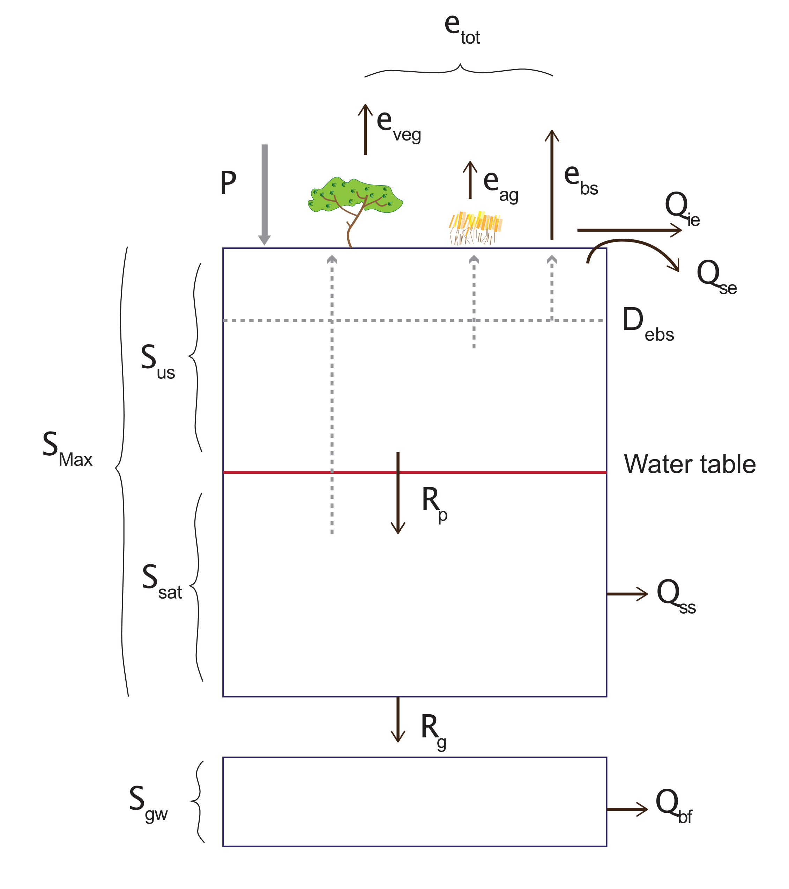

</center>

#### Maximum Storage Capacity of the Bucket/Catchment {#M5A_13 .unnumbered}

*Already completed in WATER BALANCE*

<center>\begin{equation}
S_{max}=D\left(\varphi-\ \theta_{pwp}\right) A_c
(\#eq:module5a-1)
\end{equation}</center>

The theoretical maximum storage capacity of the catchment is calculated by taking the difference between the porosity of the catchment soil (i.e. a measure of the total pore space in the soil, and hence, its ability to store water) and the permanent wilting point of the soil (the point at which volumetric water content is too low to be extracted from the soil by plants) and multiplying it by the volume of the catchment (i.e. surface area multiplied by the depth of the catchment). Note that $S_{max}$ is the sum of $S_{us}$ and $S_{sat}$, and does not include $S_{gw}$.

Note that 'plant available water' is the water content difference between field capacity and permanent wilting point of the soil at any given depth.

<center>

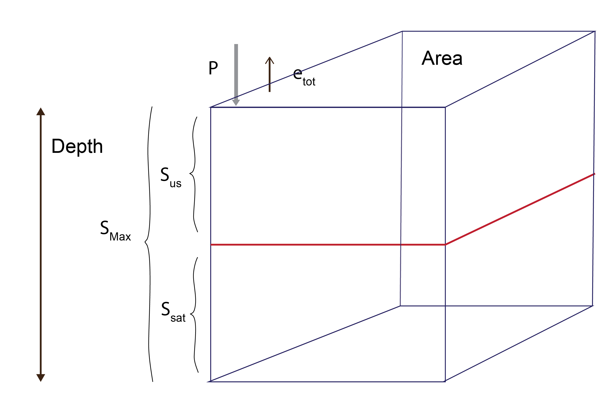

</center>

#### Threshold Storage {#M5A_14 .unnumbered}

*Already completed in WATER BALANCE*

<center>\begin{equation}
f_c=\ \left(\frac{\theta_{fc}-\ \theta_{pwp}}{\varphi-\ \theta_{pwp}}\right)
(\#eq:module5a-2)
\end{equation}</center>

Field capacity is the point at which all pore space small enough to retain water against the pull of gravity are filled (Brady and Weil, 1999). It is essentially the remaining water content of the soil after the removal of water by the downward forces of gravity over a daily time period. Field capacity therefore assumes that the water removed from the soil profile is only removed by gravity, not through plant suction or evaporation. The above formula calculates the threshold storage parameter as the proportion of 'plant available water' over storage capacity of the soil at any given depth.

<center>\begin{equation}
S_{fc}=\ S_{max} f_c
(\#eq:module5a-3)
\end{equation}</center>

The volumetric water storage at field capacity is therefore the theoretical maximum storage capacity of the catchment multiplied (or limited by) the threshold storage parameter (which is ≤ 1).

#### Water Table Depth {#M5A_23 .unnumbered}

The water table depth is calculated with the following equation:

<center>\begin{equation}
WT^{t}= \frac{S_{sat}^{t}}{A_{c}\varphi}
(\#eq:module5a-28)
\end{equation}</center>

#### Water Balance {#M5A_15 .unnumbered}

<center>


</center>

<center>\begin{equation}
S_{tot}^{t+1}= S_{tot}^{t}+(P^{t+1}- e_{tot}^{t+1})A_{c} - Q_{tot}^{t+1}
(\#eq:module5a-4)
\end{equation}</center>

<center>\begin{equation}
\color{grey}{S_{tot}^{t+1\prime}}= S_{tot}^{t}+ (P^{t+1}*A_{c})
(\#eq:module5a-99)
\end{equation}</center>

Water storage at any given time step, $t$, is calculated using the previous time step's water storage as a starting point ($t$). Inflows and outflows of water from the system/ bucket are then incorporated to obtain the next consecutive value of $S$. Precipitation recorded in the current time step (inflow) is added to the initial storage value, whilst total evapotranspiration and total runoff (outflows) are both subtracted. Total water storage is made up of water stored in the saturated and unsaturated zones. Note that the initial value of $S_{tot}$ may be empirically determined or assumed to be a certain value. The initial value of $S_{sat}$ is taken to be $D$ less than the depth from the surface to the water table, which can be measured.

<center>\begin{equation}
S_{us}^{t+1}=\ \color{grey}{S_{tot}^{t+1^\prime}}-\ S_{sat}^{t+1}
(\#eq:module5a-5)
\end{equation} \begin{equation}
S_{us(fc)}^{t+1}=\ f_c\left(S_{max}-\ S_{sat}^t\right)
(\#eq:module5a-6)
\end{equation}</center>

Threshold storage in the unsaturated zone is simply the maximum potential storage capacity in the unsaturated zone multiplied (limited) by the threshold storage parameter.

<center>\begin{equation}
S_{us}^{t+1\prime}=\  S_{us}^{t} + P^{t+1} \times\  A_{c}
(\#eq:module5a-8b)
\end{equation}</center>

```{=html}
<!---
<center>
\begin{equation}
\color{grey}{S_{us}^{t+1^\prime}}=\ S_{us}^t+\ P^{t+1} A_{c} 
(\#eq:module5a-7)
\end{equation}
\begin{equation}
 \color{red}{\text{if}}\ \ \ \color{grey}{S_{us}^{{t+1}^\prime}}>\ S_{us(fc)}^{t+1} \ \color{red}{\text{  then  }} \ R_p^{t+1}=\ \color{grey}{S_{us}^{{t+1}^\prime}}-\ S_{us(fc)}^{t+1}
(\#eq:module5a-8)
\end{equation}
</center>
--->
```
<center>\begin{equation}
R_{p}^{t+1} = \left\{\begin{matrix} \color{grey}{S_{us}^{t+1^\prime}}-S_{us(fc)}^{t+1},\ \ &\color{grey}{S_{us}^{{t+1}^\prime}}>\ S_{us(fc)}^{t+1}
\\ 0,\ \ &S_{us(fc)}^{t+1} \ge \color{grey}{S_{us}^{{t+1}^\prime}}
\end{matrix}\right.
(\#eq:module5a-8)
\end{equation}</center>

\BeginKnitrBlock{rmdtip2}<div class="rmdtip2">Equation \@ref(eq:module5a-8) is an IF Statement.</div>\EndKnitrBlock{rmdtip2}

The daily recharge rate from the unsaturated zone to the saturated zone is calculated as water storage in the unsaturated zone at the present time step, in addition to any new precipitation that has occurred, minus the threshold storage of the unsaturated zone (i.e. water which does not drain due to the downward forces of gravity alone). Recharge of this nature only occurs in the event that the combination of precipitation at the current time step, and water storage in the unsaturated zone, is greater than the threshold field capacity of the unsaturated zone.

<center>\begin{equation}
S_{sat}^{t+1}=\ S_{sat}^t+\ R_p^{t+1}-\ Q_{ss}^{t+1}-\ e_{v}^{t+1}A_{c}
(\#eq:module5a-9)
\end{equation}</center>

Note the use of "$t+1$" on the Right Hand Side for $R$, $Q$ and $e$ will be on the same row since they are computed based on yesterday's $S$.

The balance of volumetric water storage in the saturated zone is therefore calculated as the previous period's storage plus any recharge from the unsaturated zone, minus outflows including recharge to groundwater, subsurface runoff, and total evapotranspiration (bare soil, deep rooted vegetation and agricultural crop) from the saturated zone.

<!-- Optional Deep Ground Water Store: -->

<!-- <center> -->

<!-- \begin{equation} -->

<!-- R_g^{t+1}=\ K_s{S}_{sat}^t -->

<!-- (\#eq:module5a-10) -->

<!-- \end{equation} -->

<!-- </center> -->

<!-- Daily recharge to groundwater is calculated as the saturated hydraulic conductivity multiplied by the present water storage in the saturated zone.  -->

<!-- <center> -->

<!-- \begin{equation} -->

<!-- S_{gw}^{t+1}=\ S_{gw}^t+\ R_g^{t+1}-\ Q_{bf}^{t+1}\  -->

<!-- (\#eq:module5a-11) -->

<!-- \end{equation} -->

<!-- </center> -->

<!-- The balance of volumetric groundwater storage is calculated as the previous period’s storage plus recharge from the saturated zone less base flow out of the catchment. -->

<!-- <center> -->

<!-- \begin{equation} -->

<!-- Q_{bf}^{t+1}= \alpha_{bf} (\frac{S_{gw}^t}{S_{gw\ max}})^{\beta_{bf}} -->

<!-- (\#eq:module5a-27) -->

<!-- \end{equation} -->

<!-- </center> -->

<!-- Base flow is treated for our purposes as a nonlinear function using groundwater storage. -->

#### Total Evapo-transpiration {#M5A_16 .unnumbered}

<center>


</center>

<center>\begin{equation}
e_{tot}^t=\ e_v^t+\ e_{bs}^t+\ e_{ag}^t
(\#eq:module5a-12)
\end{equation}</center>

Total evapotranspiration (ET) of the system is the sum of ET from deep rooted native vegetation, bare soil and agricultural crops in the catchment.

Native vegetation ET is calculated as follows.

Simple form:

<center>\begin{equation}
e_v^{t+1}= M \frac{S_{tot}^t}{S_{max}} k_v e_p^{t+1}
(\#eq:module5a-13)
\end{equation}</center>

<!-- More complex form attempts to scale based on water availability in the unsaturated zone and the height of the water table: -->

<!-- <center> -->

<!-- \begin{equation} -->

<!-- e_v = \left\{\begin{matrix} Mk_{v}e_{p},\phantom{-}\phantom{-}\phantom{-} S_{sat}>\varphi D_{ebs}S_{us}^\prime>S_{us(fc)}   -->

<!-- \\ Mk_v\frac{S_{us}^\prime}{S_{fc}}e_p,  \phantom{-}\phantom{-}\phantom{-}\phantom{-}\phantom{-}\phantom{-}\phantom{-} S_{us}^\prime\ <\ S_{us(fc)} -->

<!-- \end{matrix}\right. -->

<!-- (\#eq:module5a-14) -->

<!-- \end{equation} -->

<!-- </center> -->

<!-- If water storage in the unsaturated zone combined with precipitation during the period is greater than the field capacity storage threshold of the unsaturated zone and water storage in the saturated zone is greater than the water storage capacity in the bare soil zone of influence, then the % vegetation cover within the catchment is multiplied by the transpiration efficiency of the vegetation (a function of LAI), the result of which is then multiplied by the potential ET.  -->

<!-- To the extent that water storage in the unsaturated zone combined with precipitation during the period is less than field capacity storage in the unsaturated zone, the preceding equation is further multiplied by the proportion of water stored in the unsaturated zone (plus precipitation in the period) over the field capacity threshold of the catchment (i.e. a fraction that will always be <1). -->

<!-- <center> -->

<!-- \begin{equation} -->

<!-- e_{v(sat)}=\ \frac{S_{sat}}{S_t}e_v -->

<!-- (\#eq:module5a-15) -->

<!-- \end{equation} -->

<!-- </center> -->

<!-- In cases where the first condition in equation (12) is satisfied, equation (13) may be applied to calculate the proportion of ET emanating from the saturated zone. ET drawn from the saturated zone by deep rooted vegetation is calculated as the proportion of water storage in the saturated zone over the total catchment water storage, multiplied by total deep rooted vegetation ET from equation (12). This function could also be made non-linear if desired. -->

<!-- The conditional rules applying to equations (12), (15), (16), (18) and (19) are expressed diagrammatically below, where $D_{ebs}$ is interchangeable with $D_{eag}$ for the purposes of the illustration. -->

<!-- <center> -->

<!-- ```{r module5a-3, echo=FALSE, fig.cap="If  $S_{sat} > \\varphi D_{ebs}$.", out.width = '30%'} -->

<!-- knitr::include_graphics("images/06-module5a/picture2.png") -->

<!-- ``` -->

<!-- </center> -->

<!-- <center> -->

<!-- ```{r module5a-4, echo=FALSE, fig.cap="If  $S_{sat} < \\varphi D_{ebs}$.", out.width = '30%'} -->

<!-- knitr::include_graphics("images/06-module5a/picture3.png") -->

<!-- ``` -->

<!-- </center> -->

<!-- <br> -->

<!-- <center> -->

<!-- \begin{equation} -->

<!-- e_{v(us)}=\ e_v-\ e_{v(sat)} -->

<!-- (\#eq:module5a-16) -->

<!-- \end{equation} -->

<!-- </center> -->

#### Agricultural/Shallow Root Crop Evapotranspiration {#M5A_17 .unnumbered}

For evapotranspiration by agricultural crops, we make the assumption that they can draw water from the unsaturated zone only, thus:

<!-- <center> -->

<!-- \begin{equation} -->

<!-- e_{ag} = \left\{\begin{matrix} C\alpha_{eag}\left[\frac{S_{us}}{S_{max}-\ S_{sat}}\right]e_p,\ \ &S_{sat}<\varphi D_{eag} -->

<!-- \\C\alpha_{eag}\left[\frac{S_{us}+\ \left(S_{sat}-\ \varphi D_{eag}\right)}{S_{sat}-\ \varphi D_{eag}}\right]e_p,\ \ &S_{sat}\geq\varphi D_{eag} -->

<!-- \end{matrix}\right. -->

<!-- (\#eq:module5a-17) -->

<!-- \end{equation} -->

<!-- </center> -->

<!-- In the first case, the water table is below the maximum depth of influence of agricultural crops, and total $e_{ag}$ is thus assumed to come from the unsaturated zone. Whereas in the second case, the water table is above the maximum depth of influence, meaning that $e_{ag}$ will be drawn partially from both the saturated and unsaturated zones.  -->

<!-- In the first case therefore, $e_{ag}$ is calculated as the % of agricultural crop cover in the catchment, multiplied by the agricultural scaling factor (effectively an efficiency parameter), multiplied by the fraction of water stored in the unsaturated zone over the maximum potential water storage within that zone (a limiting variable), multiplied by the potential ET. -->

<!-- In the second case, the fraction is amended to be the sum of the water stored in both the saturated and unsaturated zones within the depth of influence over the proportion that falls below the water table.  -->

<!-- <center> -->

<!-- \begin{equation} -->

<!-- e_{ag}^{t+1}=\ \left[\frac{S_{sat}-\ \varphi D_{eag}}{S_{us}+\ (S_{sat}-\ \varphi D_{eag})}\right]e_{ag},\ \ if\ S_{sat}\geq\varphi D_{eag} -->

<!-- (\#eq:module5a-18) -->

<!-- \end{equation} -->

<!-- </center> -->

<!-- The amount of ET that is drawn from the saturated zone is calculated as total ET due to agricultural crops multiplied by the proportion of water stored in the saturated zone within the depth of influence of agricultural crops. -->

<center>\begin{equation}
e_{ag}^{t+1}=C \alpha_{eag}[\frac{S_{us}^t}{S_{max}-S_{sat}^t}]e_{p}^{t+1}
(\#eq:module5a-19)
\end{equation}</center>

#### Bare Soil Evaporation {#M5A_18 .unnumbered}

<center>\begin{equation}
e_{bs}^{t+1} = \left\{\begin{matrix} (1-M-C)e_p^{t+1},\ \ &S_{sat}^t\geq\varphi D_{ebs} A_c
\\ (1-M-C)\left[\frac{S_{us}^{t}}{S_{max} - S_{sat}^t}\right]e_p^{t+1},\ \ &S_{sat}^t<\varphi D_{ebs} A_c
\end{matrix}\right.
(\#eq:module5a-20)
\end{equation}</center>

\BeginKnitrBlock{rmdtip2}<div class="rmdtip2">This is an IF statement. In Excel split this equation up into the ‘TRUE’ and ‘FALSE’ columns.</div>\EndKnitrBlock{rmdtip2}

<!-- The bare soil evaporation equations are identical to the agricultural crop ET equations in spirit. -->

<!-- <center> -->

<!-- \begin{equation} -->

<!-- e_{bs(sat)}=\ \left[\frac{S_{sat}-\ \varphi D_{ebs}}{S_{us}+\ (S_{sat}-\ \varphi D_{ebs})}\right]e_{bs},\ \ if\ S_{sat}\geq\varphi D_{ebs} -->

<!-- (\#eq:module5a-21) -->

<!-- \end{equation} -->

<!-- \begin{equation} -->

<!-- e_{bs(us)}=\ e_{bs}-\ e_{bs(sat)} -->

<!-- (\#eq:module5a-22) -->

<!-- \end{equation} -->

<!-- </center> -->

#### Flows {#M5A_20 .unnumbered}

<center>


</center>

<center>\begin{equation}
Q_{tot}^t = Q_{se}^t + Q_{ie}^t + Q_{ss}^t
(\#eq:module5a-29)
\end{equation}</center>

Total runoff of the system is the sum of saturation excess, infiltration excess, subsurface runoff, and (optional) base flow.

<center>\begin{equation}
Q_{se}^t = \left\{\begin{matrix} \color{grey}{{S}_{tot}^{t \prime}}-\ S_{max},\ \ &\color{grey}{{S}_{tot}^{t \prime}}>S_{max}
\\ 0,\ \ &\color{grey}{{S}_{tot}^{t \prime}}\le S_{max}
\end{matrix}\right.
(\#eq:module5a-24)
\end{equation}</center>

Saturation excess is simply taken as being zero to the extent that water storage in the bucket/ catchment is less than maximum storage capacity. In the event that total water storage exceeds maximum capacity however, any excess is taken to be surface runoff.

<center>\begin{equation}
Q_{ie}^t = \left\{\begin{matrix} (P^t-I_{max})A_c,\ \ &{P^t}> I_{max}
\\ 0,\ \ &{P^t}\le I_{max}
\end{matrix}\right.
(\#eq:module5a-25)
\end{equation}</center>

Subsurface flow:

<center>\begin{equation}
Q_{ss}^{t+1} = \left\{\begin{matrix} 0,\ \ &S_{sat}^{t}\le S_{usfc}^{t+1}
\\ \alpha_{s}\frac{S_{sat}^t}{S_{max}}\ \ &S_{usfc}^{t+1} <\ S_{sat}^t
\end{matrix}\right.
(\#eq:module5a-26)
\end{equation}</center>

<!-- Where $S_{fc}$ is $S_{max}fc$.  -->

Subsurface runoff is taken to be zero in cases where the total water storage is less than field capacity threshold (i.e. thus will not drain due solely to the forces of gravity). In the event that total storage in the bucket/ catchment is greater than threshold storage and less than maximum storage capacity, subsurface runoff is taken as a nonlinear function using the excess above threshold storage and the assigned recession coefficients.

## Submission {#M5A_21 .unnumbered}

::: redbox2
**Submit properly formatted graphs and tables of the following sections of the lab:**

1)  Clear photograph or page scan of your hand drawn conceptual model of the Catchment system (may be combined with the 5b catchment model).
2)  Stacked area plot of water storage over time
3)  Plot of $Q_{ie}$ (infiltration excess runoff) and precipitation (on a secondary axis) over time
4)  Plot of $Q_{ss}$(subsurface runoff) and precipitation (on a secondary axis) over time
5)  Stacked area plot of $e_{v}$, $e_{bs}$, $e_{ag}$ (i.e. total evaporation) over time.

**In less than 100 words write an answer to:**

6)  What is the general trend of rainfall over the long term?
7)  What is the general trend of storage over the long term? Why does the storage vary over the short term?
8)  Which flow mechanism contributes the most to the stream?
9)  What is the dominant ET flux?

These are to be uploaded as per the formatting specified in the [Style Guide](#StyleGuide). Marks will be deducted for incorrect formatting.

```{=html}
<!--
These are in PDF format. No screenshots of figures from Excel/Excel spreadsheets to be uploaded

**General professional formatting guidelines:**

- All figures are to have adequate captions explaining them
- For graphs, figure captions go below the plot
- For tables, the caption goes above the table
- Make sure figures and their text size is readable

**Excel hints:**

- When there is a caption for a plot, you remove the title
- Remove the plot border and gridlines
- Make sure both axes have visible lines and tick marks
- Units need to be noted properly with the axis label - 'Temperature (°C)'
- Round numbers to be reasonable
-->
```
:::

<!--chapter:end:module5a.Rmd-->

# Module 5b: Land Use and Nutrient Management {#M5B_1 -} 

### Objectives {#M5B_2 -}

To setup a nutrient export model to compare the effect of Best Management Practices (BMP's) on nutrient loads from a catchment with mixed land use.

### Before you start {#M5b_before_start -}

- Complete [Module 5a](#M5A_1)
- Be familiar with the land use export model activity from lecture
- Review the flow concentration relationship document
- Review nutrient modelling lecture and be familiar with best management practices (BMPs)

### Model Overview {#M5B_3 -}

Consider a catchment basin with with **different types of land use**.

The daily runoff/streamflow through the catchment, $Q^t$ (m^3^/day), can be approximated based on the daily rainfall ($R$) - see the Water Balance model in [Module 5a](#M5A_1). 

The phosphorus concentration in the water, $P^{t}$ (g/m^3), depends on how much flow there is (i.e. more flow = more fertilizer leaching). To model this we use a simple power law to make a "flow-concentration relationship", which is computed for each land-use ($P$ is proportional to $\alpha Q^{\beta}$). *If you've not seen a power law, sketch a graph of C (y-axis) vs Q (x-axis) for a value of $\beta =1$. What happens if $\beta =2$ or $\beta =0.5$?*

<center>
{width=60%}

</center>

This is averaged over the different land use fractions (denoted with the small $p$ index), using the land-use fraction $F_l$:

<center>
\begin{equation}
P^{t} = \sum_{l=4}^{N_{p}} F_{p}\left (\color{#FF0000}{\alpha_{l} \left (\frac{Q^{t}}{A_{c}}  \right )^{\beta_{l}}+P_{0}}  \right )
(\#eq:module5b-3)
\end{equation}
</center>

where alpha ($\alpha$) and beta ($\beta$) are variables that govern the stream $P$ concentration (g/m^3^) as a function of area-averaged flow rate ($Q/A$) and they depend on the dominant land use ($l$). $N_l$ is the number of land use classes being considered (4) and $P_0$ is the background concentration (g/m^3^) for that sub-catchment (i.e. the value of PO~4~ when flow is low 0).


\BeginKnitrBlock{rmdnote2}<div class="rmdnote2">$\color{#FF0000}{\alpha_{p} \left (\frac{Q}{A_{c}}  \right )^{\beta_{p}}+P_{0}}$ is the flow dependent concentration ($\color{#FF0000}{P}$) of the *p*-th land use type.
  

$P^{t} = \sum_{l=4}^{N_{p}} F_{p}\left (\color{#FF0000}{\alpha_{l} \left (\frac{Q^{t}}{A_{c}}  \right )^{\beta_{l}}+P_{0}}  \right )$ is a shorthand way of expressing: $P^{t} = F_{1}\color{#FF0000}{P_{1}^{t}} + F_{2}\color{#FF0000}{P_{2}^{t}} + F_{3}\color{#FF0000}{P_{3}^{t}} + F_{4}\color{#FF0000}{P_{4}^{t}}$</div>\EndKnitrBlock{rmdnote2}


The total $P$ export **load** is $P_{load}$ (g/day) and is the mass flux through the river (remember *load = flow x concentration*) :

<center>
\begin{equation}
P_{load}^{t} = P^{t} Q^{t}
(\#eq:module5b-4)
\end{equation}
</center>

<!--
<center>
<video width="80%" height="80%" controls>
  <source src="images/module5b/video1.mp4" type="video/mp4">
</video>
</center>
-->

### Module Resources {#M5B_4 -}

The Excel spreadsheet for this module is part of the Module 5 download. Access using the download button in the tool bar <i class="fa fa-download" aria-hidden="true"></i>.

### Exercises {#M5B_5 -}

#### Building the model {#M5B_6 -}

1) Draw by hand the conceptual model of this system.
2) Confirm with the person beside you what index means ($t$ and $l$).
3) Set your modelled $Q_{tot}$ to equal your $Q_{tot}$ values in the **WATER BALANCE - 5a** sheet 


#### Calibrating the model {#M5B_7 -}

Let’s make sure the model flows are realistic. Let's compare our prediction with some observed data:

4) Create a regression plot of the observed $Q_{tot}$ and your modelled $Q_{tot}$

5) Tailor this model to use the information as outlined in Table \@ref(tab:module5b-1). Add a linear trendline, R^2^, and the line equation to the plot. Aim to achieve modelled flow values that closely match the observed $Q_{tot}$ 

\BeginKnitrBlock{rmdtip2}<div class="rmdtip2">You want a high R^2^ value (greater than 0.8) and a slope coefficient close to 1.</div>\EndKnitrBlock{rmdtip2}

<center>
<div style="border: 1px solid #ddd; padding: 5px; overflow-y: scroll; height:100%; overflow-x: scroll; width:100%; "><table class="table" style="width: auto !important; margin-left: auto; margin-right: auto;">
<caption>(\#tab:module5b-1)Parameters for the individual catchments.</caption>
 <thead>
  <tr>
   <th style="text-align:center;"> Parameters for catchment model: </th>
   <th style="text-align:center;"> <span style="color: #9BBB59;">Catchment value</span>  </th>
  </tr>
 </thead>
<tbody>
  <tr>
   <td style="text-align:center;min-width: 23.5em; "> Sub catchment area, $A$ (km^2^) </td>
   <td style="text-align:center;min-width: 23.5em; "> 50 </td>
  </tr>
  <tr>
   <td style="text-align:center;min-width: 23.5em; "> Soil depth, $D$ </td>
   <td style="text-align:center;min-width: 23.5em; "> 10 </td>
  </tr>
  <tr>
   <td style="text-align:center;min-width: 23.5em; "> Baseflow coefficient, $\alpha_s$ (range) </td>
   <td style="text-align:center;min-width: 23.5em; "> 5e3 to 5e4 </td>
  </tr>
  <tr>
   <td style="text-align:center;min-width: 23.5em; "> Field capacity, $\theta_{fc}$ (range) </td>
   <td style="text-align:center;min-width: 23.5em; "> 0.08 to 0.15 </td>
  </tr>
  <tr>
   <td style="text-align:center;min-width: 23.5em; "> Infilt. capacity, $I_{max}$ (range) </td>
   <td style="text-align:center;min-width: 23.5em; "> 0.01 to 0.3 </td>
  </tr>
  <tr>
   <td style="text-align:center;min-width: 23.5em; "> Deep rooted vegetation fraction, $M$ (range) </td>
   <td style="text-align:center;min-width: 23.5em; "> 0.42 to 0.65 </td>
  </tr>
  <tr>
   <td style="text-align:center;min-width: 23.5em; "> Crop vegetation fraction, $C$ (range) </td>
   <td style="text-align:center;min-width: 23.5em; "> 0.25 to 0.4 </td>
  </tr>
  <tr>
   <td style="text-align:center;min-width: 23.5em; "> Starting storage, $S_{0}$ </td>
   <td style="text-align:center;min-width: 23.5em; "> 1.05E+08 </td>
  </tr>
  <tr>
   <td style="text-align:center;min-width: 23.5em; "> $Ssat_{0}$ </td>
   <td style="text-align:center;min-width: 23.5em; "> 94500000.00 </td>
  </tr>
</tbody>
</table></div>
</center>

Manually adjust the catchment model parameters (see possible ranges in table above) until the model best matches the observed data - the observed flow data and water table data is in the **CLIMATE** sheet. This processed is called “calibration”.

\BeginKnitrBlock{rmdtip2}<div class="rmdtip2">Check this by using a regression plot of the given total observed streamflow and the model total streamflow, checking to get the highest R^2^ value.</div>\EndKnitrBlock{rmdtip2}


#### Calculate phosphate concentrations {#M5B_8 -}

Now let’s work out the land-use specific stream $P$ concentrations in the **PHOSPHOROUS** sheet:

6) Predict the catchment river $P$ concentrations and total export load, $P_{load}$.
The best way to do this is first predict the $P$ concentration of each land-use class each as a column (i.e. Dairy $P$ concentration, Wheat $P$ concentration and so on), and then sum the 4 columns for $P^t$ by factoring the ($F_l$) for each land-use.

<center>
<div style="border: 1px solid #ddd; padding: 5px; overflow-y: scroll; height:235px; overflow-x: scroll; width:100%; "><table class="table" style="width: auto !important; margin-left: auto; margin-right: auto;">
<caption>(\#tab:module5b-2)Phosphate parameters.</caption>
 <thead>
  <tr>
   <th style="text-align:center;"> Parameters for P conc.: </th>
   <th style="text-align:center;"> $\alpha$ (alpha) </th>
   <th style="text-align:center;"> $\beta$ (beta) </th>
   <th style="text-align:center;"> land-use $F_l$ </th>
  </tr>
 </thead>
<tbody>
  <tr>
   <td style="text-align:center;min-width: 25em; "> Landuse parameters: irrigated dairy ($l$=1) </td>
   <td style="text-align:center;min-width: 10em; "> 2.1 </td>
   <td style="text-align:center;min-width: 10em; "> 0.90 </td>
   <td style="text-align:center;min-width: 10em; "> 0.30 </td>
  </tr>
  <tr>
   <td style="text-align:center;min-width: 25em; "> Landuse parameters: wheat ($l$=2) </td>
   <td style="text-align:center;min-width: 10em; "> 1.2 </td>
   <td style="text-align:center;min-width: 10em; "> 0.45 </td>
   <td style="text-align:center;min-width: 10em; "> 0.10 </td>
  </tr>
  <tr>
   <td style="text-align:center;min-width: 25em; "> Landuse parameters: urban ($l$=3) </td>
   <td style="text-align:center;min-width: 10em; "> 1.9 </td>
   <td style="text-align:center;min-width: 10em; "> 0.80 </td>
   <td style="text-align:center;min-width: 10em; "> 0.15 </td>
  </tr>
  <tr>
   <td style="text-align:center;min-width: 25em; "> Landuse parameters: forest ($l$=4) </td>
   <td style="text-align:center;min-width: 10em; "> 0.5 </td>
   <td style="text-align:center;min-width: 10em; "> 1.20 </td>
   <td style="text-align:center;min-width: 10em; "> 0.45 </td>
  </tr>
</tbody>
</table></div>
</center>

\BeginKnitrBlock{rmdtip2}<div class="rmdtip2">See how dairy has the highest alpha? This means it produces the most $P$ of all 4 classes.</div>\EndKnitrBlock{rmdtip2}

#### Calculate phosphate export load {#M5B_8 -}

7) Compute the $P_{load}$ at the catchment outlet in kg/day. Also, work out the cumulative load (this will come in handy to coampre scenarios; we call it a mass curve) 

#### Consider 2 management scenarios {#M5B_9 -}

Finally, let’s run 2 management scenarios:

8a) **Scenario 1:** If the total urban area expanded to 50% (0.5), how would this affect the overall $P$ export?

\BeginKnitrBlock{rmdtip2}<div class="rmdtip2">Change the land use fractions manually. They still have to add up to 1, so change the other parts as you see appropriate, i.e. urban area usually comes at the expense of forest, but you can decide how to change the landscape. Record your changed fractions.</div>\EndKnitrBlock{rmdtip2}

8b) **Scenario 2** If the irrigated dairy industry incorporated new phosphorus reduction technology, i.e. a best management practice (BMP) which leads to less $P$ concentrations going from the farm to the stream. How would this affect the overall concentration in the water at the river basin outlet? The dairy concentration is now no more than 0.06 g m^3^. 

\BeginKnitrBlock{rmdtip2}<div class="rmdtip2">Use an IF statement to put a conditional cap on your dairy phosphorous concentration </div>\EndKnitrBlock{rmdtip2}

### Submission {#M5B_10 -}
:::: {.redbox2}

**Submit properly formatted graphs and tables of the following sections of the lab:**

1) Clear photograph or page scan of your hand drawn conceptual model of the Catchment system (may be combined with the 5a catchment model)
2) Plot of calibration regression plot, including a trendline, equation and R^2^ value. Include in the caption what parameter values you gave the catchment.
3) Plot of the cumulative phosphorous export of increased urbanisation (Scenario 1) and dairy management (Scenario 2) compared to the original conditions, over time.
4) Plot of the concentration-flow relationship for the three scenarios of phosphorous concentration. 
5) Any other interesting plots you may like to create.

These are to be uploaded as per the formatting specified in the [Style Guide](#StyleGuide). Marks will be deducted for incorrect formatting.
<!--
These are in a PDF format, combined with 5a results. No screenshots of figures from Excel/Excel spreadsheets to be uploaded

**General professional formatting guidelines:**

- All figures are to have adequate captions explaining them
- For graphs, figure captions go below the plot
- For tables, the caption goes above the table
- Make sure figures and their text size is readable

**Excel hints:**

- When there is a caption for a plot, you remove the title
- Remove the plot border and gridlines
- Make sure both axes have visible lines and tick marks
- Units need to be noted properly with the axis label - 'Temperature (°C)'
- Round numbers to be reasonable
-->
::::


<!--chapter:end:module5b.Rmd-->

# Module 6: River Pollution {#M6_1 -}

### Objectives {#M6_2 -}

In this module you will setup an "advection-dispersion-reaction" equation for a river system to demonstrate the combination of **temporal and spatial** finite differencing, in one dimension. 

### Before you start {#M6_before_start -}

- Review the mixing in the environment lecture
- Undertake the lecture's lake oxygen worked example

### Advection-Dispersion Reaction {#M6_3 -}

Mixing in environmental waters is described based on the currents and turbulence in the water - in simple terms we refer to these as advection and dispersion. 

The advection-dispersion reaction equation for the concentration of a substance $C$, is defined as:

<center>
\begin{equation}
\frac{\delta C}{\delta t} = D_{d}\frac{\delta^{2} C}{\delta x^{2}} - u \frac{\delta C}{\delta x} + S + R
(\#eq:module6-1)
\end{equation}
</center>

where the left hand side (LHS) is the “unsteady” term ($C$ change in time), the first term on the right hand side (RHS) is the dispersion/mixing term, the second term on the RHS is the advection/movement term and $S$ is a source term, and $R$ is a reaction term. We use a partial deriviative (“curly $\delta$”) since $C$ is now varying in both space and time.

In this exercise we numerically solve the 1-dimensional, advective-dispersive transport of oxygen in a river. To solve this equation numerically, we must “discretise” the partial derivatives using finite difference methods, here done according to the FTCS scheme (refer to lecture!):

<center>
\begin{equation}
\frac{C^{t+1}_{x}-C^{t}_{x}}{\Delta t}=D_{d} \frac{C_{x+1}^{t}-2C_{x}^{t}+C_{x-1}^{t}}{\Delta x^{2}}-u_{x}^{t} \frac{C_{x+1}^{t}-C_{x-1}^{t}}{2\Delta x}+R_{x}+S_{x}
(\#eq:module6-2)
\end{equation}
</center>

Where the $t$ subscript is referring to timestep, and the $x$ subscript refers to the space increment/position. For the case of oxygen we assume that $R$ is accounting for oxygen input from the atmosphere and consumption by bacteria (called the Biochemical Oxygen Demand, BOD), then:

<center>
\begin{equation}
R_x=k_a\left(C_a-C_x^t\right)-k_{BOD}C_x^t
(\#eq:module6-3)
\end{equation}
</center>

Where the first term is atmospheric exchange ($k_a$ is the rate of re-aeration and $C_a$ is the saturation value of oxygen) and the second term is the bacterial consumption (described by $k_{BOD}$ which is in units of day^-1^). We can solve for the forward timestep at any position along the river by computing:

<center>
\begin{equation}
\small{C_{x}^{t+1}=\color{#898989}{C_{x}^{t}}+ \left [ \color{#3A88FE}{D_d \frac{C_{x+1}^{t}-2C_{x}^{t}+C_{x-1}^{t}}{\Delta x^{2}}}-\color{#FF2600}{u_{x}^{t} \frac{C_{x+1}^{t}-C_{x-1}^{t}}{2\Delta x}} + \color{#77BB41}{k_{a}(C_{a}-C_{x}^{t})}-\color{#B18CFE}{k_{BOD}C_{x}^t}  \right ]\Delta t+\color{#D58400}{S_{x}}}
(\#eq:module6-4)
\end{equation}
</center>

\BeginKnitrBlock{rmdnote2}<div class="rmdnote2">Previous $C$ concentration: $\color{#898989}{C_{x}^{t}}$ 
  
Diffusion: $\color{#3A88FE}{D_d \frac{C_{x+1}^{t}-2C_{x}^{t}+C_{x-1}^{t}}{\Delta x^{2}}}$
  
Advection: $\color{#FF2600}{u_{x}^{t} \frac{C_{x+1}^{t}-C_{x-1}^{t}}{2\Delta x}}$
  
Atmospherical exchange: $\color{#77BB41}{k_{a}(C_{a}-C_{x}^{t})}$
  
Biological O~2~ demand: $\color{#B18CFE}{k_{BOD}C_{x}^{t}}$
  
O~2~ source/sink: $\color{#D58400}{S_{x}}$
</div>\EndKnitrBlock{rmdnote2}

To solve this the user specifies the initial oxygen concentration ($C_0$), river velocity ($u$) as a function of distance, grid length ($L$), grid spacing ($\Delta x$), simulation period ($T$), time step ($\Delta t$). The calculation should then compute the change in oxygen as a function of distance and time.


```{=html}
<video width="100%" controls>
<source src="images/module6/video1.mp4" type="video/mp4"/>
</video>
```

Extra sources or sinks of oxygen can by added into the domain based on the $S$ term. We will first set up the model to have no $S$ inputs along the side of the river, but in the last task we add a low oxygen discharge somewhere along the river (ie. a pipe outflow).


### Module Resources {#M6_4 -}

Download the Excel spreadsheet and R files for this module by clicking the download button in the tool bar <i class="fa fa-download" aria-hidden="true"></i>.

\BeginKnitrBlock{rmdnote2}<div class="rmdnote2">You can use either Excel or R for this module.</div>\EndKnitrBlock{rmdnote2}

### Exercises {#M6_5 -}

#### Setting up the Model {#M6_7 -}

1) Draw the schematic of the conceptual model by hand, showing the spatial discretisation, boundaries, sources, reactions, and a little animal swimming in the river.
2) Start with the provided spreadsheet or R script, and implement the above expression. Set up the spreadsheet to assume a river of length ($L$) ~5 km. You will need to select an $x$ increment ($\Delta x$).

\BeginKnitrBlock{rmdtip2}<div class="rmdtip2">In Excel, time is going down the rows and distance (space) is going along the columns.</div>\EndKnitrBlock{rmdtip2}

3) Set the initial condition ($C_0$) row to be 10 mg O~2~/L – i.e. the whole river starts at 10 mg/L in each cell.
4) Once you see the formula is working in the first time-step, then copy the formula along the length of the river. You will need to set a downstream boundary condition (at the the position where $x = L$, the last column). For this we will set a “zero-derivative” condition $– \frac{\delta C}{\delta x} = 0$. Therefore $C_n = C_{n-1}$, where $n$ is the last cell of the river length.
5) Copy the first time row down for all the time-steps (simulate several days in total).
6) Plot the oxygen concentration as a function of distance for several times during the simulation.


```{=html}
<video width="100%" loop="TRUE" controls="TRUE">
<source src="images/module6/video2.mp4" type="video/mp4"/>
</video>
```

7) For Excel users, Set up conditional formatting to help visualise the concentration change through space and time

#### Modelling a Wastewater Plume {#M6_8 -}

8) Implement at $x \approx 1500\text{m}$ a wastewater plume entering the river – do this by reducing the $C$ at the relevant $x$ cell by 3 mg/L (or less if the $C$ is already below 3). This is done by adding the extra “$S$” term of -3 to the appropriate $x$-cell formula, and copying the formula down through time. Plot and note how the oxygen recovers downstream of the low oxygen inflow plume.

\BeginKnitrBlock{rmdtip2}<div class="rmdtip2">To prevent negative O~2~ concentration (in otherwords, we can't take more than is available) we cap the solution to be greater than 0. Preventing negatives can be done as: `=MAX(equation, 0 )` </div>\EndKnitrBlock{rmdtip2}

<center>
<div class="figure">

<p class="caption">(\#fig:figM6-1)Advection and dispersion of O~2~ in a river of length $x$. Note, in this figure $W_c$ refers to our wastewater plume (click [here](https://hydrologie.org/BIB/Publ_UNESCO/SR_999_E_2005.pdf) for image source).</p>
</div>
</center>

9) The above example should show the low oxygen water diffusing into the river environment. The default velocity in this river was 0.2 m/s which is not very fast. Increase the velocity ($U$) in all cells to 1.2 m/s and see how the shape of the waste water plume changes. Now the advection term will be more significant, you should see the plume moving more strongly down stream.

#### Modelling an O~2~ Drop {#M6_9 -}

10) Change the upstream boundary concentration at $x = 0$, to include a sudden drop in oxygen for a period of 0.5 hour. Plot how this signal propagates through the river domain during and after the period where the upstream condition drops – can you see the low oxygen pulse moving through the river? How does this concentration profile vary if the diffusivity is different?

#### Modelling your own Scenario  {#M6_10 -}


```{=html}
<video width="100%" loop="TRUE" controls="TRUE">
<source src="images/module6/video3.mp4" type="video/mp4"/>
</video>
```

11) Create your own environmental scenario using this model, make a brief description of it, calculate a result and if necessary, express the result with a figure. 

\BeginKnitrBlock{rmdtip2}<div class="rmdtip2">If you see fluctuating negative and positive concentrations, you might have numerical instability. Adjust your $\Delta t$ or $\Delta x$.
</div>\EndKnitrBlock{rmdtip2}

<center>
<div class="figure">

<p class="caption">(\#fig:figM6-2)A plume of coloured dye dispersing through a river.</p>
</div>
</center>


### Submission {#M6_6 -}
:::: {.redbox2}

**Submit properly formatted graphs and tables of the following sections of the lab:**

1) Clear photograph or page scan of your **hand drawn conceptual model** of the river with all the oxygen transport processes labelled.
2) A plot of oxygen concentration at several times **plotted for all distance of the river**. 
3) A plot of oxygen concentration at several points of the river **plotted for all time**.
4) A plot of the oxygen concentration with the upstream boundary drop at several points of the river **plotted for all time**.
5) A plot of the oxygen concentration with the wastewater plume at several times **plotted for all distance of the river**.

<center>
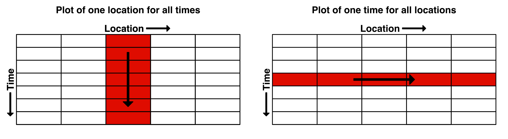{width=100%}
</center>

6) A plot of your own individual environmental scenario.
    - Don’t plot too many lines – only several are necessary and use your judgement to select how many show the results well whilst the plot still clear and easy to understand.
    - Make sure your axes are well labelled and clear to read. If abbreviating oxygen, include a subscript in O~2~.

These are to be uploaded as per the formatting specified in the [Style Guide](#StyleGuide). Marks will be deducted for incorrect formatting.
<!--
These are in a word doc or PDF format. No screenshots of figures from Excel/Excel spreadsheets to be uploaded

**General professional formatting guidelines:**

- All figures are to have adequate captions explaining them
- For graphs, figure captions go below the plot
- For tables, the caption goes above the table
- Make sure figures and their text size is readable

**Excel hints:**

- When there is a caption for a plot, you remove the title
- Remove the plot border and gridlines
- Make sure both axes have visible lines and tick marks
- Units need to be noted properly with the axis label - 'Temperature (°C)'
- Round numbers to be reasonable
-->
::::

<!--chapter:end:module6.Rmd-->

# Module 7: Lake Ecosystem Dynamics {#M7_1 .unnumbered}

### Objectives {#M7_2 .unnumbered}

To use the GLM model to investigate water quality modelling in lakes and to incorporate a coupled hydrodynamic-biogeochemical model.

### Before you start {#M7_before_start -}

- Review modelling aquatic systems lecture

### Module Resources {#M7_3 .unnumbered}

This week, you'll be working through the [**GLM Workbook**](https://aquaticecodynamics.github.io/glm-workbook/). If you're not already familiar with GLM, start by reading the [Getting Started](https://aquaticecodynamics.github.io/glm-workbook/GettingStarted.html), [File Structure](https://aquaticecodynamics.github.io/glm-workbook/glm-file-structure.html), and [Running GLM](https://aquaticecodynamics.github.io/glm-workbook/running-glm.html) chapters.

Your task will be to complete the **Warm Lake Case Study**. 

\BeginKnitrBlock{rmdtip2}<div class="rmdtip2">As you work through this chapter you may find it helpful to refer to some of the Exercises in the GLM workbook.</div>\EndKnitrBlock{rmdtip2}

### Submission {#M7_13 .unnumbered}

::: {.redbox2}
**Submit properly formatted graphs and tables of the following sections of the lab:**

Lake Stratification:

-   Hand drawn diagram of the lake and any variables you used
-   Plots of the water balance
-   Plots of the heat fluxes
-   Plots of the temperature at different layers
-   Plots of the shallower lake

The Ecosystem Model:

-   Hand drawn diagram of the lake with any variables you used
-   Interesting plot of the selected variables
-   Any results of the higher air temperature and changed water clarity

Assessing Error & Sensitivity:

-   Temperature error assessment
-   Temperature and phytoplankton sensitivity assessment
-   Tables for submission

These are to be uploaded as per the formatting specified in the [Style Guide](#StyleGuide). Marks will be deducted for incorrect formatting.
<!--
These are to be uploaded in a word doc or PDF format. No screenshots of figures from Excel/Excel spreadsheets to be uploaded

**General professional formatting guidelines:**

-   All figures are to have adequate captions explaining them
-   For graphs, figure captions go below the plot
-   For tables, the caption goes above the table
-   Make sure figures and their text size is readable

**Excel hints:**

-   When there is a caption for a plot, you remove the title
-   Remove the plot border and gridlines
-   Make sure both axes have visible lines and tick marks
-   Units need to be noted properly with the axis label - 'Temperature (°C)'
-   Round numbers to be reasonable
-->
:::

<!--chapter:end:module7.Rmd-->

# (PART)  Assessment {-} 

# Final Project {#FinalProject -}

## Overview {-}

<center>

</center>

## Stages {-}

### Brainstorm {-}

**Complete by: end of Week 8**

### Research & Discovery {-}

**Complete by: Week 8-9**

### Conceptual Model & Plan {-}

**Complete by: end of Week 9**

### Two-pager/Pitch {-}

### Idealised Prototype {-}

### Validation/Evaluation {-}

### Scenarios/Limits {-}

### Presenting Results {-}

<!--chapter:end:finalproject.Rmd-->

# (PART)  Supporting Material {-} 

# Learning the Tidyverse {#tidyverse .unnumbered}

## Visualising Module 1 Flow Data {-}

### Setting up {-}

#### Creating an R Studio project {-}

1) Open R Studio
2) Go *File -> New Project -> New Directory -> New Project*
3) *Directory name:* ENVT3362_workshop_2
4) *Create project as a subdirectory of:* Wherever you store your ENVT3362 files!
5) Click *Create project*
5) Download the spreadsheet for this workshop [here](envFlowData.xls)
6) Move this to your *ENVT3362_workshop_2* directory

#### Install the tidyverse {-}

- Type this into the R console
- You only need to do this once


```r
install.packages("tidyverse")
```

### Importing and formatting the data {-}

#### Load the necessary packages {-}

- `library(tidyverse)` loads all the 'core' tidyverse packages
- readxl and lubridate need to be loaded separately 


```r
library(tidyverse)
library(readxl)
library(lubridate)
```

#### Import the spreadsheet {-}

- The `path` argument is relative to you R Studio project file
- `sheet` specifies which Excel sheet to read


```r
envFlow  <- read_xls(path = "envFlowData.xls", sheet = 1)
```

#### Inspect the data {-}

- `head()` prints the first few observations
- What data type is `date`?


```r
head(envFlow)
```

```
## # A tibble: 6 × 2
##   date       totalDischarge
##   <chr>               <dbl>
## 1 1992-01-01           26.6
## 2 1992-01-02           26.8
## 3 1992-01-03           27.3
## 4 1992-01-04           27.0
## 5 1992-01-05           26.5
## 6 1992-01-06           26.8
```

#### Format the date {-}

- Use lubridate's `ymd()` function to overwrite the existing `date` variable and convert the **character** data to **date** data


```r
envFlow$date <- ymd(envFlow$date)
```

#### Inspect the data again {-}

- Notice the change in data type of `date`


```r
head(envFlow)
```

```
## # A tibble: 6 × 2
##   date       totalDischarge
##   <date>              <dbl>
## 1 1992-01-01           26.6
## 2 1992-01-02           26.8
## 3 1992-01-03           27.3
## 4 1992-01-04           27.0
## 5 1992-01-05           26.5
## 6 1992-01-06           26.8
```

### Graphing with ggplot {-}

#### Call `ggplot()` {-}


```r
ggplot() 
```


#### Define the data and mapping {-}

- The aesthetics (`aes()`) provide the mapping between variables in the data and the plot's visual properties


```r
ggplot(data = envFlow, mapping = aes(x = date, y = totalDischarge)) 
```


#### Add a geometry layer {-}

- `geom_` functions tell ggplot how to render each observation


```r
ggplot(data = envFlow, mapping = aes(x = date, y = totalDischarge)) +
  geom_line() 
```


#### Change the geometry {-}

- As long as the aesthetics can be mapped to the declared geometry type, ggplot will render the graph


```r
ggplot(data = envFlow, mapping = aes(x = date, y = totalDischarge)) +
  geom_point()
```


#### Change the colour {-}

- Colours can either be hexadecimal codes (e.g. `"#0000FF"` is blue) or one of [R's reserved colour names](http://www.stat.columbia.edu/~tzheng/files/Rcolor.pdf)


```r
ggplot(data = envFlow, mapping = aes(x = date, y = totalDischarge)) +
  geom_line(colour = "dodgerblue3") 
```


#### Fix the labels {-}


```r
ggplot(data = envFlow, mapping = aes(x = date, y = totalDischarge)) +
  geom_line(colour = "dodgerblue3") +
  labs(x = "Date", y = "Total Discharge (ML)")
```


#### Change the theme {-}


```r
ggplot(data = envFlow, mapping = aes(x = date, y = totalDischarge)) +
  geom_line(colour = "dodgerblue3") +
  labs(x = "Date", y = "Total Discharge (ML)") +
  theme_light()
```


#### Customise the theme {-}


```r
ggplot(data = envFlow, mapping = aes(x = date, y = totalDischarge)) +
  geom_line(colour = "dodgerblue3") +
  labs(x = "Date", y = "Total Discharge (ML)") +
  theme_light() +
  theme(
    axis.title = element_text(face = "bold"),
    axis.text = element_text(colour = "black")
  )
```


#### Save the plot {-}

- File types can be changed by modifying the file extensions e.g. `"discharge.jpeg"`


```r
ggsave(
  filename = "discharge.pdf",
  width = 2000,
  height = 2000,
  units = 'px'
  )
```

## Visualising Diversion Scenarios {-}

Let's pretend our graph will be used in a report that assesses the impact of the proposed diversion scenarios. We need to visually communicate to the reader the upper and lower limits of flows that can be diverted. To do this, let's highlight the region of the graph where environmental flows can occur under Diversion Scenario 1 (i.e. Water below 50 ML/day and above 550 ML/day is not diverted).

#### Map the current aesthetics to `geom_line()` {-}

- `aes()` can be passed to either `ggplot()` or a specific `geom_`
- Aesthetics supplied to `ggplot()` are used as defaults for every layer


```r
ggplot() +
  geom_line(data = envFlow, mapping = aes(x = date, y = totalDischarge), colour = "dodgerblue3") +
  labs(x = "Date", y = "Total Discharge (ML)") +
  theme_light() +
  theme(
    axis.title = element_text(face = "bold"),
    axis.text = element_text(colour = "black")
  )
```

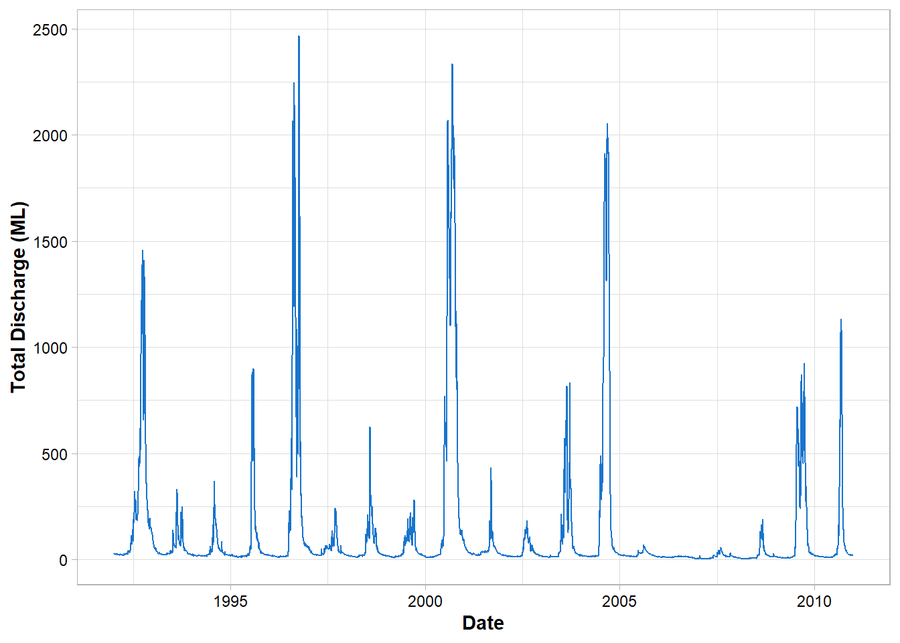

#### Add a second geometry {-}

- `geom_rect()` has two dimensions and therefore reques different aesthetic mappings


```r
ggplot() +
  geom_line(data = envFlow, mapping = aes(x = date, y = totalDischarge), colour = "dodgerblue3") +
  geom_rect(mapping = aes(xmin=min(envFlow$date),xmax=max(envFlow$date), ymin=50, ymax=550))+
  labs(x = "Date", y = "Total Discharge (ML)") +
  theme_light() +
  theme(
    axis.title = element_text(face = "bold"),
    axis.text = element_text(colour = "black")
  )
```

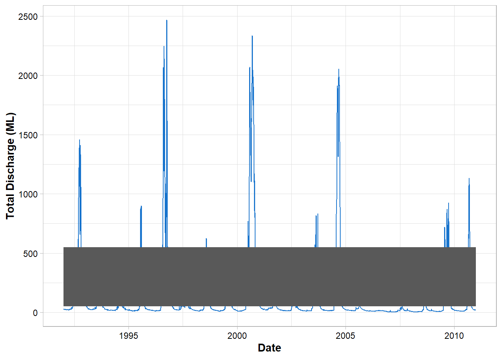

#### Customise the geometry {-}


```r
ggplot() +
  geom_line(data = envFlow, mapping = aes(x = date, y = totalDischarge), colour = "dodgerblue3") +
  geom_rect(
    mapping = aes(xmin=min(envFlow$date),xmax=max(envFlow$date), ymin=50, ymax=550),
    alpha = 0.25
  )+
  labs(x = "Date", y = "Total Discharge (ML)") +
  theme_light() +
  theme(
    axis.title = element_text(face = "bold"),
    axis.text = element_text(colour = "black")
  )
```

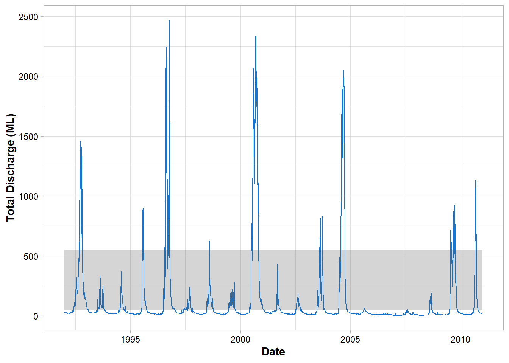

#### Add a legend {-}

- By specifying `fill` inside the aesthetics, ggplot *maps* this information to the geom's fill (i.e. the colour fill)
- Usually a grouping variable from the data would be provided here i.e. a column that classifies your data into different groups  


```r
ggplot() +
  geom_line(data = envFlow, mapping = aes(x = date, y = totalDischarge), colour = "dodgerblue3") +
  geom_rect(
    mapping = aes(xmin=min(envFlow$date),xmax=max(envFlow$date), ymin=50, ymax=550, fill = "Diversion Scenario 1"),
    alpha = 0.25
  )+
  labs(x = "Date", y = "Total Discharge (ML)") +
  theme_light() +
  theme(
    axis.title = element_text(face = "bold"),
    axis.text = element_text(colour = "black")
  )
```


#### Customise the legend {-}

- ggplot automatically assigns the colours, change this with `scale_fill_manual()`


```r
ggplot() +
  geom_line(data = envFlow, mapping = aes(x = date, y = totalDischarge), colour = "dodgerblue3") +
  geom_rect(
    mapping = aes(xmin=min(envFlow$date),xmax=max(envFlow$date), ymin=50, ymax=550, fill = "Diversion Scenario 1"),
    alpha = 0.25
  )+
  scale_fill_manual(values = "red")+
  labs(x = "Date", y = "Total Discharge (ML)") +
  theme_light() +
  theme(
    axis.title = element_text(face = "bold"),
    axis.text = element_text(colour = "black"),
    legend.title = element_blank()
  )
```

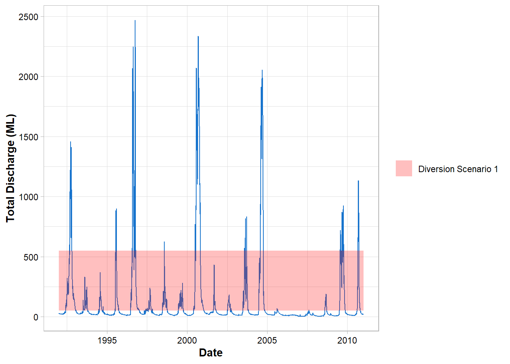
 
#### Move the legend {-}


```r
ggplot() +
  geom_line(data = envFlow, mapping = aes(x = date, y = totalDischarge), colour = "dodgerblue3") +
  geom_rect(
    mapping = aes(xmin=min(envFlow$date),xmax=max(envFlow$date), ymin=50, ymax=550, fill = "Diversion Scenario 1"),
    alpha = 0.25
  )+
  scale_fill_manual(values = "red")+
  labs(x = "Date", y = "Total Discharge (ML)") +
  theme_light() +
  theme(
    axis.title = element_text(face = "bold"),
    axis.text = element_text(colour = "black"),
    legend.title = element_blank(),
    legend.position = "top",
    legend.justification = "right"
  )
```

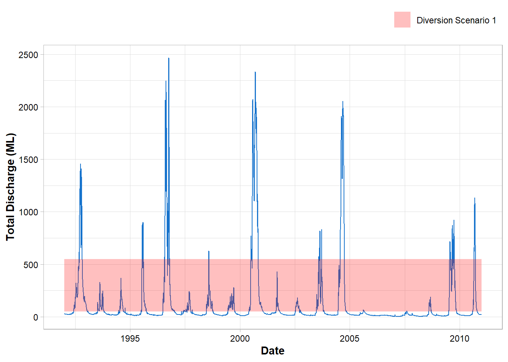

#### Save the plot {-}


```r
ggsave(
  filename = "dischargeDiversion1.pdf",
  width = 297,
  height = 210,
  units = 'mm',
  scale = 0.8
  )
```


## Barcharts and Pipes {-}

#### Reload the data {-}


```r
envFlow  <- read_xls(path = "envFlowData.xls", sheet = 1)
```

#### Use pipes and `mutate()` to reformat the date {-}

- The pipe (`%>%`) operator takes the output from one function and makes it the input of the next 
- Pipes can be used across the tidyverse when working with tidy data
- `mutate()` is used to add or remove variables when working with pipes
- This is the same as `envFlow$date <- ymd(envFlow$date)` but it's 'pipeable'!


```r
envFlow %>% 
  mutate(date = ymd(date)) 
```

```
## # A tibble: 6,940 × 2
##    date       totalDischarge
##    <date>              <dbl>
##  1 1992-01-01           26.6
##  2 1992-01-02           26.8
##  3 1992-01-03           27.3
##  4 1992-01-04           27.0
##  5 1992-01-05           26.5
##  6 1992-01-06           26.8
##  7 1992-01-07           27.1
##  8 1992-01-08           26.8
##  9 1992-01-09           26.7
## 10 1992-01-10           26.0
## # … with 6,930 more rows
## # ℹ Use `print(n = ...)` to see more rows
```

#### Extract the years {-}

- `year()` returns the numerical year from date formatted data


```r
envFlow %>% 
  mutate(date = ymd(date)) %>% 
  mutate(year = year(date))
```

```
## # A tibble: 6,940 × 3
##    date       totalDischarge  year
##    <date>              <dbl> <dbl>
##  1 1992-01-01           26.6  1992
##  2 1992-01-02           26.8  1992
##  3 1992-01-03           27.3  1992
##  4 1992-01-04           27.0  1992
##  5 1992-01-05           26.5  1992
##  6 1992-01-06           26.8  1992
##  7 1992-01-07           27.1  1992
##  8 1992-01-08           26.8  1992
##  9 1992-01-09           26.7  1992
## 10 1992-01-10           26.0  1992
## # … with 6,930 more rows
## # ℹ Use `print(n = ...)` to see more rows
```


#### Pipes are non-destructive {-}

- Notice how `envFlow` is unchanged? This is useful when performing 'data exploration' as the original dataframe never altered


```r
head(envFlow)
```

```
## # A tibble: 6 × 2
##   date       totalDischarge
##   <chr>               <dbl>
## 1 1992-01-01           26.6
## 2 1992-01-02           26.8
## 3 1992-01-03           27.3
## 4 1992-01-04           27.0
## 5 1992-01-05           26.5
## 6 1992-01-06           26.8
```

#### Group and summarise {-}

- Group the data by new `year` column and calculate summary statistics with `summarise()`


```r
envFlow %>% 
  mutate(date = ymd(date)) %>% 
  mutate(year = year(date)) %>% 
  group_by(year) %>% 
  summarise(totalDischarge = sum(totalDischarge))
```

```
## # A tibble: 19 × 2
##     year totalDischarge
##    <dbl>          <dbl>
##  1  1992         89538.
##  2  1993         21042.
##  3  1994         16511.
##  4  1995         31838.
##  5  1996        128586.
##  6  1997         18061.
##  7  1998         23067.
##  8  1999         19090.
##  9  2000        189366.
## 10  2001         17462.
## 11  2002         13946.
## 12  2003         39874.
## 13  2004        124288.
## 14  2005          8567.
## 15  2006          4182.
## 16  2007          5221.
## 17  2008          8418.
## 18  2009         62334.
## 19  2010         33940.
```

#### Plot using `geom_col()` {-}

- Pipe this into `ggplot()`
- Note that we don't need to specify the `data` argument to `ggplot()`


```r
envFlow %>% 
  mutate(date = ymd(date)) %>% 
  mutate(year = year(date)) %>% 
  group_by(year) %>% 
  summarise(totalDischarge = sum(totalDischarge)) %>% 
  ggplot(mapping = aes(x = year, y = totalDischarge)) +
  geom_col(fill = "dodgerblue3") 
```

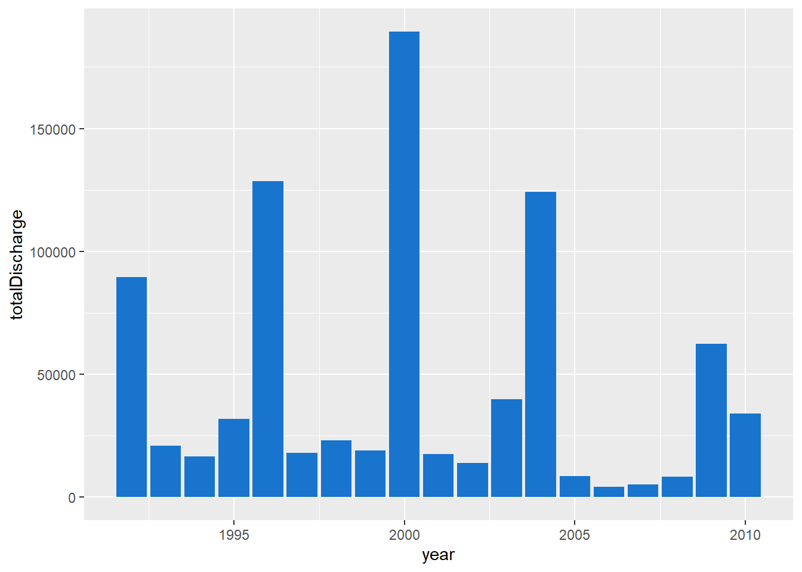

#### Apply the previous theme {-}


```r
envFlow %>% 
  mutate(date = ymd(date)) %>% 
  mutate(year = year(date)) %>% 
  group_by(year) %>% 
  summarise(totalDischarge = sum(totalDischarge)) %>% 
  ggplot(mapping = aes(x = year, y = totalDischarge)) +
  geom_col(fill = "dodgerblue3") +
  labs(x="Year", y = 'Total Discharge (ML)')+
  theme_light() +
  theme(
    axis.title = element_text(face = "bold"),
    axis.text = element_text(colour = "black")
  )
```

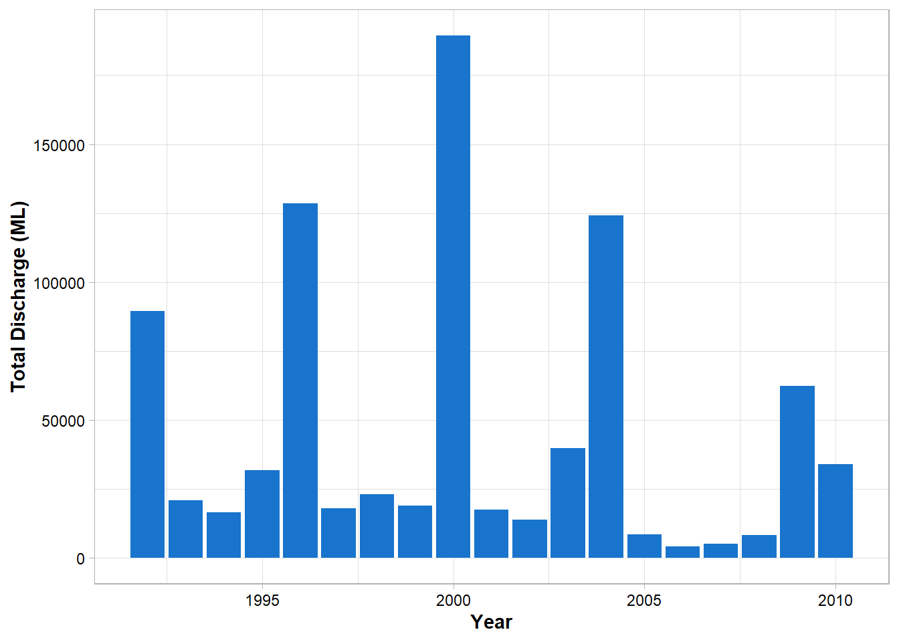

#### Recap {-}


```r
read_xls(path = "envFlowData.xls", sheet = 1) %>%
  mutate(date = ymd(date)) %>% 
  mutate(year = year(date)) %>% 
  group_by(year) %>% 
  summarise(totalDischarge = sum(totalDischarge)) %>% 
  ggplot(mapping = aes(x = year, y = totalDischarge)) +
  geom_col(fill = "dodgerblue3") +
  labs(x="Year", y = 'Total Discharge (ML)')+
  theme_light() +
  theme(
    axis.title = element_text(face = "bold"),
    axis.text = element_text(colour = "black")
  )
```

<!--chapter:end:learntidyverse.Rmd-->

# Modelling Quokkas in R {#quokkas -}

### Setting up {-}

#### Create a new R script {-}

- Go *File -> New File -> R Script*
- Load the tidyverse


```r
library(tidyverse)
```

#### Declare the constants as variables {-}


```r
birthRate  <- 1
deathRate  <- 0.1
timestep  <- 1 # i.e. 1 year
timeMax <- 30
carryCap  <- 10000
```

#### Create a new data frame of the initial values {-}

- A data frame is simply a table
- `year`, `relativeCarryCap`, `quokkaRate`, and `quokkaRate` will be created as new columns in that table
- Inspect `model` with the `head()` function


```r
model  <- data.frame(
    year = 1,
    relativeCarryCap  = NA,
    quokkaRate = NA,
    quokkaPop = 5
)

head(model)
```

```
##   year relativeCarryCap quokkaRate quokkaPop
## 1    1               NA         NA         5
```

### Modelling {-}

#### Calculate the next timestep {-}

For the next time step we'll need to compute new values for `year`, `relativeCarryCap`, `quokkaRate`, and `quokkaPop`. These values will be appended as a new row (i.e. timestep) to the `model` data frame.

- `year`takes a value of 2


```r
year <- 2
```

- `relativeCarryCap` is the result of the previous quokka population divided by the carrying capacity
- `model$quokkaPop[1]` specifies the population in the previous row (row 1) i.e. the previous time step


```r
relativeCarryCap  <-  model$quokkaPop[1]/carryCap
```

- `quokkaRate` and `quokkaPop` are calculated in the same fashion i.e. using the constants and values in the previous row of the `model` data frame


```r
quokkaRate <- timestep*((1-relativeCarryCap)*birthRate*model$quokkaPop[1]-(deathRate*model$quokkaPop[1]))

quokkaPop <-  quokkaRate+model$quokkaPop[1]
```

- Next, we'll create an identical data frame to `model` with our new values


```r
model_temp  <- data.frame(
        year = year,
        relativeCarryCap = relativeCarryCap,
        quokkaRate = quokkaRate,
        quokkaPop = quokkaPop
    )

head(model_temp)
```

```
##   year relativeCarryCap quokkaRate quokkaPop
## 1    2            5e-04     4.4975    9.4975
```

- We can append this time step to `model` by using the `rbind()` function


```r
model  <- rbind(model,model_temp)
head(model)
```

```
##   year relativeCarryCap quokkaRate quokkaPop
## 1    1               NA         NA    5.0000
## 2    2            5e-04     4.4975    9.4975
```

### Speeding things up {-}

Want to repeat that process for the next 29 time steps? Probably not. Let's create a loop that iterates through each year, calculates the new values, and appends them to the `model` data frame.


```r
for(i in 2:timeMax){

    year  <- i
    relativeCarryCap  <-  model$quokkaPop[i-1]/carryCap
    quokkaRate = timestep*((1-relativeCarryCap)*birthRate*model$quokkaPop[i-1]-(deathRate*model$quokkaPop[i-1]))
    quokkaPop = quokkaRate+model$quokkaPop[i-1]

    model_temp  <- data.frame(
        year = year,
        relativeCarryCap = relativeCarryCap,
        quokkaRate = quokkaRate,
        quokkaPop = quokkaPop
    )

    model  <- rbind(model,model_temp)

}
```

### Visualise the modelled populations with ggplot {-}


```r
ggplot(data=model,mapping=aes(x=year,y=quokkaPop))+
    geom_line()+
    labs(x="Year", y="Quokka population")+
    theme_light()
```


<!--chapter:end:modelquokkas.Rmd-->

\backmatter


# References {#references -}


<!--chapter:end:references.Rmd-->

