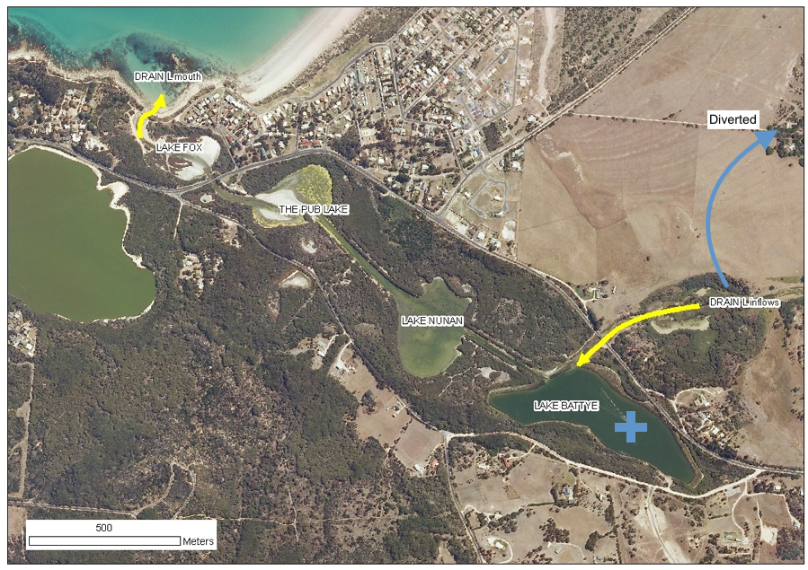

# Module 1: Modelling in Excel {-}

## Environmental Flows to an Estuary {-}

### Objectives {-}

Become familiar with basic spreadsheet commands in Excel by conducting an environmental flow analysis and building a simple impact model.

### What is an environmental flow? {-}

Lakes, rivers and estuaries are adapted to receive water based on the natural hydrological condition, but often water is required upstream for other purposes. An environmental flow is water that is provided to the environment to maintain its health and natural diversity

### Module resources {-}

Download the Excel spreadsheet: [MODULE01_EnvFlowData.xls](./resources/module1/WEEK01_EnvFlowData.xls)

### Case study {-}

{width=650px}

### Exercises {-}

You are given a time-series of daily river flow and need to assess how different diversion scenarios impact the freshwater flow delivery to a down stream estuary.

1) For this flow time-series, calculate the **volume of daily flow** within the following bands
0-40; 40-80; 80-120; 120-200; 200-400; 400-1000; >1000

\BeginKnitrBlock{rmdtip}
Use Nested “IF” statement in adjacent columns to partition flows
\EndKnitrBlock{rmdtip}

<video width="500" height="400" controls>
  <source src="images/02-module1/video1.mp4" type="video/mp4">
</video>

2) For this flow time-series, calculate the **number of days** daily flow within the above bands and work out **annual average number of days**

\BeginKnitrBlock{rmdtip}
Use COUNT() to get the number of entries in the column
\EndKnitrBlock{rmdtip}

3) Calculate the **annual amount of flow** in total and in each band

You may do the annual averaging manually or the pivot table method. For the pivot table method: Insert a new column B, Label it Year.
Type the year number into the first cell, make sure it is formatted as a number.

Click two times on the little square in the corner of the box.  This will fill down the page.
Repeat this at each year change and you will have the year only information which you can then use to summarise data.  As the original date has day numbers and decimal time each one is unique so you end up with a record for each day.  This way you get a record for each year.

Highlight all the data.  It must have headings for each column or it won’t work.
Go to “Insert” then “Pivot Table”. Click OK as you want the default settings.
Then you just fiddle until you get what you want.  The following is an example:

4) **Sort the years** from highest to lowest flow:
    a. Add a new column next to the flows indexing the years sequentially 
    b. Add a new column next to the indices calculating the probability of meeting the annual flow: $P(Yri) =  \frac{i}{\text{number of years}+1}$
    c. Scatter plot the flow vs probability curve.
5) Assess the amount of water available for **flow diversion for two scenarios** by adding a new time-series column for each option:
    a. Water below 50 ML/day and above 550 ML/day is NOT diverted
    b. Water below 150 ML/day and above 1000 ML/day is NOT diverted
6) Add two new columns for each of the above to work out **cumulative amount** of diverted water
    a. $X^{+1} = X +dX$
7) Create a scatter plot of historical salinity (as EC) collected from the site marked in the map (+) vs daily discharge from the drain (see sheet: Estuary – Salinity).
8) Fit a trendline to the data and display equation and R^2^ – this is a statistical model.
9) In a new time-series column in the previous sheet, use the statistical model from above to predict a salinity time-series for the above station in the estuary under the two diversion scenarios compared to the base case.

