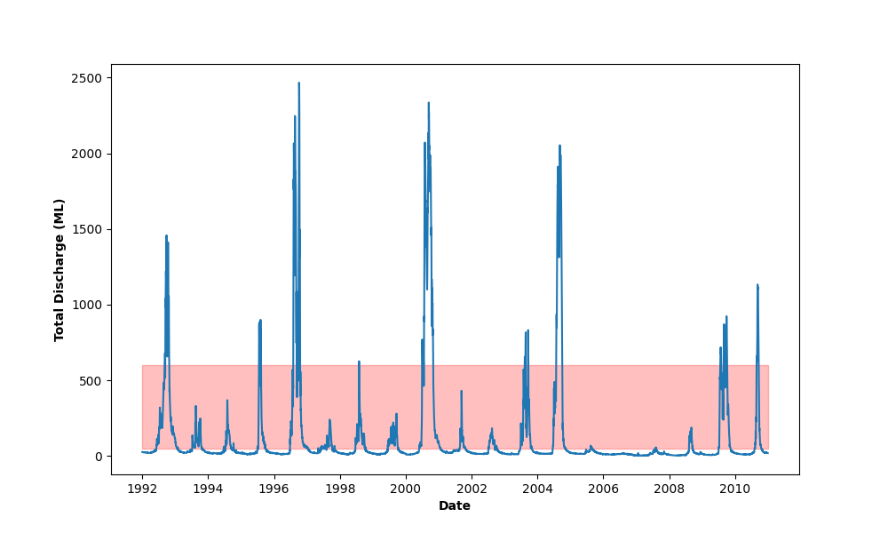
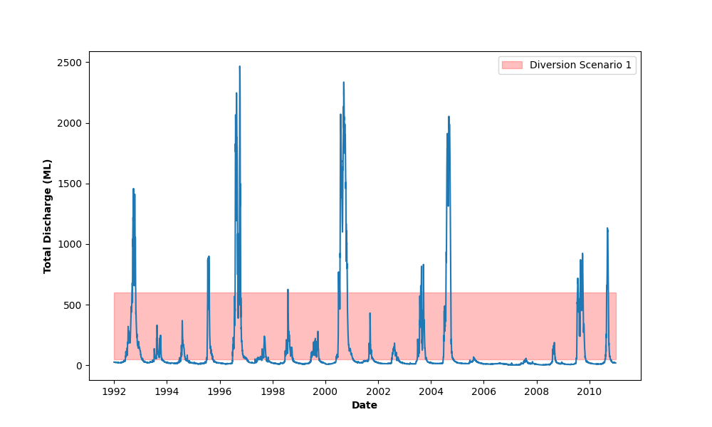

# Learning to plot with python {#pythonplot .unnumbered}

Introduce Python...

## Visualising Module 1 Flow Data {-}

### Setting up {-}

#### Creating a `.py` file with VS Code {-}

1) Refer to the Getting Started section, to install python and its packages, and Visual Studio Code (VSC)
2) Open Visual Studio Code, the go *File -> Open Folder* then open the folder where you will store your files for this exercise (*ENVT3362_workshop_2*)
3) Download the spreadsheet for this workshop [here](envFlowData.xls)
4) Move this to your *ENVT3362_workshop_2* directory
5) Make a new python file in VSC. Go *File -> New File -> New python file* and save a file as a '.py'
6) Open two new terminals. Open one as python and one as powershell.

### Importing and formatting the data {-}

#### Load the necessary packages {-}

Add these commands to the top of your python file.

```{python, eval=FALSE, python.reticulate=FALSE} 
import pandas as pd
import matplotlib.pyplot as plt 
import matplotlib.dates as mdates 
import matplotlib.patches as patches

from datetime import datetime
```

Run these lines by pressing `Shift Enter`, one by one.

If this doesn't work, it may be that the location of your python files is not being found. To fix this, in the VSC powershell terminal, use a python command starting with the location of your python program location. For example:

```
C:\Users\Jimmy\AppData\python\python.exe 
import pandas as pd
```

Similarly you may need to specify the whole file path to pip in powershell, for example:

```
C:\Users\Jimmy\AppData\python\pip3.exe 
```

#### Import the spreadsheet {-}

Load the spreadsheet into your python environment.

```{python, eval=FALSE, python.reticulate=FALSE} 
env_flow = pd.read_excel("envFlowData.xls")
```

#### Inspect the data {-}

Display a header of the data.

```{python, eval=FALSE, python.reticulate=FALSE} 
print(env_flow)
``` 

```
            date  totalDischarge
0     1992-01-01          26.599
1     1992-01-02          26.849
2     1992-01-03          27.274
3     1992-01-04          26.988
4     1992-01-05          26.463
...          ...             ...
6935  2010-12-27          20.005
6936  2010-12-28          20.116
6937  2010-12-29          19.736
6938  2010-12-30          19.828
6939  2010-12-31          19.617

[6940 rows x 2 columns]
```

#### Format the date {-}

Format the date in a way that looks good in the figure. Capital Y means a year with four digits, lower case y would be two digits. 'for t' means to apply this command to each line. This is like a 'for loop' in R. In python this is referred to as 'list comprehension'. 'strptime' is a standard formatting for dates and times, converting text strings into a 'date time object'.

```{python, eval=FALSE, python.reticulate=FALSE} 
env_flow["date"] = [
    datetime.strptime(t, "%Y-%m-%d") for t in env_flow["date"]
]
```

### Plotting with matplotlib {-}

#### Create Figure and Axes objects {-}

The 'fig' is our figure object, and the 'ax' is our axis object. We are naming them and assigning properties to them in this step. 'plt.subplots' is a function from the python *matplotlib* library. 

```{python, eval=FALSE, python.reticulate=FALSE} 
fig, ax = plt.subplots(figsize=(10, 6))
```

#### Plot the data to the Axes object (`ax`) {-}

Apply the 'plot' command to the 'ax' object that we created above.
Apply the 'savefig' command to the 'fig' object that we created above.

```{python, eval=FALSE, python.reticulate=FALSE} 
ax.plot(env_flow["date"], env_flow["totalDischarge"])
fig.savefig("env_flow.png")
```

<center>
{width=100%}
</center>
    
This should save a figure as a .png file, 'env_flow.png', to your working directory. See if you can open it and take a look at it. 

#### Change the colour {-}

Now that your basic plot is working, you can start editing it. It defaults to a light blue line: let's change it to a green line by adding the parameter 'color' to the 'plot' method, to the 'ax' object.

```{python, eval=FALSE, python.reticulate=FALSE} 
fig, ax = plt.subplots(figsize=(10, 6))
ax.plot(env_flow["date"], env_flow["totalDischarge"], color="green")
fig.savefig("env_flow.png")
```

<center>
{width=100%}
</center>

#### Fix the labels {-}

Add labels to the axes, using the set_xlabel command. Make the labels bold using the parameter 'fontweight'. 

```{python, eval=FALSE, python.reticulate=FALSE} 
fig, ax = plt.subplots(figsize=(10, 6))
ax.plot(env_flow["date"], env_flow["totalDischarge"], color="green")
ax.set_xlabel("Date", fontweight="bold")
ax.set_ylabel("Total Discharge (ML)", fontweight="bold")
fig.savefig("env_flow.png")
```

<center>
{width=100%}
</center>

### Visualising Diversion Scenarios {-}

Add a pale red box to show the flow smaller than 550 ML. 

```{python, eval=FALSE, python.reticulate=FALSE} 
fig, ax = plt.subplots(figsize=(10, 6))
ax.plot(env_flow["date"], env_flow["totalDischarge"])

rect = patches.Rectangle(
    xy=(mdates.date2num(env_flow["date"][0]), 50), # This is the bottom left-hand corner
    width=len(env_flow["date"]), # This is the length of this list (number of dates)
    height=550, # This is the volume of flow in ML
    linewidth=1, 
    edgecolor='red', 
    facecolor='red',
    alpha=0.25, # This is the opacity of the colour, scaling from 0 to 1.
)
ax.add_patch(rect)
ax.set_xlabel("Date", fontweight='bold')
ax.set_ylabel("Total Discharge (ML)", fontweight='bold')
fig.savefig("env_flow.png")
```

<center>
{width=100%}
</center>

#### Add a legend to the diversion scenario {-}

Add the legend to the diversion scenario. 

```{python, eval=FALSE, python.reticulate=FALSE} 
fig, ax = plt.subplots(figsize=(10, 6))
ax.plot(env_flow["date"], env_flow["totalDischarge"])

rect = patches.Rectangle(
    xy=(mdates.date2num(env_flow["date"][0]), 50), # This is the bottom left-hand corner
    width=len(env_flow["date"]), # This is the length of this list (number of dates)
    height=550, # This is the volume of flow in ML
    linewidth=1, 
    edgecolor='red', 
    facecolor='red',
    alpha=0.25,
    label="Diversion Scenario 1" # This is the text in the label
)
ax.add_patch(rect)
ax.set_xlabel("Date", fontweight='bold')
ax.set_ylabel("Total Discharge (ML)", fontweight='bold')
plt.legend()
fig.savefig("env_flow.png")
```

<center>
{width=100%}
</center>

### Exercise: which language is better? {-} 
Start an argument with the person sitting next to you. Is R or python easier to use?


