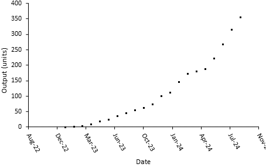
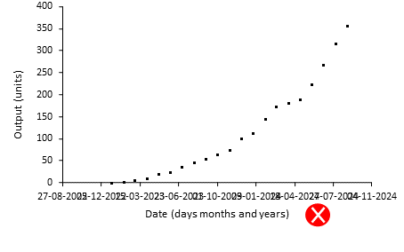
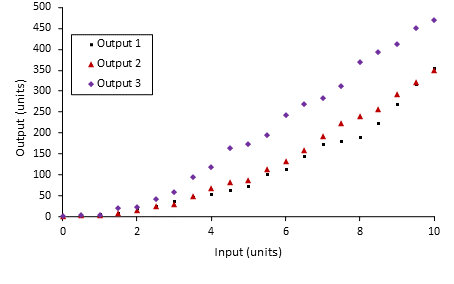
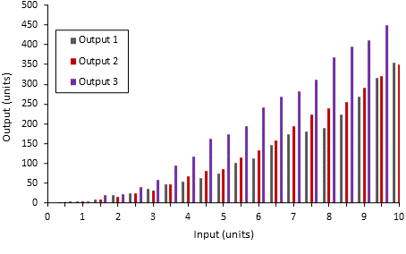
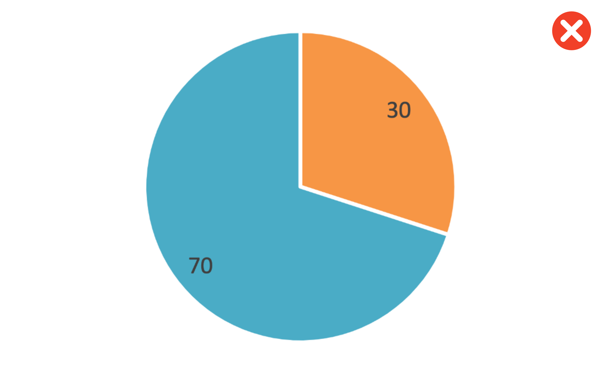

# Style Guide {#StyleGuide .unnumbered}

## Text {.unnumbered}

### Units {.unnumbered}

Leave a space between a numeral and a unit. For example, 100 m^3^, not 100m^3^. For inverse units use a slash or a negative power, but be consistent throughout your text. For example 100 L/d or 100 L d^-1^. Pay attention to capital letters: there is a billion-fold difference between mL and ML (millilitres and megalitres). Do not leave a space between a numeral and %. For example, 100%, not 100 %.

Capital M as a unit is known as molar. It is an abbreviation of mol L^-1^. mM is the same as mmol L^-1^, or 1 $\times$ 10^-3^ M.

### Chemicals {.unnumbered}

Elements, compounds and molecules do not start with capital letters. An abbreviation or a chemical symbol has capital letters. Multiple elements in a compound have a subscript and charged molecules have a superscript. For example, carbonate, CO~3~^2-^.

### Fonts {.unnumbered}

Pick an appropriate Seriff or Sans-Seriff font with a size of **12pt**. Commonly used fonts include Arial, Helvetica, Times New Roman and Garamond.

<center>{width="50%"}</center>

Do not use stylised fonts - you know the ones!

<center>{width="35%"}</center>

### Paragraphs {.unnumbered}

Format your paragraphs with the following:

-   **Line spacing:** 1.5pt
-   **Section headings:** 14pt font size and in bold
-   **Margins:** 2cm margins on all sides i.e. top, bottom, left, and right margins

<center>{width="80%"}</center>

Use consistent approach when capatalising your headers/titles:

-   Capitalise at least the first and last word
-   Don't capitalise conjunctions, prepositions, and articles (e.g. the, an, a)

<center>{width="75%"}</center>

## Figures {.unnumbered}

### Positioning

Put the figure after it is referred to in the text for the first time, so that the figure is below. Refer to every figure and make sure the figure caption is updated to the right number.

### 3D {.unnumbered}

Do not use 3D plots to visualise your data! They easily misrepresent data and, more often than not, look visually jarring. They can be appropriate for certain types of scatterplots or surface plots when there is a third dimension to the data.

### Colour {.unnumbered}

Rarely are the defaults the best choice for your figure.

When selecting a colour palette:

-   Consider the saturation and brightness of your colours

-   Be considerate of colour blindness and of how colours are commonly interpreted, i.e. if you were mapping surface temperatures you would not use red to colour the cold areas and blue for the hot

-   Use black font and black lines for the axes

-   Do not put a border around the figure

### Captions {.unnumbered}

Captions are positioned below a figure and above a table. They contain a useful description to assist the interpretation of the figure or table. Do not include a title as your caption renders this redundant!

### Timeseries axis {.unnumbered}

If you have a date axis, arrange the dates so that they can be read.

{width="80%"}

Do not let them all crash into each other.

If you have a timespan of many years, do not include days and months in the date tick label. For example, between 1950 and 2000, it does not matter to the reader that a point occurred on 1 January.

{width="80%"}

### Multipanel plots {.unnumbered}

### Unnecessary regressions {.unnumbered}

Do not include a trendline for a series of data that you have calculated yourself. If y = 2x, and you calculate y over a series of x values, a linear regression of this calculation will give you a formula of 2x, with an r^2^ of 1. This regression is not helpful.

{width="80%"}

### Good graphs {.unnumbered}

Include axis labels, with units. Use a legend if you have more than one data series. Spread your tick marks out nicely. Use black lines for the axes and black font for the text.

{width="80%"}

{width="80%"}

### Bad graphs {.unnumbered}

The following graphs leave a lot to be desired! They misrepresent data, lack critical details, and are visually jarring. Take a look at each and read the marker's feedback to get an idea of how your graphs will be assessed.

**Figure 1:**

<center>{width="80%"}</center>

Feedback:

-   This is a graph of one number on a completely arbitrary scale
-   We've been told it's the total 3 times but not what it's a total of!
-   5 decimal places! With the scale of this y-axis decimal places are serving no useful purpose here
-   There's no units or y-axis label and a title has been used instead of a figure caption

**Figure 2:**

<center>{width="80%"}</center>

Feedback:

-   A 3D visualisation is being used for 2D data
-   No axis labels or units
-   Missing a legend for the two lines plotted

**Figure 3:**

<center>{width="80%"}</center>

Feedback:

-   A pie chart of what?
-   Missing units and a legend
-   Pie charts are a poor choice of visualisation for comparing numbers. The human eye is much less able to distinguish differences of scale for data represented as sectors of a circle compared to rectangles on a bar chart

### Superfluous images {.unnumbered}

Unless specified, your assessments are not picture books! Do not use figures to arbitrarily lengthen your report and add visual clutter. Justify the purpose of each figure you include. When used well, figures should support your writing and illustrate key points to the reader.

<center>{width="80%"}</center>

## Tables {.unnumbered}

All tables must be styled as per the following:

-   **Table font size:** All table information is to be in 10pt font
-   **Line spacing:** Within a table, line spacing is to single line spacing
-   **Decimals:** Within a table column a common decimal place format is to be used
-   **Heading separator:** A single solid line is to be used to separate column headings from numbers
-   **Caption location:** The table caption must be placed above the table
-   **Caption label font:** The caption label is to be in 12pt font
-   **Caption label line spacing:** The caption label line spacing is to be single line spacing
-   **Sub-groups:** Identification of subgroups with a line is optional
-   **Pooled group:** Identification of a pooled group with a dashed line is optional

<center>

```{r styleguide-table, echo=FALSE, fig.cap="", out.width = '100%', out.extra='data-action="zoom"'}
knitr::include_graphics("images/styleguide/table.png")
```

</center>

## Referencing {.unnumbered}

When completing academic work it is essential that you refer to the sources of information within your text, and professionally adhere to referencing standards. Marks will be deducted for inadequate, or poor quality referencing. Complete details of these works should be arranged alphabetically in a reference list at the end of any document or report you submit.

You are permitted to use Harvard or APA reference style. The choice is up to you as long as it is used consistently throughout the document.

1)  When referring to a specific page or pages of a reference:

> Labaree (2006, p. 17) disputed the evidence.

> The findings are suppored in the literature (Labaree, 2006, p.17-18).

2)  When referring to more than one work by the same author(s):

> Fink and Brayman (2004, 2006) expressed similar doubts.

3)  When referring to more than one work in the same year:

> Research in this field has progressed rapidly (Hargreave,s 2005a) (Hargreaves 2005b).

4)  When there are two authors:

> There is mounting evidence of these trends (Tilbury & Wortman, 2003).

> The study built on earlier work by Tilbury and Wortman (2003).

5)  When there are three or more authors:

> New research as revealed substantial differences (Leithwood et al., 1999).

6)  When referring to a publication that has no specific author, but which was written by an organization:

> Global concern is increasing (UNESCO, 1992).

7)  When citing 3 or more works that support the same argument:

> There is a strong concensus in the literature (Andrews, 2015; Brown & Baldwin, 2012; Carter et al., 2016).

## Submissions {.unnumbered}

When uploading your assessments, only submit your work in PDF format - not Word's *.docx*. In Word, you can export your documents to PDF via *File -\> Save As... -\> File Format -\> PDF -\> Save*.

<center>{width="80%"}</center>
