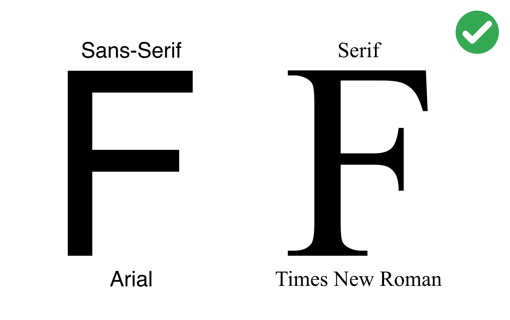
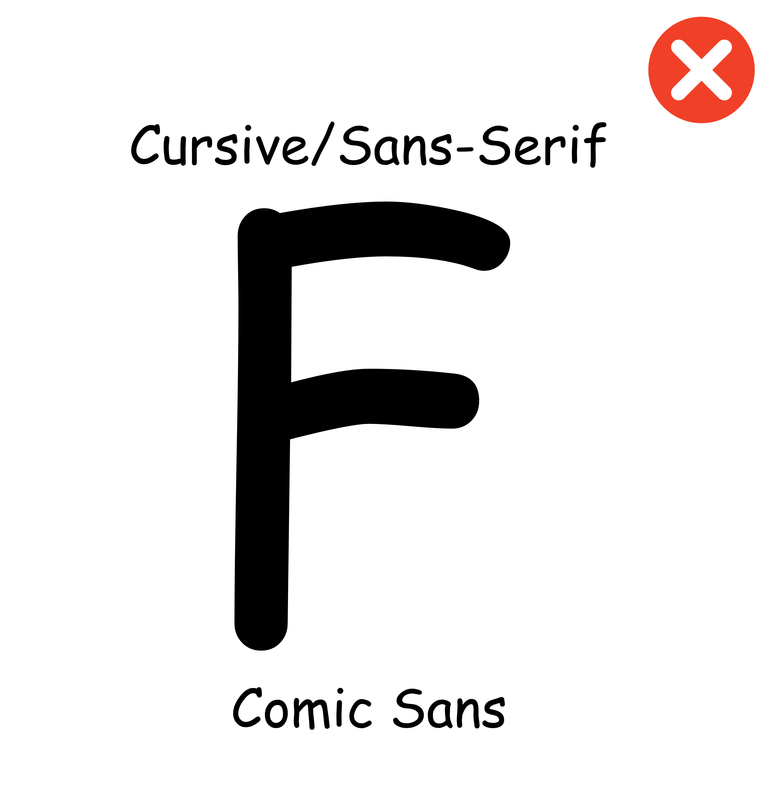
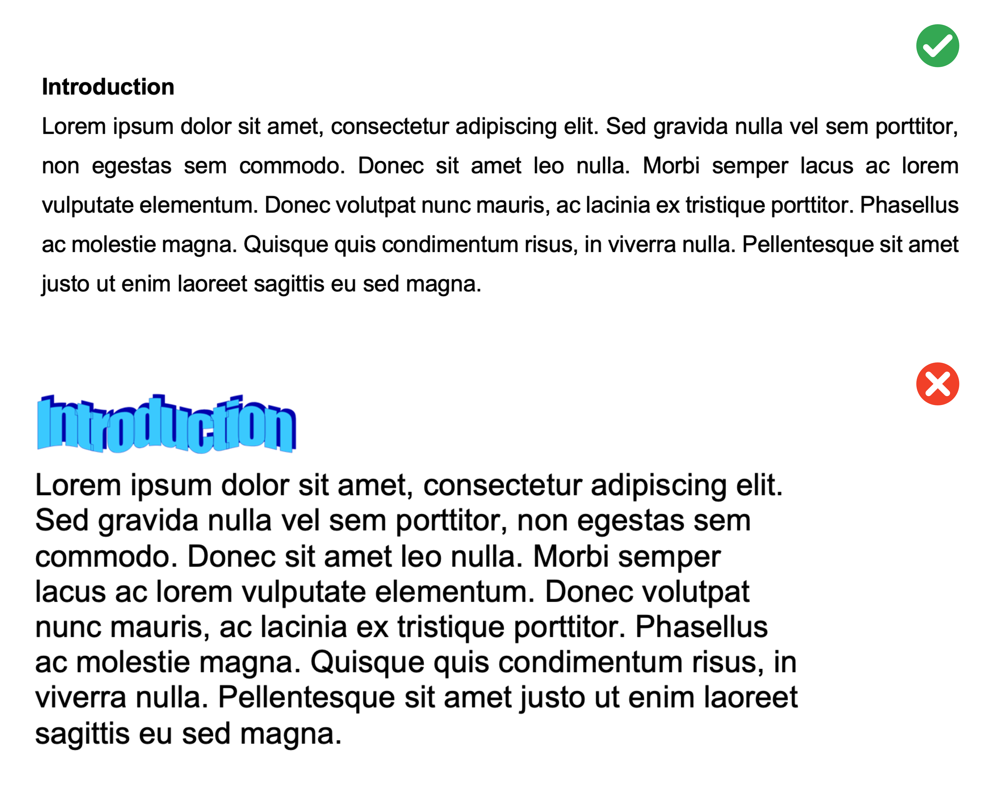
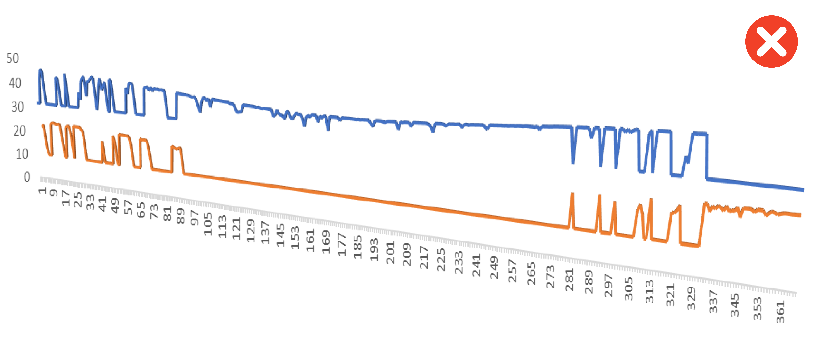

# Style Guide {#StyleGuide -}

## Text {-}

### Fonts {-}

Pick an appropriate Seriff or Sans-Seriff font with a size of **12pt**. Commonly used fonts include Arial, Helvetica, Times New Roman and Garamond.

<center>
{width=50% }
</center>

Do not use stylised fonts - you know the ones!

<center>
{width=35% }
</center>

### Paragraphs {-}

Format your paragraphs with the following:

- **Line spacing:** 1.5pt
- **Section headings:** 14pt font size and in bold
- **Margins:** 2cm margins on all sides i.e. top, bottom, left, and right margins

<center>
{width=80% }
</center>


## Figures {-}

### Good Graphs {-}

### Bad Graphs {-}

The following graphs leave a lot to be desired! They misrepresent data, lack critical details, and are visually jarring. Take a look at each and read the marker's feedback to get an idea of how your graphs will be assessed.

**Figure 1:**
<center>
{width=80% }
</center>
Feedback:

- This is a graph of one number on a completely arbitrary scale
- We've been told it's the total 3 times but not what it's a total of!
- 5 decimal places! With the scale of this y-axis decimal places are serving no useful purpose here
- There's no units or y-axis label and a title has been used instead of a figure caption

**Figure 2:**
<center>
{width=80%}
</center>
Feedback:

- A 3D visualisation is being used for 2D data
- No axis labels or units
- Missing a legend for the two lines plotted

**Figure 3:**
<center>
{width=80% }
</center>
Feedback:

- A pie chart of what?
- Missing units and a legend
- Pie charts are a poor choice of visualisation for comparing numbers. The human eye is much less able to distinguish differences of scale for data represented as sectors of a circle compared to rectangles on a bar chart


## Tables {-}

All tables must be styled as per the following:

- **Table font size:** All table information is to be in 10pt font
- **Line spacing:** Within a table, line spacing is to single line spacing
- **Decimals:** Within a table column a common decimal place format is to be used
- **Heading separator:** A single solid line is to be used to separate column headings from numbers
- **Caption location:** The table caption must be placed above the table
- **Caption label font:** The caption label is to be in 12pt font
- **Caption label line spacing:** The caption label line spacing is to be single line spacing
- **Sub-groups:** Identification of subgroups with a line is optional
- **Pooled group:** Identification of a pooled group with a dashed line is optional

<center>
```{r styleguide-table, echo=FALSE, fig.cap="", out.width = '100%', out.extra='data-action="zoom"'}
knitr::include_graphics("images/styleguide/table.png")
```
</center>

## Submissions {-}

When uploading your assessments, only submit your work in PDF format - not Word's *.docx*. In Word, you can export your documents to PDF via *File -> Save As... -> File Format -> PDF -> Save*.

<center>
{width=80% }
</center>